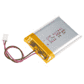
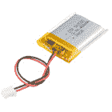

# 脂肪充电器加连接指南

> 原文：<https://learn.sparkfun.com/tutorials/lipo-charger-plus-hookup-guide>

## 介绍

[SparkFun LiPo 充电器 Plus](https://www.sparkfun.com/products/15217) 是单节锂聚合物(LiPo)电池充电器 SparkFun 系列中的增强电源选项。在这次迭代中，我们将输入充电连接器更改为 USB-C，并提供充电速率选择以及可选的热保护。充电、电源和完成指示灯清楚地显示充电过程的状态。

有电池吗？我们充电吧！

 

将**添加到您的[购物车](https://www.sparkfun.com/cart)中！**

### [【火花乐趣脂质充电加】](https://www.sparkfun.com/products/15217)

[34 available](https://learn.sparkfun.com/static/bubbles/ "34 available") PRT-15217

SparkFun LiPo 充电器 Plus 是 SparkFun 系列单节锂聚合物(LiPo)电池的备用电源选项…

$11.50[Favorited Favorite](# "Add to favorites") 28[Wish List](# "Add to wish list")** **[https://www.youtube.com/embed/xJsiRDoBUss/?autohide=1&border=0&wmode=opaque&enablejsapi=1](https://www.youtube.com/embed/xJsiRDoBUss/?autohide=1&border=0&wmode=opaque&enablejsapi=1)

### 所需材料

只需要一根 [micro-C USB 电缆](https://www.sparkfun.com/products/14743)连接到电脑 USB 端口或[墙壁适配器](https://www.sparkfun.com/products/11456)上，就可以给 LiPo 电池充满电。

 

将**添加到您的[购物车](https://www.sparkfun.com/cart)中！**

### [USB 3.1 线 A 到 C - 3 脚](https://www.sparkfun.com/products/14743)

[In stock](https://learn.sparkfun.com/static/bubbles/ "in stock") CAB-14743

USB C 棒极了。但是，在我们将所有的集线器、充电器和端口转换为 USB C 之前，这是您要使用的电缆…

$5.504[Favorited Favorite](# "Add to favorites") 9[Wish List](# "Add to wish list")**** 

将**添加到您的[购物车](https://www.sparkfun.com/cart)中！**

### [USB 壁式充电器- 5V，1A(黑色)](https://www.sparkfun.com/products/11456)

[In stock](https://learn.sparkfun.com/static/bubbles/ "in stock") TOL-11456

现在 USB 越来越多地被作为一种电源连接标准来实现，但是你并不总是在 han 上有一台计算机…

$4.502[Favorited Favorite](# "Add to favorites") 10[Wish List](# "Add to wish list")**** 

### [USB 2.0 线 A 到 C - 3 脚](https://www.sparkfun.com/products/retired/15092)

[Retired](https://learn.sparkfun.com/static/bubbles/ "Retired") CAB-15092

USB C 棒极了。但是，在我们将所有的集线器、充电器和端口转换为 USB C 之前，这是您要使用的电缆…

**Retired**[Favorited Favorite](# "Add to favorites") 8[Wish List](# "Add to wish list")**** ****我们目录中标称电压为 3.7V 的几款 LiPo 电池:

 

将**添加到您的[购物车](https://www.sparkfun.com/cart)中！**

### [锂离子电池-1Ah](https://www.sparkfun.com/products/13813)

[In stock](https://learn.sparkfun.com/static/bubbles/ "in stock") PRT-13813

基于锂离子化学的超薄超轻电池。每个电池在 1000 毫安时输出 3.7V 的标称电压！

$10.958[Favorited Favorite](# "Add to favorites") 75[Wish List](# "Add to wish list")**** 

将**添加到您的[购物车](https://www.sparkfun.com/cart)中！**

### [锂离子电池- 850mAh](https://www.sparkfun.com/products/13854)

[In stock](https://learn.sparkfun.com/static/bubbles/ "in stock") PRT-13854

这是基于锂离子化学的非常薄、非常轻的电池。每个电池在 850℃时输出 3.7V 的标称电压…

$10.952[Favorited Favorite](# "Add to favorites") 17[Wish List](# "Add to wish list")**** 

将**添加到您的[购物车](https://www.sparkfun.com/cart)中！**

### [锂离子电池- 400mAh](https://www.sparkfun.com/products/13851)

[In stock](https://learn.sparkfun.com/static/bubbles/ "in stock") PRT-13851

这是一种基于锂离子化学的非常小、非常轻的电池，具有目前最高的能量密度…

$5.5010[Favorited Favorite](# "Add to favorites") 41[Wish List](# "Add to wish list")**** 

将**添加到您的[购物车](https://www.sparkfun.com/cart)中！**

### [锂离子电池- 110mAh](https://www.sparkfun.com/products/13853)

[In stock](https://learn.sparkfun.com/static/bubbles/ "in stock") PRT-13853

这是一种基于锂离子化学的非常小、非常轻的电池。这是最高的能量密度电流…

$5.503[Favorited Favorite](# "Add to favorites") 22[Wish List](# "Add to wish list")******** ********### 推荐阅读

如果您不熟悉以下概念，我们建议您在继续之前查看这些教程。

 [### 电压、电流、电阻和欧姆定律](https://learn.sparkfun.com/tutorials/voltage-current-resistance-and-ohms-law) Learn about Ohm's Law, one of the most fundamental equations in all electrical engineering.[Favorited Favorite](# "Add to favorites") 132 [### 电池技术](https://learn.sparkfun.com/tutorials/battery-technologies) The basics behind the batteries used in portable electronic devices: LiPo, NiMH, coin cells, and alkaline.[Favorited Favorite](# "Add to favorites") 50 [### 交流电与直流电(DC)](https://learn.sparkfun.com/tutorials/alternating-current-ac-vs-direct-current-dc) Learn the differences between AC and DC, the history, different ways to generate AC and DC, and examples of applications.[Favorited Favorite](# "Add to favorites") 53

## 硬件概述

作为快速参考，以下是 LiPo Charger Plus 上所用零件的注释图:

| **号** | **描述** |
| one | **充电输入**-MCP 73833 充电器 IC 的输入电压在 **3.75 到 6V** 之间。为了给电池充满电，建议使用 5V 左右的电压。充电 IC 会将电压调低，以安全地为 LiPo 电池充电。 |
| Two | **电源 LED** -当电源接通时，该红色 LED 应亮起。LED 连接到低电平有效 PG(电源良好)引脚，当充电器的输入约为 UVLO (3.7V)阈值且高于电池电压时，该引脚有效。 |
| three | **充电 LED** -当连接电池且充电控制器正在给电池充电时，该 LED 将点亮，否则应熄灭。 |
| four | **Done LED** -电池充满电后，该 LED 将亮起，否则应熄灭。 |
| five | **充电速率选择** -可编程电流调节(**默认:1kω**)。选择电池充电的最大电流量。**详细说明请参见本指南**的费率设置部分。 |
| six | **热敏电阻输入** -内部 50 A 电流源为最常见的 10kΩ负温度系数热敏电阻(NTC)提供偏置。MCP73833 将 THERM 引脚的电压与工厂设置的阈值(通常为 1.20V 和 0.25V)进行比较。**如果使用 NTC 热敏电阻，应移除 10kωSMD 电阻**。 |
| seven | **电池输入** -单节 LiPo 电池可以连接到 JST 连接器或 PTH 引脚。如果使用 PTH 引脚，请密切注意电池/电池座的极性，因为将 LiPo 电池反向连接到充电器会损坏 IC。 |

### 状态指示灯

LiPo Charger Plus 有三个 LED，一个红色的电源 LED 和两个状态 LED。大多数情况下，充电指示灯会在主板为电池充电时亮起，在主板完成充电后熄灭。电路板充电时，完成指示灯会熄灭，充电完成后，指示灯会亮起。有关指示灯状态指示灯的完整列表，请参见下表。

| **充电循环状态** | **充电** | **完成** | **PWR** |
| 关机 | 离开 | 离开 | 离开 |
| 备用的 | 离开 | 离开 | 在…上 |
| 充电进行中 | 在…上 | 离开 | 在…上 |
| 充电完成 | 离开 | 在…上 | 在…上 |
| 温度故障 | 离开 | 离开 | 在…上 |
| 定时器故障 | 离开 | 离开 | 在…上 |
| 系统测试模式 | 在…上 | 在…上 | 在…上 |

### 设置不同的费率

锂电池应以不高于 1C 的速度充电(例如，400 毫安的电池充电速度不应超过 400 毫安)。LiPo Charger Plus 内置一个 1kωSMD 电阻，可将充电速率设置为最大 1000mA。如果您的电池小于 1000mAh，则应移除该电阻器，并用合适的电阻器替换。要确定正确的电阻值，请使用下面的公式或查找表:

| **I_REG (mA)** | **R _ PROG(kω)** |
| One thousand | One |
| Nine hundred | One point one one |
| eight hundred | One point two five |
| Seven hundred | One point four three |
| Six hundred | One point six seven |
| Five hundred | Two |
| four hundred | Two point five |
| Three hundred | Three point three three |
| Two hundred | Five |
| One hundred | Ten |

### 过温保护

MCP73833 有两种形式的热保护，一种用于充电控制器本身，另一种用于电池。充电控制器有一个内部温度传感器，可将当前充电速率最大化至设定的充电速率，而不会过热。当 MCP73833 的芯片温度达到约 95°C 时，充电控制器将降低充电速率以防止过热。过热最有可能发生在充电开始时，此时电池电压最低。随着电源电压和电池电压之间的差值减小，芯片温度将降低，并允许充电电流增加到编程的充电速率。

**Charge Current(I[out]) vs Junction Temperature(T[J])***Image pulled from [MCP73833 Datasheet](https://cdn.sparkfun.com/assets/b/a/7/6/8/MCP73833Datasheet.pdf)*

另一个温度传感器可选用于电池。MCP73833 有一个用于[热敏电阻](https://www.sparkfun.com/products/250)的输入引脚，可以使用[高温胶带](https://www.sparkfun.com/products/10687)将其连接到电池上。充电控制器设计使用的热敏电阻是负温度系数(NTC ),其电阻会随着温度的升高而降低。如果您自己采购 NTC 热敏电阻，请选择 25°c 时电阻为 10kω的 NTC 热敏电阻，要连接 NTC 热敏电阻，请移除 10kωSMD 电阻，并将 NTC 的引线焊接到下面突出显示的 PTH 电阻焊盘。

### 添加散热器

如果充电速率没有达到设定的充电速率，IC 很可能过热，限制了电池的电流。解决这个问题最简单的方法之一就是用我们的[热敏带](https://www.sparkfun.com/products/9771)添加一个[散热片](https://www.sparkfun.com/products/11510)。在电路板底部，MCP73833 下方有一个裸露焊盘。

要添加散热器，首先将隔热带切割成大致尺寸:

剥下其中一层保护层，将散热器贴在隔热带上:

用[业余爱好刀](https://www.sparkfun.com/products/9200)，沿着散热器的周边将胶带切割成最终尺寸:

移除胶带上剩余的保护性覆盖层，并将散热器连接到裸露焊盘上。如果使用支架，您可能需要先安装支架，以确保支架和散热器之间有足够的间隙。

## 解决纷争

**Need help?**

If your product is not working as you expected or you need technical assistance or information, head on over to the [SparkFun Technical Assistance](https://www.sparkfun.com/technical_assistance) page for some initial troubleshooting.

If you don't find what you need there, the [SparkFun Forums](https://forum.sparkfun.com/index.php) are a great place to find and ask for help. If this is your first visit, you'll need to [create a Forum Account](https://forum.sparkfun.com/ucp.php?mode=register) to search product forums and post questions.

## 资源和更进一步

需要更多信息？查看下面的一些链接:

*   [示意图(PDF)](https://cdn.sparkfun.com/assets/f/8/b/5/6/SparkFun_LiPo_Charger_Plus.pdf)
*   [老鹰文件(ZIP)](https://cdn.sparkfun.com/assets/5/f/8/d/8/SparkFun_LiPo_Charger_Plus.zip)
*   [MCP73833 数据手册(PDF)](https://cdn.sparkfun.com/assets/b/a/7/6/8/MCP73833Datasheet.pdf)
*   [SFE 产品视频](https://www.youtube.com/watch?v=xJsiRDoBUss)

查看来自 SparkFun 的其他电源相关教程:

 [### 交流电与直流电(DC)](https://learn.sparkfun.com/tutorials/alternating-current-ac-vs-direct-current-dc) Learn the differences between AC and DC, the history, different ways to generate AC and DC, and examples of applications.[Favorited Favorite](# "Add to favorites") 53 [### ESP32 东西电源控制屏蔽连接指南](https://learn.sparkfun.com/tutorials/esp32-thing-power-control-shield-hookup-guide) This tutorial shows you how to get started with the ESP32 Thing Power Control Shield.[Favorited Favorite](# "Add to favorites") 3 [### Qwiic 四路继电器连接指南](https://learn.sparkfun.com/tutorials/qwiic-quad-relay-hookup-guide) SparkFun’s Qwiic Quad Relay is a product designed for switching not one but four high powered devices from your Arduino or other low powered microcontroller using I2C.[Favorited Favorite](# "Add to favorites") 2 [### 初学者零件套件识别指南](https://learn.sparkfun.com/tutorials/beginner-parts-kit-identification-guide) The essential parts for beginning (or even experienced) hobbyists that gives you all of the basic through-hole components you will need to get started playing with embedded projects. We'll identify a few parts in the kit and provide a few basic circuits to get started 7**************