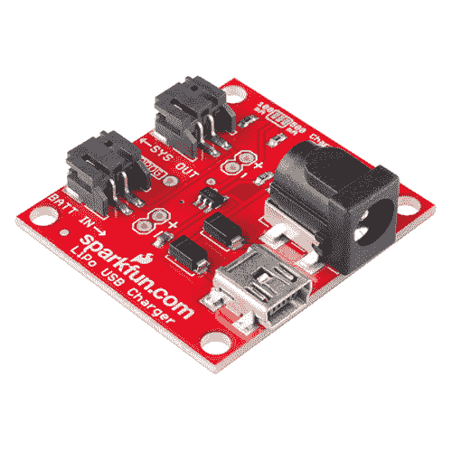
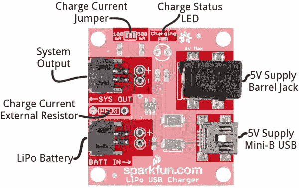
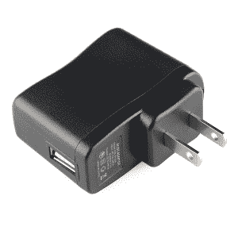
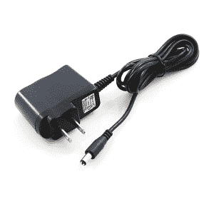
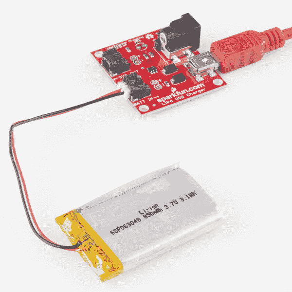
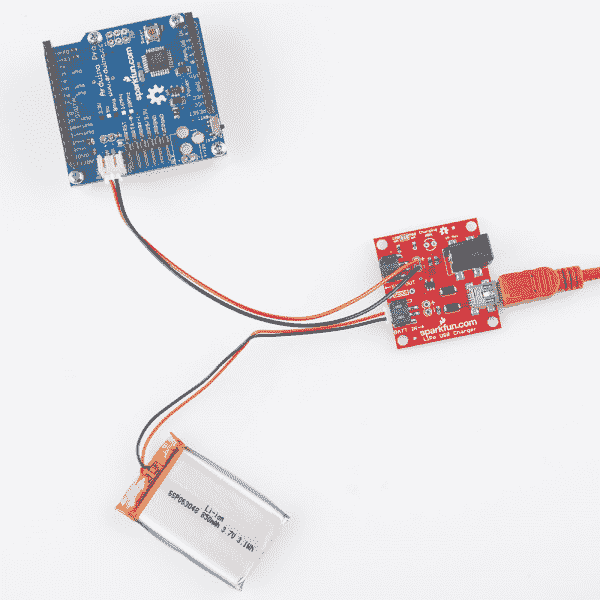
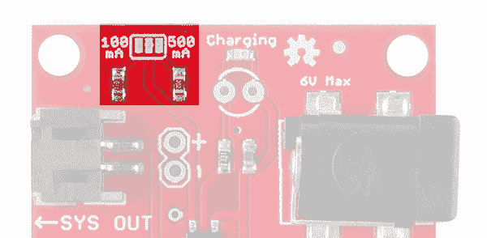
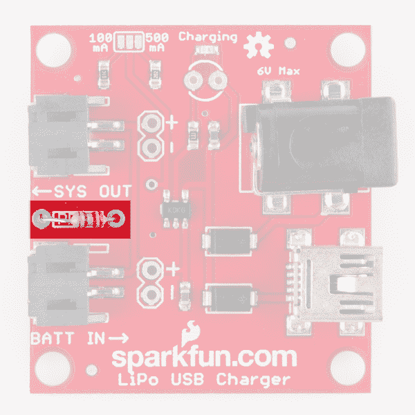
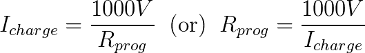

# LiPo USB 充电器连接指南

> 原文：<https://learn.sparkfun.com/tutorials/lipo-usb-charger-hookup-guide>

## 介绍

我们喜欢脂肪电池！他们在一个小而扁平的包装中包装了一个强大的，提供动力的冲头。而且，到时候充电非常容易。如果你想让你的项目变得可移动并易于充电，我们怎么推荐这对组合都不为过:一个 850 mAh 的 LiPo 电池和一个可嵌入的 USB LiPo 充电器。

 

将**添加到您的[购物车](https://www.sparkfun.com/cart)中！**

### [SparkFun USB LiPoly 充电器-单节电池](https://www.sparkfun.com/products/12711)

[In stock](https://learn.sparkfun.com/static/bubbles/ "in stock") PRT-12711

如果你需要给 LiPo 电池充电，这个简单的充电器就能做到，而且很快！SparkFun USB 脂肪充电器是…

$17.958[Favorited Favorite](# "Add to favorites") 33[Wish List](# "Add to wish list")** **本教程将解释如何使用 [USB 脂肪充电器](https://www.sparkfun.com/products/12711)和我们的任何[单节脂肪电池](https://www.sparkfun.com/search/results?term=lithium+polymer+3.7V)。我们将重点关注 [LiPo 充电器和电池零售套件](https://www.sparkfun.com/products/12722)，但这些信息也适用于该充电器和任何兼容电池。

### 所需材料

*   [USB 脂肪充电器](https://www.sparkfun.com/products/12711)
*   一个[单节脂肪电池](https://www.sparkfun.com/search/results?term=lithium+polymer+3.7V)
    *   充电器可以使用任何容量的电池，包括[40 毫安](https://www.sparkfun.com/products/11316)、[110 毫安](https://www.sparkfun.com/products/731)、[400 毫安](https://www.sparkfun.com/products/10718)、[850 毫安](https://www.sparkfun.com/products/341)、[1000 毫安](https://www.sparkfun.com/products/339)、[2000 毫安](https://www.sparkfun.com/products/8483)和[6000 毫安](https://www.sparkfun.com/products/8484)。
*   一个 **5V 电源**，选项包括:
    *   连接有 [mini-B USB 电缆](https://www.sparkfun.com/products/11301)的计算机 USB 端口
    *   A [USB 墙壁适配器](https://www.sparkfun.com/products/11456)和 mini-B 线缆
    *   一个 [5V 壁式电源](https://www.sparkfun.com/products/8269)

### 推荐阅读

 [### 电压、电流、电阻和欧姆定律](https://learn.sparkfun.com/tutorials/voltage-current-resistance-and-ohms-law) Learn about Ohm's Law, one of the most fundamental equations in all electrical engineering.[Favorited Favorite](# "Add to favorites") 132 [### 电池技术](https://learn.sparkfun.com/tutorials/battery-technologies) The basics behind the batteries used in portable electronic devices: LiPo, NiMH, coin cells, and alkaline.[Favorited Favorite](# "Add to favorites") 50 [### 如何为项目提供动力](https://learn.sparkfun.com/tutorials/how-to-power-a-project) A tutorial to help figure out the power requirements of your project.[Favorited Favorite](# "Add to favorites") 67

## 输入和输出

在本页，我们将剖析 USB 充电器，检查所有输入、输出和电路板规格。

### 充电器输入—电源

首先，你需要一些东西给充电器供电，这样它就可以调节电池的电量。将电源连接到这两个输入中的一个:a **桶形插孔**(外径 5.5 毫米，中心杆 2.1 毫米，中心正)或**迷你 B USB** 连接器。

你的电源**供电电压**应该在【4.75 到 6V 之间。一个 5V 的 USB 电源——来自一根 [mini-B 电缆](https://www.sparkfun.com/products/11301)连接到电脑 USB 端口或者[墙壁适配器](https://www.sparkfun.com/products/11456)——是一个完美的电源。或者，如果您想使用桶形插孔输入，我们推荐使用 [5V 墙壁适配器](https://www.sparkfun.com/products/8269)。

 

电源的**电流需求**将取决于你如何[在电路板上设置充电电流](https://learn.sparkfun.com/tutorials/lipo-usb-charger-hookup-guide/setting-the-charge-current)。默认情况下，充电电流设置为**500 毫安**，所以要确保你的电源可以处理。电脑和笔记本电脑的 USB 端口在这里最可疑；500mA 是一个端口可以提供的最大值，通常它们被设置为比这个值更低的输出(例如 100mA)。

您可以安全地将 5V 壁式电源和 USB 电源连接到主板上。保护([二极管还是有的！](https://learn.sparkfun.com/tutorials/diodes))车载，防止反向电流。高压电源将为芯片供电。

**Warning:** While the chip can take up to 6V for the maximum voltage, it can only take 1500mA for the max current. If you use the [6V/2A power supply](https://www.sparkfun.com/products/14158) as the power supply, then you are very likely to burn the chip out on the board. If you need a wall adapter with a barrel jack, then we recommend the [5V/2A power supply](https://www.sparkfun.com/products/12889).

### 充电器输出-单节脂肪电池

将电源连接到充电器后，下一步是连接电池。该板只能为特定的电池充电，确保它满足以下要求:

*   **只有单节电池** -你的 LiPo 应该有大约 3.7V 的标称电压输出，充满电后可以达到 4.2V 左右。也就是说只有单细胞脂肪。如果你有一个[多节电池](https://www.sparkfun.com/products/11855)——标称电压为 7.4V 或更高的东西——这不是你的充电器。

*   **电池化学** -充电器只能使用**锂聚合物或锂离子**电池。
*   **容量考虑** -为了避免爆炸(这只是短暂的乐趣)，你不应该以超过 1C 的电流给这些 LiPos 充电。也就是说，500 毫安的电池充电电流不应超过 500 毫安，100 毫安的电池充电电流不应超过 100 毫安。该板设计为开箱即可充电 500mA，但改变充电速率非常容易。如果您的电池容量低于 500 毫安时，请参阅下一页。

我们所有的兼容电池都配有一个白色的 **JST 连接器**，您可以将它直接插入靠近*电池→* 标签的配套黑色连接器中。如果您的电池端接了一些奇怪的非 JST 连接器，您也可以使用 JST 连接器正后方的**未填充 0.1 英寸间距接头**。如果需要，电线或其他连接器可以[焊接](https://learn.sparkfun.com/tutorials/how-to-solder-through-hole-soldering)到该接头上。

### 系统输出

LiPo USB 充电器被设计成可以方便地**嵌入到项目**中。 *←SYS OUT* 连接器允许您将电池输出连接到项目的其余部分。

*You can use the "SYS OUT" header to power a [3.3V Arduino Pro](https://www.sparkfun.com/products/10914). All while leaving your battery connected to the charger.*

与电池连接一样，您可以使用 JST 连接器或附近的 0.1 英寸间距接头来连接您的项目。

*SYS OUT* 输出将你的项目直接连接到你的电池。这意味着电池电源电压(介于 3.6 和 4.2V 之间)将为您的项目供电。确保在必要时对其进行管理。

### [充电状态 LED](https://learn.sparkfun.com/tutorials/lipo-usb-charger-hookup-guide#charge_LED)

车载红色*充电* LED 可用于指示电池的**充电状态**。

| 充电状态 | LED 状态 |
| 没有电池 | 浮动(应该关闭，但可能闪烁) |
| 关机 | 浮动(应该关闭，但可能闪烁) |
| 充电 | 在…上 |
| 充电完成 | 离开 |

如果你想添加你自己的，更大的 LED，有一个无人居住的足迹，你可以焊接一个[3 毫米](https://www.sparkfun.com/categories/171)或[5 毫米](https://www.sparkfun.com/categories/172)的小 LED(但明亮！)红色 LED 的代替。不过，要确保你把[极性](https://learn.sparkfun.com/tutorials/polarity)弄对了。

## 设置充电电流

在将电池插入充电器之前，您应该了解您的**电池的容量**和充电器提供的**充电电流**。为了安全起见 [*](#protection) ，你应该保持电池的充电电流**在 1C** 或以下。这意味着您应该以 850 毫安或更低的电流给 850 毫安的电池充电，以 100 毫安或更低的电流给 100 毫安的电池充电。

充电电流控制着电池充电的速度。如果你有一个 1000 毫安的电池，以 1000 毫安的电流充电可以在 1 小时内充满。以 500 毫安的电流充电意味着充满电需要两倍的时间——2 小时。所以充电电流越大越好...只要不超过你的电池规格。

LiPo USB 充电器板上的特色组件- an [MCP73831](http://cdn.sparkfun.com/datasheets/Components/General%20IC/33244_SPCN.pdf) -具有**可编程充电电流**功能。它可以被设置为向电池提供 15mA 到 500mA 之间的任何地方**。为了对该值进行编程，在 *PROG* 引脚和地之间连接一个电阻。板上已经有两个电阻，可以将充电电流设置为 500mA 和 100mA。一个小跳线用于在这些之间进行选择。您也可以添加自己的电阻，以设置自定义充电电流。**

### 跳线选择

充电状态 LED 旁边有三个裸露的焊盘，形成一个**双向跳线**。中间的焊盘连接到 MCP73831 的 *PROG* 引脚，外部的两个焊盘连接到一对电阻。这些外部焊盘旁边的标签表示它们设置的充电电流。

如果你仔细观察那个跳线，你可能会看到一个连接中间焊盘和标有 *500mA* 的外部焊盘的小痕迹。因此，该板被**配置为默认提供 500mA 电流**。

要将充电电流更改为 100mA，您需要**切割焊盘之间的小迹线**(建议使用[业余爱好刀](https://www.sparkfun.com/products/9200)，并使用焊料滴将 *100mA* 标记的引脚连接到中心焊盘。

### 定制充电电流

如果 100mA 或 500mA 都不适合您，有一个未填充的电阻可以让您设置自定义充电电流。

添加电阻器之前，**断开上一节中讨论的两个跳线**。然后使用此公式选择电阻:

例如，如果你想给一个 400 毫安的电池充电，焊接一个 2.5kΩ的电阻(你可能需要串联一个 T2 2.2k 和 330 T3)。

* * *

大多数电池都包括**过流保护**——安装在黄色胶带下的小电路板上——如果你提供太多电流，它会防止电池爆炸。但是最好不要依赖那个电路:你将节省能量和你的理智。

## 资源和更进一步

*   [LiPo 电池护理教程](https://www.sparkfun.com/tutorials/241) -一个旧的教程，但是大部分信息仍然适用。这会给你一些关于应变消除的信息，以及一些关于安全地将电池从充电器上断开的提示。
*   [USB LiPo 充电器原理图](https://cdn.sparkfun.com/datasheets/Prototyping/USB_LiPolyCharger_SingleCell21.pdf) -如果您对 LiPo 充电器有任何电路问题，请查看原理图。
*   [MCP73831 数据手册](http://cdn.sparkfun.com/datasheets/Components/General%20IC/33244_SPCN.pdf) -了解 MCP73831 单细胞脂肪充电管理 IC 的内幕。
*   [USB LiPo 充电器 GitHub 储存库](https://github.com/sparkfun/USB_LiPolyCharger_SingleCell) -这是我们保存最新设计文件的地方。

现在你有了一种可补充的能源，你打算如何使用它呢？需要一些灵感吗？查看这些教程:

*   [Uh-Oh 电池电量指示器连接指南](https://learn.sparkfun.com/tutorials/uh-oh-battery-level-indicator-hookup-guide) -了解如何组装和使用 Uh-Oh 电池电量指示器套件。如果电池电压过低，您会收到通知。
*   [MYST 连接书](https://learn.sparkfun.com/tutorials/myst-linking-book) -使用一个脂动力你自己的经典电脑游戏《MYST》的连接书。
*   [Sunny Buddy 太阳能充电器连接指南](https://learn.sparkfun.com/tutorials/sunny-buddy-solar-charger-hookup-guide) -如果你想用太阳能充电器取代 LiPo USB 充电器，请查看 [Sunny Buddy](https://www.sparkfun.com/products/12084) ！**