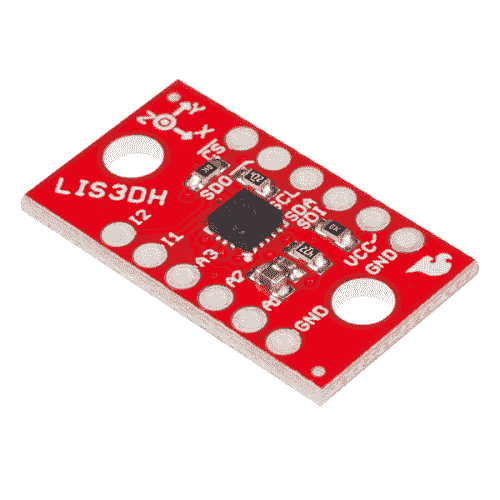
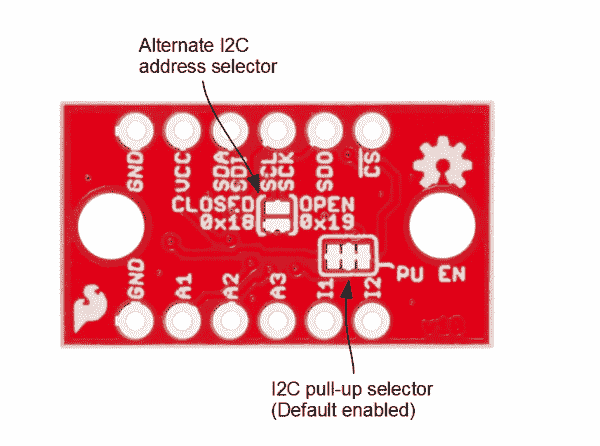
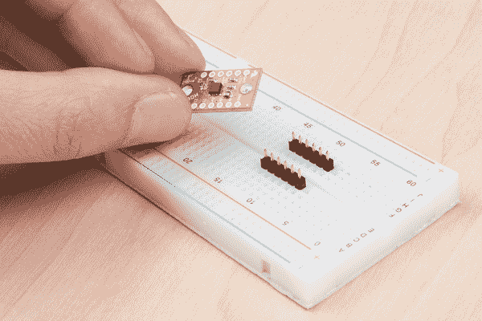
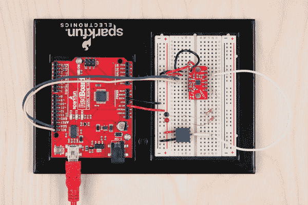
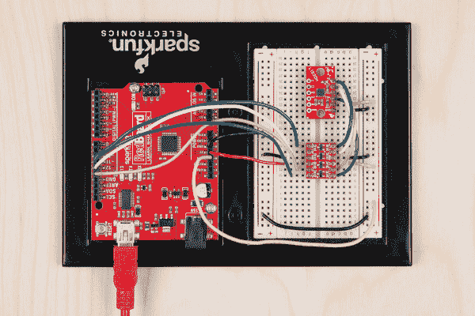
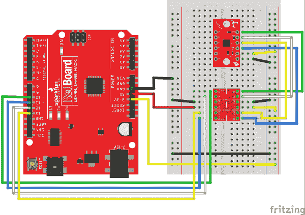

# LIS3DH 连接指南

> 原文：<https://learn.sparkfun.com/tutorials/lis3dh-hookup-guide>

## 介绍

[](https://www.sparkfun.com/products/13963) 

将**添加到您的[购物车](https://www.sparkfun.com/cart)中！**

### [SparkFun 三轴加速度计 Breakout-LIS3DH](https://www.sparkfun.com/products/13963)

[In stock](https://learn.sparkfun.com/static/bubbles/ "in stock") SEN-13963

LIS3DH Breakout 是一款智能、低功耗、三轴、电容性微加工加速度计，具有 12 位分辨率

$6.503[Favorited Favorite](# "Add to favorites") 8[Wish List](# "Add to wish list")** **[LIS3DH](https://www.sparkfun.com/products/13963) 是一款三轴加速度计，可用于在项目中添加平移检测。LIS3DH 中的“3D”是指它是 3DoF，即 3 个自由度。此外，它有几个模拟输入可供使用，它有一些内置的运动检测功能，可以检测自由落体等情况，并指示 FIFO 缓冲区是否已满。

如果你正在寻找小而便宜的东西，并且只是测量加速度，这就是你要的产品。其他惯性测量单元(或 IMU)，如[LSM 9 ds 1](https://www.sparkfun.com/products/13284)；[LSM 6 ds 3](https://www.sparkfun.com/products/13339)；或 [LSM303C](https://www.sparkfun.com/products/13303) ，可以提供附加的空间位置数据，如陀螺仪或磁强计。

本指南介绍了将电路板插入 RedBoard 的基础知识，展示了如何使用 Arduino 库实时或通过 FIFO 收集来获取加速度数据，并描述了库的用法。

### 所需材料

要跟进，您需要以下材料:

*   [LIS3DH 分线板](https://www.sparkfun.com/products/13963)
*   [Arduino UNO](https://www.sparkfun.com/products/11021) 、 [RedBoard](https://www.sparkfun.com/products/11575) 或另一个 [Arduino 兼容板](https://learn.sparkfun.com/tutorials/arduino-comparison-guide)
*   [直阳接头](https://www.sparkfun.com/products/116) -或电线。用来连接 breakout 和试验板的东西。
*   任何尺寸(即使是迷你)都可以。
*   [M/M 跳线](https://www.sparkfun.com/products/11026) -连接 Arduino 和试验板。

**The LIS3DH is a 3.3V device!** Supplying voltages greater than ~3.6V can permanently damage the IC. As long as your Arduino has a 3.3V supply output, and you're OK with using I²C; you shouldn't need any extra level shifting. But, if you want to use SPI, you may need a [level shifter](https://www.sparkfun.com/products/12009).

任何 5V 操作的 Arduino (UNO、RedBoard、Leonardo 等)都需要逻辑电平转换器。如果你使用基于 3.3V 的“duino”，如 Arduino Pro 3.3V 或 T2 3.3V Pro Mini，就没有必要进行电平转换。

### 推荐阅读

如果您不熟悉下面的一些概念，我们建议您在继续学习之前先阅读该教程。

*   [加速度计基础知识](https://learn.sparkfun.com/tutorials/accelerometer-basics)
*   [陀螺仪](https://learn.sparkfun.com/tutorials/gyroscope)
*   [串行外设接口(SPI)](https://learn.sparkfun.com/tutorials/serial-peripheral-interface-spi)
*   [IC 间通信(I ² C)](https://learn.sparkfun.com/tutorials/i2c)
*   [逻辑电平](https://learn.sparkfun.com/tutorials/logic-levels)
*   [双向变速杆连接指南](https://learn.sparkfun.com/tutorials/bi-directional-logic-level-converter-hookup-guide)

此外，以下 ST 文档对高级用户很有帮助:

*   [LIS3DH _ 数据表](https://cdn.sparkfun.com/assets/learn_tutorials/5/9/6/LIS3DH_Datasheet_DocID_17530rev1.pdf) -硬件信息和寄存器映射。
*   [LIS3DH_AppNote](https://cdn.sparkfun.com/assets/learn_tutorials/5/9/6/LIS3DH_AppNote_DocID_18198rev1.pdf) -显示基本用法的描述性材料。

## 硬件概述和组装

使用 LIS3DH 有几种不同的方法。

电路板的顶部有 LIS3DH 传感器、一些旁路电容和上拉电阻。

[](https://cdn.sparkfun.com/assets/learn_tutorials/5/9/6/topNotated.jpg)*The pin connections*

此表给出了关于每个引脚功能的更多信息。串行端口可以连接为 SPI 或 I2C，两者使用相同的物理引脚。要开始，只需连接您选择的接口、3.3v 电源和地线。请注意，无论您选择哪种通信方法，都不需要使用所有的引脚。

|  |  |  |  | 关系 |
| 组 | 名字 | 方向 | 描述 | I2C | 精力 |
| 连续的 | ！特许测量员 | 我 | 片选(用于 SPI) | 网络计算机 | ！特许测量员 |
| 合成干性油（synthetic drying oil 的缩写） | O | 数据输出(SPI 的 MISO) | 网络计算机 | 军事情报部门组织(Military Intelligence Service Organization) |
| SCL | 我 | 数据时钟 | SCL | 血清肌酸激酶 |
| SDA/SDI | 输入－输出 | 数据输入(SDA 用于 I2C，MOSI 用于 SPI) | 国家药品监督管理局 | MOSI |
| 中断 | I1 | O | 主 int 有 FIFO +运动 | 可选 MCU |
| I2 | O | 次级 int 有运动 | 可选 MCU |
| 物理输出核心 | 一流的 | 我 | 模拟输入 | 可选择的 |
| 主动脉第二声 | 我 | 模拟输入 | 可选择的 |
| A3 号 | 我 | 模拟输入(不用于温度读数) | 可选择的 |
| 力量 | VCC | 我 | 3.3V 输入 | 供应 |
| GND | 我 | 接地连接(任一 PTH) | 供应 |

底部有两个跳线，分别对应 I2C 地址和上拉使能。

[](https://cdn.sparkfun.com/assets/learn_tutorials/5/9/6/botNotated.jpg)

以下是可用的选项:

*   **I2C 地址跳线** -桥接使用备用地址 0x18，否则为 0x19 开路。保持开放以供 SPI 使用。
*   **I2C 上拉使能** -默认关闭，在 I2C 线和 VCC 之间连接一个上拉电阻。这通常不会干扰 SPI 操作，但如果需要更低的功耗，请小心切割铜走线。

### 使用试验板

这种传感器可以很好地与试验板配合使用，便于连接，而且因为它给加速度计增加了一些质量，所以它更符合项目或手机的预期。

要添加接头，折断两个 6 针长的 [0.1 英寸公接头](https://www.sparkfun.com/products/116)，并将它们放入试验板中用作焊接夹具。

[](https://cdn.sparkfun.com/assets/learn_tutorials/5/9/6/Wifi_Cheeseburger_Project-03.jpg)*Two rows of headers placed and ready to solder.*

将分线板放到引脚上，并向下焊接各行。

[](https://cdn.sparkfun.com/assets/learn_tutorials/5/9/6/Wifi_Cheeseburger_Project-04.jpg)*Soldering on the rows of pins.*

恭喜你！现在，您可以将传感器连接到您选择的微控制器。

## 获取 Arduino 库

指南中的示例使用 Arduino IDE 和 RedBoard 与 LIS3DH 通信。

要获取 Arduino 库，请从 Github 下载，或者使用 Arduino 库管理器。

### 下载 Github 资源库

访问 [GitHub 库](https://github.com/sparkfun/SparkFun_LIS3DH_Arduino_Library)下载最新版本的库，或者点击下面的链接:

[Download the Arduino Library](https://github.com/sparkfun/SparkFun_LIS3DH_Arduino_Library/archive/master.zip)

### 图书馆经理

要获得安装库的帮助，请查看我们的[如何安装 Arduino 库教程](https://learn.sparkfun.com/tutorials/installing-an-arduino-library)。

如果你最终没有使用管理器，你需要将*spark fun _ LIS3DH _ Arduino _ Library*文件夹移动到 Arduino sketchbook 中的 *libraries* 文件夹。

## 示例:I2C、模拟和中断

第一个电路允许 RedBoard 通过 I2C 与 LIS3DH 通信，并在中断和 ADC 引脚上提供连接。

中断有助于指示极端的 Gs 或自由落体等情况，并告知 red board FIFO 已满，需要维修。模拟输入引脚可用于测量类似于 RedBoard 模拟输入的各种电压，但电压范围更有限(约 0.9V 至 1.8V)。如果这两个都不需要，只需连接电源、地和通信引脚，忽略中断和 ADC 示例。

使用这两张图片作为构建电路的指南。

[](https://cdn.sparkfun.com/assets/learn_tutorials/5/9/6/Wifi_Cheeseburger_Project-02.jpg)*The circuit built on a RedBoard*[](https://cdn.sparkfun.com/assets/learn_tutorials/5/9/6/I2C_bb.jpg)*The connections shown in Fritzing*

### 基本加速度计数据收集:

从基本的加速度计草图开始，也称为库中的“ [MinimalistExample](https://github.com/sparkfun/SparkFun_LIS3DH_Arduino_Library/blob/master/examples/MinimalistExample/MinimalistExample.ino) ”。这将定期对传感器进行采样，并以检测到的 Gs 数显示数据。请记住，在休息时，纵轴将显示 1G。

```
language:c
#include "SparkFunLIS3DH.h"
#include "Wire.h"
#include "SPI.h"

LIS3DH myIMU; //Default constructor is I2C, addr 0x19.

void setup() {
  // put your setup code here, to run once:
  Serial.begin(9600);
  delay(1000); //relax...
  Serial.println("Processor came out of reset.\n");

  //Call .begin() to configure the IMU
  myIMU.begin();

}

void loop()
{
  //Get all parameters
  Serial.print("\nAccelerometer:\n");
  Serial.print(" X = ");
  Serial.println(myIMU.readFloatAccelX(), 4);
  Serial.print(" Y = ");
  Serial.println(myIMU.readFloatAccelY(), 4);
  Serial.print(" Z = ");
  Serial.println(myIMU.readFloatAccelZ(), 4);

  delay(1000);
} 
```

示例输出:

```
Processor came out of reset.

Accelerometer:
 X = -0.1481
 Y = -0.1361
 Z = 0.9768

Accelerometer:
 X = -0.1481
 Y = -0.1361
 Z = 0.9768

Accelerometer:
 X = -0.1481
 Y = -0.1361
 Z = 0.9768

Accelerometer:
 X = -0.1481
 Y = -0.1361
 Z = 0.9768 
```

运行时，草图将以 Gs 显示数据到[串行终端](https://learn.sparkfun.com/tutorials/terminal-basics)。每秒钟，数据被收集并打印出来。

### 使用 ADC

要尝试模拟输入，加载名为“ [ADCUsage](https://github.com/sparkfun/SparkFun_LIS3DH_Arduino_Library/blob/master/examples/ADCUsage/ADCUsage.ino) ”的示例，或从以下部分复制粘贴。该示例还显示了可在`begin()`功能中应用的一些附加设置。

```
language:c
#include "SparkFunLIS3DH.h"
#include "Wire.h"
#include "SPI.h"

LIS3DH myIMU; //Default constructor is I2C, addr 0x19.

void setup() {
  // put your setup code here, to run once:
  Serial.begin(9600);
  delay(1000); //relax...
  Serial.println("Processor came out of reset.\n");

  myIMU.settings.adcEnabled = 1;
  //Note:  By also setting tempEnabled = 1, temperature data is available
  //on ADC3\.  Temperature *differences* can be read at a rate of
  //1 degree C per unit of ADC3
  myIMU.settings.tempEnabled = 0;
  myIMU.settings.accelSampleRate = 50;  //Hz.  Can be: 0,1,10,25,50,100,200,400,1600,5000 Hz
  myIMU.settings.accelRange = 2;      //Max G force readable.  Can be: 2, 4, 8, 16
  myIMU.settings.xAccelEnabled = 0;
  myIMU.settings.yAccelEnabled = 0;
  myIMU.settings.zAccelEnabled = 0;

  //Call .begin() to configure the IMU
  myIMU.begin();

}

void loop()
{
  //Get all parameters
  Serial.print("\nADC:\n");
  Serial.print(" 1 = ");
  Serial.println(myIMU.read10bitADC1());
  Serial.print(" 2 = ");
  Serial.println(myIMU.read10bitADC2());
  Serial.print(" 3 = ");
  Serial.println(myIMU.read10bitADC3());

  delay(300);
} 
```

示例输出:

```
Processor came out of reset.

ADC:
 1 = 1020
 2 = 522
 3 = 506

ADC:
 1 = 1020
 2 = 544
 3 = 516

ADC:
 1 = 1020
 2 = 540
 3 = 517 
```

该草图每 300ms 打印三个 ADC 值。移动旋钮，观察数值如何变化，以及有效电压范围如何在全范围的中间。将导线从一个 ADC 引脚移至另一个引脚，查看受控值是否发生变化。

### 使用中断引脚

中断行为是高度可配置的，因此作为基本库函数被省略。相反，LIS3DH 寄存器是根据数据手册直接写入的。

提供了一个示例，其中相关寄存器配置有模板函数中的注释，这些注释可以复制到项目中并进行修改。运行名为 [IntUsage](https://github.com/sparkfun/SparkFun_LIS3DH_Arduino_Library/blob/master/examples/IntUsage/IntUsage.ino) 的示例，当检测到超过加速度时，它将在一个引脚上抛出中断，当检测到点击时，在另一个引脚上抛出脉冲。

## 示例:SPI 和 FIFO 的使用

与 LIS3DH 通信的第二种方法是使用 SPI 接口。SPI 接口在 3.3V 下工作，因此使用一个在 3.3v 下工作的[逻辑电平转换器](https://www.sparkfun.com/products/12009?_ga=1.39639146.831177436.1424112780)或 MCU。使用以下图片来帮助构建电路。

[](https://cdn.sparkfun.com/assets/learn_tutorials/5/9/6/Wifi_Cheeseburger_Project-01.jpg)*The circuit built on a RedBoard*[](https://cdn.sparkfun.com/assets/learn_tutorials/5/9/6/LIS3DH_SPI_bb.png)*The connections shown in Fritzing*

### 基本加速度计数据收集:

SPI 不是默认配置，所以您必须通过用参数构造来向库传递额外的信息。修改“MinimalistExample ”,将 SPI 模式的`LIS3DH myIMU;`更改为`LIS3DH myIMU(SPI_MODE, 10);`,使用！CS 引脚连接到引脚 10。

修改后的“MinimalistExample”如下所示:

```
language:c
#include "SparkFunLIS3DH.h"
#include "Wire.h"
#include "SPI.h"

LIS3DH myIMU(SPI_MODE, 10); // constructed with parameters for SPI and cs pin number

void setup() {
  // put your setup code here, to run once:
  Serial.begin(9600);
  delay(1000); //relax...
  Serial.println("Processor came out of reset.\n");

  //Call .begin() to configure the IMU
  myIMU.begin();

}

void loop()
{
  //Get all parameters
  Serial.print("\nAccelerometer:\n");
  Serial.print(" X = ");
  Serial.println(myIMU.readFloatAccelX(), 4);
  Serial.print(" Y = ");
  Serial.println(myIMU.readFloatAccelY(), 4);
  Serial.print(" Z = ");
  Serial.println(myIMU.readFloatAccelZ(), 4);

  delay(1000);
} 
```

示例输出:

```
Processor came out of reset.

Accelerometer:
 X = -0.1481
 Y = -0.1361
 Z = 0.9768

Accelerometer:
 X = -0.1481
 Y = -0.1361
 Z = 0.9768

Accelerometer:
 X = -0.1481
 Y = -0.1361
 Z = 0.9768

Accelerometer:
 X = -0.1481
 Y = -0.1361
 Z = 0.9768 
```

运行时，sketch 将以 Gs 为单位向串行终端显示数据。每秒钟，数据被收集并打印出来。

### FIFO 用法:

SPI 总线的工作速度比 I2C 更快，因此对于需要定期采样的高速数据采集，SPI 是可取的。

[](https://cdn.sparkfun.com/assets/learn_tutorials/5/9/6/CSVGraph.jpg)*This graph was made by taking the output of the example and copy-pasting it into a spreadsheet program, then creating a chart. During the data collection, the sensor was moved about a foot back and forth on each axis.*

```
language:c
#include "SparkFunLIS3DH.h"
#include "Wire.h"
#include "SPI.h"

LIS3DH myIMU(SPI_MODE, 10); //Constructing with SPI interface information
//LIS3DH myIMU(I2C_MODE, 0x19); //Alternate constructor for I2C

uint32_t sampleNumber = 0; //Used to make CSV output row numbers

void setup() {
  // put your setup code here, to run once:
  Serial.begin(9600);
  delay(1000); //relax...
  Serial.println("Processor came out of reset.\n");

  myIMU.settings.adcEnabled = 0;
  //Note:  By also setting tempEnabled = 1, temperature data is available
  //instead of ADC3 in.  Temperature *differences* can be read at a rate of
  //1 degree C per unit of ADC3 data.
  myIMU.settings.tempEnabled = 0;
  myIMU.settings.accelSampleRate = 10;  //Hz.  Can be: 0,1,10,25,50,100,200,400,1600,5000 Hz
  myIMU.settings.accelRange = 2;      //Max G force readable.  Can be: 2, 4, 8, 16
  myIMU.settings.xAccelEnabled = 1;
  myIMU.settings.yAccelEnabled = 1;
  myIMU.settings.zAccelEnabled = 1;

  //FIFO control settings
  myIMU.settings.fifoEnabled = 1;
  myIMU.settings.fifoThreshold = 20;  //Can be 0 to 31
  myIMU.settings.fifoMode = 1;  //FIFO mode.
  //fifoMode can be:
  //  0 (Bypass mode, FIFO off)
  //  1 (FIFO mode)
  //  3 (FIFO until full)
  //  4 (FIFO when trigger)

  //Call .begin() to configure the IMU (except for the fifo)
  myIMU.begin();

  Serial.print("Configuring FIFO with no error checking...");
  myIMU.fifoBegin(); //Configure fifo
  Serial.print("Done!\n");

  Serial.print("Clearing out the FIFO...");
  myIMU.fifoClear();
  Serial.print("Done!\n");
  myIMU.fifoStartRec(); //cause fifo to start taking data (re-applies mode bits)

}

void loop()
{
  //float temp;  //This is to hold read data
  //uint16_t tempUnsigned;
  //
  while(( myIMU.fifoGetStatus() & 0x80 ) == 0) {};  //Wait for watermark

  //Now loop until FIFO is empty.
  //If having problems with the fifo not restarting after reading data, use the watermark
  //bits (b5 to b0) instead.
  //while(( myIMU.fifoGetStatus() & 0x1F ) > 2) //This checks that there is only a couple entries left
  while(( myIMU.fifoGetStatus() & 0x20 ) == 0) //This checks for the 'empty' flag
  {
      Serial.print(sampleNumber);
      Serial.print(",");
      Serial.print(myIMU.readFloatAccelX());
      Serial.print(",");
      Serial.print(myIMU.readFloatAccelY());
      Serial.print(",");
      Serial.print(myIMU.readFloatAccelZ());
      Serial.println();
      sampleNumber++;
  }

} 
```

示例输出:

```
Processor came out of reset.

Configuring FIFO with no error checking...Done!
Clearing out the FIFO...Done!
0,-0.15,-0.14,1.04
1,-0.17,-0.12,1.02
2,-0.21,-0.10,0.95
3,-0.21,-0.10,1.01
4,-0.22,-0.12,1.07
5,-0.17,-0.12,0.99
6,-0.12,-0.15,0.96
7,-0.18,-0.12,0.94
8,-0.19,-0.10,0.98
9,-0.20,-0.14,1.04
10,-0.19,-0.12,0.99
11,-0.20,-0.10,0.95
12,-0.21,-0.12,1.06
13,-0.14,-0.12,0.98
14,-0.10,-0.11,0.95
15,-0.12,-0.10,0.94
16,-0.14,-0.09,0.90
... 
```

请注意，输出会定期生成批量数据。尽管数据等待收集，但仍会定期进行采样。当 FIFO 超过行`myIMU.settings.fifoThreshold = 20;`中配置的水印时，数据被收集。

## 额外示例和 Arduino 库参考

Arduino 库中包含以下示例:

*   **ADCUsage** -演示模拟读数并记录温度采集
*   **FifoExample** -演示使用内置缓冲器突发收集数据- **很好的设置演示**
*   **完整设置示例** -显示所有设置，未使用的选项被注释掉
*   **插入** -显示中断位的配置
*   **LowLevelExample** -演示了只使用核心驱动程序，没有数学和设置开销
*   **极简示例**—**最简单的**配置
*   **MultiI2C** -在 I2C 上使用两个 LIS3DHs
*   **MultiSPI** -通过 SPI 使用两个 LIS3DHs

### 图书馆使用

采取以下步骤来使用该库

*   使用以下构造之一在全局空间中构造一个对象
    *   无参数-地址 0x19 处的 I2C 模式
    *   I2C 模式，地址
    *   SPI_MODE 引脚编号
*   使用 in begin，设置. settings .值
*   运行`.begin()`

示例:

```
language:c
LIS3DH myIMU; //This creates an instance the library object.

void setup()
{
    myIMU.settings.adcEnabled = 1;
    myIMU.settings.tempEnabled = 0;
    myIMU.settings.accelSampleRate = 50;  //Hz.  Can be: 0,1,10,25,50,100,200,400,1600,5000 Hz
    myIMU.settings.accelRange = 2;      //Max G force readable.  Can be: 2, 4, 8, 16
    myIMU.begin();
} 
```

#### 设置

主 LIS3DH 类有一个名为 settings 的公共成员。要配置设置，请使用格式`myIMU.settings.accelSampleRate = (...);`。然后，拨打`.begin()`申请。

设置包含以下成员:

*   `uint8_t adcEnabled` -置 1 使能 ADC
*   `uint8_t tempEnabled` -设置为 1，用温差信息覆盖 ADC3
*   `uint16_t accelSampleRate` -可以是:0，1，10，25，50，100，200，400，1600，5000 赫兹
*   `uint8_t accelRange` -最大 G 力可读。可以是:2，4，8，16
*   `uint8_t xAccelEnabled` -设置为 1 启用 x 轴
*   `uint8_t yAccelEnabled` -设置为 1 启用 y 轴
*   `uint8_t zAccelEnabled` -设置为 1 启用 z 轴
*   `uint8_t fifoEnabled` -设置为 1 以启用 FIFO
*   `uint8_t fifoMode` -可以是 0x0，0x1，0x2，0x3
*   `uint8_t fifoThreshold` -检测水印前读取的字节数(0 到 31)

### 功能

**Advanced programmers:** The LIS3DH class inherits the LIS3DHCore, which can be used to communicate without all these functions, so you can write your own. This class is not covered in this hookup guide.

#### uint 8 _ t begin(void)；

按照构造和运行`applySettings()`的指示，在提供启动 wire 或 SPI 库的设置后调用。如果成功，则返回 0。

#### void applySettings(无效)；

这将根据.设置的内容配置 IMU 的寄存器。

#### S7-1200 可编程控制器：

#### int 16 _ t readrawacely(void)；

#### int 16 _ t readrawacelz(void)；

这些函数以 16 位有符号整数的形式返回轴加速度信息。

#### float read float ccelx(void)；

#### float read float ccey(void)；

#### float read float ccelz(void)；

这些函数调用原始函数，然后应用数学转换成浮点数，以 g 为单位表示加速度。

#### uint 16 _ t read 10 bitadc 1(void)；

#### uint 16 _ t read 10 bitadc 2(void)；

#### uint 16 _ t read 10 bitadc 3(void)；

这些函数返回从引脚读取的 ADC 值。值将为 10 位，可检测范围约为 0.9V 至 1.8V

注意:当`tempEnabled == 1`时，ADC3 读数为以摄氏度为单位的非参考温度。读取两次并计算温度变化。

#### void FIFO begin(void)；

这通过将适当的值写入 FIFO 控制寄存器和控制寄存器 5 来使能 FIFO。这不会开始向 FIFO 收集数据，准备好后运行`fifoStartRec()`。

采样速率取决于在设置中选择的数据速率。

#### void fifoclair(void)；

这会读取所有数据，直到状态显示没有可用的数据，从而丢弃这些数据。如果 FIFO 用旧数据填充，则使用新数据开始。

#### 见 fifostartrec(同上)

这使能 FIFO 数据收集。在开始检查数据是否可用之前运行此命令。

使用 fifoStartRec 后，来自 X、Y、Z 寄存器的数据不是实时数据，而是下一个可用样本。

#### uint8_t fifoGetStatus( void )

这将返回 FIFO 状态字节。该字节的内容如下:

*   第 7 位:超出水印
*   位 6: FIFO 溢出
*   第 5 位:FIFO 为空
*   位 4 至 0:可用样本数(0 至 31)

#### 见 fifoEnd(同上)；

这将停止 FIFO，并使器件返回正常工作状态。

## 资源和更进一步

现在您应该对如何使用 LIS3DH 有了基本的了解，但是如果您需要更多的信息，请查看以下链接:

*   [LIS3DH Breakout Github repo](https://github.com/sparkfun/LIS3DH_Breakout)-设计文件。
*   [SparkFun LIS3DH Arduino 库 Github Repo](https://github.com/sparkfun/SparkFun_LIS3DH_Arduino_Library) - arduino 库。
*   [LIS3DH 数据表](https://cdn.sparkfun.com/assets/learn_tutorials/5/9/6/LIS3DH_Datasheet_DocID_17530rev1.pdf) -硬件信息和寄存器映射。
*   [LIS3DH AppNote](https://cdn.sparkfun.com/assets/learn_tutorials/5/9/6/LIS3DH_AppNote_DocID_18198rev1.pdf) -显示基本用法的描述性材料。

### 更进一步

需要一点灵感吗？看看这些其他伟大的 SparkFun 教程。

[](https://learn.sparkfun.com/tutorials/9dof-sensor-stick-hookup-guide) [### 9 自由度传感器杆连接指南](https://learn.sparkfun.com/tutorials/9dof-sensor-stick-hookup-guide) How to connect and use the SparkFun 9 Degrees of Freedom Sensor Stick with an Arduino[Favorited Favorite](# "Add to favorites") 0[](https://learn.sparkfun.com/tutorials/setting-up-the-pi-zero-wireless-pan-tilt-camera) [### 设置 Pi Zero 无线云台摄像机](https://learn.sparkfun.com/tutorials/setting-up-the-pi-zero-wireless-pan-tilt-camera) This tutorial will show you how to assemble, program, and access the Raspberry Pi Zero as a headless wireless pan-tilt camera.[Favorited Favorite](# "Add to favorites") 12[](https://learn.sparkfun.com/tutorials/qwiic-proximity-sensor-vcnl4040-hookup-guide) [### Qwiic 接近传感器(VCNL4040)连接指南](https://learn.sparkfun.com/tutorials/qwiic-proximity-sensor-vcnl4040-hookup-guide) The SparkFun Qwiic Proximity Sensor is a great, qualitative proximity (up to 20 cm) and light sensor. This hookup guide covers a few examples to retrieve basic sensor readings.[Favorited Favorite](# "Add to favorites") 2[](https://learn.sparkfun.com/tutorials/sparkfun-qwiic-3-axis-accelerometer-adxl313-hookup-guide) [### SparkFun Qwiic 三轴加速度计(ADXL313)连接指南](https://learn.sparkfun.com/tutorials/sparkfun-qwiic-3-axis-accelerometer-adxl313-hookup-guide) Let's get moving with the SparkFun Triple Axis Digital Accelerometer Breakout - ADXL313 (Qwiic), a low cost, low power, up to 13-bit resolution, 3-axis accelerometer with a 32-level FIFO stack capable of measuring up to ±4g. This hookup guide will get users started reading measurements from the ADXL313, by Analog Devices, with an Arduino microcontroller, Jetson Nano, or Raspberry Pi.[Favorited Favorite](# "Add to favorites") 3**