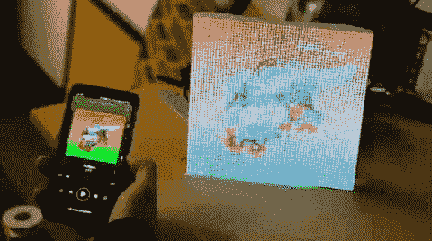

# 现场 Spotify 专辑图片展示

> 原文：<https://learn.sparkfun.com/tutorials/live-spotify-album-art-display>

## 介绍

在过去的几周里，我一直在尝试一些不同的 [LED](https://www.sparkfun.com/leds) 装置，包括 [LuMini 环](https://www.sparkfun.com/categories/tags/lumini)和 [RGB 矩阵面板](https://www.sparkfun.com/categories/tags/matrix)。一些有趣的例子，使他们真正流行。在这个过程中，我偶然发现了 ThingPulse 的几个巧妙例子，它们将 ESP8266 与 Spotify 集成在一起，以控制歌曲并下拉与专辑封面相关的 JPEG。我有一些方阵和一个 ESP32，所以我认为专辑封面将是完美的。我在 LuMini Matrices 上尝试了这个例子，它看起来很漂亮，很明亮，但我当时没有足够的电路板来达到足够高的分辨率(我有 4 块电路板，总分辨率为 16x16 像素)，这样专辑插图看起来就很好。当我慢慢放弃了与我的产品相关的整洁的例子来代替其他追求时，我的同事 Wes 用我们的 [64x64 矩阵](https://www.sparkfun.com/products/14824)来挽救局面。韦斯改编了我的超低分辨率 LuMini 的例子，以配合我们的 64x64 矩阵，本教程涵盖了如何连接矩阵，让它显示一些整洁的专辑封面！

### 所需材料

对于这个项目，你需要一些跳线，一个 ESP32 的东西，头，一个 64x64 矩阵，和一个能够提供 2 安培的电源。许多 wall 疣将为这项任务工作，但我们已经包括了一些在下面的愿望清单。你可能不需要所有的东西，这取决于你拥有什么。将它添加到您的购物车，通读指南，并根据需要调整购物车。