# 在 Edison 上加载 Debian (Ubilinux)

> 原文：<https://learn.sparkfun.com/tutorials/loading-debian-ubilinux-on-the-edison>

## 介绍

**Heads up!** Ubilinux is no longer maintained, although it can still be downloaded [here](https://emutex.com/products/ubilinux). We also recommend checking out [jubilinux](http://www.jubilinux.org/) as an alternative Debian distribution for the Edison.

如果你一直在玩 [Edison](https://www.sparkfun.com/categories/272) ，你可能会注意到 [Yocto 项目](https://www.yoctoproject.org/)可能很难合作。也就是说，每当您需要启用一个包时，他们希望您从头开始重新构建 Linux。如果你要把 Edison 变成最终产品，并且你需要一个快速的、精简版的 Linux，这是非常好的。然而，如果你想要更多的功能和一个成熟的[包管理器](http://en.wikipedia.org/wiki/Package_manager)，在 Edison 上安装一个不同版本的 Linux 是值得的。

[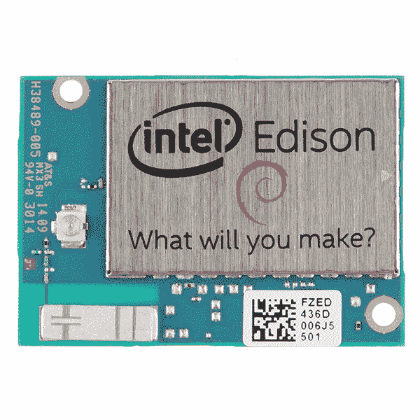](https://cdn.sparkfun.com/assets/learn_tutorials/3/3/4/Edison-Debian.png)

对于本教程，我们将在 Edison 上安装 [Ubilinux](http://www.emutexlabs.com/ubilinux) 并启用一些重要的功能(比如 WiFi)。Ubilinux 是基于 [Debian](https://www.debian.org/) 的定制 linux 镜像。这个版本的 Linux 被用于 SparkFun Live！第一集[推特火鸡温度计时器](https://www.youtube.com/watch?v=B6tsbQQEsSg)。

你需要一个英特尔 Edison 和一个允许你对 Edison 重新编程的主板，比如 [SparkFun Base Block](https://www.sparkfun.com/products/13045) 、 [Mini Breakout Kit](https://www.sparkfun.com/products/13025) 或 [Arduino Breakout Kit](https://www.sparkfun.com/products/13097) 。

重要提示:遵循本教程，你可以**潜在地建造你的爱迪生**。这样做风险自负！特别要注意上面说至少两分钟内不要拔掉爱迪生的电源。如果您确实用砖砌了您的 Edison，请阅读[故障排除部分](https://learn.sparkfun.com/tutorials/loading-debian-ubilinux-on-the-edison#troubleshooting)以获得可能的解决方案。

### 推荐阅读

*   [爱迪生入门指南](https://learn.sparkfun.com/tutorials/edison-getting-started-guide)

## 安装 Ubilinux

我们需要下载 Ubilinux 映像，我们将把它安装在 Edison 上，还需要一些软件，具体取决于您当前的操作系统。

**重要提示**:确保此时 Edison 没有通电或连接到您的主机。

### Windows 操作系统

如果您之前没有安装用于 Windows 的英特尔 Edison 驱动程序，您需要先安装。

*   导航到[https://communities.intel.com/docs/DOC-23242](https://communities.intel.com/docs/DOC-23242)
*   向下滚动并下载“Windows 驱动程序安装”文件
*   双击下载的。然后按照命令提示(接受所有默认值)安装驱动程序

从[7-zip.org 页面](http://www.7-zip.org/)下载并安装 7-zip。您可能需要。msi 版本。

下载 [dfu-util for Windows](https://cdn.sparkfun.com/assets/learn_tutorials/3/3/4/dfu-util-0.8-binaries.tar.xz) (该可执行文件来自 [spark.io 社区](https://community.spark.io/t/tutorial-installing-dfu-driver-on-windows-15-nov-2014/3518))。

导航到[http://www.emutexlabs.com/ubilinux](http://www.emutexlabs.com/ubilinux)下载 Ubilinux 镜像，点击“ubilinux for Edison”

转到开始→所有程序→ 7-Zip → 7-Zip 文件管理器。在文件管理器中，导航到您的下载文件夹。选择“dfu-util-0.8-binaries.tar.zx”并选择“提取”

[](https://cdn.sparkfun.com/assets/learn_tutorials/3/3/4/win_7zip_dfu.png)

当系统提示将文件提取到哪里时，单击“确定”接受默认值。“dfu-util-0.8.binaries.tar”将出现在 7-Zip 文件管理器中。双击它进入文件夹。选择“dfu-util-0.8-binaries.tar”并单击“提取”再次提取 dfu-util。

[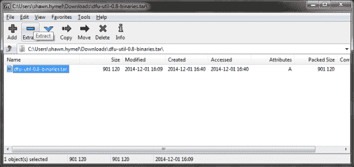](https://cdn.sparkfun.com/assets/learn_tutorials/3/3/4/win_7zip_dfu_2.png)

再次出现提示时，单击“确定”。按“上移一个文件夹”按钮，导航回您的下载文件夹。

[](https://cdn.sparkfun.com/assets/learn_tutorials/3/3/4/win_7zip_up.png)

再次执行相同的步骤来提取 Ubilinux 映像:

*   选择 ubilinux-edison-XXXXXX.tar.gz 文件
*   点击“提取”
*   在弹出的对话框中点击“确定”
*   等待提取
*   双击“ubilinux-edison-XXXXXX.tar”进入 tar 存档
*   选择 ubilinux-edison-XXXXXX.tar 文件
*   点击“提取”
*   在提取过程中再次等待

[](https://cdn.sparkfun.com/assets/learn_tutorials/3/3/4/win_7zip_ubilinux_1.png)

打开文件资源管理器窗口，导航到`<your downloads folder>\ dfu-util-0.8-binaries.tar\dfu-util-0.8-binaries\dfu-util-0.8-binaries\win32-mingw32`。右键单击 dfu-util.exe，然后单击“复制”

[](https://cdn.sparkfun.com/assets/learn_tutorials/3/3/4/win_copy_dfu-util.png)

导航到 toFlash 文件夹，该文件夹位于解压缩后的 Ubilinux 文件夹中(`<your downloads folder>\ubi Linux-Edison-141030.tar\ubiLinux-Edison-141030\to flash`)。右键单击并选择“粘贴”以粘贴到 dfu-util.exe 文件中。

[](https://cdn.sparkfun.com/assets/learn_tutorials/3/3/4/win_paste_dfu-util.png)

在\toFlash 文件夹中，向下滚动找到文件“flashall.bat”，双击它开始安装过程。

[](https://cdn.sparkfun.com/assets/learn_tutorials/3/3/4/win_run_flashall.png)

将会打开一个命令窗口，要求您插入 Edison。

[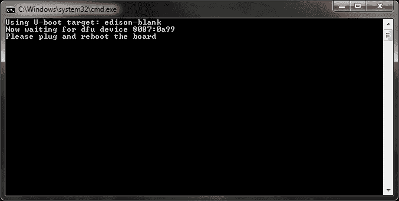](https://cdn.sparkfun.com/assets/learn_tutorials/3/3/4/win_plug_in_edison.png)

插入 Edison(使用 J16 连接英特尔 Arduino 和迷你分线板。使用“OTG”作为 SparkFun Edison 基块)，安装过程将开始！

[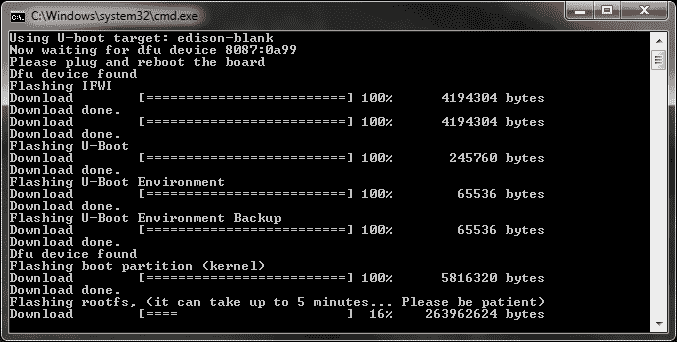](https://cdn.sparkfun.com/assets/learn_tutorials/3/3/4/win_install_ubilinux.png)

**警告:**一旦命令提示符窗口关闭，您需要等待至少 2 分钟才能完成安装。爱迪生应该重置几次来完成它的安装。不要拔掉爱迪生的电源！离开两分钟可能是个好主意。

### mac os x

[**2015 年 3 月 19 日更新** ]我已经有几个人指出，这在 OS X 10.10(约塞米蒂)上不起作用。如果我找到一个解决方案，我会研究它并更新教程。同时，我建议尝试另一个操作系统。如果你碰巧在优胜美地有任何运气，请在评论中告诉我们！

[**2015 年 3 月 18 日编辑:**添加了关于安装自制软件和实用程序的部分]非常感谢以下用户帮助解决如何从 Mac OS X 闪存 Edison 的问题:

*   [你好-技术人员](https://www.sparkfun.com/users/247099?_ga=1.99294942.1931450371.1419877130)
*   [Alx](https://www.sparkfun.com/users/38448?_ga=1.99160158.1931450371.1419877130)
*   [GaryiOS](https://www.sparkfun.com/users/317937?_ga=1.99160158.1931450371.1419877130)
*   [布伦特原油](https://www.sparkfun.com/users/641374?_ga=1.4323315.1931450371.1419877130)
*   [成员#360315](https://www.sparkfun.com/users/360315?_ga=1.262725324.1931450371.1419877130)

导航到[http://www.emutexlabs.com/ubilinux](http://www.emutexlabs.com/ubilinux)下载 Ubilinux 镜像，点击“ubilinux for Edison”

打开 Finder 窗口并导航到您的下载目录。找到 Ubilinux 文件(如 ubilinux-edison-150309.tar.gz)，双击解压。它将创建一个 toFlash 目录。

[](https://cdn.sparkfun.com/assets/learn_tutorials/3/3/4/osx_toflash.png)

打开终端(Finder →应用程序→实用程序→终端)。

[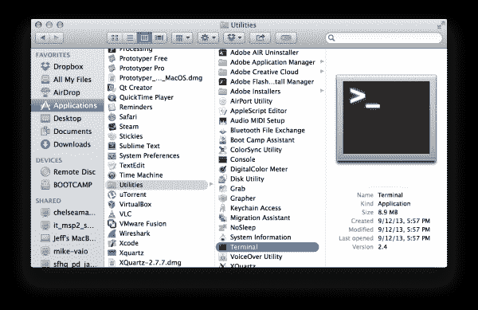](https://cdn.sparkfun.com/assets/learn_tutorials/3/3/4/osx_terminal_app.png)

我们需要安装一些实用程序来从 OS X 中刷新 Edison。

安装自制软件:

```
ruby -e “$(curl -fsSL https://raw.githubusercontent.com/Homebrew/install/master/install)” 
```

当被要求继续安装过程时，请按下 RETURN 键并输入您的密码。

家酿啤酒在我们使用之前可能需要清洁或检查东西。运行:

```
brew doctor 
```

一旦家酿已经安装和清理，用它来安装一些其他的工具:

```
brew install coreutils gnu-getopt dfu-util 
```

在下载中切换到 toFlash 目录。

```
cd ~/Downloads/toFlash/ 
```

运行安装脚本。

```
sudo ./flashall.sh 
```

您将看到类似“正在等待 dfu 设备”的消息接下来，插入 Edison(使用 J16 作为英特尔 Arduino 和迷你分线板。将“OTG”用于 SparkFun Edison 底座)。您应该会看到脚本开始在终端中闪现 Edison。等待该操作完成(可能需要几分钟)。

[](https://cdn.sparkfun.com/assets/learn_tutorials/3/3/4/osx_flashing.png)

一旦刷新过程完成，您将收到一条消息，如“您的主板需要重新启动两次才能完成刷新过程，请在 2 分钟内不要拔掉电源。”您需要等待 2 分钟，以确保刷新过程完成。

### Linux 操作系统

导航到[http://www.emutexlabs.com/ubilinux](http://www.emutexlabs.com/ubilinux)下载 Ubilinux 镜像，点击“ubilinux for Edison”

打开终端并导航到您的下载目录。例如:

```
cd Downloads 
```

提取下载文件的内容:

```
tar xvfz ubilinux-edison-XXXXXX.tar.gz 
```

请注意，版本号(XXXXXX)将是您下载的版本(例如 ubilinux-edison-141030.tar.gz)。

进入“toFlash”目录:

```
cd toFlash 
```

运行安装脚本:

```
sudo ./flashall.sh 
```

您将看到类似“正在等待 dfu 设备”的消息接下来，插入 Edison(使用 J16 作为英特尔 Arduino 和迷你分线板。将“OTG”用于 SparkFun Edison 底座)。您应该会看到脚本开始在终端中闪现 Edison。等待该操作完成(可能需要几分钟)。

[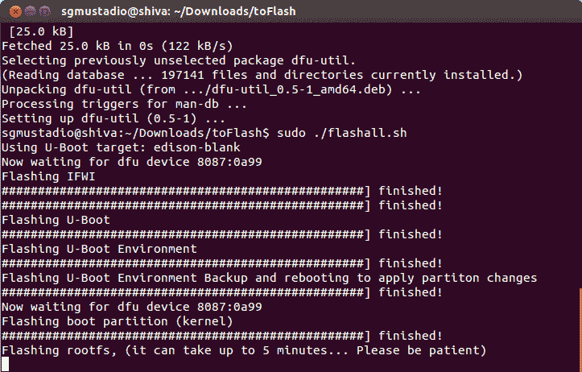](https://cdn.sparkfun.com/assets/learn_tutorials/3/3/4/linux_installing_ubilinux.png)

一旦刷新过程完成，您将收到一条消息，如“您的主板需要重新启动两次才能完成刷新过程，请在 2 分钟内不要拔掉电源。”你可能想等 2 分钟(我知道我不想冒险用砖头砸我的爱迪生)。

## 登录 Ubilinux

一旦你闪现了你的爱迪生，你可以通过串行连接登录。

**重要提示:**如果您使用的是英特尔 Arduino 或迷你分线板，此时请插入另一根 USB 电缆(您应该有 2 根 USB 电缆从 Edison 连接到您的电脑)。如果您正在使用带有“控制台”端口的 SparkFun Edison 模块，您可以使用该端口为 Edison 供电并接收串行控制台。

[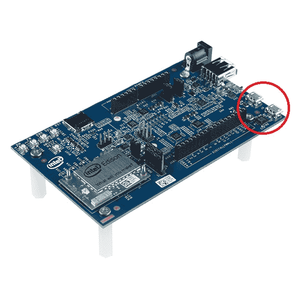](https://cdn.sparkfun.com/assets/learn_tutorials/3/3/4/arduino_bob_2_usb.jpg)*You will need to use both USB ports on the Arduino Breakout board*[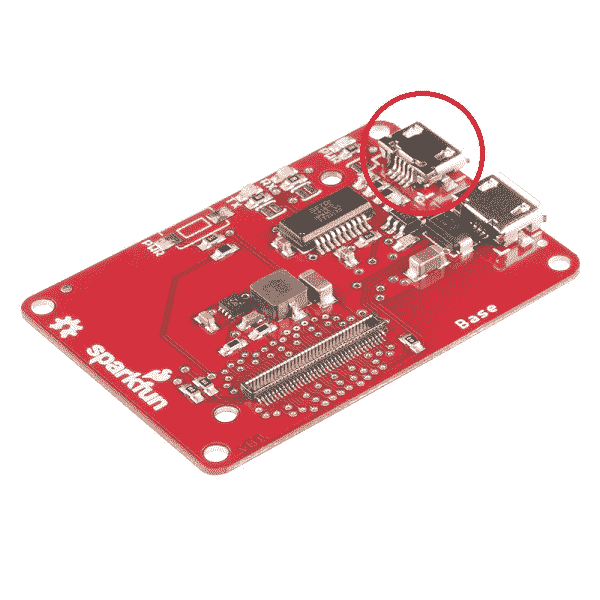](https://cdn.sparkfun.com/assets/learn_tutorials/3/3/4/base_block_usb_1.jpg)*You only need to use the USB port labeled "Console" on the Base Block*

### Windows 操作系统

下载一个串口终端，比如 [PuTTY](http://www.chiark.greenend.org.uk/~sgtatham/putty/download.html) 。

您可能还需要从 FTDI 下载并安装[虚拟 COM 端口驱动程序(下载“安装可执行文件”版本)。](http://www.ftdichip.com/Drivers/VCP.htm)

打开设备管理器。展开“端口(COM & LPT)”，您应该会看到一个“USB 串行端口”记下通讯号码。

[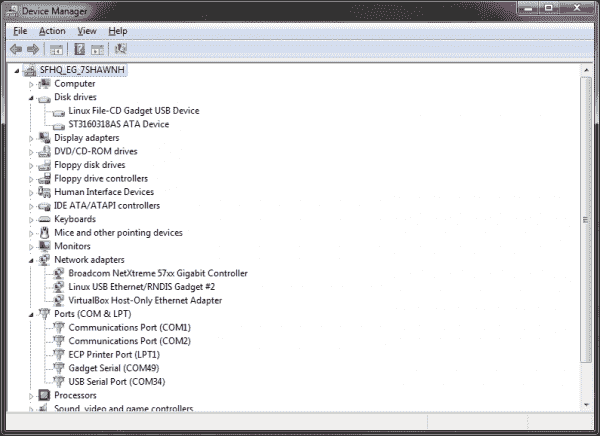](https://cdn.sparkfun.com/assets/learn_tutorials/3/3/4/windows_com_port_number.png)

运行 PuTTY，选择“串行”选项，更改“串行线路”下的 COM 端口号，并将“速度”设置为 115200。

[](https://cdn.sparkfun.com/assets/learn_tutorials/3/3/4/windows_putty.png)

点击“打开”您将看到一个空白的终端。点击“输入”,你会看到一个登录界面。

[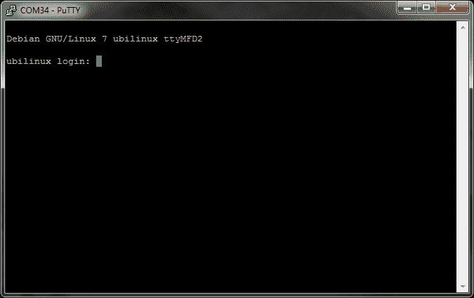](https://cdn.sparkfun.com/assets/learn_tutorials/3/3/4/windows_logging_in.png)

输入默认登录凭据:

ubilinux 登录:爱迪生
密码:爱迪生

就是这样！你现在登录到 Edison 上运行的 Ubilinux。

### mac os x

在插入 Edison 之前，您需要找到 USB 串行设备的位置。打开终端并输入:

```
ls /dev/tty.usb* 
```

记下出现的设备。插入 Edison(英特尔分线板的两根电缆或 SparkFun 模块的“控制台”端口)并再次输入命令:

```
ls /dev/tty.usb* 
```

应该会出现一个额外的文件。记住文件名并使用 screen 命令进行连接:

```
screen /dev/tty.usbserial-XXXXXXXX 115200 
```

其中-XXXXXXXX 是 USB 串行设备的数字和字母字符串。例如:

[](https://cdn.sparkfun.com/assets/learn_tutorials/3/3/4/osx_screen.png)

按“回车”查看登录屏幕。

[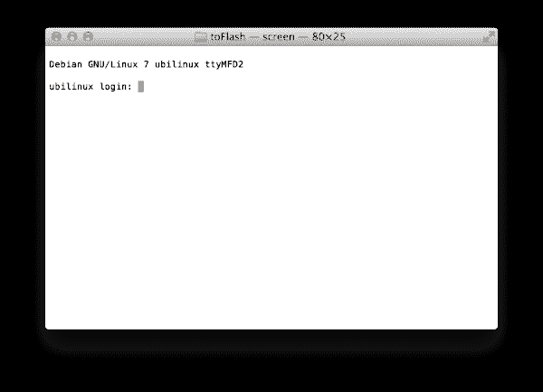](https://cdn.sparkfun.com/assets/learn_tutorials/3/3/4/osx_logging_in.png)

输入默认登录凭据:

ubilinux 登录:爱迪生
密码:爱迪生

你现在应该已经登录到 Ubilinux 了。

### Linux 操作系统

使用 screen 命令打开终端并连接:

```
sudo screen /dev/ttyUSB0 115200 
```

请注意，您的 USB 串行设备可能不完全是 ttyUSB0。如果插入了其他 USB 串行设备，可能是 ttyUSB1、ttyUSB2 等。

按“回车”查看登录屏幕。

[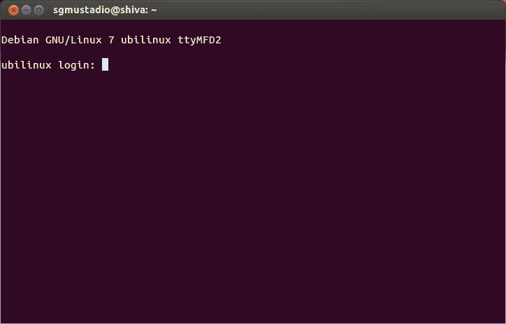](https://cdn.sparkfun.com/assets/learn_tutorials/3/3/4/linux_logging_in_1.png)

输入默认登录凭据:

ubilinux 登录:爱迪生
密码:爱迪生

你现在应该已经登录到 Ubilinux 了。

## 增加一些安全性

默认情况下，Ubilinux 允许你访问根帐户和名为“edison”的用户帐户。这是一个很好的起点，因为它允许您在操作系统中做任何事情。但是，它并不安全。如果有人发现了爱迪生的 IP 地址，他们可以用默认的用户名和密码登录。

提高安全性的最简单的方法之一是创建一个唯一的用户帐户，更改 edison 用户密码(或者删除整个帐户！)，并更改 root 密码。如果愿意，您可以跳过创建新用户，但是仍然强烈建议您更改 root 和 edison 的密码。

如果您以“edison”帐户登录，请运行:

```
logout 
```

在登录屏幕上，使用 root 帐户重新登录:

ubilinux 登录:root
密码:edison

### 创建新用户

为您的新帐户选择一个用户名，并想一个容易记住的密码。运行命令:

```
adduser --ingroup users <USERNAME> 
```

系统会提示您输入两次密码，并要求您提供一些识别信息。随意填写或点击“回车”接受默认值空白(无信息)。当提示信息正确时，键入“y”并按“enter”。

[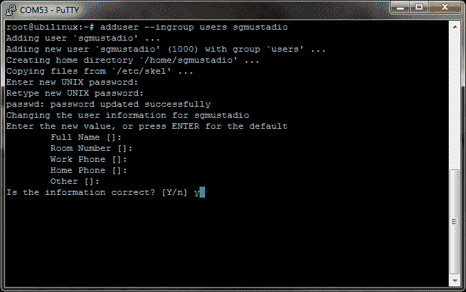](https://cdn.sparkfun.com/assets/learn_tutorials/3/3/4/ubilinux_adduser_1.png)

### 更改“爱迪生”帐户

建议您删除“edison”帐户，或者至少更改密码。

#### 修改口令

如果您想保留“edison”帐户，那么您应该考虑将密码改为更安全的密码:

```
passwd edison 
```

系统将提示您输入新密码两次。

#### 删除帐户

更好的选择是完全删除该帐户，因为猜测非默认用户名更加困难。以 root 用户身份登录时，输入:

```
deluser --remove-home edison 
```

### 更改 root 密码

最后一步是更改默认的 root 密码。这对于防止未经授权的人以 root 权限轻松登录您的 Edison 至关重要。以 root 用户身份登录，运行命令:

```
passwd 
```

系统将提示您输入新密码两次。

## 启用 WiFi

登录 Ubilinux 后，你可能需要一个互联网连接，这样你就可以随心所欲地下载和安装软件包。有几种方法可以通过 WiFi 连接到互联网。我们将展示其中的两个。第一种是快速简单的方法，但它会将您的 WiFi 密码存储在一个文件中的[纯文本](http://en.wikipedia.org/wiki/Plain_text)中。第二种是首选方法，因为它可以加密您的密码，但是步骤稍微复杂一些。

如果您以普通用户身份登录，请运行命令:

```
su 
```

并输入超级用户的密码以获得超级用户的能力。作为旁注，“苏”代表[替代用户](http://www.linfo.org/su.html)。

### 暂且应急的

上本地 WiFi 接入点最简单的方法是将 [SSID](http://www.webopedia.com/TERM/S/SSID.html) 和密码存储在一个文件中。问题是你的密码会以纯文本存储，所以不是很安全。

使用您最喜欢的 Linux 文本编辑器(我仍然是 [nano](http://www.howtogeek.com/howto/42980/the-beginners-guide-to-nano-the-linux-command-line-text-editor/) 的粉丝)打开接口文件:

```
nano /etc/network/interfaces 
```

使用箭头键导航至“auto usb0 ”,并在该行前添加一个“#”以将其注释掉。

向下导航并删除“auto wlan0”前面的“#”，这样我们的 Edison 将尝试在启动时自动连接到 WiFi。

下到“wpa-ssid”和“wpa-psk”行。将默认的 [SSID](http://en.wikipedia.org/wiki/Service_set_%28802.11_network%29#Service_set_identification_.28SSID.29) 和密码(PSK)更改为您想要的 WiFi SSID 和密码。

[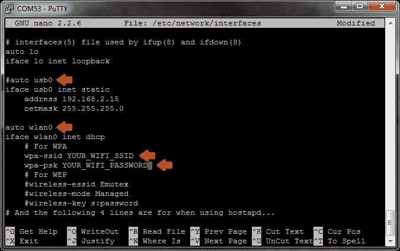](https://cdn.sparkfun.com/assets/learn_tutorials/3/3/4/change_interfaces_file_2.png)

出现提示时，按“Ctrl-X”退出，按“y”保存文件。

我们建议按照下面“更好的方法”中的说明进行操作，但是如果您对快速方法感到满意，请跳到“测试 WiFi 连接”

### 更好的方法

我们可以通过创建一个哈希并锁定/etc/network/interfaces 文件来更安全地存储我们的 WiFi 密码，这样只有 root 用户才能访问它。

使用 root 帐户，更改/etc/network/interfaces 文件的权限:

```
chmod 0600 /etc/network/interfaces 
```

创建您的 WiFi 密码的散列:

```
wpa_passphrase <YOUR_WIFI_SSID> <YOUR_WIFI_PASSWORD> 
```

这将在控制台中打印出“网络”部分。

[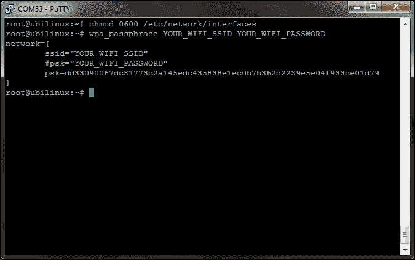](https://cdn.sparkfun.com/assets/learn_tutorials/3/3/4/ubilinux_wpa_passphrase.png)

复制“psk=”后的长串字母和数字(在 PuTTY 和很多 Linux 主机上，只需要高亮显示该字符串即可复制)。打开/etc/network/interfaces 文件:

```
nano /etc/network/interfaces 
```

使用箭头键导航至“auto usb0 ”,并在该行前添加一个“#”以将其注释掉。

向下导航并删除“auto wlan0”前面的“#”，这样我们的 Edison 将尝试在启动时自动连接到 WiFi。

转到“wpa-ssid”行。将默认的 [SSID](http://en.wikipedia.org/wiki/Service_set_%28802.11_network%29#Service_set_identification_.28SSID.29) 更改为 WiFi 的 SSID。

将光标移动到“wpa-psk”行，删除“wpa-psk”后的默认字符串，并粘贴我们之前生成的长散列(只需右键单击即可获得 PuTTY 和许多其他 Linux 控制台)。

[](https://cdn.sparkfun.com/assets/learn_tutorials/3/3/4/change_interfaces_psk_2.png)

出现提示时，按“Ctrl-X”退出，按“y”保存文件。

### 测试 WiFi 连接

通过输入以下命令重新启动无线驱动程序:

```
ifup wlan0 
```

配置完成后，您的 Edison 应该会连接到您的本地 WiFi。您可以通过输入以下内容进行检查:

```
ifconfig 
```

你应该在“wlan0”下看到一个“inet addr”条目，显示你的 [IP 地址](http://en.wikipedia.org/wiki/IP_address)。

[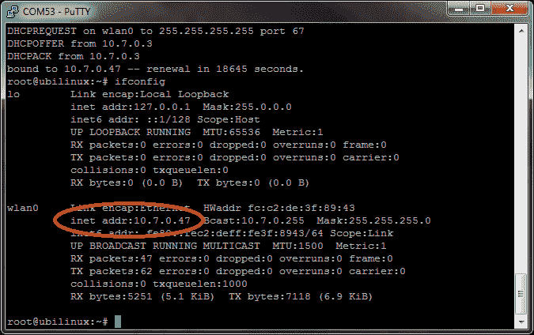](https://cdn.sparkfun.com/assets/learn_tutorials/3/3/4/ubilinux_ifconfig.png)

为了确保您可以访问互联网，您可以 ping 一个已知的网站，如 www.google.com 或 www.sparkfun.com:

```
ping www.sparkfun.com 
```

您应该会看到几个 pings 和响应。按“Ctrl-C”停止。

[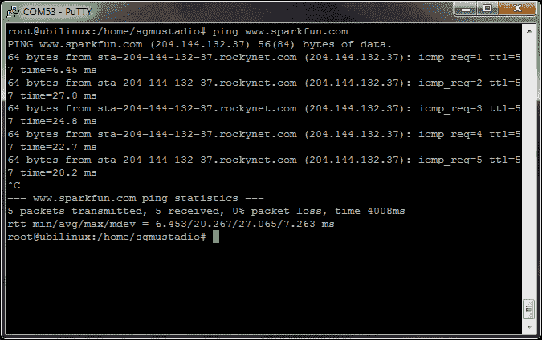](https://cdn.sparkfun.com/assets/learn_tutorials/3/3/4/ubilinux_ping.png)

现在你的 Edison 已经连接到网络，你可以使用 SSH 从另一台计算机连接到你的 Edison。你只需要知道 IP 地址。

## 使用 apt-get

### 安装软件包

我们要做的第一件事是用 [apt-get](https://wiki.debian.org/apt-get) 更新我们的包管理器。确保您以 root 用户身份登录(或使用“su”命令)，并输入:

```
apt-get update 
```

正在下载和更新您的软件包列表，请稍候。

如果你想安装一个[包](https://www.debian.org/distrib/packages)，比如 [sl](http://man.cx/sl%286%29) ，你只需要 apt-get install:

```
apt-get install sl 
```

如果出现提示，在要求安装软件包时按“y ”,您的软件包将自动下载并安装！

**注:**“sl”安装一个好玩的小 demo。输入:

```
/usr/games/sl 
```

去看它！

## 额外收获:添加“sudo”

这部分是完全可选的。有些人喜欢使用“sudo”命令来执行需要超级用户权限的操作(例如“sudo apt-get install”)。还有人更喜欢用“su”切换用户来执行命令。这是一场正在进行的辩论。

如果您想添加 sudo 命令，我们首先需要安装它。使用 root 帐户，运行命令:

```
apt-get install sudo 
```

添加您的用户帐户(不是 root！)致须藤集团:

```
adduser <YOUR_USERNAME> sudo 
```

使用“Logout”命令注销(如果使用“su”，可能需要输入两次):

```
logout 
```

使用您的普通用户帐户重新登录。尝试以下命令:

```
ifconfig 
```

您应该得到类似“-bash: ifconfig: command not found”的错误。再次尝试前面带有“sudo”的相同命令:

```
sudo ifconfig 
```

你应该打印出你的网络状态。

[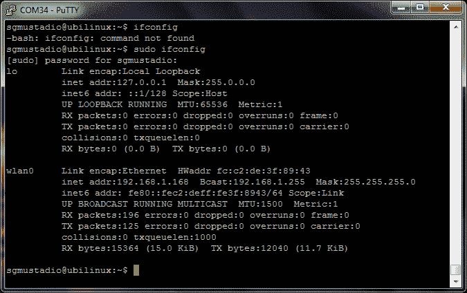](https://cdn.sparkfun.com/assets/learn_tutorials/3/3/4/ubilinux_sudo_test.png)

现在，您可以使用 sudo 运行需要管理权限的命令，而无需登录到您的 root 帐户。它允许普通用户以提升的权限运行命令，从而降低了安全性。然而，这意味着如果您使用类似于 [SSH](http://en.wikipedia.org/wiki/Secure_Shell) 的东西，您不需要登录到您的 root 帐户。

理想情况下，您应该弄清楚您的用户帐户需要运行哪些命令，并且只启用 sudoers 文件中的那些命令。这可以通过“visudo”命令来完成。要了解更多关于如何编辑 sudoers 文件的信息，[阅读本文](http://www.tecmint.com/su-vs-sudo-and-how-to-configure-sudo-in-linux/)。

## 解决纷争

### 救命啊！我用砖头砸了我的爱迪生！

当加载新固件时，这是很有可能的。如果你发现你已经把爱迪生在一个不可恢复的状态，它应该是可以恢复的。

如果您看到 Edison 开始发送到您的串行终端，请查找该行(它将倒数到 0):

```
Hit any key to stop autoboot: 0 
```

按“enter”键，然后输入命令:

```
run do_flash 
```

这将使爱迪生进入 DFU 模式。现在，您可以从主机上运行 flashall.bat 或 flashall.sh 脚本来重新创建 Edison 的映像。

非常感谢用户 [ddewaele](https://www.sparkfun.com/users/643907?_ga=1.8526709.1931450371.1419877130) 找到了这个解决方案。你可以在 GitHub 上看到他的错误的例子(bricked Edison)和他的解决方案作为[要点。](https://gist.github.com/ddewaele/f1b13545586c78ddb545)

### 找不到 dfu-util

在 Linux 上，如果你在试图安装 Ubilinux 时得到一个类似“dfu-util: command not found”的错误，那么你需要安装 dfu-util。运行命令:

```
sudo apt-get install dfu-util 
```

### 我使用哪个 USB 端口？

要安装 Ubilinux，如果您使用英特尔 Arduino 分线点或迷你分线点，您需要使用标有“J16”的 USB 端口如果您使用的是 [SparkFun Edison Base Block](https://www.sparkfun.com/products/13045) ，请使用标有“OTG”的端口

要登录 Ubilinux，您需要使用英特尔 Arduino 或 Mini-Breakout 上的两个 USB 端口。您只需使用 SparkFun 基础模块上标有“控制台”的端口。

### 找不到 libusb

在 Windows 中，如果您看到一条错误消息，如“程序无法启动，因为 libusb-1.0.dll 在您的计算机中丢失”，那么您需要 libusb-1.0.dll，它可以在 dfu-util 下载中找到。导航到`<your downloads folder>\dfu-util-0.8-binaries.tar\dfu-util-0.8-binaries\dfu-util-0.8-binaries\win32-mingw32`。右键单击 libusb-1.0.dll，然后单击“复制”

[](https://cdn.sparkfun.com/assets/learn_tutorials/3/3/4/win_copy_libusb.png)

导航到`<your downloads folder>\ubiLinux-Edison-141030.tar\ubi Linux-Edison-141030\toflash`。右键单击并选择“粘贴”以粘贴到 libusb-1.0.dll 文件中。

[](https://cdn.sparkfun.com/assets/learn_tutorials/3/3/4/win_paste_libusb.png)

注意:如果你愿意，你可以在你的 Windows 电脑上永久安装 dfu-util.exe 和 libusb-1.0.dll。读入[修改路径](http://stackoverflow.com/questions/4822400/register-an-exe-so-you-can-run-it-from-any-command-line-in-windows)和[安装. dll](http://www.pinguino.cc/download/doc/libusb-windows7.pdf) 。目前，为了简洁起见，它们只是被复制到 Ubilinux 路径中。

### 找不到包

在 Linux 上，诸如“E:Unable to location package”这样的消息可能意味着一些事情:

*   你把包名拼错了(我经常犯这个错误)
*   您的包列表找不到该包(尝试修改/etc/apt/sources.list 以指向[其他库](https://wiki.debian.org/SourcesList)
*   这个包根本不存在。你可能不得不安装来自源的任何东西[。](http://www.thegeekstuff.com/2012/06/install-from-source/)

### Sudo 无法解析主机

如果您使用“sudo”命令并得到如下错误:

```
sudo: unable to resolve host ubilinux 
```

那么这意味着您的 Edison 的主机名(在文件/etc/hostname 中)在/etc/hosts 文件中找不到。打开一个编辑器:

```
sudo nano /etc/hostname 
```

并记下名称(默认应该是“ubilinux”)。如果你愿意，你可以改变它(当它连接到网络时，它会改变你的爱迪生的名字)。

退出并打开/etc/hosts:

```
sudo nano /etc/hosts 
```

并在第一行的“localhost”后面添加您的主机名(例如“ubilinux”)。

[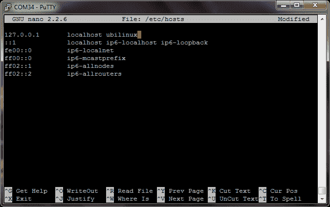](https://cdn.sparkfun.com/assets/learn_tutorials/3/3/4/ubilinux_hosts.png)

使用“Ctrl-X”和“y”保存并退出。使用以下命令重新启动 Edison:

```
sudo reboot 
```

你应该不会再收到须藤的警告了。

### 我想回 Yocto

互联网上的许多 Edison 指南都侧重于使用默认的 Yocto 构建。如果你安装了 Ubilinux 并且决定它不适合你，不要担心！你可以很容易地重新安装 Yocto。

导航至英特尔的 Edison [下载页面](https://communities.intel.com/docs/DOC-23242)并下载“Edison Yocto 完整图像”

按照[安装 Ubilinux 章节](https://learn.sparkfun.com/tutorials/loading-debian-ubilinux-on-the-edison#install-ubilinux)中的说明进行操作，但是不要导航到 Ubilinux 目录来运行“flashall.bat”或“flashall.sh”，而是转到 Yocto 目录。以下是我们在该部分所做工作的简要提示:

*   解压缩下载的 Yocto 映像。
*   如果你用的是 Windows，把 dfu-util.exe(可能还有 libusb-1.0.dll)复制到 Yocto 镜像目录。
*   运行 flashall.bat (Windows)或 flashall.sh (Mac 和 Linux)。你将被要求插入你的爱迪生。

[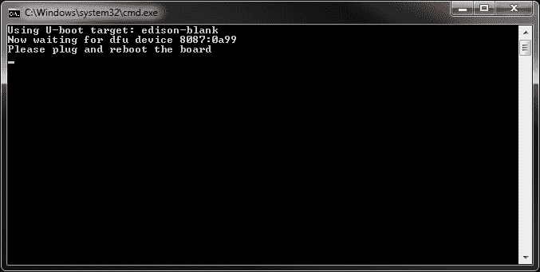](https://cdn.sparkfun.com/assets/learn_tutorials/3/3/4/reloading_yocto_01.png)

*   这时候插上你的爱迪生(或者拔下再插上)。然后，脚本会开始将 Yocto 图像闪现到您的 Edison 上。

[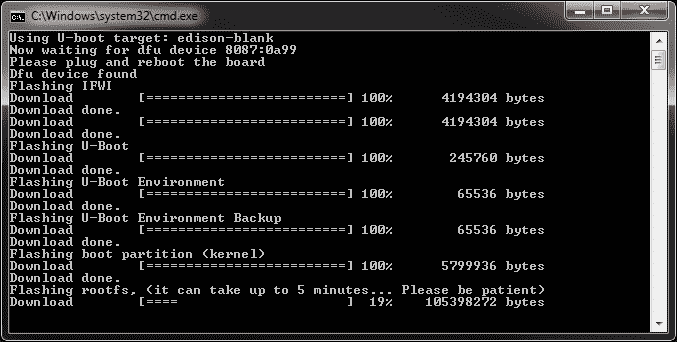](https://cdn.sparkfun.com/assets/learn_tutorials/3/3/4/reloading_yocto_02.png)

*   脚本完成后，等待至少 2 分钟，以便安装完成。在此期间，爱迪生号会自行重启几次。**请勿切断电源！**

等待一段时间后，在 Edison 中打开一个串行控制台，您应该会看到一个 Yocto 登录提示:

[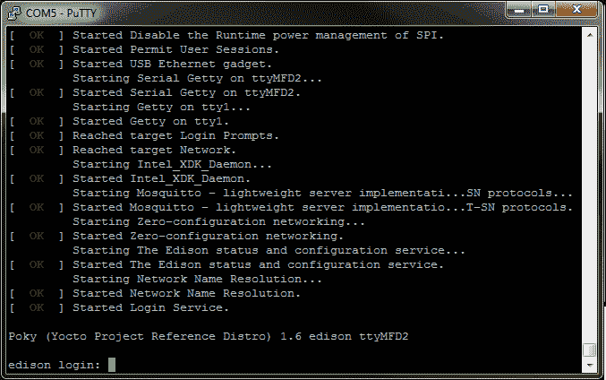](https://cdn.sparkfun.com/assets/learn_tutorials/3/3/4/reloading_yocto_03.png)

## 资源和更进一步

既然您已经在 Edison 上安装了 Debian，那么您就有很多工具可以使用了。例如， [aptitude](http://en.wikipedia.org/wiki/Aptitude_%28software%29) 是一个强大的包管理器，它可以让你从互联网上安装库和 Linux 包。

查看我们的[在 Edison 的 Ubilinux 上安装 libmraa](https://learn.sparkfun.com/tutorials/installing-libmraa-on-ubilinux-for-edison)教程，了解更多与其他主板接口的信息。

### 资源

以下是一些有助于您了解 Edison 的附加资源:

*   [英特尔爱迪生 Sparkfun 模块通用指南](https://learn.sparkfun.com/tutorials/general-guide-to-sparkfun-blocks-for-intel-edison)
*   [控制台连接导轨](https://learn.sparkfun.com/tutorials/sparkfun-blocks-for-intel-edison---console-block)
*   [电池块连接导轨](https://learn.sparkfun.com/tutorials/sparkfun-blocks-for-intel-edison---battery-block)
*   [GPIO 块连接指南](https://learn.sparkfun.com/tutorials/sparkfun-blocks-for-intel-edison---gpio-block)
*   要了解更多关于 Debian 的信息，有 Debian Wiki
*   要阅读关于/etc/network/interfaces 文件的更多信息，请参见[网络配置页面](https://wiki.debian.org/NetworkConfiguration)
*   如果您有兴趣了解更多关于 Linux 的知识，请看一下[Linux 系统管理员指南](http://www.tldp.org/LDP/sag/html/index.html)
*   如果你真的想深入研究如何让 Linux 更加安全，请阅读[安全 Debian 手册](https://www.debian.org/doc/manuals/securing-debian-howto/index.en.html)
*   [英特尔的 Edison 主页](https://communities.intel.com/community/makers/edison)在英特尔的[创客论坛](https://communities.intel.com/community/makers/edison/places)和整个创客网络社区中拥有丰富的信息。

如果你是 Linux 新手，我们强烈推荐你去看看 [Userland](https://p1k3.com/userland-book/) ，这是一个关于 shell 的指南。

查看 SparkFun 的其他爱迪生相关教程:

[](https://learn.sparkfun.com/tutorials/sparkfun-blocks-for-intel-edison---battery-block) [### 英特尔爱迪生公司的 SparkFun 模块-电池模块](https://learn.sparkfun.com/tutorials/sparkfun-blocks-for-intel-edison---battery-block) A quick overview of the features of the Battery Block.[Favorited Favorite](# "Add to favorites") 7[](https://learn.sparkfun.com/tutorials/edison-getting-started-guide) [### 爱迪生入门指南](https://learn.sparkfun.com/tutorials/edison-getting-started-guide) An introduction to the Intel® Edison. Then a quick walk through on interacting with the console, connecting to WiFi, and doing...stuff.[Favorited Favorite](# "Add to favorites") 12[](https://learn.sparkfun.com/tutorials/sparkfun-blocks-for-intel-edison---console-block) [### 英特尔 Edison 的 SparkFun 模块-控制台模块](https://learn.sparkfun.com/tutorials/sparkfun-blocks-for-intel-edison---console-block) A quick overview of the features of the Console Block.[Favorited Favorite](# "Add to favorites") 2[](https://learn.sparkfun.com/tutorials/sparkfun-inventors-kit-for-edison-experiment-guide) [### 爱迪生实验指南](https://learn.sparkfun.com/tutorials/sparkfun-inventors-kit-for-edison-experiment-guide) Learn how to harness the power of the Intel® Edison using JavaScript to post data to the cloud, control electronics from smartphones, and host web pages that interact with circuits.[Favorited Favorite](# "Add to favorites") 4