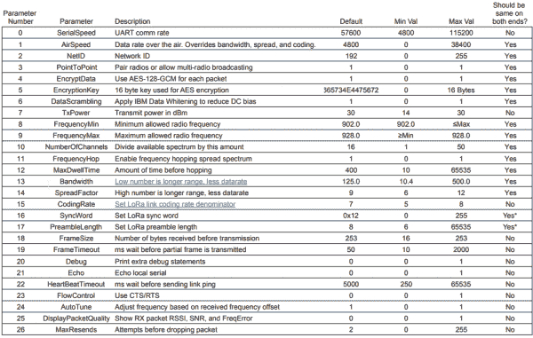

# lora 串行连接指南

> 原文：<https://learn.sparkfun.com/tutorials/loraserial-hookup-guide>

## 介绍

LoRa 系列无线电只是使用无线电调制解调器进行远距离传输(LoRa 是一种常用的组合，具有*长*和*范围*)。LoRaSerial 的独特之处在于，它使 LoRa 和所有挑剔的无线电配置位对用户透明。把收音机从盒子里拿出来，给它们加电，你就可以毫不费力地来回传送信号了。

 

### [火花电离层系列工具包- 915MHz](https://www.sparkfun.com/products/19311)

[Out of stock](https://learn.sparkfun.com/static/bubbles/ "out of stock") WRL-19311

LoRaSerial 是一对串行无线电调制解调器，只需在难以置信的范围内来回传递串行信号。

[Favorited Favorite](# "Add to favorites") 3[Wish List](# "Add to wish list")

我们已经成功接收了 9.2 英里或 15 公里视距内的数据。你的里程会根据你试图通过的金属、混凝土和其他材料的数量而变化。一般来说，天线越大，覆盖范围越大。我们包括波偶极天线，已经证明了令人印象深刻的范围，但可能对您的应用太大。任何带有 RP-SMA 终端的 915MHz 天线都可以工作。

LoRaSerial 支持点对点和广播配置。P2P 很常见，它使用先传输后等待确认的数据包传输系统。而广播只是广播数据包而不等待或期待确认。在只有一个“基站”向多个接收器或“漫游器”传输信息的系统中，广播设置*非常*有用(在 GNSS RTK 部署中很常见)。

LoRaSerial 使用跳频扩频技术，简称 FHSS。这允许任何给定的传输在频率之间分开。当你向收音机输入新的串行数据时，发射机和接收机将开始从一个频率跳到下一个频率。这可以防止传输在一个频率上停留太长时间(称为停留时间)，并允许这些无线电在 915/868/433MHz* ISM 频段内合法运行。

> 在美国，433 兆赫的操作需要业余无线电执照。433MHz 在大多数其他国家是开放频段。

默认情况下，LoRaSerial 支持 AES 加密以及唯一的网络 id。这意味着两个无线电将共享一个密钥，并使用 128 位 [AES](https://en.wikipedia.org/wiki/Advanced_Encryption_Standard) [GCM](https://en.wikipedia.org/wiki/Galois/Counter_Mode) 加密传输任何信息。这是非常强的加密。此外，每个无线电与另一个无线电“配对”(当处于点对点模式时)。任何收到的 ID 不正确的数据包都会被忽略。这一特点与 FHSS 相结合

LoRa Serial 采用了一种独特且非常易于使用的训练功能。每个无线电都有一个默认的网络 ID 和 AES 密钥。更改这些键就像按一个按钮一样简单！如果按下列车按钮超过 2 秒钟，RSSI led 将开始闪烁。释放训练按钮将使该装置进入“赛昂”模式。这表明无线电已经选择了新的“随机”网络 ID 和 AES 密钥，并且将其无线电调低到最低功率。接下来，按住第二台收音机上的 train 键。一旦 RSSI 指示灯开始闪烁，松开按钮。第二个无线电将 ping 第一个无线电。然后，这些单元将交换新的 id 和密钥，并立即跳到表中的下一个频率。

请注意，培训使用“最低功率”无线电设置。我们调低了收音机的音量，以防止任何窃听者获得新的 AES 密钥。虽然这些“新”密钥本身是加密的，但它们是使用默认的 AES 密钥加密的，因此，如果它们在接受训练时在设备的大约 30 英尺范围内，理论上可以退出新的 AES 密钥。如果你有妄想症，就在法拉第笼里关掉天线训练它们。

如果两个无线电需要配对，但不能彼此靠近，则有 AT 命令来支持网络 ID 和 AES 密钥的改变。如果无线电实际上无法到达，则可以远程配置甚至训练无线电。

许多国家都使用 915MHz 频段。默认情况下，无线电将使用美国 FCC 允许的 902 到 928MHz。了解到有些国家(看你澳大利亚)ISM 频段较窄，收音机使用的上下限频率可以通过 at 命令修改。此外，我们计划很快提供基于 868MHz(欧洲)和 433MHz(更长距离)的无线电。

注意:LoRaSerial 无线电目前使用半双工串行。这意味着一次只能有一个无线电发射。LoRaSerial 设计用于主要是单向的应用，这意味着基站或远程设备定期发送一些数据，基站接收这些数据。这种配置非常适合传输数据的远程气象站或需要接收来自房屋的定期命令的鸡舍。

## 硬件概述

LoRaSerial 是一个基于 SAMD21 的组件，带有 SX1276 LoRa 无线电，具有创新的固件，使事情尽可能简单。

*SAMD21 based serial radio**1 watt module containing the SX1276 and a power amplifier*

LoRaSerial 使用基于 SX1276 无线电的 1W LoRa 无线电以及利用 UF2 引导程序的 SAMD21。无线电接收到的任何序列都将排队、加密并发送出去。任何接收到的数据包都被检查 CRC、网络 ID、解密，然后打印出来。

注意:默认情况下，有一个 50 毫秒的超时时间，在此时间内，无线电将等待接收额外的字符，直到发送一个部分帧。

### USB C

*USB C connector for power and serial*

USB C 连接器为装置提供电源和串行通信。LoRaSerial 将自动在计算机或 SBC(单板计算机)上显示为串行 COM 端口，默认为 57600bps。目前仅支持 8-N-1 串行通信，但随着用户需求的增加，我们将开放其他功能。

### 6 针 JST

*6-pin locking JST connector for power and serial*

LoRaSerial 具有“锁定”型 6 针 JST 连接器。LoRaSerial 上的连接器是 X，与连接器 JST-GHR-06V 相匹配。每个 LoRaSerial 无线电都带有一个 JST 到试验板友好引脚。如果您需要额外的线缆，请点击[这里](https://www.sparkfun.com/products/18079)(注意:不同线缆的线缆颜色可能不同)。

引脚排列如下:

*   PWR - 3.3-5V
*   RX -接收(输入到 LoRaSerial)
*   TX -发射(来自 LoRaSerial 的输出)
*   CTS -允许发送(输入到 LoRaSerial)
*   RTS -准备发送(来自 LoRaSerial 的输出)
*   GND -地面

**PWR** (3.3-5V) - LoRaSerial 需要 3.3 到 5V 才能工作。我们建议最大传输范围为 5V，但我们发现在 3.7 到 4.2V 下运行 LiPo 效果很好。

**RX** (接收)-将此引脚连接到系统的 TX 引脚。此引脚的容差为 3.3-5V，具有内部上拉电阻。

**TX** (发送-将此引脚连接到系统的 RX 引脚。此引脚使用 3.3V 逻辑。

**CTS** (清除发送-(可选)将此引脚连接到系统的 GPIO。此引脚的容差为 3.3-5V，具有内部上拉电阻。当此引脚为高电平时，无线电将继续发送数据。如果主机系统拉低此引脚，无线电将停止发送数据。

**RTS** (准备发送)-(可选)将此引脚连接到您系统的 GPIO。此引脚使用 3.3V 逻辑。如果无线电的缓冲区(大小目前是 4096 字节)变满，系统将驱动 RTS 为低，表明它不应该被传递更多的数据。如果接收到更多的串行数据，缓冲区将被覆盖，最早的数据优先。

**GND** (地)-将此引脚连接到您系统的地。

### RSSI 发光二极管

*4 LEDs indicating signal strength*

有四个 led 实时指示接收信号强度或 RSSI。这些 led 表示接收强度的定性水平。如果你有三个而不是四个 led，也不用担心。LoRa 技术能够在恶劣的射频条件下进行长距离传输。只要你有一个 LED，你就能发送和接收数据。

### RPSMA 连接器

*Reverse polarized SMA antenna connector*

将 915MHz RPSMA 天线连接到此端口。不确定哪个是 SMA 哪个是 RPSMA？检查这个[射频连接器导轨](https://www.sparkfun.com/pages/RF_Conn_Guide)。LoRaSerial 还与大型 LoRa 型天线兼容。我们建议从收音机到您的天线使用良好的厚 RG58 RPSMA 延长线，以最大限度地降低损耗。请记住，我们是在 1W 发射，所以保持你的电缆和连接器最少。

### Qwiic 连接器

*Qwiic connector for I2C communication*

Qwiic 连接器和 I2C 可访问性尚未实现。

### 列车按钮

*Button to enter train mode*

LoRa Serial 采用了一种独特且非常易于使用的训练功能。每个无线电都有一个默认的网络 ID 和 AES 密钥。更改这些键就像按一个按钮一样简单！

使用圆珠笔或其他小尖头工具，按住训练按钮 2 秒钟，直到您看到 RSSI led 开始闪烁。你可以松开按钮。如果指示灯开始闪烁(来回跳动),则设备已进入训练“等待”模式，等待另一台设备 ping 它。

在第二个收音机上，按住 Train 按钮 2 秒钟，直到您看到 RSSI led 开始闪烁。松开按钮。两个单元上的 RSSI led 将同时闪烁，表示这两个单元正在相互训练。

出于安全原因，无线电都被设置为最低发射功率，以最小化任何窃听者对交易的监视。虽然“新”密钥本身是加密的，但它们是使用默认的 AES 密钥加密的，因此，如果在训练无线电时它们在设备的大约 30 英尺范围内，理论上可以退出新的 AES 密钥。如果你有妄想症，在关闭天线的情况下训练无线电，使它们之间的距离在几英寸之内。如果担心整体安全性，或者如果无线电不能彼此靠近，可以通过软件命令设置 AES 密钥和/或网络 id。

### 内部复位按钮

*SAMD21 reset button*

LoRaSerial 上的固件可以从计算机升级，而无需打开设备。在极少数情况下，SAMD21 需要强制进入引导加载程序模式，应快速双击复位按钮。然后，该单元将进入引导加载程序模式，并等待新固件或复位事件(按下按钮或重启电源)。

### GPIO

*GPIOs on SAMD21*

两个支持 ADC 的 GPIOs 被分解，以备将来使用。

### UFL 连接器

*Zero ohm jumper resistor and U.FL connector*

对于高级用户，915/868MHz 模块具有 U.FL 连接器。如果您需要将无线电嵌入外壳中，并且需要外部隔板 RP-SMA 连接器，这可能会有所帮助。要使用 U.FL 连接，将 0402 0ω跳线脱焊，并将其移至 U.FL 的 RF 路径。

## AT 命令

劳拉系列收音机非常灵活。默认情况下，无线电正在寻找 57600bps 的串行通信。打开您选择的终端，输入++并等待 OK。收音机现在准备好接受 AT 指令。

下面是命令的简要列表:

| 掌握 | 命令描述 |
| --- | --- |
| +++ | 进入命令模式 |
| 在(某时间或时刻);在(学习或工作地点);在(某处) | 报告正常 |
| 天线调谐电感 | 展示板变体，固件 |
| ATI0 | 显示所有用户可设置的参数 |
| ATI1 | 展示板变体 |
| ATI2 | 显示固件版本 |
| ATI3 | 显示最新的 RSSI |
| ATI4 | 基于 RSSI 生成随机字节 |
| ATI5 | 显示每秒可能的最大字节数 |
| ATI6 | 显示 AES 密钥值 |
| ATI7 | 显示 FHSS 频道 |
| RTI？ | 显示等效的远程设置 |
|  |  |
| （同 AndeansTeatyOrganization）安第斯共同市场 | 退出命令模式 |
| ATZ | 重启无线电 |
| AT&W | 将当前参数写入 EEPROM |
| AT&F | 将所有参数重置为出厂默认值 |
| 美国电话电报公司=RSSI | 显示接收包 RSSI、信噪比和频率误差 |
| ATT | 进入训练模式 |
| 酒精、烟草和火器 | 进入默认训练模式 |
|  |  |
| ATSn？ | 显示参数 |
| ATSn=X | 设置参数 |
|  |  |
| RTSn？ | 显示远程参数 |
| RTSn=X | 设置远程参数 |

*Table of AT Commands*

要获取 AT 命令的 PDF 文件，请点击此处的。

下面列出了用户可设置的主要参数，可在此处获得 PDF 格式的[。使用 ATSx 命令设置参数。例如，发送“ATS21=1”将启用调试打印。通过发送“AT & W”命令，可将该设置存储在 NVM(非易失性存储器)中。](https://cdn.sparkfun.com/assets/learn_tutorials/2/6/1/7/LoRaSerial_Radio_Registers_-_Parameters.pdf)

支持远程配置。如果两个无线电被链接，所有 AT 命令可以使用 RT 等价物被发送到远程无线电(即，RTZ 将重启远程无线电)。小心点，因为很有可能会断开连接。例如，在设置本地 AES 密钥之前，应该先设置远程 AES 密钥。

*Table of common parameters*

通用参数表在[这里](https://cdn.sparkfun.com/assets/learn_tutorials/2/6/1/7/LoRaSerial_Radio_Registers_-_Parameters.pdf)以 PDF 格式提供。

*   **SerialSpeed** -控制 UART 连接器上使用的波特率，单位为每秒位数。无论此设置如何，通过 USB 发送的数据都将被发送/接收。默认值为 57600bps。允许的值为 2400、4800、9600、14400、19200、38400、57600 和 115200bps。

*   **空速** -这是以比特/秒为单位的有效数据传输速率。一般来说，风速越低，传输距离越大。LoRaSerial 使用 4000 字节的大型缓冲区，通过 USB 或 UART 以*串行速度*接收和发送串行数据，并开始以空速通过空中大块发送数据。*空速*设置不必与串行速度匹配。建议限制总输入数据以匹配空速。例如，以 4800 bps(每秒 480 字节)的空中速度定期发送 300 字节的组将允许无线电足够的带宽。以 4800 bps(每秒 480 字节)的空中速度每秒发送 1000 字节将在几秒钟内使链路不堪重负，导致缓冲区溢出和数据丢失。默认值为 4800bps。允许的值为每秒 0、40、150、400、1200、2400、4800、9600、19200、28800 和 38400 位。0 是一个特殊值，允许使用带宽、扩频因子和编码速率设置。

*   **NetID** -在点对点模式下，每个无线电与另一个无线电配对。他们将使用独特的频率。但是，串音总是有可能的。如果收到的数据包具有不匹配的 NetID，它将被丢弃。更改 NetID 是确保您的无线电对不会干扰同一附近的另一对无线电的简便方法。

*   **PointToPoint** -在点对点模式下，两个无线电设备传递数据包，并确认收到给定的数据包。丢失的数据包会自动重新传输，最多尝试 *MaxRends* 次。当 PointToPoint 关闭时，确认功能也将关闭。任何使用相同设置的无线电设备都能够相互接收数据包。当你有一个“基地”发射机和多个“漫游者”接收数据时，这是最有用的。

*   **EncryptData** -默认情况下，所有数据包都使用 128 位 AES GCM 加密。禁用此功能不会获得更大的范围或带宽。禁用加密将允许通过 SDR 或其他监控设备以明文形式查看所有数据包。

*   **EncryptionKey** -这是用于 AES 加密的 16 字节密钥。虽然这可以通过命令来设置，但我们建议使用训练功能，因为这样更快且更不容易出错。

*   **数据加扰** -启用数据加扰将通过 *[IBM 数据白化](https://www.nxp.com/docs/en/application-note/AN5070.pdf)* 过程发送所有数据包。这将从数据包中删除一长串 1 或 0，以减少传输过程中的 DC 偏差。启用 AES 加密时，通常不需要也不建议这样做。默认情况下，加扰是关闭的。

*   **tx power**-lora serial 采用高功率 1W 收发器。默认情况下，当使用增益为 6dBi 或更低的天线时，所有传输都以 30dBm 的最高可能功率发送，这符合 FCC Part 15.247。如果您当地的法规要求较低的传输功率，此设置可以降低。允许的值是 30 到 14dBm。注意:选择的设置是在 SMA 连接器上实际测量的发射功率。内部查找表相应地设置无线电设置。

*   **frequency min/frequency max**-这是允许传输频率的下限和上限，单位为兆赫。默认情况下，这是 902.0 到 928.0。

*   **NumberOfChannels** -可用频谱(默认为 902MHz 至 928MHz)除以该数量的信道，以创建信道间隔和允许的频率列表(也称为“跳表”)。默认为 50 个通道，以符合 FCC 第 15.247 部分的要求，也可以更改以符合当地法规。

*   **跳频**-lora serial 默认实现跳频扩频(FHSS)以满足 FCC 第 15.247 部分的合规性。除非您知道自己在做什么，否则不建议关闭跳频。

*   **MaxDwellTime** -在跳包内之前，给定频率上允许的传输毫秒数。默认值为 400 毫秒，符合 FCC 第 15.247 部分。这意味着无线电将在分组传输期间将其频率改变到跳跃表中的下一个信道。注意这是最大停留时间；根据空气速度设置，无线电的跳跃周期可能比停留时间短。

*   **带宽** -在 LoRa 传输期间，给定频率附近使用的带宽。设置单位为 kHz。如果空速设置不为零，该设置将被覆盖。除非您非常清楚后果，否则建议使用空气速度设置。将空速改为 0 以使用自定义带宽。一般来说，较低的带宽数提供了更长的范围，但整体数据速率较低。允许的带宽:10.4、15.6、20.8、31.25、41.7、62.5、125.0、250.0 和 500.0kHz。

*   **扩频因子**-LoRa 传输期间使用的扩频因子。除非您非常清楚后果，否则建议使用空气速度设置。如果空速设置不为零，该设置将被覆盖。将空速更改为 0 以使用自定义扩展因子。一般来说，较高的扩频因子提供了更长的范围，但整体数据速率较低。允许的扩展因子:6 到 12(包括 6 和 12)。

*   **编码速率**-LoRa 传输过程中使用的编码速率。除非您非常清楚后果，否则建议使用空气速度设置。如果空速设置不为零，该设置将被覆盖。将空速更改为 0 以使用自定义编码速率。一般来说，较高的扩频因子提供了更长的范围，但总体数据速率较低。允许的扩展因子:6 到 12(包括 6 和 12)。

*   **同步字** -用于同步 LoRa 传输的字节。一般来说，对于非 LoRaWAN 网络，该值设置为 0x12。注意，具有相同设置但不同同步字的两个 LoRa 无线电已被示出间歇地从彼此接收分组。因此，使用唯一的同步字*不能*保证排他性。允许值:0 到 255。

*   **preamble length**——数据包开始时发送的同步字的数量。注意，具有相同设置但不同前同步码长度的两个 LoRa 无线电已被示出间歇地从彼此接收分组。因此，使用唯一的前导码长度*不能*保证唯一性。允许值:6 到 65535。

*   **FrameSize** -开始传输前要接收的字节数。默认值为 253。允许值:16 到 253。

*   **FrameTimeout** -发送部分数据包之前的超时毫秒数。例如，如果接收到一个 12 字节的部分帧，无线电将在开始传输之前等待更多的字节。默认值为 50 毫秒。允许值:10 到 2000 毫秒。

*   **调试** -启用调试消息将打印关于无线电状态和数据包信息的附加信息。默认为关闭。

*   **Echo** -默认情况下，收音机不会回应输入的序列。如果用户直接在终端上输入数据，这有时会很有帮助。在 AT 配置期间，无论该设置如何，回声都是打开的。

*   **HeartBeatTimeout** -当启用点对点模式时，如果没有数据流量，无线电将每隔 HeartBeatTimeout 毫秒数发送一次 ping 数据包。默认值为 5000 毫秒(5 秒)。允许值:250 到 65535 毫秒。

*   **流量控制** -如果启用了流量控制，当 CTS 较低时，无线电将不会打印数据(主机告诉无线电不要着急)。如果启用了流量控制，无线电会在其串行缓冲区已满的情况下将 RTS 拉低(无线电告诉主机耐心等待)。CTS 和 RTS 引脚仅暴露在 UART 连接器上，但适用于 USB 和串行数据流。默认情况下，流量控制是关闭的。使用内部上拉电阻，因此 RTS 和 CT 不用时可以悬空。

*   **自动调谐** -根据最后接收到的数据包的频率误差，相应地调谐接收频率。目前，不建议使用此功能。默认为关闭。

*   **DisplayPacketQuality** -显示所有接收数据包的 RSSI(接收信号强度指示器)、SNR(信噪比)和 frequency error(频率误差)。

*   **MaxResends** -如果 PointToPoint 被启用，无线电将发送数据包，然后等待响应。如果在响应数据包广播时间的 125%内没有收到响应，数据将重新发送到 MaxResends。默认值为 2。允许值:0 到 255。

## 跳表生成

LoRaSerial 使用一种新颖的技术来产生用于传输的频率。为了防止其他无线电和其他 LoRaSerial 产品通过彼此传输，必须生成唯一的跳表。为了实现这一点，工作链路所需的一个单元的设置被组合成一个 16 比特的数字，该数字被用作随机种子。然后，使用随机种子对基于最小/最大频率和频道数量的表格进行随机排序。这保证了即使设置略有不同，两个无线电也具有非常不同的跳跃模式。

## 空速表

下表显示了空速设置和由此产生的 LoRa 特定带宽、扩频因子和编码率之间的关系。一般来说，建议用户使用空速，不要使用自定义带宽、扩频因子或编码速率，因为这可能会导致设置不符合要求。

*How AirSpeed relates to LoRa settings*

选择带宽、扩频和编码速率，以接近“等效”的常用波特率。然而，这不是绝对的。默认空速为每秒 4800 位，但从表中可以看出，每秒的实际最大字节数约为 510 字节。

## 资源和更进一步

我们希望您和我们一样喜欢使用 LoRaSerial！

以下是 LoRaSerial 的相关技术文件:

*   [示意图](https://cdn.sparkfun.com/assets/b/e/9/a/d/SparkFun_LoRaSerial_915MHz_-_1W.pdf)
*   [老鹰档案](https://cdn.sparkfun.com/assets/f/b/b/6/f/SparkFun_LoRaSerial_915MHz_-_1W.zip)
*   [Repo](https://github.com/sparkfun/SparkFun_LoRaSerial) 包括硬件文件和固件
*   [SX1276 数据手册](https://cdn.sparkfun.com/assets/7/7/3/2/2/SX1276_Datasheet.pdf)
*   [E19-915s 30s 数据表](https://cdn.sparkfun.com/assets/6/3/e/e/3/E19-915M30S_Usermanual_EN_v1.20.pdf)

查看这些附加教程，供您阅读:

 [### 设置基于流动站的 RTK 系统](https://learn.sparkfun.com/tutorials/setting-up-a-rover-base-rtk-system) Getting GNSS RTCM correction data from a base to a rover is easy with a serial telemetry radio! We'll show you how to get your high precision RTK GNSS system setup and running.[Favorited Favorite](# "Add to favorites") 15 [### 如何建立一个 DIY GNSS 参考站](https://learn.sparkfun.com/tutorials/how-to-build-a-diy-gnss-reference-station) Learn how to affix a GNSS antenna, use PPP to get its ECEF coordinates and then broadcast your own RTCM data over the internet and cellular using NTRIP to increase rover reception to 10km 14 [### SparkFun RTK 测量员连接指南](https://learn.sparkfun.com/tutorials/sparkfun-rtk-surveyor-hookup-guide) Learn how to use the enclosed RTK Surveyor product to achieve millimeter level geospatial coordinates.[Favorited Favorite](# "Add to favorites") 9 [### SparkFun RTK 快速连接指南](https://learn.sparkfun.com/tutorials/sparkfun-rtk-express-hookup-guide) Learn how to use the enclosed RTK Express product to achieve millimeter level geospatial coordinates.[Favorited Favorite](# "Add to favorites") 2