# LoRaWAN 与 ProRF 和物联网

> 原文：<https://learn.sparkfun.com/tutorials/lorawan-with-prorf-and-the-things-network>

## 什么是洛拉万？

**TL;DR:** LoRaWAN™ is like cellphone towers for IoT that allow battery powered things to talk to the internet.

如果你对物联网感兴趣，你可能听说过 LoRa 收音机。LoRa 是 Semtech 公司开发的一种新奇的 FSK(频移键控)调制方式，是 **Lo** ng **Ra** nge 的简称，名副其实。

因为 LoRa 只是一种调制方案，它可以在任何使用其他类型分组无线电的地方使用。事实上，我们最喜欢的 LoRa 模块之一——HopeRF RFM 95 w——是其标准 FSK 无线电模块—[RFM 69 hcw](https://www.sparkfun.com/products/13909)—的直接替代产品，使您可以轻松升级现有的分组无线电项目，以利用 Semtech 的长距离、低功耗技术。

不过，LoRa 的一个特别用途是非常令人兴奋的:[LoRa wan](https://www.lora-alliance.org/about-lorawan)

LoRaWAN 是由 LoRa Alliance 开发和维护的网络标准，LoRa Alliance 是一个由合作成员组成的开放协会，主要是大型科技公司，旨在允许低功耗设备使用公共网关相互连接并连接到互联网。该标准规定设备可以在网关之间自由移动。本质上，它就像物联网的手机信号塔。不同之处在于，任何人都可以廉价地拥有和操作 LoRaWAN 网关，因此构建网络很容易。因为理论上任何人都可以操作网络服务器，所以相对来说，这是对垄断的抵制。

LoRa 联盟为 LoRaWAN 网络设计了一个模板，该模板由 4 部分组成:

*   **节点**
*   **网关**
*   **网络服务器**
*   **应用服务器**

### 节点

lora wan**节点**是一种端点设备，例如传感器或某种执行器。一个节点可达 *10km (6 英里！)*远离网关，在理想条件下使用合适的无线电模块。节点和网关之间的连接是非常低的带宽——在 *0.3 到 50 kbps* 之间——但是它*是双向的*。节点需要足够智能来加密和解密数据包，处理网络认证并遵守占空比(我们将在一分钟内讨论)，但这些任务可以在超低成本的微控制器硬件上轻松实现。节点需要的唯一其他东西是 LoRa 无线电和某种天线。

### 方法

lora wan**网关**——有时被称为**集中器**——有点像手机信号发射塔和 WiFi 路由器的混合体。它是节点和互联网之间的桥梁。由于 LoRa 的远程功能，单个网关理论上可以服务整个城市或数百平方公里。然而，理想情况下，给定的节点将被多个网关“听到”,以确保最佳的网络保真度。节点本质上并不知道它们何时被“听到”,它们只是在虚空中尖叫，所以在范围内有多个网关总是好的。如果多个网关碰巧得到同一个数据包的副本，那么上游的网络服务器将会处理这个问题。除了范围之外，任何 LoRaWAN 网关的另一个限制是其拥有的频道数量。网关拥有的信道数量就是它可以同时与之对话的节点数量。起初，这似乎非常有限，因为许多消费者网关大约有 8 个通道，但后来我们引入了占空比的概念。

节点同意遵守占空比限制。这种限制实际上是由世界上许多地方的政府法规强制执行的，以努力保持电波开放给每个人使用。工作循环是对资源使用时间的一种度量。例如，如果你在一个特定的频率上每 10 秒钟发射 2 秒钟，那么你的工作周期是 20%。那么，LoRaWAN 节点的占空比限制是多少？这取决于你当地的法律，但它可能是 1%。对于某些应用，它可能低至 0.1%，但这并不像听起来那么低。1%的占空比代表每天大约 15 分钟的总通话时间，这远远超过了大多数免费网络的公平使用政策。当你考虑到一个数据包需要几十毫秒的传输时间时，这些限制就显得宽松多了。此外，通过坚持这一工作周期，我们将单个网关可以服务的节点数量增加了 100 倍！

### 网络服务器

LoRaWAN 节点对互联网一无所知，因此网关不能将 LoRaWAN 数据包随意放在网上，希望一切顺利。需要有一个特定的服务器期待这些数据包，并知道如何处理它们。这是**网络服务器**，作为网络的控制中心，它有很多工作要做。它的主要工作是在网关和应用服务器之间定向数据包。因为 LoRaWAN 允许*上行链路*(从节点到服务器的消息)*和* *下行链路*(从服务器到节点的消息)。因为网络服务器控制着*网络*上的所有网关，所以有大量的数据包需要处理。

网络服务器做的另一件事是删除来自多个网关的重复数据包。由于任何节点都可能在多个网关的范围内，并且在它们之间移动时没有切换，所以当每个网关向网络服务器发送其副本时，数据包只是被复制。网络服务器将它们进行比较，并丢弃相同的数据包。最后，根据网络运营商宣传的功能，网络服务器可能会做各种其他事情，如监控广播时间的使用和管理订阅。一些网络甚至为所有节点提供定位，通过多个网关使用“到达时间差”技术对它们进行三角定位。

关于网络服务器，需要记住的重要一点是，它完成使 LoRaWAN 网络运行的所有幕后工作。就像早期的蜂窝网络一样，并不是所有的网关都与同一个网络对话。LoRaWAN 只是一个网络标准，本身并不是一个网络。最重要的是，网络服务器可能不会运行任何特定于应用程序的代码来与你的设备对话，但是它*会*知道把你的包发送到哪里，这样你的特定于应用程序的代码就能看到它们...

### 应用服务器

一个**应用服务器**是一个连接到网络服务器(通常在互联网上的某个地方)的服务器，它知道*特别是*如何处理来自给定节点或节点类型的数据包。例如，如果您有一个显示某个 LoRaWAN 气象站当前天气状况的网站，该气象站正在发送数据包，这些数据包通过一个或多个网关转发到网络服务器。网络服务器不会解释天气数据或为您提供网站服务...这种事情发生在应用服务器上。应用程序服务器和节点都向网络服务器注册，因此它知道将数据包从气象站节点发送到气象站应用程序服务器。应用服务器可以是任何东西，从 [IFTTT Webhook](https://ifttt.com/maker_webhooks) 到网络上某个地方的 Raspberry Pi。有时应用程序服务器让数据对浏览器可用，有时它只是操纵数据并通过网络服务器将数据发送回节点。

### “好吧，那我该怎么参与进来？”

世界各地有很多 LoRaWAN 网络，有些免费使用，有些付费使用。今天最大的免费网络似乎是[物联网](https://www.thethingsnetwork.org/)，它每天都在增长。即使您目前没有被覆盖，您也可以设置自己的网关并加入网络来帮助它发展！

## 物联网

[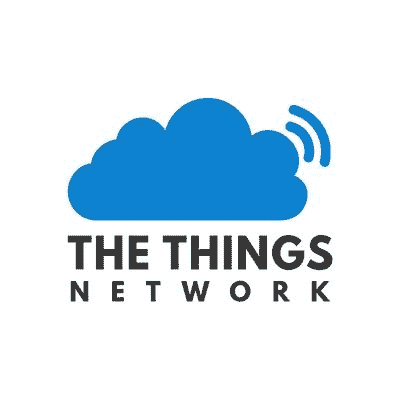](https://cdn.sparkfun.com/assets/learn_tutorials/7/9/6/picture.jpg)*Image courtesy of [The Things Network](https://www.thethingsnetwork.org/)*

### “共建全球物联网网络。”

[物联网](https://www.thethingsnetwork.org)本质上是[物联网产业](https://www.thethingsindustries.com/)的免费、基于社区的开源部门，物联网产业是开发企业物联网解决方案的产品和服务集成链。虽然物联网行业通过销售硬件、软件、服务和咨询来赚钱，但他们将物联网作为一种技术演示和获得市场份额的工具来维护。我知道这是一种愤世嫉俗的方式来讨论一个免费的开源网络，但我喜欢用这些术语来表达，因为他们的服务是如此方便和维护良好，以至于人们很自然地会想，“这其中有什么猫腻？”

物联网(TTN)是一个 LoRaWAN 网络服务器，带有一些额外的附加功能。向网络注册节点或应用程序是免费的，网络流量也是免费的——只要您遵守公平使用准则。服务是基于尽最大努力，所以没有正常运行时间或延迟的保证，但它是免费的！物联网还通过让注册网关变得极其简单来鼓励成员发展网络。只需将网关硬件连接到互联网，打开 TTN 控制台，然后按照提示进行操作。他们出售自己品牌的网关硬件，但也提供注册您的家酿网关的文档。注册网关时，您还需要提供网关的物理位置和天线位置，以便物联网可以估计网络覆盖范围，并为潜在用户绘制覆盖范围图。

为了帮助发展网络，物联网甚至为寻找、加入和启动区域性“社区”提供资源，这些组织致力于为整个城市或地区提供网络覆盖。您可以在下面的按钮中看到现有社区的地图。世界上许多大城市已经完全覆盖！

[The Things Network Map](https://www.thethingsnetwork.org/community)

不用说，我们认为物联网是一个非常酷的想法。此外，由于它是免费的，这是一个开始使用 LoRaWAN 的好方法。我们将使用物联网来完成本教程，因此，如果您所在的城市没有 TTN 覆盖，您需要设置自己的网关。你可以从[物联网市场](https://www.thethingsnetwork.org/marketplace/products/devices)买一个，或者用 [ESP8266](https://www.thethingsnetwork.org/labs/story/ttn-node-with-esp8266-and-rn2483) 或[树莓派](https://www.thethingsnetwork.org/labs/story/how-to-build-your-own-lorawan-gateway)自制一个！

**Heads up!** I'll assume for the purposes of this tutorial that you're within range of a functioning gateway. If you're not, you'll need to set up one of your own and register it to The Things Network before continuing.

## 注册您的节点

在编程第一个节点之前，您需要在物联网上注册一个设备。注册允许网络生成必要的密钥，然后将这些密钥放入您的代码中，以便网络识别您的设备。

**Heads up!** From here on out, I'm going to assume that you have [signed up](https://account.thethingsnetwork.org/register) for The Things Network and have access to the [The Things Network Console](https://console.thethingsnetwork.org/). It's free, to sign up you'll just need an email address.Click on any of the images below for a closer look.

登录控制台后，您将看到如下屏幕:

[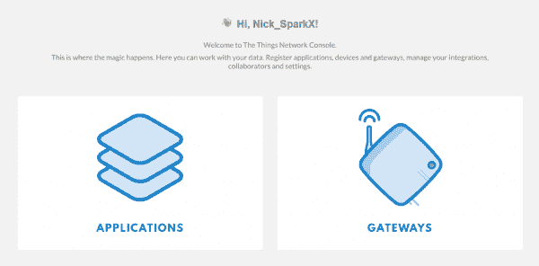](https://cdn.sparkfun.com/assets/learn_tutorials/7/9/6/Console.PNG)

您会注意到，没有仅添加节点的选项，这是因为物联网需要知道什么应用程序与您的设备相关联。因此，您需要从创建一个应用程序开始。点击*应用程序*按钮将带您进入如下页面:

[](https://cdn.sparkfun.com/assets/learn_tutorials/7/9/6/Add_app1.PNG)

这通常是你所有应用程序的列表，但是物联网非常有帮助地识别出你还没有任何应用程序，并建议你添加一个。您可以通过点击该链接或点击右上角的“添加应用程序”来添加应用程序。这两个链接都会将您带到以下页面:

[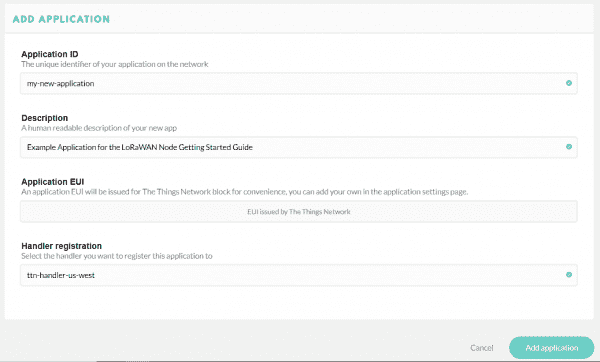](https://cdn.sparkfun.com/assets/learn_tutorials/7/9/6/Add_app2.PNG)

为您的应用程序提供一个应用程序 ID；这是物联网将用来区别于其他应用程序的名称。它只能包含小写字母、数字和破折号。描述字段是为人类准备的，所以花点时间写一句关于你的应用程序做什么的话。在这种情况下，我只是写了一个示例应用程序。EUI 将由网络发布，因此不需要在那里键入任何内容。最后，选择您希望应用程序注册到的处理程序。本质上，这些是位于世界各地不同物理位置的网络服务器的实例。所有的应用程序都会与所有的网络服务器通信，但是为了减少延迟，最好选择离你的网关最近的处理器。我在科罗拉多州，所以我选择了“ttn-handler-us-west”，我想这是在加利福尼亚州的某个地方。点击*添加应用程序*按钮，您将被带到新生成的应用程序控制台。

[](https://cdn.sparkfun.com/assets/learn_tutorials/7/9/6/nodevices.PNG)

现在您已经创建了一个应用程序，您可以向它注册一个设备。向下滚动到应用程序页面的*设备*部分，您将看到您当前的设备数量(没有)以及注册设备和管理设备的选项。点击*注册设备*。

[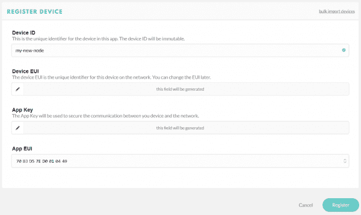](https://cdn.sparkfun.com/assets/learn_tutorials/7/9/6/Add_dev1.PNG)

这个表单非常类似于*注册应用程序*页面，但是您要做的事情要少一些。给你的设备一个设备 id，规则与应用程序 ID 相同。然后点击*设备 EUI* 字段旁边的小十字箭头，这让 TTN 知道你想让他们为你生成一个 EUI。现在只需点击表格底部的*注册*按钮。

[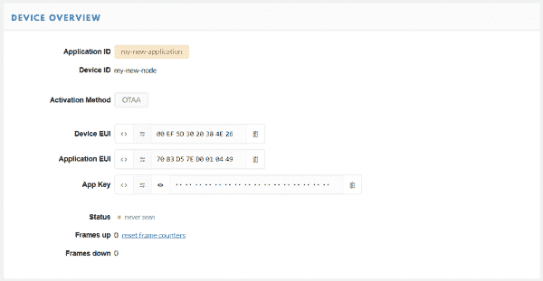](https://cdn.sparkfun.com/assets/learn_tutorials/7/9/6/Add_dev2.PNG)

现在，您已经被带到了全新的设备控制台。在标有*设备概述*的部分，您会注意到之前设置的应用 ID 和设备 ID。在*激活方式*下，它可能会说“OTAA”，代表*空中激活*。这是一种激活 LoRaWAN 设备的安全、可移动的方法，通过这种方法，只要设备想要加入网络，它就使用已知的应用密钥来请求新的会话密钥。这是激活生产设备的首选方法，但是对于原型来说，将会话密钥硬编码到您的设备中通常更容易。为此，我们需要通过个性化将激活方法设置为“ABP”或*激活。为此，单击设备页面右上角的*设置*选项卡，您将进入设备设置菜单。在页面中间，您应该可以找到一个选项来更改激活方法。*

[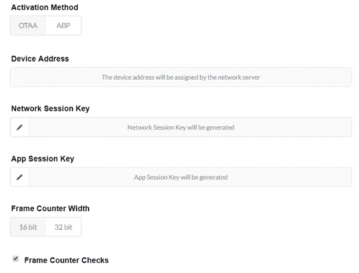](https://cdn.sparkfun.com/assets/learn_tutorials/7/9/6/Add_dev3.PNG)

点击“动态血压”，然后保存您的设置。当您返回概览页面时，您现在应该会在*设备概览*中看到一些额外的字段:

[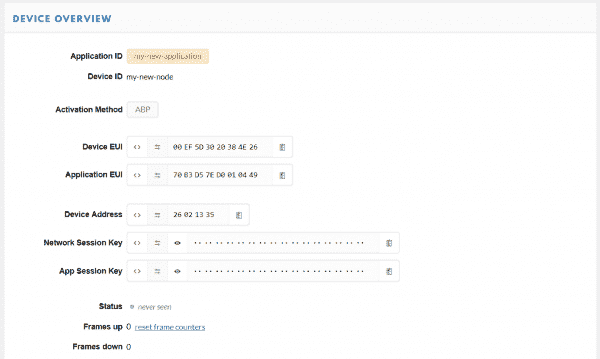](https://cdn.sparkfun.com/assets/learn_tutorials/7/9/6/Add_dev4.PNG)

我们需要这些数字来对您的 Pro RF 进行编程，因此请在您的浏览器上保留此页面，让我们打开 Arduino IDE。是时候给节点编程了！

## 编程您的节点

**注意:**此示例假设您在桌面上使用的是最新版本的 Arduino IDE。如果这是你第一次使用 Arduino，请回顾我们关于[安装 Arduino IDE 的教程。](https://learn.sparkfun.com/tutorials/installing-arduino-ide)如果您之前没有安装 Arduino 库，请查看我们的[安装指南。](https://learn.sparkfun.com/tutorials/installing-an-arduino-library)

我们将 [Pro RF](https://www.sparkfun.com/products/15836) 开发成一个小型、轻型的 LoRaWAN 节点。您需要做的只是闭合电路板底部的两个焊接跳线(标有 LoRaWAN ),以连接 LoRaWAN 库所需的额外 GPIO。做完这些，让我们开始吧！

[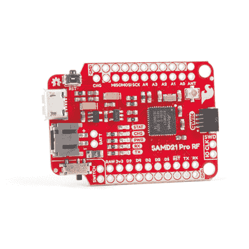](https://www.sparkfun.com/products/15836) 

将**添加到您的[购物车](https://www.sparkfun.com/cart)中！**

### [【spark fun Pro RF-LoRa，915MHz (SAMD21)](https://www.sparkfun.com/products/15836)

[Out of stock](https://learn.sparkfun.com/static/bubbles/ "out of stock") WRL-15836

SparkFun Pro RF 是一款支持 LoRa 的无线板，它将 SAMD21 和远程 RFM95W 结合在一起，构成了一个紧凑的电子设备

$33.953[Favorited Favorite](# "Add to favorites") 14[Wish List](# "Add to wish list")** **### 去 LMIC-阿尔杜伊诺图书馆

对于这个例子，我们将使用由 Matthijs Kooijman 编写的库，它是“IBM 的 LMIC (LoraMAC-in-C)”库的修改版本。你可以通过 Arduino 库管理器下载。它目前在 Arduino 库管理器中被称为“ **IBM LMIC 框架**”，但在下一个版本中可能会更改为“LMIC-Arduino”。或者你可以从 [GitHub 库](https://github.com/matthijskooijman/arduino-lmic)下载并手动安装。

[Arduino LMIC Library Download (ZIP)](https://github.com/matthijskooijman/arduino-lmic/archive/master.zip)

一旦安装了库，您可能需要编辑 LMIC 配置文件。找到你的 Arduino *库*文件夹并导航到**...IBM _ LMIC _ 框架/src/lmic/** ，你应该在这里找到一个名为 *config.h* 的文件，在任意文本编辑器中打开它，找到定义`CFG_us915`的行。它应该是这样的:

```
language:c
//#define CFG_eu868 1
#define CFG_us915 1
// This is the SX1272/SX1273 radio, which is also used on the HopeRF
// RFM92 boards.
//#define CFG_sx1272_radio 1
// This is the SX1276/SX1277/SX1278/SX1279 radio, which is also used on
// the HopeRF RFM95 boards.
#define CFG_sx1276_radio 1 
```

因为我们使用的是 915MHz 无线电模块，所以你需要确保行`#define CFG_us915 1`没有被注释掉，而行`#define CFG_eu868 1`被注释掉了，如上图所示，在前面加上`//`。收音机型号也是一样，我们想要`#define CFG_sx1276_radio 1`而不是`#define CFG_sx1272_radio 1`。完成这些更改后，保存 *config.h* 文件并返回 Arduino IDE。

### 编辑示例代码

安装了库之后，您现在应该在 *Examples* 菜单中有示例代码了。让我们从 ***文件>示例> IBM LMIC 框架> ttn-abp*** 开始，这是“abp”或“通过个性化激活”的示例代码。为了让它与你的应用程序一起工作，你需要从你的 TTN 控制台上的*设备概述*页面中复制一些键，所以在加载了*设备概述*页面的情况下，翻回到浏览器标签。

你会注意到，默认情况下，出于安全原因，*网络会话密钥*和*应用会话密钥*字段被隐藏。在复制代码之前，您可以单击眼睛图标来显示代码。此外，如果您点击`<>`按钮以“C 风格”显示代码，将更容易将其复制到示例代码中。

您需要将三个独立的数字复制到本页的示例代码中:网络会话密钥*、*应用会话密钥*和*设备地址*。下图解释了该页面上的哪个字段对应于示例代码中的哪个常量:*

[![Screenshot of the Device Address, Network Session Key, and App Session Key fields from the Device Overview page with red arrows and text pointing out several labels and icons. An icon with a stylized eye on it un-obscures the Key fields which are obscured by default for security reasons. An icon with angle brackets on it expands the Key fields into "c style," adding hex prefixes to each value, separating them with commas, and enclosing them in curly brackets. The Device Address field is labeled DEVADDR. The Network Session Key field is labeled NWKSKEY. The App Session Key field is labeled "APPSKEY".](img/a25b501af8078966ec7840eb10cd2137.png)](https://cdn.sparkfun.com/assets/learn_tutorials/7/9/6/keys.png)

您还需要替换代码的引脚映射部分，该部分将 lmic 库使用的引脚定义与 Pro RF 上的物理连接相关联。找到标有`// Pin mapping`的部分，替换为以下内容:

```
// Pin mapping
const lmic_pinmap lmic_pins = {
    .nss = A5,
    .rxtx = LMIC_UNUSED_PIN,
    .rst = 4,
    .dio = {7, 10, 11},
}; 
```

在示例代码中替换这些常量后，您可以将其上传到 Pro RF，并观察数据的涌入！

### 观察数据

示例代码旨在发送字符串“Hello，World！”每分钟一次。对于 LoRaWAN 来说，这实际上是一个相当大的字符串，您不应该让示例代码整天运行，因为它最终会违反 TTN 的公平使用政策。不过不用太担心，可以发一个“Hello，World！”违反政策前 24 小时内超过 600 次。

要查看来自设备的数据，请点击设备控制台中的*数据*选项卡。您应该看到一个标记为*应用数据*的字段，大约一分钟后，您将有望看到您的第一个数据包通过:

[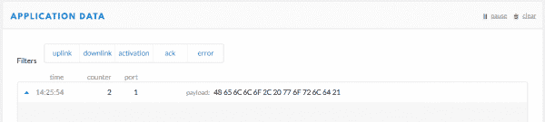](https://cdn.sparkfun.com/assets/learn_tutorials/7/9/6/AppData.PNG)

恭喜你！您刚刚向物联网发送了第一个 LoRaWAN 数据包，您的节点设备正在工作！

## 解码你的数据

您可能已经注意到在*应用程序数据*窗口中，您的有效负载以原始字节显示。为了看到“你好，世界！”以 ASCII 编码，你发送的方式，你需要解码有效载荷。物联网包括了在控制台中完成这项工作的工具！导航到您的应用的*应用概述*页面，点击*有效载荷格式*选项卡。此菜单允许您编写将应用于该应用程序的所有传入数据包的函数。

[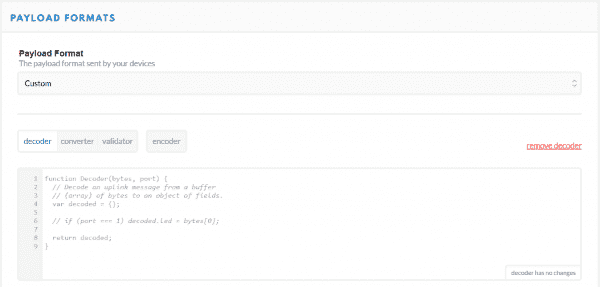](https://cdn.sparkfun.com/assets/learn_tutorials/7/9/6/decode1.PNG)

所以我们自己写解码器吧。我们需要获取原始字节数据，并返回一个包含对应于每个字节的所有字符的字符串。看一下这个解决方案，然后我们将详细介绍它:

```
language:js
function Decoder(bytes, port) {

return {
    ASCII: String.fromCharCode.apply(null, bytes)
};

} 
```

`Decoder`是物联网已经为我们设置好的一个 Javascript 函数。它有两个参数，称为*字节*，一个包含我们有效负载的数组，和*端口*，数据包的 lora wan“FPort”。FPort 标识数据包的最终应用或服务。端口 0 是为 MAC 消息保留的。对于我们的例子，我们不需要知道任何关于端口号的信息。

我们可以从`Decoder`函数返回我们想要的任何值，它将出现在*应用程序数据*窗口中我们的有效负载旁边。在上面的例子中，我创建了一个名为“ASCII”的新属性，它等于`String.fromCharCode.apply(null, bytes)`。为了进一步细分，我们返回一个名为“ASCII”的新字符串对象，我们使用 Javascript `apply()`方法调用带有参数`bytes`的`fromCharCode()`，并将结果填入我们的新字符串。`fromCharCode()`方法只是遍历数组`bytes`(记住，它包含我们的有效载荷)中的每个字节，并返回由字符代码表示的 ASCII 字符。

将上述代码复制到您的解码器函数后，向下滚动并点击*保存有效载荷函数*按钮。现在返回到*应用数据*窗口，您应该看到在解码器功能改变后接收到的所有数据包现在都有了一个新的属性:

[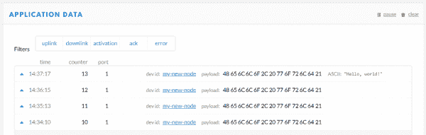](https://cdn.sparkfun.com/assets/learn_tutorials/7/9/6/decode3.PNG)

我们的信息包已经被解码了！太棒了。

## 使用您的数据

好了，现在你有数据传入你的 TTN 应用程序，但是你用它做什么呢？你有几个选择:

### 蜜蜂

以编程方式与物联网进行交互的最基本的端点是 TTN 处理程序 API 或“应用编程接口”。有两个 API，数据 API 和应用程序管理器 API。数据 API 允许您发送和接收消息，这使得它对于大多数应用程序来说是最有用的。您可以使用 [MQTT](https://www.thethingsnetwork.org/docs/applications/mqtt/) 协议与这个 API 进行交互。应用程序管理器 API 可以直接通过 [HTTP](https://www.thethingsnetwork.org/docs/applications/manager/) 获得，并让您管理应用程序、网关和设备。它比数据 API 强大得多，主要用于允许终端应用程序执行设备管理。

### SDK

物联网还创建了几个[软件开发工具包](https://www.thethingsnetwork.org/docs/applications/sdks.html)(SDK)，允许你编写应用程序，而不必直接与底层 API 交互。SDK 可用于几种流行的语言。

### 集成

最后，访问您的数据并将其投入使用的最简单方法是使用物联网的各种平台集成。集成允许您将应用数据直接传递到另一个平台，如 AWS IoT、Cayenne、EVRYTHNG 或 IFTTT。从那里，您可以使用这些平台与您的数据进行交互。

## 示例:IFTTT 集成

作为如何使用*集成*的例子，让我们用我们的示例应用程序建立一个 [IFTTT](https://ifttt.com/discover) 集成。

[](https://cdn.sparkfun.com/assets/learn_tutorials/7/9/6/ifttt-logo-large.png)*Image courtesy of [IFTTT](https://ifttt.com/discover)*

如果您从未使用过 IFTTT，请创建一个帐户。IFTTT 是一个非常酷的平台，它允许你结合网络上的服务来自动完成各种任务。这些服务的组合被称为“配方”，它们采用“如果发生这种情况，那么让它发生”的形式，在我们的例子中，*这个*将是到达我们应用程序的新数据。首先，转到您的 TTN 应用控制台，点击*集成*选项卡，然后点击“添加集成”。

在列表中找到“IFTTT Maker”集成。看起来是这样的:

[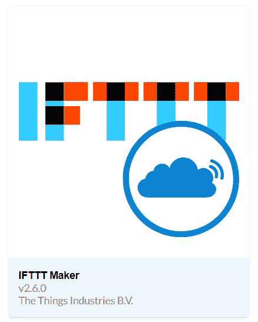](https://cdn.sparkfun.com/assets/learn_tutorials/7/9/6/IFTTTINt.PNG)

单击该块将带您进入该集成的“添加集成”表单。该表单有 6 个字段:

[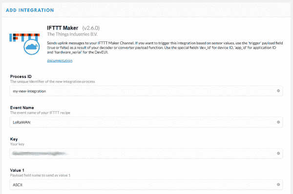](https://cdn.sparkfun.com/assets/learn_tutorials/7/9/6/IFTTT1b.PNG)

*   **进程 ID** -这是 TTN 将用来跟踪该集成的名称。你可以随便给它起什么名字，我把我的叫做“我的新整合”。

*   **事件名称** -这是每当应用程序接收到新数据时您想要触发的 IFTTT“配方”的名称。继续给它命名，只要记住你给它起的名字，这样我们就可以给你的 IFTTT 配方起同样的名字。

*   **键** -这是你的 IFTTT 键。你可以通过访问 IFTTT 上的 [Maker Webhooks](https://ifttt.com/maker_webhooks) 页面并点击*文档*按钮来找到它。

*   **值 1、值 2 和值 3** - IFTTT Webhooks 允许您向 IFTTT 配方传递最多 3 个值。在这种情况下，让我们将解码后的有效载荷传递给 IFTTT。为此，我们将想要传递的属性的名称放入值字段，因此在值 1 中键入“ASCII”。

好的，记下你设置的事件名称，点击*添加集成*按钮，让我们跳到 IFTTT。进入[新小程序](https://ifttt.com/create)页面，点击`If +This Then That`中的`+This`。您现在应该看到 IFTTT 触发的所有服务的列表...太多了。单击“Webhooks”服务并选择*接收 Web 请求*触发器。您可以在这里输入我们之前在 TTN 上设置集成时选择的事件名称。

[](https://cdn.sparkfun.com/assets/learn_tutorials/7/9/6/IFTTT2.PNG)

点击*创建触发器*，你将被带回*制作小程序*页面。现在点击`+That`为我们刚刚创建的触发器添加一个动作。IFTTT 有各种可用的触发器，但是为了本教程的目的，让我们做一些简单的事情。点击*电子邮件*服务，选择*给我发电子邮件*动作。每当你的 TTN 申请中有新的数据时，就会向你注册 IFTTT 的地址发送一封电子邮件。你甚至可以编辑邮件的正文。请注意，值 1、值 2 和值 3 是电子邮件中的成分。无论您在哪里看到该成分，它都会被替换为相应的值。在我们的例子中，值 1 将被替换为 ASCII 的值。点击*创建动作*，然后*完成*开始运行您的新小程序。

现在打开你的邮箱，插上你的 Pro RF。几分钟后，您应该会收到来自 IFTTT 的电子邮件！

[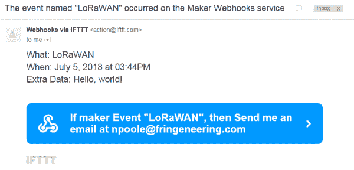](https://cdn.sparkfun.com/assets/learn_tutorials/7/9/6/IFTTT3.PNG)

漂亮。可恶。酷毙了。

[](https://cdn.sparkfun.com/assets/learn_tutorials/7/9/6/FFFFFF-0.0.png)

## 资源和更进一步

现在你已经知道了关于洛拉万的一切，你将如何使用它？有一些连接指南可以帮助您开始使用[SparkX Pro RF-LoRa-enabled 915 MHz 板](https://www.sparkfun.com/products/14785)。虽然对 SparkX 产品的支持是有限的，但这些应该会让您朝着正确的方向前进。

*   [Pro 微型连接指南](https://learn.sparkfun.com/tutorials/pro-micro--fio-v3-hookup-guide)
*   [RFM69 连接导轨](https://learn.sparkfun.com/tutorials/rfm69hcw-hookup-guide) -这是 RFM69 分线板的连接导轨。SparkX Pro RF - LoRa 使能板上使用的 RFM95W 模块实际上是 RFM69 模块的补充，增加了 2 个 GPIO 引脚来使能 LoRa。还要注意两者使用不同的库。

更多资源:

*   [物联网:lora wan](https://www.thethingsnetwork.org/docs/lorawan/)
    *   [物联网地图](https://www.thethingsnetwork.org/community)
    *   [账号登录](https://account.thethingsnetwork.org/users/login)
    *   [MQTT](https://www.thethingsnetwork.org/docs/applications/mqtt/)
    *   [应用管理器 API](https://www.thethingsnetwork.org/docs/applications/manager/)
    *   [SDK](https://www.thethingsnetwork.org/docs/applications/sdks.html)
*   [劳拉联盟](https://www.lora-alliance.org/about-lorawan)
*   [劳拉和皮科姆](https://docs.pycom.io/chapter/gettingstarted/registration/lora.html)
*   [物联网产业](https://www.thethingsindustries.com/)
*   [LMIC-Arduino GitHub 知识库](https://github.com/matthijskooijman/arduino-lmic)
*   [IFTTT](https://ifttt.com/discover)
    *   [Maker Webhooks](https://ifttt.com/maker_webhooks)
*   [维基百科:频移键控(FSK)](https://en.wikipedia.org/wiki/Frequency-shift_keying)

需要灵感？请随意查看下面的一些教程！

#### 物联网教程

[](https://learn.sparkfun.com/tutorials/photon-development-guide) [### 光子发展指南](https://learn.sparkfun.com/tutorials/photon-development-guide) A guide to the online and offline Particle IDE's to help aid you in your Photon development.[Favorited Favorite](# "Add to favorites") 19[](https://learn.sparkfun.com/tutorials/photon-redboard-hookup-guide) [### 光子 RedBoard 连接指南](https://learn.sparkfun.com/tutorials/photon-redboard-hookup-guide) Your guide to commissioning, tinkering, and programming the SparkFun Photon RedBoard.[Favorited Favorite](# "Add to favorites") 5[](https://learn.sparkfun.com/tutorials/raspberry-pi-4-kit-hookup-guide) [### Raspberry Pi 4 套件连接指南](https://learn.sparkfun.com/tutorials/raspberry-pi-4-kit-hookup-guide) Guide for hooking up your Raspberry Pi 4 Model B basic, desktop, or hardware starter kit together.[Favorited Favorite](# "Add to favorites") 2[](https://learn.sparkfun.com/tutorials/micromod-ethernet-function-board---w5500-hookup-guide) [### MicroMod 以太网功能板- W5500 连接指南](https://learn.sparkfun.com/tutorials/micromod-ethernet-function-board---w5500-hookup-guide) Add Ethernet and PoE capabilities to your MicroMod project using the Ethernet Function Board - W5500\.[Favorited Favorite](# "Add to favorites") 1

#### 无线教程

[](https://learn.sparkfun.com/tutorials/using-the-bluesmirf) [### 使用 BlueSMiRF](https://learn.sparkfun.com/tutorials/using-the-bluesmirf) How to get started using the BlueSMiRF and Bluetooth Mate Silvers.[Favorited Favorite](# "Add to favorites") 11[](https://learn.sparkfun.com/tutorials/reconbot-with-the-tessel-2) [### 用 Tessel 2 重组机器人](https://learn.sparkfun.com/tutorials/reconbot-with-the-tessel-2) Build a robot with the Tessel 2 that you can control from a browser on your phone or laptop.[Favorited Favorite](# "Add to favorites") 8[](https://learn.sparkfun.com/tutorials/serial-controlled-motor-driver-hookup-guide) [### 串行控制电机驱动器连接指南](https://learn.sparkfun.com/tutorials/serial-controlled-motor-driver-hookup-guide) Hookup guide for the Serial Controlled Motor Driver[Favorited Favorite](# "Add to favorites") 3[](https://learn.sparkfun.com/tutorials/getting-started-with-the-raspberry-pi-zero-wireless) [### Raspberry Pi Zero Wireless 入门](https://learn.sparkfun.com/tutorials/getting-started-with-the-raspberry-pi-zero-wireless) Learn how to setup, configure and use the smallest Raspberry Pi yet, the Raspberry Pi Zero - Wireless.[Favorited Favorite](# "Add to favorites") 17

或者看看这篇博文，获得更多有趣的灵感！

[](https://www.sparkfun.com/news/2700 "July 12, 2018: Here at SparkFun, we love our dogs. When we searched deep in our dog-loving hearts, we found one true question: What if they could talk? ") [### 今日英语:挖衣领

July 12, 2018](https://www.sparkfun.com/news/2700 "July 12, 2018: Here at SparkFun, we love our dogs. When we searched deep in our dog-loving hearts, we found one true question: What if they could talk? ")[Favorited Favorite](# "Add to favorites") 4**