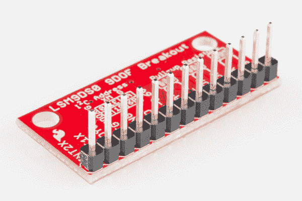

# LSM9DS0 连接指南

> 原文：<https://learn.sparkfun.com/tutorials/lsm9ds0-hookup-guide>

## 介绍

LSM9DS0 是一款多功能的单芯片运动传感系统。它在单个 [IC](https://learn.sparkfun.com/tutorials/integrated-circuits) 中内置了一个三轴[加速度计](https://learn.sparkfun.com/tutorials/accelerometer-basics)，三轴[陀螺仪](https://learn.sparkfun.com/tutorials/gyroscope)，和三轴**磁力计【9 DOF】**！LSM9DS0 中的每个传感器都支持广泛的...范围:加速度计的量程可以设置为 2、4、6、8 或 16 *g* ，陀螺仪支持 245、500 和 2000 /s，磁力计的满量程范围为 2、4、8 或 12 高斯。IMU-in-a-chip 太酷了，我们把它放在了分线板上。

[](https://www.sparkfun.com/products/retired/12636) 

### [SparkFun 9 自由度 IMU 突围- LSM9DS0](https://www.sparkfun.com/products/retired/12636)

[Retired](https://learn.sparkfun.com/static/bubbles/ "Retired") SEN-12636

这是 LSM9DS0，一款多功能运动检测单芯片系统，内置一个 3 轴加速度计、3 轴陀螺仪和 3-…

4 **Retired**[Favorited Favorite](# "Add to favorites") 4[Wish List](# "Add to wish list")

[https://www.youtube.com/embed/E4L8bYt6lCs/?autohide=1&border=0&wmode=opaque&enablejsapi=1](https://www.youtube.com/embed/E4L8bYt6lCs/?autohide=1&border=0&wmode=opaque&enablejsapi=1)

LSM9DS0 配备了一个数字接口，但即使这样也很灵活:它支持 [I ² C](https://learn.sparkfun.com/tutorials/i2c) 和 [SPI](https://learn.sparkfun.com/tutorials/serial-peripheral-interface-spi) ，所以你很难找到一个与之不兼容的微控制器。

### 本教程涵盖的内容

本教程专门介绍 LSM9DS0 的所有内容。我们将向您介绍芯片本身，然后是分线板。然后，我们将切换到示例代码，向您展示如何使用 Arduino 和我们的 [SFE_LSM9DS0 Arduino 库](https://github.com/sparkfun/SparkFun_LSM9DS0_Arduino_Library)与主板进行交互。

本教程分为以下几页:

*   [关于 LSM 9 ds 0](https://learn.sparkfun.com/tutorials/lsm9ds0-hookup-guide/about-the-lsm9ds0)-LSM 9 ds 0 的概述，研究其特性和功能。
*   [分线概述](https://learn.sparkfun.com/tutorials/lsm9ds0-hookup-guide/breakout-overview) -这一页涵盖了 LSM9DS0 分线板-如引脚排列、跳线和原理图等主题。
*   [硬件组装](https://learn.sparkfun.com/tutorials/lsm9ds0-hookup-guide/hardware-assembly) -组装技巧和窍门，以及一些关于分线点尺寸的信息。
*   [基础 Arduino 示例](https://learn.sparkfun.com/tutorials/lsm9ds0-hookup-guide/basic-arduino-example)——如何安装 **Arduino 库**，并使用简单的示例草图。
*   [高级 Arduino 示例](https://learn.sparkfun.com/tutorials/lsm9ds0-hookup-guide/advanced-arduino-example) -一个更高级的 Arduino 草图-使用库-展示诸如切换传感器比例和数据速率等功能。
*   [使用 Arduino 库](https://learn.sparkfun.com/tutorials/lsm9ds0-hookup-guide/using-the-arduino-library)——SFE _ LSM 9 ds 0 Arduino 库概述。

### 所需材料

本教程介绍如何将 LSM9DS0 分线板与 Arduino 配合使用。要跟进，您需要以下材料:

[](https://cdn.sparkfun.com/assets/0/9/0/7/c/lsm9ds0-connected-to-arduino.jpg)

*   [LSM9DS0 分线板](https://www.sparkfun.com/products/12636)
*   [Arduino UNO](https://www.sparkfun.com/products/11021) 、 [RedBoard](https://www.sparkfun.com/products/11575) 或另一个 [Arduino 兼容板](https://learn.sparkfun.com/tutorials/arduino-comparison-guide)
*   [直阳接头](https://www.sparkfun.com/products/116) -或电线。用来连接 breakout 和试验板的东西。
*   任何尺寸(即使是迷你)都可以。
*   [M/M 跳线](https://www.sparkfun.com/products/11026) -连接 Arduino 和试验板。
*   **逻辑电平转换器**(以下任何一种都可以工作)
    *   [双向逻辑电平转换器](https://www.sparkfun.com/products/12009) -基于 MOSFET 的电平移位器(**这是教程用的**)。
    *   [PCA9306 双向电压转换器](https://www.sparkfun.com/products/11955) -固态 I ² C 聚焦电平转换器。

任何 5V 操作的 Arduino (UNO、RedBoard、Leonardo 等)都需要逻辑电平转换器。如果你使用基于 3.3V 的“duino”，如 Arduino Pro 3.3V 或 T2 3.3V Pro Mini，就没有必要进行电平转换。

### 推荐阅读

如果您不熟悉下面的一些概念，我们建议您在继续学习之前先阅读该教程。

*   [加速度计基础知识](https://learn.sparkfun.com/tutorials/accelerometer-basics)
*   [陀螺仪](https://learn.sparkfun.com/tutorials/gyroscope)
*   [串行外设接口(SPI)](https://learn.sparkfun.com/tutorials/serial-peripheral-interface-spi)
*   [IC 间通信(I ² C)](https://learn.sparkfun.com/tutorials/i2c)
*   [逻辑电平](https://learn.sparkfun.com/tutorials/logic-levels)
*   [双向变速杆连接指南](https://learn.sparkfun.com/tutorials/bi-directional-logic-level-converter-hookup-guide)

## 关于 LSM9DS0

LSM9DS0 是为数不多的能够在单个 IC 中测量运动的三个关键属性(角速度、加速度和方向)的 IC 之一。

[陀螺仪](https://learn.sparkfun.com/tutorials/gyroscope)可以测量**角速度**——也就是“我旋转的速度有多快，沿着哪个轴？”角速度以每秒**度**来衡量，通常缩写为 DPS 或/s。LSM 9ds 0 可以测量高达 2000 DPS，尽管该刻度也可以设置为 245 或 500 DPS 以获得更好的分辨率。

一个[加速度计](tutorials/)测量**加速度**，它指示速度变化有多快——“我加速或减速的速度有多快？”加速度通常以米/秒 ² (米/秒)或*克*(重力【约 9.8 米/秒】2 )来衡量。如果一个物体静止不动，它感觉到大约 1 *g* 的加速度朝向地面(假设地面在地球上，物体接近海平面)。LSM9DS0 以*g*s 为单位测量其加速度，其量程可设置为 2、4、6、8 或 16_g。

最后，还有[磁力计](http://en.wikipedia.org/wiki/Magnetometer)，它测量**磁场**的功率和方向。虽然它们不容易被看到，但磁场存在于我们周围——无论你拿着一个微小的铁磁体还是感觉被地球磁场吸引。LSM9DS0 以**高斯** (Gs)为单位测量磁场，并可将其测量范围设置为 2、4、8 或 12 Gs。

通过测量这三个属性，你可以获得关于物体运动的大量知识。九自由度有无数的应用。用磁力计测量地球磁场的力度和方向，就可以近似你的**航向**。手机中的加速度计可以测量重力的方向，并估计**方位**(纵向、横向、平面等)。).内置陀螺仪的四轴飞行器可以留意突然的滚动或俯仰，并在事情失控之前纠正它们的动量。

[](https://cdn.sparkfun.com/assets/8/b/b/4/5/9DOF-3axes.png)

LSM9DS0 在三维空间中测量这些运动特性。这意味着它产生九条数据**:x/y/z 方向的加速度、x/y/z 方向的角旋转和 x/y/z 方向的磁力。在分线板上，z 轴垂直于 PCB，y 轴平行于短边，x 轴平行于长边。每个轴也有一个正方向和一个负方向，由标签上的箭头方向表示。**

在某种意义上，LSM9DS0 是两个 IC 挤在一个封装中——就像你把一个 [L3G4200D 陀螺仪](https://www.sparkfun.com/products/10612)和一个 [LSM303DLMTR 加速度/磁](https://www.sparkfun.com/products/10888)组合在一起一样。该设备的一半负责所有的陀螺仪，另一半管理加速度计和磁力计。事实上，一些控制引脚专用于单个传感器——有**两个芯片选择引脚**(陀螺仪的 CSG 和加速度/磁的 CSXM)和**两个串行数据输出引脚** (SDOG 和 SDOXM)。

### 选择你自己的冒险:SPI 还是我

除了能够测量各种运动矢量，LSM9DS0 在硬件端还具有多种功能。它同时支持 [SPI](https://learn.sparkfun.com/tutorials/serial-peripheral-interface-spi) 和 [I ² C](https://learn.sparkfun.com/tutorials/i2c) ，所以你应该不难找到一个可以与之对话的微控制器。

SPI 通常是两者中较容易实现的，但它也需要更多的线——四条线对 I ² C 的两条线。

因为 LSM9DS0 支持两种通信方式，**一些引脚必须拉双功能**。例如，*串行数据输出*引脚，在 SPI 模式下就是这样做的，但是如果你通过 I ² C 使用该器件，它就变成了一个地址选择器。*片选*在低电平时激活 SPI 模式，但如果被拉高，器件将采用 I ² C 通信。在下一节中，我们将讨论 LSM9DS0 的每一个引脚，请密切注意那些支持两种接口的引脚。

* * *

有关该 IC 的更多详细信息，我们鼓励您[查看数据手册](https://cdn.sparkfun.com/assets/f/6/1/f/0/LSM9DS0.pdf)！

## 突破概述

现在，您已经了解了 LSM9DS0 IC 的所有相关信息，让我们来谈谈它所在的分线板。在这一页，我们将讨论断开的引脚，以及板上的一些其他功能。

### 引脚排列

LSM9DS0 分线点总共有 13 个引脚。

[](https://cdn.sparkfun.com/assets/7/f/7/9/1/top-view-pinout.jpg)

以下是每个引脚功能的概述:

| Pin Label | 引脚功能 | 笔记 |
| CSG | 芯片选择陀螺仪 | 此引脚在陀螺仪的 I ² C 和 SPI 之间进行选择。保持 I ² C 为高电平，或者将其用作 SPI 的(低电平有效)芯片选择。
**高(1)** : SPI 空闲模式/ **I ² C 使能**
**低(0)** : **SPI 使能** / I ² C 禁用。 |
| CSXM | 芯片选择加速/放大(XM) | 此引脚在 I ² C 和 XM 上的 SPI 之间进行选择。保持 I ² C 为高电平，或者将其用作 SPI 的(低电平有效)芯片选择。
**高(1)** : SPI 空闲模式/ **I ² C 使能**
**低(0)** : **SPI 使能** / I ² C 禁用。 |
| SDOG(移动通信) | SPI:陀螺仪 MISO
I ² C:陀螺仪地址选择 | 在 SPI 模式下，这是陀螺仪数据输出(SDO_G)。在 I ² C 模式下，选择 I ² C 地址(SA0_G)的 LSb |
| SDOXM | SPI:Accel/Mag MISO
I²C:XM 地址选择 | 在 SPI 模式下，这是 XM 数据输出(SDO_XM)。在 I ² C 模式下，选择 I ² C 地址(SA0_XM)的 LSb |
| SCL | 串行时钟 | I ² C 和 SPI 串行时钟。 |
| 国家药品监督管理局 | SPI: MOSI
I ² C:串行数据 | SPI:设备数据输入(MOSI)
I ² C:串行数据(双向) |
| VDD | 电源 | 芯片的电源电压。应在 **2.4V 和 3.6V** 之间调节。 |
| GND | 地面 | 0V 电源电压 |
| 那个人 | 陀螺仪数据使能 | 大多不为人知。LSM9DS0 数据手册对此引脚没有太多说明。 |
| INTG | 陀螺仪可编程中断 | 可以编程为高/低电平有效、推挽或开漏的中断。它可以在转速过高/过低时触发。 |
| DRDYG | 陀螺仪数据就绪 | 表示新陀螺仪数据就绪或缓冲区溢出的中断。 |
| INT1XM | 加速度/磁力中断 1 | 可编程中断，可在数据就绪、过加速或“点击”时触发。 |
| INT2XM | 加速度/磁力中断 2 | 可编程中断，可在数据就绪、过加速或“点击”时触发。 |

这些引脚可以分为三类:通信、中断或电源。

#### 电源

VDD 和 GND 引脚是向 IC 提供电压和 0V 参考的地方。分线板不调节该电压，因此确保该电压在 LSM9DS0 的允许电源电压范围内: **2.4V 至 3.6V** 。下面是数据表中的电气特性表。

[](https://cdn.sparkfun.com/assets/0/3/6/a/1/electrical-characteristics.jpg)

通信引脚不支持 5V 电压，因此需要调整到 VDD 的几 mV 范围内。

这个传感器的另一个很酷的地方是它的低功耗。在正常操作中-每个传感器都打开-它将拉动大约**6.5 毫安**。

#### 沟通

CSG、CSXM、SDOG、SDOXM、SCL 和 SDA 都用于 I ² C 和 SPI 接口。这些引脚的功能取决于您使用两个接口中的哪一个。

如果你正在使用 using **I ² C** 这里是你可以如何配置这些引脚:

*   拉高 CSG 和 CSXM。这将把陀螺仪和加速度/磁力都设置为 I ² C 模式。
*   将 SDOG 和 SDOXM 设为高电平或低电平。这些引脚设置陀螺仪和加速度/磁传感器的 I ² C 地址。
*   将 SCL 连接到微控制器的 SCL 引脚。
*   将 SDA 连接到微控制器的 SDA 引脚。
*   该板在 SDA 和 SCL 线路上都有一个内置的 10kΩ上拉电阻。如果该值太高，可以并联第二个 10kΩ电阻，将上拉电阻分压至约 5kω。

或者，如果您使用的是 **SPI** :

*   将 CSG 和 CSXM 连接到微控制器上两个独立可控的引脚。这些片选为低电平有效，当引脚变为低电平时，与陀螺仪(CSG)或加速度计/磁传感器(CSXM)的 SPI 通信使能。
*   SDOG 和 SDOXM 是串行数据输出引脚。在许多情况下，你会希望将它们连接在一起，并将其连接到微控制器的 **MISO** (主输入，从输出)引脚。
*   将 SCL 连接到微控制器的 SCLK(串行时钟)引脚。
*   将 SDA 连接到微控制器的 **MOSI** (主输出，从输入)引脚。

#### 中断

LSM9DS0 上有多种中断。虽然连接这些引脚不像通信或电源引脚那样重要，但使用它们将有助于充分利用芯片。

特定于加速度计和磁力计的中断为 **INT1XM** 和 **INT2XM** 。这两种器件均可编程为高电平有效或低电平有效中断，在数据就绪、点击检测等事件发生时触发，或者当加速度或磁场超过设定阈值时触发。

**DRDY** 和 **INTG** 是专门的陀螺仪中断。当新的陀螺仪读数准备读取时，DRDY 可以设置为高电平或低电平。INTG 更具可定制性，它可以用于在任何轴上角度旋转超过阈值时触发。

### 跳楼者

翻转 LSM9DS0 分线点，可以看到三个双向表面贴装跳线。这些跳线中的每一个**关闭**。他们的目的是**自动将 LSM9DS0 置入 I ² C 模式**。

[](https://cdn.sparkfun.com/assets/5/3/8/0/f/jumper-locations.jpg)*The three two-way jumpers on the back of the board. Follow the labels to see which pin they pull up.*

每个跳线都通过一个 10kΩ电阻将一对引脚拉至 VDD。跳线的中间焊盘连接到电阻，边缘焊盘连接到一个引脚(根据标签找出是哪一个)。您可以在原理图上看到这些跳线是如何匹配的:

[](https://cdn.sparkfun.com/assets/a/2/9/4/1/jumper-schematic.jpg)

最右边的跳线将 CSG 和 CSXM 连接到一个上拉电阻，这将把 LSM9DS0 设置为 I ² C 模式。中间跳线上拉 SDOG 和 SDOXM，设置芯片的 I ² C 地址。最后，最左边的跳线将上拉电阻添加到 I ² C 通信引脚——SDA 和 SCL。

这些跳线的目的是尽可能方便地使用电路板；使用尽可能少的电线。如果使用 I ² C 分线，可以忽略四个 SDO 和 CS 引脚。

要禁用这些跳线，拿出您的[方便的业余爱好刀](https://www.sparkfun.com/products/9200)，小心地切断中间焊盘和边缘焊盘之间的小痕迹。即使你使用的是 SPI，跳线也不应该妨碍你与芯片的通信能力。

* * *

有关分线板的更多信息，我们鼓励您[查看原理图](https://cdn.sparkfun.com/assets/8/c/c/4/9/lsm9ds0_breakout-v10-schematic-.pdf)。或者，如果你真的想深入研究 PCB 的解剖，你可以[下载 EAGLE 文件](https://cdn.sparkfun.com/assets/f/6/9/6/d/lsm9ds0-breakout-v10-EAGLE.zip)。

## 硬件装配

在这一页，我们将讨论汇编提示。组装分线板真的没什么大不了的——真正的关键是将*什么的*焊接到分线孔中。

### 焊接某物

为了获得与 LSM9DS0 分线点的可靠电气和物理连接，您需要将连接器或电线焊接到分线点。确切地说，你在电路板上焊接什么取决于你如何使用它。

如果您打算在[试验板](https://learn.sparkfun.com/tutorials/how-to-use-a-breadboard)或类似的 0.1 英寸间距的 perfboard 中使用分线板，我们建议将[直插头](https://www.sparkfun.com/products/116)焊接到引脚中(如果您需要，还有[长插头](https://www.sparkfun.com/products/10158))。

[](https://cdn.sparkfun.com/assets/7/f/d/5/e/headers-soldered.jpg)

如果你要将分线器安装在一个狭窄的地方，你可能会选择将电线([绞合](https://www.sparkfun.com/products/11375)或[实芯](https://www.sparkfun.com/products/11367))焊接到引脚上。

### 安装分线点

因为 LSM9DS0 能够感知运动，所以保持固定很重要(至少对于大多数应用而言)。因此，电路板在与引脚相对的角上有一对安装孔。钻孔直径为 0.13 英寸，因此它们应该能够容纳任何 [4/40 螺钉](https://www.sparkfun.com/products/10453)。

如果您还有任何与尺寸相关的问题，希望下面的尺寸图可以回答这些问题:

[](https://cdn.sparkfun.com/assets/c/d/f/1/e/PCB-dimensions.png)

查阅 [EAGLE PCB 设计文件](https://cdn.sparkfun.com/assets/f/6/9/6/d/lsm9ds0-breakout-v10-EAGLE.zip)以了解更多关于分线点尺寸的信息。

## 基本 Arduino 示例

这个例子将向你展示如何下载和安装 SFE_LSM9DS0 库，并以最基本的形式使用它。我们将使用 I ² C 并忽略中断，这意味着我们将使用尽可能少的导线和 Arduino 引脚。

### 下载并安装库

我们编写了一个全功能的 Arduino 库，以帮助尽可能轻松地与 LSM9DS0 的陀螺仪和加速度计/磁力计接口。访问 [GitHub 库](https://github.com/sparkfun/SparkFun_LSM9DS0_Arduino_Library)下载最新版本的库，或者点击下面的链接:

[Download the SFE_LSM9DS0 Arduino Library](https://github.com/sparkfun/SparkFun_LSM9DS0_Arduino_Library/archive/master.zip)

要获得安装库的帮助，请查看我们的[如何安装 Arduino 库教程](https://learn.sparkfun.com/tutorials/installing-an-arduino-library)。你需要将 *SFE_LSM9DS0* 文件夹移动到 Arduino sketchbook 中的*库*文件夹。

### 简单的硬件连接(I ² C)

该库将与 I2C 或 SPI 一起工作。因为我们试图尽可能节约我们的 Arduino 管脚，我 ² C 就是它了！下面是这个例子的熔块图:

[](https://cdn.sparkfun.com/assets/1/5/9/9/9/simple-redboard_levelShift_bb.png)*Connecting the LSM9DS0 to a RedBoard via a [Bi-Directional Logic Level Converter](https://www.sparkfun.com/products/12009).*

这种连接依赖于电路板背面的所有**跳线**被设置(它们应该被设置，除非它们已经被切片)。如果跳线已断开，则将所有四个 CS 和 SDO 引脚连接至 3.3V。

由于我们使用 I2C，我们所要做的就是将 SDA 连接到 SDA，将 SCL 连接到 SCL。不幸的是，由于 LSM9DS0 的**最大工作电压为 3.6V** ，我们需要使用一个[电平转换板](https://learn.sparkfun.com/tutorials/bi-directional-logic-level-converter-hookup-guide)在 3.3V 和 5V 之间切换。

或者，如果你有一个 3.3V 操作的 Arduino -像 [3.3V/8MHz Pro](https://www.sparkfun.com/products/10914) -你可以将 SDA 和 SCL 直接从微控制器连接到传感器。

[](https://cdn.sparkfun.com/assets/9/8/9/2/b/simple-pro_bb.png)

见鬼，你甚至可以在 Arduino Pro 上安装分线板。如果你这样做，你需要设置一个 3 高和一个 2 低。传感器产生的电流很小，足以让 Arduino 的 I/O 引脚为其供电！

[](https://cdn.sparkfun.com/assets/4/0/8/3/b/lsm9ds0-on-arduino-pro.jpg)*The wireless hookup: mounting an LSM9DS0 on top of an Arduino Pro. Pull A2 LOW and A3 HIGH to power the breakout.*

### 打开 LSM9DS0_Simple 示例

一旦安装了资源库，请打开 Arduino(如果它已经打开，请重新启动它)。你会在**文件下找到第一个例子** > **例子**>**SFE _ lsm9ds 0**>**lsm9ds 0 _ Simple**:

```
language:c
/*****************************************************************
LSM9DS0_Simple.ino
SFE_LSM9DS0 Library Simple Example Code
Jim Lindblom @ SparkFun Electronics
Original Creation Date: February 18, 2014
https://github.com/sparkfun/LSM9DS0_Breakout

The LSM9DS0 is a versatile 9DOF sensor. It has a built-in
accelerometer, gyroscope, and magnetometer. Very cool! Plus it
functions over either SPI or I2C.

This Arduino sketch is a demo of the simple side of the
SFE_LSM9DS0 library. It'll demo the following:
* How to create a LSM9DS0 object, using a constructor (global
  variables section).
* How to use the begin() function of the LSM9DS0 class.
* How to read the gyroscope, accelerometer, and magnetometer
  using the readGryo(), readAccel(), readMag() functions and the
  gx, gy, gz, ax, ay, az, mx, my, and mz variables.
* How to calculate actual acceleration, rotation speed, magnetic
  field strength using the calcAccel(), calcGyro() and calcMag()
  functions.
* How to use the data from the LSM9DS0 to calculate orientation
  and heading.

Hardware setup: This library supports communicating with the
LSM9DS0 over either I2C or SPI. If you're using I2C, these are
the only connections that need to be made:
    LSM9DS0 --------- Arduino
     SCL ---------- SCL (A5 on older 'Duinos')
     SDA ---------- SDA (A4 on older 'Duinos')
     VDD ------------- 3.3V
     GND ------------- GND
(CSG, CSXM, SDOG, and SDOXM should all be pulled high jumpers on 
  the breakout board will do this for you.)

If you're using SPI, here is an example hardware setup:
    LSM9DS0 --------- Arduino
          CSG -------------- 9
          CSXM ------------- 10
          SDOG ------------- 12
          SDOXM ------------ 12 (tied to SDOG)
          SCL -------------- 13
          SDA -------------- 11
          VDD -------------- 3.3V
          GND -------------- GND

The LSM9DS0 has a maximum voltage of 3.6V. Make sure you power it
off the 3.3V rail! And either use level shifters between SCL
and SDA or just use a 3.3V Arduino Pro.   

Development environment specifics:
    IDE: Arduino 1.0.5
    Hardware Platform: Arduino Pro 3.3V/8MHz
    LSM9DS0 Breakout Version: 1.0

This code is beerware. If you see me (or any other SparkFun 
employee) at the local, and you've found our code helpful, please 
buy us a round!

Distributed as-is; no warranty is given.
*****************************************************************/

// The SFE_LSM9DS0 requires both the SPI and Wire libraries.
// Unfortunately, you'll need to include both in the Arduino
// sketch, before including the SFE_LSM9DS0 library.
#include <SPI.h> // Included for SFE_LSM9DS0 library
#include <Wire.h>
#include <SFE_LSM9DS0.h>

///////////////////////
// Example I2C Setup //
///////////////////////
// Comment out this section if you're using SPI
// SDO_XM and SDO_G are both grounded, so our addresses are:
#define LSM9DS0_XM  0x1D // Would be 0x1E if SDO_XM is LOW
#define LSM9DS0_G   0x6B // Would be 0x6A if SDO_G is LOW
// Create an instance of the LSM9DS0 library called `dof` the
// parameters for this constructor are:
// [SPI or I2C Mode declaration],[gyro I2C address],[xm I2C add.]
LSM9DS0 dof(MODE_I2C, LSM9DS0_G, LSM9DS0_XM);

///////////////////////
// Example SPI Setup //
///////////////////////
/* // Uncomment this section if you're using SPI
#define LSM9DS0_CSG  9  // CSG connected to Arduino pin 9
#define LSM9DS0_CSXM 10 // CSXM connected to Arduino pin 10
LSM9DS0 dof(MODE_SPI, LSM9DS0_CSG, LSM9DS0_CSXM);
*/

// Do you want to print calculated values or raw ADC ticks read
// from the sensor? Comment out ONE of the two #defines below
// to pick:
#define PRINT_CALCULATED
//#define PRINT_RAW

#define PRINT_SPEED 500 // 500 ms between prints

void setup()
{
  Serial.begin(115200); // Start serial at 115200 bps
  // Use the begin() function to initialize the LSM9DS0 library.
  // You can either call it with no parameters (the easy way):
  uint16_t status = dof.begin();
  // Or call it with declarations for sensor scales and data rates:  
  //uint16_t status = dof.begin(dof.G_SCALE_2000DPS, 
  //                            dof.A_SCALE_6G, dof.M_SCALE_2GS);

  // begin() returns a 16-bit value which includes both the gyro 
  // and accelerometers WHO_AM_I response. You can check this to
  // make sure communication was successful.
  Serial.print("LSM9DS0 WHO_AM_I's returned: 0x");
  Serial.println(status, HEX);
  Serial.println("Should be 0x49D4");
  Serial.println();
}

void loop()
{
  printGyro();  // Print "G: gx, gy, gz"
  printAccel(); // Print "A: ax, ay, az"
  printMag();   // Print "M: mx, my, mz"

  // Print the heading and orientation for fun!
  printHeading((float) dof.mx, (float) dof.my);
  printOrientation(dof.calcAccel(dof.ax), dof.calcAccel(dof.ay), 
                   dof.calcAccel(dof.az));
  Serial.println();

  delay(PRINT_SPEED);
}

void printGyro()
{
  // To read from the gyroscope, you must first call the
  // readGyro() function. When this exits, it'll update the
  // gx, gy, and gz variables with the most current data.
  dof.readGyro();

  // Now we can use the gx, gy, and gz variables as we please.
  // Either print them as raw ADC values, or calculated in DPS.
  Serial.print("G: ");
#ifdef PRINT_CALCULATED
  // If you want to print calculated values, you can use the
  // calcGyro helper function to convert a raw ADC value to
  // DPS. Give the function the value that you want to convert.
  Serial.print(dof.calcGyro(dof.gx), 2);
  Serial.print(", ");
  Serial.print(dof.calcGyro(dof.gy), 2);
  Serial.print(", ");
  Serial.println(dof.calcGyro(dof.gz), 2);
#elif defined PRINT_RAW
  Serial.print(dof.gx);
  Serial.print(", ");
  Serial.print(dof.gy);
  Serial.print(", ");
  Serial.println(dof.gz);
#endif
}

void printAccel()
{
  // To read from the accelerometer, you must first call the
  // readAccel() function. When this exits, it'll update the
  // ax, ay, and az variables with the most current data.
  dof.readAccel();

  // Now we can use the ax, ay, and az variables as we please.
  // Either print them as raw ADC values, or calculated in g's.
  Serial.print("A: ");
#ifdef PRINT_CALCULATED
  // If you want to print calculated values, you can use the
  // calcAccel helper function to convert a raw ADC value to
  // g's. Give the function the value that you want to convert.
  Serial.print(dof.calcAccel(dof.ax), 2);
  Serial.print(", ");
  Serial.print(dof.calcAccel(dof.ay), 2);
  Serial.print(", ");
  Serial.println(dof.calcAccel(dof.az), 2);
#elif defined PRINT_RAW 
  Serial.print(dof.ax);
  Serial.print(", ");
  Serial.print(dof.ay);
  Serial.print(", ");
  Serial.println(dof.az);
#endif

}

void printMag()
{
  // To read from the magnetometer, you must first call the
  // readMag() function. When this exits, it'll update the
  // mx, my, and mz variables with the most current data.
  dof.readMag();

  // Now we can use the mx, my, and mz variables as we please.
  // Either print them as raw ADC values, or calculated in Gauss.
  Serial.print("M: ");
#ifdef PRINT_CALCULATED
  // If you want to print calculated values, you can use the
  // calcMag helper function to convert a raw ADC value to
  // Gauss. Give the function the value that you want to convert.
  Serial.print(dof.calcMag(dof.mx), 2);
  Serial.print(", ");
  Serial.print(dof.calcMag(dof.my), 2);
  Serial.print(", ");
  Serial.println(dof.calcMag(dof.mz), 2);
#elif defined PRINT_RAW
  Serial.print(dof.mx);
  Serial.print(", ");
  Serial.print(dof.my);
  Serial.print(", ");
  Serial.println(dof.mz);
#endif
}

// Here's a fun function to calculate your heading, using Earth's
// magnetic field.
// It only works if the sensor is flat (z-axis normal to Earth).
// Additionally, you may need to add or subtract a declination
// angle to get the heading normalized to your location.
// See: http://www.ngdc.noaa.gov/geomag/declination.shtml
void printHeading(float hx, float hy)
{
  float heading;

  if (hy > 0)
  {
    heading = 90 - (atan(hx / hy) * (180 / PI));
  }
  else if (hy < 0)
  {
    heading = - (atan(hx / hy) * (180 / PI));
  }
  else // hy = 0
  {
    if (hx < 0) heading = 180;
    else heading = 0;
  }

  Serial.print("Heading: ");
  Serial.println(heading, 2);
}

// Another fun function that does calculations based on the
// acclerometer data. This function will print your LSM9DS0's
// orientation -- it's roll and pitch angles.
void printOrientation(float x, float y, float z)
{
  float pitch, roll;

  pitch = atan2(x, sqrt(y * y) + (z * z));
  roll = atan2(y, sqrt(x * x) + (z * z));
  pitch *= 180.0 / PI;
  roll *= 180.0 / PI;

  Serial.print("Pitch, Roll: ");
  Serial.print(pitch, 2);
  Serial.print(", ");
  Serial.println(roll, 2);
} 
```

上传代码后，打开你的**串行监视器**和**设置波特率为 115200 bps** 。您应该会看到这样内容开始流动:

[](https://cdn.sparkfun.com/assets/3/9/7/1/5/serial_monitor-simple.png)

每一个串行输出格式都从运动的所有九个维度给出了读数。首先是陀螺仪读数(“G: x，y，z”)，单位为每秒**度** (DPS)。然后是**中的三度加速度 *g* 的**(“A:x，y，z”)，接着是**高斯** (Gs)中的磁场读数(“M: x，y，z”)。

试着移动你的试验板(小心，不要断开任何电线！).数字在变吗？检查加速度值-垂直于重力的轴应该感受到大约 1 *g* 的加速度。

**标题**是否输出了您所期望的内容？如果北方似乎偏离了几度，你可能需要调整你的**偏角**。这意味着增加或减少一个与你在[这张地图](http://www.ngdc.noaa.gov/geomag/declination.shtml)上的位置相关的常数。

* * *

这就是全部了！如果您想通过使用中断输出从 LSM9DS0 中获得更多信息，请查看下一页！或者查看使用 Arduino 库页面的[以获得使用库的帮助。](./using-the-arduino-library)

## 高级 Arduino 示例

如果您只想每秒几次轮询 LSM9DS0 以获取运动数据，那么[基本示例](./basic-arduino-example)是完美的，但是如果您想利用 IMU 的中断输出，该怎么办呢？使用中断，只要 LSM9DS0 可用，就可以从其读取数据。此示例将向您展示如何从您的 LSM9DS0 突破中获得更多收益。

### 电路图

除了 SDA 和 SCL 引脚，本例还将使用 **DRDYG** 、 **INT1XM** 和 **INT2XM** 引脚。这是连接图:

[](https://cdn.sparkfun.com/assets/e/2/8/f/f/advanced-redboard_levelShift_bb.png)

同样，您需要在 SDAs 和 SCL 之间使用一个逻辑电平转换器。三条中断线上不需要电平转换——LSM 9ds 0 的 3.3V 输出足以触发 Arduino 上的逻辑高电平(参见[逻辑电平](https://learn.sparkfun.com/tutorials/logic-levels))。

### 示例代码:LSM9DS0_SerialMenus

进入**文件** > **实例**>**SFE _ LSM 9 ds 0**>**LSM 9 ds 0 _ serial menus**打开*实例。代码如下:*

```
language:c
/*****************************************************************
LSM9DS0_SerialMenus.ino
SFE_LSM9DS0 Library Example Code: Interact With Serial Menus
Jim Lindblom @ SparkFun Electronics
Original Creation Date: February 14, 2014 (Happy Valentines Day!)
https://github.com/sparkfun/LSM9DS0_Breakout

This Arduino sketch is a demo of all things SEF_LSM9DS0 library.
Once you attach all hardware, and upload the sketch, open your
Serial monitor at 115200 BPS. Follow the menu prompts to either:
    1) Stream readings from the accelerometer.
    2) Stream readings from the gyroscope.
    3) Stream readings from the magnetometer.
    4) Set the scales of each sensor (e.g. +/-4g, 500DPS, 8Gs)
    5) Switch to/from calculated or raw data (e.g. ADC ticks or
        g's, DPS, and Gs)
    6) Set the output data rate of each sensor.

Hardware setup: This library supports communicating with the
LSM9DS0 over either I2C or SPI. In addition to those wires, this
sketch demos how to use the interrupts. Here's what the I2C setup
looks like:
    LSM9DS0 --------- Arduino
     CSG ------------- NONE (Pulled HIGH [indicates I2C mode])
     CSXM ------------ NONE (Pulled HIGH [indicates I2C mode])
     SDOG ------------ NONE (Pulled HIGH [sets I2C address])
     SDOXM ----------- NONE (Pulled HIGH [sets I2C address])
     SCL ---------- SCL (A5 on older 'Duinos')
     SDA ---------- SDA (A4 on older 'Duinos')
     VDD ------------- 3.3V
     GND ------------- GND
     DEN ------------- NONE (Not used in this example)
     INTG ------------ NONE (Not used in this example)
     DRDYG ------------ 4 (Could be any digital pin)
     INT1XM ----------- 3 (Could be any digital pin)
     INT2XM ----------- 2 (Could be any digital pin)

The LSM9DS0 has a maximum voltage of 3.6V. Make sure you power it
off the 3.3V rail! And either use level shifters between SCL
and SDA or just use a 3.3V Arduino Pro.   

Development environment specifics:
    IDE: Arduino 1.0.5
    Hardware Platform: Arduino Pro 3.3V/8MHz
    LSM9DS0 Breakout Version: 1.0

This code is beerware; if you see me (or any other SparkFun 
employee) at the local, and you've found our code helpful, please 
buy us a round!

Distributed as-is; no warranty is given.
*****************************************************************/

// The SFE_LSM9DS0 requires both the SPI and Wire libraries.
// Unfortunately, you'll need to include both in the Arduino
// sketch, before including the SFE_LSM9DS0 library.
#include <SPI.h> // Included for SFE_LSM9DS0 library
#include <Wire.h>
#include <SFE_LSM9DS0.h>

///////////////////////
// Example I2C Setup //
///////////////////////
// SDO_XM and SDO_G are both grounded, therefore our addresses are:
#define LSM9DS0_XM  0x1D // Would be 0x1E if SDO_XM is LOW
#define LSM9DS0_G   0x6B // Would be 0x6A if SDO_G is LOW
// Create an instance of the LSM9DS0 library called `dof` the
// parameters for this constructor are:
// [SPI or I2C Mode declaration], [gyro I2C address], [xm I2C address]
LSM9DS0 dof(MODE_I2C, LSM9DS0_G, LSM9DS0_XM);

///////////////////////
// Example SPI Setup //
///////////////////////
//#define LSM9DS0_CSG  9  // CSG connected to Arduino pin 9
//#define LSM9DS0_CSXM 10 // CSXM connected to Arduino pin 10
//LSM9DS0 dof(MODE_SPI, LSM9DS0_CSG, LSM9DS0_CSXM);

///////////////////////////////
// Interrupt Pin Definitions //
///////////////////////////////
const byte INT1XM = 2; // INT1XM tells us when accel data is ready
const byte INT2XM = 3; // INT2XM tells us when mag data is ready
const byte DRDYG = 4;  // DRDYG tells us when gyro data is ready

// A boolean to keep track of whether we're printing raw (ADC)
// or calculated (g's, DPS, Gs) sensor data:
boolean printRaw = true;

void setup()
{
  // Set up interrupt pins as inputs:
  pinMode(INT1XM, INPUT);
  pinMode(INT2XM, INPUT);
  pinMode(DRDYG, INPUT);

  Serial.begin(115200); // Start serial at 115200 bps
  // Use the begin() function to initialize the LSM9DS0 library.
  // You can either call it with no parameters (the easy way):
  uint16_t status = dof.begin();
  // Or call it with declarations for sensor scales and data rates:  
  //uint16_t status = dof.begin(dof.G_SCALE_2000DPS, dof.A_SCALE_6G, dof.M_SCALE_2GS);

  // begin() returns a 16-bit value which includes both the gyro and
  // accelerometers WHO_AM_I response. You can check this to make sure
  // communication was successful.
  Serial.println(status, HEX);
}

void loop()
{
  // Print the control menu:
  printMenu();
  // Then wait for any serial data to come in:
  while (!Serial.available())
    ;
  // Once serial data is received, call parseMenu to act on it:
  parseMenu(Serial.read());

}

void printAccel()
{
  // Only read from the accelerometer if the accel interrupts,
  // which means that new data is ready.
  if (digitalRead(INT1XM))
  {
    // Use the readAccel() function to get new data from the accel.
    // After calling this function, new values will be stored in
    // the ax, ay, and az variables.
    dof.readAccel();

    Serial.print("A: ");
    if (printRaw)
    {
      Serial.print(dof.ax);
      Serial.print(", ");
      Serial.print(dof.ay);
      Serial.print(", ");
      Serial.println(dof.az);
    }
    else
    {
      Serial.print(dof.calcAccel(dof.ax));
      Serial.print(", ");
      Serial.print(dof.calcAccel(dof.ay));
      Serial.print(", ");
      Serial.println(dof.calcAccel(dof.az));
    }
  }
}

void printGyro()
{
  // Only read from the gyro if the DRDY interrupts,
  // which means that new data is ready.
  if (digitalRead(DRDYG))
  {
    // Use the readGyro() function to get new data from the gyro.
    // After calling this function, new values will be stored in
    // the gx, gy, and gz variables.
    dof.readGyro();

    Serial.print("G: ");
    if (printRaw)
    {
      Serial.print(dof.gx);
      Serial.print(", ");
      Serial.print(dof.gy);
      Serial.print(", ");
      Serial.println(dof.gz);
    }
    else
    {
      Serial.print(dof.calcGyro(dof.gx));
      Serial.print(", ");
      Serial.print(dof.calcGyro(dof.gy));
      Serial.print(", ");
      Serial.println(dof.calcGyro(dof.gz));
    }
  }
}

void printMag()
{
  // Only read from the magnetometer if the INT2XM interrupts,
  // which means that new data is ready.
  if (digitalRead(INT2XM))
  {
    // Use the readMag() function to get new data from the mag.
    // After calling this function, new values will be stored in
    // the mx, my, and mz variables.
    dof.readMag();

    Serial.print("M: ");
    if (printRaw)
    {
      Serial.print(dof.mx);
      Serial.print(", ");
      Serial.print(dof.my);
      Serial.print(", ");
      Serial.print(dof.mz);
      Serial.print(", ");
      Serial.println(calcHeading(dof.mx, dof.my, dof.mz));
    }
    else
    {
      Serial.print(dof.calcMag(dof.mx), 4);
      Serial.print(", ");
      Serial.print(dof.calcMag(dof.my), 4);
      Serial.print(", ");
      Serial.print(dof.calcMag(dof.mz), 4);
      Serial.print(", ");
      Serial.println(calcHeading(dof.mx, dof.my, dof.mz));
    }
  }
}

// Here's a simple example function to calculate heading based on
// magnetometer readings. This only works when the 9DOF is flat
// (x-axis normal to gravity).
float calcHeading(float hx, float hy, float hz)
{  
  if (hy > 0)
  {
    return 90 - atan(hx / hy) * 180 / PI;
  }
  else if (hy < 0)
  {
    return 270 - atan(hx / hy) * 180 / PI;
  }
  else // hy = 0
  {
    if (hx < 0) return 180;
    else return 0;
  }
}

// This function will print all data from all sensors at once.
// It'll wait until every sensor interrupt triggers before
// printing.
void streamAll()
{
  if ((digitalRead(INT2XM)) && (digitalRead(INT1XM)) &&
      (digitalRead(DRDYG)))
  {
    printAccel();
    printGyro();
    printMag();
  }
}

void setScale()
{
  char c;

  Serial.println(F("Set accelerometer scale:"));
  Serial.println(F("\t1) +/- 2G"));
  Serial.println(F("\t2) +/- 4G"));
  Serial.println(F("\t3) +/- 6G"));
  Serial.println(F("\t4) +/- 8G"));
  Serial.println(F("\t5) +/- 16G"));
  while (Serial.available() < 1)
    ;
  c = Serial.read();
  switch (c)
  {
    case '1':
      dof.setAccelScale(dof.A_SCALE_2G);
      break;
    case '2':
      dof.setAccelScale(dof.A_SCALE_4G);
      break;
    case '3':
      dof.setAccelScale(dof.A_SCALE_6G);
      break;
    case '4':
      dof.setAccelScale(dof.A_SCALE_8G);
      break;
    case '5':
      dof.setAccelScale(dof.A_SCALE_16G);
      break;
  }

  Serial.println(F("Set gyroscope scale:"));
  Serial.println(F("\t1) +/- 245 DPS"));
  Serial.println(F("\t2) +/- 500 DPS"));
  Serial.println(F("\t3) +/- 2000 DPS"));
  while (Serial.available() < 1)
    ;
  c = Serial.read();
  switch (c)
  {
    case '1':
      dof.setGyroScale(dof.G_SCALE_245DPS);
      break;
    case '2':
      dof.setGyroScale(dof.G_SCALE_500DPS);
      break;
    case '3':
      dof.setGyroScale(dof.G_SCALE_2000DPS);
      break;
  }

  Serial.println(F("Set magnetometer scale:"));
  Serial.println(F("\t1) +/- 2GS"));
  Serial.println(F("\t2) +/- 4GS"));
  Serial.println(F("\t3) +/- 8GS"));
  Serial.println(F("\t4) +/- 12GS"));
  while (Serial.available() < 1)
    ;
  c = Serial.read();
  switch (c)
  {
    case '1':
      dof.setMagScale(dof.M_SCALE_2GS);
      break;
    case '2':
      dof.setMagScale(dof.M_SCALE_4GS);
      break;
    case '3':
      dof.setMagScale(dof.M_SCALE_8GS);
      break;
    case '4':
      dof.setMagScale(dof.M_SCALE_12GS);
      break;
  }
}

void setRaw()
{
  if (printRaw)
  {
    printRaw = false;
    Serial.println(F("Printing calculated readings"));
  }
  else
  {
    printRaw = true;
    Serial.println(F("Printing raw readings"));
  }
}

void setODR()
{
  char c;

  Serial.println(F("Set Accelerometer ODR (Hz):"));
  Serial.println(F("\t1) 3.125 \t 6) 100"));
  Serial.println(F("\t2) 6.25  \t 7) 200"));
  Serial.println(F("\t3) 12.5  \t 8) 400"));
  Serial.println(F("\t4) 25    \t 9) 800"));
  Serial.println(F("\t5) 50    \t A) 1600"));
  while (Serial.available() < 1)
    ;
  c = Serial.read();
  switch (c)
  {
    case '1':
      dof.setAccelODR(dof.A_ODR_3125);
      break;
    case '2':
      dof.setAccelODR(dof.A_ODR_625);
      break;
    case '3':
      dof.setAccelODR(dof.A_ODR_125);
      break;
    case '4':
      dof.setAccelODR(dof.A_ODR_25);
      break;
    case '5':
      dof.setAccelODR(dof.A_ODR_50);
      break;
    case '6':
      dof.setAccelODR(dof.A_ODR_100);
      break;
    case '7':
      dof.setAccelODR(dof.A_ODR_200);
      break;
    case '8':
      dof.setAccelODR(dof.A_ODR_400);
      break;
    case '9':
      dof.setAccelODR(dof.A_ODR_800);
      break;
    case 'A':
    case 'a':
      dof.setAccelODR(dof.A_ODR_1600);
      break;
  }

  Serial.println(F("Set Gyro ODR/Cutoff (Hz):"));
  Serial.println(F("\t1) 95/12.5 \t 8) 380/25"));
  Serial.println(F("\t2) 95/25   \t 9) 380/50"));
  Serial.println(F("\t3) 190/125 \t A) 380/100"));
  Serial.println(F("\t4) 190/25  \t B) 760/30"));
  Serial.println(F("\t5) 190/50  \t C) 760/35"));
  Serial.println(F("\t6) 190/70  \t D) 760/50"));
  Serial.println(F("\t7) 380/20  \t E) 760/100"));
  while (Serial.available() < 1)
    ;
  c = Serial.read();
  switch (c)
  {
    case '1':
      dof.setGyroODR(dof.G_ODR_95_BW_125);
      break;
    case '2':
      dof.setGyroODR(dof.G_ODR_95_BW_25);
      break;
    case '3':
      dof.setGyroODR(dof.G_ODR_190_BW_125);
      break;
    case '4':
      dof.setGyroODR(dof.G_ODR_190_BW_25);
      break;
    case '5':
      dof.setGyroODR(dof.G_ODR_190_BW_50);
      break;
    case '6':
      dof.setGyroODR(dof.G_ODR_190_BW_70);
      break;
    case '7':
      dof.setGyroODR(dof.G_ODR_380_BW_20);
      break;
    case '8':
      dof.setGyroODR(dof.G_ODR_380_BW_25);
      break;
    case '9':
      dof.setGyroODR(dof.G_ODR_380_BW_50);
      break;
    case 'A':
    case 'a':
      dof.setGyroODR(dof.G_ODR_380_BW_100);
      break;
    case 'B':
    case 'b':
      dof.setGyroODR(dof.G_ODR_760_BW_30);
      break;
    case 'C':
    case 'c':
      dof.setGyroODR(dof.G_ODR_760_BW_35);
      break;
    case 'D':
    case 'd':
      dof.setGyroODR(dof.G_ODR_760_BW_50);
      break;
    case 'E':
    case 'e':
      dof.setGyroODR(dof.G_ODR_760_BW_100);
      break;
  }

  Serial.println(F("Set Magnetometer ODR (Hz):"));
  Serial.println(F("\t1) 3.125 \t 4) 25"));
  Serial.println(F("\t2) 6.25  \t 5) 50"));
  Serial.println(F("\t3) 12.5  \t 6) 100"));
  while (Serial.available() < 1)
    ;
  c = Serial.read();
  switch (c)
  {
    case '1':
      dof.setMagODR(dof.M_ODR_3125);
      break;
    case '2':
      dof.setMagODR(dof.M_ODR_625);
      break;
    case '3':
      dof.setMagODR(dof.M_ODR_125);
      break;
    case '4':
      dof.setMagODR(dof.M_ODR_25);
      break;
    case '5':
      dof.setMagODR(dof.M_ODR_50);
      break;
    case '6':
      dof.setMagODR(dof.M_ODR_100);
      break;
  }
}

void printMenu()
{
  Serial.println();
  Serial.println(F("////////////////////////////////////////////"));
  Serial.println(F("// LSM9DS0 Super Awesome Amazing Fun Time //"));
  Serial.println(F("////////////////////////////////////////////"));
  Serial.println();
  Serial.println(F("1) Stream Accelerometer"));
  Serial.println(F("2) Stream Gyroscope"));
  Serial.println(F("3) Stream Magnetometer"));
  Serial.println(F("4) Stream output from all sensors"));
  Serial.println(F("5) Set Sensor Scales"));
  Serial.println(F("6) Switch To/From Raw/Calculated Readings"));
  Serial.println(F("7) Set Output Data Rates")); 
  Serial.println(); 
}

void parseMenu(char c)
{
  switch (c)
  {
    case '1':
      while(!Serial.available())
        printAccel();
      break;
    case '2':
      while(!Serial.available())
        printGyro();
      break;
    case '3':
      while(!Serial.available())
        printMag();
      break;
    case '4':
      while(!Serial.available())
      {
        streamAll();
      }
      break;
    case '5':
      setScale();
      break;
    case '6':
      setRaw();
      break;
    case '7':
      setODR();
      break;
  }
} 
```

上传代码，然后打开串行监视器，将**波特率设置为 115200 bps** 。然后只需按照菜单提示与传感器进行交互。您可以单独或一起传输加速度计、陀螺仪和磁力计。

[](https://cdn.sparkfun.com/assets/d/f/9/e/2/serialMenu-interaction.gif)

发送任意键停止流媒体播放并返回菜单。

还有允许您设置传感器的**范围**和**数据速率**的菜单项。请务必旋转一下，看看它们如何影响传感器的输出。

## 使用 Arduino 库

这两个基础和高级教程展示了 SFE_LSM9DS0 库可以做的一切。如果你不知道如何使用这个库，这里有一些关键的概念和功能:

### 安装材料

要启用这个库，您需要**包含**它，并且您还需要包含 [SPI](http://arduino.cc/en/Reference/SPI) 和 [Wire](http://arduino.cc/en/reference/wire) 库:

```
language:c
#include <SPI.h> // Included for SFE_LSM9DS0 library
#include <Wire.h>
#include <SFE_LSM9DS0.h> 
```

确保 SPI 和 Wire includes 位于 SFE_LSM9DS0 之上。

#### 构造器

构造函数创建 LSM9DS0 类的实例。一旦创建了实例，就可以用它来控制突破。这一行代码通常放在草图的**全局**区域。

构造器告诉这个库三件事:你是使用 I ² C 还是 SPI，以及陀螺仪和加速度计/磁力计传感器的地址。如果你使用 I ² C，这些地址是数据手册中定义的 7 位地址

```
language:c
// SDO_XM and SDO_G are both grounded, so our addresses are:
#define LSM9DS0_XM  0x1D // Would be 0x1E if SDO_XM is LOW
#define LSM9DS0_G   0x6B // Would be 0x6A if SDO_G is LOW
// Create an instance of the LSM9DS0 library called `dof` the
// parameters for this constructor are:
// [SPI or I2C Mode declaration],[gyro I2C address],[xm I2C add.]
LSM9DS0 dof(MODE_I2C, LSM9DS0_G, LSM9DS0_XM); 
```

*Declaring an LSM9DS0 object using I2C for communication.*

如果使用 SPI，陀螺仪和加速度/磁力地址应该是连接到每个片选引脚(CSG 和 CSXM)的 Arduino 引脚。

```
language:c
#define LSM9DS0_CSG  9  // CSG connected to Arduino pin 9
#define LSM9DS0_CSXM 10 // CSXM connected to Arduino pin 10
LSM9DS0 dof(MODE_SPI, LSM9DS0_CSG, LSM9DS0_CSXM); 
```

*Declaring an LSM9DS0 object using SPI for communication.*

您的 LSM9DS0 类对象可以像任何其他变量一样命名。在我们的例子中，我们称之为*DOF*——简短而甜蜜。

#### 开始()

一旦创建了 LSM9DS0 对象，就可以开始使用它了！第一步是**通过使用`begin()`功能初始化传感器**。您可以不带参数地调用这个函数，以获得一个良好的默认 init:

```
language:c
// Initialize LSM9DS0, setting gyro scale to 245 DPS, accel to 2g, and mag to 2Gs.
// Also set data rates to 95 Hz (gyro), 50 Hz (accel), and 50 Hz (mag).
dof.begin(); 
```

或者，给它一整套参数来设置每个传感器的比例和数据速率。

```
language:c
// Initialize LSM9DS0, setting gyro scale to 500 DPS, accel to +/-16g, and mag to 12Gs.
// Also set data rates to 760 Hz (gyro), 1600 Hz (accel), and 100 Hz (mag) (lots of data!)
dof.begin(G_SCALE_500DPS, A_SCALE_16G, M_SCALE_12GS, G_ODR_760_BW_100, A_ODR_1600, M_ODR_100); 
```

比例和数据速率选择有多种选项。请咨询 [SFE_LSM9DS0.h](https://github.com/sparkfun/LSM9DS0_Breakout/blob/master/Libraries/Arduino/SFE_LSM9DS0/SFE_LSM9DS0.h) 了解更多信息。

### 读取和解释传感器

如果你不能从传感器中得到任何数据，那传感器有什么用！？这里是你需要从库中获取加速度、转速和磁场强度数据的函数。

#### readAccel()、readGyro()和 readMag()

这三个功能- `readAccel()`、`readGyro()`和`readMag()` -轮询 LSM9DS0，以从三个传感器中的每一个获得最新的读数。

read 函数不带任何参数，也不返回任何内容，那么如何获得这些数据呢？在该函数运行完它的过程后，它将更新一组**三个类变量**，这些变量将包含您想要的传感器数据。`readAccel()`会更新`ax`、`ay`和`az`、`readGyro()`会更新`gx`、`gy`和`gz`、`readMag()`会更新`mx`、`my`和`mz`。这里有一个例子:

```
language:c
dof.readAccel(); // Update the accelerometer data
Serial.print(dof.ax); // Print x-axis data
Serial.print(", ");
Serial.print(dof.ay); // print y-axis data
Serial.print(", ");
Serial.println(dof.az); // print z-axis data 
```

*An example of reading and printing all three axes of accelerometer data.*

这些值都是**有符号的 16 位整数**，这意味着它们的范围从-32，768 到 32，767。这个值没有多大意义，除非你知道传感器的规模，这是下一个功能发挥作用的地方。

#### calcAccel()、calcGyro()和 calcMag()

该库跟踪每个传感器的标度，并实现这些辅助函数，使传感器的原始 ADC 读数与实际单位之间的转换变得容易。

`calcAccel()`、`calcGyro()`和`calcMag()`都接受一个参数——一个有符号的 16 位整数——并转换成它们各自的单位。它们都返回一个浮点值，你可以随意处理。

以下是打印陀螺仪计算值的示例:

```
language:c
dof.readGyro(); // Update gyroscope data
Serial.print(dof.calcGyro(dof.gx)); // Print x-axis rotation in DPS
Serial.print(", ");
Serial.print(dof.calcGyro(dof.gy)); // Print y-axis rotation in DPS
Serial.print(", ");
Serial.println(dof.calcGyro(dof.gz)); // Print z-axis rotation in DPS 
```

* * *

该库还实现了单独设置传感器比例或数据速率的功能。要获得更多使用库的帮助，请查看示例代码中的注释，或者[钻研库代码本身](https://github.com/sparkfun/LSM9DS0_Breakout/tree/master/Libraries/Arduino/SFE_LSM9DS0)。

## 资源和更进一步

希望该信息转储足以让您使用 LSM9DS0。如果您需要更多信息，这里有更多资源:

*   [示意图(PDF)](https://cdn.sparkfun.com/assets/8/c/c/4/9/lsm9ds0_breakout-v10-schematic-.pdf)
*   [老鹰文件(ZIP)](https://cdn.sparkfun.com/assets/f/6/9/6/d/lsm9ds0-breakout-v10-EAGLE.zip)
*   [LSM9DS0 数据手册(PDF)](https://cdn.sparkfun.com/assets/f/6/1/f/0/LSM9DS0.pdf) -该数据手册涵盖从 IC 的硬件和引脚排列，到陀螺仪和加速度计/磁力计的寄存器映射。
*   [Arduino 库](https://github.com/sparkfun/SparkFun_LSM9DS0_Arduino_Library/tree/master)
*   [GitHub 回购](https://learn.sparkfun.com/tutorials/lsm9ds0-hookup-guide)
*   [SFE 产品展示区](https://www.sparkfun.com/videos#all/E4L8bYt6lCs/153)

现在您已经启动并运行了 LSM9DS0，您打算将运动感测融入哪个项目？需要一点灵感吗？看看这些教程吧！

*   RedBot 入门-red bot 是一个非常棒的入门级机器人平台。如果将 LSM9DS0 连接到它，将会非常有趣。
*   [龙与地下城骰子挑战](https://learn.sparkfun.com/tutorials/dungeons-and-dragons-dice-gauntlet) -这个项目使用加速度计来感应“掷骰子”动作。你可以换上 LSM9DS0 来增加更多的功能——比如基于指南针的伤害乘数！
*   [Leap Motion tear down](https://learn.sparkfun.com/tutorials/leap-motion-teardown)-IMU 传感器很酷，但基于图像的运动感应才是未来。看看这个微型 Kinect-like Leap Motion 的拆卸！