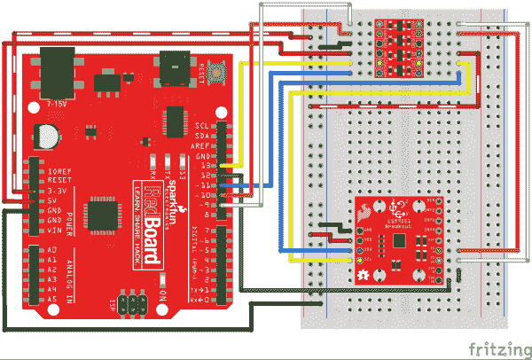

# LSM9DS1 分线连接指南

> 原文：<https://learn.sparkfun.com/tutorials/lsm9ds1-breakout-hookup-guide>

## 介绍

LSM9DS1 是一款多功能的单芯片运动传感系统。它在单个 [IC](https://learn.sparkfun.com/tutorials/integrated-circuits) 中内置了一个三轴[加速度计](https://learn.sparkfun.com/tutorials/accelerometer-basics)，三轴[陀螺仪](https://learn.sparkfun.com/tutorials/gyroscope)，和三轴**磁力计【9 DOF】**！LSM9DS1 中的每个传感器支持广泛的...范围:加速度计的量程可以设置为 2、4、8 或 16 *g* ，陀螺仪支持 245、500 和 2000 /s，磁力计的满量程范围为 2、4、12 或 16 高斯。IMU-in-a-chip 太酷了，我们把它放在一个四分之一大小的分线板上。

[](https://www.sparkfun.com/products/retired/13284) 

### [spark fun 9 DOF IMU Breakout-LSM 9 ds 1](https://www.sparkfun.com/products/retired/13284)

[Retired](https://learn.sparkfun.com/static/bubbles/ "Retired") SEN-13284

SparkFun LSM9DS1 Breakout 是一款多功能的单芯片运动传感系统。它包含一个三轴加速度计，三轴陀螺仪…

11 **Retired**[Favorited Favorite](# "Add to favorites") 42[Wish List](# "Add to wish list")

LSM9DS1 配备了一个数字接口，但即使这样也很灵活:它支持 [I ² C](https://learn.sparkfun.com/tutorials/i2c) 和 [SPI](https://learn.sparkfun.com/tutorials/serial-peripheral-interface-spi) ，所以你很难找到一个与之不兼容的微控制器。

### 本教程涵盖的内容

本教程专门介绍 LSM9DS1 的所有内容。我们将向您介绍芯片本身，然后是分线板。然后我们将切换到示例代码，向您展示如何使用 Arduino 和我们的 [LSM9DS1 Arduino 库](https://github.com/sparkfun/SparkFun_LSM9DS1_Arduino_Library)与主板进行交互。

本教程分为以下几页:

*   [LSM9DS1 概述](https://learn.sparkfun.com/tutorials/lsm9ds1-breakout-hookup-guide#lsm9ds1-overview)-LSM 9 ds 1 概述，检查其特性和功能。
*   [分线板概述](https://learn.sparkfun.com/tutorials/lsm9ds1-breakout-hookup-guide#breakout-board-overview) -该页面检查 LSM9DS1 分线板-包括引脚排列、跳线和原理图等主题。
*   [硬件组装](https://learn.sparkfun.com/tutorials/lsm9ds1-breakout-hookup-guide#hardware-assembly) -组装技巧和窍门，以及一些关于分线点尺寸的信息。
*   [硬件连接](https://learn.sparkfun.com/tutorials/lsm9ds1-breakout-hookup-guide#hardware-hookup) -示例一 ² C 和 SPI 接线图。
*   [安装 Arduino 库](https://learn.sparkfun.com/tutorials/lsm9ds1-breakout-hookup-guide#installing-the-arduino-library)——如何安装 **Arduino 库**，并使用一个简单的示例草图来验证您的连接工作正常。
*   [使用 Arduino 库](https://learn.sparkfun.com/tutorials/lsm9ds1-breakout-hookup-guide#using-the-arduino-library)——SFE _ LSM 9 ds 1 Arduino 库的函数和变量概述。

### 所需材料

本教程介绍如何将 LSM9DS1 分线板与 Arduino 配合使用。要跟进，您需要以下材料:

[](https://cdn.sparkfun.com/assets/learn_tutorials/3/7/3/example-hookup.jpg)

*   [LSM9DS1 分线板](https://www.sparkfun.com/products/13284)
*   [Arduino UNO](https://www.sparkfun.com/products/11021) 、 [RedBoard](https://www.sparkfun.com/products/11575) 或另一个 [Arduino 兼容板](https://learn.sparkfun.com/tutorials/arduino-comparison-guide)
*   [直阳接头](https://www.sparkfun.com/products/116) -或电线。用来连接 breakout 和试验板的东西。
*   任何尺寸(即使是迷你)都可以。
*   [M/M 跳线](https://www.sparkfun.com/products/11026) -连接 Arduino 和试验板。

**The LSM9DS1 is a 3.3V device!** Supplying voltages greater than ~3.6V can permanently damage the IC. As long as your Arduino has a 3.3V supply output, and you're OK with using I²C, you shouldn't need any extra level shifting. But if you want to use SPI, you may need a [level shifter](https://www.sparkfun.com/products/12009).

任何 5V 操作的 Arduino (UNO、RedBoard、Leonardo 等)都需要逻辑电平转换器。如果你使用基于 3.3V 的“duino”，如 Arduino Pro 3.3V 或 T2 3.3V Pro Mini，就没有必要进行电平转换。

### 推荐阅读

如果您不熟悉下面的一些概念，我们建议您在继续学习之前先阅读该教程。

*   [加速度计基础知识](https://learn.sparkfun.com/tutorials/accelerometer-basics)
*   [陀螺仪](https://learn.sparkfun.com/tutorials/gyroscope)
*   [串行外设接口(SPI)](https://learn.sparkfun.com/tutorials/serial-peripheral-interface-spi)
*   [IC 间通信(I ² C)](https://learn.sparkfun.com/tutorials/i2c)
*   [逻辑电平](https://learn.sparkfun.com/tutorials/logic-levels)
*   [双向变速杆连接指南](https://learn.sparkfun.com/tutorials/bi-directional-logic-level-converter-hookup-guide)

## LSM9DS1 概述

LSM9DS1 是为数不多的能够在单个 IC 中测量运动的三个关键属性(角速度、加速度和方向)的 IC 之一。

[陀螺仪](https://learn.sparkfun.com/tutorials/gyroscope)可以测量**角速度**——也就是“我旋转的速度有多快，沿着哪个轴？”角速度以每秒**度**测量，通常缩写为 DPS 或/s。LSM 9 ds 1 可以测量高达 2000 DPS，尽管该刻度也可以设置为 245 或 500 DPS 以获得更好的分辨率。

一个[加速度计](https://learn.sparkfun.com/tutorials/accelerometer-basics)测量**加速度**，它指示速度变化有多快——“我加速或减速的速度有多快？”加速度通常以米/秒 ² (米/秒)或*克*(重力【约 9.8 米/秒】2 )来衡量。如果一个物体静止不动，它感觉到大约 1 *g* 的加速度朝向地面(假设地面在地球上，物体接近海平面)。LSM9DS1 以*g*s 为单位测量其加速度，其刻度可以设置为 2、4、8 或 16 *g* 。

最后，还有[磁力计](http://en.wikipedia.org/wiki/Magnetometer)，它测量**磁场**的功率和方向。虽然它们不容易被看到，但磁场存在于我们周围——无论你拿着一个微小的铁磁体还是感觉被地球磁场吸引。LSM9DS1 以**高斯** (Gs)为单位测量磁场，并可将其测量范围设置为 4、8、12 或 16 Gs。

通过测量这三个属性，你可以获得关于物体运动和方向的大量知识。九自由度有无数的应用。用磁力计测量地球磁场的力度和方向，就可以近似你的**航向**。手机中的加速度计可以测量重力的方向，并估计**方位**(纵向、横向、平面等)。).内置陀螺仪的四轴飞行器可以留意突然的滚动或俯仰，并在事情失控之前纠正它们的动量。

[](https://cdn.sparkfun.com/assets/learn_tutorials/3/7/3/lsm9ds1_axes.png)*Axis orientations of the LSM9DS1 IC. Note the IC's polarity-marking dot (for some reason they rotated the magnetometer in the datasheet).*

LSM9DS1 在三维空间中测量这些运动特性。这意味着它产生了**九条数据**:x/y/z 方向的加速度、x/y/z 方向的角度旋转和 x/y/z 方向的磁力。LSM9DS1 分线点有指示加速度计和陀螺仪轴方向的标签，它们彼此共享一个[右手定则](https://en.wikipedia.org/wiki/Right-hand_rule)关系。请注意，根据数据手册，磁性传感器的 x 轴和 y 轴是翻转的(上图是从数据手册中复制的)。

在某种意义上，LSM9DS1 是两个 IC 挤在一个封装中——就像你将一个 [LSM6DS3 accel/gryo](http://www.st.com/web/en/catalog/sense_power/FM89/SC1448/PF261181) 与一个 [LSM303DLMTR accel/mag](https://www.sparkfun.com/products/10888) 组合在一起一样。该设备的一半负责所有的陀螺仪和加速度计，另一半只负责磁力计。事实上，一些控制引脚专用于单个传感器——有**两个芯片选择引脚** (CS_AG 用于加速度/陀螺仪，CS_M 用于磁传感器)和**两个串行数据输出引脚** (SDO_AG 和 SDO_M)。

### 选择你自己的冒险:SPI 还是我

除了能够测量各种运动矢量之外，LSM9DS1 在通信接口端也具有多种功能。它同时支持 [SPI](https://learn.sparkfun.com/tutorials/serial-peripheral-interface-spi) 和 [I ² C](https://learn.sparkfun.com/tutorials/i2c) ，所以你应该不难找到一个可以与之对话的微控制器。

SPI 通常是两者中较容易实现的，但它也需要更多的线——四条线对 I ² C 的两条线。

因为 LSM9DS1 支持两种通信方式，**一些引脚必须拉双功能**。例如，*串行数据输出* (SDO)引脚在 SPI 模式下就能做到这一点，但如果你通过 I ² C 使用该器件，它就会变成一个地址选择器。*片选* (CS_M 和 CS_AG)引脚在低电平时激活 SPI 模式，但如果它们被拉高，器件将采用 I ² C 通信。在下一节中，我们将讨论 LSM9DS1 的每个引脚，注意那些支持两种接口的引脚。

有关该 IC 的更多详细信息，我们鼓励您[查看数据手册](https://cdn.sparkfun.com/assets/learn_tutorials/3/7/3/LSM9DS1_Datasheet.pdf)！

## 分线板概述

现在，您已经了解了 LSM9DS1 IC 的所有信息，让我们来谈谈它所在的分线板。在这一页，我们将讨论断开的引脚，以及板上的一些其他功能。

### 引脚排列

LSM9DS1 分线点总共有 13 个引脚。

[](https://cdn.sparkfun.com/assets/learn_tutorials/3/7/3/board_top.jpg)

所需的最少连接在电路板的左侧断开。这些是电源和 I ² C 引脚(板默认的通信接口):

| Pin Label | 引脚功能 | 笔记 |
| GND | 地面 | 0V 电源电压 |
| VDD | 电源 | 芯片的电源电压。应在 **2.4V 和 3.6V 之间调节。** |
| 国家药品监督管理局 | SPI: MOSI
I ² C:串行数据 | SPI:设备数据输入(MOSI)
I ² C:串行数据(双向) |
| SCL | 串行时钟 | I ² C 和 SPI 串行时钟。 |

其余的引脚在另一侧断开。这些引脚提供 SPI 功能并中断输出:

| Pin Label | 引脚功能 | 笔记 |
| 那个人 | 陀螺仪数据使能 | 大多不为人知。LSM9DS1 数据手册对此引脚没有太多说明。 |
| INT2 | 加速度/陀螺仪中断 2 | INT1 和 INT2 是加速度计和陀螺仪的可编程中断。它们可以设置为在超过/低于阈值、数据就绪或 FIFO 溢出时发出警报。 |
| INT1 | 加速度/陀螺仪中断 1 |
| INTM | 磁力计中断 | 磁力计的可编程中断。可以设置为在阈值过高或过低时发出警报。 |
| RDY | 磁力计数据就绪 | 指示新磁力计数据可用的中断。不可编程。 |
| CS M | 磁力计芯片选择 | 此引脚在磁力计的 I ² C 和 SPI 之间进行选择。保持 I ² C 为高电平，或者将其用作 SPI 的(低电平有效)芯片选择。
**高(1)** : SPI 空闲模式/ **I ² C 使能**
**低(0)** : **SPI 使能** / I ² C 禁用。 |
| CS 股份公司 | 加速度/陀螺仪芯片选择 | 此引脚在加速度计/陀螺仪的 I ² C 和 SPI 之间进行选择。保持 I ² C 为高电平，或者将其用作 SPI 的(低电平有效)芯片选择。
**高(1)** : SPI 空闲模式/ **I ² C 使能**
**低(0)** : **SPI 使能** / I ² C 禁用。 |
| SDO M | SPI:磁力计 MISO
I ² C:磁力计地址选择 | 在 SPI 模式下，这是磁力计数据输出(SDO_M)。在 I ² C 模式下，选择 I ² C 地址(SA0_M)的 LSb |
| SDO 股份公司 | SPI:加速度/陀螺仪 MISO
I ² C:加速度/陀螺仪地址选择 | 在 SPI 模式下，这是 accel/gryo 数据输出(SDO_AG)。在 I ² C 模式下，选择 I ² C 地址(SA0_AG)的 LSb |

#### 电源

VDD 和 GND 引脚是向 IC 提供电压和 0V 参考的地方。分线板不调节该电压，因此确保该电压在 LSM9DS1 的允许电源电压范围内: **2.4V 至 3.6V** 。下面是数据表中的电气特性表。

[](https://cdn.sparkfun.com/assets/learn_tutorials/3/7/3/electrical-characteristics.png)

通信引脚不支持 5V 电压，因此需要调整到 VDD 的几 mV 范围内。

这个传感器的另一个很酷的地方是它的低功耗。在正常操作中——每个传感器都打开——它会在**4.5 毫安**左右。

#### 沟通

CS_AG、CS_M、SDO_AG、SDO_M、SCL 和 SDA 均用于 I ² C 和 SPI 接口。这些引脚的功能取决于您使用两个接口中的哪一个。

如果你正在使用 using **I ² C** 这里是你可以如何配置这些引脚:

*   将 CS_AG 和 CS_M 拉高。这将把加速度/陀螺仪和磁力计设置为 I ² C 模式。
*   将 SDO_AG 和 SDO_M 设为高电平或低电平。这些引脚设置陀螺仪和加速度/磁传感器的 I ² C 地址。
*   将 SCL 连接到微控制器的 SCL 引脚。
*   将 SDA 连接到微控制器的 SDA 引脚。
*   该板在 SDA 和 SCL 线路上都有一个内置的 10kΩ上拉电阻。如果该值太高，可以再并联一个电阻来分压上拉电阻(例如，再并联一个 10kΩ电阻，将产生一个等效的 5kω电阻)。

或者，如果您使用的是 **SPI** :

*   将 CS_AG 和 CS_M 连接到微控制器上的两个独立可控引脚。这些片选为低电平有效，当引脚变为低电平时，与加速度计/陀螺仪(CS_AG)或磁力计(CS_M)的 SPI 通信使能。
*   SDO_AG 和 SDO_M 是串行数据输出引脚。在许多情况下，你会希望将它们连接在一起，并将其连接到微控制器的 **MISO** (主输入，从输出)引脚。
*   将 SCL 连接到微控制器的 **SCLK** (串行时钟)引脚。
*   将 SDA 连接到微控制器的 **MOSI** (主输出，从输入)引脚。

#### 中断

LSM9DS1 上有多种中断。虽然连接这些引脚不像通信或电源引脚那样重要，但使用它们将有助于充分利用芯片。

加速度计和陀螺仪专用中断为 **INT1** 和 **INT2** 。这两种器件均可编程为高电平有效或低电平有效中断，在数据就绪等事件发生时或加速度或角度旋转超过设定阈值时触发。

**DRDY** 和 **INTM** 是专门的磁力计中断。当新的磁力计读数可用时，DRDY 将变低。INTM 更具可定制性——它可以用于在磁场读数超过某个设定轴上的阈值时触发。

### 跳楼者

翻转 LSM9DS1 分线点，可以看到三个双向表面贴装跳线。这些跳线中的每一个**关闭**。他们的目的是**自动将 LSM9DS1 置入 I ² C 模式**。

[](https://cdn.sparkfun.com/assets/learn_tutorials/3/7/3/board_bottom.jpg)*The three two-way jumpers on the back of the board. Follow the labels to see which pin they pull up.*

每个跳线都通过一个 10kΩ电阻将一对引脚拉至 VDD。跳线的中间焊盘连接到电阻，边缘焊盘连接到一个引脚(根据标签找出是哪一个)。你可以在[原理图](https://cdn.sparkfun.com/assets/learn_tutorials/3/7/3/SparkFun-LSM9DS1-Breakout-schematic.pdf)上看到这些跳线是如何匹配的:

[](https://cdn.sparkfun.com/assets/learn_tutorials/3/7/3/schematic-jumpers.png)

顶部跳线将 CS_AG 和 CS_M 连接到上拉电阻，这将把 LSM9DS1 设置为 I ² C 模式。中间跳线上拉 SDO_AG 和 SDO_M，设置芯片的 I ² C 地址。最后，最左边的跳线将上拉电阻添加到 I ² C 通信引脚——SDA 和 SCL。

这些跳线的目的是尽可能方便地使用电路板；使用尽可能少的电线。如果使用 I ² C 分线，可以忽略四个 SDO 和 CS 引脚。

要禁用这些跳线，拿出您的[方便的业余爱好刀](https://www.sparkfun.com/products/9200)，小心地切断中间焊盘和边缘焊盘之间的小痕迹。即使你使用的是 SPI，跳线也不应该妨碍你与芯片的通信能力。

## 硬件装配

在这一页，我们将讨论汇编提示。组装分线板真的没什么大不了的——真正的关键是将*什么的*焊接到分线孔中。

### 焊接某物

为了获得与 LSM9DS1 分线点的可靠电气和物理连接，您需要将连接器或电线焊接到分线点。确切地说，你在电路板上焊接什么取决于你如何使用它。

如果您打算在[试验板](https://learn.sparkfun.com/tutorials/how-to-use-a-breadboard)或类似的 0.1 英寸间距的 perfboard 中使用分线板，我们建议将[直插头](https://www.sparkfun.com/products/116)焊接到引脚中(如果您需要，还有[长插头](https://www.sparkfun.com/products/10158))。

[](https://cdn.sparkfun.com/assets/learn_tutorials/3/7/3/headers.jpg)

如果你只打算使用 I ² C 接口——忽略中断——你可以只焊接四针接头。

如果你要将分线器安装在一个狭窄的地方，你可能会选择将电线([绞合](https://www.sparkfun.com/products/11375)或[实芯](https://www.sparkfun.com/products/11367))焊接到引脚上。

### 安装分线点

由于 LSM9DS1 能够感知运动，因此将其固定在适当位置非常重要(至少对于大多数应用而言)。所以电路板有四个安装孔朝向角落。钻孔直径为 0.13 英寸，因此它们应该能够容纳任何 [4/40 螺钉](https://www.sparkfun.com/products/10453)。

[](https://cdn.sparkfun.com/assets/learn_tutorials/3/7/3/board_dimensions.png)

查阅 [EAGLE PCB 设计文件](https://cdn.sparkfun.com/assets/learn_tutorials/3/7/3/SparkFun-LSM9DS1-Breakout_EAGLE.zip)以了解更多关于分线点尺寸的信息。

## 硬件连接

LSM9DS1 将在 I ² C 或 SPI 上工作。这里有一些线路图示例，演示如何连接每个接口。

### I ² C 硬件连接

开箱即用，该板配置为 I ² C 接口，因此，如果你不知道，我们建议使用这种连接。你只需要四根电线！

[](https://cdn.sparkfun.com/assets/learn_tutorials/3/7/3/Arduino_LSM9DS1_i2c_Fritzing_bb.png)*Connecting the LSM9DS1 to a RedBoard via I²C.*

这种连接依赖于电路板背面的所有**跳线**被设置(它们应该被设置，除非它们已经被切片)。如果跳线已被切断，则将所有四个 CS 和 SDO 引脚连接至 3.3V。

即使 Arduino 的 I/O 引脚是 5V，也没有电平转换器？嗯，I ² C 是一个有趣的接口:引脚不是由 GPIO 直接拉高的，而是开漏 MOSFET 依靠上拉电阻来创建逻辑高电平。因为分线板上拉电阻比 Arduino 的内部上拉电阻更强(电阻更小)，所以逻辑引脚上的电压将更接近 3.3V(尽管稍高一些)，而不是 5V——在容许范围内。只需确保您从 Arduino 的 3.3V 电源轨上断开电源！

### SPI 硬件连接

对于 SPI 连接，我们将使用 Arduino 的硬件 SPI 引脚- 11 (MOSI)、12 (MISO)和 13 (SCLK) -以及您选择的两个数字引脚(用于芯片选择)。

#### 3.3V Arduino，带 SPI

如果您使用 3.3V Arduino，如 [3.3V/8MHz Pro Mini](https://www.sparkfun.com/products/11114) ，您可以将微控制器引脚直接连接到 LSM9DS1。

[](https://cdn.sparkfun.com/assets/learn_tutorials/3/7/3/Arduino_Pro_Mini_3V3_LSM9DS1_SPI_Fritzing_bb.png)

#### 5V Arduino，带 SPI

如果您使用 5V Arduino，您还需要一个电平转换器来将 SPI 信号保持在容许的电压范围内。例如，您可以使用 [SparkFun 双向逻辑电平转换器](https://www.sparkfun.com/products/12009):

[](https://cdn.sparkfun.com/assets/learn_tutorials/3/7/3/Arduino_LLC_LSM9DS1_9DOF_SPI_Fritzing_bb.png)

(除非你喜欢电线缠结，否则推荐使用 I ² C 或 3.3V SPI 连接。)

## 安装 Arduino 库

我们编写了一个全功能的 Arduino 库，以帮助尽可能轻松地与 LSM9DS1 的陀螺仪、加速度计和磁力计接口。访问 [GitHub 库](https://github.com/sparkfun/SparkFun_LSM9DS1_Arduino_Library)下载最新版本的库，或者点击下面的链接:

[Download the SparkFun LSM9DS1 Arduino Library](https://github.com/sparkfun/SparkFun_LSM9DS1_Arduino_Library/archive/master.zip)

要获得安装库的帮助，请查看我们的[如何安装 Arduino 库教程](https://learn.sparkfun.com/tutorials/installing-an-arduino-library)。你需要将*spark fun _ lsm9ds 1 _ Arduino _ Library*文件夹移动到 Arduino sketchbook 中的 *libraries* 文件夹。

### LSM9DS1_Basic_I2C 示例

要验证您的连接是否有效，请转到**文件** > **示例** > **LSM9DS1 分支** > **LSM9DS1_Basic_I2C 示例。(如果您使用 SPI 连接，请加载 LSM9DS1_Basic_SPI 示例。)**

该草图设置的默认值应该适用于全新的开箱即用 LSM9DS1 分线点——它假设背面的所有跳线都已闭合。上传草图，然后打开你的[串行监视器](https://learn.sparkfun.com/tutorials/terminal-basics)，设置波特率为 **115200** 。您应该会看到类似这样的内容:

[](https://cdn.sparkfun.com/assets/learn_tutorials/3/7/3/Arduino_serial_monitor.jpg)

每个传感器上每个轴的当前读数被打印出来，然后这些值被用来估计传感器的方向。Pitch 是围绕 y 轴旋转的角度，roll 是电路板围绕 x 轴的旋转，heading(即偏航)是传感器围绕 z 轴的旋转。试着旋转电路板(不要拔出任何电线！)来查看值是如何变化的。

## 使用 Arduino 库

为了帮助演示该库的功能，包括了一些从基础到更高级的例子。要开始感受这个库的 API，请尝试加载一些其他的例子。草图顶部的注释将指导您使用中断或其他功能可能需要的任何额外连接。

在这一页，我们将快速浏览一些由库实现的更基本的概念。

### 安装材料

要启用这个库，您需要**包含**它，并且您还需要包含 [SPI](http://arduino.cc/en/Reference/SPI) 和 [Wire](http://arduino.cc/en/reference/wire) 库:

```
language:c
#include <SPI.h> // SPI library included for SparkFunLSM9DS1
#include <Wire.h> // I2C library included for SparkFunLSM9DS1
#include <SparkFunLSM9DS1.h> // SparkFun LSM9DS1 library 
```

确保 SPI 和 Wire includes 位于“SparkFunLSM9DS1”上方(即使您将只使用两个接口中的一个)。

#### 构造器

构造函数创建 LSM9DS1 类的实例。一旦创建了实例，就可以用它来控制突破。这一行代码通常放在草图的**全局**区域。

构造函数应该没有任何参数:

```
language:c
// Use the LSM9DS1 class to create an object. [imu] can be
// named anything, we'll refer to that throught the sketch.
LSM9DS1 imu; 
```

#### 设置界面

LSM9DS1 有大量的设置需要配置。有些是微小的，有些是更重要的。我们需要配置的三个最关键的设置是**通信接口**和设备地址。为了配置这些值，我们将调用 IMU 的`settings`结构。

下面是一个将 IMU 设置为 I ² C 模式的示例，使用默认(高)I ² C 地址:

```
language:c
// SDO_XM and SDO_G are both pulled high, so our addresses are:
#define LSM9DS1_M   0x1E // Would be 0x1C if SDO_M is LOW
#define LSM9DS1_AG  0x6B // Would be 0x6A if SDO_AG is LOW
...
imu.settings.device.commInterface = IMU_MODE_I2C; // Set mode to I2C
imu.settings.device.mAddress = LSM9DS1_M; // Set mag address to 0x1E
imu.settings.device.agAddress = LSM9DS1_AG; // Set ag address to 0x6B 
```

或者，如果您使用 SPI 模式，`imu.settings.device.mAddress`和`imu.settings.device.agAddress`值成为**芯片选择引脚**。例如，如果使用 SPI 模式，CS_AG 连接到 D10，CS_M 连接到 D9，则设置配置如下所示:

```
language:c
imu.settings.device.commInterface = IMU_MODE_SPI; // Set mode to SPI
imu.settings.device.mAddress = 9; // Mag CS pin connected to D9
imu.settings.device.agAddress = 10; // AG CS pin connected to D10 
```

从`imu.settings.device`配置任何值都不能发生在草图的全局区域。如果你得到一个编译错误，像`'imu' does not name a type`，你可能把它们放在了错误的地方——把它们放在`setup()`。

#### 开始()和设置传感器范围

一旦创建了 LSM9DS1 对象，并配置了它的接口，调用`begin()`成员函数来初始化 IMU。

`begin()`功能将采用您在上一步中调整的设置，并尝试与传感器通信并初始化传感器。您可以检查`begin()`的返回值来验证设置是否成功——如果出错，它将返回`0`。

```
language:c
if (!imu.begin())
{
    Serial.println("Failed to communicate with LSM9DS1.");
    Serial.println("Looping to infinity.");
    while (1)
      ;
} 
```

一旦`begin()`返回成功，您就可以开始读取一些传感器值了！

### 读取和解释传感器

如果你不能从传感器中得到任何数据，那传感器有什么用！？以下是从库中获取加速度、转速和磁场强度数据所需的函数。

#### readAccel()、readGyro()和 readMag()

这三个功能- `readAccel()`、`readGyro()`和`readMag()` -轮询 LSM9DS1，以从三个传感器中的每一个获得最新的读数。

read 函数不带任何参数，也不返回任何内容，那么如何获得这些数据呢？在该函数运行完它的过程后，它将更新一组**三个类变量**，这些变量将包含您想要的传感器数据。`readAccel()`会更新`ax`、`ay`和`az`、`readGyro()`会更新`gx`、`gy`和`gz`、`readMag()`会更新`mx`、`my`和`mz`。这里有一个例子:

```
language:c
imu.readAccel(); // Update the accelerometer data
Serial.print(imu.ax); // Print x-axis data
Serial.print(", ");
Serial.print(imu.ay); // print y-axis data
Serial.print(", ");
Serial.println(imu.az); // print z-axis data 
```

*An example of reading and printing all three axes of accelerometer data.*

这些值都是**有符号的 16 位整数**，这意味着它们的范围从-32，768 到 32，767。这个值没有多大意义，除非你知道传感器的规模，这是下一个功能发挥作用的地方。

#### calcAccel()、calcGyro()和 calcMag()

该库跟踪每个传感器的标度，并实现这些辅助函数，使传感器的原始 ADC 读数与实际单位之间的转换变得容易。

`calcAccel()`、`calcGyro()`和`calcMag()`都接受一个参数——一个有符号的 16 位整数——并转换成它们各自的单位。它们都返回一个浮点值，你可以随意处理。

以下是打印陀螺仪计算值的示例:

```
language:c
imu.readGyro(); // Update gyroscope data
Serial.print(imu.calcGyro(imu.gx)); // Print x-axis rotation in DPS
Serial.print(", ");
Serial.print(imu.calcGyro(imu.gy)); // Print y-axis rotation in DPS
Serial.print(", ");
Serial.println(imu.calcGyro(imu.gz)); // Print z-axis rotation in DPS 
```

### 设置传感器范围和采样率

IMU 中一些更常改变的属性是传感器范围和输出数据速率。这些值可以再次通过在`settings`结构中设置一个值来配置。

例如，要将 IMU 的加速度计范围设置为 16g，陀螺仪设置为 2000°/s，磁力计设置为 8 Gs，请执行以下操作:

```
language:c
imu.settings.accel.scale = 16; // Set accel range to +/-16g
imu.settings.gyro.scale = 2000; // Set gyro range to +/-2000dps
imu.settings.mag.scale = 8; // Set mag range to +/-8Gs
imu.begin(); // Call begin to update the sensor's new settings 
```

输出数据速率有点抽象。这些值的范围从 1 到 6，其中 1 是最慢的更新速率，6 是最快的。

## 资源和更进一步

希望该信息转储足以让您使用 LSM9DS1。如果您需要更多信息，这里有更多资源:

*   [LSM9DS1 产品 GitHub 资源库](https://github.com/sparkfun/LSM9DS1_Breakout) -您所有 LSM9DS1 的版本控制源。在这里，您可以找到我们最新的硬件布局和代码。
*   [LSM9DS1 数据手册](https://cdn.sparkfun.com/assets/learn_tutorials/3/7/3/LSM9DS1_Datasheet.pdf) -该数据手册涵盖从 IC 的硬件和引脚排列到陀螺仪和加速度计/磁力计的寄存器映射的所有内容。
*   [LSM9DS1 分线示意图](https://cdn.sparkfun.com/assets/learn_tutorials/3/7/3/SparkFun-LSM9DS1-Breakout-schematic.pdf)
*   [LSM9DS1 分线鹰文件](https://cdn.sparkfun.com/assets/learn_tutorials/3/7/3/SparkFun-LSM9DS1-Breakout_EAGLE.zip)

### 更进一步

现在，您已经启动并运行了 LSM9DS1，您打算将运动感测集成到什么项目中？需要一点灵感吗？看看这些教程吧！

*   [龙与地下城骰子挑战](https://learn.sparkfun.com/tutorials/dungeons-and-dragons-dice-gauntlet) -这个项目使用加速度计来感应“掷骰子”动作。你可以换上 LSM9DS1 来增加更多的功能——比如基于指南针的伤害乘数！
*   你没事吧？小部件 -使用电动 Imp 和加速度计创建一个“你还好吗”小部件。一项舒适的技术，你的朋友或爱人可以轻推它，让你知道他们在半个世界之外都很好。
*   [Leap Motion tear down](https://learn.sparkfun.com/tutorials/leap-motion-teardown)-IMU 传感器很酷，但基于图像的运动感应才是未来。看看这个微型 Kinect-like Leap Motion 的拆卸！
*   [将数据推送到 Data.SparkFun.com](https://learn.sparkfun.com/tutorials/pushing-data-to-datasparkfuncom)-需要一个在线位置来存储您的 IMU 数据吗？看看 data.sparkfun.com 的！本教程演示了如何使用几个 Arduino shields 在线发布数据。

[](https://learn.sparkfun.com/tutorials/leap-motion-teardown) [### Leap Motion 拆卸](https://learn.sparkfun.com/tutorials/leap-motion-teardown) Let's see what's inside the amazing new Leap Motion input device 6[](https://learn.sparkfun.com/tutorials/dungeons-and-dragons-dice-gauntlet) [### 龙与地下城骰子战书](https://learn.sparkfun.com/tutorials/dungeons-and-dragons-dice-gauntlet) A playful, geeky tutorial for a leather bracer that uses a LilyPad Arduino, LilyPad accelerometer, and seven segment display to roll virtual 4, 6, 8, 10, 12, 20, and 100 side dice for gaming.[Favorited Favorite](# "Add to favorites") 9[](https://learn.sparkfun.com/tutorials/are-you-okay-widget) [### 你还好吗？小部件](https://learn.sparkfun.com/tutorials/are-you-okay-widget) Use an Electric Imp and accelerometer to create an "Are You OK" widget. A cozy piece of technology your friend or loved one can nudge to let you know they're OK from half-a-world away.[Favorited Favorite](# "Add to favorites") 6

或者看看这篇博客:

[](https://www.sparkfun.com/news/2814 "November 5, 2018: A little shaky on IMU selection? This might smooth it out for you.") [### 据皮特称:IMU 101

November 5, 2018](https://www.sparkfun.com/news/2814 "November 5, 2018: A little shaky on IMU selection? This might smooth it out for you.")[Favorited Favorite](# "Add to favorites") 1