# LTC4150 库仑计数器连接指南

> 原文：<https://learn.sparkfun.com/tutorials/ltc4150-coulomb-counter-hookup-guide>

## 数数你的库仑

如果你对电路有一点了解，你可能知道你可以用电流表(或者更可能是安培设置的[万用表](https://learn.sparkfun.com/tutorials/how-to-use-a-multimeter))测量电路使用的[电流](https://learn.sparkfun.com/tutorials/voltage-current-resistance-and-ohms-law)，这是需要了解的有用信息。

[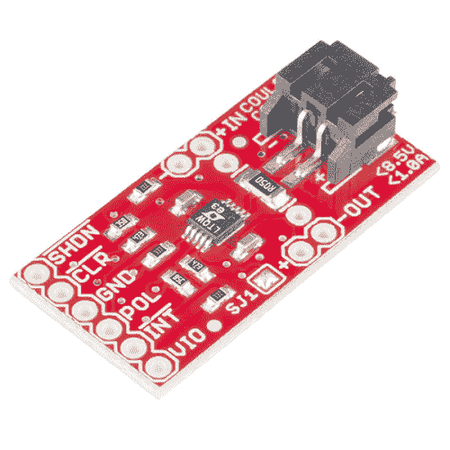](https://www.sparkfun.com/products/12052) 

将**添加到您的[购物车](https://www.sparkfun.com/cart)中！**

### [火花库仑计数器突破- LTC4150](https://www.sparkfun.com/products/12052)

[In stock](https://learn.sparkfun.com/static/bubbles/ "in stock") BOB-12052

里程表对汽车非常有用，它会告诉你走了多远，如果你能有一个里程表该多好啊

$16.506[Favorited Favorite](# "Add to favorites") 9[Wish List](# "Add to wish list")** **[https://www.youtube.com/embed/L_sprKSeDys/?autohide=1&border=0&wmode=opaque&enablejsapi=1](https://www.youtube.com/embed/L_sprKSeDys/?autohide=1&border=0&wmode=opaque&enablejsapi=1)

*Check out the product showcase at [1:26](https://youtu.be/L_sprKSeDys?t=86)*

瞬时电流消耗肯定是有用的，但有时你会想跟踪*累积*电流使用，尤其是当你试图确定电池还剩多少电量时。对于使用恒定电流量的电路来说，电池寿命很容易预测，但当电路在不同时间做不同的事情时，事情就变得很难了，比如点亮 led。

[](https://cdn.sparkfun.com/assets/learn_tutorials/2/2/5/Jeep_Odometer.jpg)

考虑汽车中的速度计和里程表。速度计就像一个电流表——它显示你的瞬时速度，知道这一点很好，但它不能告诉你已经走了多远，除非你不断地跟踪它。这是里程表的工作；它不断监测你的速度，随着时间的推移积累速度，并告诉你你已经走了多远。

库仑计数器就像是电流的里程表。它不断地监控你的电路正在使用的电流，把它加起来，并在每次使用了给定的安培小时数时给你一个脉冲。对于每个脉冲，你还会得到一个“极性”信号，它会告诉你电流的流向(对充电电池来说太棒了！).通过计算脉冲和方向，您可以精确计算电路从电池中释放(或释放)了多少功率。如果你从充满电的电池开始，你总是能准确地知道还剩多少电！很整洁，是吧？

### 推荐阅读:

*   [什么是电路](https://learn.sparkfun.com/tutorials/what-is-a-circuit)
*   [电压、电流、电阻和欧姆定律](https://learn.sparkfun.com/tutorials/voltage-current-resistance-and-ohms-law)
*   [电力](https://learn.sparkfun.com/tutorials/electric-power)
*   [电池技术](https://learn.sparkfun.com/tutorials/battery-technologies)
*   [如何为项目提供动力](https://learn.sparkfun.com/tutorials/how-to-power-a-project)
*   [如何使用万用表](https://learn.sparkfun.com/tutorials/how-to-use-a-multimeter)

## 电池基础知识

在我们讨论库仑之前，我们先讨论一下电池。

当你从 SparkFun(或任何其他地方)购买电池时，你会根据两个重要的数字来决定你想要哪一个:

其中之一是电池提供多少电压。你当然想选择一个符合你的项目要求的电池(电压太大或太小都不好)。通常我们会推荐特定的电池，比如为我们的[西蒙](https://www.sparkfun.com/products/10547)游戏推荐两节 1.5V [AA 电池](https://www.sparkfun.com/products/9100)。

另一个数字是电池的**容量**，或者说它有多大。容量越大，项目运行的时间就越长。高容量电池比小容量电池更大更重，所以你需要权衡大小和重量与运行时间——你可能想在更便携的项目中使用 AA 电池，尽管它们不会像 D 电池那样持久。

对于小型电池，我们以**毫安-小时(mAh)** 为单位测量电池容量，对于大型电池，我们以**安培-小时(Ah)** 为单位测量电池容量。这个数字表示电池在电量耗尽前一小时*所能提供的*电流*的理论值。*

例如，所有这些碱性电池都具有相同的电压(1.5V)，但容量不同:

[](https://cdn.sparkfun.com/assets/learn_tutorials/2/2/5/batteries.png)

*   d:12000 毫安时
*   丙:8000 毫安时
*   AA: 2700mAh
*   AAA:1200 毫安时

上面的 AAA 电池容量为 1200mAh，这意味着它可以在 1200mA (1.2A)下提供 1.5V 的电压一小时。但这仅仅是它一小时所能提供的电流。它可以轻松地提供:

*   两小时 600 毫安(600 毫安= 1200 毫安/小时)
*   四小时 300 毫安(300 毫安= 1200 毫安/4 小时)
*   150 毫安 8 小时(150 毫安= 1200 毫安/8 小时)等。

相反，根据您使用的电池类型，可能会出现以下情况:

*   半小时 2400 毫安(2400 毫安= 1200 毫安/0.5 小时)
*   4800 毫安 15 分钟(4800 毫安= 1200 毫安/0.25 小时)
*   72000 毫安(72A！！！)1 分钟！(72000 毫安= 1200 毫安/(1/60 小时))

在现实中，电池中的化学物质只能以一定的速率发生反应，因此即使在很短的时间内，你也不可能获得无限量的电力。然而，[没有保护电路的高放电脂肪电池](https://www.sparkfun.com/products/11855)可以在几分钟内释放惊人的电量，正是因为这个原因才被用于模型飞机。

如果你想知道电池能用多久，数学很简单:

*   要确定给定小时数内满电池可提供的电流，将总容量除以小时数:

    1200 毫安/ 10 小时= 120 毫安

*   要确定在给定的电流消耗下，一个完整的电池可以持续多长时间，请将总容量除以项目的电流消耗:

    1200 毫安/50 毫安= 24 小时

## 什么是库仑？

[](https://cdn.sparkfun.com/assets/0/2/d/c/8/Charles_de_coulomb.jpg)^(Charles-Augustin de Coulomb, 1736-1806)

一个**库仑**(像大多数以[人](http://en.wikipedia.org/wiki/Charles-Augustin_de_Coulomb)命名的单位一样，这个名字是用小写字母写出来的，除非你特别提到那个人)，被定义为**一秒一安培**:

#### 1A x 1s = 1C

因为一小时有 3600 秒，所以一安培小时等于 3600 库仑:

#### 1Ah = 3600C

### LTC4150 如何测量库仑电量？

LTC4150 有一个称为中断的输出引脚，简称为 INT (名称上方的线表示这是一个“低电平有效”信号)。该线通常为高电平，但每当 0.614 库仑通过器件时(恰好等于 0.1707 毫安时或 0.0001707 安培时)，该线将变为低电平:

#### 1 INT = 0.614439C

#### 1 INT = 0.1707mAh

#### 1 INT = 0.0001707Ah

或者从另一个角度来看，你会得到每安培小时 5859 INT “滴答”:

#### 5859 INT s = 1Ah

### 跟踪电池中的电荷

众所周知，电池容量是以 mAh(毫安-小时)或 Ah(安培-小时)来衡量的。如果你的电池充满后能保持 *1 安培小时*，你可以在电池耗尽前的*一小时*内连续从电池中提取*一安培*。你也可以拉 1/2 安培两小时，或 2 安培半小时，等等。

因为它在你使用它们时测量安培小时数，库仑计数器使得跟踪你的电池的充电状态(充满程度)变得非常容易:

1.  首先，假设你从一个充满电的电池开始，为你的电池初始充电状态设置一个变量(例如 1000.0 mAh)。

2.  倾听来自 INT 引脚的“滴答”(低)信号。

3.  每当您检测到一个滴答，检查方向信号，并添加或减去上述每滴答 mAh 值(0.1707 mAh)到您的电池状态变量。

4.  利润！

正如我们在上一节中看到的，器件的一个“滴答”等于 0.0001707 安培小时。相反，一安培小时需要 5859 个滴答。如果您的电池有两安培小时的容量，那么将需要 11718 个滴答(5859 * 2)来完全耗尽(或充满*)电池。

*注意，在现实生活中，给电池充电需要的电流比你以后用完的电流多一点。这是因为储存电荷的化学过程并不是 100%有效，多余的电荷会转化为热量。损耗量因电池类型、充电率、电池寿命、温度等而异。当电池充满电时，您可以通过提供手动“重置”输入来解决这一问题，或者进行一些校准来查看充电与放电时您获得的滴答数(尽管这将随着电池寿命、温度等而变化。).

我们已经编写了示例代码，向您展示如何完成所有这些，更多信息请参见[示例代码](https://learn.sparkfun.com/tutorials/ltc4150-coulomb-counter-hookup-guide#running-the-example-code)部分。

### 奖励:确定平均电流

一个额外的(完全可选的)技巧是，如果您跟踪“滴答”之间的时间延迟，您可以反推出该期间使用的平均电流。等式非常简单:

#### mA = 614.4 /(单位为秒的“滴答”之间的延迟)

请注意，因为这个数字是一段时间内的平均电流使用量，所以瞬时电流可能会更高或更低。这也包含在示例代码中。

## 连接硬件

LTC4150 库仑计数器 IC 具有非常简单的接口。它有一个正常情况下为高电平的 INT (中断)输出，但当一定量的电流通过该器件时，它将变为低电平。还有一个 POL 输出，告诉你电流流向。

### 最高评级

库仑计数器可以容纳高达 8.5V 的电源和高达 1A 的电流。它特别适用于单节(3.7V)锂电池。

在接口侧，库仑计数器可以连接到以 3.3V 或 5V 电压运行的系统上(参见下面的焊接跳线)。板上的电阻已针对这两种电压进行了选择；其他 I/O 电压可能需要不同的电阻值。

### 焊料跳线

库仑计数器板上有三个焊接跳线，可针对不同情况进行配置。在使用库仑计数器之前，请仔细阅读本部分并进行必要的修改。

[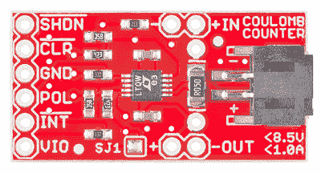](https://cdn.sparkfun.com/assets/learn_tutorials/2/2/5/cc_top2.jpg)

*   跳线 **SJ1** (在电路板的元件侧)控制 INT 输出的行为。如果 SJ1 关闭(默认)， INT 将变为低电平并立即返回高电平。如果 SJ1 断开(清零)， INT 将保持低电平，直到您使用 CLR 输入将其手动复位。**如果你的代码使用中断来检测INTtick，你可能会想让 SJ1 保持关闭。**这将省去您在每个节拍手动重置 INT 的步骤。如果您手动轮询 INT 输出，您可能需要打开(清除)SJ1，以便有更多的时间来检测低信号。有关中断与轮询的更多信息，参见[示例代码部分](https://learn.sparkfun.com/tutorials/ltc4150-coulomb-counter-hookup-guide#running-the-example-code)。

[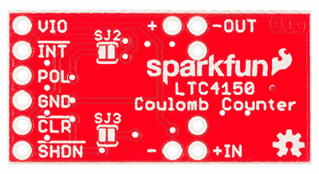](https://cdn.sparkfun.com/assets/learn_tutorials/2/2/5/cc_bottom2.jpg)

*   焊接跳线 **SJ2 和 SJ3** (在电路板底部)选择是将库仑计数器连接到 3.3V 还是 5V 系统。**如果你使用 5V 系统(默认)，让这两个焊接跳线打开(清除)。**如果您将库仑计数器连接到 3.3V 系统，关闭这些跳线的和**。**

要闭合焊接跳线，在跳线上熔化一小滴焊料，使其桥接两个焊盘，使它们短路。

要打开或“清理”一个焊接跳线，使用一些[焊芯](https://www.sparkfun.com/products/9327)和一个热烙铁去除桥接两个焊盘的焊料滴。将灯芯放在滴状物上，通过灯芯加热滴状物*。当焊料熔化时，灯芯会吸收它。完成后，确保两个焊盘完全分离(没有焊料桥接它们)。*

### 电气连接

就像使用安培计一样，你需要在电源(通常是电池)和电路之间安装库仑计数器。你的电路使用的所有电流都需要通过库仑计数器进行测量。

分线板的一端是标有“输入”和“输出”的接头。将您的电池或电源连接到 IN 接头或 JST 电池连接器(它们是相同的)，并将 OUT 接头连接到您的项目。JST 连接器与 SparkFun Lipo 电池上使用的连接器相匹配，可用于连接单节 3.7V Lipo 电池作为电源。(您也可以将 2 针 JST 引线或适配器添加到您自己的电池或其他电源，并将其插入此连接器)。

[](https://www.sparkfun.com/products/9914) 

将**添加到您的[购物车](https://www.sparkfun.com/cart)中！**

### [JST 跳线 2 线组装](https://www.sparkfun.com/products/9914)

[In stock](https://learn.sparkfun.com/static/bubbles/ "in stock") PRT-09914

这是一根简单的双线电缆。非常适合从一个板跳到另一个板或者做其他事情。有一个 2 针 JST 连接器…

$1.053[Favorited Favorite](# "Add to favorites") 34[Wish List](# "Add to wish list")****[](https://www.sparkfun.com/products/8671) 

将**添加到您的[购物车](https://www.sparkfun.com/cart)中！**

### [跳线- JST 黑蓝](https://www.sparkfun.com/products/8671)

[In stock](https://learn.sparkfun.com/static/bubbles/ "in stock") PRT-08671

这是一根简单的双线电缆。非常适合从一块板跳到另一块板。一端为 2 针 JST 连接器，另一端为裸电缆

$1.05[Favorited Favorite](# "Add to favorites") 7[Wish List](# "Add to wish list")****[](https://www.sparkfun.com/products/8734) 

将**添加到您的[购物车](https://www.sparkfun.com/cart)中！**

### [桶形插孔到 2 针 JST](https://www.sparkfun.com/products/8734)

[In stock](https://learn.sparkfun.com/static/bubbles/ "in stock") TOL-08734

两针 JST 连接器连接到 2.1x 5.5mm 毫米筒式插孔，6.25 英寸长的跳线电缆。我们使用这种电缆来适应从墙上电源…

$3.501[Favorited Favorite](# "Add to favorites") 18[Wish List](# "Add to wish list")****[](https://www.sparkfun.com/products/8670) 

将**添加到您的[购物车](https://www.sparkfun.com/cart)中！**

### [跳线- JST 黑红色](https://www.sparkfun.com/products/8670)

[In stock](https://learn.sparkfun.com/static/bubbles/ "in stock") PRT-08670

这是一根简单的双线电缆。非常适合从一块板跳到另一块板。一端为 2 针 JST 连接器，另一端为裸电缆

$1.05[Favorited Favorite](# "Add to favorites") 16[Wish List](# "Add to wish list")******** **********注意**如果你将同时使用库仑计数器和 Lipo 充电器，将库仑计数器(不是充电器)直接连接到你的电池。这样，库仑计数器可以监控充电和放电:

[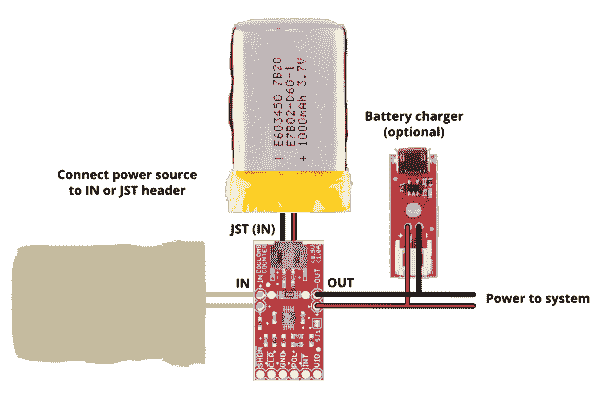](https://cdn.sparkfun.com/assets/learn_tutorials/2/2/5/layout_nolabels.png)

**PROTIP:** 如果您将 [JST 尾纤](https://www.sparkfun.com/products/8670)连接到库仑计数器的输出端，您可以方便地将其直接插入系统的 JST 电池连接器:

[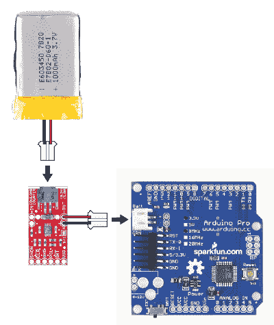](https://cdn.sparkfun.com/assets/learn_tutorials/2/2/5/pigtail_to_pro_3.png)

您甚至可以对 Lipo 充电器做同样的事情，实现完全的即插即用模块化:

[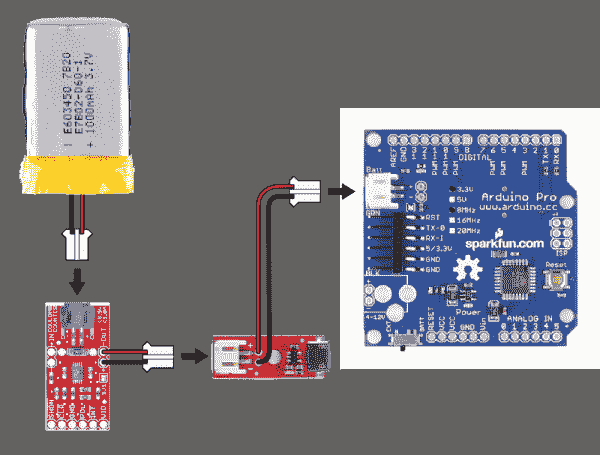](https://cdn.sparkfun.com/assets/learn_tutorials/2/2/5/pigtail_to_pro_plus_charger_1.png)[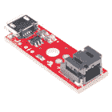](https://www.sparkfun.com/products/10217) 

将**添加到您的[购物车](https://www.sparkfun.com/cart)中！**

### [SparkFun LiPo 充电器基本款- Micro-USB](https://www.sparkfun.com/products/10217)

[In stock](https://learn.sparkfun.com/static/bubbles/ "in stock") PRT-10217

如果你需要给 LiPo 电池充电，这个简单的充电器就能做到，而且很快！斯帕克芬脂肪充电器基本…

$9.9526[Favorited Favorite](# "Add to favorites") 56[Wish List](# "Add to wish list")****[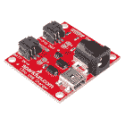](https://www.sparkfun.com/products/12711) 

将**添加到您的[购物车](https://www.sparkfun.com/cart)中！**

### [SparkFun USB LiPoly 充电器-单节电池](https://www.sparkfun.com/products/12711)

[In stock](https://learn.sparkfun.com/static/bubbles/ "in stock") PRT-12711

如果你需要给 LiPo 电池充电，这个简单的充电器就能做到，而且很快！SparkFun USB 脂肪充电器是…

$17.958[Favorited Favorite](# "Add to favorites") 33[Wish List](# "Add to wish list")****[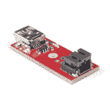](https://www.sparkfun.com/products/10401) 

将**添加到您的[购物车](https://www.sparkfun.com/cart)中！**

### [【spark fun LiPo 充电器基本型-迷你 USB](https://www.sparkfun.com/products/10401)

[25 available](https://learn.sparkfun.com/static/bubbles/ "25 available") PRT-10401

如果你需要给 LiPo 电池充电，这个简单的充电器就能做到。它是专为单节锂离子电池或锂电池设计的

$10.503[Favorited Favorite](# "Add to favorites") 18[Wish List](# "Add to wish list")****[](https://www.sparkfun.com/products/retired/11231) 

### [SparkFun 动力电池-脂肪充电器/升压器](https://www.sparkfun.com/products/retired/11231)

[Retired](https://learn.sparkfun.com/static/bubbles/ "Retired") PRT-11231

PowerCell 板是一个单电池 LiPo boost 转换器(至 3.3V 和 5V)和微型 USB 充电器。该板配有…

14 **Retired**[Favorited Favorite](# "Add to favorites") 33[Wish List](# "Add to wish list")****** ******### 接口引脚

在库仑计数器的另一端，你会发现一个有六个针的接头。这些是你需要连接到你的微控制器的管脚。根据您想要做的事情，您至少需要前四个 pin:

| **名称** | **功能** | **方向** | **注释** |
| 虚拟输入输出 | 输入输出电压 | 力量 | 根据您的系统，连接到 3.3V 或 5V。请注意，您可能需要更改跳线设置(见上文)。 |
| INT | 中断 | 输出
(来自 CC) | 当 0.0001707 安培小时通过电路板时，变为低电平。当 CLR 变低时被清除(变高)。连接到中断输入引脚。 |
| 政客 | 极性 | 输出
(来自 CC) | 指示电流的方向。低=电流从流入流出(放电)。高=从 OUT 到 IN 的电流(充电)。 |
| GND | 地面 | 力量 | 连接到系统上的 GND pin。 |
| CLR | 清楚的 | 输入
(至抄送) | 如果 INT 为低，使 CLR 为低以复位 INT 。如果 SJ1 关闭，这将自动完成(将 CLR 和 INT 连接在一起)。*如果 SJ1 闭合，并且您正在使用中断对 INT 进行采样，则该引脚可以保持断开。* |
| SHDN | 关机 | 输入
(至抄送) | 如果 SHDN 为低电平，芯片将保持复位状态。此引脚与 VIO 之间有一个上拉电阻，因此如果断开该电阻，电路板将保持活动状态。*如果不需要关机功能，该引脚可以保持断开。* |

<

p >

**PROTIP:** 当您看到一个信号名称包含一个星号或上面有一条线时，这表明该信号使用了“负逻辑”。在负逻辑中，低逻辑电平意味着信号有效。因此，如果您看到一个名为 RESET 的信号，您必须提供一个*低电平*信号来复位该器件，并在其他时间保持高电平。

**注意**库仑计数器由 IN 接头(通常是你的电池)供电， ***而不是*** 由 VIO 引脚供电，后者仅用作输出引脚的电压参考。这使得库仑计数器本身使用的少量功率被包括在它的测量中，以获得最大的精度。库仑计数器在运行时使用不到 1mA 的电流，您可以使用 SHDN (关机)输入来进一步降低其功耗(尽管它无法在关机时跟踪电流使用情况)。

### 典型连接

*在将库仑计数器插入微控制器之前，请参见上面的[焊接跳线](https://learn.sparkfun.com/tutorials/ltc4150-coulomb-counter-hookup-guide#solderjumpers)部分，了解如何为 3.3V 或 5V 系统设置电路板。*

我们已经编写了 Arduino 示例代码，以便您可以将 Coulumb 计数器板直接插入 Arduino 数字引脚 2 至 7，如下所示。(对于 VIO，我们将 D2 永久设为高电平，对于 GND，我们将 D5 设为低电平。)

[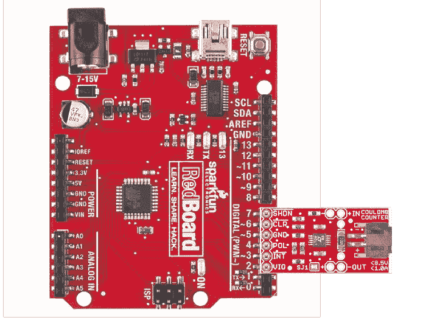](https://cdn.sparkfun.com/assets/learn_tutorials/2/2/5/direct.png)

这使得测试电路板变得容易，但在大多数情况下，您会希望使用导线来连接电路板，以免浪费引脚上宝贵的 I/O 端口，这些端口可能会断开连接。说到这里:

#### 我需要使用所有六个引脚吗？

大概不会！

*   如果您将使用中断来采样 INT 信号(推荐)，您可以保持 CLR 引脚断开。

*   如果不需要关断功能，可以保持 SHDN 引脚断开。

*   您可以将 VIO 和 GND 连接到系统的稳压电源(3.3V 或 5V)和 GND。你不需要浪费 I/O 引脚。

如果你使用中断来采样 INT 信号(推荐)，你可以只用两个 I/O 端口( INT 和 POL)加上 VIO 和 GND。注意，对于基于 ATmega 328 的 Arduinos， INT 只能连接到 D2 或 D3，没有额外的 pin-change-interrupt 库。

#### 3.3V 系统

库仑计数器非常适合 Arduino Pro 或 Pro Mini 等 3.3V 系统:

[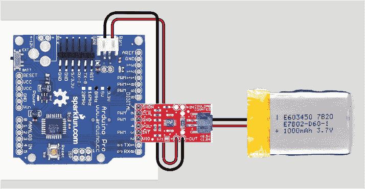](https://cdn.sparkfun.com/assets/learn_tutorials/2/2/5/pro_direct.png)

这些图表显示了使用单节 Lipo 电池为系统供电。请注意，您还应该将 3.3V 连接到 VIO，将 GND 连接到 GND，作为逻辑电平参考。你可以用 Arduino 的 VCC (3.3V)线做到这一点，或者将其连接到一个设置为高的 I/O 引脚，就像我们在[示例代码](https://learn.sparkfun.com/tutorials/ltc4150-coulomb-counter-hookup-guide#running-the-example-code)中所做的那样。

[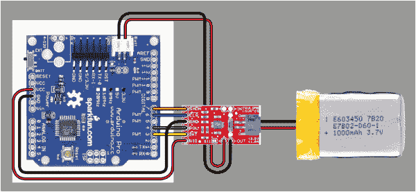](https://cdn.sparkfun.com/assets/learn_tutorials/2/2/5/pro_1.png)

#### 5V 系统

对于 Arduino Uno 或 SparkFun Redboard 等 5V 系统，您可以通过库仑计数器将最高 8.5V 的未调节电源连接到 Arduino 的 VIN 端子。请注意，您需要将 5V 连接到逻辑电平参考的 VIO。您可以使用 Arduino 的 5V 线路来实现这一点，或者将其连接到设置为高电平的 I/O 引脚，就像我们在[示例代码](https://learn.sparkfun.com/tutorials/ltc4150-coulomb-counter-hookup-guide#running-the-example-code)中所做的那样。

[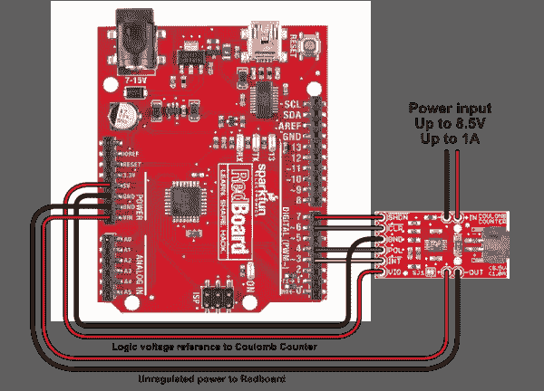](https://cdn.sparkfun.com/assets/learn_tutorials/2/2/5/redboard_unreg.png)

如果你想用 5V 稳压电源给 Arduino 供电，你也可以这样做。通过库仑计数器向 Arduino 的 5V 端子供电。你还需要给库仑计数器的 VIO 引脚提供 5V 电压，等等。

[](https://cdn.sparkfun.com/assets/learn_tutorials/2/2/5/redboard_reg.png)

## 运行示例代码

我们为 Arduino 微控制器提供了两个示例程序，向您展示如何使用库仑计数器。如果您没有使用 Arduino，示例代码非常简单，应该很容易适应其他微控制器。

### 打断还是不打断？

这两个代码示例称为“Coulomb_int”和“Coulomb_polling”。它们做完全相同的事情(测量电池消耗)，但它们检测 INT 输出变化的方式不同。选择哪一个就要看你的要求和技能水平了。

#### 中断

检测引脚变化的“标准”方法是使用**中断**。中断是微控制器内置的一项硬件功能，允许微控制器立即处理高优先级事件*。*

 *要使用中断，你需要编写一个称为中断服务程序(ISR)的特殊函数，并适当地设置硬件。然后，只要微控制器上的一个特殊中断引脚接收到所需的输入(变高或变低)，主循环中的任何操作都会暂停，ISR 函数就会运行。当 ISR 函数结束时，主循环从它停止的地方继续。这一切都是自动发生的——主循环知道发生了什么的唯一方式是 ISR 函数在幕后改变了一些变量(比如还剩多少电池，这正是我们在示例代码中所做的)。

中断示例代码的优点是不需要 CLR 输入，因此您可以只使用两个 I/O 引脚； INT 和 POL。

**注意**在基于 ATmega 368 的 Arduinos 上，只有两个引脚支持外部中断，没有额外的库:D2 (INT0)和 D3 (INT1)。我们在示例代码中使用 D3。

#### 投票

中断非常有用，但是如果你还在学习编程的细节，使用一种叫做**轮询**的简单技术也没什么不好。轮询只是一遍又一遍地测试输入，直到它变成您所寻找的状态。

默认情况下，库仑计数器被设置为使 INT 输出变为低电平并立即返回高电平。它只会低几微秒(百万分之一秒！)，这足以让基于中断的代码检测到下降沿，但随机检查几乎肯定会错过这么短暂的信号。

但是，如果您打开(清除)焊接跳线 SJ1，每次 INT 变低，*将保持*低，直到您手动将其复位。这使得编写轮询代码变得更加容易，因为 INT 将保持低电平，直到你下次有时间检查它。要将其复位，先将 CLR 置低，然后再置高。

轮询示例代码的缺点是需要三个 I/O 引脚，而不是两个( INT 、 CLR 和 POL)。你还应该小心确保你检查 INT 的速度快于每半秒左右；如果一个新的 INT 进来，而旧的还是低的，你会错过它。

### 硬件布线

以下是示例草图所需的最低连接。(接线图见上一页。)

#### 如果您想尝试中断示例代码:

*   保持焊接跳线 SJ1 闭合(默认)
*   您将需要连接(至少):
    *   VIO 到 VCC
    *   INT 到 D3
    *   POL 到 D4
    *   GND 两个 GND

#### 如果您想尝试轮询示例代码:

*   **打开**(清除)焊接跳线 SJ1 [(指令)](https://learn.sparkfun.com/tutorials/ltc4150-coulomb-counter-hookup-guide#solderjumpers)
*   您将需要连接(至少):
    *   VIO 到 VCC
    *   INT 到 D3
    *   POL 到 D4
    *   GND 两个 GND
    *   CLR 去 D6

#### 对于任一版本的代码:

*   对于 5V Arduino，确保 SJ2 和 SJ3 都**打开**(清除)，或者对于 3.3V Arduino，确保 SJ2 和 SJ3 都**关闭**(焊接)。

### 下载代码

示例代码保存在[库仑计数器 BOB Github 库](https://github.com/sparkfun/LTC4150_Coulomb_Counter_BOB)中。你可以下载整个库的 [ZIP](https://github.com/sparkfun/LTC4150_Coulomb_Counter_BOB/archive/master.zip) 文件(或者[克隆](github-windows://openRepo/https://github.com/sparkfun/LTC4150_Coulomb_Counter_BOB)到你的电脑，如果你安装了 github 软件的话)，或者直接保存草图:

*   [直接链接到中断示例代码(另存为)](https://github.com/sparkfun/LTC4150_Coulomb_Counter_BOB/raw/master/software/Arduino/coulomb_interrupt/coulomb_interrupt.ino)

*   [直接链接到轮询示例代码(另存为)](https://github.com/sparkfun/LTC4150_Coulomb_Counter_BOB/raw/master/software/Arduino/coulomb_polling/coulomb_polling.ino)

对于任一版本的代码，您都应该更改第 120 行，以反映您的 lipo 电池的全部容量。默认值为 2000mAh:

```
volatile double battery_mAh = 2000.0; // milliamp-hours (mAh) 
```

这将提供一个准确的读数多少毫安剩余在您的电池，因为你使用它。

### 运行示例代码

像往常一样将代码上传到 Arduino。打开一个设置为 9600 波特的[串行监视器](https://learn.sparkfun.com/tutorials/terminal-basics)窗口。您应该会看到一条重置消息，随后随着 INT “滴答”的发生而更新。

[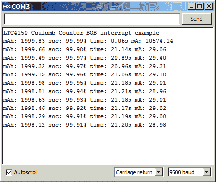](https://cdn.sparkfun.com/assets/learn_tutorials/2/2/5/examplecode.png)

从左到右的列是:

*   电池中剩余的 mAh(毫安-小时)(从第 120 行的电池大小值中减去)
*   充电状态(剩余百分比)
*   滴答之间的时间延迟
*   根据上次时间延迟计算的平均毫安。

请注意，第一个毫安读数将是不正确的，因为它需要两个读数之间的时间延迟来执行计算。

请记住，如果没有任何东西连接到库仑计数器的输出，通过电路板的电流将为零，您将看不到来自 INT 引脚的脉冲。(LTC4150 芯片使用的电流非常小，大约每 10 分钟就会产生一个脉冲。)

## 资源和更进一步

### 改变检测电阻

库仑计数器使用一个*感应电阻*来测量电流。这个非常小的电阻(0.05 欧姆)是位于输入和输出之间的唯一元件。LTC4150 测量该电阻两端的[电压降](http://en.wikipedia.org/wiki/Voltage_drop)；由于[欧姆定律](http://en.wikipedia.org/wiki/Ohm%27s_law)，电压降与通过电阻的电流成正比。

我们在库仑计数器中安装了一个 0.05 欧姆的感应电阻，这就是为什么最大电流是 1A，每 Ah 有 5859 个“滴答”。如果您希望在较低的最大电流下获得更高的分辨率(每 Ah 的滴答数),或者希望在较低的分辨率下获得更大的电流*,可以用不同值的器件替换该电阻。您需要移除现有器件，用另一个表贴器件替换，或者使用提供的通孔电阻封装。有关电阻选择的信息，请参考 [LTC4150 数据表](https://github.com/sparkfun/LTC4150_Coulomb_Counter_BOB/blob/master/documentation/Coulomb%20Counter%204150fc.pdf?raw=true)。在 [Github 文档文件夹](https://github.com/sparkfun/LTC4150_Coulomb_Counter_BOB/tree/master/documentation)中还有一个[电子表格](https://github.com/sparkfun/LTC4150_Coulomb_Counter_BOB/blob/master/documentation/spreadsheet.ods?raw=true)可能会有用。

* **注意**电路板上的 PCB 走线不是为处理超过 1.6A 的连续电流而设计的，JST 连接器也不是为超过 2A 而设计的。

还要注意，提高 8.5V 的最大供电电压没有简单的方法，抱歉！

### 使用 SHDN 输入

通过将 SHDN 输入拉低，可以复位或关闭 LTC4150。这将降低电路板的功耗，但 LTC4150 不会在这种模式下测量电流消耗。此输入有一个上拉电阻；如果不需要关断功能，可以保持此输入断开。

* * *

我们希望你发现 LTC4150 库仑计数器有用。现在，您已经成功启动并运行了 LTC4150 库仑计数器，是时候将它整合到您自己的项目中了！有关更多信息，请查看以下资源:

*   [示意图](https://cdn.sparkfun.com/datasheets/BreakoutBoards/LTC4150_BOB_v10.pdf)
*   [老鹰档案](https://cdn.sparkfun.com/datasheets/BreakoutBoards/LTC4150_BOB_v10.zip)
*   [数据表](https://cdn.sparkfun.com/datasheets/BreakoutBoards/LTC4150fc.pdf) (LTC4150)
*   [GitHub](https://github.com/sparkfun/LTC4150_Coulomb_Counter_BOB) (示例代码&设计文件)
*   [产品视频](https://www.sparkfun.com/videos#all/L_sprKSeDys/85)

你的下一个项目需要一些灵感吗？看看这些相关教程吧！

[](https://learn.sparkfun.com/tutorials/battery-technologies) [### 电池技术](https://learn.sparkfun.com/tutorials/battery-technologies) The basics behind the batteries used in portable electronic devices: LiPo, NiMH, coin cells, and alkaline.[Favorited Favorite](# "Add to favorites") 50[](https://learn.sparkfun.com/tutorials/uh-oh-battery-level-indicator-hookup-guide) [### 电池电量指示器连接指南](https://learn.sparkfun.com/tutorials/uh-oh-battery-level-indicator-hookup-guide) Learn how to assemble and use the TL431 in the Uh-Oh Battery Level Indicator Kit.[Favorited Favorite](# "Add to favorites") 8[](https://learn.sparkfun.com/tutorials/battery-babysitter-hookup-guide) [### 电池保姆连接指南](https://learn.sparkfun.com/tutorials/battery-babysitter-hookup-guide) An introduction and getting started guide for the Battery Babysitter - a flexible LiPo battery charger and monitor.[Favorited Favorite](# "Add to favorites") 11[](https://learn.sparkfun.com/tutorials/lilypad-basics-powering-your-project) [### LilyPad 基础:为您的项目提供动力](https://learn.sparkfun.com/tutorials/lilypad-basics-powering-your-project) Learn the options for powering your LilyPad projects, LiPo battery safety and care, and how to calculate and consider power constraints on your projects.[Favorited Favorite](# "Add to favorites") 8

如果您有任何问题，请随时联系我们的技术支持部门。让我们知道你用它做什么！*****************