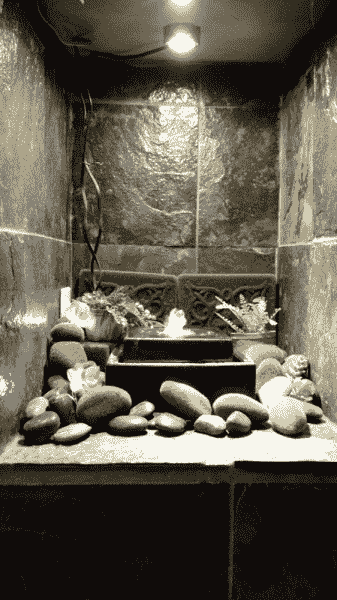

# 卢米提外星人花园

> 原文：<https://learn.sparkfun.com/tutorials/lumenati-alien-garden->

## 介绍

我最近参观了迪斯尼世界的最新公园之一:潘多拉——阿凡达的世界。我带回家的不是纪念品，而是对自己外星花园的渴望。本教程将展示如何使用 Lumenati LED 板来照亮您自己的外星花园中的各种多肉植物。

### 所需材料

要学习本教程，您需要以下材料: