# LumiDrive 连接指南

> 原文：<https://learn.sparkfun.com/tutorials/lumidrive-hookup-guide>

## 介绍

LumiDrive 是 SparkFun 在微控制器上涉足 Python 的所有东西。利用 Adafruit 的 Circuit Python，我们创建了一个产品，用于驱动一串 [APA102 的](https://www.sparkfun.com/products/14015)。我们已经从板载 SAMD21G-AU 微控制器中分离出一些模拟和数字引脚，以便您可以实现外部按钮、开关和其他功能，与 [LED](https://www.sparkfun.com/leds) 进行交互

[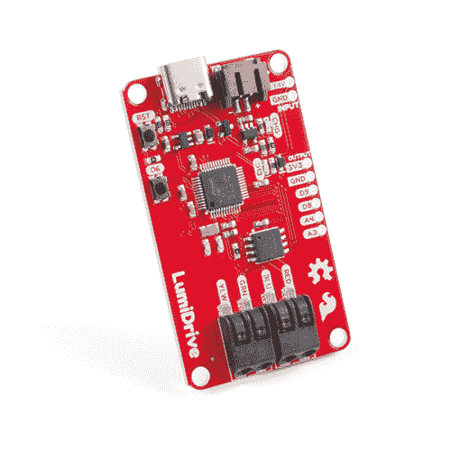](https://www.sparkfun.com/products/14779) 

将**添加到您的[购物车](https://www.sparkfun.com/cart)中！**

### [SparkFun LumiDrive LED 驱动](https://www.sparkfun.com/products/14779)

[In stock](https://learn.sparkfun.com/static/bubbles/ "in stock") DEV-14779

使用 SparkFun LumiDrive，您将能够直接从主板上控制和个性化整个 APA102s 系列

$22.50[Favorited Favorite](# "Add to favorites") 13[Wish List](# "Add to wish list")** **[https://www.youtube.com/embed/WxBrUkzW4tA/?autohide=1&border=0&wmode=opaque&enablejsapi=1](https://www.youtube.com/embed/WxBrUkzW4tA/?autohide=1&border=0&wmode=opaque&enablejsapi=1)

### 电路 Python

你可以在 Adafruit 的网站上阅读关于 Circuit Python 的大量文档，但是让我们回顾一个简短的版本。Circuit Python 是 Adafruit 的 [MicroPython](https://micropython.org/) 版本。请告诉我，微缩松是什么？MicroPython 是用于微控制器的 Python 3。MicroPython 利用了广受欢迎的 Python [解释的](https://en.wikipedia.org/wiki/Interpreted_language)语言的力量，这种语言易于使用，易于阅读，功能强大，并使其可用于微控制器。你声明和使用 pin 的方式感觉很熟悉，但是不像 Arduino，你不需要编译或上传你的代码。这是因为当你把它插入电脑时，你的微控制器就像一个 USB 驱动器。代码只是作为一个文件存在，你可以直接修改它，当它被保存时，它会被自动加载。代数！它还与您计算机上的 Python 3 兼容，因此您可以在桌面上无缝开发！我们为什么使用 Circuit Python？Circuit Python 的优势在于，默认情况下内置了许多面向入门级爱好者的库。对于 LumiDrive，我们将利用 DotStar 库，Adafruit 的 APA102 LEDs 库。

### 所需材料:

[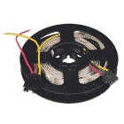](https://www.sparkfun.com/products/14015) 

将**添加到您的[购物车](https://www.sparkfun.com/cart)中！**

### [LED RGB 条可寻址，1m (APA102)](https://www.sparkfun.com/products/14015)

[In stock](https://learn.sparkfun.com/static/bubbles/ "in stock") COM-14015

这些是可寻址的 1 米长 5V RGB LED 灯条，包装有 60 个 APA102Cs。APA102 LEDs 与 WS281 非常相似…

$17.502[Favorited Favorite](# "Add to favorites") 15[Wish List](# "Add to wish list")****[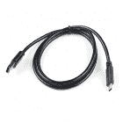](https://www.sparkfun.com/products/14743) 

将**添加到您的[购物车](https://www.sparkfun.com/cart)中！**

### [USB 3.1 线 A 到 C - 3 脚](https://www.sparkfun.com/products/14743)

[In stock](https://learn.sparkfun.com/static/bubbles/ "in stock") CAB-14743

USB C 棒极了。但是，在我们将所有的集线器、充电器和端口转换为 USB C 之前，这是您要使用的电缆…

$5.504[Favorited Favorite](# "Add to favorites") 9[Wish List](# "Add to wish list")**** ****我们有许多便携式选项为您的 led 供电:

[](https://www.sparkfun.com/products/13813) 

将**添加到您的[购物车](https://www.sparkfun.com/cart)中！**

### [锂离子电池-1Ah](https://www.sparkfun.com/products/13813)

[In stock](https://learn.sparkfun.com/static/bubbles/ "in stock") PRT-13813

基于锂离子化学的超薄超轻电池。每个电池在 1000 毫安时输出 3.7V 的标称电压！

$10.958[Favorited Favorite](# "Add to favorites") 75[Wish List](# "Add to wish list")****[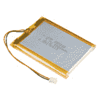](https://www.sparkfun.com/products/13855) 

将**添加到您的[购物车](https://www.sparkfun.com/cart)中！**

### [锂离子电池- 2Ah](https://www.sparkfun.com/products/13855)

[In stock](https://learn.sparkfun.com/static/bubbles/ "in stock") PRT-13855

这是基于锂离子化学的非常薄、非常轻的电池。每个电池在 200 伏时输出一个标称的 3.7 伏电压…

$13.959[Favorited Favorite](# "Add to favorites") 43[Wish List](# "Add to wish list")****[](https://www.sparkfun.com/products/13856) 

将**添加到您的[购物车](https://www.sparkfun.com/cart)中！**

### [锂离子电池- 6Ah](https://www.sparkfun.com/products/13856)

[In stock](https://learn.sparkfun.com/static/bubbles/ "in stock") PRT-13856

如果你需要一些果汁，这 6Ah 锂离子电池是给你的。这些是基于锂离子化学电池的非常紧凑的电池…

$32.507[Favorited Favorite](# "Add to favorites") 40[Wish List](# "Add to wish list")****** ******我发现这个连接器非常有用，因为它让我不用直接将 APA102 的不同线束插入和拔出 poke-home 连接器。

[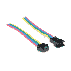](https://www.sparkfun.com/products/14576) 

将**添加到您的[购物车](https://www.sparkfun.com/cart)中！**

### [LED 条形尾纤连接器(4 针)](https://www.sparkfun.com/products/14576)

[In stock](https://learn.sparkfun.com/static/bubbles/ "in stock") CAB-14576

这些 4 针 JST-SM 尾纤连接器与 LED 灯条和其他只需要两条线路和一根引线的应用完美匹配

$1.60[Favorited Favorite](# "Add to favorites") 9[Wish List](# "Add to wish list")** **### 推荐阅读

[](https://learn.sparkfun.com/tutorials/battery-technologies) [### 电池技术](https://learn.sparkfun.com/tutorials/battery-technologies) The basics behind the batteries used in portable electronic devices: LiPo, NiMH, coin cells, and alkaline.[Favorited Favorite](# "Add to favorites") 50[](https://learn.sparkfun.com/tutorials/light-emitting-diodes-leds) [### 发光二极管](https://learn.sparkfun.com/tutorials/light-emitting-diodes-leds) Learn the basics about LEDs as well as some more advanced topics to help you calculate requirements for projects containing many LEDs.[Favorited Favorite](# "Add to favorites") 67[](https://learn.sparkfun.com/tutorials/mean-well-led-switching-power-supply-hookup-guide) [### 平均良好的 LED 开关电源连接指南](https://learn.sparkfun.com/tutorials/mean-well-led-switching-power-supply-hookup-guide) In this tutorial, we will be connecting a Mean Well LED switching power supply to an addressable LED strip controlled by an Arduino.[Favorited Favorite](# "Add to favorites") 3[](https://learn.sparkfun.com/tutorials/lumini-ring-hookup-guide) [### LuMini 环连接指南](https://learn.sparkfun.com/tutorials/lumini-ring-hookup-guide) The LuMini Rings (APA102-2020) are the highest resolution LED rings available.[Favorited Favorite](# "Add to favorites") 6

## 硬件概述

### 力量

该产品有三种电源选项:USB-C、锂离子电池或输入。您可以提供从 **3.3V-6V** 范围内的电源。

[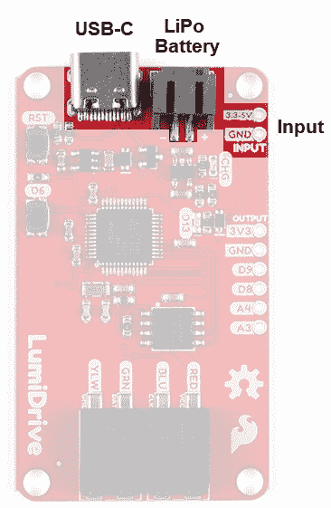](https://cdn.sparkfun.com/assets/learn_tutorials/8/5/5/Power_Input_Labelled.jpg)

#### USB-C

USB-C 除了具有可逆转性(这已经很棒了)之外，还具有比其前身提供更多电力的能力。我能用 3.1 USB 插头从电脑上拔下 2 安培的电流。小心-我这样做是为了让你不必这么做！每台电脑都是不同的，我强烈建议你不要这么鲁莽，除非你有绝对的信心。还要记住，不同的 USB 端口(2.0、3.0 和 3.1)提供不同的功率水平。3.1 很容易识别，因为当你看向端口时，它有一个蓝色的舌头。

#### 锂离子电池

我们的产品目录中有许多选项可以满足您不同的便携式电源需求。LumiDrive 还配有充电电路，因此您可以为 LiPo 电池充电。

[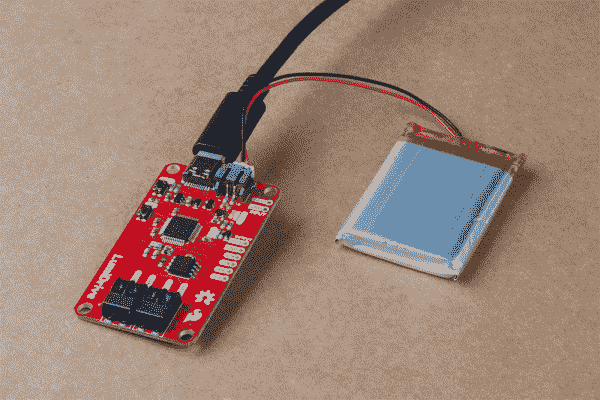](https://cdn.sparkfun.com/assets/learn_tutorials/8/5/5/LiPoBattery.jpg)

#### 两针输入接头

最后但并非最不重要的是一个标有`INPUT`的 2 针插头，您可以在那里自己供电。

#### 电流消耗

下表列出了一串 55 个 led 在**全白**半亮度和全亮度时的电流消耗。我还列出了不同 LED 数量和亮度下各种功能的电流消耗，以帮助您在购买或使用 LED 时做出更明智的决定。

**Please Note:** The chart below was written for APA102 1m LED strip with the 5050 LEDs - if you are using any of the APA102 line with 2020s we do **not** recommend running at full brightness. We've found that setting the global brightness to 32 is good for testing; turning the brightness up all the way and leaving all LED's on white will result in damage to your LEDs!

| 发光二极管数量(一半亮度) | 电流消耗(安培) |
| one | Zero point zero seven |
| Two | Zero point zero nine five |
| three | Zero point one two |
| five | Zero point one three nine |
| Ten | Zero point two eight nine |
| Twenty | Zero point five three six |
| Thirty | Zero point seven five five |
| Thirty-five | Zero point eight eight three |
| Forty | One point one zero two |
| Fifty | One point three one one |
| led 数量(全亮度) | 电流消耗(安培) |
| Ten | Zero point five two |
| Fifteen | Zero point seven three seven |
| Twenty-five | One point three two eight |
| Twenty-seven | One point four two six |
| Twenty-nine | One point five two three |
| Thirty-one | One point six one eight |
| Forty | Two point zero one eight |
| 在 55 个 led 下工作 | 电流消耗(安培) |
| 切片彩虹(0.25 亮度) | Zero point three three six |
| 切片彩虹(0.50 亮度) | Zero point six |
| 彩虹周期(0.25 亮度) | Zero point two eight one |
| 彩虹循环(0.50 亮度) | Zero point five |
|  |  |
| 在 85 个 led 下工作 | 电流消耗(安培) |
| 切片彩虹(0.25 亮度) | Zero point five |
| 切片彩虹(0.50 亮度) | Zero point eight nine |
| 彩虹周期(0.25 亮度) | Zero point four two five |
| 彩虹循环(0.50 亮度) | Zero point seven two seven |

### 输入输出

产品侧面有四个输入/输出引脚。有两个数字引脚和两个模拟引脚。通过连接按钮、开关、光传感器等，这些可以用来与你的 LED 灯串(或不)互动。

[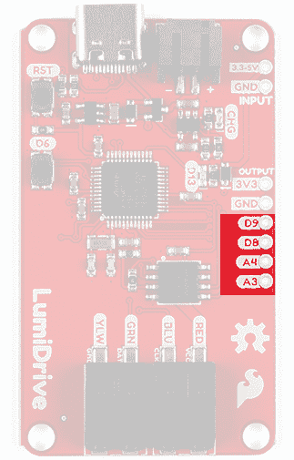](https://cdn.sparkfun.com/assets/learn_tutorials/8/5/5/DIgital_Analog_Pins.jpg)

### 小跟班

产品上有两个按钮。最上面的按钮是一个重置按钮，按下后会重置电路板。第二个是连接到数字 pin D6 的按钮。你可以用它来代替在板上安装一个按钮。

[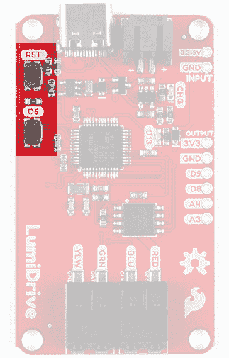](https://cdn.sparkfun.com/assets/learn_tutorials/8/5/5/Buttons.jpg)

### 发光二极管

板上有两个 led。图中顶部的 LED 是一个黄色的充电 LED，表示 LiPo 电池正在充电。第二个是连接到引脚 D13 的蓝色 stat LED。

[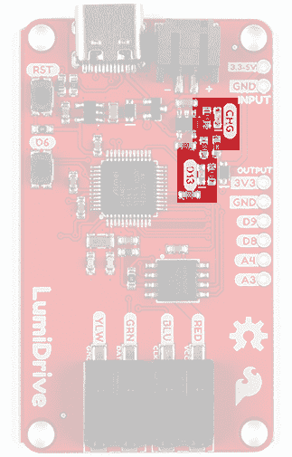](https://cdn.sparkfun.com/assets/learn_tutorials/8/5/5/LEDs.jpg)

### 戳入式连接器

在产品的底部有两个连接器。

[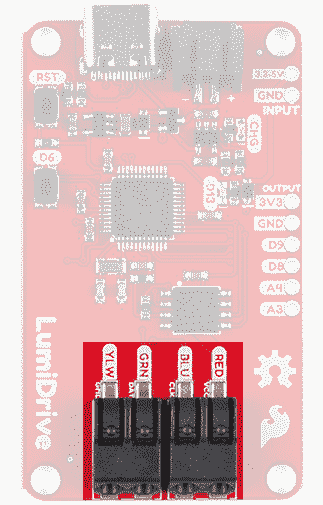](https://cdn.sparkfun.com/assets/learn_tutorials/8/5/5/PokeHome_Connectors.jpg)

它们功能多样，相当坚固，允许你插入电线而不需要焊接。它们标有我们在 SparkFun 出售的 APA102 LEDs 线束中使用的电线颜色，但不仅限于这些。就在丝绸下面，你会注意到这些线条的功能如下图所示。

| 别针 | 描述 |
| 红色 | VCC(3.3-5 伏) |
| BLU | 时钟 |
| GRN | 数据 |
| 黄色 | 地面 |

## 硬件装配

**Note:** You can also use a ball point pen instead of a tweezer to push down on the poke-home connector.

硬件组装非常简单。让我们从将您的 LED 线束插入 poke-home 连接器开始。通过使用一对镊子或笔尖按压戳入式连接器顶侧的翼片，可以实现更精细的控制。在这里，我们选择了镊子，因为这是我们手边的东西。

[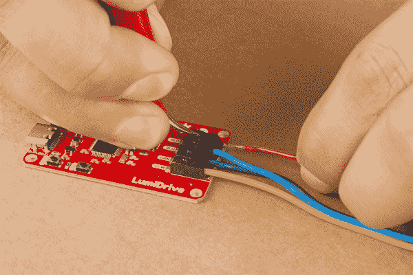](https://cdn.sparkfun.com/assets/learn_tutorials/8/5/5/Poke-home_clamp.jpg)

当您按下 poke-home 连接器顶部的黑色挡板时，两个金属楔会在连接器内部横向移动(移动到产品的侧面)。将你的电线插入连接器。当你松开它时，两个楔子会夹住电线。轻轻拉一下，确保电线牢固。你准备好摇滚了！

[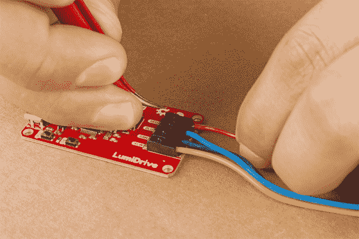](https://cdn.sparkfun.com/assets/learn_tutorials/8/5/5/Poke-home_push.jpg)

使用 USB-C 连接器将 LumiDrive 插入电脑。它应该会自动弹出一个名为 **CIRCUITPY** 的硬盘。如果它没有自动弹出，请拔掉插头，然后再插上。如果不起作用，导航到你的文件文件夹，在左手边寻找 ***电路*** 并点击它。此时，LumiDrive 上的蓝色状态 LED 应该会闪烁。从这里你可以通过点击打开那个**电路**。

[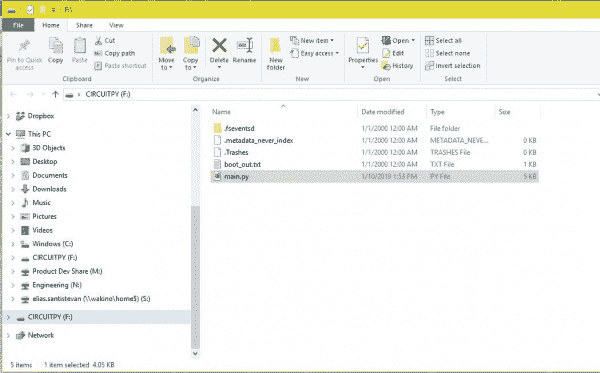](https://cdn.sparkfun.com/assets/learn_tutorials/8/5/5/Main.py_Drag_and_Drop.JPG)*Having a hard time seeing? Click the image for a closer look.***Note!** You may or may not be wondering what all these files are on the CIRCUITPY drive? I have hidden files turned on on my computer. Files with preceding periods i.e. ".Trashes" or ".metadata_never_index" are necessary for MAC users. The boot_out.txt file tells you what version of Circuit Python is loaded onto your LumiDrive. Finally "Main.py" is where all the fun happens.

让我们来看看示例代码。

## Python 示例代码

您的 LumiDrive 应该已经附带了以下 Python 代码，但如果发生了什么问题，您可以在这里重新下载示例代码:

[LumiDrive Main.py Example Code](https://github.com/sparkfun/SparkFun_LumiDrive_Example_Code)**Heads up!** You can also upload Arduino code to the LumiDrive using the Arduino IDE. Just select **SparkFun SAMD21 Dev Breakout Board** under the board menu. If you don't have the SparkFun SAMD21 board definitions then check our [hookup guide](https://learn.sparkfun.com/tutorials/samd21-minidev-breakout-hookup-guide/setting-up-arduino) for detailed instructions and [drivers (if you need them)](https://learn.sparkfun.com/tutorials/samd21-minidev-breakout-hookup-guide/drivers-if-you-need-them).

If you do want to go the Arduino route, you'll need to install the FastLED library. See our [LuMini Ring Hookup Guide](https://learn.sparkfun.com/tutorials/lumini-ring-hookup-guide#software-installation) for installation details and example code.

Please note that once you upload Arduino code, you'll lose your Circuity Python Firmware. Don't panic! Just double tap the reset button on your LumiDrive and the board will pop up as **LUMIBOOT**. Now you can drag and drop the firmware below and voila!

[Download LumiDrive Default Firmware (ZIP)](https://cdn.sparkfun.com/assets/learn_tutorials/8/5/5/lumidrive_firmware.zip)

在我们开始之前，让我们讨论一下在 LumiDrive 上加载和更新这段代码的选项。一种选择是将文件 *main.py* 移到你的桌面上，用[文本编辑器](https://en.wikipedia.org/wiki/List_of_text_editors)编辑它。当你完成后，你可以简单地将它拖放回**迂回**驱动器。Circuit Python 将识别这一变化，并自动加载新代码。另一种选择是直接在 **CIRCUITPY** 驱动器中编辑文件。这个选项更加方便和有效，但是需要一个文本编辑器，在保存文件时完整地写入文件。在 Windows 上，并非所有的文本编辑器都表现出必要的行为。下面列出了好的、不好的和不推荐的文本编辑器，用于直接在 LumiDrive(或任何 Circuit Python 板)上编辑文件。如果你用的是 Mac，那么你就不会遇到这些问题。

| 好的 | 仅适用于附加组件 | 不推荐 |
| 希腊字母表中第十二个字母 | 我喜欢这里 | 记事本/记事本++ |
| 精力 | 原子 | 闲置的 |
| EMACS | slickedit | 毫微；纤（10 的负九次方） |
| 崇高的文本 |  |  |
| Visual Studio 代码 |  |  |

我的建议是使用[穆](https://codewith.mu/)或[崇高文本](https://www.sublimetext.com/)。第一个对初学者更友好，而第二个更轻量级，有一些非常好的功能。如果你已经熟悉了 VIM、EMACS 或者 Visual Studio 代码，那么就用它们来代替。

如果你喜欢某个不被推荐的编辑器，那么有一个方法可以让它工作。在你对 main.py 做了更改后，如果你弹出 **CIRCUITPY** 驱动器，它将迫使 Windows 写入你所做的保存。

让我们快速讨论一下 Circuit Python 监控哪些文件进行保存。Circuit Python 按此顺序查找以下四个文件，并运行找到的第一个文件: **code.txt** 、 **code.py** 、 **main.txt** 和 **main.py** 。这就是全部，现在进入代码。

在代码的顶部，我们有许多代码所必需的库。

```
language:python
import adafruit_dotstar # Our LED library
import digitalio
import board
import math
import time 
```

您可以从这里开始修改代码，以适应您的特定 LED 灯条。`num_pixels`变量应该反映你有多少个发光二极管，而`brightness`控制亮度。我们在示例中有 60 个像素，因为它反映了我们的 [1m 长的 APA102s](https://www.sparkfun.com/products/14015) 的 led 数量。当你设置这些的时候请记住，如果你正在使用你的电脑，不要添加太多太快。否则，您可能会损坏您的计算机。在我们的两个变量下面，我们创建了一个名为 pixels 的库实例，在它下面我们有一些预定义的颜色。

```
language:python
# These two variables should be adjusted to reflect the number of LEDs you have
# and how bright you want them.
num_pixels = 60 
brightness = 0.25

# This creates the instance of the DoTStar library. 
pixels = adafruit_dotstar.DotStar(board.SCK, board.MOSI, 
    num_pixels, brightness=brightness, auto_write=False)

# Some standard colors. 
BLACK = (0, 0, 0)
RED = (255, 0, 0)
YELLOW = (255, 150, 0)
ORANGE = (255, 40, 0)
GREEN = (0, 255, 0)
TEAL = (0, 255, 120)
CYAN = (0, 255, 255)
BLUE = (0, 0, 255)
PURPLE = (180, 0, 255)
MAGENTA = (255, 0, 20)
WHITE = (255, 255, 255)

# A list of the ten colors. Use this if you want to cycle through the colors. 
colorList = [RED, YELLOW, ORANGE, GREEN, TEAL, CYAN, BLUE, PURPLE, MAGENTA,
                    WHITE] 
```

我们有许多函数来处理不同的 LED 行为。每个函数都有一个小小的解释，就在它的定义上面。

```
language:python
# The travel function takes a color and the time between updating the color. It
# will start at LED one on the strand and fill it with the give color until it
# reaches the maximum number of pixels that are defined as "num_pixels".
def travel(color, wait):
    num_pixels = len(pixels)
    for pos in range(num_pixels):
        pixels[pos] = color 
        pixels.show() 
        time.sleep(wait)

# The travel_back function like the travel function takes a color and the time between 
# updating the color. However it unlike the travel function, it will start at
# the last LED and works its way to LED. Fill the LED with the given color.
def travel_back(color, wait):
    num_pixels = len(pixels)
    for pos in range(num_pixels, 0, -1):
        pixels[pos] = color 
        pixels.show() 
        time.sleep(wait)

# This function may give you an idea of other functions to create. Here we're
# starting with green LEDs and then slowing filling the red color until we have
# a yellow color.  
def green_yellow_wheel(wait):
    for redColor in range(255):
        color = (redColor, 150, 0)
        pixels.fill(color)
        pixels.show()
        time.sleep(wait)

# You can use this function to get a custom color value. 
# value much in the form of a tuple, like the colors above. 
def wheel(pos):
    # Input a value 0 to 255 to get a color value.
    # The colours are a transition r - g - b - back to r.
    if pos < 0 or pos > 255:
        return (0, 0, 0)
    if pos < 85:
        return (255 - pos * 3, pos * 3, 0)
    if pos < 170:
        pos -= 85
        return (0, 255 - pos * 3, pos * 3)
    pos -= 170
    return (pos * 3, 0, 255 - pos * 3)

# This function takes a color and a dely and fills the entire strand with that color. 
# The delay is given in the case you use multiple color fills in a row.  
def color_fill(color, wait):
    pixels.fill(color)
    pixels.show()
    time.sleep(wait)

# Fills the strand with two alternating colors and cycles through the 10 colors 
def slice_alternating(wait):

    num_pixels = len(pixels)

    pixels[::2] = [RED] * (num_pixels // 2)
    pixels.show()
    time.sleep(wait)
    pixels[1::2] = [ORANGE] * (num_pixels // 2)
    pixels.show()
    time.sleep(wait)
    pixels[::2] = [YELLOW] * (num_pixels // 2)
    pixels.show()
    time.sleep(wait)
    pixels[1::2] = [GREEN] * (num_pixels // 2)
    pixels.show()
    time.sleep(wait)
    pixels[::2] = [TEAL] * (num_pixels // 2)
    pixels.show()
    time.sleep(wait)
    pixels[1::2] = [CYAN] * (num_pixels // 2)
    pixels.show()
    time.sleep(wait)
    pixels[::2] = [BLUE] * (num_pixels // 2)
    pixels.show()
    time.sleep(wait)
    pixels[1::2] = [PURPLE] * (num_pixels // 2)
    pixels.show()
    time.sleep(wait)
    pixels[::2] = [MAGENTA] * (num_pixels // 2)
    pixels.show()
    time.sleep(wait)
    pixels[1::2] = [WHITE] * (num_pixels // 2)
    pixels.show()
    time.sleep(wait)

# This function divides the given number of pixels and fills them as evenly as
# possible with a rainbow pattern (RED, ORANGE, YELLOW, GREEN, BLUE, PURPLE) 
# which repeats every 6 LEDs.
def slice_rainbow(wait):

    num_pixels = len(pixels)

    pixels[::6] = [RED] * math.ceil(num_pixels / 6)
    pixels.show()
    time.sleep(wait)
    pixels[1::6] = [ORANGE] * math.ceil((num_pixels - 1) / 6)
    pixels.show()
    time.sleep(wait)
    pixels[2::6] = [YELLOW] * math.ceil((num_pixels -2) / 6)
    pixels.show()
    time.sleep(wait)
    pixels[3::6] = [GREEN] * math.ceil((num_pixels-3) / 6)
    pixels.show()
    time.sleep(wait)
    pixels[4::6] = [BLUE] * math.ceil((num_pixels-4) / 6)
    pixels.show()
    time.sleep(wait)
    pixels[5::6] = [PURPLE] * math.ceil((num_pixels-5) / 6)
    pixels.show()
    time.sleep(wait)

# This function makes a strand of LEDs look like a rainbow flag that travels
# along the length of the strand. It is not infinitely contniuous and will stop
# after any single LED has cycled through every color.  
def rainbow_cycle(wait):
    num_pixels = len(pixels)
    for j in range(255):
        for i in range(num_pixels):
            rc_index = (i * 256 // num_pixels) + j
            pixels[i] = wheel(rc_index & 255)
        pixels.show()
        time.sleep(wait)

print("Clearing LEDs.")
color_fill(BLACK,0) 
```

最后，我们有一个 while 循环，类似于 Arduino 中的`void loop`。现在我们有循环闪烁我们的蓝色 D13 统计 LED。

```
language:python
#Ah trusty ol' blink. 
while True: 
    led.value = True
    time.sleep(.5)
    led.value = False
    time.sleep(.5) 
```

相反，让我们从上面的函数中挑选一些函数并输入它们。我选择了下面的方法，并给了这个函数必要的参数:延迟时间。

```
language:python
while True: 
    rainbow_cycle(0) 
```

修改完代码后，只需点击 save(假设你有正确的文本编辑器可以直接保存在 LumiDrive 上)，代码就会自动运行。如果一切正常，您应该看到以下内容:

[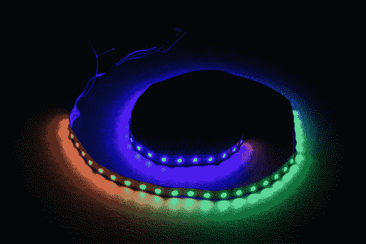](https://cdn.sparkfun.com/assets/learn_tutorials/8/5/5/Strand_dark.jpg)

代数！

使用 [3 英寸的 LuMini 环](https://www.sparkfun.com/products/14965)和一些其他功能。

**Reminder:** This example sets the brightness at 25\. If you are using any of the APA102 line with 2020s we do **not** recommend running at full brightness. Turning the brightness up all the way and leaving all LED's on white will result in damage to your LEDs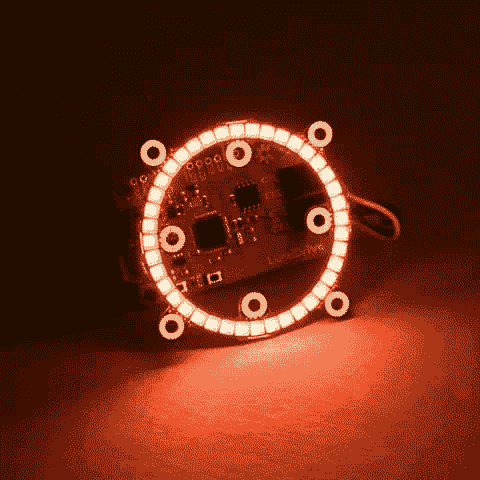](https://cdn.sparkfun.com/assets/learn_tutorials/8/5/5/LumiDrive_Demo.gif)**Heads up!** Updating the APA102s gets slower the longer the strand or the amount of LEDs you're driving. This is just the nature of working in Python instead of C. There's also some [known efficiency issues](https://github.com/adafruit/circuitpython/issues/884) with the DotStar library.

## 阅读-评估-打印-循环(REPL)

关于读取-评估-打印循环或 REPL 的说明。这是一个语言外壳，允许你在一个交互式 Python 环境中与 LumiDrive 进行交互。如果你打开你最喜欢的[串行程序](https://learn.sparkfun.com/tutorials/terminal-basics)并打开 LumiDrive 的 COM 端口，你应该会看到以下内容。

[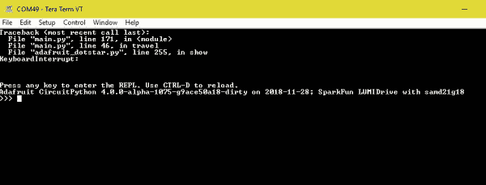](https://cdn.sparkfun.com/assets/learn_tutorials/8/5/5/REPL.JPG)*Having a hard time seeing? Click the image for a closer look.*

Main.py 将运行一个全新的无限闪烁循环。只需按下 **CTRL-C** 即可中断代码。在这里，您可以在一个交互式 python 环境中玩耍。！在这里我们可以做一些有趣的事情，比如数学！

[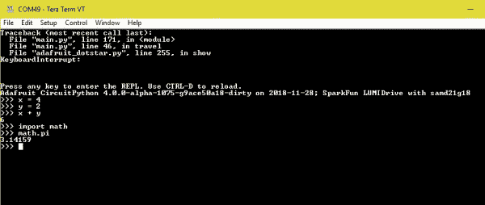](https://cdn.sparkfun.com/assets/learn_tutorials/8/5/5/REPL_MATH.JPG)*Having a hard time seeing? Click the image for a closer look.*

更重要的是，我们可以分别使用`help(modules)`和`dir(board)`命令，查看加载到 LumiDrive 上的 Circuit Python 版本中有哪些库和引脚可供我们使用。

[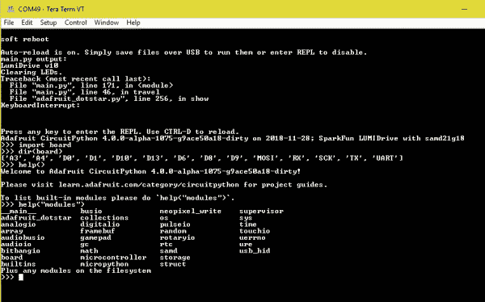](https://cdn.sparkfun.com/assets/learn_tutorials/8/5/5/REPL_USEFUL.JPG)*Having a hard time seeing? Click the image for a closer look.*

如果你看一下显示`dir(board)`的那一行，下面是 Circuit Python 中可用的各种引脚，但并不是所有引脚都在电路板上分开。当你在 REPL 折腾完，准备运行 LumiDrive 上的代码时，你可以按下 **CTRL-D** ，这将启动软重启。

## 资源和更进一步

*   **硬件**
    *   [示意图](https://cdn.sparkfun.com/assets/learn_tutorials/8/5/5/LumiDrive.pdf)
    *   [老鹰档案](https://cdn.sparkfun.com/assets/learn_tutorials/8/5/5/LumiDrive_Eagle_Files.zip)
*   [电路巨蟒](https://learn.adafruit.com/welcome-to-circuitpython/overview)
    *   [电路 Python 示例代码](https://github.com/adafruit/Adafruit_Learning_System_Guides/tree/master/CircuitPython_Essentials)
*   [微 Python](https://micropython.org/)
*   GitHub 回购
    *   [产品](https://github.com/sparkfun/LumiDrive) -硬件
    *   [示例代码](https://github.com/sparkfun/SparkFun_LumiDrive_Example_Code/)——用本教程中的示例代码进行回购。

需要更多灵感？查看这些教程:

[](https://learn.sparkfun.com/tutorials/das-blinken-top-hat) [### 闪烁的顶部](https://learn.sparkfun.com/tutorials/das-blinken-top-hat) A top hat decked out with LED strips makes for a heck of a wedding gift.[Favorited Favorite](# "Add to favorites") 1[](https://learn.sparkfun.com/tutorials/dotbar-display-driver-hookup-guide) [### 点/条显示驱动器连接指南](https://learn.sparkfun.com/tutorials/dotbar-display-driver-hookup-guide) How to hook up the LM3914 or LM3916 to drive a 10-LED display with a lone analog signal.[Favorited Favorite](# "Add to favorites") 10[](https://learn.sparkfun.com/tutorials/experiment-guide-for-the-johnny-five-inventors-kit) [### Johnny-Five 发明人工具包实验指南](https://learn.sparkfun.com/tutorials/experiment-guide-for-the-johnny-five-inventors-kit) Use the Tessel 2 and the Johnny Five Inventors kit to explore the world of JavaScript enabled hardware through 14 awesome experiments 8[](https://learn.sparkfun.com/tutorials/avr-based-serial-enabled-lcds-hookup-guide) [### 基于 AVR 的串行 LCD 连接指南](https://learn.sparkfun.com/tutorials/avr-based-serial-enabled-lcds-hookup-guide) The AVR-based Qwiic Serial Enabled LCDs are a simple and cost effective solution to include in your project. These screens are based on the HD44780 controller, and include ATmega328P with an Arduino compatible bootloader. They accept control commands via Serial, SPI and I2C (via PTH headers or Qwiic connector). In this tutorial, we will show examples of a simple setup and go through each communication option.[Favorited Favorite](# "Add to favorites") 13

或者看看这些博客帖子:

[](https://www.sparkfun.com/news/2857 "January 22, 2019: If you're looking to try coding in Python, especially as it translates to the world of physical computing, the SparkFun LumiDrive is a great way to get started. ") [### python 和 sparkfun lumidrives

January 22, 2019](https://www.sparkfun.com/news/2857 "January 22, 2019: If you're looking to try coding in Python, especially as it translates to the world of physical computing, the SparkFun LumiDrive is a great way to get started. ")[Favorited Favorite](# "Add to favorites") 1[](https://www.sparkfun.com/news/2863 "January 29, 2019: Last week, we took a look at using the digital pins on our new LumiDrive LED Driver. This week, we'll play with the analog pins, and see if we can't put something together using both!") [### 更多 Python 与 SparkFun LumiDrive！

January 29, 2019](https://www.sparkfun.com/news/2863 "January 29, 2019: Last week, we took a look at using the digital pins on our new LumiDrive LED Driver. This week, we'll play with the analog pins, and see if we can't put something together using both!")[Favorited Favorite](# "Add to favorites") 0[](https://www.sparkfun.com/news/2868 "February 5, 2019: Taking what I've learned about LED color mixing and Python, along with our LumiDrive LED Driver and LuMini LED Ring, I set out to create a light ring for macro photography that surpasses all others.") [### DIY 相机镜头灯圈

February 5, 2019](https://www.sparkfun.com/news/2868 "February 5, 2019: Taking what I've learned about LED color mixing and Python, along with our LumiDrive LED Driver and LuMini LED Ring, I set out to create a light ring for macro photography that surpasses all others.")[Favorited Favorite](# "Add to favorites") 3[](https://www.sparkfun.com/news/2939 "June 6, 2019: How the night was won!") [### Enginursday: DIY 电容式触摸小夜灯

June 6, 2019](https://www.sparkfun.com/news/2939 "June 6, 2019: How the night was won!")[Favorited Favorite](# "Add to favorites") 5**************