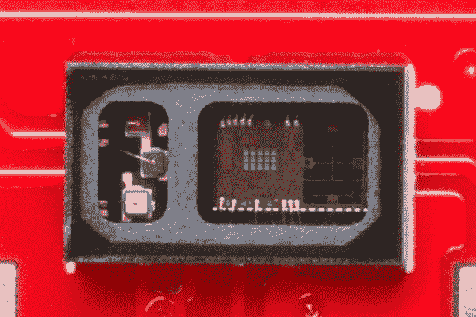
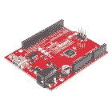
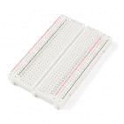
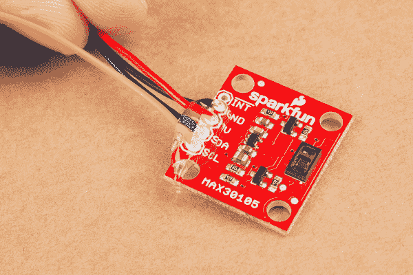
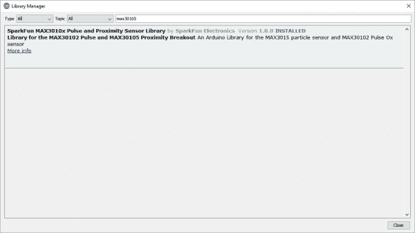

# MAX30105 粒子和脉冲氧传感器连接指南

> 原文：<https://learn.sparkfun.com/tutorials/max30105-particle-and-pulse-ox-sensor-hookup-guide>

## 介绍

[SparkFun MAX30105 粒子传感器](https://www.sparkfun.com/products/14045)是一种灵活而强大的传感器，能够感应距离、心率、粒子检测，甚至眨眼。本教程将帮助您从传感器获取原始数据。

[](https://www.sparkfun.com/products/retired/14045) 

### [SparkFun 粒子传感器 Breakout - MAX30105](https://www.sparkfun.com/products/retired/14045)

[Retired](https://learn.sparkfun.com/static/bubbles/ "Retired") SEN-14045

SparkFun MAX30105 粒子传感器是一种灵活、强大的传感器，能够感应距离、心率、粒子检测和温度

2 **Retired**[Favorited Favorite](# "Add to favorites") 36[Wish List](# "Add to wish list")

[https://www.youtube.com/embed/EY4z8te0oH0/?autohide=1&border=0&wmode=opaque&enablejsapi=1](https://www.youtube.com/embed/EY4z8te0oH0/?autohide=1&border=0&wmode=opaque&enablejsapi=1)

在左边的窗口后面，MAX30105 有三个发光二极管。右边是一个非常灵敏的光子探测器。这个想法是，你挡住不同的 led，检测什么光反射回检测器，根据这个信号，你可以判断不同类型的粒子或材料的存在(如氧合血或火灾产生的烟雾)。

[](https://cdn.sparkfun.com/assets/learn_tutorials/5/7/7/MAX30105_Close_up.jpg)*Close up photo of the MAX30105 sensor.*

### 建议的材料

你需要一些额外的部件来启动和运行 MAX30105。下面是本教程中使用的组件，如果您想继续学习的话。

需要一个支持 [I ² C](https://learn.sparkfun.com/tutorials/i2c) 的微控制器与 MAX30105 通信，并将数据转发给用户。 [SparkFun RedBoard](https://www.sparkfun.com/products/12757) 或 [Arduino Uno](https://www.sparkfun.com/products/11021) 是这个角色的热门选择，但几乎任何微控制器开发板都应该工作。(固件示例使用 Arduino 库，如果这是使用 Arduino 的额外动机的话。)

[](https://www.sparkfun.com/products/11113) 

将**添加到您的[购物车](https://www.sparkfun.com/cart)中！**

### [Arduino Pro Mini 328-5V/16 MHz](https://www.sparkfun.com/products/11113)

[In stock](https://learn.sparkfun.com/static/bubbles/ "in stock") DEV-11113

SparkFun 对 Arduino 的极简设计方法。这是一个 5V Arduino 运行 16MHz 引导加载程序。

$10.95137[Favorited Favorite](# "Add to favorites") 166[Wish List](# "Add to wish list")****[](https://www.sparkfun.com/products/11021) 

将**添加到您的[购物车](https://www.sparkfun.com/cart)中！**

### [Arduino Uno - R3](https://www.sparkfun.com/products/11021)

[In stock](https://learn.sparkfun.com/static/bubbles/ "in stock") DEV-11021

这是新的 Arduino Uno R3。除了以前主板的所有功能外，Uno 现在使用 ATmega16U2 代替…

$27.95138[Favorited Favorite](# "Add to favorites") 162[Wish List](# "Add to wish list")****[](https://www.sparkfun.com/products/13664) 

将**添加到您的[购物车](https://www.sparkfun.com/cart)中！**

### [SparkFun SAMD21 迷你突围](https://www.sparkfun.com/products/13664)

[In stock](https://learn.sparkfun.com/static/bubbles/ "in stock") DEV-13664

如果您准备从旧的 8 位/16MHz 微控制器升级您的 Arduino 游戏，SparkFun SAMD21 Mini Breakout 是…

$22.5018[Favorited Favorite](# "Add to favorites") 36[Wish List](# "Add to wish list")****[](https://www.sparkfun.com/products/retired/12757) 

### [spark fun red board——用 Arduino 编程 T3](https://www.sparkfun.com/products/retired/12757)

[Retired](https://learn.sparkfun.com/static/bubbles/ "Retired") DEV-12757

在 SparkFun，我们使用许多 Arduinos，我们一直在寻找最简单、最稳定的一款。每块板都有点不同…

127 **Retired**[Favorited Favorite](# "Add to favorites") 78[Wish List](# "Add to wish list")**************5V Recommended!** The MAX30105 can run at 3.3V to 5V and can communicate with 3.3V and 5V microcontrollers. Most USB based development boards have a 5V pin that will power the MAX30105 nicely.

四五根[跳线](https://www.sparkfun.com/products/13870)和一个[试验板](https://www.sparkfun.com/products/12002)有助于将传感器连接到你的 Arduino。要将分线点插入试验板，你需要焊接[接头](https://www.sparkfun.com/products/116)或切断引脚的跳线。(别忘了[一个烙铁](https://www.sparkfun.com/products/9507)和[焊锡](https://www.sparkfun.com/products/9163)！)

[](https://www.sparkfun.com/products/12002) 

将**添加到您的[购物车](https://www.sparkfun.com/cart)中！**

### [【试验板-不干胶(白色)](https://www.sparkfun.com/products/12002)

[In stock](https://learn.sparkfun.com/static/bubbles/ "in stock") PRT-12002

这是你的尝试和真正的白色无焊试验板。它有 2 条电源总线，10 列，30 行，总共 400 个连接…

$5.5048[Favorited Favorite](# "Add to favorites") 93[Wish List](# "Add to wish list")****[](https://www.sparkfun.com/products/116) 

将**添加到您的[购物车](https://www.sparkfun.com/cart)中！**

### [破开头球——直击](https://www.sparkfun.com/products/116)

[In stock](https://learn.sparkfun.com/static/bubbles/ "in stock") PRT-00116

一排标题-打破适应。40 个引脚，可切割成任何尺寸。用于定制 PCB 或通用定制接头。

$1.7520[Favorited Favorite](# "Add to favorites") 133[Wish List](# "Add to wish list")****[](https://www.sparkfun.com/products/9507) 

将**添加到您的[购物车](https://www.sparkfun.com/cart)中！**

### [烙铁- 30W(美国，110V)](https://www.sparkfun.com/products/9507)

[33 available](https://learn.sparkfun.com/static/bubbles/ "33 available") TOL-09507

这是一个非常简单的固定温度，快速加热，30W 110/120 VAC 烙铁。我们真的很喜欢使用更贵的 iro…

$10.957[Favorited Favorite](# "Add to favorites") 21[Wish List](# "Add to wish list")****[](https://www.sparkfun.com/products/retired/13870) 

### [跳线高级 4" M/M - 20 AWG (30 个装)](https://www.sparkfun.com/products/retired/13870)

[Retired](https://learn.sparkfun.com/static/bubbles/ "Retired") PRT-13870

这些是 101 毫米长的 20AWG 跳线，两端都有公接头。使用这些从任何板上的任何母接头跳接…

**Retired**[Favorited Favorite](# "Add to favorites") 5[Wish List](# "Add to wish list")****** ******### 推荐阅读

MAX30105 设计用于多种用途，包括[脉搏血氧仪](https://en.wikipedia.org/wiki/Pulse_oximetry)。如果您对光脉冲检测不熟悉，可以参考来自 [TI](http://www.ti.com/lit/an/slaa655/slaa655.pdf) 和[恩智浦](http://www.nxp.com/files/32bit/doc/app_note/AN4327.pdf)的一些非常好的应用笔记，其中包含大量入门信息。

MAX30105 通过 I ² C 进行通信。我们有一个很棒的库，使它易于使用。我们将使用试验板将分线板连接到红板。如果这些主题中的任何一个对你来说听起来很陌生，请考虑在继续之前浏览该教程。

[](https://learn.sparkfun.com/tutorials/how-to-solder-through-hole-soldering) [### 如何焊接:通孔焊接](https://learn.sparkfun.com/tutorials/how-to-solder-through-hole-soldering) This tutorial covers everything you need to know about through-hole soldering.[Favorited Favorite](# "Add to favorites") 70[](https://learn.sparkfun.com/tutorials/installing-an-arduino-library) [### 安装 Arduino 库](https://learn.sparkfun.com/tutorials/installing-an-arduino-library) How do I install a custom Arduino library? It's easy! This tutorial will go over how to install an Arduino library using the Arduino Library Manager. For libraries not linked with the Arduino IDE, we will also go over manually installing an Arduino library.[Favorited Favorite](# "Add to favorites") 22[](https://learn.sparkfun.com/tutorials/how-to-use-a-breadboard) [### 如何使用试验板](https://learn.sparkfun.com/tutorials/how-to-use-a-breadboard) Welcome to the wonderful world of breadboards. Here we will learn what a breadboard is and how to use one to build your very first circuit.[Favorited Favorite](# "Add to favorites") 79[](https://learn.sparkfun.com/tutorials/i2c) [### I2C](https://learn.sparkfun.com/tutorials/i2c) An introduction to I2C, one of the main embedded communications protocols in use today.[Favorited Favorite](# "Add to favorites") 128

## MAX30105 分线点概述

MAX30105 有三个板载 led(见左侧)。Maxim 建议这些 LED 由 5V 供电，但我们发现 LED 在 3.3V 下工作良好。红色和红外 LED 保证在 3.3V 下工作，但绿色 LED 可能需要 3.5V。最好在 3.3V 下测试您的主板，看看绿色 LED 是否亮起。

[](https://cdn.sparkfun.com/assets/learn_tutorials/5/7/7/MAX30105_Close_up.jpg)

IC 本身在 1.8V 下运行，因此我们包含了接口逻辑，允许您将 MAX30105 分线板连接到任何具有 5V、3.3V 甚至 1.8V 电平 I/O 的板。

| Pin Label | 输入/输出 | 描述 |
| INT | 输出 | 中断，低电平有效 |
| GND | 供应输入 | 接地(0V)电源 |
| 5V | 供应输入 | 电源 |
| 国家药品监督管理局 | 双向的 | I ² C 总线时钟线 |
| SCL | 投入 | I ² C 总线时钟线 |

GND/5V/SDA/SCL 引脚是我们大多数产品的标准 I ² C 连接。这使得你可以轻松地将 I ² C 板连接到我们的许多平台上。

[](https://cdn.sparkfun.com/assets/learn_tutorials/5/7/7/I2C_Pins_MAX30105.jpg)

PCB 背面有两个跳线:

[](https://cdn.sparkfun.com/assets/learn_tutorials/5/7/7/Rear_Jumpers_MAX30105.jpg)

*   在许多 I ² C 板上使用 **PU** 跳线，以允许用户从 SDA 和 SCL 线断开 4.7k 欧姆上拉( **PU** )电阻器。默认情况下，此跳线闭合，意味着 SDA 和 SCL 上有 4.7k 上拉电阻。如果这是 I ² C 总线上的唯一设备，则该跳线应保持闭合。如果总线上有多个带上拉电阻的 I ² C 器件或分线板，则应切断该跳线中的走线，从总线上移除 4.7k 欧姆电阻。如果需要，跳线可以重新焊接，以便将来再次闭合。

*   **INT** 跳线用于控制中断引脚上的上拉电阻。默认情况下，INT 跳线闭合，这意味着一个 4.7k 电阻正在上拉中断引脚。MAX30105 上的 INT 引脚是开漏引脚。如果你的 I ² C 总线上只有一块板，这个跳线应该保持闭合。如果 I ² C 总线上有多个板共享一个中断引脚，可以切断该跳线以断开上拉电阻。

## 硬件连接

[](https://cdn.sparkfun.com/assets/learn_tutorials/5/7/7/Fritzing_Hookup.jpg)*Four wires is all you need but consider using connecting the board with soldered wires instead of a breadboard!*

因为这种传感器可以有多种用途，所以在焊接之前，请考虑如何使用 MAX30105。如果您计划将传感器用于脉搏血氧仪，我们建议将短线焊接到电路板上，以便在传感器连接到手指时能够移动。如果您对静电检测更感兴趣，如颗粒或空气监测，可以考虑将公接头焊接到电路板上。

这是一个使用跳线与 MAX30105 板进行可靠连接的示例。

这些[跳线](https://www.sparkfun.com/products/11026)包含绞合线，这使它们更灵活，更不容易因重复移动而断裂。

[](https://cdn.sparkfun.com/assets/learn_tutorials/5/7/7/Jumper_Wires.jpg)

挑选四种不同颜色的电线，并把它们剪成你想要的长度。我们用红色、黑色、黄色和蓝色来使事物易于识别。

[](https://cdn.sparkfun.com/assets/learn_tutorials/5/7/7/Cut_Jumper_Wires.jpg)

剥去电线的两端，将它们焊接到不同的位置。INT 引脚的连接是可选的，下面的 Arduino 示例不需要。

让小规格的电线保持在原位会很困难。当我焊接时，我喜欢用粘性的大头钉来固定所有的东西。

[](https://cdn.sparkfun.com/assets/learn_tutorials/5/7/7/Soldering_MAX3015-3.jpg)*Sticky tack is your friend!*

您可以选择任何想要的颜色，但是对每个管脚使用不同的颜色将会更容易区分连接。

[](https://cdn.sparkfun.com/assets/learn_tutorials/5/7/7/Soldering_MAX3015-2.jpg)*Recommended wire colors: Red-VCC, Black-GND, Yellow-SCL, Blue-SDA*

[绞线](https://learn.sparkfun.com/tutorials/working-with-wire#stranded-vs-solid)比实芯线更易弯曲。然而，如果没有应力消除，即使这些绞合线也可能由于大量弯曲而断裂。

[](https://cdn.sparkfun.com/assets/learn_tutorials/5/7/7/Wires_into_MAX30105.jpg)*Wires soldered into place*

当你开始用手“说话”时，在电线与 PCB 连接的地方添加一点热熔胶会使电路板更加坚固，更耐损坏。

[](https://cdn.sparkfun.com/assets/learn_tutorials/5/7/7/Hot_Glue_Stress_Relief_MAX30105.jpg)

## 使用 SparkFun MAX30105 Arduino 库

让我们开始吧！我们已经为 MAX30105 和 MAX30102 编写了一个 Arduino 库(它应该也适用于 MAX30101)，它负责所有的 I ² C 通信、移位、寄存器写入和样本读取。该库支持 MAX30102(仅红色和红外 led)和 MAX30105(红色、红外和绿色 led)。

安装库最简单的方法是通过 Arduino 库管理器。

[](https://cdn.sparkfun.com/assets/learn_tutorials/5/7/7/Arduino_Libraries.jpg)

在搜索框中键入 **MAX30105** 并选择 SparkFun 库。

[](https://cdn.sparkfun.com/assets/learn_tutorials/5/7/7/MAX30105_Arduino_Library.jpg)

点击 SparkFun 库突出显示，然后点击安装按钮。

[](https://cdn.sparkfun.com/assets/learn_tutorials/5/7/7/MAX30105_Examples_Menu-1.jpg)

一旦你下载了这个库，你应该通过导航到

```
File > Examples > SparkFun MAX3010x Pulse and Proximity Sensor Library > Examples 
```

当你在那里的时候，继续打开**例 1 基本阅读**。

如果你想从我们的[spark fun max 3010 x Sensor GitHub 库](https://github.com/sparkfun/SparkFun_MAX3010x_Sensor_Library)获取最新版本的库，你也可以这么做！

[Download the SparkFun MAX3010x Arduino Library](https://github.com/sparkfun/SparkFun_MAX3010x_Sensor_Library/archive/master.zip)

然后跟随我们的[如何安装 Arduino 库教程](https://learn.sparkfun.com/tutorials/installing-an-arduino-library)来帮助安装库。如果下载库的 ZIP 文件，可以使用 Arduino 的“添加 ZIP 库...”只需几次点击就可以安装源文件和示例文件。

## 示例 1 -读取红色/红外/绿色

一旦你安装了图书馆，打开**示例 1 基本读物**草图。你可以在下面找到它

```
File > Examples > SparkFun MAX3010x Pulse and Proximity Sensor Library > Examples 
```

然后将它加载到你的 RedBoard 或 Uno。打开您最喜欢的[串行终端](https://learn.sparkfun.com/tutorials/terminal-basics)查看打印值。

[](https://cdn.sparkfun.com/assets/learn_tutorials/5/7/7/Example1a.jpg)

此示例输出传感器读取的原始值。传感器朝上，用手悬停在传感器上。当你的手反射不同量的光时，你会看到数值的变化。请注意，红外读数可能会在红色和绿色读数之前发生变化。红外更擅长感知距离变化。

用手指完全盖住传感器。请注意非常大的读数。这是 MAX30105 区别于其他反射传感器的特征之一。该 IC 能够读取最高 18 位或最高 262，144 的值。可以检测到极小的光线变化！

MAX30105 易于使用！调用`particleSensor.getGreen()`将读取读数并返回绿光的反射量。

## 示例 2 -存在感测

打开**示例 2 存在感测**草图，并将其加载到您的 RedBoard 或 Uno 上。

[](https://cdn.sparkfun.com/assets/learn_tutorials/5/7/7/Example2.jpg)

这个例子在设置过程中取了一些读数，并将它们平均在一起。它使用这个平均值作为基线。如果传感器检测到平均值有显著变化，那么“有东西在那里！”已打印。当你需要检测一个球是否穿过一个通道或其他光电门的情况时，这是很有用的。它还可以方便地测试传感器可以检测到的东西的范围。

```
language:c
//Setup to sense up to 18 inches, max LED brightness
byte ledBrightness = 0xFF; //Options: 0=Off to 255=50mA
byte sampleAverage = 4; //Options: 1, 2, 4, 8, 16, 32
byte ledMode = 2; //Options: 1 = Red only, 2 = Red + IR, 3 = Red + IR + Green
byte sampleRate = 400; //Options: 50, 100, 200, 400, 800, 1000, 1600, 3200
int pulseWidth = 411; //Options: 69, 118, 215, 411
int adcRange = 2048; //Options: 2048, 4096, 8192, 16384

particleSensor.setup(ledBrightness, sampleAverage, ledMode, sampleRate, pulseWidth, adcRange); //Configure sensor with these settings 
```

*What is this block of code doing?*

在设置过程中，该代码初始化传感器。MAX30105 有许多不同的选项和配置。您可以定义任意多或任意少的数量。您也可以全部跳过:

```
language:c
particleSensor.setup(); //Configure sensor with default settings 
```

传感器将采用默认设置进行配置。默认设置适用于大多数应用。

## 示例 3 -温度传感器

打开**示例 3 温度感测**草图，并将其加载到您的 RedBoard 或 Uno 上。

[](https://cdn.sparkfun.com/assets/learn_tutorials/5/7/7/Example3.jpg)

本例以摄氏度和华氏度输出板载温度传感器的读数。温度传感器可以精确到+/-1°C，但精度却惊人地达到 0.0625°C。

传感器内部使用该温度来校准其样本，但如果您需要一个灵敏且快速响应的温度传感器，该温度会很有用。

## 示例 4 -心跳绘图

这才是真正有趣的地方！血红蛋白反射红外光非常好，MAX3015 能够检测红外反射率的微小变化，从而可以检测到以不同速度流经手指的血液。让我们用图表表示它！打开 **Example4 心跳绘图仪**草图，并将其加载到你的 Redboard 或 Uno 上。

**Arduino v1.6.6 or Higher Required.** The Serial Plotter is only available in Arduino versions v1.6.6 or later.

对于这个演示，你需要一个足够小的橡皮筋穿过分接头上的安装孔。

[](https://cdn.sparkfun.com/assets/learn_tutorials/5/7/7/Rubber_Band_through_MAX30105.jpg)

把带子绕回去，然后轻轻地拉。你需要用手指压住传感器。如果你的指尖变得苍白，说明你拧得太紧了！

[](https://cdn.sparkfun.com/assets/learn_tutorials/5/7/7/MAX30105_Pulse_Oximetry.jpg)**I'll just hold my finger on the sensor instead...**

人类不擅长对一个事物施加持续的压力。如果没有橡皮筋，压力变化足以导致手指中的血液流动不同，从而导致传感器读数不稳定。最好使用橡皮筋或其他紧固装置将传感器连接到手指上。

[](https://cdn.sparkfun.com/assets/learn_tutorials/5/7/7/HeartBeat.jpg)*Graph of IR data - That's my pulse!*

说明:

1.  将代码加载到 Redboard 上
2.  用橡皮筋将传感器绑在手指上
3.  打开工具-> *串行绘图仪*
4.  确保下拉菜单设置为 115200 波特
5.  检查光点！
6.  感受你脖子上的脉搏，观察它模拟的信号

既然我们已经看到了波动，示例 5 将尝试计算波动之间的时间，并向我们显示每分钟的节拍数(BPM)。

## 示例 5 -心率

**Hey!** Let's have a brief chat about what this code does. We're going to try to detect heart-rate optically. This is tricky and prone to give false readings. We really don't want to get anyone hurt, so use this code only as an example of how to process optical data. Build fun stuff with our MAX30105 breakout board, but don't use it for actual medical diagnosis.

打开**示例 5 心率**草图，并将其加载到 Redboard 或 Uno 上。

[](https://cdn.sparkfun.com/assets/learn_tutorials/5/7/7/Example5.jpg)

该示例对 IR 数据运行名为 PBA 或外围拍幅算法的滤波器。这种算法能够从所有的噪音中提取出信号，并计算信号之间的时间来获得心率。输出是你的瞬时心率和你的平均心率(BPM)。

正如人们所料，人体不像节拍器那样精确。脉冲之间的时间可能变化很大，因此该草图采用 4 个读数的移动平均值来消除差异。

**麻烦？**尝试将传感器移到另一根手指上。橡胶带应该舒适，但不要太紧。该算法需要几秒钟来确定波峰和波谷，因此每次移动传感器时，请等待几秒钟，以便读数有意义。

## 高级功能

MAX30105 是高度可配置的，并且在库中有大量的功能暴露给用户。检查 MAX30105.h 文件中的所有函数，但这里是主要的。阅读 [MAX30105 数据表](https://cdn.sparkfun.com/assets/learn_tutorials/5/7/7/MAX30105_3.pdf)了解更多信息。

该库支持以下功能:

*   如果你有一个有多个 I ² C 端口的平台，当你调用 begin 时传递端口对象。当你调用`.begin()`时，你可以通过包括 I2C _ 速度 _ 快速来增加 I ² C 的速度到 400kHz。
*   `.setup()` -用各种设置初始化传感器。参见[示例 2](https://learn.sparkfun.com/tutorials/max30105-particle-and-pulse-ox-sensor-hookup-guide#example-2---presence-sensing) 了解选项的详细解释。
*   `.getRed()` -返回即时红色值
*   `.getIR()` -返回即时 IR 值
*   `.getGreen()` -返回即时绿色值
*   `.available()` -返回有多少新样本可用
*   `.readTemperature()` -返回 IC 的温度，单位为摄氏度
*   `.readTemperatureF()` -返回 IC 的温度，单位为 F
*   `.softReset()` -重置一切，包括数据和配置
*   `.shutDown()` -关闭 IC 电源，但保留所有配置
*   `.wakeUp()` -与关机相反
*   `.setLEDMode(mode)` -配置传感器使用 1 个(仅红色)、2 个(红色+红外)或 3 个(红色+红外+绿色)发光二极管
*   `.setADCRange(adcRange)` -将 ADC 设置为 2048、4096、8192 或 16384
*   `.setSampleRate(sampleRate)` -配置采样率:50，100，200，400，800，1000，1600，3200

**中断**

*   `.getINT1()` -返回主中断组
*   `.getINT2()` -返回临时就绪中断

启用/禁用单个中断。参见[数据表](https://cdn.sparkfun.com/assets/learn_tutorials/5/7/7/MAX30105_3.pdf)的第 13 和 14 页，了解每个中断的解释:

*   `.enableAFULL()`
*   `.disableAFULL()`
*   `.enableDATARDY()`
*   `.disableDATARDY()`
*   `.enableALCOVF()`
*   `.disableALCOVF()`
*   `.enablePROXINT()`
*   `.disablePROXINT()`
*   `.enableDIETEMPRDY()`
*   `.disableDIETEMPRDY()`

**先进先出**

MAX30105 有一个 32 字节的 FIFO。这允许我们在传感器进行测量的同时，在微控制器上做其他事情。关于如何轮询 FIFO 的说明，参见**示例 6** 。

*   `.check()` -定期呼叫，从传感器获取数据
*   `.nextSample()` -先进先出
*   `.getFIFORed()` -返回 tail 指向的 FIFO 样本
*   `.getFIFOIR()` -返回 tail 指向的 FIFO 样本
*   `.getFIFOGreen()` -返回 tail 指向的 FIFO 样本

## 资源和更进一步

有关 MAX30105 粒子传感器分线板 Maxim MAX3010x 的更多信息，请查看以下链接:

*   [MAX30105 分线板 GitHub 储存库](https://github.com/sparkfun/MAX30105_Particle_Sensor_Breakout) -传感器最新设计文件的大本营
*   [MAX30105 分线板示意图](https://github.com/sparkfun/MAX30105_Particle_Sensor_Breakout/raw/master/Hardware/MAX30105_Breakout_Schematic.pdf) (PDF)
*   [MAX30105 分线板老鹰文件](https://github.com/sparkfun/MAX30105_Particle_Sensor_Breakout/archive/master.zip) (ZIP)
*   [MAX30105 数据表](https://cdn.sparkfun.com/assets/learn_tutorials/5/7/7/MAX30105_3.pdf) (PDF)
*   [SparkFun MAX3010x 传感器库 GitHub 库](https://github.com/sparkfun/SparkFun_MAX3010x_Sensor_Library) -本教程中使用的 Arduino 库的源文件和示例文件。
*   [SFE 产品展示区](https://youtu.be/EY4z8te0oH0)

### 你能帮什么忙？

MAX30105 是一个非常强大的传感器，但我们只是触及了它的皮毛。如果你是一位算法大师，并且有更好的方法来计算心率、SPO2 或粒子检测，我们希望听到你的意见！请将您的回购链接发送给我们，我们会将其包含在此处。

* * *

要了解更多的传感器动作，请查看这些其他伟大的 SparkFun 教程。

[](https://learn.sparkfun.com/tutorials/vernier-photogate) [### 游标光电门](https://learn.sparkfun.com/tutorials/vernier-photogate) Vernier Photogate Timer -- using the Serial Enabled LCD Kit.[Favorited Favorite](# "Add to favorites") 2[](https://learn.sparkfun.com/tutorials/sparkfun-bme280-breakout-hookup-guide) [### SparkFun BME280 分线连接指南](https://learn.sparkfun.com/tutorials/sparkfun-bme280-breakout-hookup-guide) A guide for connecting the BME280 sensor to a microcontroller, and for using the SparkFun Arduino library.[Favorited Favorite](# "Add to favorites") 1[](https://learn.sparkfun.com/tutorials/sparkfun-qwiic-micropressure-hookup-guide) [### SparkFun Qwiic 微压连接指南](https://learn.sparkfun.com/tutorials/sparkfun-qwiic-micropressure-hookup-guide) Get started using your Qwiic MicroPressure breakout board with this hookup guide.[Favorited Favorite](# "Add to favorites") 2[](https://learn.sparkfun.com/tutorials/qwiic-tof-imager---vl53l5cx-hookup-guide) [### Qwiic ToF 成像仪- VL53L5CX 连接指南](https://learn.sparkfun.com/tutorials/qwiic-tof-imager---vl53l5cx-hookup-guide) Hookup Guide for the Qwiic ToF Imager - VL53L5CX[Favorited Favorite](# "Add to favorites") 1************