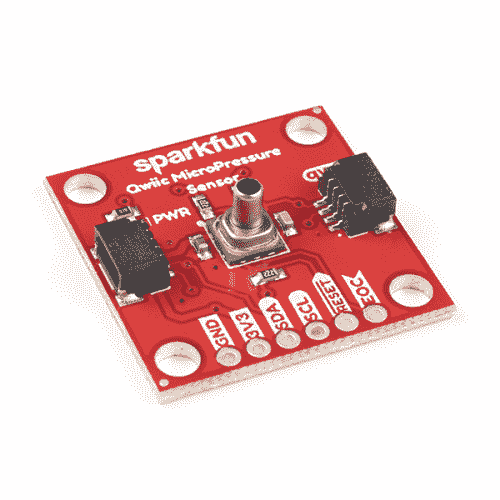

# 用大气压测量高度

> 原文：<https://learn.sparkfun.com/tutorials/measuring-height-with-atmospheric-pressure>

## 介绍

人们很容易忘记我们一直受到周围大气的压力(尽管弗雷迪和鲍伊试图告诉我们)。不仅如此，这有点违反直觉:越往上走，压力越小，反之亦然。在我们的日常生活中，有几种方式会遇到这种情况，比如在 30，000 英尺的高度保持飞机机舱的压力，或者在落基山脉这里水的沸腾速度稍微快一点！在这个项目中，我们将研究我们周围的大气，并做一点数学计算，以创建一个基于**压力传感器的高度测量工具**！

这个项目的发电站是 [Qwiic 微压传感器](https://www.sparkfun.com/products/16476)。这种传感器有一个板载霍尼韦尔 25psi 压阻硅压力传感器，能够测量绝对压力的非常微小的差异。我们将获取这些压力测量值，在代码中应用一些数学运算，并将底部和顶部读数的压力变化转化为高度测量值。

## 所需材料

这里是你需要跟随本教程的所有部分！您可以添加您需要的部件，或者，如果您还没有这些部件，您可以点击提供的愿望列表，一次性购买！