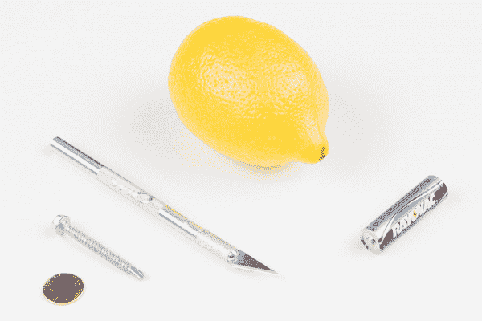

# 测量电池的内阻

> 原文：<https://learn.sparkfun.com/tutorials/measuring-internal-resistance-of-batteries>

## 介绍

电池是将化学反应转化为电能的非常有用的装置。我们每天都在手电筒、汽车、视频游戏控制器等物品中使用它们。要了解电池的工作原理，请观看以下视频:

[https://www.youtube.com/embed/-EB7NVA7rI4](https://www.youtube.com/embed/-EB7NVA7rI4)

要更深入地了解电池，请参阅本文:

 [### 什么是电池？

#### 2016 年 5 月 3 日](https://learn.sparkfun.com/tutorials/what-is-a-battery) An overview of the inner workings of a battery and how it was invented.[Favorited Favorite](# "Add to favorites") 23

在本教程中，我们将用一个柠檬、一个镀锌螺丝和一枚镀铜硬币制作一个粗制的电池。螺丝和硬币中的金属与柠檬中的酸发生反应，产生电子流。

事实上，柠檬是劣质电池。一个原因是锌在没有电路存在的情况下继续与柠檬反应。这意味着电池只有几个小时的保质期。

另一个因素是柠檬电池的**内阻**。我们将在下一节讨论内阻以及它对电池的重要性。

### 所需材料

*   柠檬
*   镀锌钉或螺钉
*   便士(或其他镀铜的金属)
*   [AA 电池](https://www.sparkfun.com/products/9100)

除了这些材料，你还需要一种测量电压的方法。一个[万用表](https://www.sparkfun.com/products/12966)将会提供最好的准确度，但是你也可以从 [SparkFun Inventor's Kit](https://www.sparkfun.com/products/12060) 中找到的零件构建你自己的电压表。

如果你想建立自己的电压表，这里是你需要的: