# 微型有机发光二极管分线架连接指南

> 原文：<https://learn.sparkfun.com/tutorials/micro-oled-breakout-hookup-guide>

## 介绍

想给你的 Arduino 项目添加一点生动的图片吗？您是否需要显示诊断信息而不求助于串行输出？或者你想在创建一个有趣的基于 Arduino 的视频游戏时学习一点游戏理论。这些只是[微型有机发光二极管突破](https://www.sparkfun.com/products/13003)的一小部分示例应用。

[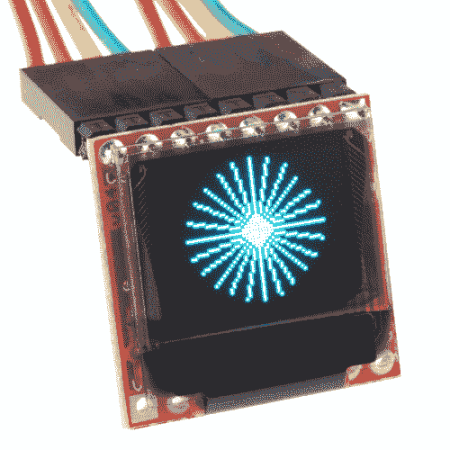](https://www.sparkfun.com/products/13003) 

将**添加到您的[购物车](https://www.sparkfun.com/cart)中！**

### [SparkFun 微有机发光二极管突围](https://www.sparkfun.com/products/13003)

[In stock](https://learn.sparkfun.com/static/bubbles/ "in stock") LCD-13003

SparkFun 微型有机发光二极管分线板分解出一个小的单色、蓝黑相间的有机发光二极管。很“微”，但还是包了…

$17.5027[Favorited Favorite](# "Add to favorites") 102[Wish List](# "Add to wish list")****[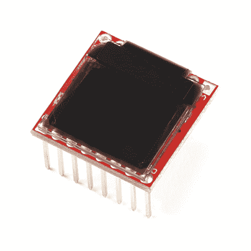](https://www.sparkfun.com/products/13722) 

将**添加到您的[购物车](https://www.sparkfun.com/cart)中！**

### [【斯帕克芬微有机发光二极管突围赛】](https://www.sparkfun.com/products/13722)

[In stock](https://learn.sparkfun.com/static/bubbles/ "in stock") LCD-13722

SparkFun 微型有机发光二极管分线板带有标题，通过 0.1 英寸的间距、预 so…

$17.95[Favorited Favorite](# "Add to favorites") 1[Wish List](# "Add to wish list")**** ****微型有机发光二极管分线板分解出一个小的单色、蓝底黑字的有机发光二极管。它宽 64 像素，高 48 像素，宽 0.66 英寸。它很小，但仍然很有冲击力——有机发光二极管的显示屏很清晰，你可以在上面显示大量的图形。然而，最重要的是，微有机发光二极管很容易控制一个 [SPI](https://learn.sparkfun.com/tutorials/serial-peripheral-interface-spi) 或 [I ² C](https://learn.sparkfun.com/tutorials/i2c) 接口。

### 本教程涵盖的内容

在本教程中，我们将向您简要介绍有机发光二极管和突破，然后我们将跳转到示例硬件连接和代码。本教程分为以下几个部分:

*   [分线板概述](https://learn.sparkfun.com/tutorials/micro-oled-breakout-hookup-guide#breakout-board-overview) -首先，我们将讨论分线板上的每个引脚及其功能。本节还概述了分线点背面的跳线。
*   [硬件组装](https://learn.sparkfun.com/tutorials/micro-oled-breakout-hookup-guide#hardware-assembly) -焊嘴和其他微型有机发光二极管分线组装技巧。
*   [硬件连接](https://learn.sparkfun.com/tutorials/micro-oled-breakout-hookup-guide#hardware-hookup) -在这一节中，我们将向您展示如何通过 SPI 或 I ² C 将 Arduino 连接到显示器
*   [Arduino 库下载、安装和测试](https://learn.sparkfun.com/tutorials/micro-oled-breakout-hookup-guide#arduino-library-download-install-and-test)——下载并安装 Arduino 库，然后上传一个例子来测试一切。
*   [使用 Arduino 库](https://learn.sparkfun.com/tutorials/micro-oled-breakout-hookup-guide#using-the-arduino-library)——对微有机发光二极管 Arduino 库的函数调用家族的快速检查。

### 使用的材料

除了显示之外，您还需要一些组件和工具来跟随本教程。下面是我们用来启动和运行显示器的内容:

[](https://www.sparkfun.com/products/12002) 

将**添加到您的[购物车](https://www.sparkfun.com/cart)中！**

### [【试验板-不干胶(白色)](https://www.sparkfun.com/products/12002)

[In stock](https://learn.sparkfun.com/static/bubbles/ "in stock") PRT-12002

这是你的尝试和真正的白色无焊试验板。它有 2 条电源总线，10 列，30 行，总共 400 个连接…

$5.5048[Favorited Favorite](# "Add to favorites") 93[Wish List](# "Add to wish list")****[](https://www.sparkfun.com/products/116) 

将**添加到您的[购物车](https://www.sparkfun.com/cart)中！**

### [破开头球——直击](https://www.sparkfun.com/products/116)

[In stock](https://learn.sparkfun.com/static/bubbles/ "in stock") PRT-00116

一排标题-打破适应。40 个引脚，可切割成任何尺寸。用于定制 PCB 或通用定制接头。

$1.7520[Favorited Favorite](# "Add to favorites") 133[Wish List](# "Add to wish list")****[](https://www.sparkfun.com/products/11026) 

将**添加到您的[购物车](https://www.sparkfun.com/cart)中！**

### [跳线标准 7" M/M - 30 AWG (30 个装)](https://www.sparkfun.com/products/11026)

[In stock](https://learn.sparkfun.com/static/bubbles/ "in stock") PRT-11026

如果你需要快速完成一个原型，没有什么比一堆跳线更能加快速度的了，让我们来看看

$2.4520[Favorited Favorite](# "Add to favorites") 43[Wish List](# "Add to wish list")****[](https://www.sparkfun.com/products/10914) 

将**添加到您的[购物车](https://www.sparkfun.com/cart)中！**

### [Arduino Pro 328-3.3V/8 MHz](https://www.sparkfun.com/products/10914)

[In stock](https://learn.sparkfun.com/static/bubbles/ "in stock") DEV-10914

是蓝色的！太瘦了！是 Arduino Pro！SparkFun 对 Arduino 的极简设计方法。这是一个 3.3V Arduino 运行测试…

$18.501[Favorited Favorite](# "Add to favorites") 16[Wish List](# "Add to wish list")******** ********不过，有很多方法可以完成连接。一般来说，您需要:

*   Arduino 或其他微控制器 -你需要一些东西来控制显示器。最理想的情况是，你会想要一个工作电压为**3.3V**的东西。我们将使用 [3.3V Arduino Pro](https://www.sparkfun.com/products/10914) ，3.3V Arduino Pro Mini 将是另一个不错的选择。
*   **电平转换** -如果你使用 5V Arduino，像 [Uno](https://www.sparkfun.com/products/11021) 或 [RedBoard](https://www.sparkfun.com/products/12757) ，你需要增加一些电平转换。类似于[双向逻辑电平转换器](https://www.sparkfun.com/products/12009)的东西应该可以做到这一点。
*   **连接器** -一些将分线点与微控制器连接的方法。[如果你用的是](https://www.sparkfun.com/products/116)[试验板](https://www.sparkfun.com/products/11026)，那么公头是完美的选择。或者也许你需要的只是一些[线](https://www.sparkfun.com/products/11375)。
*   **焊接工具** -选好连接器后，你需要将它焊接到分线板上。一个[简单的铁](https://www.sparkfun.com/products/9507)和一些[焊料](https://www.sparkfun.com/products/9163)应该就够了。

### 推荐阅读

在开始微有机发光二极管突破之前，有几个概念你应该熟悉。在继续本教程之前，考虑阅读下面的一些教程。

*   什么是 Arduino？ -我们将使用 Arduino 向有机发光二极管发送命令和显示数据。
*   [串行外设接口(SPI)](https://learn.sparkfun.com/tutorials/serial-peripheral-interface-spi) - SPI 是与显示器通信的首选方法。
*   I ² C -或者，I ² C 可用于控制显示。它使用较少的电线，但速度相当慢。
*   [如何使用试验板](https://learn.sparkfun.com/tutorials/how-to-use-a-breadboard) -试验板将 Arduino 与有机发光二极管分线点连接起来。

## 分线板概述

### 引脚描述

总的来说，微型有机发光二极管分线点提供了对 16 个有机发光二极管引脚的访问。幸运的是，你只需要其中的一半就能让显示器工作。

[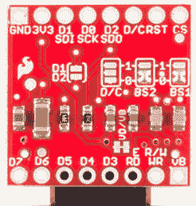](https://cdn.sparkfun.com/assets/learn_tutorials/3/0/8/bottom-board.jpg)

顶行引脚(如上图所示)提供了通过 SPI 或 I2C 接口与有机发光二极管接口所需的一切。这些引脚是:

| Pin Label | SPI 功能 | I ² C 功能 | 笔记 |
| GND | 地面 | 地面 | 0V |
| 3V3 (VDD) | 力量 | 力量 | 应为稳压 3.3V 电源。 |
| D1 (SDI) | MOSI | 国家药品监督管理局 | 串行数据输入 |
| D0 (SCK) | 血清肌酸激酶 | SCL | SPI 和 I ² C 时钟 |
| D2 (SDO) | 军事情报部门组织(Military Intelligence Service Organization) | — | 在 SPI 模式下不可用。I ² C 无功能。 |
| 信用证 | 数据/命令 | I ² C 地址选择 | 输入字节是命令还是屏幕数据时发出信号的数字引脚。 |
| 英特尔的快速储存技术 | 重置 | 重置 | 低屏复位。 |
| 特许测量员 | 特许测量员 | — | SPI 芯片选择(低电平有效) |

底部的针脚通常只在您需要通过并行接口控制显示器时使用。D3-D7 是并行数据总线的最后 5 位。E/RD 可用作使能/禁用引脚或读/写控制，具体取决于并行总线配置。RW/WR 引脚既可用作读/写控制，也可用作写锁存器。

VB 引脚允许您单独为显示器的 VBAT 线供电。VBAT 的电源应该在 3.3V 和 4.2V 之间(类似于锂电池的电源)。如果你想单独给这条线供电，要特别注意下面的 VD/VB 跳线部分。

那些底部的八个针脚只是为了完整而被拆开。如果你通过 SPI 或 I ² C 控制显示器，你可以放心地忽略它们。

### 设置跳线

把板子翻过来，你会发现有五个跳线。这些跳线的大部分用于在 SPI 和 I ² C 模式之间**切换。当电路板发货时，这些跳线被设置为在 **SPI 模式**下配置显示器。**

以下是每种跳线的概述，在上图中从左到右、从上到下排列:

*   **D1/D2** -这个跳线可以用来**短接 D1 到 D2** 。如果要使用 SPI，请保持此跳线开路。如果你使用 I ² C，短接跳线。默认情况下，此跳线是打开的。
*   **直流** -该跳线可用于将直流短接到 3.3V (1)或 0V (0)。在 I ² C 模式下，D/C 引脚设置显示器的 7 位地址。在 SPI 模式下，此跳线应保持开路，因为需要切换 D/C 引脚来确定输入的字节是数据还是命令。
*   **BS2** 和 **BS1** -有机发光二极管上的这些引脚决定你使用哪个接口来控制有机发光二极管。有了这两个信号，就有四种可能的组合:

    | BS2 | BS1 | 连接 |
    | 零 | 零 | 精力 |
    | 零 | 一 | 一^二三 |
    | 一 | 零 | 八位并行 |
    | (6800)一个 | 一个 | 8 位并行(8080) |

    默认情况下，这两个跳线都设置为 0，从而将显示器置于 SPI 模式。如果要将其更改为 I ² C 模式，清除 BS1 跳线并将其设置为 1。
*   **VD/VB** -该跳线将数字电源(VDD)与电池电源(VBAT)短路。由于这两个电源都可以采用 3.3V 电源供电，因此简单的单电源解决方案是将它们短接在一起，为它们提供单电源。如果需要以更低的电压为数字电源供电，如 1.8V，可能需要切断此跳线，提供两个电源。

* * *

这个简短的概述应该涵盖 99%的用例。[如果您对跳线或引脚有任何疑问，请查阅原理图](!!!)和其中的注释。

## 硬件装配

在你焊接任何东西到微有机发光二极管突破之前，花些时间想想你将如何使用它。你只是用它做原型吗？把它贴在实验板上？也许你需要做的就是在那里焊接一些[接头](https://www.sparkfun.com/products/116)。你把它封起来了吗？将其嵌入到项目中？在这种情况下，也许你会想把[线](https://www.sparkfun.com/products/11375)焊接到引脚上。

还要考虑你希望屏幕如何可见。该板的设计使您可以折叠显示器，或者让它从板的边缘掉落。屏幕的方向将决定你需要焊接到电路板的哪一面。

[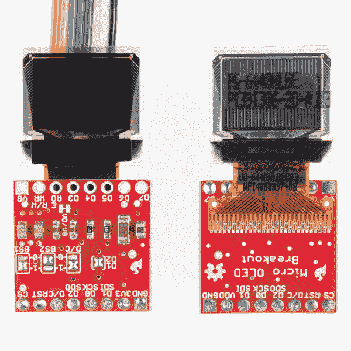](https://cdn.sparkfun.com/assets/learn_tutorials/3/0/8/Micro_LED_Tutorial-03.jpg)*Solder on either side of the PCB. If you're using wire (left) either configuration will do. If you're using headers, we recommend soldering as shown above to the right.*

即使你不打算使用额外的八个引脚，如果可以的话，试着将接头焊接到它们上面。如果您将显示器插入试验板，这将有助于平衡显示器。当你焊接这些针的时候，注意不要烧着屏幕的连接器——你可以在焊接的时候轻轻地把它拉回来。

[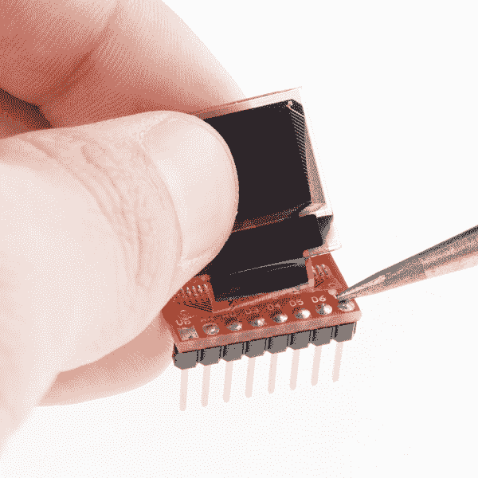](https://cdn.sparkfun.com/assets/learn_tutorials/3/0/8/Micro_LED_Tutorial-04.jpg)*Carefully solder the pins under the connector, which will help stabilize the display in your breadboard.*

焊接后，你可能想用一些胶带来固定显示器——特别是如果你要用“折叠”的方法。[双面泡沫胶带](https://www.sparkfun.com/products/12752)非常适合这种应用。

[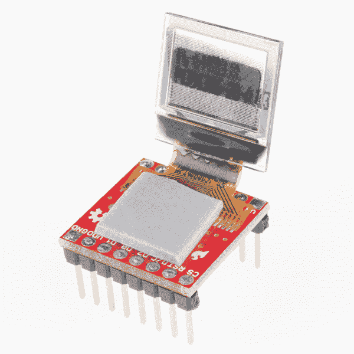](https://cdn.sparkfun.com/assets/learn_tutorials/3/0/8/Micro_LED_Tutorial-05.jpg)

折叠显示屏，它应该完全符合 PCB 的轮廓。

[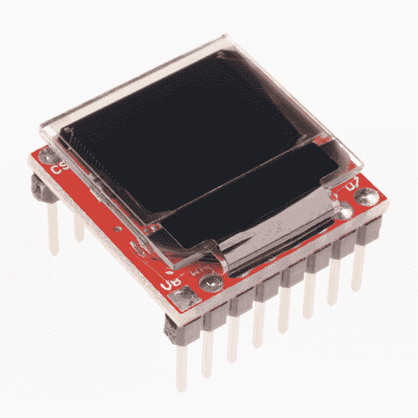](https://cdn.sparkfun.com/assets/learn_tutorials/3/0/8/Micro_LED_Tutorial-07.jpg)

### [设置 I ² C 模式](#i2c_mode)的跳线

如果您通过 I ² C 控制显示器，您需要对跳线进行一些修改:

1.  **短 D1/D2** -这将把数据输出线和数据输入线合二为一。
2.  **将 BS1 设置为 1**-BS1 跳线默认为 0，这完成了将其设置为 SPI 的一半工作。要将显示设置为 I ² C，你需要将跳线切换到 1。还要确保 BS2 跳线保持设置为 0。
3.  **设置 D/C** -在 I ² C 模式下，D/C 引脚配置显示器的 7 位地址。您可以将它设置为 0 或 1，只要在阅读本教程的代码部分时记住这个值即可。

一旦你设置好跳线，板子的背面应该看起来有点像这样:

[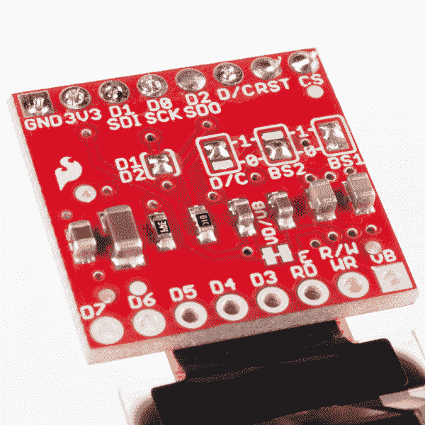](https://cdn.sparkfun.com/assets/learn_tutorials/3/0/8/Micro_LED_Tutorial-06.jpg)*Breakout jumpers set for I²C mode.*

## 硬件连接

既然你的插座已经焊接和组装好了，是时候给它装上电线了。在本节中，我们将根据您是喜欢使用 SPI 还是 I ² C 来控制显示器，来看一下连接示例。

如果您不确定使用哪个接口，我们建议使用 SPI，它将为您提供最快的传输速率和屏幕刷新速度。

### 通过 SPI 的 Arduino Pro 3.3V

为了实现最快的数据传输速度，我们将使用 Arduino 的*硬件* SPI 引脚。这意味着我们需要使用引脚 13、11 和 10 作为 SCLK、MOSI 和 CS 引脚。其他管脚——RST 和 D/C——可以连接到 Arduino 上任何可用的数字管脚。

以下是连接示例:

[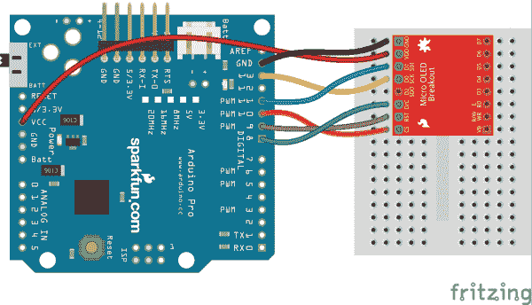](https://cdn.sparkfun.com/assets/learn_tutorials/3/0/8/spi_hookup_bb_01.png)

确保您的显示器的电源是 3.3V 而不是 5V！

### Arduino Pro 3.3V，通过使用 I ² C

I ² C 的好处是引脚数更少——除了电源和地线，这种连接只需要三根线——但你确实会为更少的线牺牲一些速度。

在这种情况下，SDA 和 SCL 必须分别连接到 Arduino Pro 的 A4 和 A5 引脚。RST 可以连接到任何其他数字引脚，我们用的是 9。

[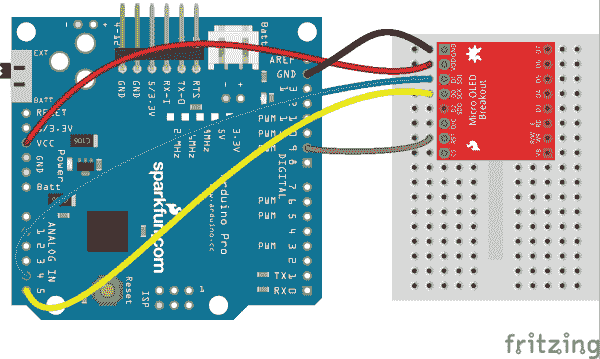](https://cdn.sparkfun.com/assets/learn_tutorials/3/0/8/i2c_hookup_bb_1.png)

虽然 I ² C 为您提供了一些额外的可用引脚，但它比 SPI 慢得多。如果你不需要很快的帧率，I ² C 是一个很好的选择。

## Arduino 库下载、安装和测试

焊接？检查。布线？检查。到固件上。让显示器闪烁吧！

### 下载并安装 Arduino 库

为了尽可能容易地控制有机发光二极管，我们为它改编了一个 Arduino 库。使用这个库，你可以画任何东西，从像素到形状，甚至是文本。要下载这个库，点击下面的按钮，或者从我们的 [GitHub 库](https://github.com/sparkfun/SparkFun_Micro_OLED_Arduino_Library)获取最新版本。

[Download the Arduino Library (ZIP)!](https://github.com/sparkfun/SparkFun_Micro_OLED_Arduino_Library/archive/main.zip)

然后在你的 Arduino sketchbook 里安装这个库。如果您需要任何安装库的指导，请查看我们的[安装 Arduino 库教程](https://learn.sparkfun.com/tutorials/installing-an-arduino-library)。

### 加载演示示例

接下来，加载库中包含的演示示例。安装完库后，打开 Arduino。然后导航到**文件** > **实例**>**SFE _ micro OLED**>**micro OLED _ Demo**。

[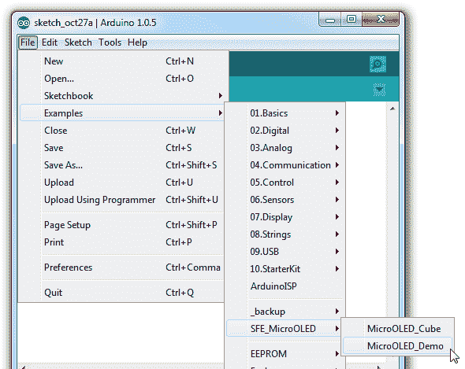](https://cdn.sparkfun.com/assets/learn_tutorials/3/0/8/open_example.png)

确保你的**板**和**串口**设置正确并上传！

[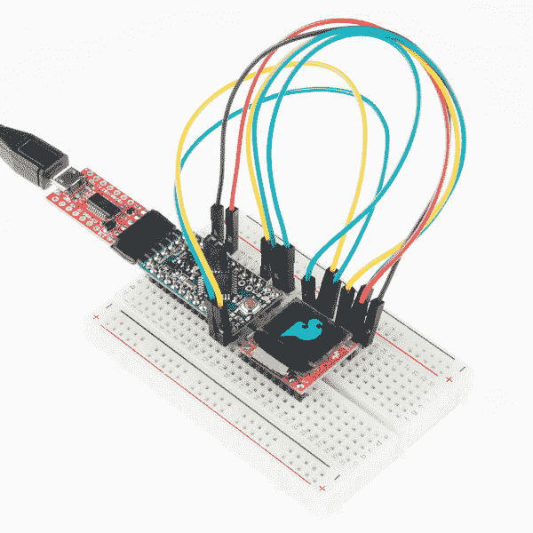](https://cdn.sparkfun.com/assets/learn_tutorials/3/0/8/Micro_LED_Tutorial-01.jpg)

这个演示例子将展示有机发光二极管的很多功能。要获得更多乐趣，请查看该库中包含的其他示例。

## 使用 Arduino 库

既然您已经加载了示例，并且验证了您的显示和连接，那么是时候开始编写您自己的应用程序了！在你开始之前，这里有一个 SFE 微 OLED 库的快速纲要。

### 包括、初始化和开始

当然，在代码的顶部，你需要**包含*SFE _ 微 OLED* 库**。除此之外，你还需要包含 *SPI* 和 *Wire* 库，这样*SFE _ 微 OLED* 库就可以访问这些接口。

```
language:c
#include <SPI.h>
#include <Wire.h>
#include <SFE_MicroOLED.h> 
```

在包含了库之后，您可以在代码的全局变量区域创建一个*微 OLED* 对象。在这里你将告诉库你是使用 SPI 还是 I ² C，以及哪个管脚正在驱动显示。

```
language:c
#define PIN_RESET 9  // Connect RST to pin 9 (req. for SPI and I2C)
#define PIN_DC    8  // Connect DC to pin 8 (required for SPI)
#define PIN_CS    10 // Connect CS to pin 10 (required for SPI)
//#define DC_JUMPER 0 // Set to either 0 (default) or 1 based on jumper, matching the value of the DC Jumper
// Also connect pin 13 to SCK and pin 11 to MOSI

// Declare a MicroOLED object. The parameters include:
// 1 - Reset pin: Any digital pin
// 2 - D/C pin: Any digital pin (SPI mode only)
// 3 - CS pin: Any digital pin (SPI mode only, 10 recommended)
MicroOLED oled(PIN_RESET, PIN_DC, PIN_CS); //Example SPI declaration, comment out if using I2C
//MicroOLED oled(PIN_RESET, DC_JUMPER); //Example I2C declaration, uncomment if using I2C 
```

如果您使用 SPI 与显示器对话，请定义三个参数来告诉库您分别将 RST、D/C 和 CS 连接到了哪些引脚。

在上面的例子中，我们称我们的微 OLED 物体为`oled`，但是你可以称它为任何你喜欢的东西。如果有更多显示器连接到 Arduino，您甚至可以创建多个显示器。

有机发光二极管设置的最后一步应该出现在`setup()`功能中。在那里贴一个`oled.begin()`函数，它会初始化显示并为你更新各种幕后设置。

```
language:c
setup()
{
    delay(100);
    //Wire.begin(); //set up I2C bus, uncomment if you are using I2C
    // Before you can start using the OLED, call begin() to init
    // all of the pins and configure the OLED.
    oled.begin();
} 
```

**Note:** If you're using I²C, you'll need two parameters: the reset pin and the value of the D/C jumper (0 or 1). Make sure to adjust `DC_JUMPER` to the either `0` or `1` [based on the jumper](https://learn.sparkfun.com/tutorials/micro-oled-breakout-hookup-guide#i2c_mode).

```
#define DC_JUMPER 0 // Set to either 0 (default) or 1 based on jumper, matching the value of the DC Jumper
```

If you are using the Micro OLED with I²C, make sure declare the object:

```
//MicroOLED oled(PIN_RESET, PIN_DC, PIN_CS); //Example SPI declaration, comment out if using I2C
MicroOLED oled(PIN_RESET, DC_JUMPER); //Example I2C declaration, uncomment if using I2C
```

You will also need to initialize the bus in the `setup()`:

```
delay(100);
Wire.begin(); //set up I2C bus, uncomment if you are using I2C
```

### 绘制像素并显示

让我们先画一个最简单的形状——一个像素。画*任何东西*至少需要两步。首先你要告诉屏幕你想画什么，然后你要告诉它画什么。

要绘制一个像素，首先调用`pixel(int x, int y)`函数。

```
language:c
// Draw a pixel in the middle of the screen
oled.pixel(LCDWIDTH/2, LCDHEIGHT/2); // Add a pixel to the display buffer. 
```

然后，在你告诉屏幕要画什么之后，使用`display()`函数来执行。

```
language:c
oled.display(); // Draw whatever is in the display buffer. 
```

`display()`函数重新绘制整个屏幕——全部 3072 像素。执行命令需要相对较长的时间，所以尽量不要做太多。

### 线条，矩形，圆形，天啊！

现在我们知道了如何画像素，画各种形状就很容易了。

要画一条线，你需要两组 x/y 坐标，这条线将画在它们之间。这里有一个例子:

```
language:c
int x0 = 7; int y0 = 7;   // (x0,y0) = (7, 7)
int x1 = 42; int y1 = 24; // (x1,y1) = (42, 24)
oled.line(x0, y0, x1, y1);  // Draw a line from (x0,y0) to (x1,y1);
oled.display(); // Draw to the screen 
```

如果你想画一个长方形，事情就有点不同了。在这个例子中，你给它一个 x/y 坐标，然后是宽度和高度。

```
language:c
int x0 = 7; int y0 = 5;
int width = 24;
int height = 13;
oled.rect(x0, y0, width, height);  // Draw a rectange from (7,5) to (31,18)
oled.display(); // Draw to the screen 
```

将从(x0，y0)到(x0+宽度，y0+高度)绘制矩形。

想用*填充*那个长方形吗？请改用`rectFill`功能！

```
language:c
oled.rectFill(7, 5, 35, 5); // Fill a rectangle from (7, 5) to (42, 10)
oled.display(); // Draw to the screen 
```

圆需要一组圆心坐标，然后是半径。

```
language:c
int radius = 13;
// Draw a 13-pixel radius (26-pixel diameter) 
// circle centered in the middle of the display:
oled.circle(LCDWIDTH/2, LCDHEIGHT/2, radius); 
```

与矩形函数一样，您也可以用`circleFill`填充圆:

```
language:c
oled.circleFill(42, 20, 7); // Fill a circle, 7 radius, centered at (42, 20)
oled.display(); // Draw to the screen 
```

### 绘图文本

除了基本的形状，你还可以用 SFE 微 OLED 库来绘制文本。不过，在你开始发短信之前，有一些设置需要调整。首先用`setFontType(type)`设置**字体类型**。该函数中的参数可以是 0、1、2 或 3，每一个大小都逐渐变大。

```
language:c
oled.setFontType(0);  // Set the text to small (10 columns, 6 rows worth of characters).
oled.setFontType(1);  // Set the text to medium (6 columns, 3 rows worth of characters).
oled.setFontType(2);  // Set the text to medium/7-segment (5 columns, 3 rows worth of characters).
oled.setFontType(3);  // Set the text to large (5 columns, 1 row worth of characters). 
```

以下是对四种字体类型的快速概述:

| 字体类型 | 最大列数 | 最大行数 | 描述 |
| Zero | Ten | six | 最小的 5x7 像素字符。 |
| one | six | three | 中等，8x16 像素字符。 |
| Two | five | three | 7 段显示样式字符，每段 10x16 像素。 |
| three | five | one | 大，12x48(整个屏幕高度)字符。 |

接下来，设置字体类型后，用`setCursor(x, y)`定义你的**文本光标**。这将定义你打印的第一个字符左上角的**。**

```
language:c
oled.setCursor(0, 0);  // Set the text cursor to the upper-left of the screen. 
```

最后，你可以使用`print(String/int/float)`命令来打印你想要的任何东西。

```
language:c
oled.print("Hello, world"); // Print a const string
oled.print(analogRead(0));  // Print an integer
oled.print(42.07);  // Print a float
oled.display(); // Draw to the screen 
```

* * *

这涵盖了该库的基础知识，但它还可以做更多。查看该库的自述文件，以获得对 MicroOLED 类的完整概述。在那里你会发现更多的功能，像`invert(boolean)``flipVertical(boolean)``flipHorizontal(boolean)`和`scrollRight(start, stop)`。

## 资源和更进一步

这里有几个有用的链接，可能有助于回答您关于微型有机发光二极管突破的任何问题:

*   [微型有机发光二极管分线示意图](https://cdn.sparkfun.com/datasheets/LCD/Monochrome/Micro-OLED-Breakout.pdf)
*   [微有机发光二极管突围鹰档案](https://cdn.sparkfun.com/datasheets/LCD/Monochrome/Micro-OLED-Breakout.zip)
*   [微有机发光二极管 GitHub 库](https://github.com/sparkfun/Micro_OLED_Breakout)
*   [SSD1306 控制器数据表](https://cdn.sparkfun.com/assets/learn_tutorials/3/0/8/SSD1306.pdf)

### 更进一步

现在你已经精通了微有机发光二极管突破和它的 Arduino 库，你打算用它做什么呢？需要一些灵感，查看这些相关教程和项目:

[](https://learn.sparkfun.com/tutorials/serial-graphic-lcd-hookup) [### 串行图形 LCD 连接](https://learn.sparkfun.com/tutorials/serial-graphic-lcd-hookup) Learn how to use the Serial Graphic LCD.[Favorited Favorite](# "Add to favorites") 11[](https://learn.sparkfun.com/tutorials/rgb-panel-hookup-guide) [### RGB 面板连接指南](https://learn.sparkfun.com/tutorials/rgb-panel-hookup-guide) Make bright, colorful displays using the 32x16, 32x32, and 32x64 RGB LED matrix panels. This hookup guide shows how to hook up these panels and control them with an Arduino.[Favorited Favorite](# "Add to favorites") 11[](https://learn.sparkfun.com/tutorials/reaction-timer) [### 反应速度测量器](https://learn.sparkfun.com/tutorials/reaction-timer) Demonstrate mental chronometry with this simple reaction timer 11[](https://www.sparkfun.com/news/2484 "September 21, 2017: This week Alex designs an OLED clock using the ESP32 Thing.") [### 英语日:有机发光二极管钟

September 21, 2017](https://www.sparkfun.com/news/2484 "September 21, 2017: This week Alex designs an OLED clock using the ESP32 Thing.")[Favorited Favorite](# "Add to favorites") 9**************