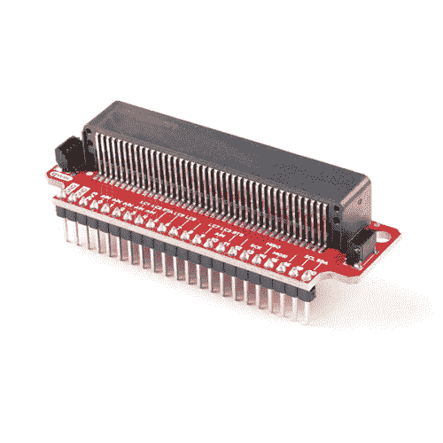

# 微型:bit 分线板连接指南

> 原文：<https://learn.sparkfun.com/tutorials/microbit-breakout-board-hookup-guide>

## 介绍

考虑到它包括板载温度传感器、加速度计、指南针、LED 阵列、蓝牙无线电等，这款 [micro:bit](https://www.sparkfun.com/products/14208) 本身就提供了大量的可能性和潜在项目。然而，当您准备扩展这些初始功能时，如连接到 SD 卡进行日志记录，或利用我们众多 Qwiic 板中的一个，您将需要断开 micro:bit 的卡边缘连接器上的一些引脚。为此，我们为您提供了微型分线板。

 

将**添加到您的[购物车](https://www.sparkfun.com/cart)中！**

### 

[In stock](https://learn.sparkfun.com/static/bubbles/ "in stock") BOB-16446

spark fun Qwiic micro:bit Breakout with Headers 是一个连接到 BBC micro:bit 并扩展其功能的板…

$6.252[Favorited Favorite](# "Add to favorites") 2[Wish List](# "Add to wish list")** **如果你想自己焊接或者用电线代替，还有一个没有接头的版本。

### 所需材料

要学习本项目教程，您需要以下材料:**