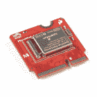

# 微模压所有引脚(ATP)载板

> 原文：<https://learn.sparkfun.com/tutorials/micromod-all-the-pins-atp-carrier-board>

## 介绍

用 [MicroMod ATP 载板](https://www.sparkfun.com/products/16885)接入 MicroMod 处理器板的所有引脚(即 ATP)！

[](https://www.sparkfun.com/products/16885) 

将**添加到您的[购物车](https://www.sparkfun.com/cart)中！**

### [SparkFun MicroMod ATP 载板](https://www.sparkfun.com/products/16885)

[In stock](https://learn.sparkfun.com/static/bubbles/ "in stock") DEV-16885

如果您需要“大量”带有简单 to 编程、准备上市模块的 GPIO，ATP 是您需要的解决方案。

$19.951[Favorited Favorite](# "Add to favorites") 13[Wish List](# "Add to wish list")** **[https://www.youtube.com/embed/4QUJWeSrzD0/?autohide=1&border=0&wmode=opaque&enablejsapi=1](https://www.youtube.com/embed/4QUJWeSrzD0/?autohide=1&border=0&wmode=opaque&enablejsapi=1)

### 所需材料

要跟随本教程，您将需要以下材料。你可能不需要所有的东西，这取决于你拥有什么。将它添加到您的购物车，通读指南，并根据需要调整购物车。

### MicroMod 处理器板

你需要一个带 ATP 载板的处理器板。

[](https://www.sparkfun.com/products/16791) 

将**添加到您的[购物车](https://www.sparkfun.com/cart)中！**

### [SparkFun MicroMod SAMD51 处理器](https://www.sparkfun.com/products/16791)

[Out of stock](https://learn.sparkfun.com/static/bubbles/ "out of stock") DEV-16791

SparkFun MicroMod SAMD51 处理器板采用 32 位 ARM Cortex-M4F MCU，是一款功能强大的微控制器，封装在一个

$18.951[Favorited Favorite](# "Add to favorites") 8[Wish List](# "Add to wish list")****[](https://www.sparkfun.com/products/16781) 

将**添加到您的[购物车](https://www.sparkfun.com/cart)中！**

### [SparkFun MicroMod ESP32 处理器](https://www.sparkfun.com/products/16781)

[In stock](https://learn.sparkfun.com/static/bubbles/ "in stock") WRL-16781

该板将 Espressif 的 ESP32 与我们的 M.2 连接器接口相结合，为我们的 Micro…

$16.951[Favorited Favorite](# "Add to favorites") 6[Wish List](# "Add to wish list")****[](https://www.sparkfun.com/products/16401) 

将**添加到您的[购物车](https://www.sparkfun.com/cart)中！**

### [SparkFun MicroMod Artemis 处理器](https://www.sparkfun.com/products/16401)

[24 available](https://learn.sparkfun.com/static/bubbles/ "24 available") DEV-16401

该处理器具有 Artemis 模块，能够进行机器学习、蓝牙、I2C、GPIO、PWM、SPI，并打包以适应…

$14.95[Favorited Favorite](# "Add to favorites") 14[Wish List](# "Add to wish list")****** ******### 配件

至少，您需要一根 USB C 电缆来给电路板供电和编程。根据您的应用，您可能需要一根 qw IC 电缆来连接支持 qw IC 的设备。

[](https://www.sparkfun.com/products/15081) 

将**添加到您的[购物车](https://www.sparkfun.com/cart)中！**

### [SparkFun Qwiic 线缆套件](https://www.sparkfun.com/products/15081)

[In stock](https://learn.sparkfun.com/static/bubbles/ "in stock") KIT-15081

为了更容易上手，我们用 50 毫米到 500 毫米的各种 Qwiic 电缆组装了 Qwiic 电缆套件…

$8.9516[Favorited Favorite](# "Add to favorites") 58[Wish List](# "Add to wish list")****[](https://www.sparkfun.com/products/14743) 

将**添加到您的[购物车](https://www.sparkfun.com/cart)中！**

### [USB 3.1 线 A 到 C - 3 脚](https://www.sparkfun.com/products/14743)

[In stock](https://learn.sparkfun.com/static/bubbles/ "in stock") CAB-14743

USB C 棒极了。但是，在我们将所有的集线器、充电器和端口转换为 USB C 之前，这是您要使用的电缆…

$5.504[Favorited Favorite](# "Add to favorites") 9[Wish List](# "Add to wish list")**** ****### 工具

你需要一个螺丝刀来拧紧处理器板和载板之间的螺丝。

[](https://www.sparkfun.com/products/9146) 

将**添加到您的[购物车](https://www.sparkfun.com/cart)中！**

### [SparkFun 迷你螺丝刀](https://www.sparkfun.com/products/9146)

[In stock](https://learn.sparkfun.com/static/bubbles/ "in stock") TOL-09146

这只是你的基本可逆螺丝刀口袋大小！有平头和十字头可供选择。配有别针和…

$1.053[Favorited Favorite](# "Add to favorites") 11[Wish List](# "Add to wish list")** **#### 原型配件

根据您的设置，您可以使用跳线和试验板。然而，如果你决定将和[焊接](https://learn.sparkfun.com/tutorials/how-to-solder-through-hole-soldering)导线直接焊接到电镀通孔上以实现安全连接，你将需要[剥离](https://learn.sparkfun.com/tutorials/working-with-wire)和导线。

[](https://www.sparkfun.com/products/12002) 

将**添加到您的[购物车](https://www.sparkfun.com/cart)中！**

### [【试验板-不干胶(白色)](https://www.sparkfun.com/products/12002)

[In stock](https://learn.sparkfun.com/static/bubbles/ "in stock") PRT-12002

这是你的尝试和真正的白色无焊试验板。它有 2 条电源总线，10 列，30 行，总共 400 个连接…

$5.5048[Favorited Favorite](# "Add to favorites") 93[Wish List](# "Add to wish list")****[](https://www.sparkfun.com/products/11367) 

将**添加到您的[购物车](https://www.sparkfun.com/cart)中！**

### [](https://www.sparkfun.com/products/11367)

[In stock](https://learn.sparkfun.com/static/bubbles/ "in stock") PRT-11367

各种颜色的电线:你知道这是一个美丽的东西。六种不同颜色的硬纸板实芯焊丝…

$21.5037[Favorited Favorite](# "Add to favorites") 86[Wish List](# "Add to wish list")****[](https://www.sparkfun.com/products/8431) 

将**添加到您的[购物车](https://www.sparkfun.com/cart)中！**

### [跳线高级 6 "米/米装 10 根](https://www.sparkfun.com/products/8431)

[In stock](https://learn.sparkfun.com/static/bubbles/ "in stock") PRT-08431

这是一个 SparkFun 独家！这些是 155 毫米长、26 AWG 跳线，两端都有公接头。用这些来跳离…

$4.502[Favorited Favorite](# "Add to favorites") 11[Wish List](# "Add to wish list")****** ******对于那些想利用 Qwiic 功能设备的人来说，你需要一根 Qwiic 电缆。

[](https://www.sparkfun.com/products/15081) 

将**添加到您的[购物车](https://www.sparkfun.com/cart)中！**

### [SparkFun Qwiic 线缆套件](https://www.sparkfun.com/products/15081)

[In stock](https://learn.sparkfun.com/static/bubbles/ "in stock") KIT-15081

为了更容易上手，我们用 50 毫米到 500 毫米的各种 Qwiic 电缆组装了 Qwiic 电缆套件…

$8.9516[Favorited Favorite](# "Add to favorites") 58[Wish List](# "Add to wish list")****[](https://www.sparkfun.com/products/14427) 

将**添加到您的[购物车](https://www.sparkfun.com/cart)中！**

### [Qwiic 线缆- 100mm](https://www.sparkfun.com/products/14427)

[In stock](https://learn.sparkfun.com/static/bubbles/ "in stock") PRT-14427

这是一条 100 毫米长的 4 芯电缆，带有 1 毫米 JST 端接。它旨在将支持 Qwiic 的组件连接在一起…

$1.50[Favorited Favorite](# "Add to favorites") 32[Wish List](# "Add to wish list")****[](https://www.sparkfun.com/products/14429) 

将**添加到您的[购物车](https://www.sparkfun.com/cart)中！**

### [Qwiic 线缆- 500mm](https://www.sparkfun.com/products/14429)

[In stock](https://learn.sparkfun.com/static/bubbles/ "in stock") PRT-14429

这是一根 500mm 长的 4 芯电缆，带有 1mm JST 端接。它旨在将支持 Qwiic 的组件连接在一起…

$1.951[Favorited Favorite](# "Add to favorites") 25[Wish List](# "Add to wish list")****[](https://www.sparkfun.com/products/14425) 

将**添加到您的[购物车](https://www.sparkfun.com/cart)中！**

### [Qwiic 电缆-试验板跳线(4 针)](https://www.sparkfun.com/products/14425)

[In stock](https://learn.sparkfun.com/static/bubbles/ "in stock") PRT-14425

这是一根跳线适配器电缆，一端带有一个 Qwiic JST 母接头，另一端带有一个试验板连接…

$1.50[Favorited Favorite](# "Add to favorites") 34[Wish List](# "Add to wish list")******** ********### 推荐阅读

如果你不熟悉 MicroMod 生态系统，我们推荐你阅读这里的[来了解](https://www.sparkfun.com/micromod)的概况。如果你决定利用 Qwiic 连接器，我们推荐阅读[这里的概述](https://www.sparkfun.com/qwiic)。

| [](https://www.sparkfun.com/micromod) | [](https://www.sparkfun.com/qwiic) |
| *[微模式生态系统](https://www.sparkfun.com/micromod)* | *[Qwiic 连接系统](https://www.sparkfun.com/qwiic)* |

如果您不熟悉以下概念，我们也建议您在继续之前先查阅一些教程。

[](https://learn.sparkfun.com/tutorials/serial-communication) [### 串行通信](https://learn.sparkfun.com/tutorials/serial-communication) Asynchronous serial communication concepts: packets, signal levels, baud rates, UARTs and more 100[](https://learn.sparkfun.com/tutorials/serial-peripheral-interface-spi) [### 串行外设接口(SPI)](https://learn.sparkfun.com/tutorials/serial-peripheral-interface-spi) SPI is commonly used to connect microcontrollers to peripherals such as sensors, shift registers, and SD cards.[Favorited Favorite](# "Add to favorites") 91[](https://learn.sparkfun.com/tutorials/installing-arduino-ide) [### 安装 Arduino IDE](https://learn.sparkfun.com/tutorials/installing-arduino-ide) A step-by-step guide to installing and testing the Arduino software on Windows, Mac, and Linux.[Favorited Favorite](# "Add to favorites") 16[](https://learn.sparkfun.com/tutorials/logic-levels) [### 逻辑电平](https://learn.sparkfun.com/tutorials/logic-levels) Learn the difference between 3.3V and 5V devices and logic levels.[Favorited Favorite](# "Add to favorites") 82[](https://learn.sparkfun.com/tutorials/i2c) [### I2C](https://learn.sparkfun.com/tutorials/i2c) An introduction to I2C, one of the main embedded communications protocols in use today.[Favorited Favorite](# "Add to favorites") 128[](https://learn.sparkfun.com/tutorials/getting-started-with-micromod) [### MicroMod 入门](https://learn.sparkfun.com/tutorials/getting-started-with-micromod) Dive into the world of MicroMod - a compact interface to connect a microcontroller to various peripherals via the M.2 Connector 3

## 硬件概述

### MicroMod 处理器板

MicroMod ATP 载板包括用于 MicroMod 处理器板的位置。这里是您选择的处理器板的位置。

[](https://cdn.sparkfun.com/assets/learn_tutorials/1/2/1/1/16885-SparkFun_MicroMod_ATP_Carrier_Board_M_Dot_2.jpg)

### 力量

有多种电源相关网络连接到母接头引脚及其相应的通孔焊盘。下图突出显示了这些母接头和衬垫。该板可以由 VIN 引脚供电，推荐电压在 **3.3V 至 6.0V** 之间。它也可以由 USB C 连接器提供 5V 电源。AP7361C 电压调节器将电压下调至 **3.3V** ，为您的设备提供高达 1A 的电流。如果你的电压是干净的，并且经过调节，你也可以把它直接连接到 3.3V 的线路上。

[](https://cdn.sparkfun.com/assets/learn_tutorials/1/2/1/1/16885-SparkFun_MicroMod_ATP_Carrier_Board_Power_Rails.jpg)

#### 备用电池

该板有一个内置的备用电池，用于带 RTC 的处理器板。根据处理器的不同，可能无法连接

[](https://cdn.sparkfun.com/assets/learn_tutorials/1/2/1/1/16885-SparkFun_MicroMod_ATP_Carrier_Board_Backup_Battery.jpg)

### USB 端口

您可以选择使用 USB 连接器将板连接到计算机。[USB C 型连接器](https://learn.sparkfun.com/tutorials/connector-basics#usb-connectors)用于给处理器板供电、编程或向串行终端传送串行数据。如果您的处理器板有专用于 USB 主机的针脚，则可以通过母 USB A 型连接器选择 USB 主机。USB 主机的 5V 引脚上有一个肖特基二极管，以防止 USB 主机设备和 USB-C 连接器产生电压冲突。如有必要，您可以在 VHOST 引脚和 VIN 引脚之间添加一条导线，绕过二极管为 USB 主机设备供电。

[](https://cdn.sparkfun.com/assets/learn_tutorials/1/2/1/1/16885-SparkFun_MicroMod_ATP_Carrier_Board_USB.jpg)**Heads up!** The SAMD51's USB host pins are broken out on the same pins as the USB pins for programming. You will need an adapter or a [second USB Type A connector](https://www.sparkfun.com/products/12700) if you decide to use USB host.

### 所有[GPIO]引脚

还记得我们的“所有的大头针！”外号？嗯，我们是认真的。在 MicroMod ATP 上，我们使用[通用 MicroMod 硬件引脚 1.0 版](https://learn.sparkfun.com/tutorials/getting-started-with-micromod#hardware_pinout)将所有主要引脚从 M.2 连接器连接到母接头。我们还在它们旁边增加了一个电镀通孔辅助导轨，让您可以选择即插即用或直接焊接到电路板上。根据您使用的处理器主板，您的里程数可能会有所不同。

[](https://cdn.sparkfun.com/assets/learn_tutorials/1/2/1/1/16885-SparkFun_MicroMod_ATP_Carrier_Board_All_the_Pins_Broken_Out.jpg)

### Qwiic 和 I ² C

板上有两个位置可以放置您最喜欢的 Qwiic 设备。除了 Qwiic 连接器，我们还有引脚，如果您需要使用跳线或焊线连接两个电路板，这些引脚可以断开。如果你仔细观察标有 **I2C** 的端口，有一个专用的 I ² C [中断](https://learn.sparkfun.com/tutorials/processor-interrupts-with-arduino/all)引脚可用。

[](https://cdn.sparkfun.com/assets/learn_tutorials/1/2/1/1/16885-SparkFun_MicroMod_ATP_Carrier_Board_Qwiic_I2C_Ports.jpg)

有安装孔可连接每个标准 1.0 英寸 x1.0 英寸 Qwiic 设备。

[](https://cdn.sparkfun.com/assets/learn_tutorials/1/2/1/1/MicroMod_ATP_Carrier_Board_Qwiic_Mounting_Holes.jpg)

### 重置和启动按钮

重置按钮将重置处理器。启动按钮将使处理器进入特殊的启动模式。根据处理器板的不同，此启动引脚可能无法连接。

[](https://cdn.sparkfun.com/assets/learn_tutorials/1/2/1/1/16885-SparkFun_MicroMod_ATP_Carrier_Board_Reset_Boot.jpg)

### SWD 编程引脚

对于高级用户，我们提供了 SWD 编程引脚。请注意，这不是填充，所以你需要一个[兼容的头和兼容的 JTAG 编程器](https://www.sparkfun.com/categories/tags/jtag)来连接。

[](https://cdn.sparkfun.com/assets/learn_tutorials/1/2/1/1/16885-SparkFun_MicroMod_ATP_Carrier_Board_SWD_Programming_Pins.jpg)

### 发光二极管

板上有两个 led。

*   **VIN** -只要 VIN 引脚上有电压，VIN LED 就会亮起。这可能来自 USB C 连接器或电路板边缘的 VIN 引脚。
*   **3V3** -只要 3.3V 引脚上有电压，3V3 LED 就会亮起。这可能来自 3.3V 电压调节器的输出或位于电路板边缘的任何 3.3V 网络。

[](https://cdn.sparkfun.com/assets/learn_tutorials/1/2/1/1/16885-SparkFun_MicroMod_ATP_Carrier_LEDs.jpg)

### 跳线垫

**Note:** If this is your first time working with jumpers, check out the [How to Work with Jumper Pads and PCB Traces](https://learn.sparkfun.com/tutorials/how-to-work-with-jumper-pads-and-pcb-traces/all) tutorial for more information.

板上有几个跳线:

*   **旁路(BYP)** -默认情况下，BYP 是打开的。如果您决定从您的 USB 源获取更多的 2A，添加一个焊接跳线可以绕过电路板背面的 2A 自复位保险丝。如果您决定绕过跳线，请谨慎操作。
*   **使能(EN)** -默认情况下，EN 跳线保持打开。该跳线连接到处理器板的 GPIO 引脚。处理器板可以控制 ATP 的电压调节器。根据处理器的不同，可能无法连接。
*   **电流测量(MEAS)** -默认情况下，MEAS 关闭。切断跳线并焊接到 PTH 焊盘上，可以插入电流表，精确监控应用消耗的电流。
*   **3V3 LED** -默认情况下，3V3 LED 关闭。当电压为 3.3V 时，切断此跳线将禁用 LED。
*   **VIN LED** -默认情况下，VIN LED 关闭。只要有输入电压，切断此跳线将禁用 LED。

| [](https://cdn.sparkfun.com/assets/learn_tutorials/1/2/1/1/16885-SparkFun_MicroMod_ATP_Carrier_Board_Jumpers_Front.jpg) | [](https://cdn.sparkfun.com/assets/learn_tutorials/1/2/1/1/16885-SparkFun_MicroMod_ATP_Carrier_Board_Jumpers_Back.jpg) |
| *顶部的跳线* | *背面跳线* |

### 通用微型模块引脚排列

想知道 ATP MicroMod ATP 载板上断开的引脚是什么？查看【MicroMod 入门中的表格了解更多信息。记得检查处理器板上的针脚，以确定哪些针脚可用。

*   [微模块通用引脚表](#MMGen)
*   [MicroMod 通用引脚描述](#MMDescript)

| **音频** | **UART** | **GPIO/总线** | **I ² C** | **SDIO** 的缩写形式 | **SPI0** | **专用** |

| 功能 | 底部
销 | 顶部
销 | 功能 |
|  |  |  | (未连接) |  | **75** | GND |  |  |  |
|  |  |  | 3.3V | **74** | **73** | G5 /总线 5 |  |  |  |
|  |  |  | RTC _ 3V _ 电池 | **72** | **71** | G6 /总线 6 |  |  |  |
|  |  | SPI_CS1# | SDIO _ 数据 3(输入输出) | **70** | **69** | G7 /总线 7 |  |  |  |
|  |  |  | SDIO _ 数据 2(输入输出) | **68** | **67** | 八国集团(Group of Eight) |  |  |  |
|  |  |  | SDIO _ 数据 1(输入输出) | **66** | **65** | G9 | ADC_D- | CAM_HSYNC |  |
|  |  | 睡吧 | SDIO _ 数据 0(输入输出) | **64** | **63** | G10 | ADC_D+ | CAM_VSYNC |  |
|  |  | SPI COPI1 | SDIO_CMD (I/O) | **62** | **61** | 睡吧 |  |  |  |
|  |  | SPI SCK1 | SDIO_SCK(或) | **60** | **59** | SPI_COPI (O) | LED_DAT |  |  |
|  |  |  | AUD_MCLK (O) | **58** | **57** | SPI_SCK(或) | LED |  |  |
| 凯姆 | PCM_OUT | I2S 出局 | AUD_OUT | **56** | **55** | SPI_CS# |  |  |  |
| cam _ pclk | PCM_IN | I2S 因 | 澳元 _ 美元 | **54** | **53** | I2C_SCL1(输入/输出) |  |  |  |
| PDM_DATA | PCM_SYNC | i2s WS | AUD_LRCLK | **52** | **51** | I2C_SDA1(输入输出) |  |  |  |
| PDM_CLK | PCM_CLK | SCK i2s | 奥德 _BCLK | **50** | **49** | BATT_VIN / 3 (I - ADC) (0 至 3.3V) |  |  |  |
|  |  |  | G4 /总线 4 | **48** | **47** | PWM1 |  |  |  |
|  |  |  | G3 /总线 3 | **46** | **45** | GND |  |  |  |
|  |  |  | G2 /总线 2 | **44** | **43** | CAN_TX |  |  |  |
|  |  |  | G1 /巴士 1 | **42** | **41** | CAN_RX |  |  |  |
|  |  |  | G0 /总线 0 | **40** | **39** | GND |  |  |  |
|  |  |  | 一流的 | **38** | **37** | USBHOST_D- |  |  |  |
|  |  |  | GND | **36** | **35** | USBHOST_D+ |  |  |  |
|  |  |  | A0 | **34** | **33** | GND |  |  |  |
|  |  |  | PWM0 | **32** | **31** | 模块密钥 |  |  |  |
|  |  |  | 模块密钥 | **30** | **29** | 模块密钥 |  |  |  |
|  |  |  | 模块密钥 | **28** | **27** | 模块密钥 |  |  |  |
|  |  |  | 模块密钥 | **26** | **25** | 模块密钥 |  |  |  |
|  |  |  | 模块密钥 | **24** | **23** | SWDIO |  |  |  |
|  |  |  | UART_TX2 (O) | **22** | **21** | SWDCK |  |  |  |
|  |  |  | UART_RX2 (I) | **20** | **19** | UART_RX1 (I) |  |  |  |
|  |  | CAM_TRIG | D1 | **18** | **17** | UART_TX1 (0) |  |  |  |
|  |  |  | I2C INT # | **16** | **15** | UART_CTS1 (I) |  |  |  |
|  |  |  | S7-1200 可编程控制器 | **14** | **13** | UART_RTS1 (O) |  |  |  |
|  |  |  | I2C SDA(输入/输出) | **12** | **11** | 行李箱(I 型开式排放) |  |  |  |
|  |  |  | D0 | **10** | **9** | USB_VIN |  |  |  |
|  |  | 浅部白色甲癣 | G11 | **8** | **7** | GND |  |  |  |
|  |  |  | 复位# (I -开漏) | **6** | **5** | USB_D- |  |  |  |
|  |  |  | 3.3V_EN | **4** | **3** | USB_D+ |  |  |  |
|  |  |  | 3.3V | **2** | **1** | GND |  |  |  |

| 信号群 | 信号 | 输入－输出 | 描述 | 电压 |
| 力量 | 3.3V | 我 | 3.3V 电源 | 3.3V |
| GND |  | 返回电流路径 | 0V |
| USB_VIN | 我 | USB VIN 符合 USB 2.0 规范。连接到处理器板上要求 5V USB 功能的引脚 | 4.8-5.2V |
| RTC _ 3V _ 电池 | 我 | 3V 由外部纽扣电池或迷你电池提供。最大功耗=100μA，连接到引脚，在掉电期间保持 RTC。可以左 NC。 | 3V |
| 3.3V_EN | O | 控制载板的主电压调节器。1V 以上的电压将启用 3.3V 电源路径。 | 3.3V |
| BATT_VIN/3 | 我 | 载板原始电压超过 3。1/3 电阻分压器在载板上实现。根据需要放大整个 0-3.3V 范围的模拟信号 | 3.3V |
| 重置 | 重置 | 我 | 处理器的输入。处理器板上带上拉电阻的开漏。拉低复位处理器。 | 3.3V |
| 靴子 | 我 | 处理器的输入。处理器板上带上拉电阻的开漏。拉低使处理器进入特殊启动模式。可以左 NC。 | 3.3V |
| 通用串行总线 | USB_D | 输入－输出 | USB 数据。符合 USB 2.0 规范的差分串行数据接口。如果编程需要 UART，USB 必须连接到处理器板上的 USB 转串行转换 IC。 |  |
| USB 主机 | USBHOST_D | 输入－输出 | 对于支持 USB 主机模式的处理器。USB 数据。符合 USB 2.0 规范的差分串行数据接口。可以左 NC。 |  |
| 能 | CAN_RX | 我 | CAN 总线接收数据。 | 3.3V |
| CAN_TX | O | CAN 总线传输数据。 | 3.3V |
| 通用非同步收发传输器(Universal Asynchronous Receiver/Transmitter) | UART_RX1 | 我 | UART 接收数据。 | 3.3V |
| UART_TX1 | O | UART 发送数据。 | 3.3V |
| UART_RTS1 | O | UART 准备发送。 | 3.3V |
| UART_CTS1 | 我 | UART 清零发送。 | 3.3V |
| UART_RX2 | 我 | 第二个 UART 接收数据。 | 3.3V |
| UART_TX2 | O | 第二个 UART 发送数据。 | 3.3V |
| I2C | i2c _ scl | 输入－输出 | I ² C 时钟。载板上拉的开漏。 | 3.3V |
| I2C SDA | 输入－输出 | I ² C 数据。载板上有上拉电阻的开漏 | 3.3V |
| I2C INT # | 我 | 从载板到处理器的中断通知。载板上拉的开漏。低电平有效 | 3.3V |
| I2C_SCL1 号文件 | 输入－输出 | 2nd I ² C 时钟。载板上拉的开漏。 | 3.3V |
| I2C sda 1 | 输入－输出 | 2nd I ² C 数据。载板上拉的开漏。 | 3.3V |
| 精力 | SPI_COPI | O | SPI 控制器输出/外设输入。 | 3.3V |
| 睡吧，婊子 | 我 | SPI 控制器输入/外设输出。 | 3.3V |
| SPI | O | SPI 时钟。 | 3.3V |
| SPI_CS# | O | SPI 片选。低电平有效。如果不使用硬件 CS，可以路由到 GPIO。 | 3.3V |
| SPI/SDIO | SPI_SCK1/SDIO_CLK | O | 第二个 SPI 时钟。次要用途是 SDIO 钟。 | 3.3V |
| SPI_COPI1/SDIO_CMD | 输入－输出 | 第二 SPI 控制器输出/外设输入。次要用途是 SDIO 命令界面。 | 3.3V |
| spi _ 塞浦路斯 1/SDIO_DATA0 | 输入－输出 | 第二个 SPI 外设输入/控制器输出。次要用途是 SDIO 数据交换位 0。 | 3.3V |
| SDIO_DATA1 | 输入－输出 | SDIO 数据交换位 1。 | 3.3V |
| SDIO_DATA2 | 输入－输出 | SDIO 数据交换位 2。 | 3.3V |
| SPI _ CS1/SDIO _ 数据 3 | 输入－输出 | 第二个 SPI 芯片选择。次要用途是 SDIO 数据交换位 3。 | 3.3V |
| 声音的 | 奥地利马克 | O | 音频主时钟。 | 3.3V |
| AUD _ OUT/PCM _ OUT/i2s _ OUT/CAM _ MCLK | O | 音频数据输出。PCM 同步数据输出。I2S 串行数据输出。相机主时钟。 | 3.3V |
| 澳大利亚/PCM _ IN/i2s _ IN/卡姆 _PCLK | 我 | 音频数据输入。PCM 同步数据输入。I2S 串行数据输入。照相机外围时钟。 | 3.3V |
| AUD _ LRC lk/PCM _ SYNC/i2s _ WS/PDM _ DATA | 输入－输出 | 音频左/右时钟。PCM 同步数据同步。I2S 单词精选。PDM 数据。 | 3.3V |
| 澳大利亚 BCLK/CLK PCM/CLK i2s/CLK PDM | O | 音频位时钟。PCM 时钟。I2S 连续串行时钟。PDM 时钟。 | 3.3V |
| 社署 | SWDIO | 输入－输出 | 串行线调试 I/O。如果处理器板支持 SWD，则连接。可以左 NC。 | 3.3V |
| SWDCK | 我 | 串行线调试时钟。如果处理器板支持 SWD，则连接。可以左 NC。 | 3.3V |
| 物理输出核心 | A0 | 我 | 模数转换器 0。根据需要放大模拟信号，以实现完整的 0-3.3V 范围。 | 3.3V |
| 一流的 | 我 | 模数转换器 1。根据需要放大模拟信号，以实现完整的 0-3.3V 范围。 | 3.3V |
| 脉宽调制（pulse-width modulating 的缩写） | PWM0 | O | 脉宽调制输出 0。 | 3.3V |
| PWM1 | O | 脉宽调制输出 1。 | 3.3V |
| 数字的 | D0 | 输入－输出 | 通用数字输入/输出引脚。 | 3.3V |
| D1/CAM_TRIG | 输入－输出 | 通用数字输入/输出引脚。相机触发器。 | 3.3V |
| 常规/公共汽车 | G0/总线 0 | 输入－输出 | 通用引脚。任何未使用的处理器引脚都应分配给 Gx，具有 ADC + PWM 功能的引脚优先(0、1、2 等。)岗位。目的是保证各 ADC/PWM/数字引脚上的 PWM、ADC 和数字引脚功能。Gx 引脚不保证 ADC/PWM 功能。另一种用途是引脚可以支持快速读/写 8 位或 4 位宽总线。 | 3.3V |
| G1/巴士 1 | 输入－输出 | 3.3V |
| G2/总线 2 | 输入－输出 | 3.3V |
| G3/总线 3 | 输入－输出 | 3.3V |
| G4/总线 4 | 输入－输出 | 3.3V |
| G5/总线 5 | 输入－输出 | 3.3V |
| g6/总线 6 | 输入－输出 | 3.3V |
| G7/总线 7 | 输入－输出 | 3.3V |
| 八国集团(Group of Eight) | 输入－输出 | 通用引脚 | 3.3V |
| G9/ADC_D-/CAM_HSYNC | 输入－输出 | 差分 ADC 输入(如有)。相机水平同步。 | 3.3V |
| G10/ADC_D+/CAM_VSYNC | 输入－输出 | 差分 ADC 输入(如有)。相机垂直同步。 | 3.3V |
| G11/SWO | 输入－输出 | 通用引脚。串行线输出 | 3.3V |

### 电路板尺寸

板子是 3.30”x 2.20”。主板的每个角上有 4 个安装孔。SparkFun 徽标旁有 2 个额外的安装孔，用于支持 Qwiic 的设备。

[](https://cdn.sparkfun.com/assets/4/8/6/f/7/MicroMod_ATP_Carrier_Board_Dimensions.png)

## 硬件连接

如果您还没有，请务必查看【MicroMod 入门:硬件连接以获取有关将处理器板插入载板的信息。

[](https://learn.sparkfun.com/tutorials/getting-started-with-micromod) [### MicroMod 入门

#### 2020 年 10 月 21 日](https://learn.sparkfun.com/tutorials/getting-started-with-micromod) Dive into the world of MicroMod - a compact interface to connect a microcontroller to various peripherals via the M.2 Connector 3

至少，您的设置应该如下图所示。在这种情况下，我们将 MicroMod SAMD51 处理器板固定在 M.2 连接器中。为了给微控制器编程和供电，我们插入了 USB-C 电缆。

[](https://cdn.sparkfun.com/assets/learn_tutorials/1/2/1/1/MicroMod_ATP_SAMD51_Processor_Board.jpg)

根据您的设置，您可能需要硬件(跳线、电缆、插头、试验板等。)连接到电路板。在这种情况下，我们使用跳线连接到另一个板。

[](https://cdn.sparkfun.com/assets/learn_tutorials/1/2/1/1/MicroMod_ATP_SAMD51_Hardware_Serial_Out.jpg)

要 Qwiic-ly 连接 I ² C 设备，只需在 MicroMod ATP 的 Qwiic 端口和您的 Qwiic 设备之间插入一根 Qwiic 电缆。

[](https://cdn.sparkfun.com/assets/learn_tutorials/1/2/1/1/MicroMod_ATP_SAMD51_Qwiic_Device.jpg)

为了将电路板固定在一起，您可以添加[支架和螺钉](https://www.sparkfun.com/categories/257)来安装具有标准 1.0"x1.0 "尺寸电路板的支持 Qwiic 的设备。请记住，这将阻塞下面的一些接头引脚，因此请确保相应地进行规划。

[](https://cdn.sparkfun.com/assets/learn_tutorials/1/2/1/1/MicroMod_ATP_SAMD51_Qwiic_Mounted.jpg)

根据安装孔的位置，您可能需要制作一个适配器来牢固地固定支持 Qwiic 的设备。下面是一个安装孔在同一侧而不是对角线的例子。如下图所示，切下一块纸板。根据你的个人喜好，你也可以用激光切割、CNC 或 3D 打印机为那些需要更坚固材料的人制作更坚固的面板。

[](https://cdn.sparkfun.com/assets/learn_tutorials/1/2/1/1/MicroMod_ATP_SAMD51_Qwiic_Mounted_Cardboard_Adapter.jpg)

## Arduino 示例

**Note:** If this is your first time using Arduino IDE or board add-on, please review the following tutorials.

*   [安装 Arduino IDE](https://learn.sparkfun.com/tutorials/installing-arduino-ide)
*   [在 Arduino IDE 中安装板卡定义](https://learn.sparkfun.com/tutorials/installing-board-definitions-in-the-arduino-ide)

MicroMod ATP 载板上爆出的外设还真不少。根据处理器板的设计，并非所有的针脚都会断开。为了简单起见，我们将上传一个眨眼草图来开始。

### 眨眼

**Note:** Make sure that for whatever processor board you choose, you have the correct board definitions installed. Go to our [MicroMod Processor Boards](https://www.sparkfun.com/micromod#processor_boards) landing page, find your processor board, and head on over to that tutorial for help installing your board definition.

现在，您已经将处理器板固定在载板中，让我们将一个简单的闪烁草图上传到板上。将以下代码复制并粘贴到 Arduino IDE 中。前往**工具** > **板**选择正确的板定义(在这种情况下， **SparkFun MicroMod SAMD51** )。选择板卡枚举到的正确 COM 端口。点击上传。

```
language:c
/*
  Blink
  Turns on an LED on for one second, then off for one second, repeatedly.

  This example code is in the public domain.
*/

// Pin 13 has an LED connected on most Arduino boards.
// give it a name
// uncomment the following lines if the macro is not defined for your architecture
//#define LED_BUILTIN 13 //Artemis, SAMD51
//#define LED_BUILTIN 5 //ESP32

// the setup routine runs once when you press reset:
void setup() {
  // initialize the digital pin using the built-in macro as an output.
  pinMode(LED_BUILTIN, OUTPUT);
}

// the loop routine runs over and over again forever:
void loop() {
  digitalWrite(LED_BUILTIN, HIGH);   // turn the LED on (HIGH is the voltage level)
  delay(1000);               // wait for a second
  digitalWrite(LED_BUILTIN, LOW);    // turn the LED off by making the voltage LOW
  delay(1000);               // wait for a second
} 
```

上传后，您应该会看到处理器板的 LED 闪烁。如果没有，确保定义 pin 并检查您的连接。

下一步是什么？尝试使用您的[处理器板](https://www.sparkfun.com/micromod#processor_boards)的设计文件和相关教程构建电路了解更多信息。请记住，虽然每个处理器板使用相同的 MicroMod 接口引脚排列，但每个板可能有不同的规格、软件支持和架构可用的外设。

[](https://learn.sparkfun.com/tutorials/micromod-artemis-processor-board-hookup-guide) [### MicroMod Artemis 处理器板连接指南](https://learn.sparkfun.com/tutorials/micromod-artemis-processor-board-hookup-guide) Get started with the Artemis MicroMod Processor Board in this tutorial 0[](https://learn.sparkfun.com/tutorials/micromod-samd51-processor-board-hookup-guide) [### MicroMod SAMD51 处理器板连接指南](https://learn.sparkfun.com/tutorials/micromod-samd51-processor-board-hookup-guide) This tutorial covers the basic functionality of the MicroMod SAMD51 and highlights the features of the ARM Cortex-M4F development board.[Favorited Favorite](# "Add to favorites") 0[](https://learn.sparkfun.com/tutorials/micromod-esp32-processor-board-hookup-guide) [### MicroMod ESP32 处理器板连接指南](https://learn.sparkfun.com/tutorials/micromod-esp32-processor-board-hookup-guide) A short hookup guide to get started with the SparkFun MicroMod ESP32 Processor Board.[Favorited Favorite](# "Add to favorites") 1

## 解决纷争

**Not working as expected and need help?**

If you need technical assistance and more information on a product that is not working as you expected, we recommend heading on over to the [SparkFun Technical Assistance](https://www.sparkfun.com/technical_assistance) page for some initial troubleshooting.

[SparkFun Technical Assistance Page](https://www.sparkfun.com/technical_assistance)

If you don't find what you need there, the [SparkFun Forums: MicroMod](https://forum.sparkfun.com/viewforum.php?f=180) are a great place to find and ask for help. If this is your first visit, you'll need to [create a Forum Account](https://forum.sparkfun.com/ucp.php?mode=register) to search product forums and post questions.

[SparkFun Forums: MicroMod](https://forum.sparkfun.com/viewforum.php?f=180)

## 资源和更进一步

既然您已经成功地安装了 MicroMod ATP 载板，并与处理器板一起运行，那么是时候将它集成到您自己的项目中了！有关更多信息，请查看以下资源:

*   [示意图(PDF)](https://cdn.sparkfun.com/assets/2/9/5/8/1/MicroMod_ATP_Carrier_Board_Schematic.pdf)
*   [老鹰文件(ZIP)](https://cdn.sparkfun.com/assets/b/c/7/7/c/MicroMod_ATP_CarrierBoard.zip)
*   [板尺寸(PNG)](https://cdn.sparkfun.com/assets/4/8/6/f/7/MicroMod_ATP_Carrier_Board_Dimensions.png)
*   [GitHub 回购](https://github.com/sparkfun/MicroMod_ATP_Carrier_Board)

你的下一个项目需要一些灵感吗？查看一些与 MicroMod 相关的[教程:](https://learn.sparkfun.com/tutorials/tags/micromod)

[](https://learn.sparkfun.com/tutorials/micromod-nrf52840-processor-hookup-guide) [### MicroMod nRF52840 处理器连接指南](https://learn.sparkfun.com/tutorials/micromod-nrf52840-processor-hookup-guide) Get started with the MicroMod nRF52840 Processor following this guide.[Favorited Favorite](# "Add to favorites") 1[](https://learn.sparkfun.com/tutorials/qwiic-digital-desk-sign-with-micromod) [### Qwiic 带微型模块的数字桌面标牌](https://learn.sparkfun.com/tutorials/qwiic-digital-desk-sign-with-micromod) Make a Qwiic-enabled digital desk sign with a MicroMod SAMD51 Processor Board's USB Host and a USB keyboard 2[](https://learn.sparkfun.com/tutorials/micromod-rp2040-processor-board-hookup-guide) [### MicroMod RP2040 处理器板连接指南](https://learn.sparkfun.com/tutorials/micromod-rp2040-processor-board-hookup-guide) This tutorial covers the basic functionality of the MicroMod RP2040 Processor Board and highlights the features of the dual-core ARM Cortex-M0+ processors development board. Get started with the first microcontroller from the Raspberry Pi Foundation 0[](https://learn.sparkfun.com/tutorials/micromod-main-board-hookup-guide) [### MicroMod 主板连接指南](https://learn.sparkfun.com/tutorials/micromod-main-board-hookup-guide) The MicroMod Main Board - Single and Double are specialized carrier boards that allow you to interface a Processor Board with a Function Board(s). The modular system allows you to add an additional feature(s) to a Processor Board with the help of a Function Board(s). In this tutorial, we will focus on the basic functionality of the Main Board - Single and Main Board - Double.[Favorited Favorite](# "Add to favorites") 0

或者看看这些相关的博客文章，了解更多的想法！

[](https://www.sparkfun.com/news/5125 "August 23, 2022: Make a Qwiic-enabled digital desk sign with a MicroMod SAMD51 Processor Board's USB Host and a USB keyboard!") [### Qwiic 带微型模块的数字桌面标牌

August 23, 2022](https://www.sparkfun.com/news/5125 "August 23, 2022: Make a Qwiic-enabled digital desk sign with a MicroMod SAMD51 Processor Board's USB Host and a USB keyboard!")[Favorited Favorite](# "Add to favorites") 1[](https://www.sparkfun.com/news/5462 "October 4, 2022: Today, we announce our Limited Edition MicroMod Qwiic Kit!") [### 你最喜欢什么星座？

October 4, 2022](https://www.sparkfun.com/news/5462 "October 4, 2022: Today, we announce our Limited Edition MicroMod Qwiic Kit!")[Favorited Favorite](# "Add to favorites") 0****************************