# MicroMod GNSS 功能板- NEO-M9N 连接指南

> 原文：<https://learn.sparkfun.com/tutorials/micromod-gnss-function-board---neo-m9n-hookup-guide>

## 介绍

u-blox NEO-M9N 是一个强大的 GPS 单元，现在安装在一个微型功能板上！在本教程中，我们将很快让你设置使用它的 MicroMod 生态系统和 Arduino，这样你就可以开始阅读输出。

[](https://www.sparkfun.com/products/18378) 

将**添加到您的[购物车](https://www.sparkfun.com/cart)中！**

### [SparkFun MicroMod GNSS 功能板- NEO-M9N](https://www.sparkfun.com/products/18378)

[In stock](https://learn.sparkfun.com/static/bubbles/ "in stock") GPS-18378

SparkFun NEO-M9N MicroMod GNSS 功能板是一个高质量的 92 通道 u-blox M9 引擎，地理空间板，约 1.5 米…

$49.95[Favorited Favorite](# "Add to favorites") 1[Wish List](# "Add to wish list")** **[https://www.youtube.com/embed/FY0KOrzQ2KE/?autohide=1&border=0&wmode=opaque&enablejsapi=1](https://www.youtube.com/embed/FY0KOrzQ2KE/?autohide=1&border=0&wmode=opaque&enablejsapi=1)

### 所需材料

要跟随本教程，您将需要以下材料。你可能不需要所有的东西，这取决于你拥有什么。将它添加到您的购物车，通读指南，并根据需要调整购物车。

[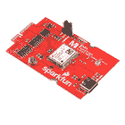](https://www.sparkfun.com/products/18378) 

将**添加到您的[购物车](https://www.sparkfun.com/cart)中！**

### [SparkFun MicroMod GNSS 功能板- NEO-M9N](https://www.sparkfun.com/products/18378)

[In stock](https://learn.sparkfun.com/static/bubbles/ "in stock") GPS-18378

SparkFun NEO-M9N MicroMod GNSS 功能板是一个高质量的 92 通道 u-blox M9 引擎，地理空间板，约 1.5 米…

$49.95[Favorited Favorite](# "Add to favorites") 1[Wish List](# "Add to wish list")****[](https://www.sparkfun.com/products/15424) 

将**添加到您的[购物车](https://www.sparkfun.com/cart)中！**

### [可逆 USB A 转 C 线- 2m](https://www.sparkfun.com/products/15424)

[18 available](https://learn.sparkfun.com/static/bubbles/ "18 available") CAB-15424

这些 2 米长的电缆稍加修改后，就可以插入其端口，而不用考虑其在 U…

$8.951[Favorited Favorite](# "Add to favorites") 4[Wish List](# "Add to wish list")****[](https://www.sparkfun.com/products/16401) 

将**添加到您的[购物车](https://www.sparkfun.com/cart)中！**

### [SparkFun MicroMod Artemis 处理器](https://www.sparkfun.com/products/16401)

[24 available](https://learn.sparkfun.com/static/bubbles/ "24 available") DEV-16401

该处理器具有 Artemis 模块，能够进行机器学习、蓝牙、I2C、GPIO、PWM、SPI，并打包以适应…

$14.95[Favorited Favorite](# "Add to favorites") 14[Wish List](# "Add to wish list")****[](https://www.sparkfun.com/products/18575) 

将**添加到您的[购物车](https://www.sparkfun.com/cart)中！**

### [SparkFun 微电机主板-单个](https://www.sparkfun.com/products/18575)

[In stock](https://learn.sparkfun.com/static/bubbles/ "in stock") DEV-18575

MicroMod 主板是一个专门的载板，允许您将一个 MicroMod 处理器板与一个单…

$14.95[Favorited Favorite](# "Add to favorites") 4[Wish List](# "Add to wish list")****[](https://www.sparkfun.com/products/9146) 

将**添加到您的[购物车](https://www.sparkfun.com/cart)中！**

### [SparkFun 迷你螺丝刀](https://www.sparkfun.com/products/9146)

[In stock](https://learn.sparkfun.com/static/bubbles/ "in stock") TOL-09146

这只是你的基本可逆螺丝刀口袋大小！有平头和十字头可供选择。配有别针和…

$1.053[Favorited Favorite](# "Add to favorites") 11[Wish List](# "Add to wish list")********** **********#### MicroMod 主板

要固定处理器板和功能板，您需要一块主板。根据您的应用，您可以选择一个或两个额外的功能板。

[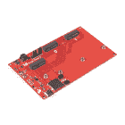](https://www.sparkfun.com/products/18576) 

### [SparkFun MicroMod 主板-双](https://www.sparkfun.com/products/18576)

[Out of stock](https://learn.sparkfun.com/static/bubbles/ "out of stock") DEV-18576

MicroMod 主板是一种专用载板，允许您将 MicroMod 处理器板与多达两个…

[Favorited Favorite](# "Add to favorites") 4[Wish List](# "Add to wish list")[](https://www.sparkfun.com/products/18575) 

将**添加到您的[购物车](https://www.sparkfun.com/cart)中！**

### [SparkFun 微电机主板-单个](https://www.sparkfun.com/products/18575)

[In stock](https://learn.sparkfun.com/static/bubbles/ "in stock") DEV-18575

MicroMod 主板是一个专门的载板，允许您将一个 MicroMod 处理器板与一个单…

$14.95[Favorited Favorite](# "Add to favorites") 4[Wish List](# "Add to wish list")** **#### MicroMod 处理器板

有多种 [MicroMod 处理器板](https://www.sparkfun.com/categories/tags/processor-board)可供选择。我们建议购买与 Arduino 兼容的产品。

[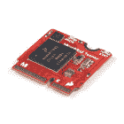](https://www.sparkfun.com/products/16402) 

将**添加到您的[购物车](https://www.sparkfun.com/cart)中！**

### [SparkFun MicroMod Teensy 处理器](https://www.sparkfun.com/products/16402)

[In stock](https://learn.sparkfun.com/static/bubbles/ "in stock") DEV-16402

该板利用恩智浦 iMXRT1062 芯片(ARM Cortex-M7)的强大计算能力，并将其与 M.2 MicroMod 配对…

$21.505[Favorited Favorite](# "Add to favorites") 14[Wish List](# "Add to wish list")****[](https://www.sparkfun.com/products/16791) 

将**添加到您的[购物车](https://www.sparkfun.com/cart)中！**

### [SparkFun MicroMod SAMD51 处理器](https://www.sparkfun.com/products/16791)

[Out of stock](https://learn.sparkfun.com/static/bubbles/ "out of stock") DEV-16791

SparkFun MicroMod SAMD51 处理器板采用 32 位 ARM Cortex-M4F MCU，是一款功能强大的微控制器，封装在一个

$18.951[Favorited Favorite](# "Add to favorites") 8[Wish List](# "Add to wish list")****[](https://www.sparkfun.com/products/16781) 

将**添加到您的[购物车](https://www.sparkfun.com/cart)中！**

### [SparkFun MicroMod ESP32 处理器](https://www.sparkfun.com/products/16781)

[In stock](https://learn.sparkfun.com/static/bubbles/ "in stock") WRL-16781

该板将 Espressif 的 ESP32 与我们的 M.2 连接器接口相结合，为我们的 Micro…

$16.951[Favorited Favorite](# "Add to favorites") 6[Wish List](# "Add to wish list")****[](https://www.sparkfun.com/products/16401) 

将**添加到您的[购物车](https://www.sparkfun.com/cart)中！**

### [SparkFun MicroMod Artemis 处理器](https://www.sparkfun.com/products/16401)

[24 available](https://learn.sparkfun.com/static/bubbles/ "24 available") DEV-16401

该处理器具有 Artemis 模块，能够进行机器学习、蓝牙、I2C、GPIO、PWM、SPI，并打包以适应…

$14.95[Favorited Favorite](# "Add to favorites") 14[Wish List](# "Add to wish list")******** ********#### 微型模块功能板

为了给处理器板添加额外的功能，在将它们连接到主板上时，您需要包括[一个或两个功能板](https://www.sparkfun.com/categories/tags/function-board)。除了 NEO-M9N，如果您有主板- Double，您可以为您的项目添加一个额外的功能板。

[](https://www.sparkfun.com/products/18378) 

将**添加到您的[购物车](https://www.sparkfun.com/cart)中！**

### [SparkFun MicroMod GNSS 功能板- NEO-M9N](https://www.sparkfun.com/products/18378)

[In stock](https://learn.sparkfun.com/static/bubbles/ "in stock") GPS-18378

SparkFun NEO-M9N MicroMod GNSS 功能板是一个高质量的 92 通道 u-blox M9 引擎，地理空间板，约 1.5 米…

$49.95[Favorited Favorite](# "Add to favorites") 1[Wish List](# "Add to wish list")****[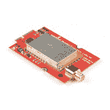](https://www.sparkfun.com/products/18573) 

将**添加到您的[购物车](https://www.sparkfun.com/cart)中！**

### [SparkFun MicroMod LoRa 功能板](https://www.sparkfun.com/products/18573)

[In stock](https://learn.sparkfun.com/static/bubbles/ "in stock") WRL-18573

SparkFun MicroMod LoRa 功能板为您的 MicroMod 项目提供 LoRa 和 LoRaWAN 功能。

$39.95[Favorited Favorite](# "Add to favorites") 3[Wish List](# "Add to wish list")****[](https://www.sparkfun.com/products/18632) 

将**添加到您的[购物车](https://www.sparkfun.com/cart)中！**

### [SparkFun MicroMod 环境功能板](https://www.sparkfun.com/products/18632)

[In stock](https://learn.sparkfun.com/static/bubbles/ "in stock") SEN-18632

MicroMod 环境功能板包括三个传感器，用于监控空气质量、湿度/温度和二氧化碳浓度

$149.95[Favorited Favorite](# "Add to favorites") 3[Wish List](# "Add to wish list")****[](https://www.sparkfun.com/products/18430) 

将**添加到您的[购物车](https://www.sparkfun.com/cart)中！**

### [SparkFun MicroMod WiFi 功能板- ESP32](https://www.sparkfun.com/products/18430)

[In stock](https://learn.sparkfun.com/static/bubbles/ "in stock") WRL-18430

SparkFun MicroMod ESP32 功能板为不具备以下功能的 MicroMod 处理器板增加了额外的无线选项

$14.95[Favorited Favorite](# "Add to favorites") 4[Wish List](# "Add to wish list")******** ********### 工具

您需要一把螺丝刀来固定处理器和功能板。

[](https://www.sparkfun.com/products/12891) 

将**添加到您的[购物车](https://www.sparkfun.com/cart)中！**

### [袖珍螺丝刀套装](https://www.sparkfun.com/products/12891)

[In stock](https://learn.sparkfun.com/static/bubbles/ "in stock") TOL-12891

每个黑客都应该拥有什么？没错，一把螺丝刀(你必须以某种方式进入那些箱子)。什么…

$4.505[Favorited Favorite](# "Add to favorites") 24[Wish List](# "Add to wish list")****[](https://www.sparkfun.com/products/9146) 

将**添加到您的[购物车](https://www.sparkfun.com/cart)中！**

### [SparkFun 迷你螺丝刀](https://www.sparkfun.com/products/9146)

[In stock](https://learn.sparkfun.com/static/bubbles/ "in stock") TOL-09146

这只是你的基本可逆螺丝刀口袋大小！有平头和十字头可供选择。配有别针和…

$1.053[Favorited Favorite](# "Add to favorites") 11[Wish List](# "Add to wish list")****[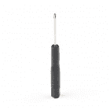](https://www.sparkfun.com/products/19012) 

将**添加到您的[购物车](https://www.sparkfun.com/cart)中！**

### [微型螺丝刀](https://www.sparkfun.com/products/19012)

[In stock](https://learn.sparkfun.com/static/bubbles/ "in stock") TOL-19012

这是一个口袋大小的磁性十字螺丝刀，专门用于 MicroMod 生态系统。

$0.50[Favorited Favorite](# "Add to favorites") 3[Wish List](# "Add to wish list")****** ******### 推荐阅读

如果你不熟悉 MicroMod 生态系统，我们推荐你阅读这里的[来了解](https://www.sparkfun.com/micromod)的概况。

| [](https://www.sparkfun.com/micromod) |
| *[微模式生态系统](https://www.sparkfun.com/micromod)* |

如果您不熟悉以下概念，我们也建议您在继续之前先查阅一些教程。请务必查看处理器板和功能板各自的连接指南，以确保安装了正确的 USB 转串行转换器。您可能还需要遵循本教程中未列出的附加说明来安装适当的软件。

[](https://learn.sparkfun.com/tutorials/gps-basics) [### GPS 基础知识](https://learn.sparkfun.com/tutorials/gps-basics) The Global Positioning System (GPS) is an engineering marvel that we all have access to for a relatively low cost and no subscription fee. With the correct hardware and minimal effort, you can determine your position and time almost anywhere on the globe.[Favorited Favorite](# "Add to favorites") 31[](https://learn.sparkfun.com/tutorials/serial-peripheral-interface-spi) [### 串行外设接口(SPI)](https://learn.sparkfun.com/tutorials/serial-peripheral-interface-spi) SPI is commonly used to connect microcontrollers to peripherals such as sensors, shift registers, and SD cards.[Favorited Favorite](# "Add to favorites") 91[](https://learn.sparkfun.com/tutorials/i2c) [### I2C](https://learn.sparkfun.com/tutorials/i2c) An introduction to I2C, one of the main embedded communications protocols in use today.[Favorited Favorite](# "Add to favorites") 128[](https://learn.sparkfun.com/tutorials/how-to-work-with-jumper-pads-and-pcb-traces) [### 如何使用跳线焊盘和 PCB 走线](https://learn.sparkfun.com/tutorials/how-to-work-with-jumper-pads-and-pcb-traces) Handling PCB jumper pads and traces is an essential skill. Learn how to cut a PCB trace, add a solder jumper between pads to reroute connections, and repair a trace with the green wire method if a trace is damaged.[Favorited Favorite](# "Add to favorites") 11[](https://learn.sparkfun.com/tutorials/getting-started-with-u-center-for-u-blox) [### u-blox 的 U-Center 入门](https://learn.sparkfun.com/tutorials/getting-started-with-u-center-for-u-blox) Learn the tips and tricks to use the u-blox software tool to configure your GPS receiver.[Favorited Favorite](# "Add to favorites") 2[](https://learn.sparkfun.com/tutorials/three-quick-tips-about-using-ufl) [### 关于使用 U.FL 的三个快速提示](https://learn.sparkfun.com/tutorials/three-quick-tips-about-using-ufl) Quick tips regarding how to connect, protect, and disconnect U.FL connectors.[Favorited Favorite](# "Add to favorites") 14[](https://learn.sparkfun.com/tutorials/getting-started-with-micromod) [### MicroMod 入门](https://learn.sparkfun.com/tutorials/getting-started-with-micromod) Dive into the world of MicroMod - a compact interface to connect a microcontroller to various peripherals via the M.2 Connector 3[](https://learn.sparkfun.com/tutorials/micromod-main-board-hookup-guide) [### MicroMod 主板连接指南](https://learn.sparkfun.com/tutorials/micromod-main-board-hookup-guide) The MicroMod Main Board - Single and Double are specialized carrier boards that allow you to interface a Processor Board with a Function Board(s). The modular system allows you to add an additional feature(s) to a Processor Board with the help of a Function Board(s). In this tutorial, we will focus on the basic functionality of the Main Board - Single and Main Board - Double.[Favorited Favorite](# "Add to favorites") 0

## 硬件概述

我们已经把 u-blox NEO-M9N 的电路板拆成了一个 MicroMod 功能板！在本节中，我们将介绍功能板的主要特性。

[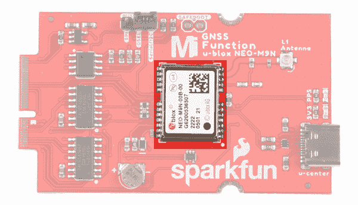](https://cdn.sparkfun.com/assets/learn_tutorials/1/9/9/9/SparkFun_MicroMod_GNSS_Function_Board-NEO-M9N.jpg)

有关模块、这些集成系统以及如何使用它们的详细概述，请参考参考资料中链接的数据手册和集成手册。

### 力量

要给主板供电，您需要给 SparkFun 主板供电。从 M.2 连接器 VCC 线施加的功率将通过 3.3V/600mA AP2112K 电压调节器进行降压。

[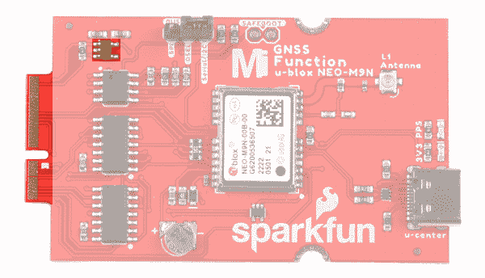](https://cdn.sparkfun.com/assets/learn_tutorials/1/9/9/9/SparkFun_MicroMod_GNSS_Function_Board-NEO-M9N_power_Mdot2_edge_pins.jpg)

### 通信端口

NEO-M9N 有四个通信端口。您可以通过 I ² C 读取 NMEA 数据，同时通过 UART 发送配置命令，反之亦然。唯一的限制是 SPI 引脚映射到 I ² C 和 UART 引脚，因此它要么是 SPI，要么是 I2C+UART。您需要用总线选择跳线选择端口。USB 端口随时可用。在 M.2 连接器和 NEO-M9N 的串行、SPI 和 I ² C 端口之间有一个双向开关。交换机根据跳线位置连接适当的端口。

[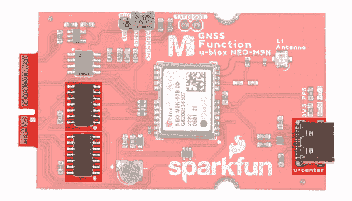](https://cdn.sparkfun.com/assets/learn_tutorials/1/9/9/9/SparkFun_MicroMod_GNSS_Function_Board-NEO-M9N_USB_Serial_SPI_I2C.jpg)**Note:** With the MicroMod M.2 connector, the NEO-M9N's UART, SPI, I²C ports are available without soldering! Other SparkFun NEO-M9N offerings have this capability, but only after you solder hookup wires appropriately.

### 通用串行总线

USB C 连接器适用于那些对在计算机上使用 u-center 软件感兴趣的人。USB 端口和 NEO-M9N 的 USB 数据引脚之间有一个 TVS 二极管用于保护。

[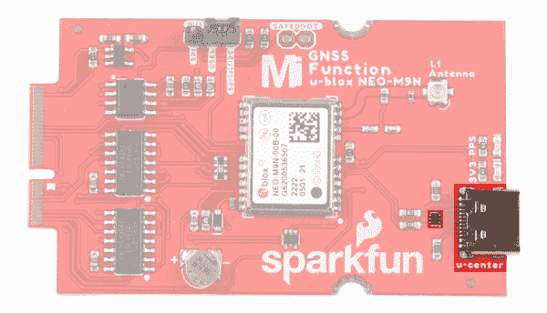](https://cdn.sparkfun.com/assets/learn_tutorials/1/9/9/9/SparkFun_MicroMod_GNSS_Function_Board-NEO-M9N_USB.jpg)**Note:** Power is not connected to the rest of the board to avoid conflicting voltages from the MicroMod system. Make sure to connect a separate power source to the MicroMod Main Board so that the MicroMod GNSS Function Board can be powered through the M.2 connector.

### I ² C(又名 DDC)

u-blox NEO-M9N 有一个“DDC”端口，这实际上只是一个 I ² C 端口(没有商标问题的所有麻烦)。这些引脚与 SPI 引脚共享。用 2 针跳线将`DSEL`引脚连接到`Serial/I2C`引脚会禁用 SPI 数据总线，同时保持 UART 和 I ² C 接口可用。

[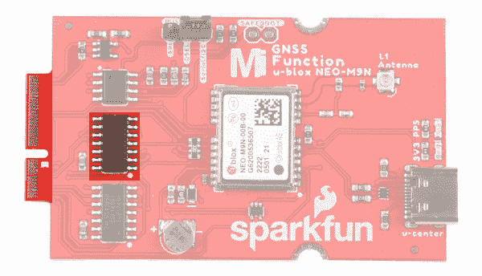](https://cdn.sparkfun.com/assets/learn_tutorials/1/9/9/9/SparkFun_MicroMod_GNSS_Function_Board-NEO-M9N_UART_I2C.jpg)The only I²C address for this and all u-Blox GPS products is **0x42**, though each can have their address changed through software.

### UART/串行

NEO-M9N 提供经典串行引脚，但与 SPI 引脚共享。用 2 针跳线将`DSEL`引脚连接到`Serial/I2C`引脚会禁用 SPI 数据总线，同时保持 UART 和 I ² C 接口可用。

*   TXO/SDO =从 NEO-M9N 发射出去
*   RXI/SDI = RX 到 NEO-M9N

[](https://cdn.sparkfun.com/assets/learn_tutorials/1/9/9/9/SparkFun_MicroMod_GNSS_Function_Board-NEO-M9N_UART_I2C.jpg)

### 精力

NEO-M9N 也可以配置为 [SPI 通信](https://learn.sparkfun.com/tutorials/serial-peripheral-interface-spi/all#receiving-data)。用 2 引脚跳线将`DSEL`引脚连接到`SPI`引脚可启用 SPI 数据总线，从而禁用这些线路上的 UART 功能。这也禁用了 I ² C 接口。

[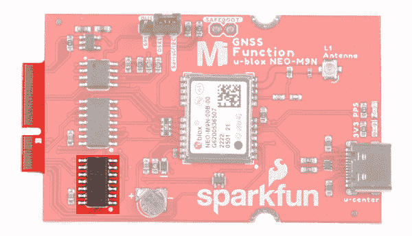](https://cdn.sparkfun.com/assets/learn_tutorials/1/9/9/9/SparkFun_MicroMod_GNSS_Function_Board-NEO-M9N_SPI.jpg)

### 备用电池

小金属盘是一个小型锂电池。这种电池不像 3.3V 系统那样向 IC 供电，而是向 IC 内部的相关系统*供电，从而允许快速重新连接到卫星。第一次定位时间大约为 **~29 秒**，但是当它锁定后，电池将允许有**两秒**的时间进行第一次定位。这称为**热启动**，在主板断电后持续四个小时。电池为备用系统提供超过一年的电力，当主板通电时充电缓慢。要充满电，请将模块插上电源 48 小时。*

[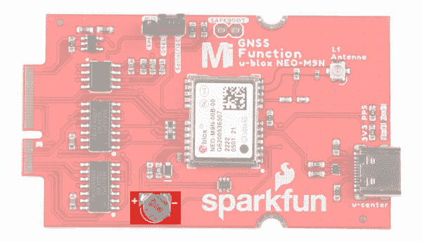](https://cdn.sparkfun.com/assets/learn_tutorials/1/9/9/9/SparkFun_MicroMod_GNSS_Function_Board-NEO-M9N_backup_battery.jpg)

### 单位 FL 连接器

MicroMod GNSS 功能板包括一个 u.FL 连接器，用于与贴片天线安全连接。根据天线的不同，您可能需要 u.FL 适配器来连接。u.FL 连接器是为决定将带有 GNSS 功能板的 MicroMod 主板放置在外壳中的用户增加的设计选择。使用 u.FL 适配器，SMA 连接器可以安装到机柜上。有关使用 u.FL 连接器的更多信息，我们建议[查看我们关于使用 u.FL 连接器的教程](https://learn.sparkfun.com/tutorials/three-quick-tips-about-using-ufl/all)。

[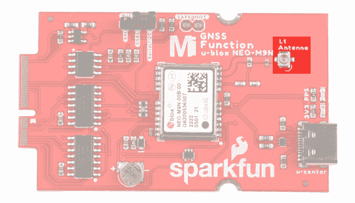](https://cdn.sparkfun.com/assets/learn_tutorials/1/9/9/9/SparkFun_MicroMod_GNSS_Function_Board-NEO-M9N_uFL_Connector.jpg)

### 电可擦可编程只读存储器

该板包括一个 I ² C EEPROM。不幸的是，这对于用户来说是不可用的，而是用来保存板的特定信息。

[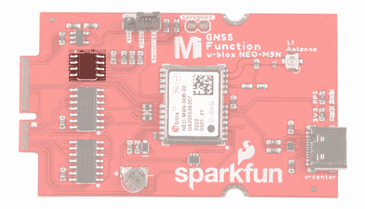](https://cdn.sparkfun.com/assets/learn_tutorials/1/9/9/9/SparkFun_MicroMod_GNSS_Function_Board-NEO-M9N_EEPROM.jpg)

### 发光二极管

该板包括两个状态指示灯。

*   **3V3**:LED`3V3`表示板卡上电。该 LED 与 3.3V 线相连。
*   **PPS**:LED`PPS`接*每秒脉冲*线。当连接到卫星时，这条线路产生一个与 GPS 或 UTC 时间网格同步的脉冲。默认情况下，你会看到每秒一个脉冲。

[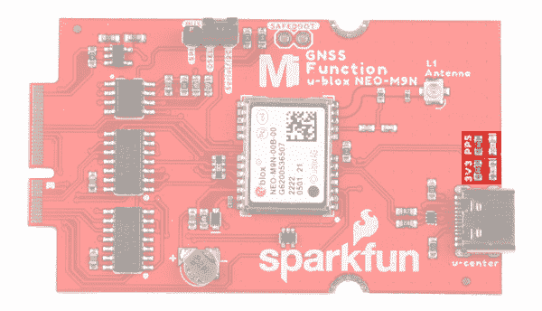](https://cdn.sparkfun.com/assets/learn_tutorials/1/9/9/9/SparkFun_MicroMod_GNSS_Function_Board-NEO-M9N_LEDs.jpg)

### 针织套衫

该板包括一些跳线来配置 NEO-M9N 模块。欲了解更多信息，请查看我们关于跳线焊盘和 PCB 走线的[教程](https://learn.sparkfun.com/tutorials/how-to-work-with-jumper-pads-and-pcb-traces)。

*   **I ² C 上拉电阻** -这个标有`I²C`的三路跳线将两个上拉电阻连接到 I ² C 数据线。如果你的 I ² C 数据线上有很多器件，那么你可以考虑砍掉这些。
*   **WP** -向跳线焊盘添加焊料将禁用 EEPROM 的写保护。
*   **3V3** -标签为`3V3`的电路板对面的跳线连接到 **3V3** LED。切断此跳线将禁用 LED。
*   **PPS** -标签为`PPS`的电路板对面的跳线连接到 **PPS** LED。切断此跳线将禁用 LED。
*   **总线选择**
    *   **SPI** -用 2 针跳线将`DSEL`引脚连接到`SPI`引脚，启用 SPI 数据总线，从而禁用这些线路上的 UART 功能。这也禁用了 I ² C 接口。
    *   **DSEL** -此引脚连接到 NEO-M9N 的 D_SEL 引脚以选择接口。将此引脚连接到任一侧都会选择通信协议。
    *   **串行/I2C**——用 2 针跳线将`DSEL`针连接到`Serial/I2C`针禁用 SPI 数据总线，同时保持 UART 和 I ² C 接口可用。如果 DSEL 引脚开路且未连接到任何一端，UART 和 I ² C 也可以使能。我们建议保持 2 针跳线连接，以避免元件放错位置。
*   **安全引导** -标记为`SAFEBOOT`的 PTH 焊盘用于在安全引导模式下启动 IC，如果你设法破坏了模块的闪存，这可能会很有用。从接头上断开一排 [2 针，将这些针焊接到板上，并连接一个](https://www.sparkfun.com/products/116) [2 针跳线](https://www.sparkfun.com/products/9044)来启用该模式。

| [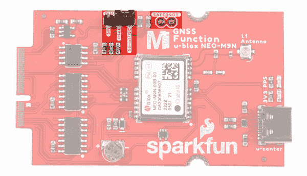](https://cdn.sparkfun.com/assets/learn_tutorials/1/9/9/9/SparkFun_MicroMod_GNSS_Function_Board-NEO-M9N_jumpers_top_view.jpg) | [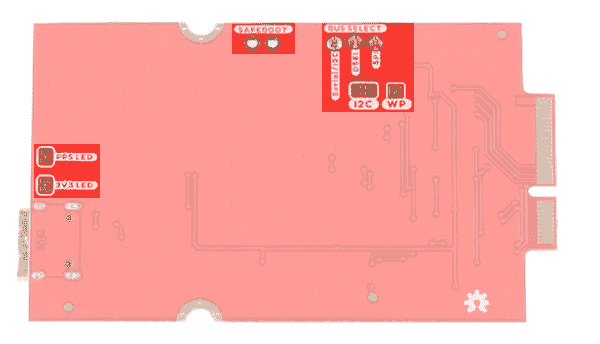](https://cdn.sparkfun.com/assets/learn_tutorials/1/9/9/9/SparkFun_MicroMod_GNSS_Function_Board-NEO-M9N_jumpers_bottom_view.jpg) |
| *跳线(俯视图)* | *跳线(仰视图)* |

### GPS 功能

SparkFun GNSS 功能板 NEO-M9N 能够同时连接多达四个不同的 GNSS 星座，使其大小非常准确。下面列出了 GPS 单元在连接到多个 GNSS 星座和单个 T2 星座时的能力。

| 星座 |  | GPS+GLO+GAL+BDS | GPS+GLONASS+GAL | GPS+GLO | GPS+BDS | GPS+GAL |
| **水平位置精度** |  | 2m | 2m | 2m | 2m | 2m |
| **最大导航更新率** | PVT | 25Hz | 25Hz | 25Hz | 25Hz | 25Hz |
| **首次定位时间** | 冷启动 | 24s | 25s | 26s | 28s | 29 岁 |
|  | 热起动 | 2s | 2s | 2s | 2s | 2s |
| **灵敏度** | 跟踪和导航 | -167dBm | -167dBm | -167dBm | -1667dBm | -166dBm |
|  | 重新获得 | -160dBm | -160dBm | -160dBm | -160dBm | -160dBm |
|  | 冷启动 | -148dBm | -148dBm | -148dBm | -148dBm | -148dBm |
|  | 热起动 | -159dBm | -159dBm | -159dBm | -159dBm | -159dBm |
| **速度精度** |  | 0.05 米/秒 | 0.05 米/秒 | 0.05 米/秒 | 0.05 米/秒 | 0.05 米/秒 |
| **航向精度** |  | 0.3 摄氏度 | 0.3 摄氏度 | 0.3 摄氏度 | 0.3 摄氏度 | 0.3 摄氏度 |

使用**单 GNSS 星座**时:

| 星座 |  | 全球（卫星）定位系统 | GLONASS | 北斗 | “伽利略”号 |
| **水平位置精度** |  | 2m | 4m | 3m | 3m |
| **最大导航更新率** | PVT | 25Hz | 25Hz | 25Hz | 25Hz |
| **首次定位时间** | 冷启动 | 29 岁 | 27s | 32s | 42s |
|  | 热起动 | 2s | 2s | 2s | 2s |
| **灵敏度** | 跟踪和导航 | -166dBm | -164dBm | -160dBm | -159dBm |
|  | 重新获得 | -160dBm | -155dBm | -157dBm | -154dBm |
|  | 冷启动 | -148dBm | -145dBm | -145dBm | -140dBm |
|  | 热起动 | -159dBm | -156dBm | -159dBm | -154dBm |
| **速度精度** |  | 0.05 米/秒 | 0.05 米/秒 | 0.05 米/秒 | 0.05 米/秒 |
| **航向精度** |  | 0.3 摄氏度 | 0.3 摄氏度 | 0.3 摄氏度 | 0.3 摄氏度 |

### 硬件引脚排列

根据您的窗口大小，您可能需要使用表格底部的水平滚动条来查看附加的 pin 功能。请注意，相对两侧的 M.2 连接器引脚相互偏移，如底部引脚所示(未连接)*。主功能下有“-”的引脚没有连接。

*   [MicroMod GNSS 功能板- NEO-M9N 引脚表](#gnss)
*   [微模块通用引脚表](#MMGen)
*   [MicroMod 通用引脚描述](#MMDescript)

| **音频** | **UART** | **GPIO/总线** | **I ² C** | **SDIO** 的缩写形式 | **SPI0** | **专用** |

| 功能 | 底部
销 | 顶部
销 | 功能 |
|  |  |  | (未连接) |  | **75** | GND |  |  |  |
|  |  |  | 3.3V | **74** | **73** | G5 /总线 5 |  |  |  |
|  |  |  | RTC _ 3V _ 电池 | **72** | **71** | G6 /总线 6 |  |  |  |
|  |  | SPI_CS1# | SDIO _ 数据 3(输入输出) | **70** | **69** | G7 /总线 7 |  |  |  |
|  |  |  | SDIO _ 数据 2(输入输出) | **68** | **67** | 八国集团(Group of Eight) |  |  |  |
|  |  |  | SDIO _ 数据 1(输入输出) | **66** | **65** | G9 | ADC_D- | CAM_HSYNC |  |
|  |  | 睡吧 | SDIO _ 数据 0(输入输出) | **64** | **63** | G10 | ADC_D+ | CAM_VSYNC |  |
|  |  | SPI COPI1 | SDIO_CMD (I/O) | **62** | **61** | 睡吧 |  |  |  |
|  |  | SPI SCK1 | SDIO_SCK(或) | **60** | **59** | SPI_COPI (O) | LED_DAT |  |  |
|  |  |  | AUD_MCLK (O) | **58** | **57** | SPI_SCK(或) | LED |  |  |
| 凯姆 | PCM_OUT | I2S 出局 | AUD_OUT | **56** | **55** | SPI_CS# |  |  |  |
| cam _ pclk | PCM_IN | I2S 因 | 澳元 _ 美元 | **54** | **53** | I2C_SCL1(输入/输出) |  |  |  |
| PDM_DATA | PCM_SYNC | i2s WS | AUD_LRCLK | **52** | **51** | I2C_SDA1(输入输出) |  |  |  |
| PDM_CLK | PCM_CLK | SCK i2s | 奥德 _BCLK | **50** | **49** | BATT_VIN / 3 (I - ADC) (0 至 3.3V) |  |  |  |
|  |  |  | G4 /总线 4 | **48** | **47** | PWM1 |  |  |  |
|  |  |  | G3 /总线 3 | **46** | **45** | GND |  |  |  |
|  |  |  | G2 /总线 2 | **44** | **43** | CAN_TX |  |  |  |
|  |  |  | G1 /巴士 1 | **42** | **41** | CAN_RX |  |  |  |
|  |  |  | G0 /总线 0 | **40** | **39** | GND |  |  |  |
|  |  |  | 一流的 | **38** | **37** | USBHOST_D- |  |  |  |
|  |  |  | GND | **36** | **35** | USBHOST_D+ |  |  |  |
|  |  |  | A0 | **34** | **33** | GND |  |  |  |
|  |  |  | PWM0 | **32** | **31** | 模块密钥 |  |  |  |
|  |  |  | 模块密钥 | **30** | **29** | 模块密钥 |  |  |  |
|  |  |  | 模块密钥 | **28** | **27** | 模块密钥 |  |  |  |
|  |  |  | 模块密钥 | **26** | **25** | 模块密钥 |  |  |  |
|  |  |  | 模块密钥 | **24** | **23** | SWDIO |  |  |  |
|  |  |  | UART_TX2 (O) | **22** | **21** | SWDCK |  |  |  |
|  |  |  | UART_RX2 (I) | **20** | **19** | UART_RX1 (I) |  |  |  |
|  |  | CAM_TRIG | D1 | **18** | **17** | UART_TX1 (0) |  |  |  |
|  |  |  | I2C INT # | **16** | **15** | UART_CTS1 (I) |  |  |  |
|  |  |  | S7-1200 可编程控制器 | **14** | **13** | UART_RTS1 (O) |  |  |  |
|  |  |  | I2C SDA(输入/输出) | **12** | **11** | 行李箱(I 型开式排放) |  |  |  |
|  |  |  | D0 | **10** | **9** | USB_VIN |  |  |  |
|  |  | 浅部白色甲癣 | G11 | **8** | **7** | GND |  |  |  |
|  |  |  | 复位# (I -开漏) | **6** | **5** | USB_D- |  |  |  |
|  |  |  | 3.3V_EN | **4** | **3** | USB_D+ |  |  |  |
|  |  |  | 3.3V | **2** | **1** | GND |  |  |  |

| 功能 | 底部
销 | 顶部
销 | 功能 |
|  | (未连接) |  | **75** | GND |  |
|  | 车辆识别号码 | **74** | **73** | 3.3V |  |
|  | 车辆识别号码 | **72** | **71** | powermen(消歧义) |  |
|  | - | **70** | **69** | - |  |
|  | - | **66** | **65** | - |  |
|  | - | **64** | **63** | - |  |
|  | - | **62** | **61** | - |  |
|  | - | **60** | **59** | - |  |
|  | - | **58** | **57** | - |  |
|  | - | **56** | **55** | - |  |
|  | - | **54** | **53** | （同 Internationalorganizations）国际组织 |  |
|  | - | **52** | **51** | 重置 |  |
|  | - | **50** | **49** | SPI_CS0 |  |
|  | - | **48** | **47** | 再附言 |  |
|  | - | **46** | **45** | GND |  |
|  | - | **44** | **43** | - |  |
|  | - | **42** | **41** | - |  |
|  | EEPROM_WP | **40** | **39** | GND |  |
|  | - | **38** | **37** | - |  |
|  | EEEPROM_A0 | **36** | **35** | - |  |
|  | EEEPROM_A1 | **34** | **33** | GND |  |
|  | EEPROM_A2 | **32** | **31** | 模块密钥 |  |
|  | 模块密钥 | **30** | **29** | 模块密钥 |  |
|  | 模块密钥 | **28** | **27** | 模块密钥 |  |
|  | 模块密钥 | **26** | **25** | 模块密钥 |  |
|  | 模块密钥 | **24** | **23** | - |  |
|  | - | **22** | **21** | i2c _ scl |  |
|  | - | **20** | **19** | I2C SDA |  |
|  | - | **18** | **17** | - |  |
|  | - | **16** | **15** | UART_RX |  |
|  | - | **14** | **13** | UART_TX |  |
|  | - | **12** | **11** | - |  |
|  | - | **10** | **9** | - |  |
|  | - | **8** | **7** | SPI_SDO |  |
|  | - | **6** | **5** | SPI_SDI |  |
|  | - | **4** | **3** | SPI |  |
|  | - | **2** | **1** | GND |  |

| 信号群 | 信号 | 输入－输出 | 描述 | 电压 |
| 力量 | 3.3V | 我 | 3.3V 电源 | 3.3V |
| GND |  | 返回电流路径 | 0V |
| USB_VIN | 我 | USB VIN 符合 USB 2.0 规范。连接到处理器板上要求 5V USB 功能的引脚 | 4.8-5.2V |
| RTC _ 3V _ 电池 | 我 | 3V 由外部纽扣电池或迷你电池提供。最大功耗=100μA，连接到引脚，在掉电期间保持 RTC。可以左 NC。 | 3V |
| 3.3V_EN | O | 控制载板的主电压调节器。1V 以上的电压将启用 3.3V 电源路径。 | 3.3V |
| BATT_VIN/3 | 我 | 载板原始电压超过 3。1/3 电阻分压器在载板上实现。根据需要放大整个 0-3.3V 范围的模拟信号 | 3.3V |
| 重置 | 重置 | 我 | 处理器的输入。处理器板上带上拉电阻的开漏。拉低复位处理器。 | 3.3V |
| 靴子 | 我 | 处理器的输入。处理器板上带上拉电阻的开漏。拉低使处理器进入特殊启动模式。可以左 NC。 | 3.3V |
| 通用串行总线 | USB_D | 输入－输出 | USB 数据。符合 USB 2.0 规范的差分串行数据接口。如果编程需要 UART，USB 必须连接到处理器板上的 USB 转串行转换 IC。 |  |
| USB 主机 | USBHOST_D | 输入－输出 | 对于支持 USB 主机模式的处理器。USB 数据。符合 USB 2.0 规范的差分串行数据接口。可以左 NC。 |  |
| 能 | CAN_RX | 我 | CAN 总线接收数据。 | 3.3V |
| CAN_TX | O | CAN 总线传输数据。 | 3.3V |
| 通用非同步收发传输器(Universal Asynchronous Receiver/Transmitter) | UART_RX1 | 我 | UART 接收数据。 | 3.3V |
| UART_TX1 | O | UART 发送数据。 | 3.3V |
| UART_RTS1 | O | UART 准备发送。 | 3.3V |
| UART_CTS1 | 我 | UART 清零发送。 | 3.3V |
| UART_RX2 | 我 | 第二个 UART 接收数据。 | 3.3V |
| UART_TX2 | O | 第二个 UART 发送数据。 | 3.3V |
| I2C | i2c _ scl | 输入－输出 | I ² C 时钟。载板上拉的开漏。 | 3.3V |
| I2C SDA | 输入－输出 | I ² C 数据。载板上有上拉电阻的开漏 | 3.3V |
| I2C INT # | 我 | 从载板到处理器的中断通知。载板上拉的开漏。低电平有效 | 3.3V |
| I2C_SCL1 号文件 | 输入－输出 | 2nd I ² C 时钟。载板上拉的开漏。 | 3.3V |
| I2C sda 1 | 输入－输出 | 2nd I ² C 数据。载板上拉的开漏。 | 3.3V |
| 精力 | SPI_COPI | O | SPI 控制器输出/外设输入。 | 3.3V |
| 睡吧，婊子 | 我 | SPI 控制器输入/外设输出。 | 3.3V |
| SPI | O | SPI 时钟。 | 3.3V |
| SPI_CS# | O | SPI 片选。低电平有效。如果不使用硬件 CS，可以路由到 GPIO。 | 3.3V |
| SPI/SDIO | SPI_SCK1/SDIO_CLK | O | 第二个 SPI 时钟。次要用途是 SDIO 钟。 | 3.3V |
| SPI_COPI1/SDIO_CMD | 输入－输出 | 第二 SPI 控制器输出/外设输入。次要用途是 SDIO 命令界面。 | 3.3V |
| spi _ 塞浦路斯 1/SDIO_DATA0 | 输入－输出 | 第二个 SPI 外设输入/控制器输出。次要用途是 SDIO 数据交换位 0。 | 3.3V |
| SDIO_DATA1 | 输入－输出 | SDIO 数据交换位 1。 | 3.3V |
| SDIO_DATA2 | 输入－输出 | SDIO 数据交换位 2。 | 3.3V |
| SPI _ CS1/SDIO _ 数据 3 | 输入－输出 | 第二个 SPI 芯片选择。次要用途是 SDIO 数据交换位 3。 | 3.3V |
| 声音的 | 奥地利马克 | O | 音频主时钟。 | 3.3V |
| AUD _ OUT/PCM _ OUT/i2s _ OUT/CAM _ MCLK | O | 音频数据输出。PCM 同步数据输出。I2S 串行数据输出。相机主时钟。 | 3.3V |
| 澳大利亚/PCM _ IN/i2s _ IN/卡姆 _PCLK | 我 | 音频数据输入。PCM 同步数据输入。I2S 串行数据输入。照相机外围时钟。 | 3.3V |
| AUD _ LRC lk/PCM _ SYNC/i2s _ WS/PDM _ DATA | 输入－输出 | 音频左/右时钟。PCM 同步数据同步。I2S 单词精选。PDM 数据。 | 3.3V |
| 澳大利亚 BCLK/CLK PCM/CLK i2s/CLK PDM | O | 音频位时钟。PCM 时钟。I2S 连续串行时钟。PDM 时钟。 | 3.3V |
| 社署 | SWDIO | 输入－输出 | 串行线调试 I/O。如果处理器板支持 SWD，则连接。可以左 NC。 | 3.3V |
| SWDCK | 我 | 串行线调试时钟。如果处理器板支持 SWD，则连接。可以左 NC。 | 3.3V |
| 物理输出核心 | A0 | 我 | 模数转换器 0。根据需要放大模拟信号，以实现完整的 0-3.3V 范围。 | 3.3V |
| 一流的 | 我 | 模数转换器 1。根据需要放大模拟信号，以实现完整的 0-3.3V 范围。 | 3.3V |
| 脉宽调制（pulse-width modulating 的缩写） | PWM0 | O | 脉宽调制输出 0。 | 3.3V |
| PWM1 | O | 脉宽调制输出 1。 | 3.3V |
| 数字的 | D0 | 输入－输出 | 通用数字输入/输出引脚。 | 3.3V |
| D1/CAM_TRIG | 输入－输出 | 通用数字输入/输出引脚。相机触发器。 | 3.3V |
| 常规/公共汽车 | G0/总线 0 | 输入－输出 | 通用引脚。任何未使用的处理器引脚都应分配给 Gx，具有 ADC + PWM 功能的引脚优先(0、1、2 等。)岗位。目的是保证各 ADC/PWM/数字引脚上的 PWM、ADC 和数字引脚功能。Gx 引脚不保证 ADC/PWM 功能。另一种用途是引脚可以支持快速读/写 8 位或 4 位宽总线。 | 3.3V |
| G1/巴士 1 | 输入－输出 | 3.3V |
| G2/总线 2 | 输入－输出 | 3.3V |
| G3/总线 3 | 输入－输出 | 3.3V |
| G4/总线 4 | 输入－输出 | 3.3V |
| G5/总线 5 | 输入－输出 | 3.3V |
| g6/总线 6 | 输入－输出 | 3.3V |
| G7/总线 7 | 输入－输出 | 3.3V |
| 八国集团(Group of Eight) | 输入－输出 | 通用引脚 | 3.3V |
| G9/ADC_D-/CAM_HSYNC | 输入－输出 | 差分 ADC 输入(如有)。相机水平同步。 | 3.3V |
| G10/ADC_D+/CAM_VSYNC | 输入－输出 | 差分 ADC 输入(如有)。相机垂直同步。 | 3.3V |
| G11/SWO | 输入－输出 | 通用引脚。串行线输出 | 3.3V |

### 电路板尺寸

该板采用标准的 MicroMod 功能板尺寸，尺寸约为 1.50"x2.56 "。

[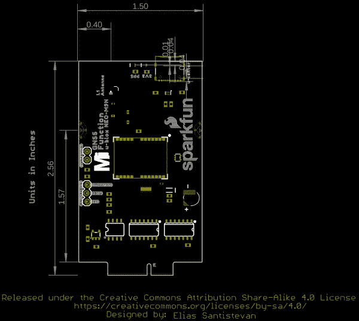](https://cdn.sparkfun.com/assets/0/f/7/1/2/SparkFun_MicroMod_GNSS_Function_Board_NEO-M9N_Board_Dimensions.png)

## 硬件装配

如果您还没有，请务必查看【MicroMod 入门:硬件连接以获取有关将处理器和功能板插入主板的信息。

[](https://learn.sparkfun.com/tutorials/getting-started-with-micromod) [### MicroMod 入门

#### 2020 年 10 月 21 日](https://learn.sparkfun.com/tutorials/getting-started-with-micromod) Dive into the world of MicroMod - a compact interface to connect a microcontroller to various peripherals via the M.2 Connector 3

将您选择的处理器和 GNSS 功能板以一定角度插入 M.2 连接器。处理器板将以一定角度(大约 25°)竖起。

[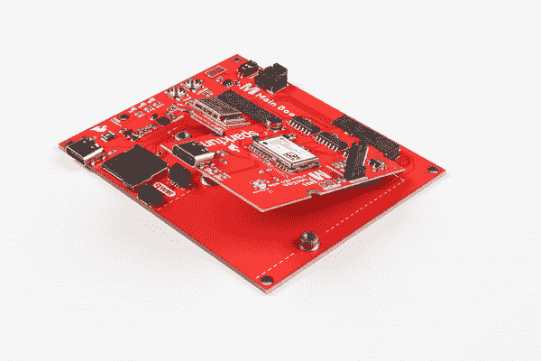](https://cdn.sparkfun.com/assets/learn_tutorials/1/9/9/9/MicroMod_GNSS_Function_Board-NEO-M9N_Processor_Board_Inserted_Main_Board.jpg)

按住每块板，插入螺丝，并拧紧。

[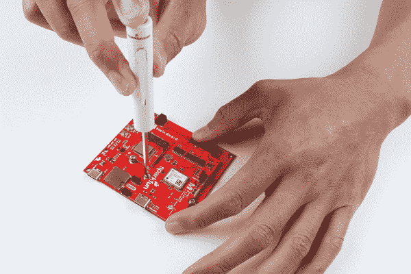](https://cdn.sparkfun.com/assets/learn_tutorials/1/9/9/9/MicroMod_GNSS_Function_Board-NEO-M9N_Tighten_Screws.jpg)

将处理器和功能板固定到主板后，您的设置应该如下图所示。

[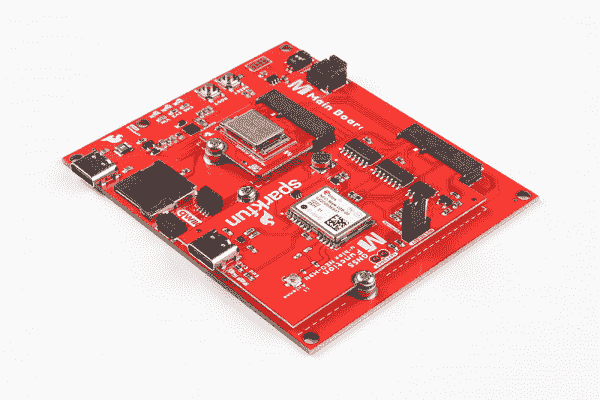](https://cdn.sparkfun.com/assets/learn_tutorials/1/9/9/9/MicroMod_GNSS_Function_Board-NEO-M9N_Connected_Main_Board.jpg)

将 u.FL 适配器插入 MicroMod GNSS 功能板。将贴片天线连接到 u.FL 适配器的另一端。SMA 连接器只需用手指拧紧即可将天线固定到适配器上..

[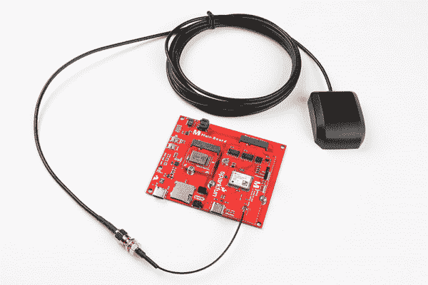](https://cdn.sparkfun.com/assets/learn_tutorials/1/9/9/9/MicroMod_GNSS_Function_Board-NEO-M9N_Connect_Antenna.jpg)

连接 USB 型电缆，为处理器板供电和编程。在这种情况下，我们使用了 MicroMod 主板-单个和 MicroMod Artemis 处理器。这也将为 MicroMod GNSS 功能板供电。

[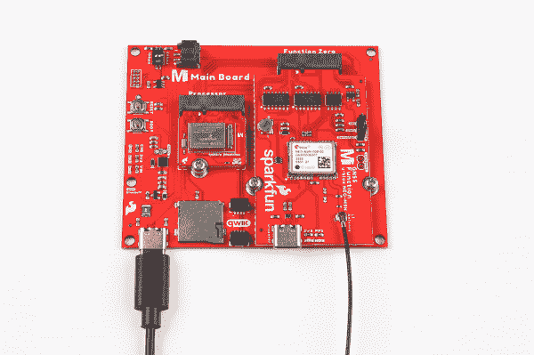](https://cdn.sparkfun.com/assets/learn_tutorials/1/9/9/9/Programming_Power_Processor_Board_MicroMod_GNSS_Function_Board-NEO-M9N.jpg)

对于想要将 NEO-M9N 连接到 u-blox 的 u-center 的用户，请将第二根 USB Type C 电缆插入 MicroMod GNSS 功能板的 USB C 连接器。

[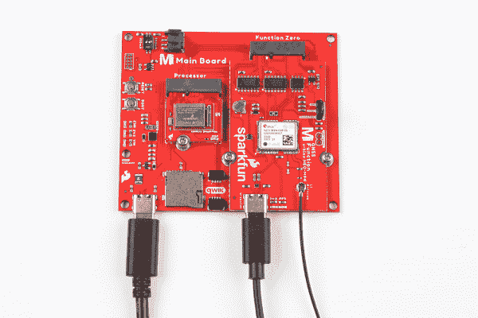](https://cdn.sparkfun.com/assets/learn_tutorials/1/9/9/9/USB_Cables_Power_Configure_MicroMod_GNSS_Function_Board-NEO-M9N_u-blox_u-center.jpg)

## 软件安装

**Note:** This example assumes you are using the latest version of the Arduino IDE on your desktop. If this is your first time using Arduino, please review the following tutorials.

*   [安装 Arduino IDE](https://learn.sparkfun.com/tutorials/installing-arduino-ide)
*   [在 Arduino IDE 中安装板卡定义](https://learn.sparkfun.com/tutorials/installing-board-definitions-in-the-arduino-ide)
*   [安装 Arduino 库](https://learn.sparkfun.com/tutorials/installing-an-arduino-library)

### Arduino 板定义和驱动程序

我们假设您已经为处理器板安装了必要的板文件和驱动程序。在这种情况下，我们使用 MicroMod Artemis 处理器板，它使用 CH340 USB 转串行转换器。如果您使用的是处理器板，请务必查看处理器板的连接指南。

[](https://learn.sparkfun.com/tutorials/installing-board-definitions-in-the-arduino-ide) [### 在 Arduino IDE 中安装电路板定义

#### 2020 年 9 月 9 日](https://learn.sparkfun.com/tutorials/installing-board-definitions-in-the-arduino-ide) How do I install a custom Arduino board/core? It's easy! This tutorial will go over how to install an Arduino board definition using the Arduino Board Manager. We will also go over manually installing third-party cores, such as the board definitions required for many of the SparkFun development boards.[Favorited Favorite](# "Add to favorites") 3[](https://learn.sparkfun.com/tutorials/micromod-artemis-processor-board-hookup-guide) [### MicroMod Artemis 处理器板连接指南

#### 2020 年 10 月 21 日](https://learn.sparkfun.com/tutorials/micromod-artemis-processor-board-hookup-guide) Get started with the Artemis MicroMod Processor Board in this tutorial 0[](https://learn.sparkfun.com/tutorials/how-to-install-ch340-drivers) [### 如何安装 CH340 驱动程序

#### 2019 年 8 月 6 日](https://learn.sparkfun.com/tutorials/how-to-install-ch340-drivers) How to install CH340 drivers (if you need them) on Windows, Mac OS X, and Linux.[Favorited Favorite](# "Add to favorites") 9

### Arduino 图书馆

我们所有基于 u-blox 的 GPS 板共享同一个库:这个板，它们的[前后继](https://learn.sparkfun.com/tutorials/sparkfun-gps-breakout-zoe-m8q-and-sam-m8q-hookup-guide)和更高[精度](https://www.sparkfun.com/products/15005) [u-blox 表兄弟](https://www.sparkfun.com/products/15136)。SparkFun u-blox Arduino 库可以通过搜索' **SparkFun u-blox GNSS** '使用 Arduino 库管理器下载，或者您可以从 [GitHub 存储库](https://github.com/sparkfun/SparkFun_u-blox_GNSS_Arduino_Library)获取 zip 文件以手动安装:

[SparkFun U-blox Arduino Library (ZIP)](https://github.com/sparkfun/SparkFun_u-blox_GNSS_Arduino_Library/archive/main.zip)

提供了几个利用 I ² C 总线让你从太空接收信息的示例草图。我们将在本教程中复习一个例子。

**Note:** Example 2 uses the '**MicroNMEA**' library by **Steve Marple**. Make sure to install the library as well by searching for it in the Arduino library manager. You could also grab the zip here from the [GitHub repository](https://github.com/stevemarple/MicroNMEA) to manually install.

[MicroNMEA Arduino Library (ZIP)](https://github.com/stevemarple/MicroNMEA/archive/master.zip)

#### 主板示例-引脚连接表

对于 NEO-M9N 专用引脚，这里是功能板和主板处理器引脚之间的映射。在下面的例子中，我们使用的是 Artemis 处理器板。

| **音频** | **UART** | **GPIO/总线** | **I ² C** | **SDIO** 的缩写形式 | **SPI** | **专用** |

| NEO-M9N 功能板
引脚名称 | 输入/输出
方向 | 主板的
处理器引脚 |
| 插槽 0 | 插槽 1 |
| VCC | 我 | VCC | VCC |
| 在中 | O | PWR_EN0 | PWR_EN1 |
| GND | - | GND | GND |
| SPI | O | SPI | SPI |
| SPI | 我 | SPI | SPI |
| SPI_PICO | O | SPI_PICO | SPI_PICO |
| i2c _ scl | 输入－输出 | i2c _ scl | i2c _ scl |
| I2C SDA | 输入－输出 | I2C SDA | I2C SDA |
| 药方(prescription 的缩写) | O | TX1 | TX2 |
| 谢谢 | 我 | RX1 | RX2 |
| 再附言 | 输入－输出 | D0 | D1 |
| SPI_CS | 输入－输出 | CS0 | CS1 |
| 重置 | 输入－输出 | PWM0 | PWM1 |
| （同 Internationalorganizations）国际组织 | 输入－输出 | 静止状态 | G5 |
| EEPROM_A0 | 输入－输出 | - | - |
| EEPROM_A1 | 输入－输出 | - | - |
| EEPROM_A2 | 输入－输出 | - | - |
| EEPROM_WP | 输入－输出 | - | - |

## Arduino 示例

我们只看示例二(即“ **Example2_NMEAParsing.ino** ”)，在我看来，它清楚地表明了这些 GPS 接收机的神奇之处。也就是说，与卫星对话，找出你在世界上的什么地方。

```
language:c
#include <Wire.h> //Needed for I2C to GPS

#include "SparkFun_u-blox_GNSS_Arduino_Library.h" //Click here to get the library: http://librarymanager/All#SparkFun_u-blox_GNSS
SFE_UBLOX_GNSS myGNSS;

void setup()
{
  Serial.begin(115200);
  Serial.println("SparkFun u-blox Example");

  Wire.begin();

  if (myGNSS.begin() == false)
  {
    Serial.println(F("u-blox GNSS module not detected at default I2C address. Please check wiring. Freezing."));
    while (1);
  }

  //This will pipe all NMEA sentences to the serial port so we can see them
  myGNSS.setNMEAOutputPort(Serial);
}

void loop()
{
  myGNSS.checkUblox(); //See if new data is available. Process bytes as they come in.

  delay(250); //Don't pound too hard on the I2C bus
} 
```

当你上传这段代码时，你必须等待 24 秒才能锁定任何卫星。在第一次锁定之后，板上的备用电池将为一些内部系统提供电力，这将允许下次打开板时进行**热启动**。**热启动**只持续四个小时，但允许你在一秒钟内锁定。锁定后，[串行终端](https://learn.sparkfun.com/tutorials/terminal-basics/arduino-serial-monitor-windows-mac-linux)将开始列出经度和纬度坐标，如下图所示。确保将串行监视器设置为 **115200 波特**。

[](https://cdn.sparkfun.com/assets/learn_tutorials/8/6/9/nmeaCapture-ublox2.jpg)*These are the coordinates for SparkFun HQ*

## 解决纷争

**Not working as expected and need help?**

If you need technical assistance and more information on a product that is not working as you expected, we recommend heading on over to the [SparkFun Technical Assistance](https://www.sparkfun.com/technical_assistance) page for some initial troubleshooting.

[SparkFun Technical Assistance Page](https://www.sparkfun.com/technical_assistance)
If you don't find what you need there, the [SparkFun Forums](https://forum.sparkfun.com/index.php) are a great place to find and ask for help. If this is your first visit, you'll need to [create a Forum Account](https://forum.sparkfun.com/ucp.php?mode=register) to search product forums and post questions.

[Create New Forum Account](https://forum.sparkfun.com/ucp.php?mode=register)   [Log Into SparkFun Forums](https://forum.sparkfun.com/index.php)

## 资源和更进一步

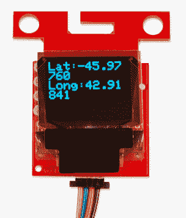

## 准备好动手操作 GPS 了吗？

我们为您准备了一个页面！我们将带您了解 GPS 的基本工作原理、所需的硬件以及项目教程，帮助您入门。

带我去那里！

既然您已经成功地启动并运行了您的 MicroMod GNSS 功能板- NEO-M9N，那么是时候将其纳入您自己的项目了！要了解更多信息，请查看下面的参考资料。

#### **硬件文档**

*   [示意图(PDF)](https://cdn.sparkfun.com/assets/e/9/4/f/b/SparkFun_MicroMod_GNSS_Function_Board_NEO-M9N_Schematic.pdf)
*   [老鹰文件(ZIP)](https://cdn.sparkfun.com/assets/1/3/6/0/0/SparkFun_GNSS_NEO-M9N_V1_2.zip)
*   [板尺寸(PNG)](https://cdn.sparkfun.com/assets/0/f/7/1/2/SparkFun_MicroMod_GNSS_Function_Board_NEO-M9N_Board_Dimensions.png)
*   [建立 GPS 系统](https://www.sparkfun.com/gps)
*   [u-blox NEO-M9N 文档&资源](https://www.u-blox.com/en/product/neo-m9n-module#tab-documentation-resources)
    *   [数据表(PDF)](https://cdn.sparkfun.com/assets/b/f/b/a/7/NEO-M9N_DataSheet__UBX-19014285_.pdf)
    *   [产品摘要(PDF)](https://cdn.sparkfun.com/assets/a/7/8/6/d/NEO-M9N_ProductSummary__UBX-19027207_.pdf)
    *   [集成手册(PDF)](https://cdn.sparkfun.com/assets/5/d/7/8/3/NEO-M9N_Integrationmanual__UBX-19014286_.pdf)
    *   [u-blox 协议规范(PDF)](https://cdn.sparkfun.com/assets/learn_tutorials/8/6/9/u-blox8-M8_ReceiverDescrProtSpec__UBX-13003221__Public.pdf)
    *   [u-blox ECCN (PDF)](https://cdn.sparkfun.com/assets/9/b/5/5/8/Ublox_ECCN.pdf)
    *   [优信软件](https://www.u-blox.com/en/product/u-center)
*   [SparkFun u-blox GNSS Arduino 库](https://github.com/sparkfun/SparkFun_u-blox_GNSS_Arduino_Library)
*   [GitHub 硬件回购](https://github.com/sparkfun/SparkFun_GNSS_Function_Board_NEO-M9)
*   [SFE 产品展示区](https://youtu.be/FY0KOrzQ2KE)

#### **MicroMod 文档**

*   [micro mod 入门](https://learn.sparkfun.com/tutorials/getting-started-with-micromod)
*   [用微模块设计](https://learn.sparkfun.com/tutorials/designing-with-micromod)
*   [MicroMod 信息页面](https://www.sparkfun.com/micromod)
*   [MicroMod 论坛](https://forum.sparkfun.com/viewforum.php?f=180)

或者查看其他与 GPS 和 GNSS 相关的[教程](https://learn.sparkfun.com/tutorials/tags/gps):

[](https://learn.sparkfun.com/tutorials/displaying-your-coordinates-with-a-gps-module) [### 用 GPS 模块显示你的坐标](https://learn.sparkfun.com/tutorials/displaying-your-coordinates-with-a-gps-module) This Arduino tutorial will teach you how to pinpoint and display your GPS coordinates with a press of a button using hardware from our Qwiic Connect System (I2C).[Favorited Favorite](# "Add to favorites") 14[](https://learn.sparkfun.com/tutorials/sparkfun-gps-dead-reckoning-neo-m8u-hookup-guide) [### SparkFun GPS 航位推算 NEO-M8U 连接指南](https://learn.sparkfun.com/tutorials/sparkfun-gps-dead-reckoning-neo-m8u-hookup-guide) The u-blox NEO-M8U is a powerful GPS units that takes advantage of untethered dead reckoning (UDR) technology for navigation. The module provides continuous positioning for vehicles in urban environments and during complete signal loss (e.g. short tunnels and parking garages). We will quickly get you set up using the Qwiic ecosystem and Arduino so that you can start reading the output 3[](https://learn.sparkfun.com/tutorials/lte-gnss-breakout---sara-r5-hookup-guide) [### LTE GNSS 分线大会- SARA-R5 连接指南](https://learn.sparkfun.com/tutorials/lte-gnss-breakout---sara-r5-hookup-guide) A guide to get you started with the SparkFun LTE GNSS Breakout - SARA-R5\. This breakout features the SARA-R5 module from u-blox.[Favorited Favorite](# "Add to favorites") 3[](https://learn.sparkfun.com/tutorials/sparkfun-gps-rtk-dead-reckoning-zed-f9k-hookup-guide) [### SparkFun GPS-RTK 航位推算 ZED-F9K 连接指南](https://learn.sparkfun.com/tutorials/sparkfun-gps-rtk-dead-reckoning-zed-f9k-hookup-guide) The u-blox ZED-F9K is a powerful GPS-RTK unit that uses a fusion of IMU, wheel ticks, a vehicle dynamics model, correction data, and GNSS measurements to provide highly accurate and continuous position for navigation in the difficult conditions. We will quickly get you set up using the Qwiic ecosystem through Arduino so that you can start reading the output 1************************************