# MicroMod 主板连接指南

> 原文：<https://learn.sparkfun.com/tutorials/micromod-main-board-hookup-guide>

## 介绍

**Note:** This tutorial is for the MicroMod Main Board - Single V1.1 and Double V1.1\. For users with the newer versions of the Main Boards, make sure to check out the [updated tutorial](https://learn.sparkfun.com/tutorials/micromod-main-board-hookup-guide-v2).

MicroMod 主板- [单](https://www.sparkfun.com/products/18575)和[双](https://www.sparkfun.com/products/18576)是专门的载板，允许您将处理器板与功能板连接。模块化系统允许您在功能板的帮助下向处理器板添加附加功能。

[](https://www.sparkfun.com/products/18575) 

将**添加到您的[购物车](https://www.sparkfun.com/cart)中！**

### [SparkFun 微电机主板-单个](https://www.sparkfun.com/products/18575)

[In stock](https://learn.sparkfun.com/static/bubbles/ "in stock") DEV-18575

MicroMod 主板是一个专门的载板，允许您将一个 MicroMod 处理器板与一个单…

$14.95[Favorited Favorite](# "Add to favorites") 4[Wish List](# "Add to wish list")****[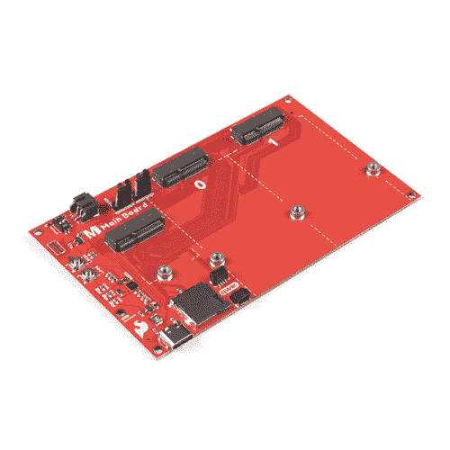](https://www.sparkfun.com/products/18576) 

### [SparkFun MicroMod 主板-双](https://www.sparkfun.com/products/18576)

[Out of stock](https://learn.sparkfun.com/static/bubbles/ "out of stock") DEV-18576

MicroMod 主板是一种专用载板，允许您将 MicroMod 处理器板与多达两个…

[Favorited Favorite](# "Add to favorites") 4[Wish List](# "Add to wish list")** **[https://www.youtube.com/embed/GeeHryO9D8k/?autohide=1&border=0&wmode=opaque&enablejsapi=1](https://www.youtube.com/embed/GeeHryO9D8k/?autohide=1&border=0&wmode=opaque&enablejsapi=1)

### 所需材料

要完成本教程，您至少需要以下材料。你可能不需要所有的东西，这取决于你拥有什么。将它添加到您的购物车，通读指南，并根据需要调整购物车。

[](https://www.sparkfun.com/products/12891) 

将**添加到您的[购物车](https://www.sparkfun.com/cart)中！**

### [袖珍螺丝刀套装](https://www.sparkfun.com/products/12891)

[In stock](https://learn.sparkfun.com/static/bubbles/ "in stock") TOL-12891

每个黑客都应该拥有什么？没错，一把螺丝刀(你必须以某种方式进入那些箱子)。什么…

$4.505[Favorited Favorite](# "Add to favorites") 24[Wish List](# "Add to wish list")****[](https://www.sparkfun.com/products/15424) 

将**添加到您的[购物车](https://www.sparkfun.com/cart)中！**

### [可逆 USB A 转 C 线- 2m](https://www.sparkfun.com/products/15424)

[18 available](https://learn.sparkfun.com/static/bubbles/ "18 available") CAB-15424

这些 2 米长的电缆稍加修改后，就可以插入其端口，而不用考虑其在 U…

$8.951[Favorited Favorite](# "Add to favorites") 4[Wish List](# "Add to wish list")****[](https://www.sparkfun.com/products/16401) 

将**添加到您的[购物车](https://www.sparkfun.com/cart)中！**

### [SparkFun MicroMod Artemis 处理器](https://www.sparkfun.com/products/16401)

[24 available](https://learn.sparkfun.com/static/bubbles/ "24 available") DEV-16401

该处理器具有 Artemis 模块，能够进行机器学习、蓝牙、I2C、GPIO、PWM、SPI，并打包以适应…

$14.95[Favorited Favorite](# "Add to favorites") 14[Wish List](# "Add to wish list")****[](https://www.sparkfun.com/products/18575) 

将**添加到您的[购物车](https://www.sparkfun.com/cart)中！**

### [SparkFun 微电机主板-单个](https://www.sparkfun.com/products/18575)

[In stock](https://learn.sparkfun.com/static/bubbles/ "in stock") DEV-18575

MicroMod 主板是一个专门的载板，允许您将一个 MicroMod 处理器板与一个单…

$14.95[Favorited Favorite](# "Add to favorites") 4[Wish List](# "Add to wish list")****[](https://www.sparkfun.com/products/18632) 

将**添加到您的[购物车](https://www.sparkfun.com/cart)中！**

### [SparkFun MicroMod 环境功能板](https://www.sparkfun.com/products/18632)

[In stock](https://learn.sparkfun.com/static/bubbles/ "in stock") SEN-18632

MicroMod 环境功能板包括三个传感器，用于监控空气质量、湿度/温度和二氧化碳浓度

$149.95[Favorited Favorite](# "Add to favorites") 3[Wish List](# "Add to wish list")****[](https://www.sparkfun.com/products/15107) 

将**添加到您的[购物车](https://www.sparkfun.com/cart)中！**

### [microSD 卡-1GB(4 类)](https://www.sparkfun.com/products/15107)

[In stock](https://learn.sparkfun.com/static/bubbles/ "in stock") COM-15107

当你只需要一张基本的 SD 卡时，这张卡就适合你了。1GB 的容量足以存储 MP3 或日志环境…

$5.50[Favorited Favorite](# "Add to favorites") 6[Wish List](# "Add to wish list")****[](https://www.sparkfun.com/products/18430) 

将**添加到您的[购物车](https://www.sparkfun.com/cart)中！**

### [SparkFun MicroMod WiFi 功能板- ESP32](https://www.sparkfun.com/products/18430)

[In stock](https://learn.sparkfun.com/static/bubbles/ "in stock") WRL-18430

SparkFun MicroMod ESP32 功能板为不具备以下功能的 MicroMod 处理器板增加了额外的无线选项

$14.95[Favorited Favorite](# "Add to favorites") 4[Wish List](# "Add to wish list")************** ************#### MicroMod 主板

要容纳处理器和功能板，您需要一块主板。根据您的应用，您可以选择一个或两个功能板。

[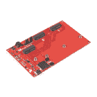](https://www.sparkfun.com/products/18576) 

### [SparkFun MicroMod 主板-双](https://www.sparkfun.com/products/18576)

[Out of stock](https://learn.sparkfun.com/static/bubbles/ "out of stock") DEV-18576

MicroMod 主板是一种专用载板，允许您将 MicroMod 处理器板与多达两个…

[Favorited Favorite](# "Add to favorites") 4[Wish List](# "Add to wish list")[](https://www.sparkfun.com/products/18575) 

将**添加到您的[购物车](https://www.sparkfun.com/cart)中！**

### [SparkFun 微电机主板-单个](https://www.sparkfun.com/products/18575)

[In stock](https://learn.sparkfun.com/static/bubbles/ "in stock") DEV-18575

MicroMod 主板是一个专门的载板，允许您将一个 MicroMod 处理器板与一个单…

$14.95[Favorited Favorite](# "Add to favorites") 4[Wish List](# "Add to wish list")** **#### MicroMod 处理器板

有多种 MicroMod 处理器板可供选择。您可能希望避免使用相同的处理器和功能板，因为这两种类型的板上都有一个 ESP32。

[](https://www.sparkfun.com/products/16401) 

将**添加到您的[购物车](https://www.sparkfun.com/cart)中！**

### [SparkFun MicroMod Artemis 处理器](https://www.sparkfun.com/products/16401)

[24 available](https://learn.sparkfun.com/static/bubbles/ "24 available") DEV-16401

该处理器具有 Artemis 模块，能够进行机器学习、蓝牙、I2C、GPIO、PWM、SPI，并打包以适应…

$14.95[Favorited Favorite](# "Add to favorites") 14[Wish List](# "Add to wish list")****[](https://www.sparkfun.com/products/16791) 

将**添加到您的[购物车](https://www.sparkfun.com/cart)中！**

### [SparkFun MicroMod SAMD51 处理器](https://www.sparkfun.com/products/16791)

[Out of stock](https://learn.sparkfun.com/static/bubbles/ "out of stock") DEV-16791

SparkFun MicroMod SAMD51 处理器板采用 32 位 ARM Cortex-M4F MCU，是一款功能强大的微控制器，封装在一个

$18.951[Favorited Favorite](# "Add to favorites") 8[Wish List](# "Add to wish list")****[](https://www.sparkfun.com/products/18030) 

将**添加到您的[购物车](https://www.sparkfun.com/cart)中！**

### [SparkFun micro mod Alorium Sno M2 处理器](https://www.sparkfun.com/products/18030)

[Out of stock](https://learn.sparkfun.com/static/bubbles/ "out of stock") DEV-18030

SparkFun MicroMod Alorium Sno 处理器采用 SNS 系统级模块(SoM ),适用于 MicroMod M.2 处理器

$49.95[Favorited Favorite](# "Add to favorites") 6[Wish List](# "Add to wish list")****[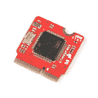](https://www.sparkfun.com/products/21326) 

将**添加到您的[购物车](https://www.sparkfun.com/cart)中！**

### [SparkFun MicroMod STM32 处理器](https://www.sparkfun.com/products/21326)

[In stock](https://learn.sparkfun.com/static/bubbles/ "in stock") DEV-21326

SparkFun MicroMod STM32 处理器板已经准备好用其 ARM Cortex -M4 32 位 RISC 内核震撼您的 MicroMod 世界！

$16.50[Favorited Favorite](# "Add to favorites") 0[Wish List](# "Add to wish list")******** ********#### 微型模块功能板

要为处理器板添加额外的功能，在将它们连接到主板时，您需要包括一个或两个功能板。请务必查看其他功能板的目录。

[](https://www.sparkfun.com/products/18378) 

将**添加到您的[购物车](https://www.sparkfun.com/cart)中！**

### [SparkFun MicroMod GNSS 功能板- NEO-M9N](https://www.sparkfun.com/products/18378)

[In stock](https://learn.sparkfun.com/static/bubbles/ "in stock") GPS-18378

SparkFun NEO-M9N MicroMod GNSS 功能板是一个高质量的 92 通道 u-blox M9 引擎，地理空间板，约 1.5 米…

$49.95[Favorited Favorite](# "Add to favorites") 1[Wish List](# "Add to wish list")****[](https://www.sparkfun.com/products/18632) 

将**添加到您的[购物车](https://www.sparkfun.com/cart)中！**

### [SparkFun MicroMod 环境功能板](https://www.sparkfun.com/products/18632)

[In stock](https://learn.sparkfun.com/static/bubbles/ "in stock") SEN-18632

MicroMod 环境功能板包括三个传感器，用于监控空气质量、湿度/温度和二氧化碳浓度

$149.95[Favorited Favorite](# "Add to favorites") 3[Wish List](# "Add to wish list")****[](https://www.sparkfun.com/products/18430) 

将**添加到您的[购物车](https://www.sparkfun.com/cart)中！**

### [SparkFun MicroMod WiFi 功能板- ESP32](https://www.sparkfun.com/products/18430)

[In stock](https://learn.sparkfun.com/static/bubbles/ "in stock") WRL-18430

SparkFun MicroMod ESP32 功能板为不具备以下功能的 MicroMod 处理器板增加了额外的无线选项

$14.95[Favorited Favorite](# "Add to favorites") 4[Wish List](# "Add to wish list")****[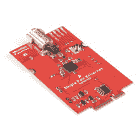](https://www.sparkfun.com/products/19038) 

将**添加到您的[购物车](https://www.sparkfun.com/cart)中！**

### [SparkFun MicroMod 单对以太网功能板——adin 1110](https://www.sparkfun.com/products/19038)

[In stock](https://learn.sparkfun.com/static/bubbles/ "in stock") COM-19038

SparkFun MicroMod 单对以太网功能板将 10BASE-T1L 双线以太网协议引入 SparkFun …

$49.95[Favorited Favorite](# "Add to favorites") 2[Wish List](# "Add to wish list")******** ********### 工具

您需要一把螺丝刀来固定处理器和功能板。要设定充电速率，你需要一个精密螺丝刀(或一个微小的圆形物体)。袖珍螺丝刀是一个很好的选择。对于使用 microSD 卡并希望轻松读取存储卡内容的用户，您需要一个 microSD 卡适配器或 USB 读卡器。

[](https://www.sparkfun.com/products/12891) 

将**添加到您的[购物车](https://www.sparkfun.com/cart)中！**

### [袖珍螺丝刀套装](https://www.sparkfun.com/products/12891)

[In stock](https://learn.sparkfun.com/static/bubbles/ "in stock") TOL-12891

每个黑客都应该拥有什么？没错，一把螺丝刀(你必须以某种方式进入那些箱子)。什么…

$4.505[Favorited Favorite](# "Add to favorites") 24[Wish List](# "Add to wish list")****[](https://www.sparkfun.com/products/13004) 

将**添加到您的[购物车](https://www.sparkfun.com/cart)中！**

### [microSD USB 读卡器](https://www.sparkfun.com/products/13004)

[In stock](https://learn.sparkfun.com/static/bubbles/ "in stock") COM-13004

这是一个很棒的微型 USB 读卡器。只需将您的 microSD 卡滑入 USB 连接器内部，然后将它插入 USB 连接器

$5.5011[Favorited Favorite](# "Add to favorites") 11[Wish List](# "Add to wish list")****[](https://www.sparkfun.com/products/9146) 

将**添加到您的[购物车](https://www.sparkfun.com/cart)中！**

### [SparkFun 迷你螺丝刀](https://www.sparkfun.com/products/9146)

[In stock](https://learn.sparkfun.com/static/bubbles/ "in stock") TOL-09146

这只是你的基本可逆螺丝刀口袋大小！有平头和十字头可供选择。配有别针和…

$1.053[Favorited Favorite](# "Add to favorites") 11[Wish List](# "Add to wish list")****** ******### 推荐阅读

如果你不熟悉 MicroMod 生态系统，我们推荐你阅读这里的[来了解](https://www.sparkfun.com/micromod)的概况。如果你决定利用 Qwiic 连接器，我们推荐阅读[这里的概述](https://www.sparkfun.com/qwiic)。

| [](https://www.sparkfun.com/micromod) | [](https://www.sparkfun.com/qwiic) |
| *[微模式生态系统](https://www.sparkfun.com/micromod)* | *[Qwiic 连接系统](https://www.sparkfun.com/qwiic)* |

如果您不熟悉以下概念，我们也建议您在继续之前先查阅一些教程。请务必查看处理器板和功能板各自的连接指南，以确保安装了正确的 USB 转串行转换器。您可能还需要遵循本教程中未列出的附加说明来安装适当的软件。

[](https://learn.sparkfun.com/tutorials/what-is-an-arduino) [### 什么是 Arduino？](https://learn.sparkfun.com/tutorials/what-is-an-arduino) What is this 'Arduino' thing anyway? This tutorials dives into what an Arduino is and along with Arduino projects and widgets.[Favorited Favorite](# "Add to favorites") 50[](https://learn.sparkfun.com/tutorials/installing-arduino-ide) [### 安装 Arduino IDE](https://learn.sparkfun.com/tutorials/installing-arduino-ide) A step-by-step guide to installing and testing the Arduino software on Windows, Mac, and Linux.[Favorited Favorite](# "Add to favorites") 16[](https://learn.sparkfun.com/tutorials/how-to-install-ch340-drivers) [### 如何安装 CH340 驱动程序](https://learn.sparkfun.com/tutorials/how-to-install-ch340-drivers) How to install CH340 drivers (if you need them) on Windows, Mac OS X, and Linux.[Favorited Favorite](# "Add to favorites") 9[](https://learn.sparkfun.com/tutorials/getting-started-with-micromod) [### MicroMod 入门](https://learn.sparkfun.com/tutorials/getting-started-with-micromod) Dive into the world of MicroMod - a compact interface to connect a microcontroller to various peripherals via the M.2 Connector 3

## 硬件概述

单双主板的整体功能是相同的。在本节中，我们将更多地使用单主板来强调这些功能，因为双主板中也包括这一功能。我们会在必要的时候切换到双主板，以突出只包含在双主板中的功能。

唯一的区别是双主板包括:

*   两个跳线分流器
*   能够添加第二个 MicroMod 功能板
*   纸板的宽度

| [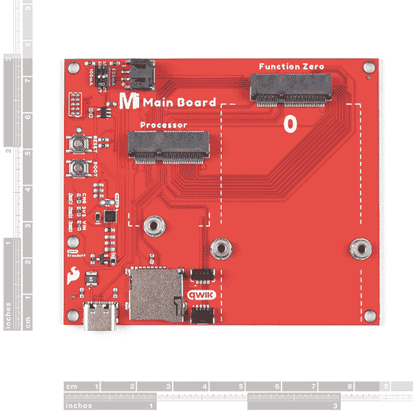](https://cdn.sparkfun.com/assets/learn_tutorials/1/9/9/4/18575-SparkFun_MicroMod_Main_Board_Single-Dimensions.jpg) | [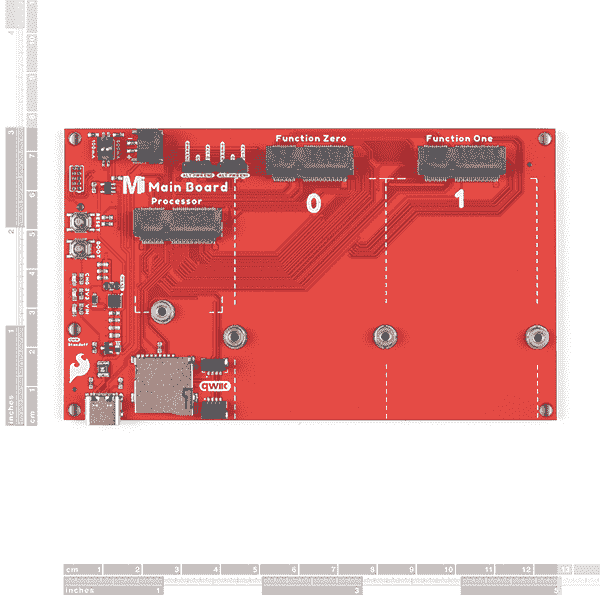](https://cdn.sparkfun.com/assets/learn_tutorials/1/9/9/4/18576-SparkFun_MicroMod_Main_Board_Double-02-Dimensions.jpg) |
| *主板-单次测量* | *主板-双测量
(缩小)* |

### 力量

主板、处理器板和功能板有两种供电方式。

*   通用串行总线
*   单细胞脂肪电池

可以同时将电源连接到 USB 连接器和 LiPo battery 的 JST 连接器。MicroMod 主板具有电源控制电路，可自动选择最佳电源。

### 电源 USB

为电路板供电的一种方法是通过 USB Type C 连接器。您将需要一根 USB 型电缆来为带有 **5V** 电压的电路板供电。连接到板的 USB C 连接器的电源将通过可复位的 PTC 保险丝(额定为 2A 最大值)，然后通过 AP7361C 3.3V 电压调节器(额定为 1A 最大值)。靠近 USB 连接器的绿色小部件是可复位 PTC 保险丝，而方形 IC 是电压调节器。电压调节器接受的电压在 *~3.3V 到 6.0V 之间*

[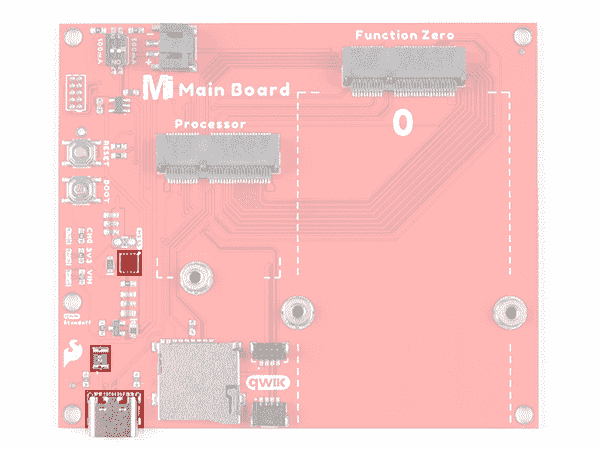](https://cdn.sparkfun.com/assets/learn_tutorials/1/9/9/4/18575-SparkFun_MicroMod_Main_Board_USB_Voltage_Regulator_PTC_Fuse.jpg)

USB Type C 连接器还用于将代码上传到您的处理器板，将[串行数据发送到终端窗口](https://learn.sparkfun.com/tutorials/terminal-basics/arduino-serial-monitor-windows-mac-linux)，或为 LiPo 电池充电。当然，对于便携式电源，你可以连接 USB 电池作为使用 LiPo 电池的替代选择。

连接器通电将点亮 VIN 和 3V3 LED。如果您决定绕过 PTC 保险丝，只需在标有 PTC 的跳线上添加一个焊点即可。还有一个标记为 MEAS 的跳线，用于测量您项目的 3.3V 电压调节器输出端的电流消耗。

### 动力脂肪

另一种选择是将一节单芯 LiPo 电池(即标称 **3.7V** 、 **4.2V** 充满电)连接到 2 针 JST 连接器，如下所示。板上包含一个 MCP73831 充电 IC，可通过 USB Type C 连接器安全地为 LiPo 电池充电。包括一个开关来设置充电率。两个开关都拨到 ON 位置时，充电率可能设置为**~ 166 毫安**。这可能因开关从卷轴拉出时的位置而异。使用精密平头螺丝刀或镊子拨动开关，将充电速率调节至 *100mA* 或 *500mA* 。

[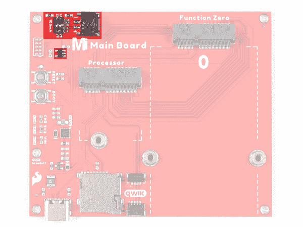](https://cdn.sparkfun.com/assets/learn_tutorials/1/9/9/4/18575-SparkFun_MicroMod_Main_Board_LiPo_JST_Connector_Switch_Charger.jpg)

当来自 LiPo 电池的电压通过 AP7361C 3.3V 电压调节器(额定为 1A 最大值)时，它被向下调节至 **3.3V** 。

**Note:** For more information on proper handling of LiPo batteries, check out the [LilyPad Basics: Powering Your Project - LiPo Battery Safety Care](https://learn.sparkfun.com/tutorials/lilypad-basics-powering-your-project/power-options-rechargeable-lithium-polymer-batteries#lipo_safety_care).

[](https://learn.sparkfun.com/tutorials/lilypad-basics-powering-your-project/power-options-rechargeable-lithium-polymer-batteries#lipo_safety_care)

### MicroMod 处理器板

MicroMod 生态系统允许您根据您的应用轻松更换处理器。标有处理器的 M.2 连接器的位置是连接和固定 MicroMod 处理器板的地方。

[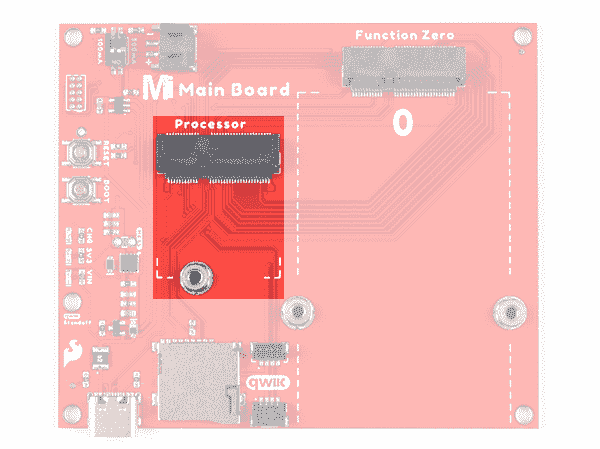](https://cdn.sparkfun.com/assets/learn_tutorials/1/9/9/4/18575-SparkFun-MicroMod_Main_Board_Single_Processor_Board_Mdot2_Connector.jpg)

### 微型模块功能板

除了 MicroMod 处理器的插座之外，还有一个用于 MicroMod 功能板的 M.2 连接器，它允许您向处理器板添加额外的功能。单主板包括用于单个功能板的一个插座，而双主板包括用于多达两个功能板的两个插座。

| [](https://cdn.sparkfun.com/assets/learn_tutorials/1/9/9/4/18575-SparkFun-MicroMod_Main_Board_Single_Function_Board_Mdot2_Connector.jpg) | [](https://cdn.sparkfun.com/assets/learn_tutorials/1/9/9/4/18576-SparkFun-MicroMod_Main_Board_Double_Function_Board_Mdot2_Connectors.jpg) |
| *主板-单功能板插座* | *主板-双功能板插座* |

### 重置和启动按钮

每个板都包括一个复位和启动按钮。复位按钮旁边还有一个复位按钮 PTH。点击重置按钮重启处理器板。点击启动按钮将使处理器板进入特殊的启动模式。根据处理器板的不同，此启动引脚可能无法连接。

[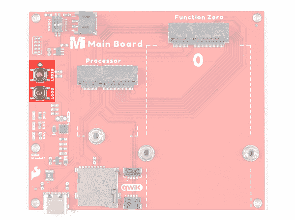](https://cdn.sparkfun.com/assets/learn_tutorials/1/9/9/4/18575-SparkFun-MicroMod_Main_Board_Single_Reset_Boot_Buttons.jpg)

### SWD 引脚

对于高级用户，我们爆出了 [2x5 SWD 编程管脚](https://learn.sparkfun.com/tutorials/arm-programming/jtag-and-swd)。请注意，这不是填充，所以你需要一个[兼容的头和兼容的 JTAG 编程器](https://www.sparkfun.com/categories/tags/jtag)来连接。

[](https://cdn.sparkfun.com/assets/learn_tutorials/1/9/9/4/18575-SparkFun-MicroMod_Main_Board_Single_SWD_Pins.jpg)

### 微型插座

如果您的应用要求您将数据记录并保存到[存储卡](https://www.sparkfun.com/products/15107)中，该板包括一个 microSD 插座。处理器和功能板的主 [SPI 引脚(SDO、SDI、SCK、CS0)](https://learn.sparkfun.com/tutorials/serial-peripheral-interface-spi/all) 连接到 microSD 插座。

[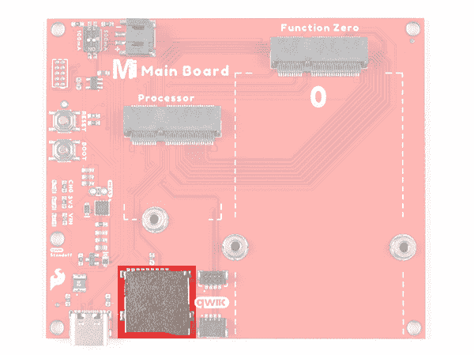](https://cdn.sparkfun.com/assets/learn_tutorials/1/9/9/4/18575-SparkFun_MicroMod_Main_Board_Single_microSD_Card_Socket.jpg)**Note:** Note that the CS pin on the MicroMod Main Board - Single is on **Processor Board's `D1`** while the MicroMod Main Board - Double is on the **Processor Board's `G4`**.

### 发光二极管

板上有三个指示灯:

*   **VIN**-VIN LED 灯亮起，表示 USB 连接器有电。
*   **3V3** -当从 USB 连接器或 LiPo 电池降压后有 3.3V 可用时，3V3 LED 灯亮起。
*   **CHG** -车载黄色 CHG LED 可用于指示电池的**充电状态**。根据充电 IC 的状态，下表列出了其他状态指示器。

| **充电状态** | **LED 状态** |
| 没有电池 | 浮动(应该关闭，但可能闪烁) |
| 关机 | 浮动(应该关闭，但可能闪烁) |
| 充电 | 在…上 |
| 充电完成 | 离开 |

[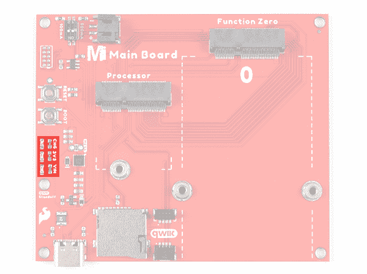](https://cdn.sparkfun.com/assets/learn_tutorials/1/9/9/4/18575-SparkFun_MicroMod_Main_Board_Single_LEDs.jpg)

### 针织套衫

**Note:** If this is your first time working with jumpers, check out the [How to Work with Jumper Pads and PCB Traces](https://learn.sparkfun.com/tutorials/how-to-work-with-jumper-pads-and-pcb-traces/all) tutorial for more information.

单主板和双主板上都包括以下五种跳线。

*   **MEAS** -默认情况下，跳线关闭并位于电路板的顶部。此跳线用于测量系统的电流消耗。您可以切断该跳线的走线，并将 PTH 连接到电流表/万用表，以探测 3.3V 电压调节器的输出。查看我们的[如何使用万用表](https://learn.sparkfun.com/tutorials/how-to-use-a-multimeter#measuring-current)教程，了解更多关于测量电流的信息。
*   **PTC** -默认情况下，跳线是打开的，位于电路板的底部。对于知道你在做什么的高级用户，添加一个焊料滴到跳线，绕过可复位的 PTC 保险丝，从 USB 源拉更多的 2A。
*   **3.3V EN** -默认情况下，该跳线开路，位于电路板底部。闭合该跳线使处理器能够控制 3.3V 总线。
*   **VIN LED** -默认情况下，该跳线关闭，位于电路板底部。切断此迹线以禁用连接到 USB 输入的 LED
*   **3.3V LED** -默认情况下，该跳线闭合，位于电路板底部。切断该走线，禁用连接到 3.3V 电压调节器输出的 LED。

| [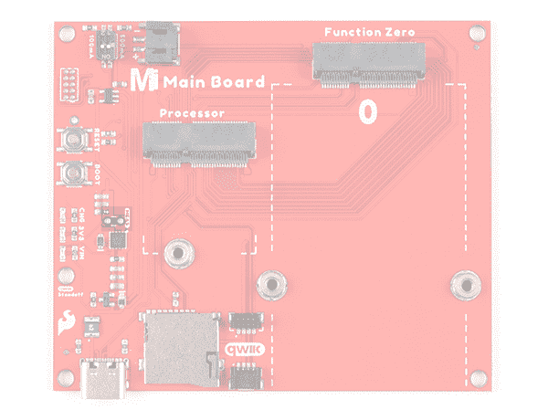](https://cdn.sparkfun.com/assets/learn_tutorials/1/9/9/4/18575-SparkFun_MicroMod_Main_Board_Top_Jumpers.jpg) | [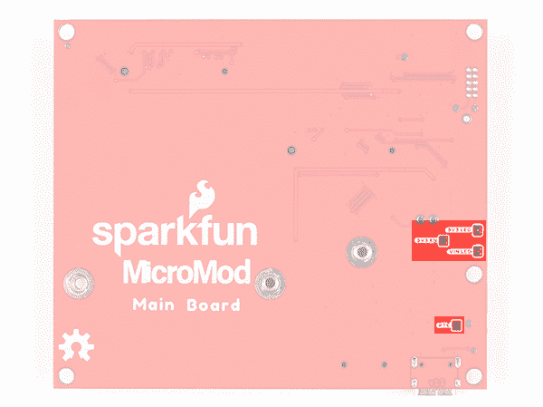](https://cdn.sparkfun.com/assets/learn_tutorials/1/9/9/4/18575-SparkFun-MicroMod_Main_Board_Bottom_Jumpers.jpg) |
| *主板-单根
俯视跳线* | *主板-单根
仰视跳线* |

仅在双主板上包括两个 1x3 公接头，带有 2 针跳线分流器，使用备用处理器 GPIO 引脚为连接到功能 0 和功能 1 的任何功能板启用 3.3V 电压调节器。由于某些处理器的 GPIO 有限，可能无法在某些位置分开，因此主板上提供了替代引脚。 **ALT PWR EN0** 跳线允许用户控制连接到**功能零点**的任何功能板上的 3.3V 电压调节器。当跳线分流器位于 2 针 JST 连接器的左侧时，跳线分流器将 **PWR EN0** 连接到处理器板的 GPIO **G5** 引脚。将跳线分流器移到另一侧，将处理器板的 GPIO **G5** 引脚连接到功能板 1 的 GPIO **G3** 引脚。

[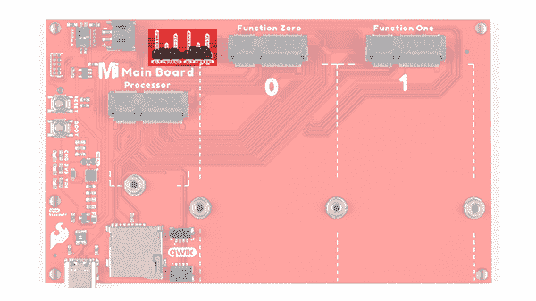](https://cdn.sparkfun.com/assets/learn_tutorials/1/9/9/4/18576-SparkFun-MicroMod_Main_Board_Double_Jumpers.jpg)

当跳线分流器连接 **PWR EN1** 和处理器板的 GPIO **G6** 引脚时， **ALT PWR EN1** 跳线允许用户从连接到**功能一**的任何功能板的 3.3V 电压调节器控制电源。将跳线分流器移到另一侧，将处理器板的 GPIO **G6** 引脚连接到功能板 1 的 GPIO **G4** 引脚。

### Qwiic 和 I ² C

该板包括一个垂直和水平 Qwiic 连接器。这些连接到主 I ² C 总线和处理器和功能板连接器上的 3.3V 电源，使您可以轻松地将支持 Qwiic 的设备添加到您的应用中。

[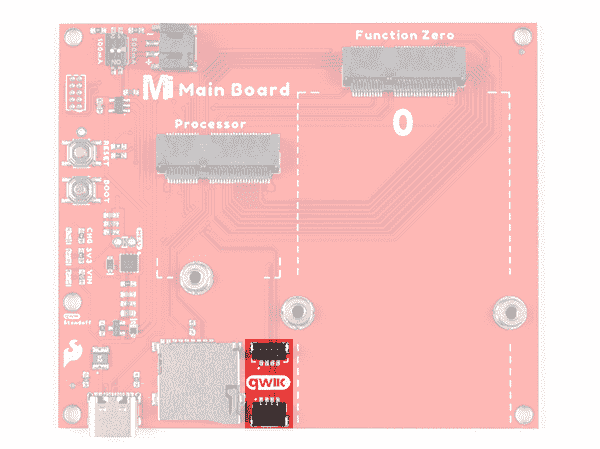](https://cdn.sparkfun.com/assets/learn_tutorials/1/9/9/4/18575-SparkFun_MicroMod_Main_Board_Qwiic_Connectors.jpg)

请注意，具有标准 1.0"x1.0 "尺寸板的 Qwiic 板有两个安装孔。下图中用黑色方块突出显示的是您放置电路板的位置。

[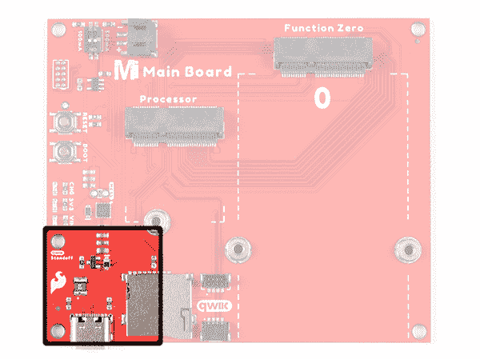](https://cdn.sparkfun.com/assets/learn_tutorials/1/9/9/4/18575-SparkFun_MicroMod_Main_Board_Qwiic_Mounting_Holes.jpg)

### 微型引脚排列

根据您的窗口大小，您可能需要使用表格底部的水平滚动条来查看附加的 pin 功能。请注意，相对两侧的 M.2 连接器引脚相互偏移，如底部引脚所示(未连接)*。主功能下有“-”的引脚没有连接。

*   [MicroMod 主板-单个](#Main_Single)
*   [MicroMod 主板-双](#Main_Double)
*   [MicroMod 通用功能板](#Function)
*   [MicroMod 通用处理器板](#MMGen)
*   [MicroMod 通用引脚描述](#MMDescript)

| **音频** | **UART** | **GPIO/总线** | **I ² C** | **SDIO** 的缩写形式 | **SPI** | **专用** |

| 处理器引脚 | 功能零引脚 | 主板-单个杂项引脚 |
| GND | GND | GND |
| 3.3V | - | 3.3V |
| USB _ D+_ 处理器 | - | USB_D+ |
| 3.3V_EN | - | 3.3V_EN |
| USB _ D-_ 处理器 | - | USB_D- |
| 复位# (I -开漏) | - | 复位# (I -开漏) |
| GND | GND | GND |
| USB_VIN | - | USB_VIN |
| D0 _ 处理器 | 寡霉素敏感比较因子 | - |
| 行李箱(I 型开式排放) | - | 行李箱(I 型开式排放) |
| I2C _ SDA _ 处理器 | I2C SDA | I2C SDA(qw IIC) |
| UART _ RTS _ 处理器 | UART_RTS | - |
| SCL I2C 加工商 | i2c _ scl | SCL I2C |
| UART _ CTS _ 处理器 | UART_CTS | - |
| INT _ 智能 _ 处理器 | I2C 国际机场 | - |
| UART _ TX _ 处理器 | UART_RX | - |
| D1 _ 处理器 | - | SD 卡 CS
(microSD 卡) |
| UART _ RX _ 处理器 | UART_TX | - |
| SWDCK _ 处理器 | - | SWDCK (2x5 标题) |
| SWDIO _ 处理器 | - | SWDCK (2x5 标题) |
| PWM0 _ 处理器 | PWM0 | - |
| GND | GND | GND |
| A0 _ 处理器 | A0 | - |
| USB host _ D+_ 处理器 | USBHOST_D+ | - |
| GND | GND | GND |
| USB host _ D-_ 处理器 | USBHOST_D- | - |
| A1 _ 处理器 | PWR_EN0 | - |
| GND | GND | GND |
| G0 _ 处理器 | 第三子代 | - |
| CAN _ RX _ 处理器 | CAN_TX | - |
| G1 _ 处理器 | 法乐四联症 | - |
| CAN _ TX _ 处理器 | CAN_RX | - |
| G2 _ 处理器 | F5 | - |
| GND | GND | GND |
| G3 _ 处理器 | F6 | - |
| G4 _ 处理器 | F7 | - |
| BATT_VIN / 3 (I - ADC) (0 至 3.3V) | - | BATT_VIN / 3 (I - ADC) (0 至 3.3V) |
| SPI _ CS0 _ 处理器 | 子一代 | - |
| SPI _ SCK _ 处理器 | SPI | SPI_SCK
(microSD 卡) |
| SPI _ DI _ 处理器 | SPI_DO | SPI_DO
(microSD 卡) |
| SPI _ DO _ 处理器 | spi _ 自 | SPI_DI
(microSD 卡) |
| SDIO _ 数据 2 _ 处理器 | PWR_EN0 | - |

| 处理器引脚 | 功能零引脚 | 功能一引脚 | 主板-双杂项引脚 |
| GND | GND | GND | GND |
| 3.3V | - | - | 3.3V |
| USB _ D+_ 处理器 | - | - | USB_D+ |
| 3.3V_EN | - | - | 3.3V_EN |
| USB _ D-_ 处理器 | - | - | USB_D- |
| 复位# (I -开漏) | - | - | 复位# (I -开漏) |
| GND | GND | GND | GND |
| - | - | - | - |
| USB_VIN | - | - | USB_VIN |
| D0 _ 处理器 | 寡霉素敏感比较因子 | - | - |
| 行李箱(I 型开式排放) | - | - | 行李箱(I 型开式排放) |
| I2C _ SDA _ 处理器 | I2C SDA | I2C SDA | I2C SDA(qw IIC) |
| UART1 _ RTS _ 处理器 | UART_RTS | (无流量控制) | - |
| SCL I2C 加工商 | i2c _ scl | i2c _ scl | SCL I2C |
| UART _ CTS _ 处理器 | UART_CTS | (无流量控制) | - |
| INT _ 智能 _ 处理器 | I2C 国际机场 | I2C 国际机场 | - |
| UART1 _ TX _ 处理器 | UART_RX | - | - |
| D1 _ 处理器 | - | 寡霉素敏感比较因子 | - |
| UART1 _ RX _ 处理器 | UART_TX | - | - |
| UART2 _ RX _ 处理器 | - | UART_TX | - |
| SWDCK _ 处理器 | - | - | SWDCK (2x5 标题) |
| UART2 _ TX _ 处理器 | - | UART_RX | - |
| SWDIO _ 处理器 | - | - | SWDCK (2x5 标题) |
| PWM0 _ 处理器 | 脉宽调制（pulse-width modulating 的缩写） | - | - |
| GND | GND | GND | GND |
| A0 _ 处理器 | A0 | - | - |
| USB host _ D+_ 处理器 | USBHOST_D+ | (无 USB 主机) | - |
| GND | GND | GND | GND |
| USB host _ D-_ 处理器 | USBHOST_D- | (无 USB 主机) | - |
| A1 _ 处理器 | - | A0 | - |
| GND | GND | GND | GND |
| G0 _ 处理器 | 第三子代 | - | - |
| CAN _ RX _ 处理器 | CAN_TX | (没有 CAN 总线) | - |
| G1 _ 处理器 | 法乐四联症 | - | - |
| CAN _ TX _ 处理器 | CAN_RX | (没有 CAN 总线) | - |
| G2 _ 处理器 | F5 | - | - |
| GND | GND | GND | GND |
| G3 _ 处理器 | F6 | - | - |
| PWM1 _ 处理器 | - | 脉宽调制（pulse-width modulating 的缩写） | - |
| G4 _ 处理器 | F7 | - | SD 卡 CS
(microSD 卡) |
| BATT_VIN / 3 (I - ADC) (0 至 3.3V) | - | - | BATT_VIN / 3 (I - ADC) (0 至 3.3V) |
| - | - | - | - |
| - | - | - | - |
| - | - | - | - |
| - | - | - | - |
| - | - | - | - |
| SPI _ CS0 _ 处理器 | 子一代 | - | - |
| - | - | - | - |
| SPI _ SCK _ 处理器 | SPI | SPI | SPI_SCK
(microSD 卡) |
| - | - | - | - |
| SPI _ DI _ 处理器 | SPI_DO | SPI_DO | SPI_DO
(microSD 卡) |
| CLK SDIO 加工商 | - | F7 | - |
| SPI _ DO _ 处理器 | spi _ 自 | spi _ 自 | SPI_DI
(microSD 卡) |
| SDIO CMD 处理器 | - | F6 | - |
| - | - | - | - |
| - | - | - | - |
| - | - | - | - |
| SDIO _ 数据 1 _ 处理器 | - | PWR_EN1 | - |
| - | - | - | - |
| SDIO _ 数据 2 _ 处理器 | PWR_EN0 | - | - |
| G7 _ 处理器 | - | F5 | - |
| SPI _ CS1 _ 处理器 | - | SPI_CS1 | - |
| G6 _ 处理器 | - | 法乐四联症 | - |
| - | - | - | - |

| 替代
功能 | 主要
功能 | 底部
销 | 顶部
销 | 主要
功能 | 替代
功能 |
|  |  | (未连接) | **75** | GND |  |
|  | 车辆识别号码 | **74** | **73** | 3.3V |  |
|  | 车辆识别号码 | **72** | **71** | powermen(消歧义) |  |
|  | - | **70** | **69** | - |  |
|  | - | **66** | **65** | - |  |
|  | - | **64** | **63** | - |  |
|  | - | **62** | **61** | F7 |  |
|  | - | **60** | **59** | F6 |  |
|  | - | **58** | **57** | F5 |  |
|  | - | **56** | **55** | 法乐四联症 |  |
|  | - | **54** | **53** | 第三子代 |  |
|  | - | **52** | **51** | 第二子代 | 脉宽调制（pulse-width modulating 的缩写） |
|  | - | **50** | **49** | 子一代 | SPI_CS0 |
|  | - | **48** | **47** | 寡霉素敏感比较因子 | （同 Internationalorganizations）国际组织 |
|  | - | **46** | **45** | GND |  |
|  | - | **44** | **43** | CAN_TX |  |
|  | - | **42** | **41** | CAN_RX |  |
|  | - | **40** | **39** | GND |  |
|  | A0 | **38** | **37** | USBHOST_D- |  |
|  | EEPROM_A0 | **36** | **35** | USBHOST_D+ |  |
|  | EEPROM_A1 | **34** | **33** | GND |  |
|  | EEPROM_A2 | **32** | **31** | 模块密钥 |  |
|  | 模块密钥 | **30** | **29** | 模块密钥 |  |
|  | 模块密钥 | **28** | **27** | 模块密钥 |  |
|  | 模块密钥 | **26** | **25** | 模块密钥 |  |
|  | 模块密钥 | **24** | **23** | I2C 国际机场 |  |
|  | - | **22** | **21** | i2c _ scl |  |
|  | - | **20** | **19** | I2C SDA |  |
|  | UART_CTS | **18** | **17** | - |  |
|  | UART_RTS | **16** | **15** | UART_RX |  |
|  | - | **14** | **13** | UART_TX |  |
|  | - | **12** | **11** | - |  |
|  | - | **10** | **9** | - |  |
|  | - | **8** | **7** | SPI_SDO |  |
|  | - | **6** | **5** | SPI_SDI |  |
|  | - | **4** | **3** | SPI |  |
|  | - | **2** | **1** | GND |  |

| 替代功能 | 替代功能 | 替代功能 | 基函数 | 底部
销 | 顶部
销 | 基函数 | 替代功能 | 替代功能 | 替代功能 |
|  |  |  | (未连接) |  | **75** | GND |  |  |  |
|  |  |  | 3.3V | **74** | **73** | G5 /总线 5 |  |  |  |
|  |  |  | RTC _ 3V _ 电池 | **72** | **71** | G6 /总线 6 |  |  |  |
|  |  | SPI_CS1# | SDIO _ 数据 3(输入输出) | **70** | **69** | G7 /总线 7 |  |  |  |
|  |  |  | SDIO _ 数据 2(输入输出) | **68** | **67** | 八国集团(Group of Eight) |  |  |  |
|  |  |  | SDIO _ 数据 1(输入输出) | **66** | **65** | G9 | ADC_D- | CAM_HSYNC |  |
|  |  | 睡吧 | SDIO _ 数据 0(输入输出) | **64** | **63** | G10 | ADC_D+ | CAM_VSYNC |  |
|  |  | SPI COPI1 | SDIO_CMD (I/O) | **62** | **61** | 睡吧 |  |  |  |
|  |  | SPI SCK1 | SDIO_SCK(或) | **60** | **59** | SPI_COPI (O) | LED_DAT |  |  |
|  |  |  | AUD_MCLK (O) | **58** | **57** | SPI_SCK(或) | LED |  |  |
| 凯姆 | PCM_OUT | I2S 出局 | AUD_OUT | **56** | **55** | SPI_CS# |  |  |  |
| cam _ pclk | PCM_IN | I2S 因 | 澳元 _ 美元 | **54** | **53** | I2C_SCL1(输入/输出) |  |  |  |
| PDM_DATA | PCM_SYNC | i2s WS | AUD_LRCLK | **52** | **51** | I2C_SDA1(输入输出) |  |  |  |
| PDM_CLK | PCM_CLK | SCK i2s | 奥德 _BCLK | **50** | **49** | BATT_VIN / 3 (I - ADC) (0 至 3.3V) |  |  |  |
|  |  |  | G4 /总线 4 | **48** | **47** | PWM1 |  |  |  |
|  |  |  | G3 /总线 3 | **46** | **45** | GND |  |  |  |
|  |  |  | G2 /总线 2 | **44** | **43** | CAN_TX |  |  |  |
|  |  |  | G1 /巴士 1 | **42** | **41** | CAN_RX |  |  |  |
|  |  |  | G0 /总线 0 | **40** | **39** | GND |  |  |  |
|  |  |  | 一流的 | **38** | **37** | USBHOST_D- |  |  |  |
|  |  |  | GND | **36** | **35** | USBHOST_D+ |  |  |  |
|  |  |  | A0 | **34** | **33** | GND |  |  |  |
|  |  |  | PWM0 | **32** | **31** | 模块密钥 |  |  |  |
|  |  |  | 模块密钥 | **30** | **29** | 模块密钥 |  |  |  |
|  |  |  | 模块密钥 | **28** | **27** | 模块密钥 |  |  |  |
|  |  |  | 模块密钥 | **26** | **25** | 模块密钥 |  |  |  |
|  |  |  | 模块密钥 | **24** | **23** | SWDIO |  |  |  |
|  |  |  | UART_TX2 (O) | **22** | **21** | SWDCK |  |  |  |
|  |  |  | UART_RX2 (I) | **20** | **19** | UART_RX1 (I) |  |  |  |
|  |  | CAM_TRIG | D1 | **18** | **17** | UART_TX1 (0) |  |  |  |
|  |  |  | I2C INT # | **16** | **15** | UART_CTS1 (I) |  |  |  |
|  |  |  | S7-1200 可编程控制器 | **14** | **13** | UART_RTS1 (O) |  |  |  |
|  |  |  | I2C SDA(输入/输出) | **12** | **11** | 行李箱(I 型开式排放) |  |  |  |
|  |  |  | D0 | **10** | **9** | USB_VIN |  |  |  |
|  |  | 浅部白色甲癣 | G11 | **8** | **7** | GND |  |  |  |
|  |  |  | 复位# (I -开漏) | **6** | **5** | USB_D- |  |  |  |
|  |  |  | 3.3V_EN | **4** | **3** | USB_D+ |  |  |  |
|  |  |  | 3.3V | **2** | **1** | GND |  |  |  |

| 信号群 | 信号 | 输入－输出 | 描述 | 电压 |
| 力量 | 3.3V | 我 | 3.3V 电源 | 3.3V |
| GND |  | 返回电流路径 | 0V |
| USB_VIN | 我 | USB VIN 符合 USB 2.0 规范。连接到处理器板上要求 5V USB 功能的引脚 | 4.8-5.2V |
| RTC _ 3V _ 电池 | 我 | 3V 由外部纽扣电池或迷你电池提供。最大功耗=100μA，连接到引脚，在掉电期间保持 RTC。可以左 NC。 | 3V |
| 3.3V_EN | O | 控制载板的主电压调节器。1V 以上的电压将启用 3.3V 电源路径。 | 3.3V |
| BATT_VIN/3 | 我 | 载板原始电压超过 3。1/3 电阻分压器在载板上实现。根据需要放大整个 0-3.3V 范围的模拟信号 | 3.3V |
| 重置 | 重置 | 我 | 处理器的输入。处理器板上带上拉电阻的开漏。拉低复位处理器。 | 3.3V |
| 靴子 | 我 | 处理器的输入。处理器板上带上拉电阻的开漏。拉低使处理器进入特殊启动模式。可以左 NC。 | 3.3V |
| 通用串行总线 | USB_D | 输入－输出 | USB 数据。符合 USB 2.0 规范的差分串行数据接口。如果编程需要 UART，USB 必须连接到处理器板上的 USB 转串行转换 IC。 |  |
| USB 主机 | USBHOST_D | 输入－输出 | 对于支持 USB 主机模式的处理器。USB 数据。符合 USB 2.0 规范的差分串行数据接口。可以左 NC。 |  |
| 能 | CAN_RX | 我 | CAN 总线接收数据。 | 3.3V |
| CAN_TX | O | CAN 总线传输数据。 | 3.3V |
| 通用非同步收发传输器(Universal Asynchronous Receiver/Transmitter) | UART_RX1 | 我 | UART 接收数据。 | 3.3V |
| UART_TX1 | O | UART 发送数据。 | 3.3V |
| UART_RTS1 | O | UART 准备发送。 | 3.3V |
| UART_CTS1 | 我 | UART 清零发送。 | 3.3V |
| UART_RX2 | 我 | 第二个 UART 接收数据。 | 3.3V |
| UART_TX2 | O | 第二个 UART 发送数据。 | 3.3V |
| I2C | i2c _ scl | 输入－输出 | I ² C 时钟。载板上拉的开漏。 | 3.3V |
| I2C SDA | 输入－输出 | I ² C 数据。载板上有上拉电阻的开漏 | 3.3V |
| I2C INT # | 我 | 从载板到处理器的中断通知。载板上拉的开漏。低电平有效 | 3.3V |
| I2C_SCL1 号文件 | 输入－输出 | 2nd I ² C 时钟。载板上拉的开漏。 | 3.3V |
| I2C sda 1 | 输入－输出 | 2nd I ² C 数据。载板上拉的开漏。 | 3.3V |
| 精力 | SPI_COPI | O | SPI 控制器输出/外设输入。 | 3.3V |
| 睡吧，婊子 | 我 | SPI 控制器输入/外设输出。 | 3.3V |
| SPI | O | SPI 时钟。 | 3.3V |
| SPI_CS# | O | SPI 片选。低电平有效。如果不使用硬件 CS，可以路由到 GPIO。 | 3.3V |
| SPI/SDIO | SPI_SCK1/SDIO_CLK | O | 第二个 SPI 时钟。次要用途是 SDIO 钟。 | 3.3V |
| SPI_COPI1/SDIO_CMD | 输入－输出 | 第二 SPI 控制器输出/外设输入。次要用途是 SDIO 命令界面。 | 3.3V |
| spi _ 塞浦路斯 1/SDIO_DATA0 | 输入－输出 | 第二个 SPI 外设输入/控制器输出。次要用途是 SDIO 数据交换位 0。 | 3.3V |
| SDIO_DATA1 | 输入－输出 | SDIO 数据交换位 1。 | 3.3V |
| SDIO_DATA2 | 输入－输出 | SDIO 数据交换位 2。 | 3.3V |
| SPI _ CS1/SDIO _ 数据 3 | 输入－输出 | 第二个 SPI 芯片选择。次要用途是 SDIO 数据交换位 3。 | 3.3V |
| 声音的 | 奥地利马克 | O | 音频主时钟。 | 3.3V |
| AUD _ OUT/PCM _ OUT/i2s _ OUT/CAM _ MCLK | O | 音频数据输出。PCM 同步数据输出。I2S 串行数据输出。相机主时钟。 | 3.3V |
| 澳大利亚/PCM _ IN/i2s _ IN/卡姆 _PCLK | 我 | 音频数据输入。PCM 同步数据输入。I2S 串行数据输入。照相机外围时钟。 | 3.3V |
| AUD _ LRC lk/PCM _ SYNC/i2s _ WS/PDM _ DATA | 输入－输出 | 音频左/右时钟。PCM 同步数据同步。I2S 单词精选。PDM 数据。 | 3.3V |
| 澳大利亚 BCLK/CLK PCM/CLK i2s/CLK PDM | O | 音频位时钟。PCM 时钟。I2S 连续串行时钟。PDM 时钟。 | 3.3V |
| 社署 | SWDIO | 输入－输出 | 串行线调试 I/O。如果处理器板支持 SWD，则连接。可以左 NC。 | 3.3V |
| SWDCK | 我 | 串行线调试时钟。如果处理器板支持 SWD，则连接。可以左 NC。 | 3.3V |
| 物理输出核心 | A0 | 我 | 模数转换器 0。根据需要放大模拟信号，以实现完整的 0-3.3V 范围。 | 3.3V |
| 一流的 | 我 | 模数转换器 1。根据需要放大模拟信号，以实现完整的 0-3.3V 范围。 | 3.3V |
| 脉宽调制（pulse-width modulating 的缩写） | PWM0 | O | 脉宽调制输出 0。 | 3.3V |
| PWM1 | O | 脉宽调制输出 1。 | 3.3V |
| 数字的 | D0 | 输入－输出 | 通用数字输入/输出引脚。 | 3.3V |
| D1/CAM_TRIG | 输入－输出 | 通用数字输入/输出引脚。相机触发器。 | 3.3V |
| 常规/公共汽车 | G0/总线 0 | 输入－输出 | 通用引脚。任何未使用的处理器引脚都应分配给 Gx，具有 ADC + PWM 功能的引脚优先(0、1、2 等。)岗位。目的是保证各 ADC/PWM/数字引脚上的 PWM、ADC 和数字引脚功能。Gx 引脚不保证 ADC/PWM 功能。另一种用途是引脚可以支持快速读/写 8 位或 4 位宽总线。 | 3.3V |
| G1/巴士 1 | 输入－输出 | 3.3V |
| G2/总线 2 | 输入－输出 | 3.3V |
| G3/总线 3 | 输入－输出 | 3.3V |
| G4/总线 4 | 输入－输出 | 3.3V |
| G5/总线 5 | 输入－输出 | 3.3V |
| g6/总线 6 | 输入－输出 | 3.3V |
| G7/总线 7 | 输入－输出 | 3.3V |
| 八国集团(Group of Eight) | 输入－输出 | 通用引脚 | 3.3V |
| G9/ADC_D-/CAM_HSYNC | 输入－输出 | 差分 ADC 输入(如有)。相机水平同步。 | 3.3V |
| G10/ADC_D+/CAM_VSYNC | 输入－输出 | 差分 ADC 输入(如有)。相机垂直同步。 | 3.3V |
| G11/SWO | 输入－输出 | 通用引脚。串行线输出 | 3.3V |

### 电路板尺寸

MicroMod 主板的板尺寸-单为 2.90 英寸 x 3.40 英寸，而 MicroMod 主板-双为 2.90 英寸 x 4.90 英寸。两块板都包括 5 个安装孔。四个位于每个板的边缘。第五个安装孔距离另一个安装孔 0.80 英寸，用于安装具有标准 1.0 英寸 x1.0 英寸尺寸主板的支持 Qwiic 的主板。

| [](https://cdn.sparkfun.com/assets/e/d/5/0/1/SparkFun_Main_Board_Single_Board_Dimensions.png) | [](https://cdn.sparkfun.com/assets/5/f/6/d/4/SparkFun_MicroMod_Main_Board_Double_Board_Dimensions.png) |
| *MicroMod 主板-单个* | *MicroMod 主板-双* |

**Note:** You'll notice that the Main Boards have the USB C connector, microSD card socket, and Qwiic connector on one side of the board. This is part of the design for users deciding to place the MicroMod Main Board in an enclosure. The JST connector for the LiPo battery is facing in toward the board is also part of the design. Users can insert a LiPo battery and have its wires neatly tucked into their enclosure.

## 硬件连接

如果您还没有，请务必查看【MicroMod 入门:硬件连接以获取有关将处理器和功能板插入主板的信息。

[](https://learn.sparkfun.com/tutorials/getting-started-with-micromod) [### MicroMod 入门

#### 2020 年 10 月 21 日](https://learn.sparkfun.com/tutorials/getting-started-with-micromod) Dive into the world of MicroMod - a compact interface to connect a microcontroller to various peripherals via the M.2 Connector 3

### 通用串行总线

要对主板进行编程和供电，您需要将 USB-C 电缆插入 USB 连接器。将处理器或功能板连接到主板时，我们会将另一端断开。

当电路板固定后，将另一端插入计算机。完成处理器编程后，您可以通过 USB 连接器使用 USB 电池，或者通过 JST 连接器使用 LiPo 电池为主板供电。

### 处理器板

将处理器板的键与其 M.2 连接器的插槽对齐。以一定角度(~ 25°)插入主板，向下推，拧紧螺丝。在这种情况下，我们将 MicroMod Artemis 处理器板固定在 M.2 连接器插座中。根据您的应用，您可能有不同的处理器板。

### 功能板

将功能板的键对准其 M.2 连接器的插座。以一个角度(~ 25°)插入主板，向下推，并拧紧其中一个螺钉以压住主板。将第二颗螺丝固定在电路板的另一侧。电路板对齐后，完全拧紧两个螺钉以固定电路板。在这种情况下，我们将环境功能板固定在 M.2 连接器插座中。根据您的应用，您可能有不同的功能板。

[](https://cdn.sparkfun.com/assets/learn_tutorials/1/9/9/4/SparkFun_MicroMod_Main_Board_-Single_Processor_and_Function_Board_Environmental.jpg)

如果您决定在主板上安装两块功能板，我们建议您先拧紧两块功能板之间的螺钉，使它们保持固定，然后再将其余的螺钉安装在功能板的两侧。在这种情况下，我们将 WiFi 功能板和环境功能板固定在 M.2 连接器插座中。根据您的应用，您可能有不同的功能板。

[](https://cdn.sparkfun.com/assets/learn_tutorials/1/9/9/4/SparkFun_MicroMod_Main_Board_-Double_Processor_and_Function_Boards.jpg)

### 单细胞脂肪电池

**Note:** You may notice a film that is covering over the switch. This is used by the pick and place machine to pick the component up from the reel and place it on the PCB. You will need to peel the film back to access the switches and adjust the charge rate.

需要一个[精密平头](https://www.sparkfun.com/products/12891)(或者一个微小的圆形物体)来为你的单节脂肪电池设定充电速率。当 500mA 侧的开关拨到 ON 位置时，充电率将为 **500mA** 。当开关拨到 100mA 侧的 ON 位置时，充电率将为 **100mA** 。当 100mA 和 500mA 侧的开关都拨到 ON 位置时，充电率将为 **166mA** 。

[](https://cdn.sparkfun.com/assets/learn_tutorials/1/9/9/4/SparkFun_MicroMod_Main_Board_LiPo_Charge_Rate_DIP_Switch.jpg)

对于移动应用，将单节 LiPo 电池连接到 2 针 JST 连接器。当电池电量不足时，将 USB 电缆连接到 USB 端口或充电器，开始充电。

[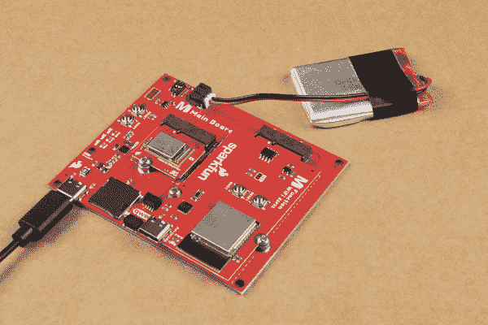](https://cdn.sparkfun.com/assets/learn_tutorials/1/9/9/4/SparkFun_MicroMod_Main_Board_LiPo_Battery.jpg)

要移除 LiPo 电池，您可以将白色 JST 连接器从插座中拔出，同时用拇指和食指左右晃动连接器。

**Note:** For more information on proper handling of LiPo batteries, check out the [LilyPad Basics: Powering Your Project - LiPo Battery Safety Care](https://learn.sparkfun.com/tutorials/lilypad-basics-powering-your-project/power-options-rechargeable-lithium-polymer-batteries#lipo_safety_care).

[](https://learn.sparkfun.com/tutorials/lilypad-basics-powering-your-project/power-options-rechargeable-lithium-polymer-batteries#lipo_safety_care)

### 支持 Qwiic 的设备

要 Qwiic-ly 连接 I ² C 设备，只需在 MicroMod 主板的一个 Qwiic 端口和您的 Qwiic 设备之间插入一根 Qwiic 电缆。

[](https://cdn.sparkfun.com/assets/learn_tutorials/1/9/9/4/SparkFun_MicroMod_Main_Board_Qwiic_Board.jpg)

如果您需要将支持 Qwiic 的板安装到 MicroMod 主板上，您可以抓住一些[支架](https://www.sparkfun.com/categories/257)并使用 USB Type C 连接器附近的两个安装孔安装标准 Qwiic 1.0"x1.0 "尺寸的板。将支架放在电路板之间，拧紧螺丝进行安装。下图使用了带有内置螺纹的支架。

[](https://cdn.sparkfun.com/assets/learn_tutorials/1/9/9/4/SparkFun_MicroMod_Main_Board_Qwiic_Mounted_Board.jpg)

### 微型 sd 卡

断开主板电源，将 [microSD 卡](https://www.sparkfun.com/categories/351)(针脚朝向主板)插入插座。你会听到一声清脆的卡嗒声，表示 microSD 卡已锁定到位。

[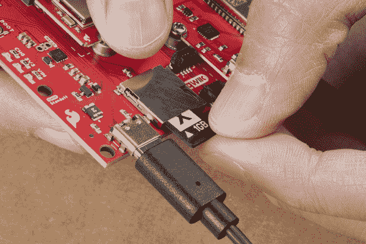](https://cdn.sparkfun.com/assets/learn_tutorials/1/9/9/4/SparkFun_MicroMod_Main_Board_MicroSD_Card.jpg)

要移除，请确保电源关闭，然后将 microSD 卡按入插槽以弹出。您将听到一声清脆的卡嗒声，表示卡已准备好从插座中拔出。

## 软件安装

**Note:** This example assumes you are using the latest version of the Arduino IDE on your desktop. If this is your first time using Arduino, please review the following tutorials.

*   [安装 Arduino IDE](https://learn.sparkfun.com/tutorials/installing-arduino-ide)
*   [在 Arduino IDE 中安装板卡定义](https://learn.sparkfun.com/tutorials/installing-board-definitions-in-the-arduino-ide)
*   [安装 Arduino 库](https://learn.sparkfun.com/tutorials/installing-an-arduino-library)

### Arduino 板定义和驱动程序

我们假设您已经为处理器板安装了必要的板文件和驱动程序。在这种情况下，我们使用 MicroMod Artemis 处理器板，它使用 CH340 USB 转串行转换器。如果您使用的是处理器板，请务必查看处理器板的连接指南。

[](https://learn.sparkfun.com/tutorials/installing-board-definitions-in-the-arduino-ide) [### 在 Arduino IDE 中安装电路板定义

#### 2020 年 9 月 9 日](https://learn.sparkfun.com/tutorials/installing-board-definitions-in-the-arduino-ide) How do I install a custom Arduino board/core? It's easy! This tutorial will go over how to install an Arduino board definition using the Arduino Board Manager. We will also go over manually installing third-party cores, such as the board definitions required for many of the SparkFun development boards.[Favorited Favorite](# "Add to favorites") 3[](https://learn.sparkfun.com/tutorials/micromod-artemis-processor-board-hookup-guide) [### MicroMod Artemis 处理器板连接指南

#### 2020 年 10 月 21 日](https://learn.sparkfun.com/tutorials/micromod-artemis-processor-board-hookup-guide) Get started with the Artemis MicroMod Processor Board in this tutorial 0[](https://learn.sparkfun.com/tutorials/how-to-install-ch340-drivers) [### 如何安装 CH340 驱动程序

#### 2019 年 8 月 6 日](https://learn.sparkfun.com/tutorials/how-to-install-ch340-drivers) How to install CH340 drivers (if you need them) on Windows, Mac OS X, and Linux.[Favorited Favorite](# "Add to favorites") 9

## Arduino 示例

我们先来看几个基本的例子，入门 MicroMod 主板单双。我们将切换 3.3V 电压调节器，并将数据记录到两块板上的 microSD 卡中。

### 示例 1: MicroMod 主板-单使能功能板

如果您还没有，选择您的板(在这种情况下是 **MicroMod Artemis** )和相关的 COM 端口。将下面的代码复制并粘贴到 Arduino IDE 中。点击上传按钮，将串行监视器设置为 **115200** 波特。

```
language:c
/******************************************************************************

  WRITTEN BY: Ho Yun "Bobby" Chan
  @ SparkFun Electronics
  DATE: 10/19/2021
  GITHUB REPO: https://github.com/sparkfun/SparkFun_MicroMod_Main_Board_Single
  DEVELOPMENT ENVIRONMENT SPECIFICS:
    Firmware developed using Arduino IDE v1.8.12

  ========== DESCRIPTION==========
  This example code toggles the Function Board's AP2112 3.3V voltage 
  regulator's enable pin. The Function Boards built-in power LED should blink.
  This example is based on Arduino's built-in Blink Example:

      https://www.arduino.cc/en/Tutorial/BuiltInExamples/Blink

  Note that this example code uses the MicroMod Main Board - Single. The MicroMod
  Main Board - Double routes the PWR_EN# pins slightly different for the
  two function boards. 

  ========== HARDWARE CONNECTIONS ==========
  MicroMod Artemis Processor Board => MicroMod Main Board - Single => Function Board

  Feel like supporting open source hardware?
  Buy a board from SparkFun!
       MicroMod Artemis Processor Board - https://www.sparkfun.com/products/16401
       MicroMod Main Board - Single - https://www.sparkfun.com/products/18575
       MicroMod Environmental Function Board - https://www.sparkfun.com/products/18632

  LICENSE: This code is released under the MIT License (http://opensource.org/licenses/MIT)

******************************************************************************/

/*Define the power enable pins for the processor board with either SDIO_DATA2 or A1.
  Depending on the processor board, the Arduino pin may be different. 

  Note: Certain Processor Boards like the Artemis have SDIO_Data2 and A1 available
        to control the Function Board's voltage regulator. SAMD51, ESP32, and STM32
        Processor Board pins do not have SDIO Data 2, so users will need to reference
        the Processor Pin A1\. Below are a few examples. */

//ARTEMIS
#define PWR_EN0 4   //Function Board 0's "PWR_EN0" pin <= MicroMod SDIO_DATA2 => Artemis Processor Board (D4)
//Alternative option that does the same thing. Make sure to just choose one for PWR_EN0
//#define PWR_EN0 35   //Function Board 0's "PWR_EN0" pin <= MicroMod A1 => Artemis Processor Board (A35)

//TEENSY
//#define PWR_EN0 15   //Function Board 0's "PWR_EN0" pin <= MicroMod A1 => Teensy Processor Board (A1)

//SAMD51
//#define PWR_EN0 18   //Function Board 0's "PWR_EN0" pin <= MicroMod A1 => SAMD51 Processor Board (18)

void setup() {
  // initialize the digital pin as an output.
    pinMode(PWR_EN0, OUTPUT);
}

void loop() {
  digitalWrite(PWR_EN0, HIGH); // turn the 3.3V regulator on (HIGH is the voltage level)
  delay(5000);                 // wait for a few seconds to do something with the function boards

  digitalWrite(PWR_EN0, LOW);  // turn the 3.3V regulator off by making the voltage LOW
  delay(5000);                 // wait for a few seconds before turning function boards back on

} 
```

上传后，看看你的功能板的 PWR LED。LED 将点亮约 5 秒钟，然后再熄灭 5 秒钟。它将继续重复，直到电源从 MicroMod 主板上移除-单。

### 示例 2: MicroMod 主板-双使能功能板

如果您还没有，选择您的板(在这种情况下是 **MicroMod Artemis** )和相关的 COM 端口。将下面的代码复制并粘贴到 Arduino IDE 中。点击上传按钮，将串行监视器设置为 **115200** 波特。

```
language:c
/******************************************************************************

  WRITTEN BY: Ho Yun "Bobby" Chan
  @ SparkFun Electronics
  DATE: 10/19/2021
  GITHUB REPO: https://github.com/sparkfun/SparkFun_MicroMod_Main_Board_Double
  DEVELOPMENT ENVIRONMENT SPECIFICS:
    Firmware developed using Arduino IDE v1.8.12

  ========== DESCRIPTION==========
  This example code toggles the Function Board's AP2112 3.3V voltage
  regulator's enable pin. The Function Boards built-in power LED should blink.
   This example is based on Arduino's built-in Blink Example:

      https://www.arduino.cc/en/Tutorial/BuiltInExamples/Blink

  Note that this example code uses the MicroMod Main Board - Double. The MicroMod
  Main Board - Single routes the PWR_EN0 pin slightly different for the
  function board. 

  ========== HARDWARE CONNECTIONS ==========
  MicroMod Artemis Processor Board => MicroMod Main Board - Double => Function Boards

  Feel like supporting open source hardware?
  Buy a board from SparkFun!
       MicroMod Artemis Processor Board - https://www.sparkfun.com/products/16401
       MicroMod Main Board - Double - https://www.sparkfun.com/products/18576
       MicroMod Environmental Function Board - https://www.sparkfun.com/products/18632

  LICENSE: This code is released under the MIT License (http://opensource.org/licenses/MIT)

******************************************************************************/

/*Define the power enable pins for the processor board with SDIO_DATA2.
  Depending on the processor board, the Arduino pin may be different. 

  Note: Certain Processor Boards like the Artemis have more than one pin available 
        to control the Function Board's voltage regulator (e.g. SDIO_DATA2 and G5).
        SAMD51, ESP32, and STM32 Processor Board pins do not have SDIO Data 2, so
        users will need to reference the Processor Pin G5\. Below are a few examples. */

//ARTEMIS
#define PWR_EN0 4    //Function Board 0's "PWR_EN0" pin <= MicroMod SDIO_DATA2 => Artemis Processor Board (D4)  
#define PWR_EN1 26   //Function Board 1's "PWR_EN1" pin <= MicroMod SDIO_DATA1 => Artemis Processor Board (D26)

//Alternative option that does the same thing. Make sure to just choose one for PWR_EN0 and PWR_EN1
//#define PWR_EN0 29   //Function Board 0's "PWR_EN0" pin <= MicroMod G5 => Artemis Processor Board (A29)
//#define PWR_EN1 14   //Function Board 1's "PWR_EN0" pin <= MicroMod G6 => Artemis Processor Board (D14)

//TEENSY
//#define PWR_EN0 39   //Function Board 0's "PWR_EN0" pin <= MicroMod SDIO_DATA2 => Teensy Processor Board (D39)
//#define PWR_EN1 34   //Function Board 1's "PWR_EN1" pin <= MicroMod SDIO_DATA1 => Teensy Processor Board (D34)

//Alternative option that does the same thing. Make sure to just choose one for PWR_EN0 and PWR_EN1
//#define PWR_EN0 45   //Function Board 0's "PWR_EN0" pin <= MicroMod G5 => Teensy Processor Board (45)
//#define PWR_EN1 6   //Function Board 1's "PWR_EN1" pin <= MicroMod G6 => Teensy Processor Board (6)

//Note: The SAMD51, ESP32, and STM32 Processor Board Pins do not have SDIO Data 2 and SDIO Data 1.

//SAMD51
//#define PWR_EN0 7   //Function Board 0's "PWR_EN0" pin <= MicroMod G5 => SAMD51 Processor Board (D7)
//#define PWR_EN1 8   //Function Board 1's"PWR_EN1" pin <= MicroMod G6 => SAMD51 Processor Board (D8)

//ESP32
//#define PWR_EN0  32   //Function Board 0's "PWR_EN0" pin <= MicroMod G5 => ESP32 Processor Board (32)
//#define PWR_EN1  33   //Function Board 1's"PWR_EN1" pin <= MicroMod G6 => ESP32 Processor Board (33)

void setup() {
  // initialize the digital pins as an output.
  pinMode(PWR_EN0, OUTPUT); 
  pinMode(PWR_EN1, OUTPUT);

}

void loop() {

  digitalWrite(PWR_EN0, HIGH); // turn the 3.3V regulator on (HIGH is the voltage level)
  digitalWrite(PWR_EN1, HIGH); // turn the 3.3V regulator on (HIGH is the voltage level)
  delay(5000);                 // wait for a few seconds to do something with the function boards 

  digitalWrite(PWR_EN0, LOW);  // turn the 3.3V regulator off by making the voltage LOW
  digitalWrite(PWR_EN1, LOW);  // turn the 3.3V regulator off by making the voltage LOW
  delay(5000);                 // wait for a few seconds before turning function boards back on

} 
```

上传后，看看功能板上的 PWR LEDs。指示灯将亮起约 5 秒钟，然后再熄灭 5 秒钟。它将继续重复，直到电源从 MicroMod 主板上移除-加倍。

### 示例 3:读写 MicroSD 卡

**Note:** For the MicroMod Teensy, make sure to check out the SdFat library included with the Teensyduino add-on. You'll need to modify the macro's value for the CS pin for the microSD card from:

```
#define SD_CS_PIN SS
```

To one of the following values.

```
//TEENSY
#define SD_CS_PIN 5 // The microSD Card CS pin is D1 for the MicroMod Main Board - Single and Teensy Processor (5). Adjust for your processor if necessary.
//#define SD_CS_PIN 44 // The microSD Card's CS pin is G4 for the MicroMod Main Board - Double and Teensy Processor (44). Adjust for your processor if necessary.
```

以下示例使用内置的 SD Arduino 库。代码的唯一区别是 microSD 卡的 CS 引脚，您需要针对您的处理器板进行调整(在这种情况下，我们使用 Artemis 处理器板)。确保主板-单(D1)或主板-双(G4)参考您的处理器板的 CS 引脚。

**Note:** The SPI pins will be defined as macros with your processor's board definitions so we won't need to define COPI, CIPO, or CLK pins. Sweet!

如果您还没有，选择您的板(在这种情况下是 **MicroMod Artemis** )和相关的 COM 端口。将下面的代码复制并粘贴到 Arduino IDE 中。点击上传按钮，将串行监视器设置为 **9600** 波特。

```
language:c
/*
  SD Card Read/Write

  This example shows how to read and write data to and from an SD card file
  The circuit:

  SD card attached to SPI bus as follows:

   SD Card  - MicroMod Artemis Processor Board
   -----------------------------------
   COPI/SDO - pin 38
   CIPO/SDI - pin 43
   CLK      - pin 42
   CS       - pin 1 (Main Board - Single) or 28 (Main Board - Double)

  created   Nov 2010
  by David A. Mellis
  modified 9 Apr 2012
  by Tom Igoe

  This example code is in the public domain.

*/

#include <SPI.h>
#include <SD.h>

//ARTEMIS
//const int SD_CS_PIN = 1; // The microSD Card CS pin is D1 for the MicroMod Main Board - Single and Artemis Processor (D1). Adjust for your processor if necessary.
const int SD_CS_PIN = 28; // The microSD Card's CS pin is G4 for the MicroMod Main Board - Double and Artemis Processor (D28). Adjust for your processor if necessary.

File myFile;

void setup() {
  // Open serial communications and wait for port to open:
  Serial.begin(9600);
  while (!Serial) {
    ; // wait for serial port to connect. Needed for native USB port only
  }

  Serial.print("Initializing SD card...");

  if (!SD.begin(SD_CS_PIN)) {
    Serial.println("initialization failed!");
    while (1);
  }
  Serial.println("initialization done.");

  // open the file. note that only one file can be open at a time,
  // so you have to close this one before opening another.
  myFile = SD.open("test.txt", FILE_WRITE);

  // if the file opened okay, write to it:
  if (myFile) {
    Serial.print("Writing to test.txt...");
    myFile.println("testing 1, 2, 3.");
    // close the file:
    myFile.close();
    Serial.println("done.");
  } else {
    // if the file didn't open, print an error:
    Serial.println("error opening test.txt");
  }

  // re-open the file for reading:
  myFile = SD.open("test.txt");
  if (myFile) {
    Serial.println("test.txt:");

    // read from the file until there's nothing else in it:
    while (myFile.available()) {
      Serial.write(myFile.read());
    }
    // close the file:
    myFile.close();
  } else {
    // if the file didn't open, print an error:
    Serial.println("error opening test.txt");
  }
}

void loop() {
  // nothing happens after setup
} 
```

如果一切顺利，如果这是第一次写入卡，您应该会看到以下输出！

```
language:bash
Initializing SD card...initialization done.
Writing to test.txt...done.
test.txt:
testing 1, 2, 3. 
```

如果你想多走一步看看数据是否被保存，关闭串行监视器并切断 MicroMod 主板的电源。从插槽中弹出您的 microSD 卡，并将其插入 microSD 卡适配器。然后将 microSD 卡插入计算机的读卡器或 USB 端口。在文本编辑器中打开 **test.txt** 文件。文件打开后，您应该会看到类似于在串行监视器中看到的输出，如下所示。

```
language:bash
testing 1, 2, 3. 
```

除了验证文件中的数据，如果您调整代码以 CSV 格式连续记录数据，这一步也很有用。记录数据后，您可以在电子表格中打开文本文档，并绘制数值图表！

### 更多例子！

太棒了。既然我们知道可以读写 microSD 卡，那么尝试探索 SD 或 SdFat Arduino 库中的其他示例。或者查看以下具有内置 microSD 卡插槽的 MicroMod 教程，了解数据记录方面的想法。更好的是，尝试添加一个传感器并编写一些代码来记录一些数据！

[](https://learn.sparkfun.com/tutorials/micromod-weather-carrier-board-hookup-guide) [### MicroMod 天气载板连接指南](https://learn.sparkfun.com/tutorials/micromod-weather-carrier-board-hookup-guide) A quick guide to help to create your own MicroMod weather station using the MicroMod Weather Carrier Board and Processor of your choice.[Favorited Favorite](# "Add to favorites") 2[](https://learn.sparkfun.com/tutorials/micromod-data-logging-carrier-board-hookup-guide) [### 微型数据记录载板连接指南](https://learn.sparkfun.com/tutorials/micromod-data-logging-carrier-board-hookup-guide) Get started with some customizable MicroMod data logging with the Data Logging Carrier Board.[Favorited Favorite](# "Add to favorites") 0[](https://learn.sparkfun.com/tutorials/micromod-asset-tracker-carrier-board-hookup-guide) [### MicroMod 资产追踪器载板连接指南](https://learn.sparkfun.com/tutorials/micromod-asset-tracker-carrier-board-hookup-guide) Get started with the SparkFun MicroMod Asset Tracker Carrier Board following this Hookup Guide. The Asset Tracker uses the u-blox SARA-R510M8S LTE-M / NB-IoT module to provide a host of data communication options.[Favorited Favorite](# "Add to favorites") 0

寻找更多功能板示例？下面是我们教程中的几个功能板例子，用 MicroMod 标记[。](https://learn.sparkfun.com/tutorials/tags/micromod)

[](https://learn.sparkfun.com/tutorials/1w-lora-micromod-function-board-hookup-guide) [### 1W LoRa MicroMod 功能板连接指南](https://learn.sparkfun.com/tutorials/1w-lora-micromod-function-board-hookup-guide) Everything you need to get started with the 1W LoRa MicroMod function board; a MicroMod function board that provides LoRa capabilities for your MicroMod project. Must be used in conjunction with a MicroMod main board and processor.[Favorited Favorite](# "Add to favorites") 0[](https://learn.sparkfun.com/tutorials/micromod-wifi-function-board---esp32-hookup-guide) [### MicroMod WiFi 功能板- ESP32 连接指南](https://learn.sparkfun.com/tutorials/micromod-wifi-function-board---esp32-hookup-guide) The MicroMod ESP32 Function Board adds additional wireless options to MicroMod Processor Boards that do not have that capability. This special function board acts as a coprocessor that takes advantage of Espressif's ESP32 WROOM to add WiFi and Bluetooth® to your applications.[Favorited Favorite](# "Add to favorites") 0[](https://learn.sparkfun.com/tutorials/micromod-environmental-function-board-hookup-guide) [### MicroMod 环境功能板连接指南](https://learn.sparkfun.com/tutorials/micromod-environmental-function-board-hookup-guide) The SparkFun MicroMod Environmental Function Board adds additional sensing options to the MicroMod Processor Boards. This function board includes three sensors to monitor air quality (SGP40), humidity & temperature (SHTC3), and CO2 concentrations (STC31) in your indoor environment. To make it even easier to use, all communication is over the MicroMod's I2C bus! In this tutorial, we will go over how to connect the board and read the sensors.[Favorited Favorite](# "Add to favorites") 0[](https://learn.sparkfun.com/tutorials/micromod-wifi-function-board---da16200-hookup-guide) [### MicroMod WiFi 功能板- DA16200 连接指南](https://learn.sparkfun.com/tutorials/micromod-wifi-function-board---da16200-hookup-guide) Add IoT functionality to any MicroMod project with the MicroMod WiFi function Board - DA16200 0

更好的是，尝试将支持 qw IC 的设备连接到主板的 qw IC 连接器。下面是我们教程中的一些例子，带有 Qwiic 标签的[。](https://learn.sparkfun.com/tutorials/tags/qwiic)

[](https://learn.sparkfun.com/tutorials/qwiic-adapter-hookup-guide) [### Qwiic 适配器连接指南](https://learn.sparkfun.com/tutorials/qwiic-adapter-hookup-guide) Get started with your Qwiic adapter board. This adapter breaks out the I2C pins from the Qwiic connectors to pins that you can easily solder with your favorite I2C enabled device.[Favorited Favorite](# "Add to favorites") 2[](https://learn.sparkfun.com/tutorials/gnss-receiver-breakout---max-m10s-qwiic-hookup-guide) [### GNSS 接收机分线点- MAX-M10S (Qwiic)连接指南](https://learn.sparkfun.com/tutorials/gnss-receiver-breakout---max-m10s-qwiic-hookup-guide) Get started using the SparkFun GNSS Receiver Breakout - MAX-M10S (Qwiic), a ultra-low power, GNSS receiver module for your asset tracking needs 1[](https://learn.sparkfun.com/tutorials/qwiic-tof-imager---vl53l5cx-hookup-guide) [### Qwiic ToF 成像仪- VL53L5CX 连接指南](https://learn.sparkfun.com/tutorials/qwiic-tof-imager---vl53l5cx-hookup-guide) Hookup Guide for the Qwiic ToF Imager - VL53L5CX[Favorited Favorite](# "Add to favorites") 1[](https://learn.sparkfun.com/tutorials/sending-sensor-data-over-lora) [### 通过 LoRa 发送传感器数据](https://learn.sparkfun.com/tutorials/sending-sensor-data-over-lora) This tutorial will show you how setup a simple peer-to-peer connection to send and receive sensor data using LoRa.[Favorited Favorite](# "Add to favorites") 4

## 解决纷争

**Not working as expected and need help?**

If you need technical assistance and more information on a product that is not working as you expected, we recommend heading on over to the [SparkFun Technical Assistance](https://www.sparkfun.com/technical_assistance) page for some initial troubleshooting.

[SparkFun Technical Assistance Page](https://www.sparkfun.com/technical_assistance)

If you don't find what you need there, the [SparkFun Forums: MicroMod](https://forum.sparkfun.com/viewforum.php?f=180) are a great place to find and ask for help. If this is your first visit, you'll need to [create a Forum Account](https://forum.sparkfun.com/ucp.php?mode=register) to search product forums and post questions.

[SparkFun Forums: MicroMod](https://forum.sparkfun.com/viewforum.php?f=180)

## 资源和更进一步

现在，您已经成功地获得了带有处理器板的 MicroMod 主板，是时候将它合并到您自己的项目中了！有关更多信息，请查看以下资源:

*   MicroMod 主板-单
    *   [示意图(PDF)](https://cdn.sparkfun.com/assets/f/2/0/4/1/SparkFun_MicroMod_Main_Board_Single_Schematic.pdf)
    *   [老鹰文件(ZIP)](https://cdn.sparkfun.com/assets/8/b/3/4/f/MicroMod_Main_Board_Single.zip)
    *   [板尺寸(PNG)](https://cdn.sparkfun.com/assets/e/d/5/0/1/SparkFun_Main_Board_Single_Board_Dimensions.png)
    *   [GitHub 硬件回购](https://github.com/sparkfun/SparkFun_MicroMod_Main_Board_Single)
*   MicroMod 主板-双
    *   [示意图(PDF)](https://cdn.sparkfun.com/assets/d/3/6/2/1/SparkFun_MicroMod_Main_Board_Double_Schematic.pdf)
    *   [老鹰文件(ZIP)](https://cdn.sparkfun.com/assets/f/8/5/1/5/SparkFun_MicroMod_Main_Board_Double.zip)
    *   [板尺寸(PNG)](https://cdn.sparkfun.com/assets/5/f/6/d/4/SparkFun_MicroMod_Main_Board_Double_Board_Dimensions.png)
    *   [GitHub 硬件回购](https://github.com/sparkfun/SparkFun_MicroMod_Main_Board_Double)
*   [SFE 产品展示区](https://youtu.be/GeeHryO9D8k)

寻找更多灵感？查看与 MicroMod 相关的其他教程。

[](https://learn.sparkfun.com/tutorials/micromod-asset-tracker-carrier-board-hookup-guide) [### MicroMod 资产追踪器载板连接指南](https://learn.sparkfun.com/tutorials/micromod-asset-tracker-carrier-board-hookup-guide) Get started with the SparkFun MicroMod Asset Tracker Carrier Board following this Hookup Guide. The Asset Tracker uses the u-blox SARA-R510M8S LTE-M / NB-IoT module to provide a host of data communication options.[Favorited Favorite](# "Add to favorites") 0[](https://learn.sparkfun.com/tutorials/1w-lora-micromod-function-board-hookup-guide) [### 1W LoRa MicroMod 功能板连接指南](https://learn.sparkfun.com/tutorials/1w-lora-micromod-function-board-hookup-guide) Everything you need to get started with the 1W LoRa MicroMod function board; a MicroMod function board that provides LoRa capabilities for your MicroMod project. Must be used in conjunction with a MicroMod main board and processor.[Favorited Favorite](# "Add to favorites") 0[](https://learn.sparkfun.com/tutorials/micromod-environmental-function-board-hookup-guide) [### MicroMod 环境功能板连接指南](https://learn.sparkfun.com/tutorials/micromod-environmental-function-board-hookup-guide) The SparkFun MicroMod Environmental Function Board adds additional sensing options to the MicroMod Processor Boards. This function board includes three sensors to monitor air quality (SGP40), humidity & temperature (SHTC3), and CO2 concentrations (STC31) in your indoor environment. To make it even easier to use, all communication is over the MicroMod's I2C bus! In this tutorial, we will go over how to connect the board and read the sensors.[Favorited Favorite](# "Add to favorites") 0[](https://learn.sparkfun.com/tutorials/micromod-main-board-hookup-guide-v2)[New!

### MicroMod 主板连接指南 V2](https://learn.sparkfun.com/tutorials/micromod-main-board-hookup-guide-v2) The MicroMod Main Board - Single and Double are specialized carrier boards that allow you to interface a Processor Board with a Function Board(s). The modular system allows you to add an additional feature(s) to a Processor Board with the help of a Function Board(s). In this tutorial, we will focus on the basic functionality of the Main Board - Single V2.1 and Main Board - Double and V2.2\.[Favorited Favorite](# "Add to favorites") 0**************************************