# MicroMod 单对以太网功能板- ADIN1110 连接指南

> 原文：<https://learn.sparkfun.com/tutorials/micromod-single-pair-ethernet-function-board---adin1110-hookup-guide>

## 介绍

[SparkFun MicroMod 单对以太网功能板- ADIN1110](https://www.sparkfun.com/products/19038) 将 10Base-T1L 单对以太网协议引入 SparkFun MicroMod 生态系统。该功能板使用 ADI 公司的 ADIN1110 以太网收发器，为长距离、10Mb/s 单对 10BASE-T1L 以太网应用提供开发工具。ADIN1110 支持的 10BASE-T1L 以太网兼容 802.3cg IEEE^(T3 标准，支持高达 10Mb/s 的高带宽，可以在超过 1 公里长的连接上发送和接收数据！我们还有 [MicroMod 单对以太网套件](https://www.sparkfun.com/products/19628)，它几乎包含了您开始制作 MicroMod 单对以太网连接原型所需的一切。)

[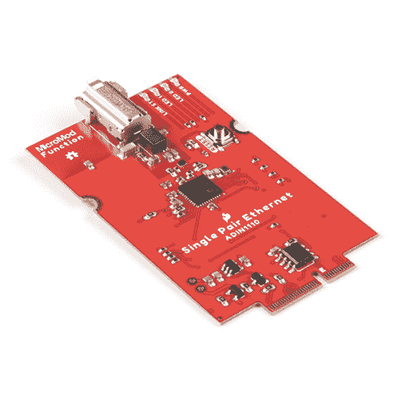](https://www.sparkfun.com/products/19038) 

将**添加到您的[购物车](https://www.sparkfun.com/cart)中！**

### [SparkFun MicroMod 单对以太网功能板——adin 1110](https://www.sparkfun.com/products/19038)

[In stock](https://learn.sparkfun.com/static/bubbles/ "in stock") COM-19038

SparkFun MicroMod 单对以太网功能板将 10BASE-T1L 双线以太网协议引入 SparkFun …

$49.95[Favorited Favorite](# "Add to favorites") 2[Wish List](# "Add to wish list")****[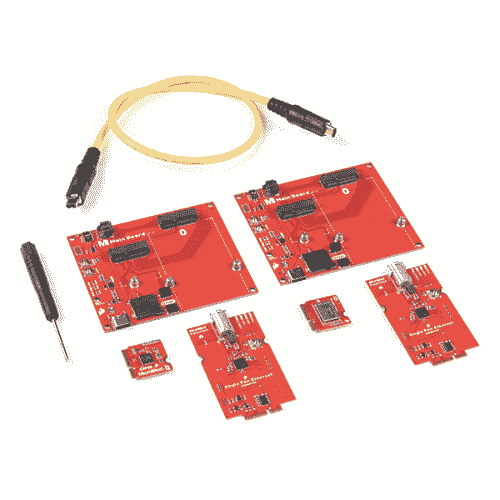](https://www.sparkfun.com/products/19628) 

将**添加到您的[购物车](https://www.sparkfun.com/cart)中！**

### [SparkFun MicroMod 单对以太网套件](https://www.sparkfun.com/products/19628)

[27 available](https://learn.sparkfun.com/static/bubbles/ "27 available") KIT-19628

SparkFun MicroMod 单对以太网套件演示了 SparkFun MicroMod 中的 10BASE-T1L 双线以太网协议…

$174.95[Favorited Favorite](# "Add to favorites") 0[Wish List](# "Add to wish list")**** ****[https://www.youtube.com/embed/IqdK49PFRfc/?autohide=1&border=0&wmode=opaque&enablejsapi=1](https://www.youtube.com/embed/IqdK49PFRfc/?autohide=1&border=0&wmode=opaque&enablejsapi=1)

在本指南中，我们将介绍 10BASE-T1L 单对以太网(SPE)的基础知识，ADIN1110 和该功能板上的其它硬件的预期性能，如何组装 SPE 电路并将其与 ADIN1110 Arduino 库配合使用。

### 所需材料

以下材料是遵循本指南所必需的。所有功能板都需要主板和处理器相互连接。根据您的应用，您可能需要单主板或双主板:

 

### [SparkFun MicroMod 主板-双](https://www.sparkfun.com/products/18576)

[Out of stock](https://learn.sparkfun.com/static/bubbles/ "out of stock") DEV-18576

MicroMod 主板是一种专用载板，允许您将 MicroMod 处理器板与多达两个…

[Favorited Favorite](# "Add to favorites") 4[Wish List](# "Add to wish list")[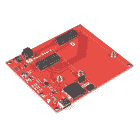](https://www.sparkfun.com/products/18575) 

将**添加到您的[购物车](https://www.sparkfun.com/cart)中！**

### [SparkFun 微电机主板-单个](https://www.sparkfun.com/products/18575)

[In stock](https://learn.sparkfun.com/static/bubbles/ "in stock") DEV-18575

MicroMod 主板是一个专门的载板，允许您将一个 MicroMod 处理器板与一个单…

$14.95[Favorited Favorite](# "Add to favorites") 4[Wish List](# "Add to wish list")** **需要一个处理器板作为功能板的主机控制器:

 

将**添加到您的[购物车](https://www.sparkfun.com/cart)中！**

### [SparkFun MicroMod Teensy 处理器](https://www.sparkfun.com/products/16402)

[In stock](https://learn.sparkfun.com/static/bubbles/ "in stock") DEV-16402

该板利用恩智浦 iMXRT1062 芯片(ARM Cortex-M7)的强大计算能力，并将其与 M.2 MicroMod 配对…

$21.505[Favorited Favorite](# "Add to favorites") 14[Wish List](# "Add to wish list")**** 

将**添加到您的[购物车](https://www.sparkfun.com/cart)中！**

### [SparkFun MicroMod SAMD51 处理器](https://www.sparkfun.com/products/16791)

[Out of stock](https://learn.sparkfun.com/static/bubbles/ "out of stock") DEV-16791

SparkFun MicroMod SAMD51 处理器板采用 32 位 ARM Cortex-M4F MCU，是一款功能强大的微控制器，封装在一个

$18.951[Favorited Favorite](# "Add to favorites") 8[Wish List](# "Add to wish list")**** 

将**添加到您的[购物车](https://www.sparkfun.com/cart)中！**

### [SparkFun MicroMod ESP32 处理器](https://www.sparkfun.com/products/16781)

[In stock](https://learn.sparkfun.com/static/bubbles/ "in stock") WRL-16781

该板将 Espressif 的 ESP32 与我们的 M.2 连接器接口相结合，为我们的 Micro…

$16.951[Favorited Favorite](# "Add to favorites") 6[Wish List](# "Add to wish list")**** 

将**添加到您的[购物车](https://www.sparkfun.com/cart)中！**

### [SparkFun MicroMod Artemis 处理器](https://www.sparkfun.com/products/16401)

[24 available](https://learn.sparkfun.com/static/bubbles/ "24 available") DEV-16401

该处理器具有 Artemis 模块，能够进行机器学习、蓝牙、I2C、GPIO、PWM、SPI，并打包以适应…

$14.95[Favorited Favorite](# "Add to favorites") 14[Wish List](# "Add to wish list")******** ********最后，需要一根单对以太网电缆来连接两个 MicroMod 组件:

 

将**添加到您的[购物车](https://www.sparkfun.com/cart)中！**

### [【单对以太网线- 0.5m(屏蔽)](https://www.sparkfun.com/products/19312)

[In stock](https://learn.sparkfun.com/static/bubbles/ "in stock") CAB-19312

这种 0.5 米的 SPE 电缆仅使用两根电线和终端的同步电源就能实现以太网数据传输

$21.75[Favorited Favorite](# "Add to favorites") 0[Wish List](# "Add to wish list")****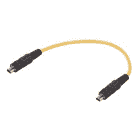 

### 单对以太网电缆-20 米(屏蔽)

[Retired](https://learn.sparkfun.com/static/bubbles/ "Retired") CAB-19364

这种 20 米长的 SPE 电缆仅使用两根电线和终端的同步电源就能实现以太网数据传输

**Retired**** **### 推荐阅读

[MicroMod 生态系统](https://www.sparkfun.com/micromod)是一种独特的方式，允许用户根据自己的需求定制他们的项目。如果你不熟悉 MicroMod 系统，点击下面的横幅以获取更多信息。

[https://www.youtube.com/embed/4QUJWeSrzD0/?autohide=1&border=0&wmode=opaque&enablejsapi=1](https://www.youtube.com/embed/4QUJWeSrzD0/?autohide=1&border=0&wmode=opaque&enablejsapi=1)

如果您不熟悉教程中涉及的概念，也可以阅读下面的教程:

 [### 串行外设接口(SPI)](https://learn.sparkfun.com/tutorials/serial-peripheral-interface-spi) SPI is commonly used to connect microcontrollers to peripherals such as sensors, shift registers, and SD cards.[Favorited Favorite](# "Add to favorites") 91 [### 什么是 Arduino？](https://learn.sparkfun.com/tutorials/what-is-an-arduino) What is this 'Arduino' thing anyway? This tutorials dives into what an Arduino is and along with Arduino projects and widgets.[Favorited Favorite](# "Add to favorites") 50 [### 安装 Arduino IDE](https://learn.sparkfun.com/tutorials/installing-arduino-ide) A step-by-step guide to installing and testing the Arduino software on Windows, Mac, and Linux.[Favorited Favorite](# "Add to favorites") 16 [### MicroMod 入门](https://learn.sparkfun.com/tutorials/getting-started-with-micromod) Dive into the world of MicroMod - a compact interface to connect a microcontroller to various peripherals via the M.2 Connector 3

## 硬件概述

在本节中，我们将详细了解该功能板上的硬件，并简要概述 10BASE-T1L 单对以太网到底是什么，以及它能提供哪些优势。

### 10BASE-T1L 单对以太网

10BASE-T1L 单对以太网(SPE)标准仅使用一根双绞线传输数据和电力。10BASE-T1L 以太网以高达 10Mbps 的速度在 1.7 公里的距离内传输数据。由于只有一对电缆，该电缆更小更轻，非常适合远程监控或工业应用，将大量边缘设备连接到网络连接。

有关 10BASE-t 1L SPE 的更多信息，请参考 ADI 公司关于通信协议的[这篇文章](https://cdn.sparkfun.com/assets/learn_tutorials/2/2/5/6/A347176how-a-10base-t1l-mac-phy-simplifies-low-power-processor-ethernet-connectivity.pdf)或[这篇 SparkFun 新闻文章](https://www.sparkfun.com/news/4637)。

### 名字是 1110

ADIN1110 是一款超低功耗以太网收发器，支持 10BASE-T1L IEEE 标准 802.3cg-2019 SPE。

[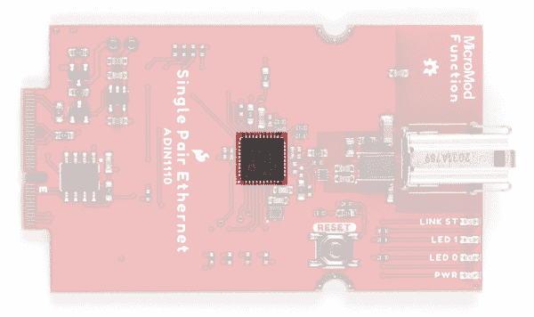](https://cdn.sparkfun.com/assets/learn_tutorials/2/2/5/6/MM_SPE_ADIN1110-IC.jpg)

它采用 1.8V 或 3.3V 的电源电压**工作。该功能板在单电源模式下以 **3.3V** 运行 adin 1110(VDD _ H 和 VVD_L 均以 **3.3V** 供电)，这允许传输幅度为 **2.4V** 。欲全面了解 ADIN1110 IC，请参考[数据手册](https://cdn.sparkfun.com/assets/5/5/c/5/1/adin1110.pdf)。**

ADIN1110 MAC 支持 16 个单独的 MAC 地址，并通过开放联盟和通用 SPI 协议进行通信。ADIN1110 使用通用 SPI 时以半双工方式传输数据，使用开放联盟协议时以全双工方式传输数据。该 IC 还支持三个 LED 输出、一个链路 LED 和两个可配置的通用 LED。功能板将所有这些分解为板上的 led。更多信息请阅读下面的 led 部分。

#### SPE 数据输出

功能板将 ADIN1110 的数据信号对通过来自 Würth Elektronik 的 TVS 二极管保护电路和相位变压器进行布线，然后端接在专用 T1 工业插孔中，以连接到独立的 SPE 器件或网络集线器。

[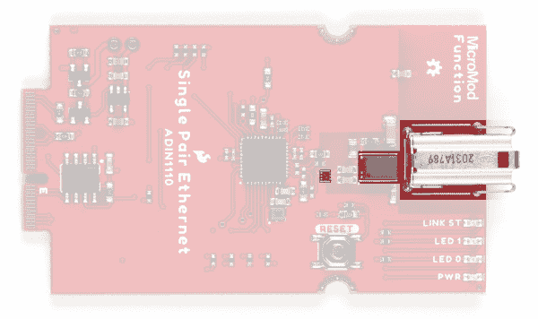](https://cdn.sparkfun.com/assets/learn_tutorials/2/2/5/6/MM_SPE_ADIN1110-T1_Output.jpg)

有关 TZ 工业千斤顶的更多信息，请参考[数据表](https://cdn.sparkfun.com/assets/8/3/1/2/1/PDF_DS_09452812800_EN.pdf)。

### 力量

功能板从其连接的主板获得电源。主板可以通过 USB 或连接的 LiPo 电池供电。请注意，此功能板不是为通过单对以太网连接供电而设计的。

### 发光二极管

该功能板包括四个 led，分别标记为 **PWR** 、 **LED 0** 、 **LED 1** 和 **LINK ST** 。

[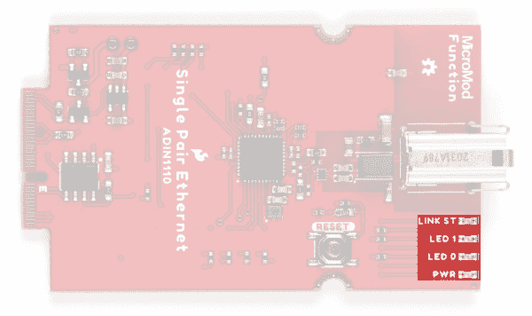](https://cdn.sparkfun.com/assets/learn_tutorials/2/2/5/6/MM_SPE_ADIN1110-LEDs.jpg)

*   **PWR** -电源 LED。
*   **LED 0** -通用可编程 LED。低电平有效。默认配置是在链路建立时打开 LED，并在活动时闪烁。
*   **LED 1** -通用可编程 LED。低电平有效。默认配置禁用 LED。
*   **链路状态指示灯** -链路状态指示灯。高电平有效。有效链接时，LED 亮起。

有关通用 led 编程的详细说明，请参考 [ADIN1110 数据手册](https://cdn.sparkfun.com/assets/5/5/c/5/1/adin1110.pdf)或 [SparkFun ADIN1110 Arduino 库](https://github.com/sparkfun/SparkFun_ADIN1110_Arduino_Libary)的 LED 控制寄存器部分。

### 焊料跳线

该功能板有 12 个焊接跳线。下表概述了每种跳线的标签、功能、默认状态及其使用说明。

[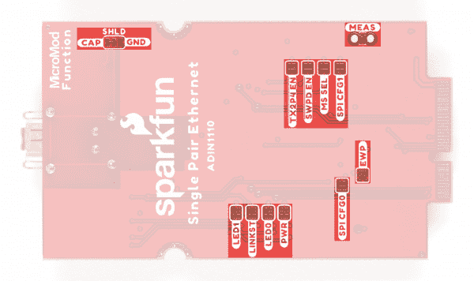](https://cdn.sparkfun.com/assets/learn_tutorials/2/2/5/6/MM_SPE_ADIN1110-Solder_Jumpers.jpg)*Having trouble seeing the detail in the image? Click on it for a larger view.*

| 标签 | 默认状态 | 功能 | 笔记 |
| SHLD | CAP(参见注释) | 双跳线选择连接器屏蔽接地选项。 | 默认情况下，连接器屏蔽通过一个 3.3nF 电容接地。切换到 GND 侧，将屏蔽层直接接地。 |
| LED1 | 关闭的 | 完成 LED1 可配置 LED 电路。 | 打开以禁用带标签的 led。帮助降低总电流消耗。 |
| linest | 关闭的 | 完成链接状态 LED 电路。 |
| LED0 | 关闭的 | 完成 LED0 可配置 LED 电路。 |
| 压水反应堆 | 关闭的 | 完成电源 LED 电路。 |
| TX2P4 EN | 打开 | 将 TX2P4_EN 引脚拉低。 | 控制发射振幅模式。默认情况下，此引脚为低电平，允许 **1.0V** 和 **2.4V** 峰峰值传输电平。拉高此引脚禁用 **2.4V** 发射电平。 ^([1](#ADIN1110_Config)) |
| SWPD EN | 打开 | 拉低 SWPD_EN 引脚。 | 控制 ADIN1110 复位后是否进入软件关断模式。默认情况下，ADIN1110 在复位后启动自适应。如果跳线闭合，ADIN1110 在复位后会保持关断模式，直到通过 SPI 进行配置。这允许软件控制掉电模式。 ^([1](#ADIN1110_Config)) |
| 塞尔女士 | 打开 | 将 ADIN1110 设置为 SPI 外设(从机)。 | 控制 ADIN1110 默认为 SPI 总线上的控制器还是外设。 ^([1](#ADIN1110_Config)) |
| SPI CFG1 | 打开 | 将 ADIN1110 设置为使用带保护的开放联盟 SPI 协议(如果 SPI_CFG0 也为低电平)。 |  |
| SPI CFG0 | 打开 | 将 ADIN1110 设置为使用带保护的开放联盟 SPI 协议(如果 SPI_CFG1 也为低电平)。 |  |
| EWP | 打开 | EEPROM 写保护。 |  |
| 量度（measure 的缩写） | 关闭的 | 将 VCC_IN 连接到 **3.3V** 电压调节器的输入。 | 打开以测量电路板的电流消耗。 |

[**1.**](https://learn.sparkfun.com/tutorials/micromod-single-pair-ethernet-function-board---adin1110-hookup-guide/hardware-overview#ADIN1110_Config) Refer to page 16 of the [datasheet](https://cdn.sparkfun.com/assets/5/5/c/5/1/adin1110.pdf) for more information on the configuration pins.

### MicroMod 边缘连接器和引脚排列

MicroMod 生态系统使用极化 M.2 边缘连接器来提供标准化的电连接，该电连接被键控以防止 MicroMod 板之间的不正确连接。螺钉的连接点防止用户将处理器板连接到功能板插槽中，反之亦然。

[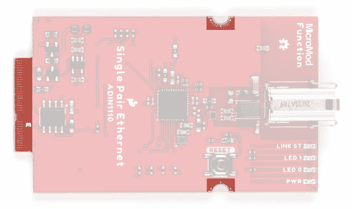](https://cdn.sparkfun.com/assets/learn_tutorials/2/2/5/6/MM_SPE_ADIN1110-M2.jpg)

#### 微型引脚排列

该功能板使用连接的处理器板上的以下引脚:

*   3.3V 和 VCC
*   电源使能
*   SPI - ADIN1110 通信
*   I ² C - EEPROM 通信
*   D0(插槽 0) / D1(插槽 1) - ADIN1110 中断
*   CS0(插槽 0) / CS1(插槽 1) - ADIN1110 片选(SPI)

有关该功能板使用的完整 MicroMod 引脚排列和引脚，请查看下表:

*   [SPE 功能板- ADIN1110 引脚表](#SPEethernet)
*   [MicroMod 通用处理器引脚表](#MMGen)
*   [MicroMod 通用引脚描述](#MMDescript)

| **音频** | **UART** | **GPIO/总线** | **I ² C** | **SDIO** 的缩写形式 | **SPI0** | **专用** |

| 功能 | 底部
销 | 顶部
销 | 功能 |
|  |  |  | (未连接) |  | **75** | GND |  |  |  |
|  |  |  | 3.3V | **74** | **73** | G5 /总线 5 |  |  |  |
|  |  |  | RTC _ 3V _ 电池 | **72** | **71** | G6 /总线 6 |  |  |  |
|  |  | SPI_CS1# | SDIO _ 数据 3(输入输出) | **70** | **69** | G7 /总线 7 |  |  |  |
|  |  |  | SDIO _ 数据 2(输入输出) | **68** | **67** | 八国集团(Group of Eight) |  |  |  |
|  |  |  | SDIO _ 数据 1(输入输出) | **66** | **65** | G9 | ADC_D- | CAM_HSYNC |  |
|  |  | 睡吧 | SDIO _ 数据 0(输入输出) | **64** | **63** | G10 | ADC_D+ | CAM_VSYNC |  |
|  |  | SPI COPI1 | SDIO_CMD (I/O) | **62** | **61** | 睡吧 |  |  |  |
|  |  | SPI SCK1 | SDIO_SCK(或) | **60** | **59** | SPI_COPI (O) | LED_DAT |  |  |
|  |  |  | AUD_MCLK (O) | **58** | **57** | SPI_SCK(或) | LED |  |  |
| 凯姆 | PCM_OUT | I2S 出局 | AUD_OUT | **56** | **55** | SPI_CS# |  |  |  |
| cam _ pclk | PCM_IN | I2S 因 | 澳元 _ 美元 | **54** | **53** | I2C_SCL1(输入/输出) |  |  |  |
| PDM_DATA | PCM_SYNC | i2s WS | AUD_LRCLK | **52** | **51** | I2C_SDA1(输入输出) |  |  |  |
| PDM_CLK | PCM_CLK | SCK i2s | 奥德 _BCLK | **50** | **49** | BATT_VIN / 3 (I - ADC) (0 至 3.3V) |  |  |  |
|  |  |  | G4 /总线 4 | **48** | **47** | PWM1 |  |  |  |
|  |  |  | G3 /总线 3 | **46** | **45** | GND |  |  |  |
|  |  |  | G2 /总线 2 | **44** | **43** | CAN_TX |  |  |  |
|  |  |  | G1 /巴士 1 | **42** | **41** | CAN_RX |  |  |  |
|  |  |  | G0 /总线 0 | **40** | **39** | GND |  |  |  |
|  |  |  | 一流的 | **38** | **37** | USBHOST_D- |  |  |  |
|  |  |  | GND | **36** | **35** | USBHOST_D+ |  |  |  |
|  |  |  | A0 | **34** | **33** | GND |  |  |  |
|  |  |  | PWM0 | **32** | **31** | 模块密钥 |  |  |  |
|  |  |  | 模块密钥 | **30** | **29** | 模块密钥 |  |  |  |
|  |  |  | 模块密钥 | **28** | **27** | 模块密钥 |  |  |  |
|  |  |  | 模块密钥 | **26** | **25** | 模块密钥 |  |  |  |
|  |  |  | 模块密钥 | **24** | **23** | SWDIO |  |  |  |
|  |  |  | UART_TX2 (O) | **22** | **21** | SWDCK |  |  |  |
|  |  |  | UART_RX2 (I) | **20** | **19** | UART_RX1 (I) |  |  |  |
|  |  | CAM_TRIG | D1 | **18** | **17** | UART_TX1 (0) |  |  |  |
|  |  |  | I2C INT # | **16** | **15** | UART_CTS1 (I) |  |  |  |
|  |  |  | S7-1200 可编程控制器 | **14** | **13** | UART_RTS1 (O) |  |  |  |
|  |  |  | I2C SDA(输入/输出) | **12** | **11** | 行李箱(I 型开式排放) |  |  |  |
|  |  |  | D0 | **10** | **9** | USB_VIN |  |  |  |
|  |  | 浅部白色甲癣 | G11 | **8** | **7** | GND |  |  |  |
|  |  |  | 复位# (I -开漏) | **6** | **5** | USB_D- |  |  |  |
|  |  |  | 3.3V_EN | **4** | **3** | USB_D+ |  |  |  |
|  |  |  | 3.3V | **2** | **1** | GND |  |  |  |

| 描述 | 功能 | 底部
销 | 顶部
销 | 功能 | 描述 |
|  | (未连接) |  | **75** | GND |  |
|  | - | **74** | **73** | 3.3V | 电源:3.3-6V |
|  | - | **72** | **71** | powermen(消歧义) | 电源使能 |
|  | - | **70** | **69** | - |  |
|  | - | **66** | **65** | - |  |
|  | - | **64** | **63** | - |  |
|  | - | **62** | **61** | - |  |
|  | - | **60** | **59** | - |  |
|  | - | **58** | **57** | - |  |
|  | - | **56** | **55** | 重置 | ADIN1110 复位按钮 |
|  | - | **54** | **53** | - |  |
|  | - | **52** | **51** | - |  |
|  | - | **50** | **49** | 特许测量员 | ADIN1110 片选 |
|  | - | **48** | **47** | （同 Internationalorganizations）国际组织 | ADIN1110 中断引脚 |
|  | - | **46** | **45** | GND |  |
|  | - | **44** | **43** | - |  |
|  | - | **42** | **41** | - |  |
| EEPROM 的写保护引脚。拉低以使能。 | EEPROM_WP | **40** | **39** | GND |  |
|  | - | **38** | **37** | - |  |
| EEPROM I ² C 地址配置。 | EEPROM_A0 | **36** | **35** | - |  |
| EEPROM I ² C 地址配置。 | EEPROM_A1 | **34** | **33** | GND |  |
| EEPROM I ² C 地址配置。 | EEPROM_A2 | **32** | **31** | 模块密钥 |  |
|  | 模块密钥 | **30** | **29** | 模块密钥 |  |
|  | 模块密钥 | **28** | **27** | 模块密钥 |  |
|  | 模块密钥 | **26** | **25** | 模块密钥 |  |
|  | 模块密钥 | **24** | **23** | - |  |
|  | - | **22** | **21** | i2c _ scl | I²EEPROM 的 C 时钟信号 |
|  | - | **20** | **19** | I2C SDA | I²EEPROM 的 C 数据信号 |
|  | - | **18** | **17** | - |  |
|  | - | **16** | **15** | - |  |
|  | - | **14** | **13** | - |  |
|  | - | **12** | **11** | - |  |
|  | - | **10** | **9** | - |  |
|  | - | **8** | **7** | POCI | SPI 外设输出/控制器输入。 |
|  | - | **6** | **5** | 微微 | SPI 外设输入/控制器输出。 |
|  | - | **4** | **3** | 血清肌酸激酶 | SPI 时钟信号 |
|  | - | **2** | **1** | GND |  |

| 信号群 | 信号 | 输入－输出 | 描述 | 电压 |
| 力量 | 3.3V | 我 | 3.3V 电源 | 3.3V |
| GND |  | 返回电流路径 | 0V |
| USB_VIN | 我 | USB VIN 符合 USB 2.0 规范。连接到处理器板上要求 5V USB 功能的引脚 | 4.8-5.2V |
| RTC _ 3V _ 电池 | 我 | 3V 由外部纽扣电池或迷你电池提供。最大功耗=100μA，连接到引脚，在掉电期间保持 RTC。可以左 NC。 | 3V |
| 3.3V_EN | O | 控制载板的主电压调节器。1V 以上的电压将启用 3.3V 电源路径。 | 3.3V |
| BATT_VIN/3 | 我 | 载板原始电压超过 3。1/3 电阻分压器在载板上实现。根据需要放大整个 0-3.3V 范围的模拟信号 | 3.3V |
| 重置 | 重置 | 我 | 处理器的输入。处理器板上带上拉电阻的开漏。拉低复位处理器。 | 3.3V |
| 靴子 | 我 | 处理器的输入。处理器板上带上拉电阻的开漏。拉低使处理器进入特殊启动模式。可以左 NC。 | 3.3V |
| 通用串行总线 | USB_D | 输入－输出 | USB 数据。符合 USB 2.0 规范的差分串行数据接口。如果编程需要 UART，USB 必须连接到处理器板上的 USB 转串行转换 IC。 |  |
| USB 主机 | USBHOST_D | 输入－输出 | 对于支持 USB 主机模式的处理器。USB 数据。符合 USB 2.0 规范的差分串行数据接口。可以左 NC。 |  |
| 能 | CAN_RX | 我 | CAN 总线接收数据。 | 3.3V |
| CAN_TX | O | CAN 总线传输数据。 | 3.3V |
| 通用非同步收发传输器(Universal Asynchronous Receiver/Transmitter) | UART_RX1 | 我 | UART 接收数据。 | 3.3V |
| UART_TX1 | O | UART 发送数据。 | 3.3V |
| UART_RTS1 | O | UART 准备发送。 | 3.3V |
| UART_CTS1 | 我 | UART 清零发送。 | 3.3V |
| UART_RX2 | 我 | 第二个 UART 接收数据。 | 3.3V |
| UART_TX2 | O | 第二个 UART 发送数据。 | 3.3V |
| I2C | i2c _ scl | 输入－输出 | I ² C 时钟。载板上拉的开漏。 | 3.3V |
| I2C SDA | 输入－输出 | I ² C 数据。载板上有上拉电阻的开漏 | 3.3V |
| I2C INT # | 我 | 从载板到处理器的中断通知。载板上拉的开漏。低电平有效 | 3.3V |
| I2C_SCL1 号文件 | 输入－输出 | 2nd I ² C 时钟。载板上拉的开漏。 | 3.3V |
| I2C sda 1 | 输入－输出 | 2nd I ² C 数据。载板上拉的开漏。 | 3.3V |
| 精力 | SPI_PICO | O | SPI 外设输入/控制器输出。 | 3.3V |
| SPI | 我 | SPI 外设输出/控制器输入。 | 3.3V |
| SPI | O | SPI 时钟。 | 3.3V |
| SPI_CS# | O | SPI 片选。低电平有效。如果不使用硬件 CS，可以路由到 GPIO。 | 3.3V |
| SPI/SDIO | SPI_SCK1/SDIO_CLK | O | 第二个 SPI 时钟。次要用途是 SDIO 钟。 | 3.3V |
| SPI_PICO1/SDIO_CMD | 输入－输出 | 第二个 SPI 外设输入/控制器输出。次要用途是 SDIO 命令界面。 | 3.3V |
| SPI_POCI1/SDIO_DATA0 | 输入－输出 | 第二 SPI 控制器输出/外设输入。次要用途是 SDIO 数据交换位 0。 | 3.3V |
| SDIO_DATA1 | 输入－输出 | SDIO 数据交换位 1。 | 3.3V |
| SDIO_DATA2 | 输入－输出 | SDIO 数据交换位 2。 | 3.3V |
| SPI _ CS1/SDIO _ 数据 3 | 输入－输出 | 第二个 SPI 芯片选择。次要用途是 SDIO 数据交换位 3。 | 3.3V |
| 声音的 | 奥地利马克 | O | 音频主时钟。 | 3.3V |
| AUD _ OUT/PCM _ OUT/i2s _ OUT/CAM _ MCLK | O | 音频数据输出。PCM 同步数据输出。I2S 串行数据输出。相机主时钟。 | 3.3V |
| 澳大利亚/PCM _ IN/i2s _ IN/卡姆 _PCLK | 我 | 音频数据输入。PCM 同步数据输入。I2S 串行数据输入。照相机外围时钟。 | 3.3V |
| AUD _ LRC lk/PCM _ SYNC/i2s _ WS/PDM _ DATA | 输入－输出 | 音频左/右时钟。PCM 同步数据同步。I2S 单词精选。PDM 数据。 | 3.3V |
| 澳大利亚 BCLK/CLK PCM/CLK i2s/CLK PDM | O | 音频位时钟。PCM 时钟。I2S 连续串行时钟。PDM 时钟。 | 3.3V |
| 社署 | SWDIO | 输入－输出 | 串行线调试 I/O。如果处理器板支持 SWD，则连接。可以左 NC。 | 3.3V |
| SWDCK | 我 | 串行线调试时钟。如果处理器板支持 SWD，则连接。可以左 NC。 | 3.3V |
| 物理输出核心 | A0 | 我 | 模数转换器 0。根据需要放大模拟信号，以实现完整的 0-3.3V 范围。 | 3.3V |
| 一流的 | 我 | 模数转换器 1。根据需要放大模拟信号，以实现完整的 0-3.3V 范围。 | 3.3V |
| 脉宽调制（pulse-width modulating 的缩写） | PWM0 | O | 脉宽调制输出 0。 | 3.3V |
| PWM1 | O | 脉宽调制输出 1。 | 3.3V |
| 数字的 | D0 | 输入－输出 | 通用数字输入/输出引脚。 | 3.3V |
| D1/CAM_TRIG | 输入－输出 | 通用数字输入/输出引脚。相机触发器。 | 3.3V |
| 常规/公共汽车 | G0/总线 0 | 输入－输出 | 通用引脚。任何未使用的处理器引脚都应分配给 Gx，具有 ADC + PWM 功能的引脚优先(0、1、2 等。)岗位。目的是保证各 ADC/PWM/数字引脚上的 PWM、ADC 和数字引脚功能。Gx 引脚不保证 ADC/PWM 功能。另一种用途是引脚可以支持快速读/写 8 位或 4 位宽总线。 | 3.3V |
| G1/巴士 1 | 输入－输出 | 3.3V |
| G2/总线 2 | 输入－输出 | 3.3V |
| G3/总线 3 | 输入－输出 | 3.3V |
| G4/总线 4 | 输入－输出 | 3.3V |
| G5/总线 5 | 输入－输出 | 3.3V |
| g6/总线 6 | 输入－输出 | 3.3V |
| G7/总线 7 | 输入－输出 | 3.3V |
| 八国集团(Group of Eight) | 输入－输出 | 通用引脚 | 3.3V |
| G9/ADC_D-/CAM_HSYNC | 输入－输出 | 差分 ADC 输入(如有)。相机水平同步。 | 3.3V |
| G10/ADC_D+/CAM_VSYNC | 输入－输出 | 差分 ADC 输入(如有)。相机垂直同步。 | 3.3V |
| G11/SWO | 输入－输出 | 通用引脚。串行线输出 | 3.3V |

### 电路板尺寸

该功能板使用 MicroMod 功能板的标准尺寸，尺寸为 2.56 英寸 x 1.48 英寸(65.02 毫米 x 37.59mm 毫米)，T1 插孔从板边缘伸出约 0.15 英寸(3.81 毫米)。

[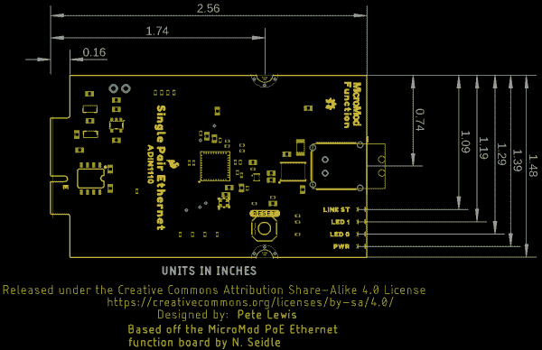](https://cdn.sparkfun.com/assets/learn_tutorials/2/2/5/6/MM_SPE_ADIN1110-Dimensions.png)

## 硬件装配

如果您不熟悉使用 MicroMod 连接系统组装主板，请阅读 MicroMod 主板连接指南，了解有关将 MicroMod 处理器和功能板插入主板并固定到主板的信息:

 [### MicroMod 主板连接指南

#### 2021 年 11 月 11 日](https://learn.sparkfun.com/tutorials/micromod-main-board-hookup-guide) The MicroMod Main Board - Single and Double are specialized carrier boards that allow you to interface a Processor Board with a Function Board(s). The modular system allows you to add an additional feature(s) to a Processor Board with the help of a Function Board(s). In this tutorial, we will focus on the basic functionality of the Main Board - Single and Main Board - Double.[Favorited Favorite](# "Add to favorites") 0

### 单对以太网基本组件

将功能板和处理器板连接到各自的主板上，我们就可以完成单对以太网电路的组装。对于使用您自己的设置或单对以太网套件的基本 SPE 原型电路，使用单对以太网电缆将两个 MicroMod 组件连接在一起，然后通过 USB-C 为两个 MicroMod 主板供电，如下图所示:

[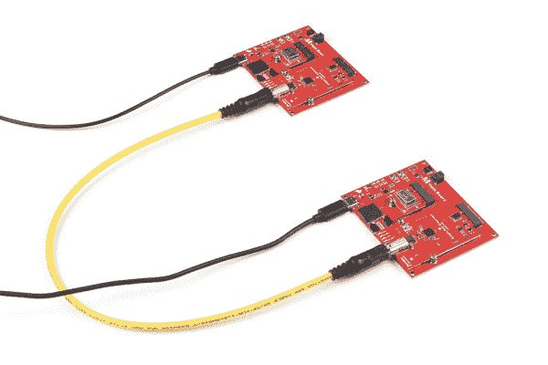](https://cdn.sparkfun.com/assets/learn_tutorials/2/2/5/6/MM_SPE_ADIN1110-Basic_Circuit.jpg)

### 演示电路组件

我们将组装一个演示电路，它与 ADIN1110 Arduino 库中的一个示例对一起工作，该示例对发送由连接到一个 SPE 微型模块组件的 [SparkFun 大气传感器 Breakout - BME280 (Qwiic)](http://www.sparkfun.com/products/15440) 记录的环境数据，以在连接到对面 SPE 微型模块组件的 [SparkFun 20x4 SerLCD - RGB 背光(Qwiic)](https://www.sparkfun.com/products/16398) 上显示。

将 Qwiic 板连接到各自 MicroMod 主板上的 Qwiic 连接器，然后将 SPE 电缆插入每个功能板上的 T1 插孔。一旦所有这些都连接上，用 USB-C 电缆给 MicroMod 主板供电。完成的演示电路应该看起来像下面的照片:

[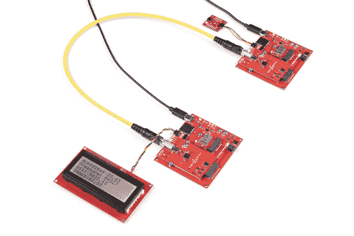](https://cdn.sparkfun.com/assets/learn_tutorials/2/2/5/6/MM_SPE_ADIN1110-Demo_Circuit.jpg)*Having trouble seeing the detail in the image? Click on it for a larger view.*

现在，我们的演示电路已经完成，我们可以继续上传代码，以建立 SPE 链接，并在两个 MicroMod 组件之间发送数据。

## 软件设置

**Note:** This library assumes you are using the latest version of the Arduino IDE on your desktop. If this is your first time using Arduino or if you need a refresher, please review the following tutorials.

*   [安装 Arduino IDE](https://learn.sparkfun.com/tutorials/installing-arduino-ide)
*   [安装 Arduino 库](https://learn.sparkfun.com/tutorials/installing-an-arduino-library)

### SparkFun ADIN1110 Arduino 库

SparkFun ADIN1110 Arduino 库包括几个示例，可帮助您开始在两个 ADIN1110 功能板之间进行通信。该库托管在 [GitHub](https://github.com/sparkfun/SparkFun_ADIN1110_Arduino_Libary) 上。通过搜索**“spark fun adin 1110 Arduino 库”**，通过 Arduino 库管理器工具安装库。喜欢手动安装的用户可以从存储库中获取它，或者通过单击下面的按钮直接下载它:

[SparkFun ADIN1110 Arduino Library (ZIP)](https://github.com/sparkfun/SparkFun_ADIN1110_Arduino_Libary/archive/refs/heads/main.zip)

SparkFun ADIN1110 Arduino 库包含大量示例，展示了配置和使用 ADIN1110 的不同方法。它们包括启动和运行的基本示例，以及为喜欢自定义传输性能和内存使用的用户提供的高级示例。

### 处理器 Arduino 板定义和驱动程序

请务必通读所选处理器板的连接指南，以安装最新的 Arduino 板定义和任何必要的驱动程序:

 [### MicroMod ESP32 处理器板连接指南

#### 2020 年 10 月 21 日](https://learn.sparkfun.com/tutorials/micromod-esp32-processor-board-hookup-guide) A short hookup guide to get started with the SparkFun MicroMod ESP32 Processor Board.[Favorited Favorite](# "Add to favorites") 1 [### MicroMod STM32 处理器连接指南

#### 2021 年 5 月 13 日](https://learn.sparkfun.com/tutorials/micromod-stm32-processor-hookup-guide) Get started with the MicroMod Ecosystem and the STM32 Processor Board 0 [### MicroMod Teensy 处理器连接指南

#### 2021 年 7 月 1 日](https://learn.sparkfun.com/tutorials/micromod-teensy-processor-hookup-guide) Add the processing power and versatility of the Teensy to your MicroMod project following this guide for the SparkFun MicroMod Teensy Processor.[Favorited Favorite](# "Add to favorites") 0

### 引脚连接表

下表有助于显示功能板连接到哪些引脚，具体取决于它连接到主板上的哪个插槽(注:单个主板连接是插槽 0):

| **音频** | **UART** | **GPIO/总线** | **I ² C** | **SDIO** 的缩写形式 | **SPI0** | **专用** |

| 功能板
引脚名称 | 输入/输出
方向 | 主板的
处理器引脚 |
| 插槽 0 | 插槽 1 |
| VCC | 投入 | - |
| 3.3V | 投入 | - |
| GND | - | - |
| （同 Internationalorganizations）国际组织 |  | D0 | D1 |
| 特许测量员 |  | CS0 | CS1 |

## Arduino 示例

SparkFun ADIN1110 Arduino 库包括几组示例，用于开始 ADIN1110 节点之间的通信。在本节中，我们将看看硬件组装部分所示演示电路的 Arduino 示例对。

### 示例集 3 -发送 BME280 /接收 LCD 显示器

**Note:** This example pair requires two additional libraries; the SparkFun BME280 Library and SparkFun SerLCD Library. Install them through the Arduino Library Manger tool or download them for manual install by clicking the buttons below:

[SparkFun SerLCD Arduino Library (ZIP)](https://github.com/sparkfun/SparkFun_SerLCD_Arduino_Library/archive/refs/heads/master.zip)

[SparkFun BME280 Arduino Library (ZIP)](https://github.com/sparkfun/SparkFun_BME280_Arduino_Library/archive/refs/heads/master.zip)

示例 3 组(3a 和 3b)一起工作，从连接到发射器微型模块组件的 BME280 发送环境数据，以在连接到接收器微型模块组件的 LCD 上显示。

打开两块板的 Arduino IDE 实例，并通过进入**文件/Examples/spark fun adin 1110 Arduino 库/Example 03A _ transmitstrbme 280/03B _ RxStrSerLCD**打开示例。记下两个处理器的端口，以跟踪哪个板是哪个板。将示例上传到两个板，一旦链接被确认，板应该开始在彼此之间发送/接收数据。如果在两块功能板上没有看到数据或链路发光二极管亮起，打开[串行监视器](https://learn.sparkfun.com/tutorials/terminal-basics)并重置两块板。代码将打印出可能有助于解决 SPE 链接问题的调试数据。

#### 示例 3A - BME280 发射机

示例 3A 创建用于发送由 BME280 测量的数据的帧参数，然后默认每五秒钟将该数据发送到接收器。如果 BME280 的读数在两次报告之间的变化超过了指定的阈值，则代码会忽略五秒钟的延迟并发送一份力报告。

#### 3B 液晶显示器接收器示例

示例 3B 准备好 ADIN1110，从另一个功能板上的 BME280 接收数据，然后将数据打印到与 MicroMod 主板相连的 LCD 上。启动时，显示屏会打印出“正在等待连接”,并在链接建立后显示“已连接”。建立链接后，如果传输功能板由于 BME280 读数的较大变化而接收到强制更新，则显示器应每五秒钟更新一次新数据，或者更频繁。

## 解决纷争

如果您在创建 ADIN1110 之间的链接时遇到问题，以下是一些快速故障排除技巧。

### 检查电路板/库版本

如果您对 Arduino 库和 SparkFun MicroMod 处理器有任何问题，请确保您拥有最新版本的处理器板定义和 Arduino 库。

### 重置序列

如果在运行 Arduino 库中的示例集时，主板没有建立链接，请同时按住主板上的重置按钮。首先释放接收板上的复位按钮(例如演示示例中的 LCD 电路)，然后释放发射板上的复位按钮。

### 常规故障排除

**Not working as expected and need help?**

If you need technical assistance and more information on a product that is not working as you expected, we recommend heading on over to the [SparkFun Technical Assistance](https://www.sparkfun.com/technical_assistance) page for some initial troubleshooting.

[SparkFun Technical Assistance Page](https://www.sparkfun.com/technical_assistance)

If you don't find what you need there, the [SparkFun Forums: MicroMod](https://forum.sparkfun.com/viewforum.php?f=180) are a great place to find and ask for help. If this is your first visit, you'll need to [create a Forum Account](https://forum.sparkfun.com/ucp.php?mode=register) to search product forums and post questions.

[SparkFun Forums: MicroMod](https://forum.sparkfun.com/viewforum.php?f=180)

## 资源和更进一步

本指南到此结束。欲了解有关 MicroMod 单对以太网功能板 ADIN1110 的更多信息，请查看以下资源:

*   [示意图](https://cdn.sparkfun.com/assets/7/1/6/8/2/SparkFun_MicroMod_Function_ADIN1110.pdf)
*   [老鹰档案](https://cdn.sparkfun.com/assets/3/2/9/d/0/SparkFun_MicroMod_Function_ADIN1110.zip)
*   [电路板尺寸](https://cdn.sparkfun.com/assets/learn_tutorials/2/2/5/6/MM_SPE_ADIN1110-Dimensions.png)
*   [GitHub 硬件回购](https://github.com/sparkfun/SparkFun_MicroMod_Single_Pair_Ethernet_Function_Board_ADIN1110)
*   [数据表](https://cdn.sparkfun.com/assets/5/5/c/5/1/adin1110.pdf) - ADIN1110
*   [数据表](https://cdn.sparkfun.com/assets/8/3/1/2/1/PDF_DS_09452812800_EN.pdf) -T1 工业插孔 AH IP2
*   [GitHub 硬件回购](https://github.com/sparkfun/SparkFun_MicroMod_Single_Pair_Ethernet_Function_Board_ADIN1110)
*   [SparkFun ADIN1110 Arduino 库](https://github.com/sparkfun/SparkFun_ADIN1110_Arduino_Libary)

有关 MicroMod 生态系统的更多信息，请访问以下资源:

*   [micro mod 入门](https://learn.sparkfun.com/tutorials/getting-started-with-micromod)
*   [用微模块设计](https://learn.sparkfun.com/tutorials/designing-with-micromod)
*   [MicroMod 信息页面](https://www.sparkfun.com/micromod)
*   [MicroMod 论坛](https://forum.sparkfun.com/viewforum.php?f=180)****************