# MicroMod WiFi 功能板- DA16200 连接指南

> 原文：<https://learn.sparkfun.com/tutorials/micromod-wifi-function-board---da16200-hookup-guide>

## 介绍

想要将 DA16200 的所有物联网功能添加到 MicroMod 系统的适应性中吗？那你很幸运！ [SparkFun MicroMod DA16200 功能板](https://www.sparkfun.com/products/18594)为任何 MicroMod 项目添加了一个完全集成的 WiFi 模块，该模块具有 40MHz 晶体振荡器、32.768KHz RTC 时钟、RF 集总 RF 滤波器、4MB 闪存和板载芯片天线。增加了用于深度编程的 JTAG 连接器，您就拥有了为下一个物联网项目准备好 MicroMod 设置所需的一切。

[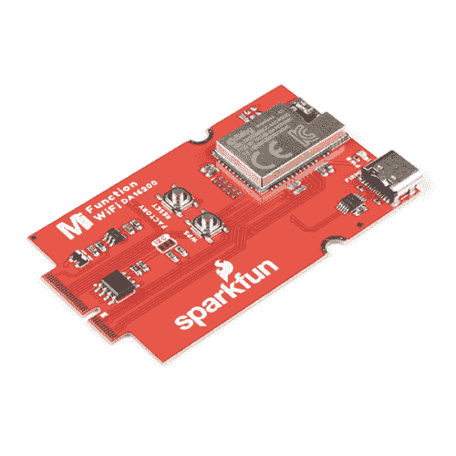](https://www.sparkfun.com/products/18594) 

将**添加到您的[购物车](https://www.sparkfun.com/cart)中！**

### [SparkFun MicroMod WiFi 功能板- DA16200](https://www.sparkfun.com/products/18594)

[In stock](https://learn.sparkfun.com/static/bubbles/ "in stock") WRL-18594

SparkFun MicroMod DA16200 功能板为任何 MicroMod 项目添加了一个完全集成的 WiFi 模块。

$29.951[Favorited Favorite](# "Add to favorites") 1[Wish List](# "Add to wish list")** **[https://www.youtube.com/embed/GeeHryO9D8k/?autohide=1&border=0&wmode=opaque&enablejsapi=1](https://www.youtube.com/embed/GeeHryO9D8k/?autohide=1&border=0&wmode=opaque&enablejsapi=1)

### 所需材料

要完成本教程，您至少需要以下材料。你可能不需要所有的东西，这取决于你拥有什么。将它添加到您的购物车，通读指南，并根据需要调整购物车。

[](https://www.sparkfun.com/products/15424) 

将**添加到您的[购物车](https://www.sparkfun.com/cart)中！**

### [可逆 USB A 转 C 线- 2m](https://www.sparkfun.com/products/15424)

[18 available](https://learn.sparkfun.com/static/bubbles/ "18 available") CAB-15424

这些 2 米长的电缆稍加修改后，就可以插入其端口，而不用考虑其在 U…

$8.951[Favorited Favorite](# "Add to favorites") 4[Wish List](# "Add to wish list")****[](https://www.sparkfun.com/products/16401) 

将**添加到您的[购物车](https://www.sparkfun.com/cart)中！**

### [SparkFun MicroMod Artemis 处理器](https://www.sparkfun.com/products/16401)

[24 available](https://learn.sparkfun.com/static/bubbles/ "24 available") DEV-16401

该处理器具有 Artemis 模块，能够进行机器学习、蓝牙、I2C、GPIO、PWM、SPI，并打包以适应…

$14.95[Favorited Favorite](# "Add to favorites") 14[Wish List](# "Add to wish list")****[](https://www.sparkfun.com/products/18575) 

将**添加到您的[购物车](https://www.sparkfun.com/cart)中！**

### [SparkFun 微电机主板-单个](https://www.sparkfun.com/products/18575)

[In stock](https://learn.sparkfun.com/static/bubbles/ "in stock") DEV-18575

MicroMod 主板是一个专门的载板，允许您将一个 MicroMod 处理器板与一个单…

$14.95[Favorited Favorite](# "Add to favorites") 4[Wish List](# "Add to wish list")****[](https://www.sparkfun.com/products/18594) 

将**添加到您的[购物车](https://www.sparkfun.com/cart)中！**

### [SparkFun MicroMod WiFi 功能板- DA16200](https://www.sparkfun.com/products/18594)

[In stock](https://learn.sparkfun.com/static/bubbles/ "in stock") WRL-18594

SparkFun MicroMod DA16200 功能板为任何 MicroMod 项目添加了一个完全集成的 WiFi 模块。

$29.951[Favorited Favorite](# "Add to favorites") 1[Wish List](# "Add to wish list")******** ********#### MicroMod 主板

要固定处理器板和功能板，您需要一块主板。根据您的应用，您可以选择一个或两个额外的功能板。

[](https://www.sparkfun.com/products/18576) 

### [SparkFun MicroMod 主板-双](https://www.sparkfun.com/products/18576)

[Out of stock](https://learn.sparkfun.com/static/bubbles/ "out of stock") DEV-18576

MicroMod 主板是一种专用载板，允许您将 MicroMod 处理器板与多达两个…

[Favorited Favorite](# "Add to favorites") 4[Wish List](# "Add to wish list")[](https://www.sparkfun.com/products/18575) 

将**添加到您的[购物车](https://www.sparkfun.com/cart)中！**

### [SparkFun 微电机主板-单个](https://www.sparkfun.com/products/18575)

[In stock](https://learn.sparkfun.com/static/bubbles/ "in stock") DEV-18575

MicroMod 主板是一个专门的载板，允许您将一个 MicroMod 处理器板与一个单…

$14.95[Favorited Favorite](# "Add to favorites") 4[Wish List](# "Add to wish list")** **#### MicroMod 处理器板

有多种 MicroMod 处理器板可供选择。

[](https://www.sparkfun.com/products/16781) 

将**添加到您的[购物车](https://www.sparkfun.com/cart)中！**

### [SparkFun MicroMod ESP32 处理器](https://www.sparkfun.com/products/16781)

[In stock](https://learn.sparkfun.com/static/bubbles/ "in stock") WRL-16781

该板将 Espressif 的 ESP32 与我们的 M.2 连接器接口相结合，为我们的 Micro…

$16.951[Favorited Favorite](# "Add to favorites") 6[Wish List](# "Add to wish list")****[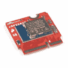](https://www.sparkfun.com/products/16984) 

将**添加到您的[购物车](https://www.sparkfun.com/cart)中！**

### [SparkFun micro mod NRF 52840 处理器](https://www.sparkfun.com/products/16984)

[In stock](https://learn.sparkfun.com/static/bubbles/ "in stock") WRL-16984

SparkFun MicroMod nRF52840 处理器提供了 ARM Cortex-M4 CPU 和 2.4 GHz 蓝牙收发器的强大组合…

$21.50[Favorited Favorite](# "Add to favorites") 9[Wish List](# "Add to wish list")****[](https://www.sparkfun.com/products/17720) 

将**添加到您的[购物车](https://www.sparkfun.com/cart)中！**

### [SparkFun MicroMod RP2040 处理器](https://www.sparkfun.com/products/17720)

[In stock](https://learn.sparkfun.com/static/bubbles/ "in stock") DEV-17720

SparkFun MicroMod Pi RP2040 处理器板是一款低成本、高性能的板，具有灵活的数字接口特性

$12.951[Favorited Favorite](# "Add to favorites") 12[Wish List](# "Add to wish list")****[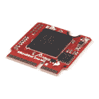](https://www.sparkfun.com/products/18030) 

将**添加到您的[购物车](https://www.sparkfun.com/cart)中！**

### [SparkFun micro mod Alorium Sno M2 处理器](https://www.sparkfun.com/products/18030)

[Out of stock](https://learn.sparkfun.com/static/bubbles/ "out of stock") DEV-18030

SparkFun MicroMod Alorium Sno 处理器采用 SNS 系统级模块(SoM ),适用于 MicroMod M.2 处理器

$49.95[Favorited Favorite](# "Add to favorites") 6[Wish List](# "Add to wish list")******** ********### 工具

您需要一把螺丝刀来固定处理器和功能板。

[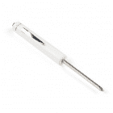](https://www.sparkfun.com/products/9146) 

将**添加到您的[购物车](https://www.sparkfun.com/cart)中！**

### [SparkFun 迷你螺丝刀](https://www.sparkfun.com/products/9146)

[In stock](https://learn.sparkfun.com/static/bubbles/ "in stock") TOL-09146

这只是你的基本可逆螺丝刀口袋大小！有平头和十字头可供选择。配有别针和…

$1.053[Favorited Favorite](# "Add to favorites") 11[Wish List](# "Add to wish list")****[](https://www.sparkfun.com/products/19012) 

将**添加到您的[购物车](https://www.sparkfun.com/cart)中！**

### [微型螺丝刀](https://www.sparkfun.com/products/19012)

[In stock](https://learn.sparkfun.com/static/bubbles/ "in stock") TOL-19012

这是一个口袋大小的磁性十字螺丝刀，专门用于 MicroMod 生态系统。

$0.50[Favorited Favorite](# "Add to favorites") 3[Wish List](# "Add to wish list")**** ****### 推荐阅读

如果您不熟悉以下概念，我们建议您在继续之前查看这些教程。

[](https://learn.sparkfun.com/tutorials/getting-started-with-micromod) [### MicroMod 入门](https://learn.sparkfun.com/tutorials/getting-started-with-micromod) Dive into the world of MicroMod - a compact interface to connect a microcontroller to various peripherals via the M.2 Connector 3[](https://learn.sparkfun.com/tutorials/micromod-artemis-processor-board-hookup-guide) [### MicroMod Artemis 处理器板连接指南](https://learn.sparkfun.com/tutorials/micromod-artemis-processor-board-hookup-guide) Get started with the Artemis MicroMod Processor Board in this tutorial 0[](https://learn.sparkfun.com/tutorials/designing-with-micromod) [### 用 MicroMod 设计](https://learn.sparkfun.com/tutorials/designing-with-micromod) This tutorial will walk you through the specs of the MicroMod processor and carrier board as well as the basics of incorporating the MicroMod form factor into your own PCB designs 0

## 硬件概述

### DA16200

MicroMod WiFi 功能板包括来自 Dialog 的 DA16200 模块和 AT 命令固件。该芯片是一个完全集成的 Wi-Fi 模块，具有超低功耗、40 MHz 晶体振荡器、32.768 KHz RTC 时钟、RF 集总 RF 滤波器、4 M 字节闪存和板载芯片天线。更多信息，请参考[数据表](https://cdn.sparkfun.com/assets/c/e/7/6/1/DA16200MOD_Datasheet_Rev3v1.pdf)。

[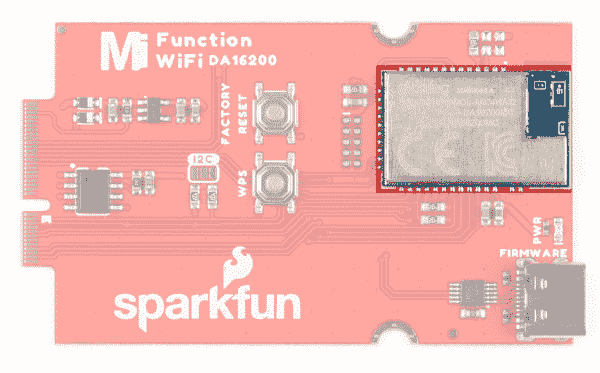](https://cdn.sparkfun.com/assets/learn_tutorials/2/0/6/1/18594-MicroMod-DA16200-Function-Board_DA16200.jpg)

### 力量

要给主板供电，您需要给 SparkFun 主板供电；要么是一个[单人](https://www.sparkfun.com/products/18575)要么是一个[双人](https://www.sparkfun.com/products/18576)。施加的电源将连接到功能板的 VIN 引脚，该引脚将通过 AP2112 3.3V/600mA 稳压器为板的其余部分降压。

[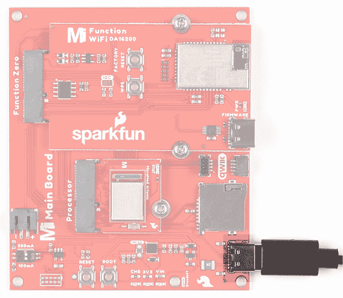](https://cdn.sparkfun.com/assets/learn_tutorials/2/0/6/1/18594-MicroMod-DA16200-Function-Board_PowerHighlighted.jpg)

### AP2112

DA16200 的工作电压为 **3.3 V** 。AP2112 可以处理 2.5-6V 的电压范围和 600mA 的输出，并确保 WiFi 单元有合适的电压。

[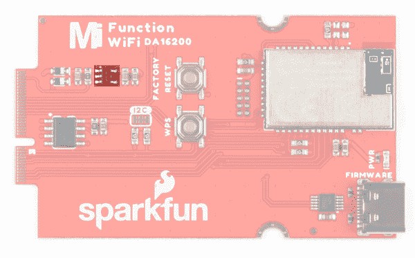](https://cdn.sparkfun.com/assets/learn_tutorials/2/0/6/1/18594-MicroMod-DA16200-Function-Board_AP2112_VoltageReg.jpg)

### CH340

该板上安装了 CH340E USB 转串行转换器，可通过其 USB Type C 连接器更新 DA16200 上的固件。你需要一个主板和第二根 USB 线来更新固件。

[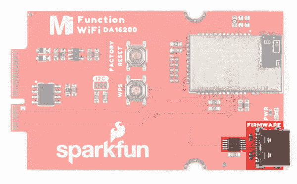](https://cdn.sparkfun.com/assets/learn_tutorials/2/0/6/1/18594-MicroMod-DA16200-Function-BoardCH340andUSBC.jpg)

### 复原按钮

复位按钮允许用户在不拔掉电路板的情况下复位对话框模块上运行的程序。

[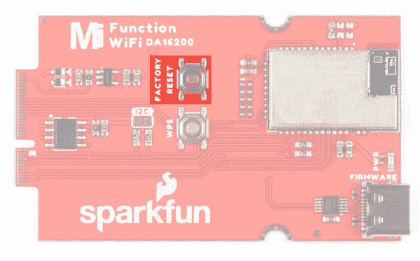](https://cdn.sparkfun.com/assets/learn_tutorials/2/0/6/1/18594-MicroMod-DA16200-Function-Board_FactoryResetButton.jpg)

### WPS 按钮

“Wi-Fi 保护设置”按钮可让您轻松快速地连接到 WiFi 网络。

[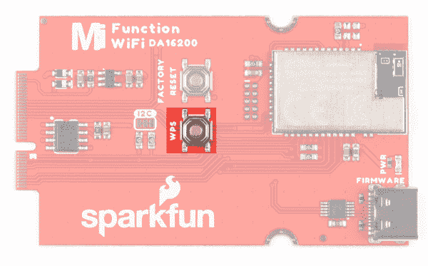](https://cdn.sparkfun.com/assets/learn_tutorials/2/0/6/1/18594-MicroMod-DA16200-Function-Board_WPSButton.jpg)

### 电可擦可编程只读存储器

该板包括一个 I ² C EEPROM。要使能对 EEPROM 的写操作，可以通过 EEPROM_WP 引脚或关闭 JP3 来拉低 WP。

[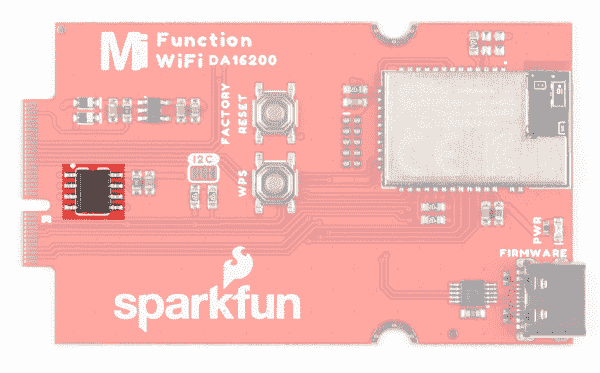](https://cdn.sparkfun.com/assets/learn_tutorials/2/0/6/1/18594-MicroMod-DA16200-Function-Board_EEPROM.jpg)

### JTAG

需要断点级别调试的高级用户可以使用未填充的 JTAG 足迹。我们建议检查我们的 [JTAG 部分](https://www.sparkfun.com/categories/tags/jtag)的兼容公头和兼容的 JTAG 编程器和调试器。

[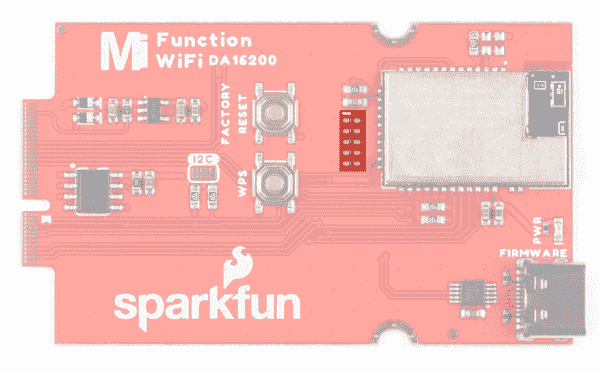](https://cdn.sparkfun.com/assets/learn_tutorials/2/0/6/1/18594-MicroMod-DA16200-Function-Board_JTAG.jpg)

### 发光二极管

只有一个电源指示灯可用。LED 亮起，表示 DA16200 可以使用 3.3V 电压调节器。您可以通过切断电路板背面的跳线来禁用它(参见下面的跳线)。

[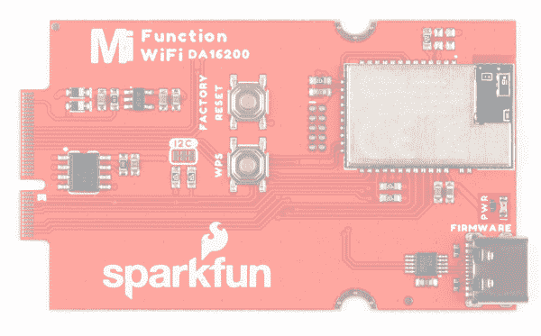](https://cdn.sparkfun.com/assets/learn_tutorials/2/0/6/1/18594-MicroMod-DA16200-Function-Board_PwrButton.jpg)

### 针织套衫

**Note:** If this is your first time working with jumpers, check out the [How to Work with Jumper Pads and PCB Traces](https://learn.sparkfun.com/tutorials/how-to-work-with-jumper-pads-and-pcb-traces/all) tutorial for more information.

以下跳线用于配置电路板。

*   **PWR** -默认情况下，标签为`PWR`的跳线是关闭的。该跳线连接 3.3V 线和 LED。切断此跳线将禁用 LED。

[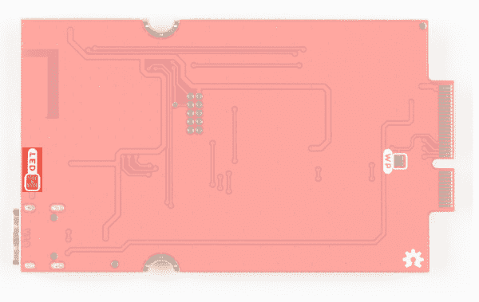](https://cdn.sparkfun.com/assets/learn_tutorials/2/0/6/1/18594-MicroMod-DA16200-Function-Board_PwrLEDJumper.jpg)

*   **I ² C 上拉电阻**——默认情况下，这个标有`I²C`的三路跳线闭合，将两个上拉电阻连接到 I ² C 数据线。如果你的 I ² C 数据线上有[多个器件，那么你可以考虑切掉这两个跳线。](https://learn.sparkfun.com/tutorials/i2c/all#i2c-at-the-hardware-level)

[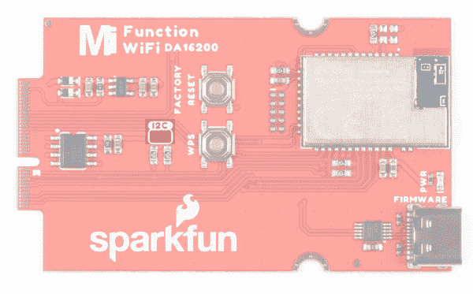](https://cdn.sparkfun.com/assets/learn_tutorials/2/0/6/1/18594-MicroMod-DA16200-Function-Board_I2CJumper.jpg)

*   **WP** -默认情况下，EEPROM 写保护开启。要禁用写保护，请关闭此跳线。

[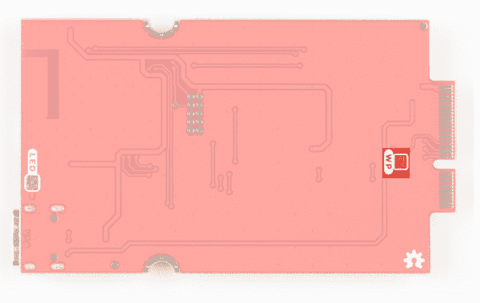](https://cdn.sparkfun.com/assets/learn_tutorials/2/0/6/1/18594-MicroMod-DA16200-Function-Board_WPJumper.jpg)

### 硬件引脚排列

MicroMod WiFi 功能板 DA16200 上的 M.2 连接器按照下面的引脚排列图布线:

[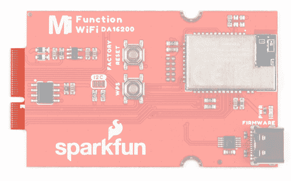](https://cdn.sparkfun.com/assets/learn_tutorials/2/0/6/1/18594-MicroMod-DA16200-Function-M2Connector.jpg)

根据您的窗口大小，您可能需要使用表格底部的水平滚动条来查看附加引脚功能。请注意，相对两侧的 M.2 连接器引脚相互偏移，如底部引脚所示(未连接)*。主功能下有“-”的引脚没有连接。

*   [MicroMod WiFi 功能板- DA16200 引脚表](#da16200)

| **音频** | **UART** | **GPIO/总线** | **I ² C** | **SDIO** 的缩写形式 | **SPI0** | **专用** |

| 描述 | 功能 | 底部
销 | 顶部
销 | 功能 | 描述 |
|  | (未连接) |  | **75** | GND |  |
|  | - | **74** | **73** | 3.3V | 电源:3.3-6V |
|  | - | **72** | **71** | powermen(消歧义) | 电源:3.3-6V |
|  | - | **70** | **69** | - |  |
|  | - | **66** | **65** | - |  |
|  | - | **64** | **63** | - |  |
|  | - | **62** | **61** | - |  |
|  | - | **60** | **59** | - |  |
|  | - | **58** | **57** | RTC_WAKE1 | 此引脚是一个输入引脚，用于从传感器等外部设备接收外部事件信号。RTC 模块通过此引脚检测外部事件信号，并将 DA16200 从睡眠模式 2 或睡眠模式 3 唤醒。 |
|  | - | **56** | **55** | RTC_WAKE2 | 此引脚是一个输入引脚，用于从传感器等外部设备接收外部事件信号。RTC 模块通过此引脚检测外部事件信号，并将 DA16200 从睡眠模式 2 或睡眠模式 3 唤醒。 |
|  | - | **54** | **53** | RTC_PWR_KEY | 使能启动预定义的上电序列，最终所有必要的电源都会提供给所有子模块，包括 DA16200 中的主数字模块。禁用时，所有模块断电，该模式定义为睡眠模式 1。 |
|  | - | **52** | **51** | GPIOA11 |  |
|  | - | **50** | **49** | 特许测量员 |  |
|  | - | **48** | **47** | GPIOA10 |  |
|  | - | **46** | **45** | GND |  |
|  | - | **44** | **43** | - |  |
|  | - | **42** | **41** | - |  |
| 控制 EEPROM 的写保护引脚。拉低以使能。 | EEPROM_WP | **40** | **39** | GND |  |
|  | - | **38** | **37** | - |  |
| 控制 EEPROM 的 I ² C 地址配置。 | EEPROM_A0 | **36** | **35** | - |  |
| 控制 EEPROM 的 I ² C 地址配置。 | EEPROM_A1 | **34** | **33** | GND |  |
| 控制 EEPROM 的 I ² C 地址配置。 | EEPROM_A2 | **32** | **31** | 模块密钥 |  |
|  | 模块密钥 | **30** | **29** | 模块密钥 |  |
|  | 模块密钥 | **28** | **27** | 模块密钥 |  |
|  | 模块密钥 | **26** | **25** | 模块密钥 |  |
|  | 模块密钥 | **24** | **23** | - |  |
|  | - | **22** | **21** | i2c _ scl | I²EEPROM 的 C 时钟信号 |
|  | - | **20** | **19** | I2C SDA | I²EEPROM 的 C 数据信号 |
|  | - | **18** | **17** | - |  |
|  | - | **16** | **15** | U1 RXI |  |
|  | - | **14** | **13** | TXO U1 |  |
|  | - | **12** | **11** | - |  |
|  | - | **10** | **9** | - |  |
|  | - | **8** | **7** | 奇波 |  |
|  | - | **6** | **5** | 科皮 |  |
|  | - | **4** | **3** | 血清肌酸激酶 |  |
|  | - | **2** | **1** | GND |  |

### 电路板尺寸

该板采用标准的 MicroMod 功能板尺寸，尺寸约为 1.50"x2.56 "。

[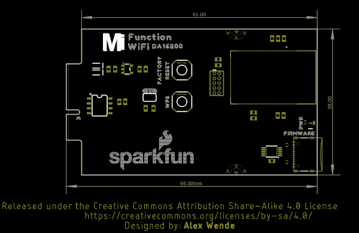](https://cdn.sparkfun.com/assets/9/6/3/c/8/BoardOutline.png)

## 硬件连接

### 向主板添加处理器板

将 MicroMod Artemis 处理器板的顶部键与主板的*处理器*螺丝端子对齐，并将板倾斜到插槽中。将电路板以一定角度插入 M.2 连接器。

**Note:** There is no way to insert the processor backward since the key prevents it from mating with the M.2 connector and as an extra safeguard to prevent inserting a processor that matches the key, the mounting screw is offset so you will not be able to secure an improperly connected processor board.

处理器板将以一定角度竖起，如下图所示:

[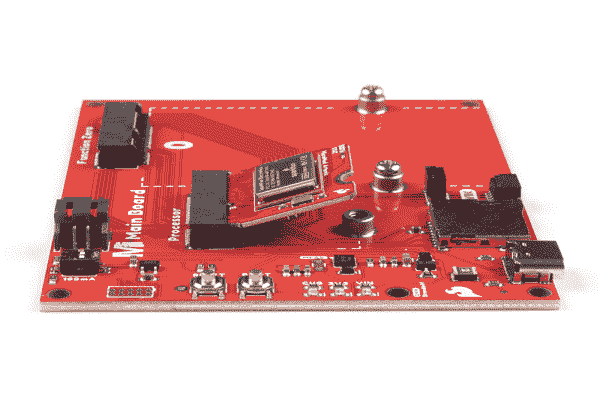](https://cdn.sparkfun.com/assets/learn_tutorials/2/0/6/1/DA16200_Function_Board_Hookup_Guide-01.jpg)

一旦电路板插入插座，轻轻向下推 MicroMod 处理器板，用 Phillip 头拧紧螺丝。

[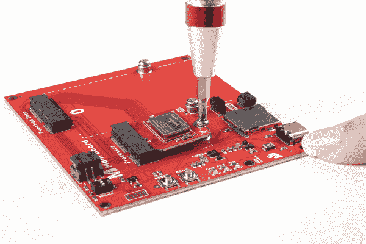](https://cdn.sparkfun.com/assets/learn_tutorials/2/0/6/1/DA16200_Function_Board_Hookup_Guide-02.jpg)

### 向主板添加功能板

与处理器板一样，将 MicroMod WiFi 功能板的顶部按键对准主板上*功能板*侧的螺丝端子，并将该板倾斜到插槽中。将电路板以一定角度插入 M.2 连接器。

[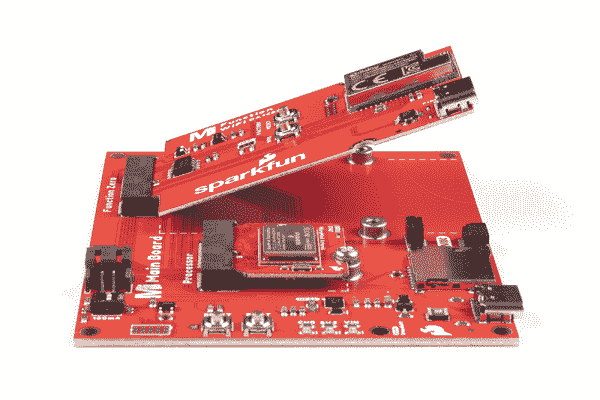](https://cdn.sparkfun.com/assets/learn_tutorials/2/0/6/1/DA16200_Function_Board_Hookup_Guide-03.jpg)

一旦电路板插入插座，轻轻向下推动 MicroMod 功能板，用十字头拧紧螺丝。

[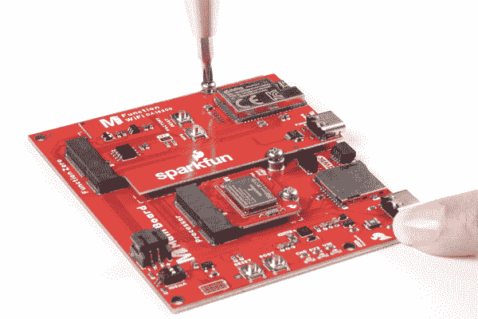](https://cdn.sparkfun.com/assets/learn_tutorials/2/0/6/1/DA16200_Function_Board_Hookup_Guide-04.jpg)

一旦两块板都固定好了，你组装好的 MicroMod 系统看起来应该和下图相似！

[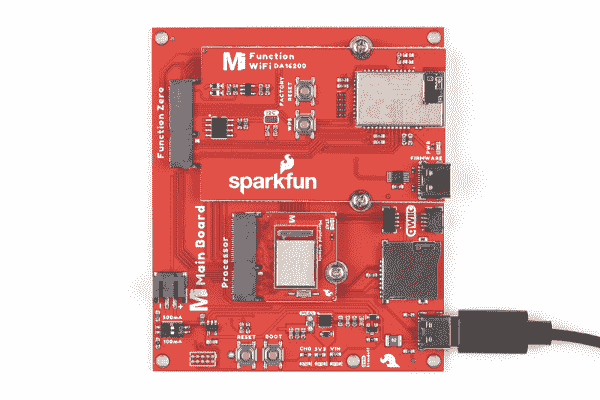](https://cdn.sparkfun.com/assets/learn_tutorials/2/0/6/1/DA16200_Function_Board_Hookup_Guide-05.jpg)

### DA16200 固件更新

要更新固件，您需要将 USB C 电缆连接到 MicroMod WiFi 功能板(DA16200)和计算机的 COM 端口。还需要一个带第二根 USB C 线的附加主板来给主板和 MicroMod WiFi 功能板供电。

[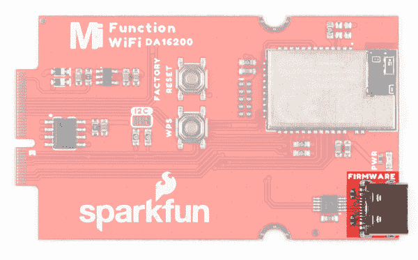](https://cdn.sparkfun.com/assets/learn_tutorials/2/0/6/1/18594-MicroMod-DA16200-Function-Board_FirmwareUpload.jpg)

## 软件安装

**Note:** This example assumes you are using the latest version of the Arduino IDE on your desktop. If this is your first time using Arduino, please review our tutorial on [installing the Arduino IDE.](https://learn.sparkfun.com/tutorials/installing-arduino-ide)

### Arduino 板定义

我们假设您已经为处理器板安装了必要的板文件。在这种情况下，我们使用 MicroMod Artemis 处理器板。

[](https://learn.sparkfun.com/tutorials/micromod-artemis-processor-board-hookup-guide) [### MicroMod Artemis 处理器板连接指南

#### 2020 年 10 月 21 日](https://learn.sparkfun.com/tutorials/micromod-artemis-processor-board-hookup-guide) Get started with the Artemis MicroMod Processor Board in this tutorial 0

### CH340 驱动程序

您可能需要为 USB 转串行转换器安装 CH340 驱动程序。查看我们的章节[“如何安装 CH340 驱动程序”](https://learn.sparkfun.com/tutorials/how-to-install-ch340-drivers)以获得安装帮助。

[Download Windows CH340 Driver (ZIP)](https://cdn.sparkfun.com/assets/learn_tutorials/5/9/7/Windows-CH340-Driver.zip)[Download Mac OSX CH340 Driver (ZIP)](https://cdn.sparkfun.com/assets/learn_tutorials/8/4/4/CH341SER_MAC.ZIP)**Note:** If applicable, make sure you are using the proper driver files for your CPU architecture. This is usually indicated by a folder or file name with "*x86*" for 32-bit processors or "*x64*" for 64-bit processors.

#### 主板示例-引脚连接表

在下面的例子中，我们使用的是 Artemis 处理器板。对于 DA16200 特定引脚，以下是在 Arduino 草图中使用的映射:

| **音频** | **UART** | **GPIO/总线** | **I ² C** | **SDIO** 的缩写形式 | **SPI0** | **专用** |

| 功能板
引脚名称 | 输入/输出
方向 | 主板的
处理器引脚 |
| 插槽 0 | 插槽 1 |
| VCC | 投入 | - |
| 3.3V | 投入 | - |
| GND | - | - |
| RTC_WAKE1 | 投入 | G2 Esports 电子竞技俱乐部 | 七国集团 |
| RTC_WAKE2 | 输出 | G1 | G6 |
| RTC_PWR_KEY | 投入 | 静止状态 | G5 |
| GPIOA11 |  | PWM0 | PWM1 |
| 特许测量员 |  | CS0 | CS1 |
| GPIOA10 |  | D0 | D1 |

## 示例 1:基本连接

将下面的代码复制粘贴到一个新的 Arduino 草图中。

```
language:c
/******************************************************************************
  Example_01 Basic Connection

  Connect to the DA16200 Module
  Print help commands

  Development environment specifics:
  IDE: Arduino 1.8.13
  Hardware Platform: MicroMod Artemis Processor, Single MicroMod Main Board

  Hardware Connections:
  Connect the MicroMod Processor Board to the Processor M2 Connector of the Main Board
  Connect the MicroMod DA16200 Function Board to the Function M2 Connector of the Main Board

  G0      --> RTC_PWR_KEY
  4       --> PWR_EN
  3.3V    --> 3.3V
  GND     --> GND

  This program is distributed in the hope that it will be useful,
  but WITHOUT ANY WARRANTY; without even the implied warranty of
  MERCHANTABILITY or FITNESS FOR A PARTICULAR PURPOSE. See the
  GNU General Public License for more details.

  You should have received a copy of the GNU General Public License
  along with this program.  If not, see <http://www.gnu.org/licenses/>.
******************************************************************************/    
#define PWR_EN 4
#define RTC_PWR_KEY G0

void setup() {
  pinMode(PWR_EN,OUTPUT);
  digitalWrite(PWR_EN,LOW);

  pinMode(RTC_PWR_KEY,OUTPUT);
  digitalWrite(RTC_PWR_KEY,LOW);

  Serial.begin(115200);
  Serial1.begin(115200); 

  while(!Serial){

  }
  delay(1000);

  //Enable DA16200 Module RTC power block
  pinMode(PWR_EN,OUTPUT);
  digitalWrite(PWR_EN,LOW);

  pinMode(RTC_PWR_KEY,OUTPUT);
  digitalWrite(RTC_PWR_KEY,LOW);

  Serial.println("DA16200 AT Command example sending/receiving commands\n");
  while(!Serial){

  }

  pinMode(PWR_EN,INPUT);

  pinMode(RTC_PWR_KEY,OUTPUT);
  digitalWrite(RTC_PWR_KEY,HIGH);

  delay(2000);

  //Listen for ready message ("+INIT:DONE")
  byte count = 0;
  String msg = "";

  while(count<20)
  {
    delay(100);
    while(Serial1.available())
    {
      msg += char(Serial1.read());
    }
    if(msg.length() > 5) break;
    count++;
    delay(100);
  }
  msg = msg.substring(3,msg.length());

  if(msg.length()>5)
  {
    Serial.println("Expecting: \"INIT:DONE,(0 or 1)");
    Serial.println("Received: " + msg);
  }
  else
  {
    Serial.println("Failed to receive initialization message\n");

    Serial.println("Make sure the baud rate for Serial1 matches the baud rate\n" \
                   "saved to the DA16200\. You can also perform a factory reset by\n" \
                   "pressing and holding the GPIOA7 button for ~5s, which will\n" \
                   "reset the baud rate back to 115200");
  }
    Serial.println("\nTry entering \"?\" or \"help\" to print out the list of AT commands\n" \
                 "\nIf the received text is unreadable, try changing the baud rate to\n" \
                 "9600 with the command \"ATB=9600\" in the terminal. Next, update the\n" \
                 "example code by setting Serial1 to 9600 baud and trying again.\n");
}

void loop() {
    while(Serial.available())
    {
      Serial1.print(char(Serial.read()));
    }

    while(Serial1.available())
    {
      Serial.print(char(Serial1.read()));
    }
} 
```

设置您的电路板和串行端口，然后将草图上传到您的 Arduino。然后[打开串行监视器](https://learn.sparkfun.com/tutorials/terminal-basics/arduino-serial-monitor-windows-mac-linux)。确保您的波特率设置为 9600。您将开始看到输出。

[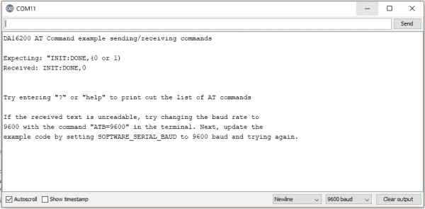](https://cdn.sparkfun.com/assets/learn_tutorials/2/0/6/1/example1Output.png)

## 示例 2:连接到 WiFi

让我们用一个简单的例子来检查一下 WiFi，以抓住时间。

将下面的代码复制粘贴到一个新的 Arduino 草图中。

```
language:c
/******************************************************************************
  Example_02 WiFi Communcation

  Connect WiFi using the provided network credentials
  Talk to NTP server to set the current date/time
  Update the time to the correct time zone
  Print the current time approx. once every second

  Development environment specifics:
  IDE: Arduino 1.8.13
  Hardware Platform: MicroMod Artemis Processor, Single MicroMod Main Board

  Hardware Connections:
  Connect the MicroMod Processor Board to the Processor M2 Connector of the Main Board
  Connect the MicroMod DA16200 Function Board to the Function M2 Connector of the Main Board

  G0      --> RTC_PWR_KEY
  4       --> PWR_EN
  3.3V    --> 3.3V
  GND     --> GND

  This program is distributed in the hope that it will be useful,
  but WITHOUT ANY WARRANTY; without even the implied warranty of
  MERCHANTABILITY or FITNESS FOR A PARTICULAR PURPOSE. See the
  GNU General Public License for more details.

  You should have received a copy of the GNU General Public License
  along with this program.  If not, see <http://www.gnu.org/licenses/>.
******************************************************************************/
#define PWR_EN 4
#define RTC_PWR_KEY G0

String wifiSSID = "SSID";
String wifiPass = "PASSWORD";

int timezoneOffset = 0; //The hours offset from UTC (Mountain time is -6 for daylight savings, and -7 for standard)

void setup() {
  Serial.begin(115200);
  Serial1.begin(115200); 

  //Enable DA16200 Module RTC power block
  pinMode(RTC_PWR_KEY,OUTPUT);
  digitalWrite(RTC_PWR_KEY,HIGH);

  Serial.println("DA16200 AT Command Example: Connecting to WiFi\n");

  //Listen for ready message ("+INIT:DONE")
  byte count = 0;
  String msg = "";
  while(count<20)
  {
    while(Serial1.available())
    {
      msg += char(Serial1.read());
    }
    if(msg.length() > 5) break;
    count++;
    delay(100);
  }
  msg = msg.substring(3,msg.length()); //Remove NULL,CR,LF characters from response

  if(msg.length()>5)
  {
    Serial.println("Expecting: \"INIT:DONE,(0 or 1)");
    Serial.println("Received: " + msg);
  }
  else
  {
    Serial.println("Failed to receive initialization message.\n" \
                   "Make sure you're using the correct baud rate.\n");
    while(1);
  }

  //Configure module for STA mode
  Serial.println("Sending:AT+WFMODE=0");
  Serial1.println("AT+WFMODE=0");

  //Wait for "OK" response
  while(1)
  {
    msg = "";
    while(Serial1.available())
    {
      msg += char(Serial1.read());
      delay(1);
    }
    Serial.print(msg);
    if(msg.length() > 1) break;
  }

  //Apply a software reset to finish changing the mode
  Serial.println("Sending:AT+RESTART");
  Serial1.println("AT+RESTART");

  //Wait for "OK" response
  while(1)
  {
    msg = "";
    while(Serial1.available())
    {
      msg += char(Serial1.read());
      delay(1);
    }
    Serial.print(msg);
    if(msg.length() > 1) break;
  }

  //Listen for ready message ("+INIT:DONE") after the reset is finished
  count = 0;
  msg = "";
  while(count<20)
  {
    while(Serial1.available())
    {
      msg += char(Serial1.read());
    }
    if(msg.length() > 5) break;
    count++;
    delay(100);
  }

  Serial.println(count);
  Serial.println(msg);
  msg = msg.substring(3,msg.length()); //Remove NULL,CR,LF characters from response

  if(msg.length()>5)
  {
    Serial.println("Expecting: \"INIT:DONE,(0 or 1)");
    Serial.println("Received: " + msg);
  }
  else
  {
    Serial.println("Failed to receive initialization message.\n" \
                   "Continuing anyway...\n");
  }

  //Connect to WiFi using the provided credentials
  Serial.println("Sending:AT+WFJAPA=" + wifiSSID + "," + wifiPass);
  Serial1.println("AT+WFJAPA=" + wifiSSID + "," + wifiPass);

  Serial.println("Waiting for connection response...");
  while(1)
  {
    msg = "";
    while(Serial1.available())
    {
      msg += char(Serial1.read());
      delay(1);
    }

    if(msg.length() > 10) 
    {
      Serial.print("Response:");
      Serial.println(msg);
      break;
    }
  }

  msg = msg.substring(3,msg.length()); //Remove NULL,CR,LF characters from response

  //If connection to AP is successful, response will be WFJAP:1,SSID,IP_ADDRESS, or WJAP:0 if failed
  if(msg.startsWith("WFJAP:1"))
  {
      //Talk to NTP server to get the current time, along with how often to get time sync
      Serial.println("Sending:AT+NWSNTP=1,pool.ntp.org,86400");
      Serial1.println("AT+NWSNTP=1,pool.ntp.org,86400");

      //Wait for "OK" response
      while(1)
      {
        String msg = "";
        while(Serial1.available())
        {
          msg += char(Serial1.read());
          delay(1);
        }
        Serial.print(msg);
        if(msg.length() > 1) break;
      }

      //Provides the correct UTC offset for the current time
      Serial.println("Sending:AT+TZONE="+String(timezoneOffset*3600));
      Serial1.println("AT+TZONE="+String(timezoneOffset*3600));

      //Wait for "OK" response
      while(1)
      {
        String msg = "";
        while(Serial1.available())
        {
          msg += char(Serial1.read());
          delay(1);
        }
        Serial.print(msg);
        if(msg.length() > 1) break;
      }  
  }
  else
  {
    Serial.println("Connection unsucessful :(\n\n" \
                   "Make sure the WiFi credentials are correct, and the module is in the station mode");
    while(1);
  }
}

void loop() {
  //Get the current time
  Serial.println("Sending:AT+TIME");
  Serial1.println("AT+TIME");

  while(Serial1.available())
  {
    Serial.print(char(Serial1.read()));
    delay(1);
  }

  delay(1000);
} 
```

设置您的电路板和串行端口，然后将草图上传到您的 Arduino。然后[打开串行监视器](https://learn.sparkfun.com/tutorials/terminal-basics/arduino-serial-monitor-windows-mac-linux)。确保您的波特率设置为 9600。您将开始看到输出。

[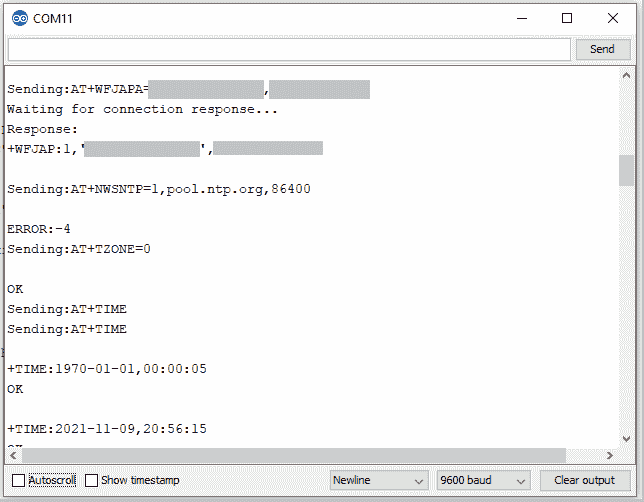](https://cdn.sparkfun.com/assets/learn_tutorials/2/0/6/1/Example2Output.png)

## 解决纷争

### 固件

如果出于任何原因，您希望更新固件，您可以参考 [DA16200 AT 命令用户手册](https://cdn.sparkfun.com/assets/learn_tutorials/1/9/9/1/UM-WI-003_DA16200_AT-Command_User_Manual_Rev_2v3.pdf)了解更多关于通过 AT 命令下载正确固件的信息。

[DA16200 AT Command User Manual](https://cdn.sparkfun.com/assets/learn_tutorials/1/9/9/1/UM-WI-003_DA16200_AT-Command_User_Manual_Rev_2v3.pdf)**Not working as expected and need help?**

If you need technical assistance and more information on a product that is not working as you expected, we recommend heading on over to the [SparkFun Technical Assistance](https://www.sparkfun.com/technical_assistance) page for some initial troubleshooting.

[SparkFun Technical Assistance Page](https://www.sparkfun.com/technical_assistance)

If you don't find what you need there, the [SparkFun Forums: MicroMod](https://forum.sparkfun.com/viewforum.php?f=180) are a great place to find and ask for help. If this is your first visit, you'll need to [create a Forum Account](https://forum.sparkfun.com/ucp.php?mode=register) to search product forums and post questions.

[SparkFun Forums: MicroMod](https://forum.sparkfun.com/viewforum.php?f=180)

## 资源和更进一步

现在，您已经成功地启动并运行了您的 MicroMod ESP 功能板，是时候将它整合到您自己的项目中了！有关更多信息，请查看以下资源:

*   [示意图(PDF)](https://cdn.sparkfun.com/assets/1/7/b/7/8/SparkFun_MicroMod_DA16200_Function.pdf)
*   [老鹰文件(ZIP)](https://cdn.sparkfun.com/assets/d/9/2/a/0/18594_DA16200-FunctionBoard-EagleFiles.zip)
*   [板尺寸(PNG)](https://cdn.sparkfun.com/assets/9/6/3/c/8/BoardOutline.png)
*   [CH340 驱动程序](https://learn.sparkfun.com/tutorials/how-to-install-ch340-drivers)
    *   [窗户](https://cdn.sparkfun.com/assets/learn_tutorials/5/9/7/Windows-CH340-Driver.zip)
    *   马克斯·OSX
*   [DA16200 数据表(PDF)](https://cdn.sparkfun.com/assets/c/e/7/6/1/DA16200MOD_Datasheet_Rev3v1.pdf)
*   [DA16200 AT 指令用户手册](https://cdn.sparkfun.com/assets/learn_tutorials/1/9/9/1/UM-WI-003_DA16200_AT-Command_User_Manual_Rev_2v3.pdf)
*   [AP2112 数据表(PDF)](https://cdn.sparkfun.com/assets/learn_tutorials/2/0/6/1/AP2112.pdf)
*   [GitHub 硬件回购](https://github.com/sparkfun/MicroMod_DA16200_Function)
*   [da 16200](https://www.dialog-semiconductor.com/products/wi-fi/da16200-modules#tab-field_tab_content_resources)的资源(在 Dialog 网站上)
*   [da 16200](https://www.dialog-semiconductor.com/products/wi-fi/da16200-modules#tab-support_tab_content)的支持论坛(在 Dialog 网站上)

寻找更多灵感？查看与 MicroMod 相关的其他教程。

[](https://learn.sparkfun.com/tutorials/micromod-all-the-pins-atp-carrier-board) [### 微模压所有引脚(ATP)载板](https://learn.sparkfun.com/tutorials/micromod-all-the-pins-atp-carrier-board) Access All The Pins (ATP) of the MicroMod Processor Board with the Carrier Board 0[](https://learn.sparkfun.com/tutorials/micromod-teensy-processor-hookup-guide) [### MicroMod Teensy 处理器连接指南](https://learn.sparkfun.com/tutorials/micromod-teensy-processor-hookup-guide) Add the processing power and versatility of the Teensy to your MicroMod project following this guide for the SparkFun MicroMod Teensy Processor.[Favorited Favorite](# "Add to favorites") 0[](https://learn.sparkfun.com/tutorials/qwiic-carrier-board-hookup-guide) [### Qwiic 载板连接指南](https://learn.sparkfun.com/tutorials/qwiic-carrier-board-hookup-guide) The Qwiic carrier board is the latest way to rapid prototype with the included M.2 socket to swap processor boards and Qwiic connectors to easily connect I2C devices.[Favorited Favorite](# "Add to favorites") 0[](https://learn.sparkfun.com/tutorials/micromod-alorium-sno-m2-processor-board-hookup-guide) [### MicroMod Alorium Sno M2 处理器板连接指南](https://learn.sparkfun.com/tutorials/micromod-alorium-sno-m2-processor-board-hookup-guide) Get started with the MicroMod Alorium Sno M2 Processor Board 1************************