# MIDI 屏蔽连接指南

> 原文：<https://learn.sparkfun.com/tutorials/midi-shield-hookup-guide>

## 介绍

Sparkfun [MIDI Shield](https://www.sparkfun.com/products/12898) 允许您将 MIDI 端口添加到 R3 兼容的 Arduino 板上。

[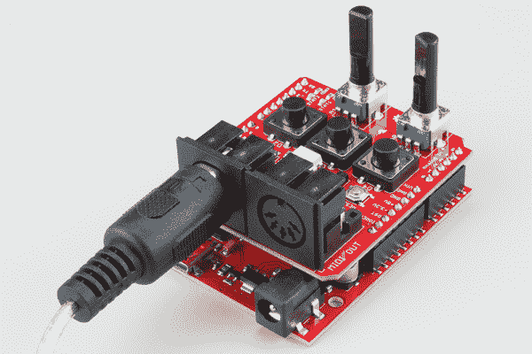](https://cdn.sparkfun.com/assets/learn_tutorials/4/0/9/product-in-use.jpg)

屏蔽提供标准的 MIDI 端口电路，包括 5 针 DIN 连接器和一个光隔离的 MIDI 输入。屏蔽也有一些额外的输入和输出设备。D6 和 D7 上有发光二极管，D2、D3 和 D4 上有按钮，A0 和 A1 上有旋转电位计。

V1.5 修订版还增加了几个可配置的功能，如将 MIDI 输出转换为 MIDI thru，以及为 MIDI 使用[软件串行](https://www.arduino.cc/en/Reference/SoftwareSerial)端口的选项，保留硬件串行用于编程和调试。它还缓冲输出，使其与 [Arduino Pro](https://www.sparkfun.com/products/10915) 兼容，而无需绕过串行 TX 和 RX 线上的保护电阻。

本指南将向您展示如何将 shield 组合在一起，然后探索几个示例项目，演示如何将 MIDI 应用到您的项目中。

### 推荐阅读

*   如果你是 MIDI 新手，我们的 [MIDI 教程](https://learn.sparkfun.com/tutorials/midi-tutorial)应该可以帮助你快速上手。
*   我们将使用 [47 效果 MIDI 库](https://github.com/FortySevenEffects/arduino_midi_library)作为示例项目的核心。

## 装配

在组装你的 MIDI 盾之前，考虑你将如何使用它。如果你不需要按钮和电位计，你可以不要它们。同样，如果您只需要 MIDI 输入或输出端口，您可以关闭另一个端口。最后，有几个头文件选项——您可以选择适合您的应用程序的头文件。

### 材料

MIDI shield 套件包含以下部件。

[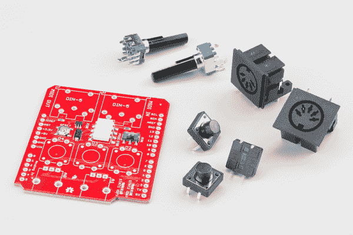](https://cdn.sparkfun.com/assets/learn_tutorials/4/0/9/assem-parts.jpg)

*   MIDI 屏蔽 PCB
*   2 个 5 针 DIN 连接器
*   2x 10K 旋转电位计
*   3 个 12 毫米触觉按钮开关

您还需要选择适合您的应用程序的标题。

*   您可以使用 [R3 可堆叠接头套件](https://www.sparkfun.com/products/11417)，但是它们有点高，很难够到按钮。
*   如果您使用的 Arduino 板早于 R3，如 [Arduino Pro](https://www.sparkfun.com/products/10915) ，您可以使用常规的[可堆叠插头套件](https://www.sparkfun.com/products/10007)。
*   或者，您可以使用常规的[卡扣式接头](https://www.sparkfun.com/products/116)，它们不会粘在电路板上方太远，从而留出足够的空间来接触开关和电位计。

[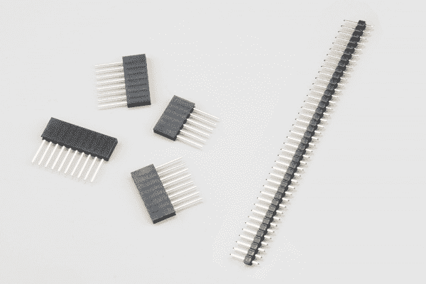](https://cdn.sparkfun.com/assets/learn_tutorials/4/0/9/assem-headers.jpg)*Stackable Headers (left) and Snappable Headers*

### 工具

建议使用以下工具。

*   一个尖端很细的烙铁。
*   一些焊料，要么[含铅](https://www.sparkfun.com/products/9161)要么[无铅](https://www.sparkfun.com/products/9325)。
*   放大镜或[放大镜](https://www.sparkfun.com/products/9316)。
*   工作时用老虎钳夹住印刷电路板。

### 建造迷笛之盾

如果你使用可堆叠的头，它们最容易放在最开始(如果你使用可咬合的头，我们会把它们留到最后)。要安装可堆叠接头，请从顶部穿过电路板

[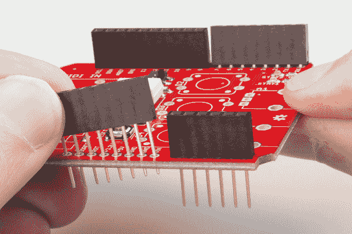](https://cdn.sparkfun.com/assets/learn_tutorials/4/0/9/assem-stacking_1.jpg)

然后将电路板翻转过来，使其由接头主体支撑。调整对齐，直到接头垂直地立在您的工作面上，并将它们焊接到位。

[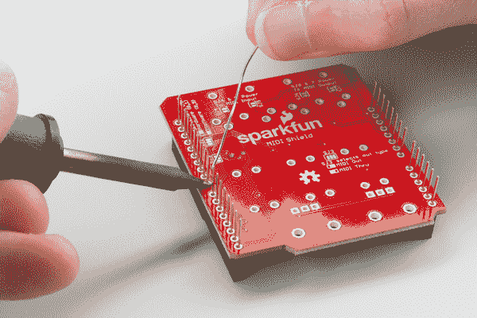](https://cdn.sparkfun.com/assets/learn_tutorials/4/0/9/assem-stacking-solder.jpg)

接下来，我们将按照从矮到高的顺序将组件安装在电路板的顶部。我们将从按钮开始——将它们穿过孔，然后将它们焊接到位。

[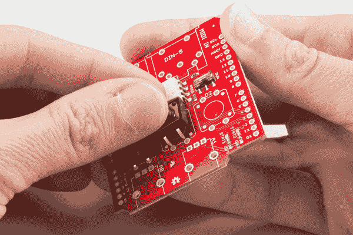](https://cdn.sparkfun.com/assets/learn_tutorials/4/0/9/assem-buttons.jpg)

接下来，安装 MIDI 插孔，焊接时要注意让它们固定在 PCB 上。

[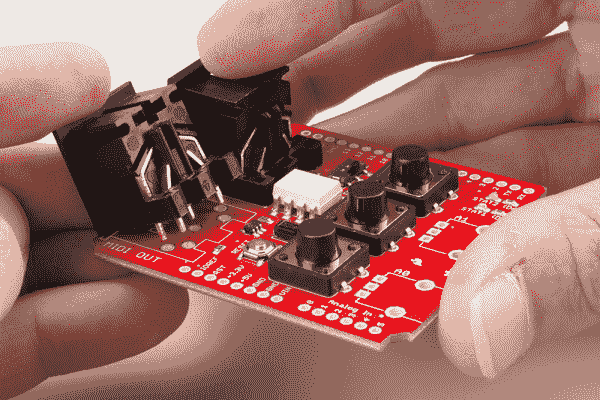](https://cdn.sparkfun.com/assets/learn_tutorials/4/0/9/assem-ports.jpg)

作为最高的元件，电位计是下一个。将它们放入 PCB 可能需要一些努力——你可能需要轻推这些接头片一点点，让它们穿过电路板。在焊接之前，再次检查轴是否垂直于电路板的表面，因为如果它们弯曲，需要很大的脱焊努力才能将其拉直。

[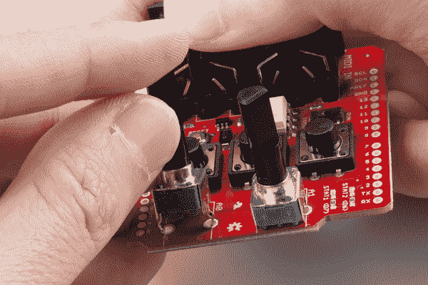](https://cdn.sparkfun.com/assets/learn_tutorials/4/0/9/assem-pots.jpg)

最后，如果你使用的是可咬合的头而不是堆叠的头，安装它们。如果你使用 Arduino 板作为装配夹具，这是最简单的。将接头卡入合适的长度(R3 板为 6、8、8 和 10)，并将它们推入 Arduino 上的插孔。然后将 MIDI 屏蔽 PCB 放在它们上面，如下所示。

[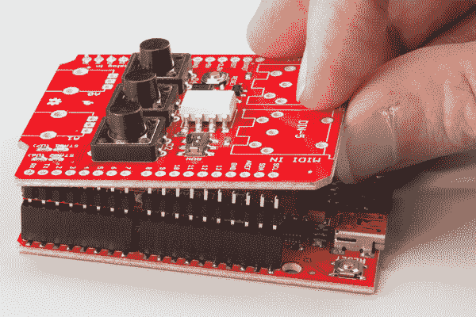](https://cdn.sparkfun.com/assets/learn_tutorials/4/0/9/assem-snappable.jpg)

从电路板顶部焊接。

### 生效

组装好后，将 MIDI 屏蔽放在 Arduino 的顶部，然后将 MIDI 设备连接到端口。

[](https://cdn.sparkfun.com/assets/learn_tutorials/4/0/9/product-in-use.jpg)

### 运行与程序

还有最后一件事要提:MIDI 输入插孔附近有一个小滑动开关。

[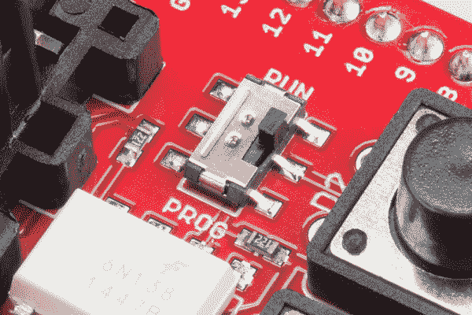](https://cdn.sparkfun.com/assets/learn_tutorials/4/0/9/assem-prog-run.jpg)

默认情况下，shield 使用 Arduino 上的硬件串行端口进行 MIDI 通信，但该端口与引导加载程序共享，当您按下 Arduino IDE 中的“load”按钮时，引导加载程序就会启动。交换机允许它们礼貌地共享端口，避免输出争用。

如果您使用硬件串行端口，请在加载草图之前将开关设置到 PROG 位置。一旦它被加载和验证，设置它回到运行。

If you're having trouble loading a sketch, doublecheck that the switch is set to `PROG`!

在下一节中，我们将讨论如何使用软件串行端口。软件串行的一个好处是你不需要每次加载的时候都记得翻转开关！

## 配置

MIDI 屏蔽在底部有许多焊接跳线，因此可以针对不同情况进行定制。

### 硬件与软件串行端口

第一组跳线是 SJ1 和 SJ2，靠近数字引脚 10-13。这些允许您在引脚 D0 和 D1 上的硬件串行端口之间交换，或者在引脚 8 和 9 上的软件串行端口之间交换。

[](https://cdn.sparkfun.com/assets/learn_tutorials/4/0/9/cfg-serial.jpg)

默认情况下，这些引脚通过中间焊盘和右侧焊盘之间的铜线相连，选择硬件 UART。如果你更愿意使用软件串行端口，用一把[业余爱好刀](https://www.sparkfun.com/products/9200)切割那条轨迹，并在中间焊盘和左边焊盘之间流一些焊料。

你为什么想这么做？我想到了几个原因。

1.  如果您使用 MIDI 的软件串行端口，引导加载程序仍然可以使用硬件端口。每次尝试加载时，您不需要切换运行/进度开关。
2.  硬件串行端口仍可用于其他通信。特别是，您可以使用`Serial.print()`语句来调试您的代码。

### MIDI 输出或直通

SJ3 在板的底部，靠近中心。

[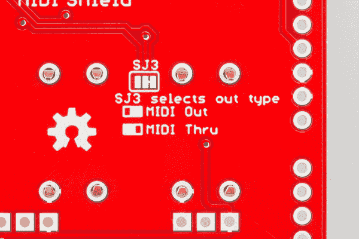](https://cdn.sparkfun.com/assets/learn_tutorials/4/0/9/cfg-thru.jpg)

它允许 MIDI 输出端口重新用作 MIDI 直通端口。MIDI out 插孔不会连接到所选串行端口的 TX 线路，而是会重新传输到达输入端的字节副本。如果您不需要 MIDI 输出来传输数据，MIDI thru 可能会有用，尤其是当您以菊花链形式连接 MIDI 设备时。

与串行端口选择跳线一样，默认路径通过铜线连接。如果你想切换跳线，切断走线，用焊料桥接另外两个焊盘。

我们将使用的 MIDI 库也有启用软件功能的选项。

### MIDI 电源

最后一组跳线是 SJ4，5，6，7。这些都是在 MIDI 端口和实施的一种形式的权力超过 MIDI。

**Proceed with caution!** Power-over-MIDI (or MIDI Phantom Power) isn't part of the MIDI standard, and several vendors have implemented proprietary versions. Before closing these jumpers, verify the voltages and pinouts of the connected devices!

MIDI 上的电源实际上并不是由 [MIDI 标准](http://midi.org/techspecs/)定义的， [制造商](https://www.eventideaudio.com/support/downloads/eclipse-user-manual)的[号](http://www.midisolutions.com/faqs.htm) [已经提出并实现了通过 MIDI 电缆向设备供电的不同方案。](http://www.diezel.ch/en/products/herbert.php)

对于如何实现这一点还没有太多的共识。一些供应商使用 7 针连接器添加了两个额外的针。有些供应商只是从引脚 4 吸走一点点电流，有些则使用标准中不使用的引脚。类似地，可用的电压也不同——可能是 5 VDC，12 VDC，有时甚至是 12 VAC！

由于 Arduinos 没有 12 VDC 电源，MIDI shield 允许您将 5V 路由到 5 引脚 DIN 连接器的未使用引脚:引脚 1 连接到 5V，引脚 3 接地。如果您想要使用一对 MIDI 屏蔽来构建一个带有附属设备(如启用 MIDI 的踏板)的系统，而该附属设备是由它所连接的较大系统供电的，那么这一点非常有用。

[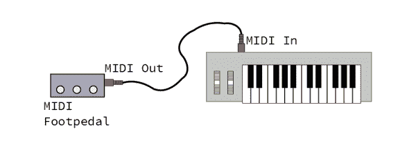](https://cdn.sparkfun.com/assets/learn_tutorials/4/0/9/remote-power.png)

在这样的配置中，踏板端的屏蔽会使输出端的跳线闭合(SJ6 和 7)，主机系统端的屏蔽会使输入跳线闭合(SJ4 和 5)。

[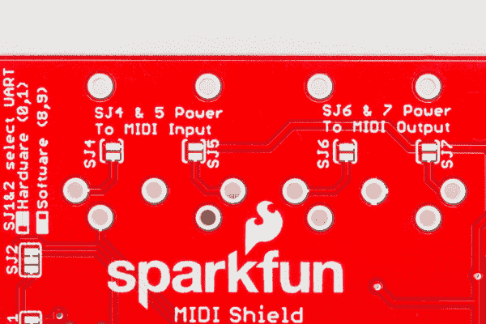](https://cdn.sparkfun.com/assets/learn_tutorials/4/0/9/cfg-power.jpg)

此配置允许您从一个 MIDI 屏蔽给另一个供电，但它可能无法与其他设备互操作。在连接之前，请仔细查阅其他设备的用户手册。此外，它需要一根连接所有五个引脚的电缆。普通的 MIDI 电缆没有连接到引脚 1 和 3；有时，MIDI 电缆被销售为连接了所有五个引脚，有时这种电缆被简单地销售为“五引脚 DIN”电缆。

通过 MIDI 为设备供电时，还有一些其他的技术问题。

*   当供电方和受电方被设计成一个系统时，这是最有用的。很难让 power over MIDI 普遍适用，因为您需要能够预测电压和电流需求。
*   最初的 MIDI 硬件实现使用光耦合器来避免接地环路。MIDI 上电会将不同设备的地连在一起，从而引发与地环路相关的问题。

## 固件基础

### Arduino 兼容 I/O

MIDI shield 具有 MIDI 电路，以及一些额外的输入和输出设备。它有三个按钮、两个电位计和两个发光二极管。

[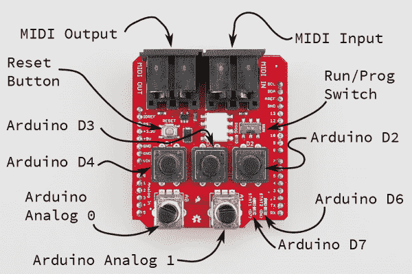](https://cdn.sparkfun.com/assets/learn_tutorials/4/0/9/gen-controls.png)

这些器件的引脚分配具有传奇色彩，可以使用标准 Arduino 功能进行接口。

*   按钮在 D2、D3 和 D4 上。要使用它们，用上拉`pinMode(<pin number>, INPUT_PULLUP);`使能相应的引脚作为输入，并用`digitalRead(<pin number>);`读取它们。输入为低电平有效——它们通常会被解读为逻辑`HIGH`,当按钮被按下时变为`LOW`。
*   电位计连接到 A0 和 A1。您可以使用`analogRead(<pin number>)`阅读它们。
*   最后，D6(绿色)和 D7(红色)上的指示灯亮起。使用`pinMode(<pin number>, OUTPUT)`启用输出，并使用`digitalWrite(<pin number>, <HIGH or LOW>)`设置输出。像按钮一样，它们是低电平有效——写高电平关闭 LED。

你可以在 MIDI Shield [GitHub 资源库](https://github.com/sparkfun/MIDI_Shield/tree/V_1.5/Firmware/buttons-N-pots)中找到一个快速的示例草图来测试按钮、电位计和 led。

### Arduino 库安装

**注意:**此示例假设您在桌面上使用的是最新版本的 Arduino IDE。如果这是你第一次使用 Arduino，请回顾我们关于[安装 Arduino IDE 的教程。](https://learn.sparkfun.com/tutorials/installing-arduino-ide)

我们将使用下面的库作为下面例子的基础。我们将在每个示例中讨论其应用的一些细节。如果您之前没有安装 Arduino 库，请查看我们的[安装指南。](https://learn.sparkfun.com/tutorials/installing-an-arduino-library)

[](https://learn.sparkfun.com/tutorials/installing-an-arduino-library) [### 安装 Arduino 库

#### 2013 年 1 月 11 日](https://learn.sparkfun.com/tutorials/installing-an-arduino-library) How do I install a custom Arduino library? It's easy! This tutorial will go over how to install an Arduino library using the Arduino Library Manager. For libraries not linked with the Arduino IDE, we will also go over manually installing an Arduino library.[Favorited Favorite](# "Add to favorites") 22

### Arduino MIDI 库

如果你已经阅读了我们的 MIDI 教程的[实现部分](https://learn.sparkfun.com/tutorials/midi-tutorial/implementing-midi)，那么你已经看到生成和解析 MIDI 消息可能有点棘手。谢天谢地，[四十七特效](http://fortyseveneffects.com/)的弗兰奇已经为 Arduino 编写了一个稳定灵活的 MIDI 库，他已经在麻省理工学院的许可下发布了这个库。

该库处理 MIDI 的通信方面，允许您发送和接收 MIDI 命令。它实现了通信层，但是对于如何应用这个库没有任何影响。它是几乎任何类型的 MIDI 设备的合适基础，从简单的信息过滤器和分离器到复杂的应用程序，如合成器、音序器和鼓机。

该库健壮而灵活，具有一些设计良好的特性。

*   它可以使用硬串口，也可以使用软串口——使用时不需要丢失`Serial.print()`进行调试。
*   它可以在 Omni 模式下处理 MIDI，也可以设置为特定的通道。
*   当您没有可用的硬件直通端口时，您可以启用软直通功能，将传入的字节与输出合并。
*   它使用一个面向对象的模板 instantion，允许你在同一个设备上声明多个 MIDI 端口，就像你在合并器或分离器中所做的那样。
*   您可以启用或禁用一些更深奥的功能，如发送运行状态和隐式注释关闭，或使用非标准波特率。

您可以通过 Arduino 库管理器获得该库。搜索“ *midi* ”并向下滚动结果，找到由**四十七个效果**制作的“ **MIDI 库**要手动安装库，请从 [GitHub 库](https://github.com/FortySevenEffects/arduino_midi_library)下载文件。解压缩它们，并放入**的内容...\src** 文件夹到您的 Arduino 库路径中。在作者的 PC 上，库被放在**C:\ Users \ author \ Documents \ Arduino \ libraries \ MIDI**中。您也可以通过下面的链接下载回购。

[GitHub: Arduino MIDI Library (ZIP)](https://github.com/FortySevenEffects/arduino_midi_library/archive/master.zip)

还有大量的 Doxygen 格式的文档，包括几个 T2 样本应用程序。

### MsTimer2 库

这些示例还使用了 MsTimer 2 库。您可以通过 Arduino 库管理器获得该库。搜索" *mstimer* "来找到 **MsTimer2** 作者**哈维尔·瓦伦西亚**要手动安装库，请从 [GitHub 库](https://github.com/PaulStoffregen/MsTimer2)下载文件。您也可以通过下面的链接下载回购。

[GitHub: MsTimer2 Library (ZIP)](https://github.com/PaulStoffregen/MsTimer2/archive/master.zip)

## 示例#1:时钟发生器和接收器

我们将演示的第一个例子是使用 [MIDI 时钟](https://learn.sparkfun.com/tutorials/midi-tutorial/messages#system_realtime)命令同步多个设备。

对于这个例子，我们将构建两种不同的时钟代码。第一种是主时钟，它产生周期性的 MIDI 时序时钟(0xF8)字节，以及开始(0xFA)、停止(0xFC)和继续(0xFB)消息。这些信息用于将音乐定时从一个设备传输到另一个设备，充当高分辨率节拍器。

[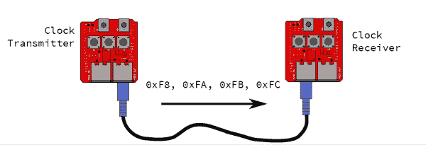](https://cdn.sparkfun.com/assets/learn_tutorials/4/0/9/clock-diagram.png)

链路的另一端监听这些消息并做出响应。

在这次演示中，我们将使用一对红板，每个都有一个 MIDI 屏蔽。你可以用链接的任何一端替换实现 MIDI 时钟的设备，如下所示。

### 固件

每块板子上都有不同的草图。主时钟将加载[时钟-gen.ino](https://github.com/sparkfun/MIDI_Shield/blob/V_1.5/Firmware/clock-gen/clock-gen.ino) 草图。

```
 /******************************************************************************
clock-gen.ino
Use SparkFun MIDI Shield as a MIDI clock generator.

Byron Jacquot, SparkFun Electronics
October 8, 2015
https://github.com/sparkfun/MIDI_Shield/tree/V_1.5/Firmware/clock-gen

Generate MIDI clock messages at the tempo indicated by  A1.
Send start/stop messages when D2 is pressed, and continue when D3 is pressed.

Resources:

  This sketch has a clock receiving counterpart in clock-recv.ino

  This code is dependent on the FortySevenEffects MIDI library for Arduino.
  https://github.com/FortySevenEffects/arduino_midi_library
  This was done using version 4.2, hash fb693e724508cb8a473fa0bf1915101134206c34
  This library is now under the MIT license, as well.
  You'll need to install that library into the Arduino IDE before compiling.

Development environment specifics:
  It was developed for the Arduino Uno compatible SparkFun RedBoard, with a  SparkFun
  MIDI Shield.

  Written, compiled and loaded with Arduino 1.6.5

This code is released under the [MIT License](http://opensource.org/licenses/MIT).

Please review the LICENSE.md file included with this example. If you have any questions 
or concerns with licensing, please contact techsupport@sparkfun.com.

Distributed as-is; no warranty is given.
******************************************************************************/

#include <softwareserial.h>#include <mstimer2.h>#include <midi.h>#define PIN_LED_PLAYING 6
#define PIN_LED_TEMPO 7
#define PIN_PLAY_INPUT 2
#define PIN_CONTINUE_INPUT 3

#define PIN_TEMPO_POT 1

static const uint16_t DEBOUNCE_COUNT = 50;

//SoftwareSerial SoftSerial(8,9);

/* Args: 
   - type of port to use (hard/soft)
   - port object name
   - name for this midi instance
*/
MIDI_CREATE_INSTANCE(HardwareSerial, Serial, MIDI);
//MIDI_CREATE_INSTANCE(SoftwareSerial, SoftSerial, MIDI);

bool running;
bool send_start;
bool send_stop;
bool send_continue;
bool send_tick;
uint32_t tempo_delay;

void play_button_event()
{
  // toggle running state, 
  // send corresponding responses
  running = !running;

    if(running)
    {
      send_start = true;
      digitalWrite(PIN_LED_PLAYING, LOW);
    }
    else
    {
      send_stop = true;
      digitalWrite(PIN_LED_PLAYING, HIGH);
    }
}

void cont_button_event()
{
  // ignore continue if running
  if(!running)
  {
    send_continue = true;
    running = true;
    digitalWrite(PIN_LED_PLAYING, LOW);
  }
}

void timer_callback()
{
  send_tick = true;
}

void check_pots()
{
  uint32_t pot_val;
  uint32_t calc;

  pot_val = analogRead(PIN_TEMPO_POT);

  // Result is 10 bits
  calc = (((0x3ff - pot_val) * 75)/1023) + 8;

  tempo_delay = calc  ;//* 5;
}

void check_buttons()
{
  uint8_t val;
  static uint16_t play_debounce = 0;
  static uint16_t cont_debounce = 0;

  // First the PLAY/STOP button  
  val = digitalRead(PIN_PLAY_INPUT);

  if(val == LOW)
  {
    play_debounce++;

    if(play_debounce == DEBOUNCE_COUNT)
    {
      play_button_event();
    }
  }
  else
  {
    play_debounce = 0;
  }

  // Then the continue button
  val = digitalRead(PIN_CONTINUE_INPUT);

  if(val == LOW)
  {
    cont_debounce++;

    if(cont_debounce == DEBOUNCE_COUNT)
    {
      cont_button_event();
    }
  }
  else
  {
    cont_debounce = 0;
  }

}

void setup() 
{
  // put your setup code here, to run once:

  // LED outputs
  pinMode(PIN_LED_PLAYING, OUTPUT);
  pinMode(PIN_LED_TEMPO, OUTPUT);
  digitalWrite(PIN_LED_PLAYING, HIGH);
  digitalWrite(PIN_LED_TEMPO, HIGH);

  // button inputs
  pinMode(PIN_PLAY_INPUT, INPUT_PULLUP);
  pinMode(PIN_CONTINUE_INPUT, INPUT_PULLUP);

//  Serial.begin(9600);
//  Serial.println("Setting up");

//  SoftSerial.begin(31250);

  // do I need to init the soft serial port?

#if 1
  MIDI.begin(MIDI_CHANNEL_OMNI);
  MIDI.turnThruOff();
#endif  

  running = false;
  send_start = false;
  send_stop = false;
  send_tick = false;

  // prime the tempo pump
  check_pots();

//  check_timing();

  MsTimer2::set(tempo_delay, timer_callback);
  MsTimer2::start();

}

void loop() 
{
  static uint32_t loops = 0;  
  static uint8_t  ticks = 0;
  static uint8_t  prev_ticks = 0;
  bool reset_timer = false;

  // put your main code here, to run repeatedly:

  // turn the crank...
  MIDI.read();

  // Check buttons
  check_buttons();

  // process inputs
  if(send_start)
  {
    MIDI.sendRealTime(MIDI_NAMESPACE::Start);
    send_start = false;
//    Serial.println("Starting");

    ticks = 0;

    // Next tick comes immediately...
    // it also resets the timer
    send_tick = true;

  }
  if(send_continue)
  {
    MIDI.sendRealTime(MIDI_NAMESPACE::Continue);
    send_continue = false;
//    Serial.println("continuing");

    // Restore the LED blink counter
    ticks = prev_ticks;

    // Next tick comes immediately...
    // it also resets the timer
    send_tick = true;
  }

  if(send_stop)
  {
    MIDI.sendRealTime(MIDI_NAMESPACE::Stop);
    send_stop = false;
    prev_ticks = ticks ;
//    Serial.println("Stopping");
  }

  if(send_tick)
  {
    MIDI.sendRealTime(MIDI_NAMESPACE::Clock);
    send_tick = false;

    ticks++;
    if(ticks < 6)
    {
      digitalWrite(PIN_LED_TEMPO, LOW);
    }
    else if(ticks == 6)
    {
      digitalWrite(PIN_LED_TEMPO, HIGH);
    }
    else if(ticks >= 24)
    {
      ticks = 0;
    }

    check_pots();

    reset_timer = true;
  }

  if(reset_timer)
  {      
    MsTimer2::stop();
    MsTimer2::set(tempo_delay, timer_callback);
    MsTimer2::start();

    reset_timer = false;
  }

  loops++;
}</midi.h></mstimer2.h></softwareserial.h> 
```

时钟追踪板上加载有[时钟记录号](https://github.com/sparkfun/MIDI_Shield/blob/V_1.5/Firmware/clock-recv/clock-recv.ino)草图。

```
 /******************************************************************************
clock-recv.ino
Use SparkFun MIDI Shield as a MIDI clock receiver.

Byron Jacquot, SparkFun Electronics
October 8, 2015
https://github.com/sparkfun/MIDI_Shield/tree/V_1.5/Firmware/clock-recv

Listenn for clock/start/stop/continue messages on the MIDI input

Resources:

  This sketch has a clock generating counterpart in clock-gen.ino

  This code is dependent on the FortySevenEffects MIDI library for Arduino.
  https://github.com/FortySevenEffects/arduino_midi_library
  This was done using version 4.2, hash fb693e724508cb8a473fa0bf1915101134206c34
  This library is now under the MIT license, as well.
  You'll need to install that library into the Arduino IDE before compiling.

Development environment specifics:
  It was developed for the Arduino Uno compatible SparkFun RedBoard, with a  SparkFun
  MIDI Shield.

  Written, compiled and loaded with Arduino 1.6.5

This code is released under the [MIT License](http://opensource.org/licenses/MIT).

Please review the LICENSE.md file included with this example. If you have any questions 
or concerns with licensing, please contact techsupport@sparkfun.com.

Distributed as-is; no warranty is given.
******************************************************************************/
#include <softwareserial.h>#include <mstimer2.h>#include <midi.h>#define PIN_LED_PLAYING 6
#define PIN_LED_TEMPO 7
#define PIN_PLAY_INPUT 2
#define PIN_CONTINUE_INPUT 3

#define PIN_TEMPO_POT 1

static const uint16_t DEBOUNCE_COUNT = 50;

//SoftwareSerial SoftSerial(8,9);

/* Args: 
   - type of port to use (hard/soft)
   - port object name
   - name for this midi instance
*/
//MIDI_CREATE_INSTANCE(SoftwareSerial, SoftSerial, MIDI);
MIDI_CREATE_INSTANCE(HardwareSerial, Serial, MIDI);

void setup() 
{
  // put your setup code here, to run once:

  // LED outputs
  pinMode(PIN_LED_PLAYING, OUTPUT);
  pinMode(PIN_LED_TEMPO, OUTPUT);
  digitalWrite(PIN_LED_PLAYING, HIGH);
  digitalWrite(PIN_LED_TEMPO, HIGH);

  // button inputs
//  Serial.begin(9600);
//  Serial.println("Setting up");

  //  SoftSerial.begin(31250);
  // do I need to init the soft serial port?
  // No - MIDI will do it.

#if 1
  MIDI.begin(MIDI_CHANNEL_OMNI);
  MIDI.turnThruOff();
#endif  

}

void loop() 
{
  static uint32_t loops = 0;  
  static uint8_t  ticks = 0;
  static uint8_t  prev_ticks = 0;

  // put your main code here, to run repeatedly:

  // turn the crank...
  if(  MIDI.read())
  {
    switch(MIDI.getType())
    {
      case midi::Clock :
      { 
        ticks++;

        //Serial.print('.');
//        Serial.println(ticks);        

        if(ticks < 6)
        {
          digitalWrite(PIN_LED_TEMPO, LOW);
          //Serial.print('#');       
        }
        else if(ticks == 6)
        {
          digitalWrite(PIN_LED_TEMPO, HIGH);
        }
        else if(ticks >= 24)
        {
          ticks = 0;
//          Serial.print('\n');
        }
      }
      break;

      case midi::Start :
      {
        digitalWrite(PIN_LED_PLAYING, LOW);
        ticks = 0;
//        Serial.println("Starting");
      }
      break;

      case midi::Stop :
      {
        digitalWrite(PIN_LED_PLAYING, HIGH);
        prev_ticks = ticks;
//        Serial.println("Stopping");
      }
      break;
      case midi::Continue :
      {

        digitalWrite(PIN_LED_PLAYING, LOW);

        // Restore the LED blink counter
        ticks = prev_ticks;
//        Serial.println("continuing");
      }
      break;

      default:
      break;
    }
  }

  loops++;
}</midi.h></mstimer2.h></softwareserial.h> 
```

### 控制

在我们测试系统之前，让我们回顾一下草图如何使用 MIDI 屏蔽上的额外 I/O。

时钟发生器使用以下控制:

[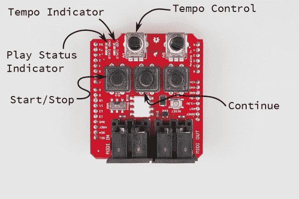](https://cdn.sparkfun.com/assets/learn_tutorials/4/0/9/clock-gen-controls.png)

*   A1 锅控制速度。
*   D2 上的按钮起着启动/停止按钮的作用。
*   D3 上的按钮是继续按钮

链路两端的指示灯具有相同的功能。

*   D7，红色 LED，及时闪烁，指示速度。
*   系统运行时，绿色 LED D6 亮起。

### 测试

一旦两个板都被加载，发生器上的红色(D7) LED 应该闪烁，接收器应该是暗的。将发生器的 MIDI Out 连接到接收器的 MIDI In，它的红色 LED 应该开始闪烁。闪烁速率将是相同的，但是它们可能彼此相对倾斜，还没有完全同步。

现在，按下发生器上的`play`按钮。两块板上的绿色 led 应该亮起，红色 led 应该同步闪烁。

[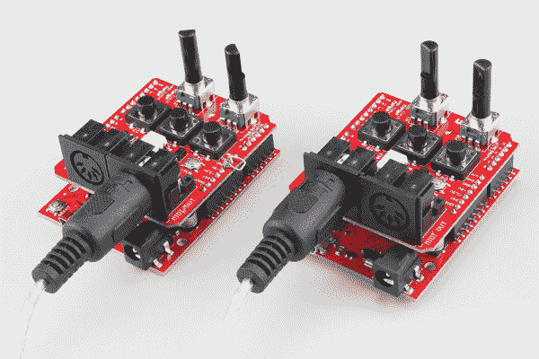](https://cdn.sparkfun.com/assets/learn_tutorials/4/0/9/clk-sync.jpg)

您可以调整 A1 电位计来加快和减慢速度。闪烁速率将会改变，调整时两个单元将保持同步。

`continue`按钮有一些特殊的行为。MIDI 将 Start (0xFA)定义为指示接收者复位到歌曲的开头，然后开始播放。Continue (0xFB)忽略复位，并从上次停止的地方开始。

### 使用其他设备

我们可以用其他设备替换链条的任何一端。出于演示的目的，我们将使用一个[will zyx 0x 0xb 0x](http://www.willzyx.com/collections/x0xb0x/products/x0xb0x-complete-black)，一个带有板载音序器的模拟合成器。x0xb0x 作为接收器连接。

[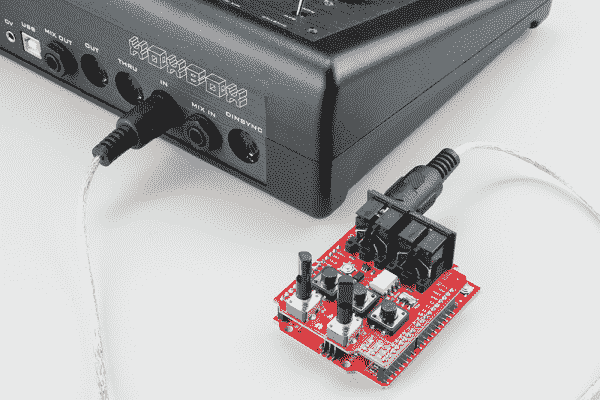](https://cdn.sparkfun.com/assets/learn_tutorials/4/0/9/clk-with-xox.jpg)

为了实现这一点，需要将 x0xb0x 配置为跟随输入的时钟消息——在 x0xb0x 上，这就像将模式旋转开关设置为`PATT MIDI SYNC`一样简单。它跟随节奏，正确地开始和停止。然而，它似乎没有正确地遵守继续消息。

## 示例#2: MIDI 至控制电压

如果你有兴趣建立一个 MIDI 合成器，MIDI Shield 是相当有能力的。在四十七个效果文档中有一个[例子](http://arduinomidilib.fortyseveneffects.com/a00012.html)使用 Arduino [音调](https://www.arduino.cc/en/Reference/Tone)库作为一个简单的 MIDI 乐器。我们将建立一个更有野心的系统，允许我们用真正的钥匙玩 [Moog Werkstatt](https://www.sparkfun.com/products/13146) 。这很有用，因为 Werkstatt 通常是用一系列微小的触觉开关来演奏的。

Werkstatt 是这个项目的理想选择，因为它有一个接收外部控制电压的接头。我们将产生以下电压:

*   音高控制电压(CV)是一个 DC 电压，代表当前按下的键。Werkstatt 上的振荡器在该输入上每出现一伏就提高一个八度音程；换句话说，一个半音是 1/12 伏特。
*   门信号是一个开/关指示器-当 MIDI 控制器上的一个或多个键被按住时，门为高。当没有按键时，门为低。Werkstatt 通过触发包络发生器对门做出响应，包络发生器进而驱动 VCF 和 VCA。
*   来自转换器的第二个模拟控制电压代表调制轮(连续控制器#0)位置。它可以接入 Werkstatt 上的其他输入，如 LFO 速率或滤波器截止。

### 材料

该项目需要以下部分。