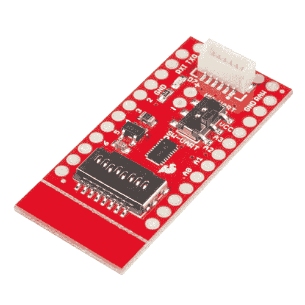

# 迷你 GPS 屏蔽连接指南

> 原文：<https://learn.sparkfun.com/tutorials/mini-gps-shield-hookup-guide>

## 介绍

[迷你 GPS 防护罩](https://www.sparkfun.com/products/14030)是 [SparkFun GPS 记录器防护罩](https://www.sparkfun.com/products/13750)的迷你版本。GPS Logger Shield 设计用于 Arduino RedBoard，而 Mini GPS Shield 设计用于 Arduino Mini/Micro board。

 

将**添加到您的[购物车](https://www.sparkfun.com/cart)中！**

### [SparkFun 迷你 GPS 盾](https://www.sparkfun.com/products/14030)

[In stock](https://learn.sparkfun.com/static/bubbles/ "in stock") GPS-14030

SparkFun Mini GPS Shield 为您的 Arduino Mini 配备了一个 GPS 模块、SD 存储卡插槽和所有其他设备

$8.50 $4.68[Favorited Favorite](# "Add to favorites") 17[Wish List](# "Add to wish list")** **就像它的老大哥一样，Mini GPS Shield 为您的 Arduino Mini 配备了一个 GPS 模块和 SD 存储卡插槽，用于数据记录。该板还使用了电平转换器，因此无需担心 Arduino Mini 的逻辑电压。

看看下面的视频，看看迷你 GPS 盾牌的行动。

[https://www.youtube.com/embed/k-El0U8HFlg/?autohide=1&border=0&wmode=opaque&enablejsapi=1](https://www.youtube.com/embed/k-El0U8HFlg/?autohide=1&border=0&wmode=opaque&enablejsapi=1)

### 所需材料

对于本指南，您需要以下内容:**