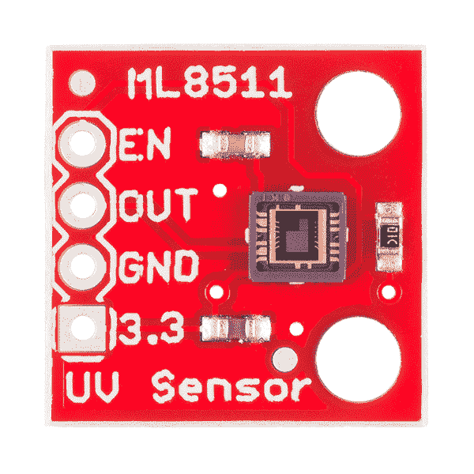
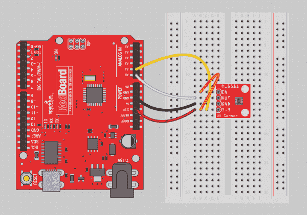
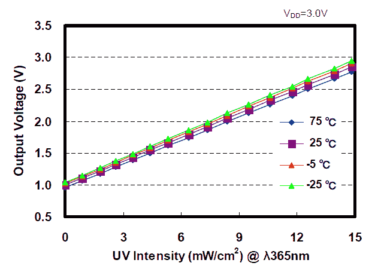
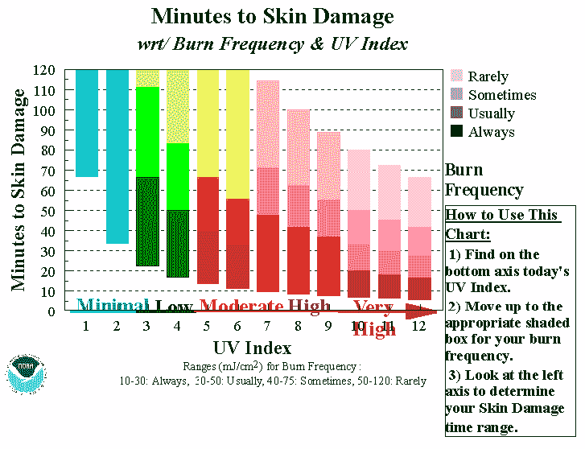

# ML8511 紫外线传感器连接指南

> 原文：<https://learn.sparkfun.com/tutorials/ml8511-uv-sensor-hookup-guide>

## 介绍

[](https://cdn.sparkfun.com/assets/learn_tutorials/2/0/6/ML8511_UV_Sensor.jpg)

[ML8511 传感器分线点](https://www.sparkfun.com/products/12705)是一个易于使用的[紫外线](https://learn.sparkfun.com/tutorials/light/ultraviolet-light)传感器。MP8511 紫外线传感器输出与其检测到的紫外线量相关的模拟信号。这可以方便地创建警告用户晒伤或检测与天气条件相关的[紫外线指数](http://en.wikipedia.org/wiki/Ultraviolet_index)的设备。

该传感器最有效地检测 280-390 纳米的光。这被归类为 UVB(燃烧射线)光谱的一部分和 UVA(晒黑射线)光谱的大部分。

### 推荐阅读

该传感器非常易于使用，在阅读本教程之前，您可能需要阅读一些教程:

*   [灯](https://learn.sparkfun.com/tutorials/light)
*   [模数转换](https://learn.sparkfun.com/tutorials/analog-to-digital-conversion)
*   什么是 Arduino？
*   [逻辑电平](https://learn.sparkfun.com/tutorials/logic-levels)

也有很多好的紫外线辐射读数:

*   [紫外线对人类的影响](http://www.ccohs.ca/oshanswers/phys_agents/ultravioletradiation.html)
*   [紫外线常见问题解答](https://www.iuva.org/uv-faqs)

## 使用 ML8511

ML8511 传感器非常容易使用。它输出一个与测量的紫外线强度(mW/cm ² )线性相关的模拟电压。如果您的微控制器可以进行模拟到电压的转换，那么您就可以检测到紫外线的水平。

将`ML8511 UV Sensor Read Example`加载到您选择的 Arduino 上。

```
language:c
    /* 
 ML8511 UV Sensor Read Example
 By: Nathan Seidle
 SparkFun Electronics
 Date: January 15th, 2014
 License: This code is public domain but you buy me a beer if you use this and we meet someday (Beerware license).

 The ML8511 UV Sensor outputs an analog signal in relation to the amount of UV light it detects.

 Connect the following ML8511 breakout board to Arduino:
 3.3V = 3.3V
 OUT = A0
 GND = GND
 EN = 3.3V
 3.3V = A1
 These last two connections are a little different. Connect the EN pin on the breakout to 3.3V on the breakout.
 This will enable the output. Also connect the 3.3V pin of the breakout to Arduino pin 1.

 This example uses a neat trick. Analog to digital conversions rely completely on VCC. We assume
 this is 5V but if the board is powered from USB this may be as high as 5.25V or as low as 4.75V:
 http://en.wikipedia.org/wiki/USB#Power Because of this unknown window it makes the ADC fairly inaccurate
 in most cases. To fix this, we use the very accurate onboard 3.3V reference (accurate within 1%). So by doing an
 ADC on the 3.3V pin (A1) and then comparing this against the reading from the sensor we can extrapolate
 a true-to-life reading no matter what VIN is (as long as it's above 3.4V).

 Test your sensor by shining daylight or a UV LED: https://www.sparkfun.com/products/8662

 This sensor detects 280-390nm light most effectively. This is categorized as part of the UVB (burning rays)
 spectrum and most of the UVA (tanning rays) spectrum.

 There's lots of good UV radiation reading out there:
 http://www.ccohs.ca/oshanswers/phys_agents/ultravioletradiation.html
 https://www.iuva.org/uv-faqs

*/

//Hardware pin definitions
int UVOUT = A0; //Output from the sensor
int REF_3V3 = A1; //3.3V power on the Arduino board

void setup()
{
  Serial.begin(9600);

  pinMode(UVOUT, INPUT);
  pinMode(REF_3V3, INPUT);

  Serial.println("ML8511 example");
}

void loop()
{
  int uvLevel = averageAnalogRead(UVOUT);
  int refLevel = averageAnalogRead(REF_3V3);

  //Use the 3.3V power pin as a reference to get a very accurate output value from sensor
  float outputVoltage = 3.3 / refLevel * uvLevel;

  float uvIntensity = mapfloat(outputVoltage, 0.99, 2.8, 0.0, 15.0); //Convert the voltage to a UV intensity level

  Serial.print("output: ");
  Serial.print(refLevel);

  Serial.print("ML8511 output: ");
  Serial.print(uvLevel);

  Serial.print(" / ML8511 voltage: ");
  Serial.print(outputVoltage);

  Serial.print(" / UV Intensity (mW/cm^2): ");
  Serial.print(uvIntensity);

  Serial.println();

  delay(100);
}

//Takes an average of readings on a given pin
//Returns the average
int averageAnalogRead(int pinToRead)
{
  byte numberOfReadings = 8;
  unsigned int runningValue = 0; 

  for(int x = 0 ; x < numberOfReadings ; x++)
    runningValue += analogRead(pinToRead);
  runningValue /= numberOfReadings;

  return(runningValue);  
}

//The Arduino Map function but for floats
//From: http://forum.arduino.cc/index.php?topic=3922.0
float mapfloat(float x, float in_min, float in_max, float out_min, float out_max)
{
  return (x - in_min) * (out_max - out_min) / (in_max - in_min) + out_min;
} 
```

接下来，将以下 ML8511 分线板连接到 Arduino:

*   ML8511 / Arduino
*   3.3V = 3.3V
*   OUT = A0
*   GND = GND
*   EN = 3.3V
*   Arduino 3.3V = Arduino A1

这最后两个连接有点不同。将分接头上的 EN 引脚连接到 3.3V，以使能该器件。还要将 Arduino 的 3.3V 引脚连接到 Arduino 模拟引脚 1。

[](https://cdn.sparkfun.com/assets/learn_tutorials/2/0/6/ML8511_UV_Hookup.png)

这个例子使用了一个巧妙的技巧。模数转换完全依赖于 VCC。我们假设该电压为 5.0V，但如果电路板由 USB 供电，则该电压可能[高达 5.25V，或](http://en.wikipedia.org/wiki/USB#Power)低至 4.75V。由于这个未知的窗口，它使得 Arduino 上的 ADC 相当不准确。为了解决这个问题，我们使用非常精确的板载 3.3V 基准电压源(精度在 1%以内)。因此，通过在 3.3V 引脚上进行模数转换(将其连接到 A1)，然后将该读数与传感器读数进行比较，我们可以推断出真实的读数，无论 VIN 是多少(只要它高于 3.4V)。

例如，我们知道 Arduino 上的 ADC 在读取 VCC 时会输出 1023。如果我们从 3.3V 的连接中读取 669，Arduino 的供电电压是多少？很简单的比例！

```
VCC / 1023 = 3.3V / 669 
```

求解 VCC，我们得到 5.05V。如果你有一个[数字万用表](https://learn.sparkfun.com/tutorials/how-to-use-a-multimeter)，你可以验证你的 Arduino 上的 5V 引脚。

既然我们已经精确地知道了 VCC 是什么，我们就可以对 UV 电压做一个更精确的 ADC:

```
UV_Voltage / uvLevel = 3.3 / refLevel 
```

`uvLevel`是我们从`OUT`引脚读取的数据。`refLevel`是我们在 3.3V 引脚上读到的。求解`UV_Voltage`，我们可以得到一个准确的读数。

[](https://cdn.sparkfun.com/assets/4/3/a/4/f/UV_Intensity.png)*The ML8511 intensity graph*

将`UV_Voltage`映射到强度非常简单。没有紫外光从 1V 开始最大 15mW/cm ² 在 2.8V 左右 Arduino 内置了 [map()函数](http://arduino.cc/en/reference/map)，但是 map()对 floats 不起作用。感谢 Arduino 论坛上的用户，我们有了一个简单的 mapFloat()函数:

```
//The Arduino Map function but for floats
//From: http://forum.arduino.cc/index.php?topic=3922.0
float mapfloat(float x, float in_min, float in_max, float out_min, float out_max)
{
  return (x - in_min) * (out_max - out_min) / (in_max - in_min) + out_min;
} 
```

以下线路将从传感器读取的电压转换为 mW/cm ² 强度:

```
float uvIntensity = mapfloat(outputVoltage, 0.99, 2.8, 0.0, 15.0); //Convert the voltage to a UV intensity level 
```

通过将日光或 [UV LED](https://www.sparkfun.com/products/8662) 照射到传感器上来测试您的传感器。我们还发现，明亮的 LED 手电筒会稍微改变读数。你家周围还有哪些设备可能输出紫外线？

## 紫外线灼伤！

紫外线传感器启动并运行后，我们能做些什么呢？如果我们对紫外线照射量随时间的变化进行积分，就可以计算出总的紫外线照射量。但是多少紫外线好呢？

来自[俄勒冈太平洋大学](http://www.pacificu.edu/optometry/ce/courses/15719/uvradiationpg3.cfm#How):

> ...每周 15 到 30 分钟暴露在合成维生素 D 所需的紫外线 B 中...

监测对基层来说可能是有益的。但是多少才算多呢？来自[加拿大职业健康与安全中心](http://www.ccohs.ca/oshanswers/phys_agents/ultravioletradiation.html):

> 对于 UV-A 或近紫外光谱区(315 至 400 纳米)，眼睛暴露时间超过 1000 秒(约 16 分钟)时，不应超过每平方厘米 1 毫瓦(1.0 mW/cm ² )。

紫外线传感器可以用在一副眼镜上，以确保你不会晒伤眼睛。

因为皮肤类型差异很大，所以很难预测晒伤和皮肤损伤。幸运的是 NOAA 给了我们一些方向。

[](https://cdn.sparkfun.com/assets/learn_tutorials/2/0/6/min2brn.gif)*Image credit to [NOAA](http://www.erh.noaa.gov/ilm/beach/uv/mintoburn.shtml)*

但是我们有一个单位的问题。幸运的是，[美国海军](http://www.med.navy.mil/sites/nmcphc/Documents/policy-and-instruction/ih-ultraviolet-radiation-technical-guide.pdf)澄清了这一点:

> 辐照度(光生物学中使用的一种剂量率)是以瓦特(功率单位)每平方米(W·m²或瓦特每平方厘米(W·cm²)来描述的。辐射暴露(H)是剂量，用每平方米焦耳(能量单位)或每平方厘米焦耳来描述。注意，瓦特是焦耳每秒，因此剂量率(W cm ² )乘以曝光持续时间(秒)等于剂量(J cm ² )。

**Note:** Users can also check out this application note on calculating the UV index (UVI) with the ML8511.

*   [带电压输出的紫外线传感器 IC](https://cdn.sparkfun.com/assets/learn_tutorials/2/0/6/ML8511_UV.pdf)

## 资源和更进一步

我们希望这给你一个用 UV 做很多有趣事情的起点。现在你可能想看看这些教程:

*   [侵入思维波](https://learn.sparkfun.com/tutorials/hackers-in-residence---hacking-mindwave-mobile)
*   [TSL2561 光度传感器连接指南](https://learn.sparkfun.com/tutorials/tsl2561-luminosity-sensor-hookup-guide)
*   [使用电动 Imp 无线模块](https://learn.sparkfun.com/tutorials/electric-imp-breakout-hookup-guide)