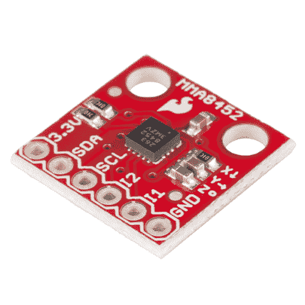
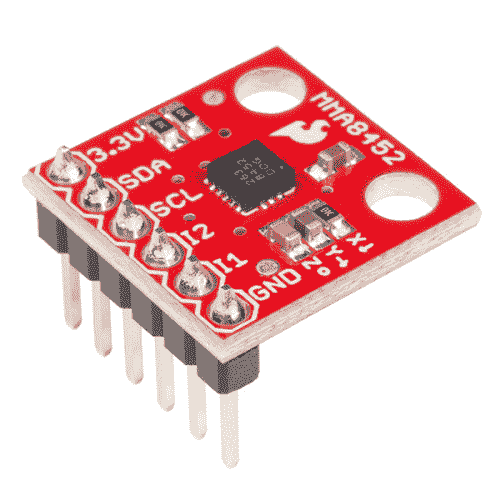
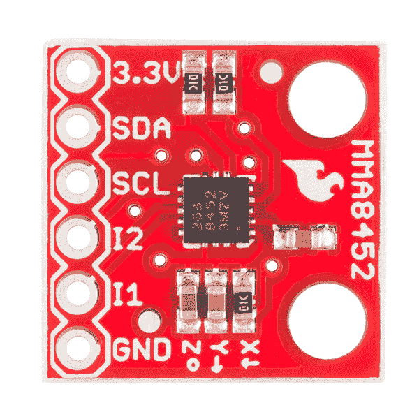
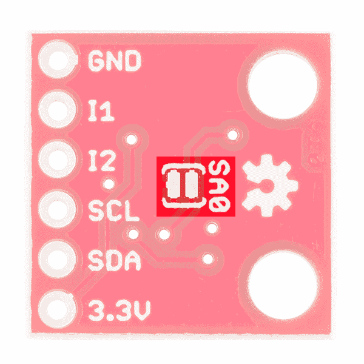
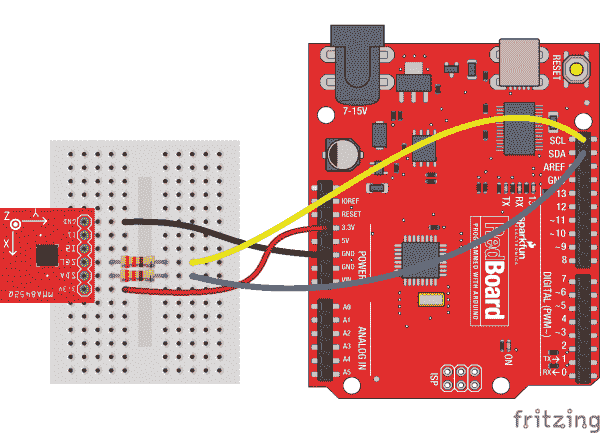
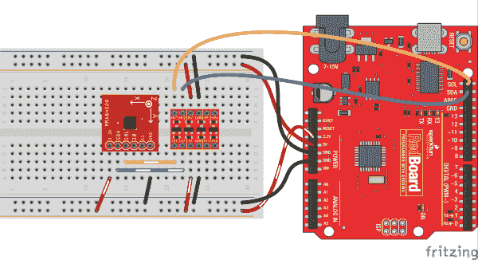
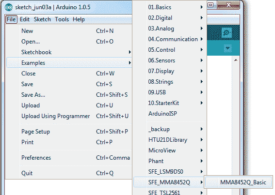
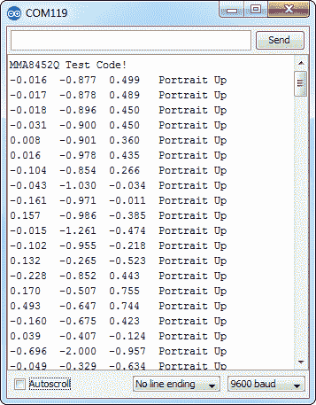
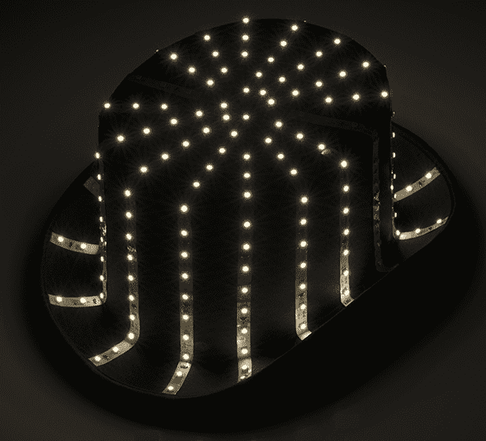

# MMA8452Q 加速度计分线连接指南

> 原文：<https://learn.sparkfun.com/tutorials/mma8452q-accelerometer-breakout-hookup-guide>

## 介绍

飞思卡尔的 [MMA8452Q](https://www.sparkfun.com/products/10953) 是一款智能、低功耗、三轴、电容式微机械加速度计，具有 12 位分辨率。它非常适合任何需要感知方向或运动的项目。我们已经把那个加速度计放在了一个[分线板](https://www.sparkfun.com/products/12756)上，以使与微小的 QFN 封装的接口更容易一些。

[](https://www.sparkfun.com/products/retired/12756) 

### [SparkFun 三轴加速度计突破- MMA8452Q](https://www.sparkfun.com/products/retired/12756)

[Retired](https://learn.sparkfun.com/static/bubbles/ "Retired") SEN-12756

这款分线板可以让您在项目中轻松使用微型 MMA8452Q 加速度计。MMA8452Q 是一款智能低功耗……

10 **Retired**[Favorited Favorite](# "Add to favorites") 21[Wish List](# "Add to wish list")[](https://www.sparkfun.com/products/13926) 

### [【spark fun 三轴加速度计 Breakout - MMA8452Q(带表头)](https://www.sparkfun.com/products/13926)

[Out of stock](https://learn.sparkfun.com/static/bubbles/ "out of stock") BOB-13926

这款分线板可以让您在项目中轻松使用微型 MMA8452Q 加速度计。MMA8452Q 是一款智能、低功耗……

2[Favorited Favorite](# "Add to favorites") 8[Wish List](# "Add to wish list")

MMA8452Q 只是一个固体三轴加速度计。它支持三种可选的检测范围:2g、4g 或 8g。它具有方位检测、单击和双击感应以及低功耗模式等功能。这是一个数字传感器——通过一个 [I ² C 接口](https://learn.sparkfun.com/tutorials/i2c)进行通信——因此，只需使用两个微控制器引脚与加速度计进行交互，您就可以获得可靠、无噪声的数据。

### 本教程涵盖的内容

本教程旨在让您尽快开始使用 MMA8452Q。它分成几页来解释主板的工作原理和使用方法:

*   [硬件概述](https://learn.sparkfun.com/tutorials/mma8452q-accelerometer-breakout-hookup-guide/hardware-overview)-MMA 8452 q IC 本身的概述，以及我们将它塞进的分线板。
*   [示例连接](https://learn.sparkfun.com/tutorials/mma8452q-accelerometer-breakout-hookup-guide/example-hookup) -如何将 MMA8452Q 连接到无处不在的 Arduino。这个硬件连接将在下一节中使用...
*   [示例代码](https://learn.sparkfun.com/tutorials/mma8452q-accelerometer-breakout-hookup-guide/example-code)——我们已经编写了一个 **Arduino 库**来帮助你的 Arduino 草图更整洁、更容易编写。在这一页，我们将展示一个使用该库的示例草图，并演示如何自己使用该库来控制加速度计。

### 所需材料

要完成本教程，您需要的最独特的组件是:

*   [MMA8452Q 分线板](https://www.sparkfun.com/products/12756) -这是一个开始的好地方(除非你打算死调试微型 [IC 本身](https://www.sparkfun.com/products/10953)。
*   **Arduino 板卡**——你应该可以使用你手边的任何 Arduino 板卡——[Arduino Uno](https://www.sparkfun.com/products/11021)、 [RedBoard](https://www.sparkfun.com/products/11575) 、 [Pro](https://www.sparkfun.com/products/10914) 、 [Mega](https://www.sparkfun.com/products/11061) 、...任何事。
*   [330ω电阻](https://www.sparkfun.com/products/11507) -假设您使用的是 5V 微控制器，这些电阻将有助于保护 MMA8452Q 免受不合规格电压对其引脚的影响。

你还需要在分线点和 Arduino 之间进行某种互连。一个[试验板](https://www.sparkfun.com/products/12002)和[跳线](https://www.sparkfun.com/products/11026)总是一个简单的组合。

最后，您需要将一个连接器焊接到 MMA8452Q 分线点上。如果你使用试验板来连接它，我们推荐[直阳接头](https://www.sparkfun.com/products/116)。

### 推荐阅读

在继续学习本教程之前，我们建议您先熟悉一下这些教程中的概念:

*   加速度计基础知识 -这是一本很好的关于加速度计的入门书-它们是如何工作的，以及为什么使用它们。
*   [I ² C](https://learn.sparkfun.com/tutorials/i2c) -介绍我们将用来让我们的 Arduino 与 MMA8452Q 对话的通信协议。
*   [加速度计购买指南](https://www.sparkfun.com/pages/accel_gyro_guide) -如果您不确定哪种加速度计最适合您，请查看该指南。
*   [逻辑电平](https://learn.sparkfun.com/tutorials/logic-levels)-MMA 8452 q 是一款 3.3V 设备，因此如果您使用 5V 微控制器(如 Arduino)，您必须注意逻辑电平！

## 硬件概述

MMA8452Q 分线板列出了加速度计上几个最重要的引脚。

[](https://cdn.sparkfun.com/assets/learn_tutorials/2/4/9/mma8452q-top.png)

关于每个引脚的一些信息:

| Pin Label | 引脚功能 | 输入/输出 | 笔记 |
| 3.3V | 电源 | 投入 | 应该在 1.95-3.6 伏之间 |
| 国家药品监督管理局 | I ² C 数据信号 | 双向的 | 双向数据线。电压不应超过电源电压(例如 3.3V)。 |
| SCL | I ² C 时钟信号 | 投入 | 主控时钟信号。电压不应超过电源电压(例如 3.3V)。 |
| I2 | 中断 2 | 输出 | 可编程中断—可以指示数据就绪、方向改变、点击等。 |
| I1 | 中断 1 | 输出 | 可编程中断—可以指示数据就绪、方向改变、点击等。 |
| GND | 地面 | 投入 | 0V/公共电压。 |

### 电压供应要求

这里需要注意的是，MMA8452Q 的最大电压为 3.6V(T1)，这个范围适用于电源和 I ² C 引脚。如果你在 3.3V 系统中使用传感器，你可以直接插入，但如果你在 5V 设备中使用它(如 [Arduino Uno](https://www.sparkfun.com/products/11021) )，设备之间需要一些**电平转换**。

幸运的是，你不需要很大的功率就可以让 MMA8452Q 工作。在正常工作模式下，它可能需要 7 到 165 A 的电流。

### 地址选择跳线

MMA8452Q 具有一个**可选 I ² C 地址** -以防你在同一条总线上运行多个 MMA 8452 q(或者你可能有地址冲突)。为了选择地址，加速度计上的一个引脚“SA0”可以连接到电源或地。

| SA0 电压 | MMA8452Q I ² C 地址 |
| 0V | 0x1C |
| 3.3V (VCC) | 0x1D |

分线板背面有一个跳线，有助于将此引脚连接到高电平或低电平。

[](https://cdn.sparkfun.com/assets/learn_tutorials/2/4/9/mma8452q-back-jumper.png)

默认情况下，跳线开路，将 SA0 引脚拉高(电路板顶部有一个电阻帮助完成该任务)。如果闭合跳线，用一个小焊料滴将两个焊盘连接在一起，SA0 将被拉至地。

对于大多数使用情况，如果只使用一个 MMA8452Q，可以不动该跳线。在这种情况下，I ² C 地址将是 0x1D。

## 示例连接

### 焊接某物

在将分线板插入试验板或将其连接到任何东西之前，您需要将连接器或电线焊接到分线引脚上。确切地说，你在电路板上焊接什么取决于你如何使用它。

如果您打算在[试验板](https://learn.sparkfun.com/tutorials/how-to-use-a-breadboard)或类似的 0.1 英寸间距的 perfboard 中使用分线板，我们建议将[直插头](https://www.sparkfun.com/products/116)焊接到引脚中(如果您需要，还有[长插头](https://www.sparkfun.com/products/10158))。

如果你要将分线器安装到一个紧密的外壳中，你可能想要将电线([绞合](https://www.sparkfun.com/products/11375)或[实芯](https://www.sparkfun.com/products/11367))直接焊接到引脚中。

您也可以购买已经焊接到分接头的 MMA8452Q。

[](https://www.sparkfun.com/products/13926) 

### [【spark fun 三轴加速度计 Breakout - MMA8452Q(带表头)](https://www.sparkfun.com/products/13926)

[Out of stock](https://learn.sparkfun.com/static/bubbles/ "out of stock") BOB-13926

这款分线板可以让您在项目中轻松使用微型 MMA8452Q 加速度计。MMA8452Q 是一款智能、低功耗……

2[Favorited Favorite](# "Add to favorites") 8[Wish List](# "Add to wish list")

### 简单的连接

我们将使用 Arduino 与 MMA8452Q 通信，并解释来自传感器的数据。由于我们使用 I ² C，我们所需要的只是 Arduino 和加速度计之间的两根电线(除了电源和地)。这是连接:

[](https://cdn.sparkfun.com/assets/learn_tutorials/2/4/9/mma8452q-hookup_bb.png)

我们只需为加速度计供电(3.3V 和 GND)，然后在器件之间连接 SCL 和 SDA 线。在每条 I ² C 线上串联的几个[330ω电阻](https://www.sparkfun.com/products/11507)将有助于执行一些简单的电平转换。如果你想要更高级的电平转换...

### 电平移动

由于 MMA8452Q 的最大电压为 3.6V，您需要在 Arduino 和加速度计之间进行一些电平转换。从 Arduino 的 3.3V 供电轨为加速度计供电是一个良好的开端，但您还需要在 SDA 和 SCL 线路上增加一些保护。

在上面的连接示例中，我们在 SDA 和 SCL 线上使用了一对串联电阻。这个版本的“电平转换”在紧急情况下可以工作，但是，如果你想要一个更可靠的电平转换设置，我们建议在电路板之间使用一个更强大的电平转换器。

有一些逻辑电平转换板可用。例如，这里有一个在 Arduino 和加速度计之间使用[双向逻辑电平转换器](https://www.sparkfun.com/products/12009)的连接:

[](https://cdn.sparkfun.com/assets/learn_tutorials/2/4/9/mma8452q-levelshift-hookup_bb.png)

或者，如果你只是想完全跳过电平转换，你可以使用一个 [3.3V Arduino Pro](https://www.sparkfun.com/products/10914) (或 [Pro Mini](https://www.sparkfun.com/products/11114) )，并在 3.3V 下运行整个系统。正如任何制造电子产品的人都知道的那样:有不止一种方法来剥猫的皮。

## 示例代码

**注意:**此示例假设您在桌面上使用的是最新版本的 Arduino IDE。如果这是你第一次使用 Arduino，请回顾我们关于[安装 Arduino IDE 的教程。](https://learn.sparkfun.com/tutorials/installing-arduino-ide)如果您之前没有安装 Arduino 库，请查看我们的[安装指南。](https://learn.sparkfun.com/tutorials/installing-an-arduino-library)

我们已经编写了一个 Arduino 库，使与 MMA8452Q 的接口尽可能简单。点击下面的按钮下载库。或者你可以在[库的 GitHub 库](https://github.com/sparkfun/SparkFun_MMA8452Q_Arduino_Library)上下载最新最好的版本。

[Download MMA8452Q Arduino Library (ZIP)](https://github.com/sparkfun/SparkFun_MMA8452Q_Arduino_Library/archive/main.zip)

### 加载示例草图

一旦你安装了 *SFE_MMA8452Q* 库，重启 Arduino。然后进入**文件** > **实例**>**SFE _ MMA 8452 q**>MMA 8452 q _ Basic 打开实例草图。

[](https://cdn.sparkfun.com/assets/learn_tutorials/2/4/9/opening-example.png)

一旦你设置好你的板和串口，上传草图到你的 Arduino。然后**打开[串口监视器](https://learn.sparkfun.com/tutorials/terminal-basics)T3。除了关于传感器方向的一些信息之外，您将开始看到加速度值流过。**

[](https://cdn.sparkfun.com/assets/learn_tutorials/2/4/9/serial-monitor-example.png)

尝试移动传感器来改变这些值。如果它是静止的，平放在桌子上，那么在 z 轴上应该感觉到 1g 的加速度，而其他的感觉在 0 左右。通过旋转棋盘并让他们感受重力的拉力来测试其他轴。

### 使用 SFE_MMA8452Q 库

这里有一些关于使用 MMA8452Q Arduino 库的技巧，这样你就可以把它嵌入到你自己的 Arduino 草图中。

#### 包括库(全局)

首先，您需要在草图中“包含”该库:

```
language:c
#include <Wire.h> // Must include Wire library for I2C
#include <SFE_MMA8452Q.h> // Includes the SFE_MMA8452Q library 
```

该库还要求您在草图中包含`Wire.h`。确保在之前包含了*，并且包含了 *SFE_MMA8452Q.h* 文件。*

#### 创建 MMA8452Q 对象(全局)

一旦包含了这个库，就可以创建一个 MMA8452Q 对象。这行代码将为您完成这项工作:

```
language:c
MMA8452Q accel; // Default MMA8452Q object create. (Address = 0x1D) 
```

或者，您可以在此参数中定义 MMA8452Q 的 7 位 **I ² C 地址**，使用以下代码行之一:

```
language:c
MMA8452Q accel(0x1C); // Initialize the MMA8452Q with an I2C address of 0x1C (SA0=0)
MMA8452Q accel(0x1D); // Initialize the MMA8452Q with an I2C address of 0x1D (SA0=1) 
```

但是，如果您没有接触[地址跳线](https://learn.sparkfun.com/tutorials/mma8452q-accelerometer-breakout-hookup-guide/hardware-overview#address_jumper)(意味着“SA0”引脚连接到 VCC)，您可以调用前面显示的默认(无参数)构造函数。

#### 初始化 MMA8452Q(设置)

最后，在草图的`setup()`函数中，您可以使用`init()`函数初始化加速度计。`init()`功能验证与加速度计的通信，并设置**满量程范围**和**输出数据速率**。

同样，您有几个选择。您可以使用如下的简单声明。这将初始化加速度计，量程为 **2g** ，输出数据速率为 **800 Hz** (将加速度计调到最大！):

```
language:c
accel.init(); // Default init: +/-2g and 800Hz ODR 
```

如果您想指定加速度和输出数据速率，您可以使用如下的`init()`函数:

```
language:c
accel.init([scale], [odr]); // Init and customize the FSR and ODR 
```

标度可以是`SCALE_2G`、`SCALE_4G`或`SCALE_8G`。“odr”变量可以是`ODR_800`、`ODR_400`、`ODR_200`、`ODR_100`、`ODR_50`、`ODR_12`、`ODR_6`或`ODR_1`，分别将数据速率设置为 800、400、200、100、50、12.5、6.25 或 1.56 Hz。

#### 读取和使用值

一旦你设置好加速度计，你就可以立即开始读取来自芯片的数据。读取和使用这些值是一个两步过程。首先，调用`read()`函数来获取值。

```
language:c
accel.read(); // Update acceleromter data 
```

*在*之后，你已经调用了`read()`函数，你可以使用两组数值中的任何一组来使用数据。从`x`、`y`和`z`类变量读取将返回直接从加速度计读取的有符号 12 位整数。

```
language:c
xAcceleration = accel.x; // Read in raw x-axis acceleration data
Serial.print("Acceleration on the x-axis is ");
Serial.println(xAcceleration); 
```

或者，如果您想要一个带有物理单位的值，您可以使用`cx`、`cy`和`cz`类变量。这些是从加速度计读出的**计算的**加速度值；它们将以 g 为单位。

```
language:c
zAcceleration = accel.cz; // Read in calculated z-axis acceleration
Serial.print("Acceleration on the z-axis is: ");
Serial.print(zAcceleration);
Serial.println(" g's"); 
```

记住！那些变量只在调用了`read()`函数的之后被更新*。确保在开始使用加速度值之前发生这种情况。*

#### 阅读纵向/横向

MMA8452Q 有各种各样漂亮的额外功能，其中之一是**方向检测** -它可以估计它是处于风景模式、肖像模式还是平面模式。

要从加速度计读取纵向/横向数据，使用`readPL()`功能。该函数返回一个字节，该字节将等于`PORTRAIT_U`、`PORTRAIT_D`、`LANDSCAPE_R`、`LANDSCAPE_L`或`LOCKOUT`。

```
language:c
byte pl = accel.readPL();
switch (pl)
{
case PORTRAIT_U:
    Serial.print("Portrait Up");
    break;
case PORTRAIT_D:
    Serial.print("Portrait Down");
    break;
case LANDSCAPE_R:
    Serial.print("Landscape Right");
    break;
case LANDSCAPE_L:
    Serial.print("Landscape Left");
    break;
case LOCKOUT:
    Serial.print("Flat");
    break;
} 
```

如上例所示，您可以使用`if`或`switch`语句来检查加速度计的方位。

## 资源和更进一步

感谢阅读！我们很高兴看到您使用 MMA8452Q 构建的产品。如果您还需要更多与 MMA8452Q 相关的文档，请查阅以下资源:

*   [MMA8452Q 数据表](http://cdn.sparkfun.com/datasheets/Sensors/Accelerometers/MMA8452Q.pdf) -大量关于 MMA8452Q 的电气特性、寄存器、通信规范等信息。
*   [MMA8452Q 分线示意图](https://cdn.sparkfun.com/datasheets/Sensors/Accelerometers/MMA8452Q_Breakout-v10.pdf)-MMA 8452 q 分线板的 PDF 示意图。
*   [MMA8452Q 分线鹰文件](https://cdn.sparkfun.com/datasheets/Sensors/Accelerometers/MMA8452Q_Breakout-v10.zip)-MMA 8452 q 分线鹰的 PCB 设计文件。
*   [MMA8452Q Breakout GitHub Repo](https://github.com/sparkfun/MMA8452_Accelerometer)-所有与 MMA 8452 q 相关的设计文件和示例代码。
*   库 GitHub Repo
    *   [Arduino 库](https://github.com/sparkfun/SparkFun_MMA8452Q_Arduino_Library/tree/master) -用于 MMA8452Q 的 Arduino 库。
    *   [光子库](https://github.com/sparkfun/SparkFun_MMA8452Q_Particle_Library)-MMA 8452 q 的光子库。

* * *

如果你还不知道，我们喜欢加速度计！查看我们创建的所有教程和项目，这些教程和项目都包含加速度计等功能。

*   你没事吧？小工具 -看看艾丽西娅如何将 MMA8452Q 嵌入填充动物玩具中，以创建“你还好吗”小工具。

[](https://learn.sparkfun.com/tutorials/are-you-okay-widget)*Are You Okay? Shake the stuffed animal to send a tweet and let your buddy know.*

*   [red bot](https://learn.sparkfun.com/tutorials/getting-started-with-the-redbot)入门——MMA 8452 q 与 [RedBot 套件](https://www.sparkfun.com/products/12697)配合使用，增加凹凸检测功能。
*   [布林肯礼帽](https://learn.sparkfun.com/tutorials/das-blinken-top-hat) -给你的 LED 礼帽添加一个加速度计，这样你就可以根据你的头部倾斜程度来控制眨眼模式。

[](https://learn.sparkfun.com/tutorials/das-blinken-top-hat)*Das Blinken Top Hat! An accelerometer-controlled LED-covered dress hat.*

*   [西蒙倾斜](https://learn.sparkfun.com/tutorials/simon-tilts-assembly-guide) -加速度计不是唯一能够感知倾斜的传感器。看看西蒙倾斜游戏，它使用了一种非常巧妙的光学方法来检测六个不同的方向。
*   龙与地下城骰子挑战 -你可以在你的 D & D 护腕中嵌入一个加速度计，每当你摇动手臂时就可以掷出虚拟骰子！