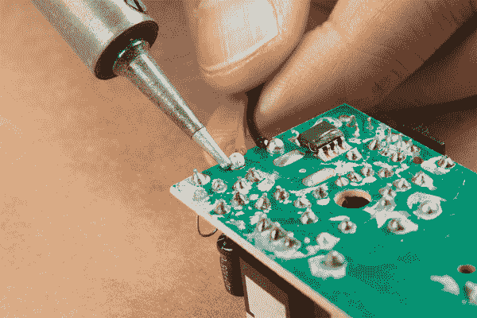

# 修改您的 EL 线逆变器

> 原文：<https://learn.sparkfun.com/tutorials/modifying-your-el-wire-inverter>

## 介绍

在本教程中，我们将修改 [12V EL 线逆变器](https://www.sparkfun.com/products/10469)以使用单个电源为 EL 序列器或 EL Escudo Dos 供电。

### 所需材料

要完成本教程，您至少需要以下材料。你可能不需要所有的东西，这取决于你拥有什么。将它添加到您的购物车，通读指南，并根据需要调整购物车。