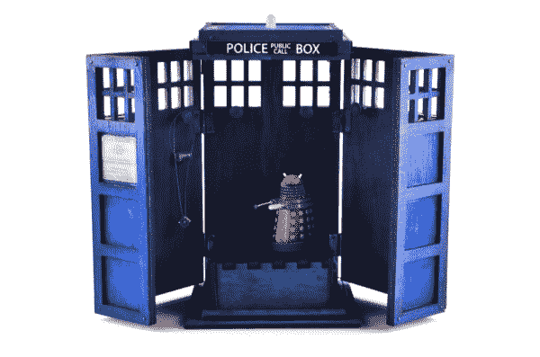

# MP3 播放器屏蔽音乐盒

> 原文：<https://learn.sparkfun.com/tutorials/mp3-player-shield-music-box>

## Tardis 音乐盒项目

有一些你最喜欢的东西需要安全保管吗？定制音乐盒是一个有趣的项目，可以容纳从项链到音速起子的任何东西。在本教程中，您将看到制作这个风扇制造的博士谁 TARDIS(空间中的时间和相对维度)音乐盒所使用的基本说明和部件。这可以作为你自己的音乐盒，TARDIS，或者恶作剧创作的起点。

### 推荐阅读

以下是在学习本教程时可能会对您有所帮助的其他教程列表:

*   [MP3 播放器保护罩](https://www.sparkfun.com/tutorials/295)
*   [单声道音频放大器快速入门指南](https://www.sparkfun.com/tutorials/392)
*   [LED 限流电阻](https://www.sparkfun.com/tutorials/219)
*   [Arduino 主板快速入门指南](https://www.sparkfun.com/tutorials/182)

## 零件目录表