# MP3 触发连接指南 V24

> 原文：<https://learn.sparkfun.com/tutorials/mp3-trigger-hookup-guide-v24>

## 介绍

[MP3 触发器](https://www.sparkfun.com/products/13720)是一款多功能、低成本、低功耗的嵌入式音频单元，可以直接从 FAT32 或 FAT16 格式的 microSD 闪存卡播放 MP3 曲目到立体声 1/8 英寸(3.5 毫米)耳机输出插孔，支持高达 192kbps 的立体声播放。该板有 18 个外部输入引脚，当拉至接地时，触发预先选择的 MP3 曲目，以及一个全双工串行控制端口，提供实时音量控制以及多达 255 首曲目的远程触发。还有一个车载导航开关，用于本地访问和播放闪存卡上的所有 MP3 曲目。

[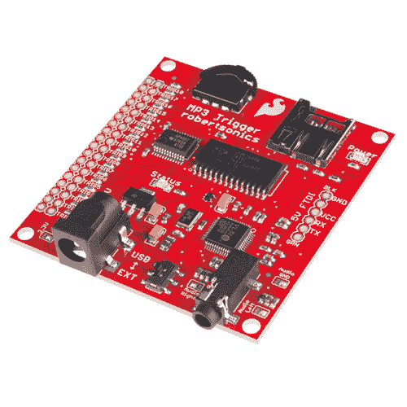](https://www.sparkfun.com/products/13720) 

将**添加到您的[购物车](https://www.sparkfun.com/cart)中！**

### [MP3 触发](https://www.sparkfun.com/products/13720)

[In stock](https://learn.sparkfun.com/static/bubbles/ "in stock") WIG-13720

MP3 触发板旨在使 MP3 声音集成变得前所未有的简单。

$53.5016[Favorited Favorite](# "Add to favorites") 54[Wish List](# "Add to wish list")** **MP3 触发板的核心是 Cypress PSoC CY8C29466-24SXI 微控制器，它向 VLSI VS1063 音频编解码器 IC 提供 MP3 数据。该版本还支持可选的初始化文件，可用于设置串行端口波特率，以及将 18 个触发输入中的任何一个重新编程为替代功能，包括随机和顺序轨道选择、传输控制，甚至音量增大/减小。每个常规触发器都可以设置为允许立即重启，或者在播放音频时锁定重启。此外，新的触发文件名约定在命名 MP3 曲目时提供了更大的灵活性，并使文件管理更容易。

此版本的 MP3 触发器包括支持使用 microSD 卡上的初始化文件的固件，该文件可用于更改串行波特率，以及将 18 个触发器输入中的任何一个重新用于替代功能，如随机和顺序触发器、导航控制甚至音量控制。此外，如果音频已经在播放，可以使用重启锁定选项来防止任何触发器启动轨道。利用这些特性，通常无需使用单独的微控制器就可以实现定制应用。

### 建议的材料

要开始使用您的 MP3 触发器，您需要一些不包括在内的项目。首先，你需要一张 [microSD 卡](https://www.sparkfun.com/products/11609)来存储你的. mp3 文件。在你熟悉 MP3 触发器时，一个简单的方法就是使用 [9V 墙壁适配器](https://www.sparkfun.com/products/298)。如果您打算将 MP3 触发器与另一个串行设备一起使用，您需要一个 [FTDI Basic](https://www.sparkfun.com/products/9716?_ga=1.172539360.273388466.1418147030) 或其他串行连接。最后，你需要一些播放音频的东西。您可以使用耳机、3.5 毫米到 3.5 毫米的音频电缆来连接外部音频源，或者使用我们的[3.5 毫米音频尾纤](https://www.sparkfun.com/products/11580)将您的 MP3 触发器连接到您想要的输出。

[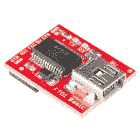](https://www.sparkfun.com/products/9716) 

将**添加到您的[购物车](https://www.sparkfun.com/cart)中！**

### [SparkFun FTDI 基础突破- 5V](https://www.sparkfun.com/products/9716)

[In stock](https://learn.sparkfun.com/static/bubbles/ "in stock") DEV-09716

这是 FTDI FT232RL USB 转串行 ic 的基本分线板。此板的引脚匹配 FTDI 电缆工作…

$16.50122[Favorited Favorite](# "Add to favorites") 78[Wish List](# "Add to wish list")****[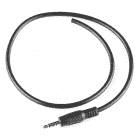](https://www.sparkfun.com/products/11580) 

将**添加到您的[购物车](https://www.sparkfun.com/cart)中！**

### [【TRRS-18”(尾纤)](https://www.sparkfun.com/products/11580)

[In stock](https://learn.sparkfun.com/static/bubbles/ "in stock") CAB-11580

TRRS 接口是一些手机、MP3 播放器和开发板上常见的 3.5 毫米音频接口。TRRS 街…

$1.60[Favorited Favorite](# "Add to favorites") 20[Wish List](# "Add to wish list")****[](https://www.sparkfun.com/products/retired/298) 

### [墙壁适配器电源- 9VDC 650mA](https://www.sparkfun.com/products/retired/298)

[Retired](https://learn.sparkfun.com/static/bubbles/ "Retired") TOL-00298

专为 Spark Fun Electronics 制造的高质量开关“壁式电源”AC 到 DC 9V 650mA 壁式电源。T…

12 **Retired**[Favorited Favorite](# "Add to favorites") 23[Wish List](# "Add to wish list")[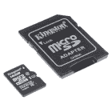](https://www.sparkfun.com/products/retired/13833) 

### [带适配器的 microSD 卡——16GB(10 类)](https://www.sparkfun.com/products/retired/13833)

[Retired](https://learn.sparkfun.com/static/bubbles/ "Retired") COM-13833

这是一个 10 级 16GB microSD 存储卡，非常适合容纳单板计算机和多种…

6 **Retired**[Favorited Favorite](# "Add to favorites") 8[Wish List](# "Add to wish list")**********Note:** The MP3 Trigger supports both SDSC (up to 2GB) and SDHC (up to 32GB) type microSD cards.

### 推荐阅读

在开始使用 MP3 触发器之前，您可能会发现以下教程很有用:

*   [如何焊接](https://learn.sparkfun.com/tutorials/how-to-solder---through-hole-soldering) -将按钮和开关连接到触发器输入端需要焊接。
*   用电线工作 -你可能需要用一些电线来连接这些按钮和开关。
*   [开关基础知识](https://learn.sparkfun.com/tutorials/switch-basics) -了解可用于触发音频文件的众多按钮和开关。
*   如果你打算使用带有 Arduino 或其他微控制器的 MP3 触发器，你应该很好地理解[串行通信](https://learn.sparkfun.com/tutorials/serial-communication)、[十六进制](https://learn.sparkfun.com/tutorials/hexadecimal)、 [ASCII](https://en.wikipedia.org/wiki/ASCII) 和[串行终端](https://learn.sparkfun.com/tutorials/terminal-basics)。

## 主板概述

以下是 MP3 触发器规格的简要概述:

### 规范

*   **输入电压范围** : **4.5V 至 12.0V DC** ，或*稳压 3.3V* (跳线可选)
*   **电流消耗**:大约 45mA 空闲，85mA 播放
*   **介质** : SDSC 和 SDHC microSD 卡
*   **文件系统** : FAT32 和 FAT16
*   **音频输出**:耳机立体声(1/8”立体声插孔)
*   **触发输入** : **逻辑电平 3.3V–5.0V**，低电平有效输入，带内部上拉电阻(连接器提供单独的接地，允许开关或跳线直接连接到每个触发输入)
*   **串行**:全双工，8 位，38.4k 波特率(默认，通过初始化文件支持其他波特率)

* * *

下面将重点介绍 MP3 触发器上的各种硬件部分。

### 力量

MP3 触发器被设计成以几种不同的方式供电。

#### 通过桶形插孔的外部电源

第一种也是最明显的电源方案是将外部电源施加到筒式插孔连接器(5.5x2.1mm 中心正极)。随着连接器旁边的丝印读取，你可以通过这个插孔用 **4.5-12V DC** 给 MP3 触发器供电。

[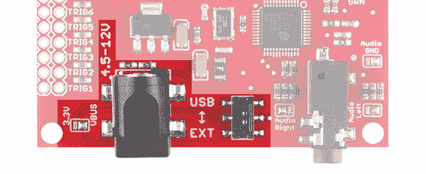](https://cdn.sparkfun.com/assets/learn_tutorials/3/8/1/mp3-2-power.jpg)

桶形插孔旁边的焊接跳线默认设置为**VBUS**。只要您通过该连接器为 MP3 触发器供电，请确保该跳线始终设置为 VBUS。

当筒式插孔通电时，您可以使用 USB/EXT 开关作为开/关开关来控制 MP3 触发器的电源。在 **EXT** 位置时，它应该通电。

[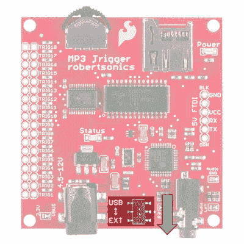](https://cdn.sparkfun.com/assets/learn_tutorials/3/8/1/13720-04_mp3_trigger_external_power_switch.jpg)

#### 外部电源通过通孔

您也可以将电源线直接焊接到电路板背面的通孔中。

[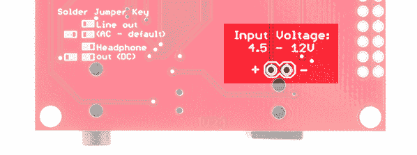](https://cdn.sparkfun.com/assets/learn_tutorials/3/8/1/mp3-2-power-back.jpg)

#### 通过 5V 电源的 FTDI 接头

如果您想将 MP3 触发器集成到使用 5V(如 USB 端口)的现有系统中，您可以通过 FTDI 接头为 MP3 触发器供电。

[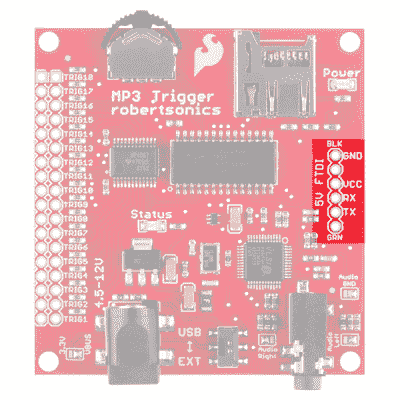](https://cdn.sparkfun.com/assets/learn_tutorials/3/8/1/mp3-5-FTDI.jpg)

您可以将稳压电源直接应用到 VCC 和 GND 引脚，或者您可以将一些[直角接头](https://www.sparkfun.com/products/553)焊接到 FTDI 端口，并使用适当的 [5V FTDI 基本分线点](https://www.sparkfun.com/products/9716)供电。

| [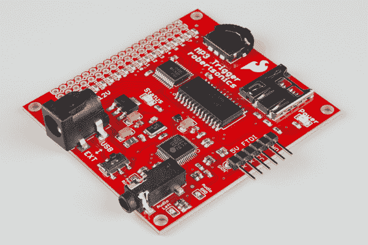](https://cdn.sparkfun.com/assets/learn_tutorials/3/8/1/MP3_Trigger-02.jpg) | [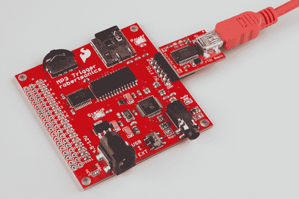](https://cdn.sparkfun.com/assets/learn_tutorials/3/8/1/MP3_Trigger-01_5V_FTDI_Jumper_VBUS.jpg) |
| *焊接在 FTDI 端口上的直角接头* | *带 5V FTDI 的电源* |

连接后，将开关拨到 **USB** 侧，为电路板供电。

[](https://cdn.sparkfun.com/assets/learn_tutorials/3/8/1/13720-04_mp3_trigger_FTDI_power_switch.jpg)

如果您打算将 MP3 触发器与 Arduino 或其他微控制器配合使用，通过 UART 进行通信，您也可以通过此端口进行通信。

#### 为什么使用 5V FTDI 而不是 3.3V FTDI？

您可能无法通过 FTDI 接头使用 3.3V 电源为 MP3 触发器供电，尽管在“5V FTDI”接头上使用 3.3V FTDI 似乎是合理的。这背后的原因是， [3.3V FTDI Basic](https://www.sparkfun.com/products/9873) 的某些版本使用 FTDI IC 将 5V 电压下调至 3.3V。如果您使用此设备为 MP3 触发器供电，您可能会超过 3.3V FTDI 的电流限制，导致您的设备可能会掉电。因此，我们建议使用一个 [5V 的基本 FTDI】。](https://www.sparkfun.com/products/9716)

[](https://www.sparkfun.com/products/9716) 

将**添加到您的[购物车](https://www.sparkfun.com/cart)中！**

### [SparkFun FTDI 基础突破- 5V](https://www.sparkfun.com/products/9716)

[In stock](https://learn.sparkfun.com/static/bubbles/ "in stock") DEV-09716

这是 FTDI FT232RL USB 转串行 ic 的基本分线板。此板的引脚匹配 FTDI 电缆工作…

$16.50122[Favorited Favorite](# "Add to favorites") 78[Wish List](# "Add to wish list")** **#### 通过稳压 3.3V 电源的 FTDI 接头

**Note:** SparkFun released a High-Current 3.3V FTDI Basic, known as the [Beefy 3](https://www.sparkfun.com/products/13746). Using this 3.3V FTDI with the MP3 Trigger is acceptable as it can provide enough current for it to operate.

[](https://www.sparkfun.com/products/13746) 

将**添加到您的[购物车](https://www.sparkfun.com/cart)中！**

### [SparkFun Beefy 3 - FTDI 基础突围](https://www.sparkfun.com/products/13746)

[In stock](https://learn.sparkfun.com/static/bubbles/ "in stock") DEV-13746

这是为 FTDI FT231X USB 到串行 ic 的 3 FTDI 基本突破。此板的引脚匹配 FTDI …

$17.5012[Favorited Favorite](# "Add to favorites") 22[Wish List](# "Add to wish list")** **如果使用能够通过 FTDI 接头的 VCC 引脚提供足够电流的稳压 3.3V 电源为 MP3 触发器供电，则需要清除跳线并重新焊接，以便在为电路板供电之前连接 3.3V 焊盘和中心焊盘。

[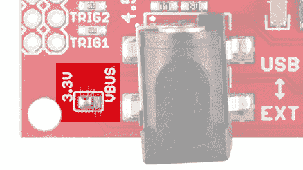](https://cdn.sparkfun.com/assets/learn_tutorials/3/8/1/mp3-10-jumper3.jpg)**Warning:** Switching the jumper to the 3.3V side will bypass the voltage regulator. You may risk damaging the microSD card and the components on the board if the voltage is higher than 3.3V or not regulated.

一旦与 FTDI 接头上的 3.3V 稳压电源连接，将开关拨到 **USB** 侧，为电路板供电。

[](https://cdn.sparkfun.com/assets/learn_tutorials/3/8/1/13720-04_mp3_trigger_FTDI_power_switch_3_3V_Jumper.png)

### 电源 LED

电源由位于右上角的红色电源指示灯指示。

[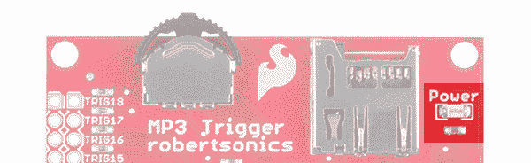](https://cdn.sparkfun.com/assets/learn_tutorials/3/8/1/mp3-2-power-LED.jpg)

### 触发销

触发针使 MP3 触发器如此易于使用。18 个触发器中的每一个都有一个 0.1 英寸的通孔。每个触发引脚旁边是一个接地引脚。通过[将](https://learn.sparkfun.com/tutorials/what-is-a-circuit/all#short)一个触发器引脚短接到地，你就激活了那个触发器，从而播放与那个特定触发器相关的音频文件。更多信息可在“使用触发输入”部分找到。

[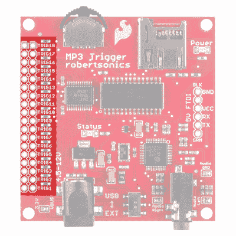](https://cdn.sparkfun.com/assets/learn_tutorials/3/8/1/mp3-6-Triggers.jpg)

### 1/8 英寸立体声耳机插孔和音频焊接跳线

MP3 触发器有一个 1/8 英寸(3.5 毫米)音频插孔，可将您的项目连接到放大器和扬声器或耳机。

[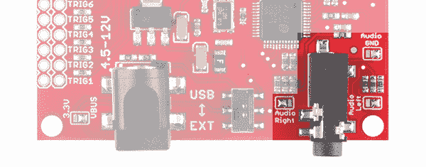](https://cdn.sparkfun.com/assets/learn_tutorials/3/8/1/mp3-7-audioJack.jpg)*Audio jumpers configured for Line out*

您只能将 MP3 触发器配置为作为线路输出或耳机**播放音频，但不能同时**播放两者。默认情况下，MP3 触发器配置为通过线路输出到外部音频系统播放。如果您希望使用 MP3 触发器来代替耳机，您需要清除所有三个音频焊接跳线的**中的焊料，并将中心焊盘焊接到相对的焊盘。**

焊接跳线备忘单方便地印刷在 MP3 触发器背面的丝网印刷中，以帮助您更改音频配置。

[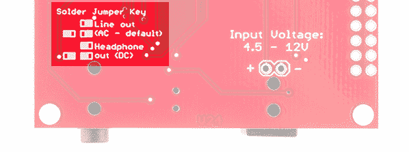](https://cdn.sparkfun.com/assets/learn_tutorials/3/8/1/mp3-4-jumperkey.jpg)

配置好耳机后，跳线应该如下所示:

[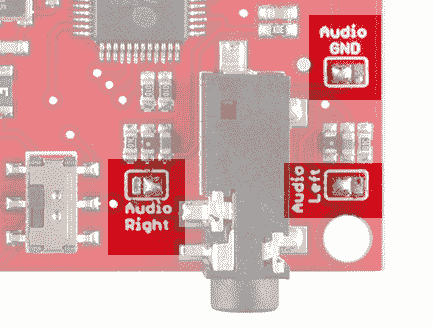](https://cdn.sparkfun.com/assets/learn_tutorials/3/8/1/mp3-10-jumper4.jpg)

### 导航开关

导航开关允许您循环播放和停止 microSD 卡上的所有曲目。有关其操作的更多信息，请参见基本操作部分。

[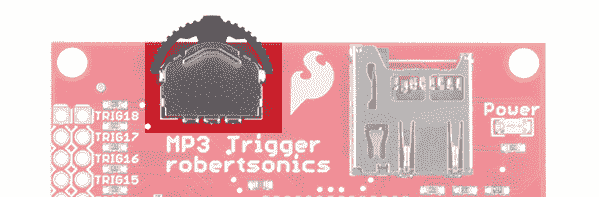](https://cdn.sparkfun.com/assets/learn_tutorials/3/8/1/mp3-8-switch.jpg)

### 微型插座

microSD 插座是一种简单的推入/推出装置。MP3 触发器支持 **SDSC(最高 2GB)** 和 **SDHC(最高 32GB)** 两种类型的 microSD 卡。有关 microSD 卡如何初始化的更多信息，请参见基本操作部分。

[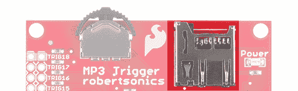](https://cdn.sparkfun.com/assets/learn_tutorials/3/8/1/mp3-3-sdSocket.jpg)

## 基本操作

只需使用 PC 将所需的 MP3 文件拖放到 FAT32 或 FAT16 格式的 microSD 闪存卡的根目录中。

MP3 触发器**不支持 microSD 卡**的热插拔。虽然这不会损坏任何东西，但 microSD 介质只在加电时初始化。因此，每当更换或更新卡时，请确保在安装卡后重启 MP3 触发器。

当 MP3 触发器通电时，板载(绿色)状态 LED 指示已安装媒体的状态如下:

*   1 次长时间闪烁-未找到已格式化的 microSD 介质。
*   1 次长闪烁，随后 1 次短闪烁-找到 microSD 媒体，未找到 MP3 文件。
*   持续短暂闪烁 MP3 解码器的硬件问题。
*   短暂闪烁 3 次-找到 microSD 媒体，至少找到 1 个 MP3 文件。

[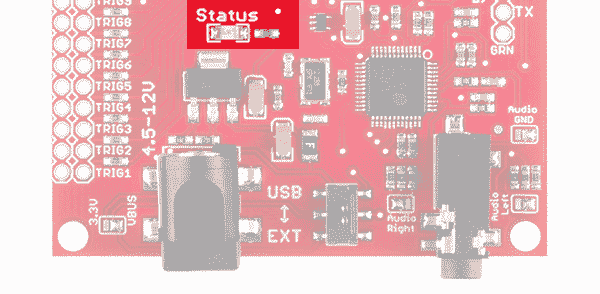](https://cdn.sparkfun.com/assets/learn_tutorials/3/8/1/mp3-9-statusLED.jpg)*Status LED*

只要 MP3 触发器启动并短暂闪烁 3 次，就可以使用板载导航开关来播放卡上的所有曲目，而不考虑文件名。

*   向左播放目录中的上一个 MP3 文件
*   右键播放目录中的下一个 MP3 文件
*   居中-开始/停止当前 MP3 文件

## 使用触发输入

MP3 触发器提供 18 个输入引脚(trig 01–trig 18 ),可用于触发 microSD 卡上的特定 MP3 曲目。MP3 曲目通过在文件名的开头放置一个 3 位数(使用前导 0)与触发器相关联； **001 代表触发 01** ， **002 代表触发 02** 等等。文件名的其余部分可以是任何内容。例如，以下是 TRIG14 的两个有效名称:

*   “014 轨道。MP3 "
*   " 014 打碎玻璃. mp3 "

触发输入为低电平有效，内部拉高。因此，它们可以通过另一个微控制器(如 Arduino)的数字输出来激活，也可以通过简单的接地触点闭合(开关)来激活。输入支持 5V 或 3.3V 的电压电平。

触发输入在双排连接器的偶数引脚上提供，所有相对的(奇数)引脚接地，这样就可以很容易地将单个开关或触点闭合直接连接到 MP3 触发板上。

安装 36 针[双排接头](https://www.sparkfun.com/products/12791)允许在触发输入上安装分流跳线，以便在通电时自动排序和循环轨道，如下所示。

当一个被触发的曲目到达结尾时，MP3 触发器会查看是否有任何触发输入处于活动状态，如果有，将自动开始另一首曲目。如果只有相同的触发器被激活，那么该轨道将重新开始(循环)。如果其他触发器是活跃的，MP3 触发器将总是开始下一个更高的触发轨道，在 18 之后折回到 1。

再加上 MP3 触发器会在上电时自动启动编号最低的活动触发器，这意味着通过在触发器输入端安装分流跳线，MP3 触发器可以设置为在上电时自动排序和循环 1 至 18 个音轨，无需外部编程或控制。(从固件版本 2.40 开始，在单个顺序触发器上安装分流跳线也可以做到这一点。)

例如，如果你想让音轨 9 在启动时播放，你可以跳过触发器 9。如果你想让音轨 1 到 9 在启动时播放，你必须在所有九个触发器上都有一个跳线。

使用本文后面描述的初始化文件，触发器可以被重新编程以启动顺序或随机轨道。例如，如果一个触发器被重新编程为随机触发器，并且该触发器被分流关闭，则 MP3 触发器将通电并以(伪)随机顺序连续播放曲目。

### 安静模式

使用串行控制端口可以将 MP3 触发器置于安静模式。在这种模式下，触发输入不会启动轨道，而是在激活时发送串行消息。(参见下面的“MP3 触发外发消息摘要”。)这样可以将触发输入从特定轨道去耦，以便 PC 或微控制器可以监控触发输入，然后通过串行控制端口启动任何轨道或轨道序列。

默认情况下，安静模式是关闭的，并且不会在电源周期内保持不变

## 串行控制协议

MP3 触发器带有一个全双工 3.3-5V 串行 TTL 接口，允许控制 microSD 卡上的所有 MP3 曲目(最多 256 首)以及音量，并监控输入触发器活动。你可以使用一个 [FTDI Basic](https://www.sparkfun.com/products/9716) 或者连接到任何使用以下格式的串行接口: **8 位，1-开始，1-停止，无奇偶校验，流量控制=无**。串行端口波特率**默认为 38.4kbps(即 38400 波特)**，但可以使用初始化文件进行更改。MP3 触发器的所有命令长度为 1 或 2 字节。

1 字节命令是大写的 ASCII 字符。2 字节命令以 ASCII 字符开头。以大写字符开头的字节使用 ASCII 值(“0”到“9”)作为第二个字节。(这些命令可以在键盘上键入。)以小写字符开始的 2 字节命令需要一个二进制值(0–255)作为第二个字节。

发送到 MP3 触发器的字节不会被回显。如果需要回显，请将您的终端程序设置为本地回显。

### 命令摘要

命令:**导航–启动/停止**
字节数:1
命令字节:“O”
数据字节:无
备注:该命令执行的功能与推动车载导航开关中心位置相同。如果当前曲目正在播放，它会停止。如果当前曲目被停止，它将从头重新开始。

命令:**导航–前进**
字节数:1
命令字节:“F”
数据字节:无
备注:该命令执行的功能与将车载导航开关推到右侧位置相同。目录中的下一首 MP3 曲目将开始播放。

命令:**导航–倒车**
字节数:1
命令字节:“R”
数据字节:无
备注:该命令执行的功能与将车载导航开关推到左侧位置相同。将开始播放目录中的前一首 MP3 曲目。

命令:**触发(ASCII)**
字节数:2
命令字节:' T'
数据字节:N = ASCII '1 '到' 9'
备注:如果存在，文件名为“00Nxxxx。MP3”将被启动，其中 N 是数据字节。xxxx 可以是任何长度的任何有效文件名字符。

命令:**触发(二进制)**
字节数:2
命令字节:' t'
数据字节:n = 1 到 255
备注:如果存在，文件名为“NNNxxxx”的轨道。MP3 ”,其中 NNN 是以 0 开头的数据字节“n”的 ASCII 等价物。xxxx 可以是任何长度的任何有效文件名字符。

命令:**播放(二进制)**
字节数:2
命令字节:' p'
数据字节:n = 0 到 255
备注:如果存在，将播放目录中的第 n 首曲目。可以使用下面的状态请求命令来检索目录中可用轨道的总数。

**Note:** There are subtle differences when using the Play and Trigger commands. When sending the Play command ('**p**') with a data byte via the serial UART, the MP3 Trigger will begin playing files in the order that the track appears in the microSD card filesystem. For example, let's say you saved the following tracks in this order:

*   *“009 什么的。MP3"*
*   *“005 开始。MP3"*
*   *“001 火花。MP3"*
*   *“002 好玩。MP3"*

You decide to send the [hex representation](https://learn.sparkfun.com/tutorials/hexadecimal) of the command byte and data byte. The Play command 'p' as `0x160` with data byte '1' as `0x1` are sent to the MP3 trigger. The MP3 trigger will begin playing in the order that it was saved to the microSD card. As opposed to playing the track number associated with the number 1, it will begin playing *"009 SOMETHING.MP3"*. To play *"001 SPARK.MP3"*, you would need to send the play command as `0x160` with data byte '3' as `0x3` since it was the 3rd track to be saved in the directory.

The Trigger command plays by the track based on the file name. Using the Trigger command '**T**' as `0x124` with data byte '1' as `0x61`, the board will play *"001 SPARK.MP3"*. Remember, the upper case ASCII character requires an [ASCII value](https://learn.sparkfun.com/tutorials/ascii#ascii-table) between '1' through '9' as the second data byte. Using the Trigger command '**t**' as `0x160` with data byte '1' as `0x1`, the board will play *"001 SPARK.MP3"*. As noted earlier, the lower case ASCII character requires a binary value between 0 to 255 as the second data byte.

命令:**设置音量(二进制)**
字节数:2
命令字节:“v”
数据字节:n = 0 至 255
备注:VS1053 音量将设置为值 n。根据 VS1053 数据表，最大音量为 0x00，远高于 0x40 的值太低，听不到。

命令:**状态请求(ASCII)**
字节数:2
命令字节:“S”
数据字节:N = ASCII '0 '到' 1'
备注:如果 N = '0 '，MP3 触发器会以版本字符串响应。如果 N = '1 '，MP3 触发器将以 ASCII 格式响应已安装的 microSD 卡上的曲目总数。两个响应前面都有“=”字符。

命令:**静音模式(ASCII)**
字节数:2
命令字节:' Q'
数据字节:N = ASCII '0 '或' 1'
备注:如果 N='1 '，则开启静音模式。如果 N='0 '，安静模式被关闭。默认状态为关闭。

### MP3 触发外发消息摘要

MP3 触发器发送以下 ASCII 消息:

*   x ':当前播放的曲目结束时。
*   x ':当前播放的曲目被新命令取消时。
*   e ':当请求的轨道不存在时(错误)。

响应于状态请求命令，数据字节=‘0’，MP3 触发器发送 18 字节版本字符串:例如“=MP3 触发器 v2.50”。响应于状态请求命令，数据字节= '1 '，MP3 触发器发送当前安装的 microSD 卡上的 MP3 曲目数量:例如“=14”。

仅在安静模式下，当一个或多个触发器输入被激活时，MP3 触发器发送“M ”,后跟一个 3 字节的位掩码，指示哪些触发器被激活:

*   数据字节 0: TRIG01 至 TRIG08
*   数据字节 1: TRIG09 至 TRIG16
*   数据字节 2: TRIG17 和 TRIG18

一个位的值为 1 表示相应的触发输入被激活。

## 初始化文件

版本 2.40 固件(以及更高版本)支持使用初始化文件来在加电时改变 MP3 触发器的一些操作参数。该文件仅为 ASCII 文本，可以用任何文本编辑器(如记事本)创建和编辑。初始化文件必须命名为“MP3TRIGR”。并且必须像所有的 mp3 文件一样，位于根目录中。该文件是可选的。如果不存在，则 MP3 触发器默认以 38.4K 波特正常工作，所有触发器开始各自的轨道。初始化文件命令必须以“#”字符开头，后跟一个空格。以下两页中的初始化文件示例是自文档化的，描述了当前支持的命令:

### 示例初始化文件

```
#BAUD 38400
#RAND 2
#TRIG 01, 0, 0
#TRIG 02, 0, 0
#TRIG 03, 0, 0
#TRIG 04, 0, 0
#TRIG 05, 0, 0
#TRIG 06, 0, 0
#TRIG 07, 0, 0
#TRIG 08, 0, 0
#TRIG 09, 0, 0
#TRIG 10, 0, 0
#TRIG 11, 0, 0
#TRIG 12, 0, 0
#TRIG 13, 0, 0
#TRIG 14, 0, 0
#TRIG 15, 0, 0
#TRIG 16, 0, 0
#TRIG 17, 0, 0
#TRIG 18, 0, 0
******************** ALL INIT COMMANDS ABOVE THIS LINE *********************
This is a sample init file for the MP3 Trigger v2, firmware version 2.40.

The init file is optional. If not present, the default parameters will be
in effect: 38.4Kbaud, and all triggers will start their corresponding
tracks with restart lockout disabled. If it is present, it must be named
MP3TRIGR.INI and be located in the root directory.

Only the first 512 bytes of the file are examined for commands, and the first
occurrence of the '*' character is treated as the end of file by the parser.
Comments are not allowed in the command section, but there is no restriction
on the length of the comments that follow the first '*'.

All commands must begin with the '#' character and be followed by a space,
then the command parameters separated by commas. White space is ignored. All
parameters are decimal numbers. Leading zeros are acceptable. See the above
examples - which are redundant since they are all default values.

The following commands are supported in firmware version 2.40:

#BAUD N

    where N is one of the following: 2400, 9600, 19200, 31250 or 38400

#RAND N

    where N is from 1 to 255

    The default behavior of the random trigger function is to play a random 
    track from all the MP3 files on the flash card. The #RAND function will
    exclude the first N tracks (in the directory) from the random trigger
    function. So if there are 18 MP3 files on the card and N=4, then the
    first 4 MP3 files will be excluded from the random trigger function.

#TRIG N, F, L

    where: N is the trigger number (1-18)
    F is the trigger function type (see below)
    L is the restart lockout enable

    The defined trigger function types (F) are as follows:

    F = 0: Normal operation
    F = 1: Next (same as the forward Nav switch)
    F = 2: Random
    F = 3: Previous (same as the back Nav switch)
    F = 4: Start (restarts the current track)
    F = 5: Stop
    F = 6: Volume Up
    F = 7: Volume Down

    The restart lockout feature, if enabled, will prevent that trigger
    from working if audio is currently playing. Use this if you want
    to prevent restarts before the track has reached the end. This
    feature does not apply to function types 5-7.

    L = 0: Restart lockout disabled (default)
    L = 1: Restart lockout enabled

You only need to include entries for triggers that are to be non-default.
As an example, I use the following single-line init file to make trigger
18 be a "Next" function, then hard-wire the trigger so that my MP3 Trigger
powers up and loops continuously through all the tracks on the card.

#TRIG 18, 1, 0 
```

## 引导装载程序

MP3 触发器有一个常驻引导程序，允许直接从 microSD 卡更新固件，减少了对硬件程序员的需求。因为这个引导程序位于 PSoC 闪存的受保护扇区，所以它不能覆盖自身。引导加载程序总是可以在加电时运行，因此可以从错误的固件加载中恢复。

**IMPORTANT NOTE:** Use of a hardware programmer, such as the Cypress MiniProg, to program the MP3 Trigger with anything other than the bootloader image will erase the bootloader. Don’t do it!

### 使用引导加载程序

要更新 MP3 触发器固件，请将新固件十六进制文件复制到 FAT16 或 FAT32 格式的 micro-SD 卡，并将该文件重命名为“MP3TRIGR”。十六进制”。不管它是不是 microSD 卡上的唯一文件，只要它有这个确切的文件名，引导程序就会找到它。关闭电源，将 microSD 卡插入 MP3 触发器。打开电源时按住中央导航开关。等待状态指示灯稳定亮起，然后重启 MP3 触发器以运行新固件。

### Bootloader 详细解释

每当板通电时，总是进入引导加载程序。它做的第一件事是查看中央导航开关是否被按下。如果没有，它会立即指向固件的开头。请注意，如果您以前加载了错误的固件，主板将简单地停止或执行错误代码告诉它做的任何事情-除了电源指示灯之外，可能没有任何活动。如果没有加载好的固件，这是正常的。

如果中央导航开关在通电时被按住，引导加载程序会在 microSD 卡目录中搜索名为“MP3TRIGR”的文件。十六进制”。如果没有安装卡，或者卡上不存在该文件，它会一直快速闪烁状态指示灯。如果它找到并能够打开该文件，它就开始用固件文件的内容对 PSoC 闪存进行编程。对于每个已编程的十六进制记录，状态 LED 将点亮。如果成功编程整个文件，状态 LED 将在完成后稳定亮起。然后，您可以重新启动 MP3 触发器，您将运行新的固件(不要再按住导航开关，否则您将简单地重新进入引导加载程序。

如果出现闪存编程错误(例如，您在完成之前拔出了 microSD 卡)，状态 LED 将通过以大约 1 Hz 的频率短暂闪烁来指示不良编程周期(这看起来与编程记录的闪烁非常不同)。您需要再次打开电源，按住导航开关以重新进入引导程序。

关键是引导装载程序不能重写自身的任何部分，不管固件映像文件中有什么。可能发生的最糟糕的事情是你加载了错误的固件，主板无法运行。但是你可以在开机时一直按住导航开关，然后进入引导程序来加载新的固件。

## 资源和更进一步

感谢阅读！这里有一些额外资源和教程供您探索。

*   [示意图](https://cdn.sparkfun.com/datasheets/Widgets/mp3-trigger-v24.pdf)
*   [老鹰档案](https://cdn.sparkfun.com/datasheets/Widgets/mp3-trigger-v24.zip)
*   [数据表](https://cdn.sparkfun.com/datasheets/Widgets/vs1063ds.pdf) (VS1063)
*   [数据表](https://cdn.sparkfun.com/datasheets/Widgets/CY8C29466-8_2015.pdf) (CY8C29466-24SXI)
*   [MP3 触发支持页面](http://robertsonics.com/mp3-trigger-support/)
*   [固件更新](http://robertsonics.com/mp3-trigger-downloads/)
*   [GitHub](https://github.com/sparkfun/MP3_Trigger/)

[](https://learn.sparkfun.com/tutorials/sound-reactive-el-wire-costume) [### 声音反应 EL 线服装](https://learn.sparkfun.com/tutorials/sound-reactive-el-wire-costume) Learn how to make your EL wire costumes sound reactive in this project tutorial.[Favorited Favorite](# "Add to favorites") 18[](https://learn.sparkfun.com/tutorials/electret-mic-breakout-board-hookup-guide) [### 驻极体话筒分线板连接指南](https://learn.sparkfun.com/tutorials/electret-mic-breakout-board-hookup-guide) An introduction to working with the Electret Mic Breakout Board.[Favorited Favorite](# "Add to favorites") 3[](https://learn.sparkfun.com/tutorials/proto-pedal-assembly-and-theory-guide) [### 原型踏板组件和理论指南](https://learn.sparkfun.com/tutorials/proto-pedal-assembly-and-theory-guide) Getting started with the SparkFun Proto Pedal. We'll assemble the board, then discuss some of the details of the circuit.[Favorited Favorite](# "Add to favorites") 8[](https://learn.sparkfun.com/tutorials/noisy-cricket-stereo-amplifier---15w-hookup-guide) [### 嘈杂的板球立体声放大器- 1.5W 连接指南](https://learn.sparkfun.com/tutorials/noisy-cricket-stereo-amplifier---15w-hookup-guide) A hookup guide for the Noisy Cricket Stereo Amplifier - 1.5W.[Favorited Favorite](# "Add to favorites") 2**********