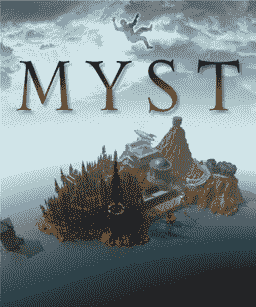
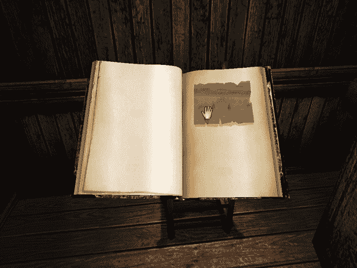
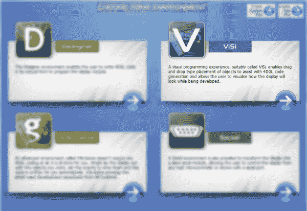
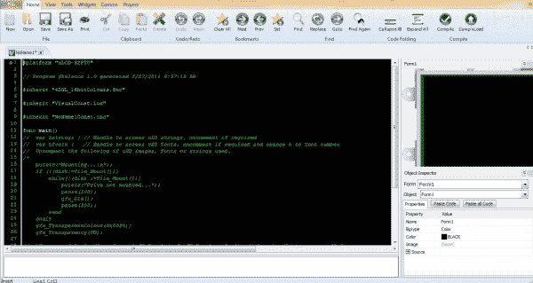
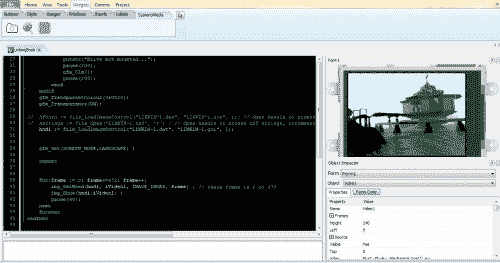
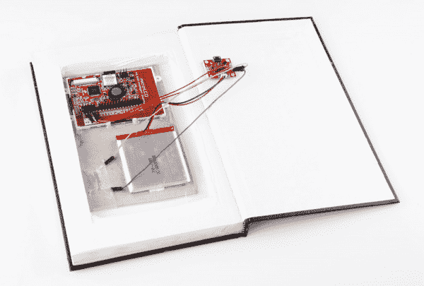
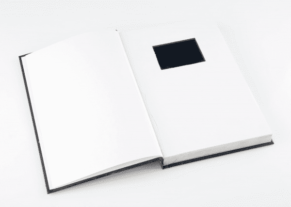

# MYST 连接书

> 原文：<https://learn.sparkfun.com/tutorials/myst-linking-book>

## 二十年的游戏生涯

[](https://cdn.sparkfun.com/assets/f/3/6/9/0/MystCover.png)*"Ah, my friend! You've returned."*

早在 1991 年，Rand 和 Robyn Miller 兄弟在 Cyan，Inc .领导了一个团队，开始创建一个益智冒险游戏，最终使该软件公司闻名于世。其独特的前提、简单的机制和美丽的艺术作品使 *MYST* 从 1993 年发布以来一直是最畅销的电脑游戏，直到 2002 年被*模拟人生*击败。

二十年来，在几部续集和一系列衍生作品之后，Cyan Worlds 刚刚本着 MYST 精神推出了一个新系列。为了庆祝，我决定把 MYST 奥运会的一个有趣的小道具放在一起。该项目还将向您介绍用于编程 4D 系统显示器的 4DViSi 环境！

### 建议阅读/观看

哦，但是在我们开始之前，你应该看看这本关于 4D 系统触摸屏的入门书。一旦您熟悉了使用 ViSi Genie，您就可以使用 visio 环境了！

## 德尼和艺术

MYST 奥运会的关键机制之一是联系本。本质上，这些是一种将你从一个世界传送到另一个世界(在游戏中，被称为“时代”)的入口。打开书的封面，会看到一个面板，上面有一张图片或链接位置的立体图。把你的手放在面板上会把你传送到那个位置。

[](https://cdn.sparkfun.com/assets/8/3/e/2/f/Realmyst_linking_book.png)

根据 MYST 的传说，连接书籍是文明的产物。德尼人发明了一种方法，准备特殊的书籍和墨水，然后用一种特殊的写作风格来创建不同世界的链接。有不同种类的书(连接书，描述书，陷阱书等。)，而且，自从达尼的陷落，这门艺术已经被遗忘了大半。

在《MYST》和续集之间，所有这些作品的细节都是由游戏的创作者们想出来的，并导致了关于在 MYST 岛上发现的书籍的重大反响。

幸运的是，在本教程中，你不需要设计任何特殊的墨水或纸张来制作连接书。你将不得不学习一门语言，但不会是古老的德尼语...

## 用 4D ViSi 编程

为了制作我的书的链接面板，我需要一个全彩色的 LCD 屏幕和足够的计算能力来播放一小段视频。显而易见的选择是 4D 系统公司的显示模块之一。我认为这就像在 ViSi Genie 中运行一些东西并插上电池一样简单，而且*几乎*做到了。唯一的问题是在 ViSi Genie 中似乎没有任何循环视频对象的方法。没什么大不了的，让我们看看引擎盖下面...

第一步？我们将在 ViSi 环境中启动一个新项目:

[](https://cdn.sparkfun.com/assets/learn_tutorials/1/7/8/ViSi_1.JPG)

一旦您选择了目标并打开了一个新的 ViSi 项目，您应该会看到如下内容:

[](https://cdn.sparkfun.com/assets/learn_tutorials/1/7/8/ViSi_2.JPG)

大的文本输入字段是您编写控制屏幕的 4DGL 代码的地方。你会注意到那里已经有一个程序的大纲，它是由 4D 工作室生成的，包括一个特定于你的目标设备的库。俏皮！在右侧，您会看到目标设备的图片。这对于任何使用过 ViSi Genie 的人来说都是熟悉的。事实上，使用 ViSi 编辑器，您可以像在 Genie 中一样，单击小部件并将其拖动到目标设备上。不过，在我们开始之前，让我们先来看看这个框架代码:

```
#platform "uLCD-32PTU"

// Program Skeleton 1.0 generated 2/27/2014 10:25:58 AM

#inherit "4DGL_16bitColours.fnc"

#inherit "VisualConst.inc"

#inherit "NoName1Const.inc"

func main()
//  var hstrings ; // Handle to access uSD strings, uncomment if required
//  var hFontx ;   // Handle to access uSD fonts, uncomment if required and change n to font number
//  Uncomment the following if uSD images, fonts or strings used.
/*
    putstr("Mounting...\n");
    if (!(disk:=file_Mount()))
        while(!(disk :=file_Mount()))
            putstr("Drive not mounted...");
            pause(200);
            gfx_Cls();
            pause(200);
        wend
    endif
    gfx_TransparentColour(0x0020);
    gfx_Transparency(ON);

//  hFontn := file_LoadImageControl("NoName1.dan", "NoName1.gcn", 1); // Open handle to access uSD fonts, uncomment if required and change n to font number dropping a and c if > 9
//  hstrings := file_Open("NoName1.txf", 'r') ; // Open handle to access uSD strings, uncomment if required
    hndl := file_LoadImageControl("NoName1.dat", "NoName1.gci", 1);
*/

    gfx_Set(SCREEN_MODE,LANDSCAPE) ;

    repeat 
    forever
endfunc 
```

这看起来像是一个简单框架的大量代码，但是，一旦你深入其中，你会发现它主要是与从 uSD 卡中提取资源相关的例程。因为您并不总是需要从 uSD 中提取字符串、字体或图像，所以这些行在默认情况下被注释掉。在 uSD 下面有一个对 gfx_Set()的调用，它只是用来设置屏幕模式。最后，有一个空的永远循环，您可以用自己选择的无限重复的代码来填充它。

马上，我们已经知道我们将不得不访问一些图像，所以我们将继续下去，并删除块注释符号。这将取消对以下两段代码的注释:

```
putstr("Mounting...\n");
    if (!(disk:=file_Mount()))
        while(!(disk :=file_Mount()))
            putstr("Drive not mounted...");
            pause(200);
            gfx_Cls();
            pause(200);
        wend
    endif
    gfx_TransparentColour(0x0020);
    gfx_Transparency(ON); 
```

该程序检查显示模块是否可以访问 uSD 卡。如果不能，它将闪烁错误信息“驱动器未安装...”

```
hndl := file_LoadImageControl("NoName1.dat", "NoName1.gci", 1); 
```

这一行给出了存储在 uSD 卡上的资源的名称。

下一步是使用视频小部件导入视频。此时，保存您的进度是明智的。如果您选择了 4D 工作室因其大小或格式而无法处理的视频文件，IDE 可能会崩溃(从版本 4.0.2.16 开始)。我最终使用的视频是最初的 MYST 游戏中的机械时代天桥。我在 YouTube 上找到了这个视频，用谷歌搜索找到的一个服务下载了它，然后把它转换成一个小的 AVI 文件。我将在本教程的参考资料中包含一个链接，指向对我有用的剪辑。

为了添加视频小工具，你需要点击顶部导航栏中的“小工具”菜单，然后选择“系统/媒体”小工具选项卡。接下来，单击看起来像电影胶片的图标，然后在目标屏幕上单击要放置它的位置。您可以拖动它，并在以后调整它的大小，所以只需点击目标设备图片上的任何地方。应该会弹出一个文件管理器窗口，允许您选择一个文件。

[](https://cdn.sparkfun.com/assets/a/4/2/a/7/ViSi_3.JPG)

现在，您应该在对象检查器上看到您的视频文件，并且您可以拉伸它以适合显示器。您还应该在设备图片的正下方看到一个写着“粘贴代码”的按钮。单击此按钮会将选定对象的基本代码粘贴到代码编辑器中选定的任何代码部分。在“重复”和“永远”之间留出一些空间，然后将视频代码粘贴到这里。这几行代码应该会出现:

```
// Video1 1.0 generated 2/27/2014 2:11:26 PM
img_SetWord(hndl, iVideo1, IMAGE_INDEX, frame) ; // where frame is 0 to 473
img_Show(hndl,iVideo1) ; 
```

您可能已经猜到，ViSi 通过将视频分割成图像并按顺序显示图像来处理视频回放。上面的代码只是为了显示数字“frame”的一帧。为了回放视频，我们需要将它放入一个循环中，每次循环都会增加 frame 变量。不过，首先，我们需要声明变量。返回几行并添加这一行:

```
var frame ; 
```

这只是创建了一个变量，我们可以用它来调用视频中的每一帧。现在，将我们从 video 对象粘贴的两行内容包装到一个 FOR 循环中，该循环在所有帧中递增。总帧数包含在自动生成的行注释中很有帮助。您的 repeat-forever 循环应该如下所示:

```
repeat

for(frame := 0; frame<=472; frame++)
    img_SetWord(hndl, iVideo1, IMAGE_INDEX, frame) ; // where frame is 0 to 473
    img_Show(hndl,iVideo1) ;
    pause(40);
next

forever 
```

这应该能行！现在我们把程序上传到设备上！首先，您需要使用一个[USB-PA5](https://www.sparkfun.com/products/11814)USB-串行桥将您的模块连接到计算机。你还需要将你的 uSD 卡插入读卡器，然后连接到你的电脑上。确保在 Comms 菜单下为您的 USB-PA5 选择了正确的串行端口。现在，您应该能够按下编译和下载。该程序将生成您的支持文件，并询问您是否要将它们放在 SD 卡上。去吧，做吧。然后，程序将连接到设备并安装您的代码。完成此过程后，从您的计算机中取出 uSD 卡，并将其放入您的显示模块。你应该看到你的视频反复播放！

现在我们有了一个可以工作的“链接面板”，我们需要一本书来把它放进去...

## 收尾

为了放置我的 4D 展示模块，我决定从当地的艺术用品商店掏空一个便宜的素描本。关于如何制作一本空心书的指导，只需在谷歌上搜索“如何制作一本安全的书”，然后四处搜索。

我将屏幕和一些支持电路安装在一块纸板上，以增加组件的刚性。为了给屏幕供电，我把它连接到一个脂电池上，用一个 [PowerCell](https://www.sparkfun.com/products/11231) 给它充电。这样做的好处是可以让我把书插上电源充电。我还将一个[簧片开关](https://www.sparkfun.com/products/10601)从 PowerCell 上的 EN 引脚连接到 GND，这样我就可以用粘在书封面上的磁铁来切断电源。每次打开书，屏幕就会启动并开始显示视频。当你合上书时，封面上的磁铁会接触到封底的簧片开关，使设备进入睡眠状态。

[](https://cdn.sparkfun.com/assets/3/2/6/a/8/linkingbookNickPoole3.jpg)

这里你可以从后面看到我的手工作品。我用泡沫胶带将 PowerCell 贴在书的封底，这样我就可以轻松地用 USB 线连接它。我在书的前面留了几页，并在其中两页上剪了一个屏幕大小的洞。我把第一张直接粘到纸板组件和下面的页面上。对于第二个，我只粘在点，这样它会看起来很自然。最后，有一个不受干扰的页面在最前面，只是因为一些链接书籍似乎有一页覆盖面板。

[](https://cdn.sparkfun.com/assets/3/7/8/3/1/linkingbookNickPoole2.jpg)

我用一些砂纸把速写本的边缘打磨粗糙。出乎我的意料，它实际上经受住了风吹雨打。如果你有野心，你可以把纸染成茶色。游戏里的链接书大多都是粗制滥造的。毕竟，与描述性书籍不同，链接书籍应该是便携的，经常被随身携带和冒险。

[](https://cdn.sparkfun.com/assets/1/4/4/c/8/linkingbookNickPoole1.jpg)

这是最终产品...

替换打开

[//www.youtube.com/embed/ZanIiljeYv0](//www.youtube.com/embed/ZanIiljeYv0)

替换关闭

## 资源和更进一步

所以你有它！它可能不会把你和一个神秘的时代联系起来，但是它会让任何一个看一眼的人感到惊讶。4D 系统显示模块有很多功能是本项目没有探索的。例如，它们是触摸屏，所以当你触摸面板时，你没有理由不能让这本书做一些事情，不管它只是播放声音还是开门。

我肯定不是第一个或最后一个做这个项目的人，在此之前已经有一些令人印象深刻的链接书籍，所以我在下面列出了一些链接。MYST 的粉丝圈是一个发现工匠和道具制作人在做非常棒的工作的好地方。

其他链接书籍项目:

*   [可玩的 MYST 书](http://www.wired.com/design/2012/11/a-real-myst-linking-book/all/)
*   [用 iPod Touch 链接书籍](http://mystonline.com/forums/viewtopic.php?t=20323)

资源:

*   [机械时代天桥视频](https://cdn.sparkfun.com/assets/learn_tutorials/1/7/8/Myst_-_Fly-by__Mechanical_Age_1_.avi)

此外，不要忘记查看我们的[项目教程](https://learn.sparkfun.com/tutorials/tags/projects)以获得更多好主意！