# nRF52840 使用 nRF5 SDK 进行高级开发

> 原文：<https://learn.sparkfun.com/tutorials/nrf52840-advanced-development-with-the-nrf5-sdk>

## 介绍

你是 nRF52840 的用户吗？你准备好远离 Arduino IDE 的舒适了吗？感觉被 CircuitPython 的支持限制了？也许是时候建立一个属于自己的基于 armgcc 的开发环境，并投入到 [Nordic 的 nRF5 软件开发套件(SDK)](https://www.nordicsemi.com/eng/Products/Bluetooth-low-energy/nRF5-SDK) 中了。

[](https://www.nordicsemi.com/eng/Products/Bluetooth-low-energy/nRF5-SDK)

本教程将涵盖 nRF52 开发所需的所有软件工具(armgcc、nrfutil 和 nRF5 SDK)的下载和设置。它专注于开发 [SparkFun Pro nRF52840 迷你突破](https://www.sparkfun.com/products/15025)。

SparkFun 的 nRF52840 配备了一个 USB 串行 DFU 引导程序。因此，本教程将额外关注**修改 SDK 以通过 USB** 无缝引导加载代码。

### 利弊

与任何开发方法一样，构建自制编程环境有好处也有坏处。

#### 赞成的意见

*   大量示例应用程序！Nordic 的 nRF5 SDK 中的示例列表非常详尽。从 blinky 到 BLE 心率监测器的一切都包含在 SDK 中。
*   Nordic 的文档同样全面且组织良好。只需看一眼 [nRF5 SDK 文档](https://www.nordicsemi.com/DocLib)。
*   访问可能不支持 Arduino 或 CircuitPython 的更多高级功能:NFC、ANT、电容式触摸感应、FreeRTOS 等等
*   使用您最喜欢的 IDE/编辑器的灵活性。无论你更喜欢使用 [Eclipse](https://www.eclipse.org/) 、 [Sublime](https://www.sublimetext.com/) 、 [Notepad++](https://notepad-plus-plus.org/) ，还是我们将在本教程中演示的 [Visual Studio 代码](https://code.visualstudio.com/)，你的选择几乎是无穷无尽的！

#### 骗局

*   我们不会说谎。从头开始设置工具链和 IDE 可能是一项艰巨的任务。您可能会遇到一些错误，这些错误似乎不可能只出现在您的设置和计算机中。如果你遇到了困难，可以在本教程的评论部分找到答案。
*   我们已经不在 Arduino 或者 Python 的世界了。如果您以前从未做过，那么使用 nRF5 SDK 进行开发会非常困难。无论您是想要闪烁 LED 还是将 nRF52 板设置为 BLE 中央设备，都有许多新功能、宏和编程范例需要熟悉。幸好有很多例子！
*   SDK 不是为 SparkFun nRF52840 Mini Breakout 量身定制的。对于大多数示例，您需要进行一些 Makefile(和潜在的链接器脚本)修改，以便使用预编程的引导加载程序将其加载到 nRF52840 上。

### 所需材料

本教程主要旨在支持**[spark fun Pro NRF 52840 Mini Breakout](https://www.sparkfun.com/products/15025)**——尤其是涵盖 SDK 修改以启用通过引导程序编程的部分。

[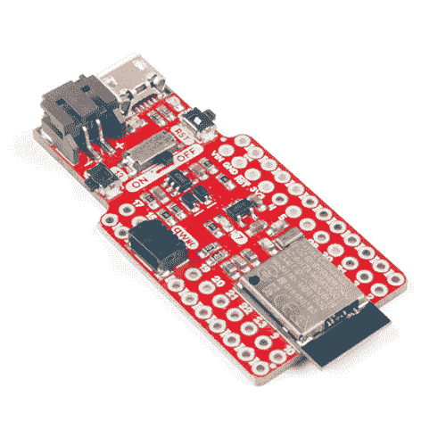](https://www.sparkfun.com/products/15025) 

### [SparkFun Pro nRF52840 迷你蓝牙开发板](https://www.sparkfun.com/products/15025)

[Out of stock](https://learn.sparkfun.com/static/bubbles/ "out of stock") DEV-15025

SparkFun Pro nRF52840 Mini 是 Nordic NRF 52840 的开发板，这是 ARM Cortex-M4 CPU 的强大组合…

1[Favorited Favorite](# "Add to favorites") 30[Wish List](# "Add to wish list")

也就是说，本教程的一般设置部分可以适用于任何 nRF52840 -甚至 [nRF58232](https://www.sparkfun.com/products/13990) 或 [nRF51](https://www.nordicsemi.com/Products/Low-power-short-range-wireless/nRF51822) -板。Nordic 的 [nRF52840 开发套件(DK)](https://www.nordicsemi.com/Software-and-Tools/Development-Kits/nRF52840-DK) 或 [nRF52840 加密狗](https://www.nordicsemi.com/Software-and-Tools/Development-Kits/nRF52840-Dongle)是很棒的主板，应该可以与本教程的大部分内容一起使用。除了 nRF52840 板，除了一根 [micro-B USB 电缆](https://www.sparkfun.com/products/10215)之外，您不需要任何其他东西来连接设备和计算机。

### 推荐阅读

如果您尚未通读，我们建议您在继续阅读之前跟随我们的 [SparkFun Pro nRF52840 迷你连接指南](https://learn.sparkfun.com/tutorials/sparkfun-pro-nrf52840-mini-hookup-guide)。本教程将使您熟悉主板的硬件特性以及 DFU/UF2 引导程序的复杂性。

[](https://learn.sparkfun.com/tutorials/sparkfun-pro-nrf52840-mini-hookup-guide) [### SparkFun Pro nRF52840 迷你连接指南

#### 2018 年 11 月 29 日](https://learn.sparkfun.com/tutorials/sparkfun-pro-nrf52840-mini-hookup-guide) A hardware overview and hookup guide for the SparkFun Pro nRF52840 Mini -- a breakout for Nordic's impossibly cool Bluetooth/ARM Cortex M4 SoC.[Favorited Favorite](# "Add to favorites") 2

## 安装臂工具链和北欧工具

nRF5 SDK 的所有示例、组件和库都是用 C 编写的，要编译这些源文件，您需要一个针对 ARM 架构的 C 编译器。ARM C 编译器为数不多，但在本教程中，我们将重点关注开源的 ARM GCC 工具链。

除了编译器之外，您还需要能够通过 bootloader 或 SWD 接口将编译后的代码上传到 Nordic nRF5 芯片的软件。Nordic 的 [nRF5x 命令行工具](https://www.nordicsemi.com/DocLib/Content/User_Guides/gsg_keil/latest/UG/gsg/install_nrf5x_cltools)包括 nrfjprog，可以用来通过 SWD 调试接口上传。[ada fruit-nrfutil](https://github.com/adafruit/Adafruit_nRF52_nrfutil)-Nordic 的 [nrfutil](https://www.nordicsemi.com/DocLib/Content/User_Guides/nrfutil/latest/UG/nrfutil/nrfutil_dfu_ble_serial) 的修改版本，用于通过 DFU 引导加载程序上传。

### 编译器- ARM GNU 工具

GNU Arm 嵌入式工具链是一个针对 Arm 微控制器的**开源**编译器、构建和调试工具的集合——包括构成 nRF52840 SoC 主要部分的 ARM Cortex-M4。这些工具包括:

*   **GNU C/C++编译器**——一个 C/C++编译器，把你的 C/C++代码变成 ARM 可以理解的机器码。
*   二进制工具(Binary Tools)——可以将你编译的代码链接在一起，编译汇编代码，并执行各种文件转换操作的工具。
*   调试工具——GDB，GNU 项目调试器，可以用来单步调试你的代码并实时查看内存内容。

ARM GNU 工具可以免费下载和使用。要获得最新版本，请访问 [Arm GNU 下载页面](https://developer.arm.com/open-source/gnu-toolchain/gnu-rm/downloads)。

例如，在 Windows 上，单击“Windows 32 位\文件:gcc-arm-none-eabi-7-2018-q2-update-win32.exe(82.98 MB)”旁边的“下载”链接。

[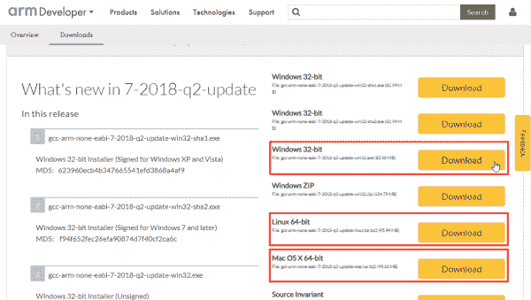](https://cdn.sparkfun.com/assets/learn_tutorials/8/3/3/armgcc-download-click.png)*Having a hard time seeing? Click the image for a closer look.*

**Windows** 用户可以通过安装向导运行。默认情况下，ARM GNU 工具会安装在类似“C:\ Program Files(x86)\ GNU Tools ARM Embedded \ 7 2018-Q2-update”的目录下(最后一位会因工具版本不同而有所不同)。

[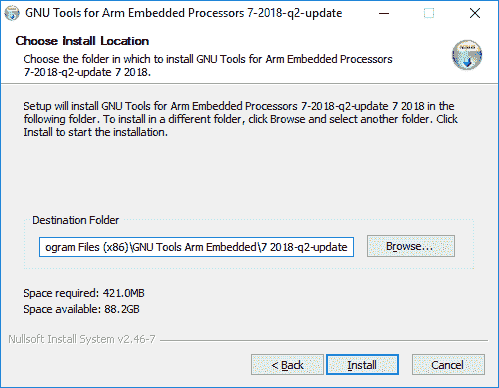](https://cdn.sparkfun.com/assets/learn_tutorials/8/3/3/arm-gcc-install-windows.png)

**Mac 和 Linux** 用户需要下载 ARM GNU 工具并解压到你电脑上的一个首选位置，例如`${HOME}/opt`。

### SWD 编程工具- nRF5x 命令行工具

**Note:** Broken Links

看来北欧的联系已经改变了。为了在 Nordic 网站上找到更多的资源，用户可以尝试查看 Nordic DevZone。

*   安装 nRF5x 命令行工具(链接):

*   [开始使用 nRF5 SDK 和 Keil >设置您的工具链*(仍包括断开的链接)*](https://infocenter.nordicsemi.com/index.jsp?topic=%2Fug_gsg_keil%2FUG%2Fgsg%2Finstall_nrf_command_line_tools.html)

*   [文档(PDF)](http://infocenter.nordicsemi.com/pdf/getting_started_nRF5SDK_keil.pdf)

*   [nRF 工具> nRF 命令行工具*(点击**安装 nRF 命令行工具**链接)*](https://infocenter.nordicsemi.com/index.jsp?topic=%2Fug_nrf_cltools%2FUG%2Fcltools%2Fnrf_command_line_tools_lpage.html)

*   [文档(PDF)](https://infocenter.nordicsemi.com/pdf/nRF_Command_Line_Tools_v1.4.pdf)

*   [软件下载页面](https://www.nordicsemi.com/Software-and-Tools/Development-Tools/nRF-Command-Line-Tools/Download#infotabs)
*   [nRF5x 信息页面](https://infocenter.nordicsemi.com/index.jsp?topic=%2Fstruct_nrf5gs%2Fstruct%2Fnrf5gs.html&cp=1)

为了上传新的编译过的应用到你的 nRF52840，你需要安装一些北欧命令行工具，包括 **nrfjprog** 。

要下载这些工具，请访问 Nordic 信息中心的[安装 nRF5x 命令行工具](https://www.nordicsemi.com/DocLib/Content/User_Guides/gsg_keil/latest/UG/gsg/install_nrf5x_cltools)页面。

该软件适用于 [Windows、32 位 Linux、64 位 Linux 和 macOS](https://www.nordicsemi.com/Software-and-Tools/Development-Tools/nRF5-Command-Line-Tools) 。从页面底部的下拉菜单中选择您喜欢的口味。

在 Windows 上，运行安装程序并按照向导中的说明进行操作。在 Linux 和 Mac 上，提取*。tar* 文件——您可能需要将 Nordic tools 目录添加到您的`$PATH`环境变量中。

### DFU 引导装载工具

Nordic 的 nrftuil 是一个基于 Python 的工具，用于打包设备固件更新(DFU ),并通过串行或蓝牙用该包更新 nRF 芯片。 [adafruit-nrfutil](https://github.com/adafruit/Adafruit_nRF52_nrfutil) 源自 Nordic 的原版软件。它将 nrfutil 更新为基于 Python 3，并为各种配备了 nRF52 引导程序的主板提供 DFU 支持。

adafruit-nrfutil 用于使用**串行引导程序**更新 nRF52840 上的代码。

要安装 adafruit-nrfutil，首先需要[下载并安装 Python 3](https://www.python.org/downloads/) 。(如果你安装了 Python 2.7，你仍然需要 Python 3 来安装 adafruit-nrfutil。)

一旦安装了 Python 3，安装 adafruit-nrfutil 最简单的方法就是使用 [PyPI](https://github.com/adafruit/Adafruit_nRF52_nrfutil#installing-from-pypi) :

```
language:python
pip3 install --user adafruit-nrfutil 
```

如果您使用不同的方法安装 adafruit-nrfutil，不要忘记**将 adafruit-nrfutil 添加到您的 PATH 环境变量**！

## 设置 nRF5 SDK

Nordic 的 nRF5 SDK 是构建 nRF52840 应用程序所需的组件驱动程序、库和工具的完整集合。该包中包含的文件为大多数 nRF5 项目和产品提供了基础。

### 下载/提取 SDK

**从 [Nordic 的 nRF5 SDK 产品页面](https://www.nordicsemi.com/eng/Products/Bluetooth-low-energy/nRF5-SDK)下载最新的 nRF5 SDK** 。在撰写本教程时，最新版本是 15.2。

SDK 被打包成一个 ZIP 文件。将 ZIP 文件的内容解压到计算机上的一个目标位置。作为一个 Windows 示例，我们将使用 C:\nRF5。您提取的目录应该如下所示:

[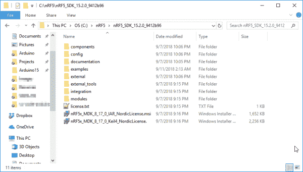](https://cdn.sparkfun.com/assets/learn_tutorials/8/3/3/nrf5-sdk-install-location.png)

### 配置您的工具链

一旦您提取了 SDK，您将需要配置它指向您刚刚安装的 gcc 工具链。

导航到 Nordic SDK，然后是**组件/工具链/gcc** 。在这个目录中，您会发现三个 Makefiles，其中一个需要修改以指向您的 GNU 构建工具。您修改的文件取决于您的操作系统:

*   **Windows**:makefile . Windows
*   **Mac 和 Linux** : Makefile.posix

这两个文件看起来非常相似。他们都在寻找 GNU 工具安装的目录位置、版本和前缀。修改`GNU_INSTALL_ROOT`和`GNU_VERSION`的值，以匹配 ARM GNU 工具目录和您刚刚安装的版本。

例如，下面是我在 Windows 机器上修改后的文件:

```
GNU_INSTALL_ROOT := C:/Program Files (x86)/GNU Tools ARM Embedded/7 2018-q2-update/bin/
GNU_VERSION := 7.3.1
GNU_PREFIX := arm-none-eabi 
```

要获得这个版本，你可以使用你的终端或者 CMD 导航到你的 GNU ARM 工具安装的“bin”文件夹，然后输入:`arm-none-eabi-gcc --version`。

[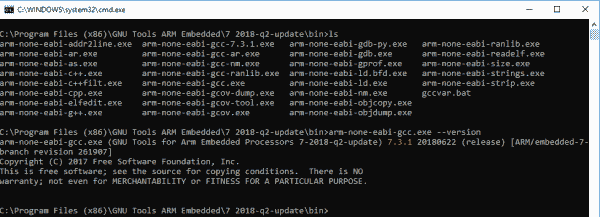](https://cdn.sparkfun.com/assets/learn_tutorials/8/3/3/armgcc-version.png)*Having a hard time seeing? Click the image for a closer look.*

比如上图，我们的版本是 7.3.1。

### 添加纸板文件

Nordic SDK 支持多种北欧开发板，但不支持 SparkFun nRF52840 Mini Breakout。为了增加支持，我们需要首先向 nRF5 SDK 的 **components/boards** 目录添加一个板定义文件。

板支持文件包括按钮、led 和通用串行引脚(UART、SPI 和 I ² C)的定义。我们的板卡定义文件可以在 [nRF52840 GitHub 库](https://github.com/sparkfun/nRF52840_Breakout_MDBT50Q/blob/master/Firmware/nRF5_SDK/components/boards/sparkfun_nrf52840_mini.h)中找到。下载文件(点击“原始”链接，并另存为..)，或者单击下面的链接:

[Download sparkfun_nrf52840_mini.h](https://github.com/sparkfun/nRF52840_Breakout_MDBT50Q/raw/master/Firmware/nRF5_SDK/components/boards/sparkfun_nrf52840_mini.h)

将该文件放在 components/boards 目录中。

您还需要**修改组件/板/板。h** ，在`#elif defined(BOARD_CUSTOM)`之前添加以下内容:

```
language:c
#elif defined (BOARD_SPARKFUN_NRF52840_MINI)
  #include "sparkfun_nrf52840_mini.h" 
```

[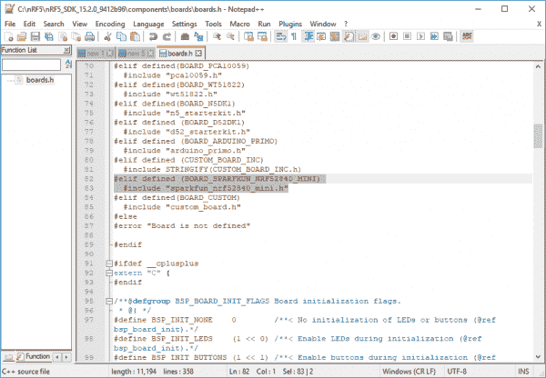](https://cdn.sparkfun.com/assets/learn_tutorials/8/3/3/nrf5-sdk-boards-mod.png)*Having a hard time seeing? Click the image for a closer look.*

这将允许我们在编译示例代码时添加一个`BOARD_SPARKFUN_NRF52840_MINI`定义，以便在编译时引入 *sparkfun_nrf52840_mini.h* 。

## 设置 VS 代码环境

在深入构建 nRF52840 的示例和应用之前，围绕 nRF5 SDK 建立一个开发环境可能是个好主意。IDE 可以帮助您浏览代码库，并通过控制台轻松地与之交互。

本教程将解释如何建立一个 Visual Studio (VS)代码环境。这些内容中的大部分应该可以移植到在 IDE 或编辑器(如 Eclipse、Notepad++或 Sublime，如果您喜欢其他工具的话)中设置类似的环境。

### 在 VS 代码中打开文件夹

打开一个新的 VS 代码窗口，然后导航到**文件** > **打开文件夹...**。在打开的浏览器提示符中，导航到您的 nRF5 SDK，然后找到**示例** / **外设** / **blinky** 。

[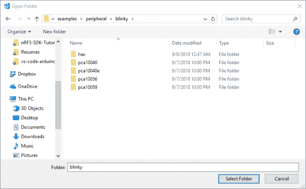](https://cdn.sparkfun.com/assets/learn_tutorials/8/3/3/vs-code-open.png)

“blinky”示例只是闪烁开发板上的 LED 这是验证工具链设置是否正确的好方法。

### 设置 *c_cpp_properties.json*

打开文件夹后，您应该会在窗口的左侧看到一个文件浏览器。**双击 main.c** 打开主源文件。

[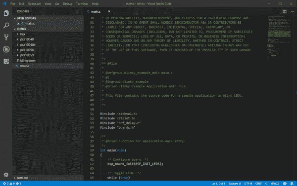](https://cdn.sparkfun.com/assets/learn_tutorials/8/3/3/vs-code-main.c.png)*Having a hard time seeing the code? Click the image for a closer look.*

IDE 的 like VS 代码的一个最强大的特性是能够回溯到`#include`来提供函数或常量的定义。为了帮助 IDE 导航这些文件，您应该在*中定义一个名为 *c_cpp_properties.json* 的文件。blinky 示例中的 vscode* 目录。通过按 CTRL+SHIFT+P，然后开始键入 **c/cpp:编辑配置**，可以自动创建该文件。

[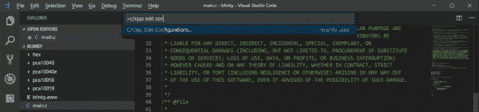](https://cdn.sparkfun.com/assets/learn_tutorials/8/3/3/vs-code-c_cpp_open.png)*Having a hard time seeing the code? Click the image for a closer look.*

您的 *c_cpp_properties.json* 文件应该会自动创建。此文件包含包含文件和宏定义的路径，这些文件和宏定义可能会改变源文件的编译。这里有一个例子，你可以根据你的文件。您可能需要更改`nrfSDK`的路径，以便它与您的 nRF5 SDK 的根路径相匹配。

```
language:json
{
    "env": {
        "nrfSDK": "C:\\nRF5\\nRF5_SDK_15.2.0_9412b96"
    },

    "configurations": [
        {
            "name": "ARMGCC",
            "includePath": [
                "${workspaceFolder}/**",
                "${nrfSDK}/components/**",
                "${nrfSDK}/components",
                "${nrfSDK}/components/libraries/experimental_memobj",
                "${nrfSDK}/components/libraries/experimental_section_vars",
                "${nrfSDK}/modules/nrfx/mdk",
                "${nrfSDK}/modules/nrfx/hal",
                "${nrfSDK}/components/libraries/balloc",
                "${nrfSDK}/components/libraries/experimental_log",
                "${nrfSDK}/components/libraries/experimental_log/src",
                "${nrfSDK}/components/libraries/delay",
                "${nrfSDK}/integration/nrfx",
                "${nrfSDK}/components/libraries/bsp",
                "${nrfSDK}/components/drivers_nrf/nrf_soc_nosd",
                "${nrfSDK}/components/libraries/strerror",
                "${nrfSDK}/components/boards",
                "${nrfSDK}/components/toolchain/cmsis/include",
                "${nrfSDK}/modules/nrfx",
                "${nrfSDK}/components/libraries/util",
                "${nrfSDK}/components/libraries/fifo",
                "${nrfSDK}/components/libraries/uart",
                "${nrfSDK}/integration/nrfx/legacy",
                "${nrfSDK}/components/libraries/delay",
                "${nrfSDK}/modules/nrfx/drivers/include",
                "${workspaceFolder}/sparkfun/blank/config",
                "${workspaceFolder}/sparkfun/blank"
            ],
            "defines": [
                "_DEBUG",
                "UNICODE",
                "_UNICODE",
                "BOARD_SPARKFUN_NRF52840_MINI",
                "BSP_DEFINES_ONLY",
                "CONFIG_GPIO_AS_PINRESET",
                "FLOAT_ABI_HARD",
                "NRF52840_XXAA",
                "DCONFIG_NFCT_PINS_AS_GPIOS"
            ],
            "compilerPath": "C:\\Program Files (x86)\\GNU Tools ARM Embedded\\7 2018-q2-update\\bin\\arm-none-eabi-gcc.exe",
            "cStandard": "c11",
            "cppStandard": "c++17",
            "intelliSenseMode": "clang-x64"
        }
    ],
    "version": 4
} 
```

如果一切解析正确，您应该能够右键单击任何`#include`、函数或常量定义，并选择“Go to Definition (F12)”来导航到声明该段代码的源文件。

[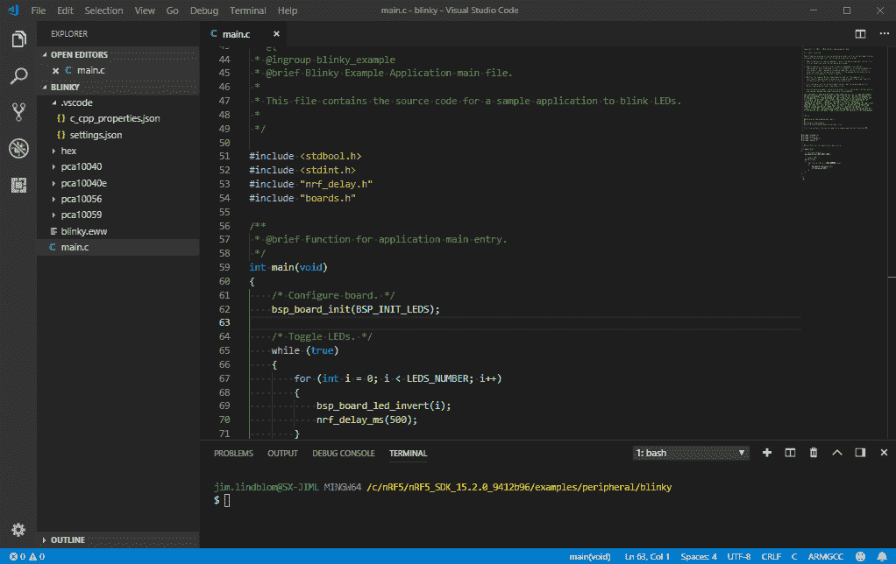](https://cdn.sparkfun.com/assets/learn_tutorials/8/3/3/vs-code-go-to-definition.gif)*Having a hard time seeing the code? Click the image for a closer look.*

这是一个超级强大的工具，尤其是如果您刚刚开始熟悉 nRF5 SDK 及其提供的 API。

## 为 SparkFun nRF52840 Mini Breakout 打造 Blinky

在你可以编译并上传 Blinky 草图到你的 SparkFun nRF52840 Mini Breakout 之前，还有最后一点设置要做。我们需要修改 **Makefile** ,以便它为我们的板构建，并且我们需要确保，当代码被链接时，它不会试图覆盖内存中的软设备或引导加载程序的主目录。

**Get Used to It**

您在 nRF5 中测试的每个示例都需要进行这些修改。放心吧！当您继续在 SDK 中测试示例时，您将会进入一种节奏。 

### 添加 SparkFun_nRF52840_Mini 目标

标准“blinky”示例包括 Nordic nRF52832 (pca10040)和 nRF52840 (pca10056)开发套件的构建选项。我们想为 SparkFun nRF52840 迷你突破增加一个构建选项。最简单的方法是**复制 pca10056 文件夹**，并将其重命名为类似于 **sparkfun_nrf52840_mini** 的名称。

[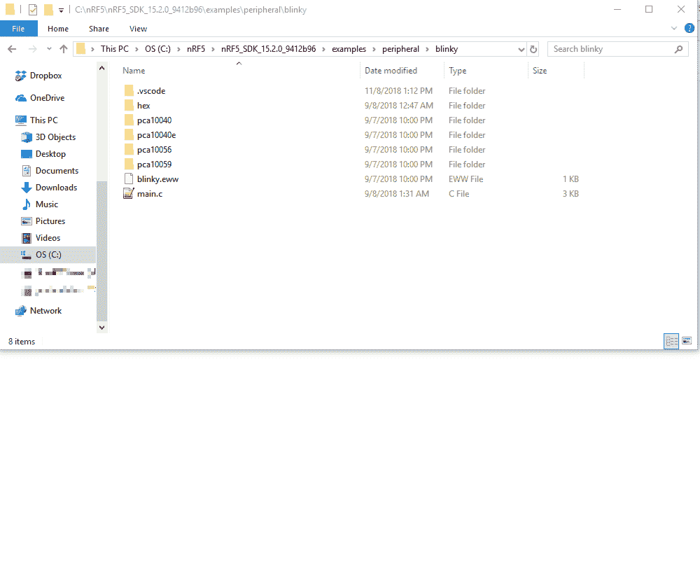](https://cdn.sparkfun.com/assets/learn_tutorials/8/3/3/building-blinky-copy-sparkfun.gif)

一旦你将 pca10056 复制到 sparkfun_nrf52840_mini，点击进入你的新文件夹，然后点击进入**空白**和 **armgcc** 文件夹。然后**打开 Makefile** 。

我们需要对这个文件做的最明显的改变是**板定义**。查找`-DBOARD_PCA10056`的`CFLAGS`和`ASMFLAGS`定义，修改为`-DBOARD_SPARKFUN_NRF52840_MINI`:

```
language:c
CFLAGS += -DBOARD_SPARKFUN_NRF52840_MINI 
```

和

```
language:c
ASMFLAGS += -DBOARD_SPARKFUN_NRF52840_MINI 
```

(确保删除任何`... += -DBOARD_PCA1056`或类似行，以确保 Nordic nRF52840 开发套件未启用。)

### 添加 DFU 编程目标

我们还可以使用这个 makefile 调用 adafruit-nrfutil，并通过串行 DFU 加载代码。为此，请将以下目标添加到 Makefile 的末尾:

```
language:c
dfu-package: $(OUTPUT_DIRECTORY)/nrf52840_xxaa.hex
    @echo Packaging $<
    adafruit-nrfutil dfu genpkg --sd-req 0xFFFE --dev-type 0x0052 --application $<  _build/dfu-package.zip

bootload: $(OUTPUT_DIRECTORY)/nrf52840_xxaa.hex dfu-package
    @echo Flashing: $<
    adafruit-nrfutil --verbose dfu serial --package _build/dfu-package.zip -p $(SERIAL_PORT) -b 115200 --singlebank --touch 1200 
```

**Tab and Space Pains**

复制上面的文本可能会粘贴四个空格而不是制表符。如果您得到如下编译错误:

`Makefile:305: *** missing separator. Stop.`

用实际的制表符替换四个缩进行之前的四个空格。 

这两个目标提供了对 nrfutil 的 DFU 打包和上传特性的简单命令行访问。

### 修改链接器脚本的内存组织

你需要做的最后一个大改变是记忆组织。这个例子不知道我们有一个引导加载程序，它位于闪存中的地址 0x00。

打开 **blinky_gcc_nrf52.ld** 。然后用下面的内存来源/长度组合替换链接器脚本的`MEMORY`部分:

```
language:c
MEMORY
{
  FLASH (rx) : ORIGIN = 0x26000, LENGTH = 0xce000
  RAM (rwx) :  ORIGIN = 0x20000000, LENGTH = 0x40000
} 
```

这会将闪存原点从 0x0 移动到 0x26000，并相应地限制可用空间。(还是近 1MB - 892kB -来玩！)

#### SparkFun Pro nRF52840 迷你闪存地图

随着您对 nRF52840 开发的深入研究，了解一点闪存的映射方式可能会有所帮助。这里有一个快速纲要:

| 描述 | 起始地址 | 结束地址 | 大小(KB) |
| 引导程序设置 | 0x000FF000 | 0x000FFFFF | four |
| 主引导记录参数 | 0x000FE000 | 0x000FEFFF | four |
| 引导装载程序 | 0x000F4000 | 0x 000000 fffff | Forty |
| 应用代码 | 0x00026000 | 0x000F3FFF | Eight hundred and twenty-four |
| 软设备 | 0x00001000 | 0x00025FFF | One hundred and forty-eight |
| 主引导记录 | 0x00000000 | 0x00000FFF | four |

欲了解更多关于 nRF52840 的 S140 存储器映射的信息，请查看 [Nordic 的 S140 存储器资源映射和使用文档](https://www.nordicsemi.com/DocLib/Content/SoftDevice_Spec/s132/latest/SDS/s1xx/mem_usage/mem_resource_map_usage)。

### 构建示例

咻！就是这样。要编译代码，只需键入:

```
language:makefile
make 
```

或者，如果您想用一个 swift 命令进行构建和编程:

```
language:makefile
make bootload SERIAL_PORT=COM7 
```

确保你的 nRF52840 板处于[引导模式](https://learn.sparkfun.com/tutorials/sparkfun-pro-nrf52840-mini-hookup-guide#using-the-bootloader)(双击复位)。(还要确保将“COM7”替换为 nRF52840 的 DFU 串行端口。)

[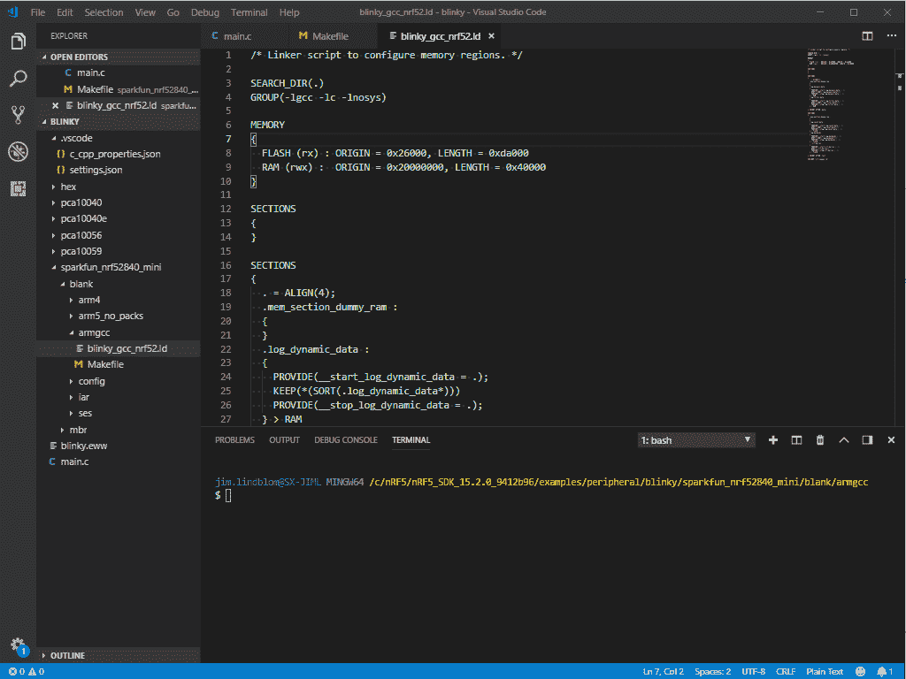](https://cdn.sparkfun.com/assets/learn_tutorials/8/3/3/building-blinky-with-modifications.gif)*Having a hard time seeing the code? Click the image for a closer look.*

## BLE·布林基的例子

闪烁的 LED 很好，但它几乎没有触及 nRF52840 功能的表面。我们在组合中加入一些蓝牙技术怎么样？

导航回 nRF5 SDK 的示例文件夹，找到**ble _ peripheral/ble _ app _ blinky**。打开它，就像你以前做的 blinky 的例子。

一旦打开，就像上一个例子一样，**复制 pca10056 文件夹**并将新文件夹重命名为 **sparkfun_nrf52840_mini** 。

而且，你猜对了，你需要修改“spark fun _ NRF 52840 _ mini/s140/arm gcc”中的“Makefile”和“blinky_gcc_nrf52.ld”文件来添加一个“bootload”目标，并修改 Flash 的原点/大小。在链接器中，“ld”文件只修改`FLASH`的大小，不去管`RAM`。

我推荐的最后一个修改是对目录顶部的 **main.c** 文件。这是管理所有配置和初始化的主源文件。在文件的顶部——从第 72 行开始——是 LED 管脚定义。我建议将每个`LED`定义设置为`BSP_BOARD_LED_0`。如果愿意，您还可以设置 BLE 设备名称。该部分最终看起来会像这样:

```
language:c
#define ADVERTISING_LED                 BSP_BOARD_LED_0                         /**< Is on when device is advertising. */
#define CONNECTED_LED                   BSP_BOARD_LED_0                         /**< Is on when device has connected. */
#define LEDBUTTON_LED                   BSP_BOARD_LED_0                         /**< LED to be toggled with the help of the LED Button Service. */
#define LEDBUTTON_BUTTON                BSP_BUTTON_0                            /**< Button that will trigger the notification event with the LED Button Service */

#define DEVICE_NAME                     "SparkFun_nRF52840"                         /**< Name of device. Will be included in the advertising data. */ 
```

将每个 LED 设置为`BSP_BOARD_LED_0`有点滥用代码，但我们尽可能使用单个板载 LED。它允许我们判断电路板是否连接，并从应用程序切换 LED。

说到应用程序...

### 使用 nRF 连接控制电路板

为了测试这个示例草图，您需要将另一个设备(计算机或智能手机)连接到 nRF52840。Nordic 提供了一个免费的、方便的测试工具， [nRF Connect for Mobile](https://www.nordicsemi.com/eng/Products/Nordic-mobile-Apps/nRF-Connect-for-Mobile) ，适用于 Android 或 iOS。我们将使用这张草图演示如何控制 nRF52840 的 LED 并监控按钮。所以快去下载 app 吧！

[nRF Connect for Android](https://play.google.com/store/apps/details?id=no.nordicsemi.android.mcp) [nRF Connect for iOS](https://itunes.apple.com/us/app/nrf-connect/id1054362403?ls=1&mt=8)

下载后，打开应用程序，开始搜索附近的蓝牙设备。信号强度强的，你应该看到 **SparkFun_nRF52840** 。点击旁边的“连接”按钮。

[](https://cdn.sparkfun.com/assets/learn_tutorials/8/4/2/nrf-connect-board-connect.JPG)

连接后，蓝色 LED 应熄灭，表示已连接。

点击 **LED 按钮服务**，你会看到一对特征:“北欧 Blinky 按钮”和“北欧 Blinky LED”

要设置 LED，单击 Nordic Blinky LED 特性中的向上箭头。要打开 LED，在值文本框中输入 **01** 。要关闭它，输入 **00** (注意双零)。

[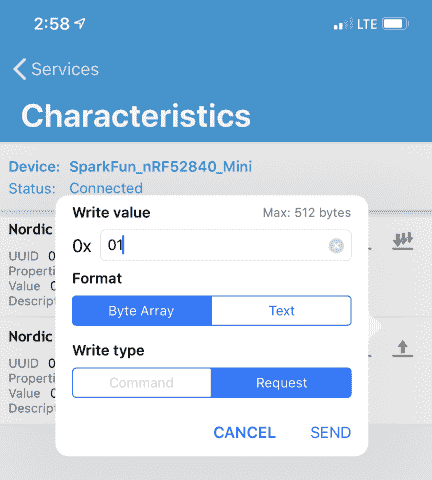](https://cdn.sparkfun.com/assets/learn_tutorials/8/3/3/nrfConnect-setLED.jpeg)

要读取引脚 13 上按钮的状态，可点击单向下箭头进行单次读取，或点击三向下箭头订阅通知。当您按下按钮时，该值应该变为 0x01。

## SDK 提示和技巧

### 配置 sdk_config

从上一个例子中，我谅你也不敢偷看 spark fun _ NRF 52840 _ mini/config/SDK _ config . h 的内容，迎接你的将是一个满是`#define`宏的 13k 行头。

sdk_config.h 中的每一个`#defines`都会或多或少地改变应用程序的性能。这是一个强大的文件，但它势不可挡。如果你已经安装了 [Java](https://www.java.com/en/download/) ，你可以输入:

```
language:makefile
make sdk_config 
```

打开 CMSIS 配置向导。此窗口允许您浏览已排序的配置宏列表，并以图形方式进行更改。

[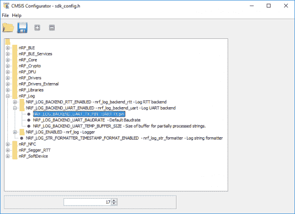](https://cdn.sparkfun.com/assets/learn_tutorials/8/3/3/cmsis-config.png)

如果您没有 Java，请查看下一节关于后端日志的内容...

#### 后端日志记录

遗憾的是，大多数应用程序示例都没有将任何内容记录到 USB 串行端口。但是！大多数例子都支持基于 UART 的日志记录，但是您必须启用它。

在您的配置文件中搜索`NRF_LOG_BACKEND_UART_ENABLED`。将其设置为`1`，然后将`NRF_LOG_BACKEND_UART_TX_PIN`设置为`17`(或任何其他您想用作 TX 的引脚)。

现在，如果您将一个[串行 Basic](https://www.sparkfun.com/products/14050) 或类似的 USB 转串行板从 Basic 上的 RX 连接到 nRF52840 上的引脚 17，您应该会开始得到调试打印结果。

[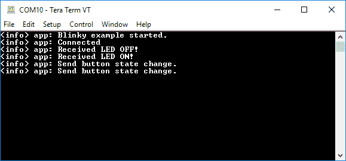](https://cdn.sparkfun.com/assets/learn_tutorials/8/3/3/backend-logging-uart.png)

不幸的是，目前还不支持 USB CDC(串行 USB)日志记录。

### 将引脚 9 和 10 作为 GPIO 使能

默认情况下，电路板底部的引脚 9 和 10 仅用作 NFC 引脚。您可以通过在 Makefile 中添加以下定义来更改这一点:

```
language:makefile
ASMFLAGS += -DCONFIG_NFCT_PINS_AS_GPIOS
CFLAGS += -DCONFIG_NFCT_PINS_AS_GPIOS 
```

#### 链接器脚本的内存组织

我们已经意识到，在 been 布林基的例子中，内存区域的配置可能存在问题。关于这个问题的更多细节，用户可以查看论坛帖子。如果其他用户也遇到问题，他们可以尝试这种配置(**尚未测试或验证**):

**Note:** Unfortunately, with the COVID-19 restrictions this has not been tested or verified by our team.

```
MEMORY
{
  FLASH (rx) : ORIGIN = 0x26000, LENGTH = 0xda000
  RAM (rwx) :  ORIGIN = 0x200022e0, LENGTH = 0x3dd20
} 
```

#### 系统路径

用户在尝试运行`make`时可能会遇到文件路径问题。确保您与`Makefile`在同一个目录中，如下图所示。此外，用户可能需要[为 Windows 10](https://www.architectryan.com/2018/03/17/add-to-the-path-on-windows-10/) 添加系统路径。

[](https://cdn.sparkfun.com/assets/learn_tutorials/8/3/3/building-blinky-with-modifications.gif)*Notice the file path in the left hand column and terminal.*

## 资源和更进一步

教程资源:

*   [adafruit-nrfutil GitHub](https://github.com/adafruit/Adafruit_nRF52_nrfutil)
*   [Arm GNU 下载页面](https://developer.arm.com/open-source/gnu-toolchain/gnu-rm/downloads)
*   [Python 3](https://www.python.org/downloads/)

*   nRF 资源:

    *   [北欧的 nRF5 SDK 产品页面](https://www.nordicsemi.com/eng/Products/Bluetooth-low-energy/nRF5-SDK)
    *   [sparkfun_nrf52840_mini.h](https://github.com/sparkfun/nRF52840_Breakout_MDBT50Q/blob/master/Firmware/nRF5_SDK/components/boards/sparkfun_nrf52840_mini.h)
    *   [nRF 连接手机](https://www.nordicsemi.com/eng/Products/Nordic-mobile-Apps/nRF-Connect-for-Mobile)
    *   [面向 Android 的 nRF Connect】](https://play.google.com/store/apps/details?id=no.nordicsemi.android.mcp)
    *   [iOS 的 nRF 连接](https://itunes.apple.com/us/app/nrf-connect/id1054362403?ls=1&mt=8)
    *   [nRF5x 命令行工具](https://www.nordicsemi.com/DocLib/Content/User_Guides/gsg_keil/latest/UG/gsg/install_nrf5x_cltools)

寻找更多 nRF52840 nRF5 SDK 开发技巧？以下是我们在网络上最喜欢的一些资源:

*   nRF5 SDK 文档中心 - Nordic 在记录(和组织记录)他们的 SDK API、示例和库方面做得很好。
*   [Nordic 关于在 **SEGGER Embedded Studio**](https://www.youtube.com/watch?list=PLx_tBuQ_KSqGHmzdEL2GWEOeix-S5rgTV&v=YZouRE_Ol8g) 中建立开发环境的视频系列——一个关于建立替代开发环境的很棒的视频系列。
*   [Nordic 使用 GCC 和 Eclipse](https://devzone.nordicsemi.com/tutorials/b/getting-started/posts/development-with-gcc-and-eclipse) 的(旧)开发——这是一个老掉牙的东西，主要是为 nRF52832 编写的，但是这里仍然有很多关于设置 GCC 环境的有用信息。

如需更多教程、更多学习内容和更多项目灵感，请查看以下相关教程:

[](https://learn.sparkfun.com/tutorials/interactive-hanging-led-array) [### 交互式悬挂 LED 阵列](https://learn.sparkfun.com/tutorials/interactive-hanging-led-array) Learn how we converted 72 lightbulbs into an interactive LED array for our conference room.[Favorited Favorite](# "Add to favorites") 16[](https://learn.sparkfun.com/tutorials/nrf52832-breakout-board-hookup-guide) [### nRF52832 分线板连接指南](https://learn.sparkfun.com/tutorials/nrf52832-breakout-board-hookup-guide) How to hookup and program (in Arduino!) the nRF52832 Breakout -- a development board for Nordic's BLE/ANT/2.4GHz system on chip.[Favorited Favorite](# "Add to favorites") 6[](https://learn.sparkfun.com/tutorials/sparkfun-pro-nrf52840-mini-hookup-guide) [### SparkFun Pro nRF52840 迷你连接指南](https://learn.sparkfun.com/tutorials/sparkfun-pro-nrf52840-mini-hookup-guide) A hardware overview and hookup guide for the SparkFun Pro nRF52840 Mini -- a breakout for Nordic's impossibly cool Bluetooth/ARM Cortex M4 SoC.[Favorited Favorite](# "Add to favorites") 2[](https://learn.sparkfun.com/tutorials/nrf52840-development-with-arduino-and-circuitpython) [### 使用 Arduino 和 CircuitPython 开发 nRF52840](https://learn.sparkfun.com/tutorials/nrf52840-development-with-arduino-and-circuitpython) How to use Arduino or CircuitPython to develop applications for the nRF52840 Cortex-M4 Bluetooth SoC.[Favorited Favorite](# "Add to favorites") 4