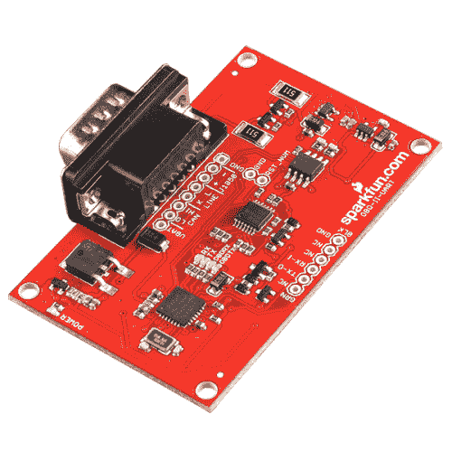

# OBD II UART 连接指南

> 原文：<https://learn.sparkfun.com/tutorials/obd-ii-uart-hookup-guide>

## 介绍

你遇到过臭名昭著的“检查发动机灯”吗？您是否希望自己能检查错误代码，而不必去找机械师？有了 [OBD-II UART](https://www.sparkfun.com/products/9555) ，你的愿望可以变成现实。OBD-II UART 允许您将汽车连接到计算机、嵌入式微控制器或单板计算机，如 [Raspberry Pi](https://www.sparkfun.com/products/11546) 或 [Beaglebone Black](https://www.sparkfun.com/products/12076) 。

 

将**添加到您的[购物车](https://www.sparkfun.com/cart)中！**

### [spark fun OBD-II UART](https://www.sparkfun.com/products/9555)

[In stock](https://learn.sparkfun.com/static/bubbles/ "in stock") WIG-09555

该板允许您与汽车的 OBD-II 总线接口。它提供了一个使用 ELM327 命令的串行接口…

$56.9512[Favorited Favorite](# "Add to favorites") 29[Wish List](# "Add to wish list")**** 

### [SparkFun 汽车诊断套件](https://www.sparkfun.com/products/retired/10769)

[Retired](https://learn.sparkfun.com/static/bubbles/ "Retired") RTL-10769

你的“检查引擎灯”在你的车里打开了吗，你不知道可能是哪里出了问题？我们明白，这是一种压力…

3 **Retired**[Favorited Favorite](# "Add to favorites") 35[Wish List](# "Add to wish list")** **本指南将向您展示:

*   OBD-II UART 包括什么硬件
*   OBD-II 命令的基础
*   如何通过 FTDI 直接与你的电脑连接
*   如何将它连接到 Arduino 并在 LCD 上显示信息

### 所需材料

为了跟随教程，您将需要以下部分。**