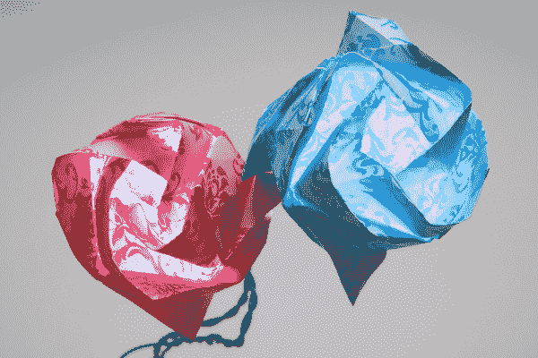

# 折纸电路

> 原文：<https://learn.sparkfun.com/tutorials/origami-paper-circuits>

## 入门指南

我们喜欢纸质电路！它们很有趣，也很容易教，而且你可以用很多不同的方法来制作纸电路。在本教程中，我们将向您展示如何将纸电路融入折纸。

### 所需材料

对于本教程，我们将使用折纸。也可以使用普通的纸，但要确保它可以折叠几次，弯曲时不会撕裂，而且要足够薄，光线可以透过它。

对于电子部件，我选择使用[铜带](https://www.sparkfun.com/products/10561)和 [LED 贴纸](https://www.sparkfun.com/products/13291)，但是你也可以很容易地使用普通 LED、[lily pad LED](https://www.sparkfun.com/products/10754)，或者任何数量的其他 LED 以及一些粘合剂和电阻。

对于连接，可用[裸导电漆](https://www.sparkfun.com/products/11521)、[电路纸条](https://www.sparkfun.com/products/13254)或普通电线代替铜带。我选择铜带和 LED 贴纸是因为它们已经具有粘性，它们与纸张配合良好，可以粘在我的折纸上，如果需要，我可以焊接到铜带上以实现更好的连接。选择组件时，请确保所有组件都能顺利配合工作。例如，裸露的导电涂料和电路划线笔墨水**不能在光滑的折纸上工作，所以如果你想使用它们，可以考虑使用不同种类的纸张。**

以下是我用来做折纸花的清单: