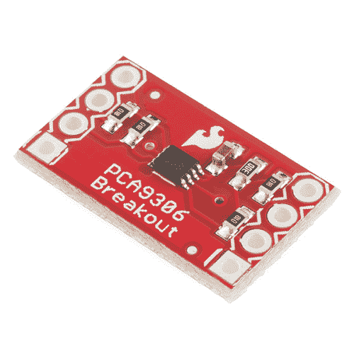
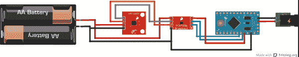

# PCA9306 电平转换器连接指南

> 原文：<https://learn.sparkfun.com/tutorials/pca9306-level-translator-hookup-guide>

## PCA9306 概述

**Heads up!** This is for the PCA9306 breakout v1\. If you are using the v2, you'll want to [head over to the other tutorial](https://learn.sparkfun.com/tutorials/pca9306-logic-level-translator-hookup-guide-v2). The package used on the PCA9306 breakout v2 is different from the PCA9306 breakout v1.

[PCA9306](https://www.sparkfun.com/products/11955) 是用于 I ² C 总线和 SMBus 的双路双向电压转换器。它在 1.0 到 5.0V 的电压范围内工作，并且不需要方向引脚来工作。

 

### [SparkFun 关卡翻译器分会场- PCA9306](https://www.sparkfun.com/products/retired/11955)

[Retired](https://learn.sparkfun.com/static/bubbles/ "Retired") BOB-11955

这是 PCA9306 双路双向电压电平转换器的分线板。因为不同的部分有时使用 d…

3 **Retired**[Favorited Favorite](# "Add to favorites") 12[Wish List](# "Add to wish list")*PCA9306 Breakout Board*

这是一个很好的电路板，用于在传感器和微控制器之间转换电压。

### 推荐阅读

这些电平转换器很容易上手，但如果你不熟悉逻辑电平转换，或者在此之前没有使用过 Arduino 板，你可能想看看下面的一些额外阅读材料。

 [### 如何焊接:通孔焊接](https://learn.sparkfun.com/tutorials/how-to-solder-through-hole-soldering) This tutorial covers everything you need to know about through-hole soldering.[Favorited Favorite](# "Add to favorites") 70 [### 什么是 Arduino？](https://learn.sparkfun.com/tutorials/what-is-an-arduino) What is this 'Arduino' thing anyway? This tutorials dives into what an Arduino is and along with Arduino projects and widgets.[Favorited Favorite](# "Add to favorites") 50 [### 逻辑电平](https://learn.sparkfun.com/tutorials/logic-levels) Learn the difference between 3.3V and 5V devices and logic levels.[Favorited Favorite](# "Add to favorites") 82 [### I2C](https://learn.sparkfun.com/tutorials/i2c) An introduction to I2C, one of the main embedded communications protocols in use today.[Favorited Favorite](# "Add to favorites") 128

## 硬件连接

分线板有七个引脚，需要连接才能正常工作。VREF1、SCL1 和 SDA1 都连接到较低电压部分。VREF2、SCL2 和 SDA2 连接到您的高压器件。GND 引脚需要连接到你的系统接地。板上标有 NC 的最后一个通孔不需要连接任何东西。

要连接电路板，将接头焊接到通孔中，并在器件之间使用跳线。或者，你可以把一些连接线焊接到你所有的电路板上。

对于这个例子，我们将使用一个 [Arduino Pro Mini 5V](https://www.sparkfun.com/products/11113) 连接到一个 [HMC5883L 磁力计分线板](https://www.sparkfun.com/products/10530)，它运行在 3.3V，并通过 I ² C 进行通信

### 连接:

HMC5883L → PCA9306

*   3.3V → VREF1
*   SCL → SCL1
*   SDA → SDA1
*   GND → GND

PCA9306 → Pro Mini (5V)

*   VREF2 → 5V
*   SCL2 → A5
*   SDA2 → A4

这是一个熔结图，显示了 HMC5883L、PCA9306 分线点和 Pro Mini 之间的实际连接。

*Fritzing diagram showing the connections between the three boards.*

该图显示 HMC5883L 使用 3V 电源，Pro Mini 使用 5V 筒式插孔连接器。请记住，您的电源可能与上图中的不同(例如，使用 LiPo 电池而不是 AA 电池)，但您仍然需要为系统的低压端提供一个电源，并为高压端提供一个单独的电源。

一旦你有了物理连接板，你就可以开始了！PCA9306 板不需要使用任何特殊代码，只需使用传感器可用的示例草图即可。在这种情况下，我们使用示例 [HMC5883.ino](http://sfecdn.s3.amazonaws.com/datasheets/Sensors/Magneto/HMC5883.pde) sketch。

## 资源和更进一步

现在你知道了如何使用逻辑电平转换器，是时候在你自己的项目中使用它了！如果您有任何问题，请查看下面的附加资源，或者给我们留下关于教程本身的反馈。祝你和你所有的传感器接口好运！

*   [PCA9306 数据手册](https://cdn.sparkfun.com/datasheets/BreakoutBoards/PCA9306.pdf)
*   [分线板示意图](https://cdn.sparkfun.com/assets/8/c/5/5/b/52702893757b7f86678b4569.pdf)
*   [分线板鹰文件](https://cdn.sparkfun.com/assets/4/4/d/7/2/52702893757b7fa9658b4567.zip)
*   [GitHub 库](https://github.com/sparkfun/PCA9306_Level_Translator_Breakout)

需要更多电平转换？！查看其他电平转换连接指南:

*   [逻辑电平转换器连接指南](https://learn.sparkfun.com/tutorials/retired---using-the-logic-level-converter)
*   [双向逻辑电平转换器连接指南](https://learn.sparkfun.com/tutorials/bi-directional-logic-level-converter-hookup-guide)

 [### 双向逻辑电平转换器连接指南](https://learn.sparkfun.com/tutorials/bi-directional-logic-level-converter-hookup-guide) An overview of the Bi-Directional Logic Level Converter, and some example circuits to show how it works.[Favorited Favorite](# "Add to favorites") 23