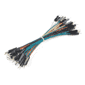
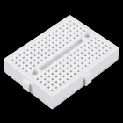

# PCA9306 逻辑电平转换器连接指南(v2)

> 原文：<https://learn.sparkfun.com/tutorials/pca9306-logic-level-translator-hookup-guide-v2>

## 介绍

**Heads up!** This is for the PCA9306 breakout v2\. If you are using the previous PCA9306, you'll want to [head over to the older tutorial](https://learn.sparkfun.com/tutorials/pca9306-level-translator-hookup-guide). The package used on the PCA9306 breakout v2 is different from the PCA9306 breakout v1.

[PCA9306](https://www.sparkfun.com/products/15439) 是用于 I ² C 总线和 SMBus 的双双向电压转换器。它在 1.2V 到 5.0V 的电压范围内工作，并且不需要方向引脚来工作。这是一个很好的电路板，用于在传感器和微控制器之间转换电压。

 

将**添加到您的[购物车](https://www.sparkfun.com/cart)中！**

### [SparkFun 关卡翻译器分会场- PCA9306](https://www.sparkfun.com/products/15439)

[In stock](https://learn.sparkfun.com/static/bubbles/ "in stock") BOB-15439

不同的部分有时使用不同的电压电平进行通信。这款 PCA9306 电平转换器是制作…

$4.951[Favorited Favorite](# "Add to favorites") 22[Wish List](# "Add to wish list")** **[https://www.youtube.com/embed/tENenr7sdoU/?autohide=1&border=0&wmode=opaque&enablejsapi=1](https://www.youtube.com/embed/tENenr7sdoU/?autohide=1&border=0&wmode=opaque&enablejsapi=1)

### 所需材料

要跟随本教程，您将需要以下材料。你可能不需要所有的东西，这取决于你拥有什么。将它添加到您的购物车，通读指南，并根据需要调整购物车。

 

将**添加到您的[购物车](https://www.sparkfun.com/cart)中！**

### [Arduino Uno - R3](https://www.sparkfun.com/products/11021)

[In stock](https://learn.sparkfun.com/static/bubbles/ "in stock") DEV-11021

这是新的 Arduino Uno R3。除了以前主板的所有功能外，Uno 现在使用 ATmega16U2 代替…

$27.95138[Favorited Favorite](# "Add to favorites") 162[Wish List](# "Add to wish list")**** 

将**添加到您的[购物车](https://www.sparkfun.com/cart)中！**

### [破开头球——直击](https://www.sparkfun.com/products/116)

[In stock](https://learn.sparkfun.com/static/bubbles/ "in stock") PRT-00116

一排标题-打破适应。40 个引脚，可切割成任何尺寸。用于定制 PCB 或通用定制接头。

$1.7520[Favorited Favorite](# "Add to favorites") 133[Wish List](# "Add to wish list")**** 

将**添加到您的[购物车](https://www.sparkfun.com/cart)中！**

### [USB 线 A 到 B - 6 脚](https://www.sparkfun.com/products/512)

[In stock](https://learn.sparkfun.com/static/bubbles/ "in stock") CAB-00512

这是标准的 USB 2.0 电缆。这是最常见的 A 到 B 公/公型外围电缆，就是通常的那种…

$4.501[Favorited Favorite](# "Add to favorites") 13[Wish List](# "Add to wish list")**** 

将**添加到您的[购物车](https://www.sparkfun.com/cart)中！**

### [跳线高级 4" M/M - 26 AWG (30 个装)](https://www.sparkfun.com/products/14284)

[In stock](https://learn.sparkfun.com/static/bubbles/ "in stock") PRT-14284

这些是 101 毫米长的 26AWG 跳线，两端都有公接头。使用这些从任何板上的任何母接头跳接…

$2.75[Favorited Favorite](# "Add to favorites") 13[Wish List](# "Add to wish list")**** 

将**添加到您的[购物车](https://www.sparkfun.com/cart)中！**

### [【试验板-迷你模块化(白色)](https://www.sparkfun.com/products/12043)

[In stock](https://learn.sparkfun.com/static/bubbles/ "in stock") PRT-12043

这个白色迷你试验板是你的小项目原型的好方法！有了 170 个并列点，就有足够的空间…

$4.50[Favorited Favorite](# "Add to favorites") 27[Wish List](# "Add to wish list")**** 

### [SparkFun 三轴加速度计突破- MMA8452Q](https://www.sparkfun.com/products/retired/12756)

[Retired](https://learn.sparkfun.com/static/bubbles/ "Retired") SEN-12756

这款分线板可以让您在项目中轻松使用微型 MMA8452Q 加速度计。MMA8452Q 是一款智能低功耗……

10 **Retired**[Favorited Favorite](# "Add to favorites") 21[Wish List](# "Add to wish list")********** **********### 工具

你需要一个烙铁、焊料和一般的焊接附件。

 

将**添加到您的[购物车](https://www.sparkfun.com/cart)中！**

### [【烙铁- 60W(可调温度)](https://www.sparkfun.com/products/14456)

[In stock](https://learn.sparkfun.com/static/bubbles/ "in stock") TOL-14456

当你不想倾家荡产，但又需要一个可靠的烙铁时，这个可调节温度的烙铁是一个很好的工具…

$16.5016[Favorited Favorite](# "Add to favorites") 43[Wish List](# "Add to wish list")**** 

将**添加到您的[购物车](https://www.sparkfun.com/cart)中！**

### [无铅焊料- 15 克管](https://www.sparkfun.com/products/9163)

[In stock](https://learn.sparkfun.com/static/bubbles/ "in stock") TOL-09163

这是你的无铅焊料的基本管，带有不干净的水溶性树脂芯。0.031 英寸规格，15 克

$3.954[Favorited Favorite](# "Add to favorites") 14[Wish List](# "Add to wish list")**** ****### 推荐阅读

这些电平转换器很容易上手，但如果你不熟悉逻辑电平转换，或者在此之前没有使用过 Arduino 板，你可能想看看下面的一些额外阅读材料。

 [### 如何焊接:通孔焊接](https://learn.sparkfun.com/tutorials/how-to-solder-through-hole-soldering) This tutorial covers everything you need to know about through-hole soldering.[Favorited Favorite](# "Add to favorites") 70 [### 什么是 Arduino？](https://learn.sparkfun.com/tutorials/what-is-an-arduino) What is this 'Arduino' thing anyway? This tutorials dives into what an Arduino is and along with Arduino projects and widgets.[Favorited Favorite](# "Add to favorites") 50 [### 逻辑电平](https://learn.sparkfun.com/tutorials/logic-levels) Learn the difference between 3.3V and 5V devices and logic levels.[Favorited Favorite](# "Add to favorites") 82 [### I2C](https://learn.sparkfun.com/tutorials/i2c) An introduction to I2C, one of the main embedded communications protocols in use today.[Favorited Favorite](# "Add to favorites") 128

## 硬件概述

### 电源和 I ² C 侧

分线板至少有七个引脚，需要连接才能正常工作。VREF1、SCL1 和 SDA1 都连接到您的低压侧。

VREF2、SCL2 和 SDA2 连接到您的高压侧。任一侧的一个 GND 引脚需要连接到系统的地。

板上标有 EN 的额外通孔是什么？它可以连接到一个 I/O 引脚，从高端切换 PC9306。您需要调整后面的跳线才能使用此功能。查看以下内容了解更多信息。

#### 允许的电压电平转换

对于目录中列出的大多数产品，通常你将在 **3.3V** 和 **5V** 之间转换电压。然而，PCA9306 的数据手册指出，如果需要，它可以用来转换较低的电压。以下是低端和高端可接受的电压。

| VREF1(即低端) | VREF2(即高端) |
| 1.2V | 1.8 伏、2.5 伏、3.3 伏、5 伏 |
| 1.8V | 2.5V、3.3V、5V |
| 2.5V | 3.3V，5V |
| 3.3V | 5V |

### 针织套衫

该板底部有一个跳线，用于开启和关闭 PCA9306。通过[切割走线](https://learn.sparkfun.com/tutorials/how-to-work-with-jumper-pads-and-pcb-traces)并在标有“开关”的焊盘上添加一个焊接跳线，您可以用微控制器切换逻辑电平转换器。

#### 启用功能

PCA9306 可以用作 I C *开关*。首先，如上所述，你要切断`ON`迹线并焊接`Switch`迹线。要使用该功能，您需要像往常一样将高端`VREF2`连接到您的高端电压，然后将`EN`(使能)引脚连接到数字引脚。现在，当您想要启用 I C 通信时，将线**拉高**。

## 硬件装配

要连接电路板，您需要将接头焊接到通孔中，并在制作原型时使用跳线连接设备。确保在焊接测试前将其放在试验板上。您需要确保 PCA9306 分线板两侧的接头以一定角度焊接，以便将其牢固地固定在试验板上。图像顶部显示的电路板显示了引脚如何偏移并以小角度焊接。图像底部显示的电路板显示引脚与电路板齐平。您需要确保像图片顶部所示的电路板一样焊接引脚。

**Heads up!** If you have issues with the bread not sitting flush with the breadboard, try reworking the board adding a blob of solder on the pins and carefully pushing the header outward on a solder mat. After angling the pins, make sure to remove the solder blob on the board and clean the solder joints.

你也可以只焊接一些连接线或添加一个 [protoshield](https://learn.sparkfun.com/tutorials/sparkfun-arduino-protoshield-hookup-guide) 来安全地将你的所有电路板连接在一起。

## 硬件连接

对于这个例子，我们将使用一个 [Arduino Uno](https://www.sparkfun.com/products/11113) 连接到一个 [MMA8452 加速度计分线板](https://www.sparkfun.com/products/10530)，它运行在 3.3V 并通过 I ² C 进行通信

| 3.3V 设备(即 MMA8452) | PCA9306(低端) | PCA9306(高端) | 5V 设备(即带 ATmega328P 的 Arduino Uno) |
| 3.3V | VREF1 |  | 3.3V |
|  |  | VREF2 | 5V |
| SCL | SCL1 | SCL2 | A5 号 |
| 国家药品监督管理局 | SDA1 | SDA2 | A4 号 |
| GND | GND | GND | GND |
|  |  | 在中 | 任何 I/O 引脚(如果跳线已调整) |

这是一个熔结图，显示了 MMA8452、PCA9306 分线点和 Arduino Uno 之间的实际连接。

您需要通过桶形插孔、VIN 或 USB 连接器为 Arduino 连接电源。在这种情况下，我们将简单地使用 USB 电缆的电源向高端提供 5V 电压。该图显示 MMA8452 在 Arduino Uno 的 3.3V 供电轨上运行。请记住，您的电源可能会有所不同，但您仍然需要为系统的低压端提供一个电源，并为高压端提供一个单独的电源。

一旦你有了物理连接板，你就可以开始了！PCA9306 板不需要使用任何特殊代码，只需使用传感器可用的示例草图即可。在这种情况下，我们使用连接指南中的示例 [MMA8452。前往教程，完成 Arduino 编程，开始使用加速度计！](https://learn.sparkfun.com/tutorials/mma8452q-accelerometer-breakout-hookup-guide)

 [### MMA8452Q 加速度计分线连接指南

#### 2014 年 6 月 11 日](https://learn.sparkfun.com/tutorials/mma8452q-accelerometer-breakout-hookup-guide) How to get started using the MMA8452Q 3-axis accelerometer -- a solid, digital, easy-to-use acceleration sensor.[Favorited Favorite](# "Add to favorites") 5

## 资源和更进一步

现在你知道了如何使用逻辑电平转换器，是时候在你自己的项目中使用它了！如果您有任何问题，请查看下面的附加资源，或者给我们留下关于教程本身的反馈。祝你和你所有的传感器接口好运！

*   [示意图(PDF)](https://cdn.sparkfun.com/assets/0/1/7/0/9/SparkFun_Level_Translator_PCA9306.pdf)
*   [老鹰文件(ZIP)](https://cdn.sparkfun.com/assets/c/6/3/8/d/PCA9306_Leval_Translator.zip)
*   [数据表(PDF)](https://cdn.sparkfun.com/assets/d/2/f/7/c/pca9306.pdf)
*   [GitHub 库](https://github.com/sparkfun/PCA9306_Level_Translator_Breakout/tree/v20)
*   [SFE 产品展示区](https://youtu.be/tENenr7sdoU)

想用 Arduino 改变不同传感器的逻辑电平吗？在为支持 qw IC 的产品转换 I ² C 设备的逻辑电平之前，尝试修改 qw IC 电缆。

 

将**添加到您的[购物车](https://www.sparkfun.com/cart)中！**

### [SparkFun RTK 测量套件](https://www.sparkfun.com/products/17370)

[In stock](https://learn.sparkfun.com/static/bubbles/ "in stock") GPS-17370

RTK Surveyor Kit 拥有使用 GNSS RTK 进行厘米级全球定位测量所需的一切。

$574.955[Favorited Favorite](# "Add to favorites") 7[Wish List](# "Add to wish list")**** 

### [SparkFun 烤面包机烤箱回流控制板](https://www.sparkfun.com/products/18007)

[Out of stock](https://learn.sparkfun.com/static/bubbles/ "out of stock") WIG-18007

专为 SparkFun 的[按菜单点菜](https://alc.sparkfun.com/)定制电路板设计器设计，烤面包机烤箱回流…

[Favorited Favorite](# "Add to favorites") 4[Wish List](# "Add to wish list") 

### [【spark fun GNSS-RTK 航位推算突破- ZED-F9K (Qwiic)](https://www.sparkfun.com/products/18719)

[Out of stock](https://learn.sparkfun.com/static/bubbles/ "out of stock") GPS-18719

SparkFun ZED-F9K GNSS Breakout 是一款高精度地理空间板，它利用了 u-blox 的汽车 Dead Reck…

[Favorited Favorite](# "Add to favorites") 6[Wish List](# "Add to wish list") 

将**添加到您的[购物车](https://www.sparkfun.com/cart)中！**

### [SparkFun Qwiic 迷你 ToF 成像仪-VL 53 l5 CX](https://www.sparkfun.com/products/19013)

[In stock](https://learn.sparkfun.com/static/bubbles/ "in stock") SEN-19013

SparkFun Qwiic 迷你 ToF 成像仪是围绕 ST Electronics 的 VL53L5CX 打造的；最先进的，飞行时间(ToF)，mu…

$25.501[Favorited Favorite](# "Add to favorites") 11[Wish List](# "Add to wish list")********************