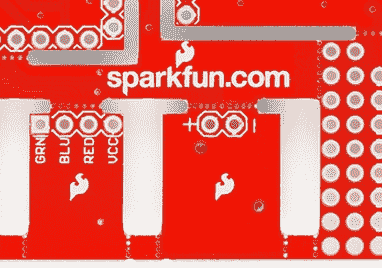
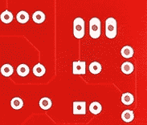

# PCB 基础知识

> 原文：<https://learn.sparkfun.com/tutorials/pcb-basics>

## 概观

电子学中的一个关键概念是印刷电路板或 PCB。它是如此的基本，以至于人们经常忘记解释 PCB *是什么*。本教程将详细介绍 PCB 的组成以及 PCB 领域的一些常用术语。

在接下来的几页中，我们将讨论印刷电路板的组成，涵盖一些术语，了解组装方法，并简要讨论创建新 PCB 背后的设计流程。

### 推荐阅读

在你开始之前，你可能想阅读一下我们在本教程中建立的一些概念:

*   [什么是电？](https://learn.sparkfun.com/tutorials/what-is-electricity)
*   [什么是电路？](https://learn.sparkfun.com/tutorials/what-is-a-circuit)
*   [电压、电流、电阻和欧姆定律](https://learn.sparkfun.com/tutorials/voltage-current-resistance-and-ohms-law)
*   [连接器基础知识](https://learn.sparkfun.com/tutorials/connector-basics)
*   [焊接 101 - PTH](https://learn.sparkfun.com/tutorials/how-to-solder-through-hole-soldering)
*   信号

* * *

### 翻译

明·tuấn 好心地把这篇教程翻译成了越南语。你可以在这里查看翻译[。](http://vidieukhien.net/threads/23/)

## 什么是 PCB？

印刷电路板是最常见的名称，但也可以称为“印刷线路板”或“印刷线路板”。在 PCB 出现之前，电路是通过费力的点对点布线过程构建的。当电线绝缘开始老化和破裂时，这导致电线连接处的频繁故障和短路。

->  
*感谢维基百科用户 wiki naut*<—

一个显著的进步是开发了[电线缠绕](http://en.wikipedia.org/wiki/Wire_wrap)，在每个连接点处，一根小规格的电线缠绕在一个柱子上，形成了一个高度耐用且易于更换的气密连接。

随着电子产品从真空管和继电器转向硅和集成电路，电子元件的尺寸和成本开始下降。电子产品在消费品中变得越来越普遍，降低电子产品尺寸和制造成本的压力驱使制造商寻找更好的解决方案。PCB 就这样诞生了。

PCB 是*印刷电路板*的缩写。它是一个有线和垫的板，将不同的点连接在一起。在上图中，有迹线将各种连接器和元件相互电连接。PCB 允许信号和电源在物理设备之间路由。焊料是在 PCB 表面和电子元件之间建立电连接的金属。作为金属，焊料也是一种强有力的机械粘合剂。

## 作文

PCB 有点像分层蛋糕或千层面-不同材料的交替层通过加热和粘合层压在一起，因此结果是一个单一的物体。

让我们从中间开始，一步一步来。

### FR4

基底材料通常是玻璃纤维。历史上，这种玻璃纤维最常见的代号是“FR4”。这种实心芯赋予 PCB 刚性和厚度。也有建立在柔性高温塑料(Kapton 或等效物)上的柔性 PCB。

你会发现许多不同厚度的印刷电路板；SparkFun 产品最常见的厚度为 1.6 毫米(0.063 英寸)。我们的一些产品——lily pad 板和 Arudino Pro 微型板——使用 0.8 毫米厚的板。

更便宜的 PCB 和 perf 板(如上所示)将由其他材料制成，如环氧树脂或酚醛树脂，它们缺乏 FR4 的耐用性，但价格便宜得多。当你焊接到这种类型的印刷电路板上时，你就会知道你在和它打交道——它们有一种非常难闻的气味。这些类型的基板通常也存在于低端消费电子产品中。酚醛塑料的热分解温度低，当烙铁在电路板上放置时间过长时，会导致它们分层、冒烟和烧焦。

### 铜

下一层是薄铜箔，通过加热和粘合将其层压到电路板上。在普通的双面 PCB 上，铜被施加到基板的两面。在低成本的电子设备中，PCB 可能只在一面有铜。当我们提到**双面**或**双层板**时，我们指的是千层面中的铜层数量(2)。这可以少至 1 层或多至 16 层或更多。

PCB with copper exposed, no solder mask or silkscreen.

铜的厚度可以变化，并由重量规定，单位为盎司每平方英尺。绝大多数多氯联苯每平方英尺有 1 盎司铜，但一些处理非常高功率的多氯联苯可能使用 2 或 3 盎司铜。每平方盎司相当于约 35 微米或千分之一英寸厚的铜。

### 焊接面具

铜箔上面的那层叫做阻焊层。这层赋予 PCB 绿色(或者在 SparkFun 是红色)。它覆盖在铜层上，以防止铜走线意外接触其他金属、焊料或导电位。这一层有助于用户焊接到正确的位置，并防止焊接跳线。

在下面的例子中，绿色阻焊膜应用于 PCB 的大部分，覆盖小走线，但露出银环和 SMD 焊盘，以便焊接。

阻焊膜通常是绿色的，但是几乎任何颜色都是可能的。我们几乎所有的 SparkFun 板都用红色，IOIO 板用白色，LilyPad 板用紫色。

### 用丝网印刷术印制

白色丝网层施加在阻焊层的顶部。丝网印刷在 PCB 上增加了字母、数字和符号，便于组装和指示，便于人们更好地理解电路板。我们经常使用丝印标签来表明每个引脚或 LED 的功能。

丝网印刷最常见的是白色，但任何油墨颜色都可以使用。黑色，灰色，红色，甚至黄色丝网印刷颜色广泛可用；然而，在一块板上看到一种以上的颜色是不常见的。

## 术语

现在你对 PCB 结构有了一个概念，让我们来定义一些你在处理 PCB 时可能会听到的术语:

*   **圆环**-PCB 电镀通孔周围的铜环。

 *Examples of annular rings.*

*   **DRC** -设计规则检查。对您的设计进行软件检查，以确保设计不包含错误，如不正确接触的迹线、太细的迹线或钻孔太小。
*   **钻孔命中** -设计上应该钻孔的地方，或实际上在板上钻孔的地方。由钝钻头引起的不准确钻孔是常见的制造问题。

*Not so accurate, but functional drill hits.*

*   **手指** -沿电路板边缘露出的金属垫，用于在两块电路板之间建立连接。常见的例子是沿着计算机扩展或内存板的边缘，以及老式的盒式视频游戏。
*   **老鼠咬痕**-v-score 的一种替代方法，用于分离电路板和面板。许多钻孔撞击紧密地聚集在一起，形成一个薄弱点，在该点处，板在事后很容易被破坏。参见 SparkFun Protosnap 板，了解一个很好的示例。

*Mouse bites on the [LilyPad ProtoSnap](https://www.sparkfun.com/products/11201) allow the PCB to be snapped apart easily.***Note:** Looking for more information about mousebites and how to integrate it in your designs? Try checking out the [blog post](https://www.sparkfun.com/news/4400) below!

 [### 为科学打破多氯联苯

April 5, 2022](https://www.sparkfun.com/news/4400 "April 5, 2022: Nick sets out to learn everything about "mouse bite" breakaway tabs!")[Favorited Favorite](# "Add to favorites") 2

*   **Pad** -电路板表面暴露的金属部分，元件焊接在其上。

 *PTH (plated through-hole) pads on the left, SMD (surface mount device) pads on the right.*

*   **面板** -由许多较小的电路板组成的较大的电路板，在使用前会被拆开。自动化电路板处理设备经常遇到较小电路板的问题，通过一次将几块电路板聚集在一起，该过程可以显著加快。
*   **锡膏模板** -覆盖在电路板上的薄金属(有时是塑料)模板，允许在组装过程中锡膏沉积在特定区域。

[https://www.youtube.com/embed/Cc0UDire1P4/?autohide=1&border=0&wmode=opaque&enablejsapi=1](https://www.youtube.com/embed/Cc0UDire1P4/?autohide=1&border=0&wmode=opaque&enablejsapi=1)

*Abe does a quick demonstration of how to line up a paste stencil and apply solder paste.*

*   **取放** -将元件放置在电路板上的机器或过程。

[https://www.youtube.com/embed/yI5I9Q7tf84/?autohide=1&border=0&wmode=opaque&enablejsapi=1](https://www.youtube.com/embed/yI5I9Q7tf84/?autohide=1&border=0&wmode=opaque&enablejsapi=1)

*Bob shows us the SparkFun MyData Pick and Place machine. It's pretty awesome.*

*   **平面** -电路板上连续铜块，由边界而不是路径定义。也通常称为“倒酒”。

*Various portions of the PCB that have no traces but has a ground pour instead.*

*   **电镀通孔** -电路板上的一个孔，有一个环形圈，一直电镀到电路板。可以是通孔元件的连接点、信号通过的通路或安装孔。

*A PTH resistor inserted into the [FabFM](http://www.sparkfun.com/products/11043) PCB, ready to be soldered. The legs of the resistor go through the holes. The plated holes can have traces connected to them on the front of the PCB and the rear of the PCB.*

*   **弹簧针** -用于测试或编程目的的临时连接的弹簧触点。

*The popular [pogo pin with pointed tip](https://www.sparkfun.com/products/9174). We use tons of these on our test beds.*

*   **回流** -熔化焊料，在焊盘和元件引线之间形成连接。
*   丝网印刷 -电路板上的字母、数字、符号和图像。通常只有一种颜色，分辨率通常相当低。

*Silkscreen identifying this LED as the power LED.*

*   **槽** -非圆形板上的任何孔。槽可以电镀，也可以不电镀。插槽有时会增加电路板的成本，因为它们需要额外的切割时间。

*Complex slots cut into the [ProtoSnap - Pro Mini](https://www.sparkfun.com/products/10889). There are also many mouse bites shown. **Note:** the corners of the slots cannot be made completely square because they are cut with a circular routing bit.*

*   **焊膏** -悬浮在凝胶介质中的小焊料球，借助于焊膏模板，在放置元件之前，被应用于 PCB 上的表面贴装焊盘。在回流期间，焊膏中的焊料熔化，在焊盘和元件之间产生电气和机械连接。

*Solder paste on a PCB shortly before the components are placed. Be sure to read about *paste stencil* above as well.*

*   **焊锡锅** -一种用于快速搬运带通孔元件的焊锡板的锅。通常含有少量熔化的焊料，电路板很快浸入其中，在所有裸露焊盘上留下焊点。
*   **阻焊膜** -覆盖在金属上的一层保护材料，用于防止短路、腐蚀和其他问题。通常是绿色，尽管其他颜色(火花红、Arduino 蓝或苹果黑)也是可能的。偶尔被称为“抵抗”。

*Solder mask covers up the signal traces but leaves the pads to solder to.*

*   **焊料跳线** -连接电路板上一个元件上两个相邻引脚的小块焊料。根据设计的不同，可以使用一根跳线将两个焊盘或引脚连接在一起。它还会导致不必要的短路。
*   **表面贴装** -允许元件简单地安装在电路板上的一种施工方法，不需要引线穿过电路板上的孔。这是目前使用的主要组装方法，可以快速轻松地组装电路板。
*   **散热** -用于将焊盘连接到平面的小走线。如果焊盘没有散热，就很难使焊盘达到足够高的温度来形成良好的焊点。散热不当的焊盘在您尝试焊接时会感觉“粘粘的”，并且需要异常长的时间来回流。

*On the left, a solder pad with two small traces (thermals) connecting the pin to the ground plane. On the right, a via with no thermals connecting it completely to the ground plane.*

*   **偷窃** -在电路板上没有平面或痕迹的区域留下的阴影、网格线或铜点。降低蚀刻的难度，因为去除不需要的铜所需的时间更少。
*   **迹线** -电路板上铜的连续路径。

-> *将**复位**垫连接到板上其他地方的小迹线。一条更大、更粗的迹线连接到 **5V** 电源引脚。*<—

*   **V 形刻痕** -穿过电路板的部分切口，允许电路板沿着一条线容易地折断。
*   **过孔** -电路板上的一个孔，用于将信号从一层传递到另一层。*帐篷状*过孔被阻焊膜覆盖，以保护它们不被焊接。连接连接器和元件的通孔通常是未被覆盖的，以便于焊接。

 *Front and back of the same PCB showing a tented via. This via brings the signal from the front side of the PCB, through the middle of the board, to the back side.*

*   **波峰焊** -一种焊接方法，用于带有通孔元件的电路板，电路板通过熔化焊料的驻波，焊料附着在暴露的焊盘和元件引线上。

## 自己设计！

你如何着手设计自己的 PCB？PCB 设计的来龙去脉太过深入，无法在此深入探讨，但如果您真的想开始，以下是一些建议:

1.  找一个 CAD 软件包:市场上有很多低成本或免费的 PCB 设计选择。选择套餐时需要考虑的事项:
    *   社区支持:有很多人使用这个包吗？使用它的人越多，你就越有可能找到带有你需要的部件的现成库。
    *   易用性:如果用起来很痛苦，你就不会。
    *   能力:一些程序对你的设计有限制——层数、元件数量、电路板尺寸等。他们中的大多数允许你花钱购买许可证来升级他们的能力。
    *   可移植性:一些免费程序不允许你出口或转换你的设计，将你锁定在一个供应商身上。也许这是为了方便和价格而付出的合理代价，也许不是。
2.  看看别人的版面，看看他们做了什么。开源硬件使这比以往任何时候都更容易。
3.  练习，练习，练习。
4.  保持低期望值。你的第一个电路板设计会有很多问题。你的第 20 版设计会少一些，但还是会有一些。你永远也摆脱不了他们。
5.  图表很重要。试图在没有良好原理图的情况下设计电路板是徒劳的。

最后，谈谈设计自己的电路板的效用。如果你计划在一个给定的项目中做一两个以上，设计电路板的回报是相当不错的——原板上的点对点布线电路是一个麻烦，而且它们往往不如专门设计的电路板坚固。如果你的设计很受欢迎，它也允许你出售你的设计。

## 资源和更进一步

## 有兴趣学习更多基础主题吗？

查看我们的 **[工程要点](https://www.sparkfun.com/engineering_essentials)** 页面，了解电气工程相关基础主题的完整列表。

带我去那里！

多氯联苯只是开始！从这里，我们建议您探索:

*   [焊接 101 - PTH](https://learn.sparkfun.com/tutorials/how-to-solder-through-hole-soldering)
*   [如何阅读原理图](https://learn.sparkfun.com/tutorials/how-to-read-a-schematic)
*   [如何安装和设置 Eagle PCB 软件](https://learn.sparkfun.com/tutorials/how-to-install-and-setup-eagle)
*   [如何布局 PTH PCBs:原理图](https://learn.sparkfun.com/tutorials/using-eagle-schematic)
*   [如何布局 PTH PCBs:板布局](https://learn.sparkfun.com/tutorials/using-eagle-board-layout)
*   [创建 SMD 封装](https://learn.sparkfun.com/tutorials/designing-pcbs-smd-footprints)
*   [制造 SMD 印刷电路板](http://learn.sparkfun.com/tutorials/designing-pcbs-advanced-smd)
*   [T:蚀刻自己的电路板](https://www.sparkfun.com/news/2116)
*   [电子组件](https://learn.sparkfun.com/tutorials/electronics-assembly)

如果你想与世界分享你的 PCB 作品，看看这些教程:

*   [使用 GitHub](https://learn.sparkfun.com/tutorials/using-github)
*   [使用 GitHub 与 SparkFun 分享](https://learn.sparkfun.com/tutorials/using-github-to-share-with-sparkfun)