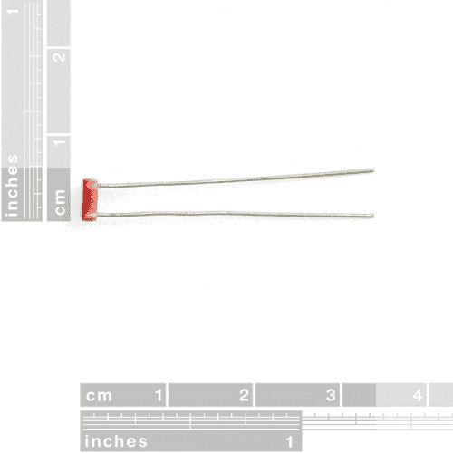
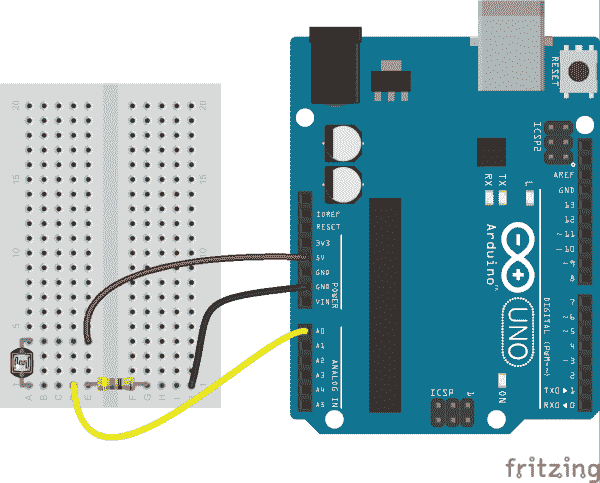
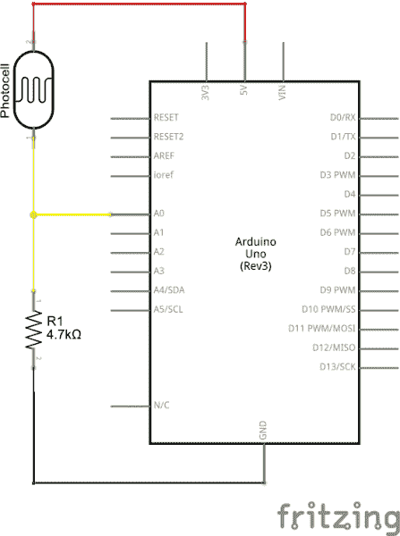
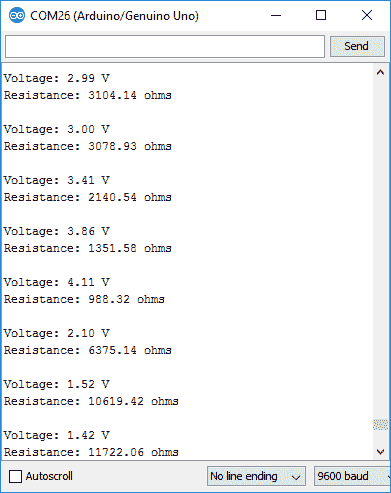
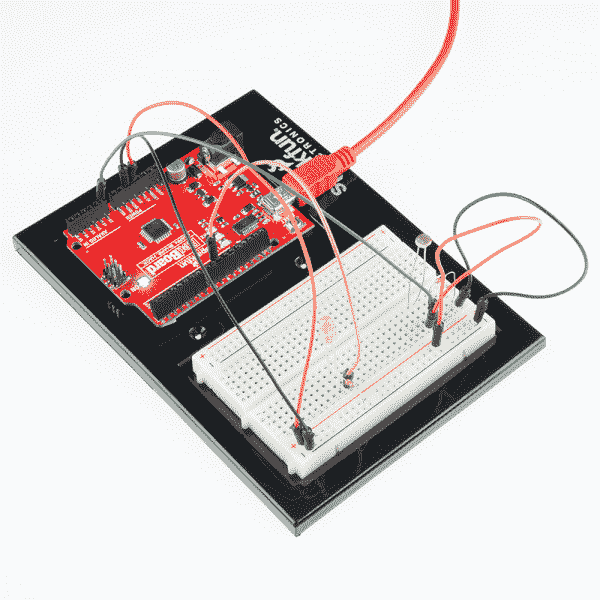

# 光电管连接导轨

> 原文：<https://learn.sparkfun.com/tutorials/photocell-hookup-guide>

## 介绍

[光电池](https://www.sparkfun.com/products/9088)是光敏的可变电阻。随着更多的光照射到传感器的头部，其两个端子之间的电阻会降低。它们易于使用，是需要环境光感测的项目中必不可少的组件。

[](https://www.sparkfun.com/products/9088) 

将**添加到您的[购物车](https://www.sparkfun.com/cart)中！**

### [微型光电池](https://www.sparkfun.com/products/9088)

[In stock](https://learn.sparkfun.com/static/bubbles/ "in stock") SEN-09088

这是一个非常小的光传感器。光电池会改变(也称为光电探测器)

$1.607[Favorited Favorite](# "Add to favorites") 67[Wish List](# "Add to wish list")** **在漆黑的条件下，光电池的电阻将在兆欧(1.0mω+)范围内。在传感器上照射 LED 可以将电阻降至接近零，但通常在正常照明条件下，光电池的电阻在 8-20kω之间。

通过将光电池与静态电阻结合起来，形成一个[分压器](https://learn.sparkfun.com/tutorials/voltage-dividers)，你可以产生一个可变电压，该电压可以被微控制器的模数转换器读取。

### 建议的材料

本教程作为电阻光电池的快速入门，并演示如何连接和使用它们。除了光传感器，建议使用以下材料:

**[Arduino Uno](https://www.sparkfun.com/products/11021)**——我们将使用 Arduino 的模数转换器读入光电池的可变电阻。任何兼容 Arduino 的开发平台——无论是 [RedBoard](https://www.sparkfun.com/products/13975) 、 [Pro](https://www.sparkfun.com/products/10914) 还是[Pro Mini](https://www.sparkfun.com/products/11113)——都可以替代。

**[电阻套件](https://www.sparkfun.com/products/10969)**——为了将光电池的可变电阻转化为可读的电压，我们将它与一个静态电阻结合起来，创建一个分压器。这种电阻套件便于进行一些反复试验，以便尽可能地找出最敏感的电路。

**[试验板](https://www.sparkfun.com/products/12002)和[跳线](https://www.sparkfun.com/products/11026)**——光电池的腿，像任何通孔电阻一样，可以弯曲成形以适应。我们将把它们和电阻粘在一块试验板上，然后用跳线从试验板连接到 Arduino。

[](https://www.sparkfun.com/products/10969) 

将**添加到您的[购物车](https://www.sparkfun.com/cart)中！**

### [【电阻器套件- 1/4W(共 500)](https://www.sparkfun.com/products/10969)

[Out of stock](https://learn.sparkfun.com/static/bubbles/ "out of stock") COM-10969

电阻是个好东西，事实上，在许多电路设计中，电阻是至关重要的。唯一的问题似乎是…

$8.95180[Favorited Favorite](# "Add to favorites") 185[Wish List](# "Add to wish list")****[](https://www.sparkfun.com/products/13975) 

将**添加到您的[购物车](https://www.sparkfun.com/cart)中！**

### [spark fun red board——用 Arduino 编程 T3](https://www.sparkfun.com/products/13975)

[In stock](https://learn.sparkfun.com/static/bubbles/ "in stock") DEV-13975

SparkFun RedBoard 结合了 UNO 的 Optiboot 引导程序的简单性、FTDI 的稳定性和 shield com…

$21.5049[Favorited Favorite](# "Add to favorites") 89[Wish List](# "Add to wish list")****[](https://www.sparkfun.com/products/12002) 

将**添加到您的[购物车](https://www.sparkfun.com/cart)中！**

### [【试验板-不干胶(白色)](https://www.sparkfun.com/products/12002)

[In stock](https://learn.sparkfun.com/static/bubbles/ "in stock") PRT-12002

这是你的尝试和真正的白色无焊试验板。它有 2 条电源总线，10 列，30 行，总共 400 个连接…

$5.5048[Favorited Favorite](# "Add to favorites") 93[Wish List](# "Add to wish list")****[](https://www.sparkfun.com/products/11026) 

将**添加到您的[购物车](https://www.sparkfun.com/cart)中！**

### [跳线标准 7" M/M - 30 AWG (30 个装)](https://www.sparkfun.com/products/11026)

[In stock](https://learn.sparkfun.com/static/bubbles/ "in stock") PRT-11026

如果你需要快速完成一个原型，没有什么比一堆跳线更能加快速度的了，让我们来看看

$2.4520[Favorited Favorite](# "Add to favorites") 43[Wish List](# "Add to wish list")******** ********### 推荐阅读

光电管对于初学者来说是一个很好的入门级元件，但是仍然有一些基本的电子学概念你应该熟悉。如果这些教程的标题对你来说听起来很陌生，考虑先浏览一下这些内容。

[](https://learn.sparkfun.com/tutorials/light) [### 光](https://learn.sparkfun.com/tutorials/light) Light is a useful tool for the electrical engineer. Understanding how light relates to electronics is a fundamental skill for many projects.[Favorited Favorite](# "Add to favorites") 24[](https://learn.sparkfun.com/tutorials/analog-to-digital-conversion) [### 模数转换](https://learn.sparkfun.com/tutorials/analog-to-digital-conversion) The world is analog. Use analog to digital conversion to help digital devices interpret the world.[Favorited Favorite](# "Add to favorites") 58[](https://learn.sparkfun.com/tutorials/voltage-dividers) [### 分压器](https://learn.sparkfun.com/tutorials/voltage-dividers) Turn a large voltage into a smaller one with voltage dividers. This tutorial covers: what a voltage divider circuit looks like and how it is used in the real world.[Favorited Favorite](# "Add to favorites") 70[](https://learn.sparkfun.com/tutorials/analog-vs-digital) [### 模拟与数字](https://learn.sparkfun.com/tutorials/analog-vs-digital) This tutorial covers the concept of analog and digital signals, as they relate to electronics.[Favorited Favorite](# "Add to favorites") 66

## 光电池概述

光电池，有时也称为光敏电阻或光敏电阻器(LDR)，是一种双端电阻元件，根据感应到的光增加或减少其电阻。它们有各种形状、大小和外形；我们目录中的[微型光电池](https://www.sparkfun.com/products/9088)具有 5x4.3mm 毫米的头部和通孔腿，可以焊接到 PCB 上或插入试验板。

[](https://cdn.sparkfun.com//assets/parts/2/4/6/2/09088-01-L.jpg)

在漆黑的条件下，大多数光电池的电阻将在兆欧范围内测量。光电池的典型**光阻**因元件而异。例如，微型光电池在正常照明条件下通常会产生一个在**8-20kω**之间的电阻。

下图展示了微型光电池的照度和电阻关系:

[](https://cdn.sparkfun.com/assets/learn_tutorials/5/1/2/illuminance-vs-resistance.png)*Light vs. Resistance graph from the [mini photocell datasheet](http://cdn.sparkfun.com/datasheets/Sensors/LightImaging/SEN-09088.pdf).*

从上图中可以看出，这些传感器不是为绝对勒克斯测量精度而设计的，它们留下了很大的解释空间。但是，通过测量光电池的电阻，它们可以提供一个房间照明条件的相对概念，或者告诉我们太阳是升起还是落下。

## 示例电路

为了用微控制器的 ADC 测量光电池的电阻，我们实际上必须用它来产生一个可变电压。通过将光电池与一个静态电阻结合起来，我们可以创建一个[分压器](https://learn.sparkfun.com/tutorials/voltage-dividers)，它根据光电池的电阻产生一个电压。

1kω至 10kΩ之间的静态电阻值应与光电池匹配良好。如果你有一个[电阻套件](https://www.sparkfun.com/products/10969)，你可能想引入一些试错法来磨练完美的静态电阻。

在本例中，我们将使用一个 4.7kΩ电阻通过光电池进行分压。以下是电路示例:

[](https://cdn.sparkfun.com/assets/learn_tutorials/5/1/2/example_circuit_bb.png)

和示意图:

[](https://cdn.sparkfun.com/assets/learn_tutorials/5/1/2/example_circuit_schem.png)

接地侧的 4.7kΩ电阻器和 5V 侧的光电池意味着随着电池的**电阻增加**(意味着传感器的周围环境变得**更暗**)A0 上的**电压将降低**。

## 示例程序

这是一个基于上述电路的简单 Arduino 示例。复制并粘贴到你的 Arduino IDE，然后上传！

**注意:**此示例假设您在桌面上使用的是最新版本的 Arduino IDE。如果这是你第一次使用 Arduino，请回顾我们关于[安装 Arduino IDE 的教程。](https://learn.sparkfun.com/tutorials/installing-arduino-ide)

If you have not previously installed an Arduino library, please check out our [installation guide.](https://learn.sparkfun.com/tutorials/installing-an-arduino-library)

```
language:c
/******************************************************************************
Photocell_Example.ino
Example sketch for SparkFun's photocell - light-variable resistor
  (https://www.sparkfun.com/products/9088)
Jim Lindblom @ SparkFun Electronics
April 28, 2016

Create a voltage divider circuit combining a photocell with a 4.7k resistor.
- The resistor should connect from A0 to GND.
- The photocell should connect from A0 to 3.3V
- Connect an LED to pin 13 (if there's not one built into your Arduino)
As the resistance of the photocell increases (surroundings get darker), the
voltage at A0 should decrease.

Development environment specifics:
Arduino 1.6.7
******************************************************************************/
const int LIGHT_PIN = A0; // Pin connected to voltage divider output
const int LED_PIN = 13; // Use built-in LED as dark indicator

// Measure the voltage at 5V and the actual resistance of your
// 47k resistor, and enter them below:
const float VCC = 4.98; // Measured voltage of Ardunio 5V line
const float R_DIV = 4660.0; // Measured resistance of 3.3k resistor

// Set this to the minimum resistance require to turn an LED on:
const float DARK_THRESHOLD = 10000.0;

void setup() 
{
  Serial.begin(9600);
  pinMode(LIGHT_PIN, INPUT);
  pinMode(LED_PIN, OUTPUT);
}

void loop() 
{
  // Read the ADC, and calculate voltage and resistance from it
  int lightADC = analogRead(LIGHT_PIN);
  if (lightADC > 0)
  {
    // Use the ADC reading to calculate voltage and resistance
    float lightV = lightADC * VCC / 1023.0;
    float lightR = R_DIV * (VCC / lightV - 1.0);
    Serial.println("Voltage: " + String(lightV) + " V");
    Serial.println("Resistance: " + String(lightR) + " ohms");

    // If resistance of photocell is greater than the dark
    // threshold setting, turn the LED on.
    if (lightR >= DARK_THRESHOLD)
      digitalWrite(LED_PIN, HIGH);
    else
      digitalWrite(LED_PIN, LOW);

    Serial.println();
    delay(500);
  }
} 
```

上传后，**打开你的[串口监视器](https://learn.sparkfun.com/tutorials/terminal-basics/arduino-serial-monitor-windows-mac-linux)** ，设置波特率为 9600 bps。

然后引发光线的一些变化；用手盖住光电池，关掉灯，或者用手电筒照一下电池。你应该看到电压和电阻的计算随着光线的变化而变化。如果天色变暗，电阻应该会上升。如果它变轻了，电阻就会下降。

[](https://cdn.sparkfun.com/assets/learn_tutorials/5/1/2/photocell-serial-monitor.png)If the values don't look correct to you, make sure the `R_DIV` variable at the top of the sketch is set to your static resistor's value.

当感应到的光线变得太暗时，Arduino 应该打开 pin 13 LED 以尝试照亮事物。通过调整`DARK_THRESHOLD`变量，您可以改变触发 LED 照明的照明条件。

## 资源和更进一步

现在你已经让你的 Arduino 对周围的光线条件做出反应了，你打算创建什么依赖光线的项目呢？需要一些灵感吗？查看一些 SparkFun 教程:

[](https://learn.sparkfun.com/tutorials/sparkpunk-hookup-guide) [### 火花朋克连接指南](https://learn.sparkfun.com/tutorials/sparkpunk-hookup-guide) How to assemble and modify the SparkPunk Sound Generator kit.[Favorited Favorite](# "Add to favorites") 6[](https://learn.sparkfun.com/tutorials/sparkfun-inventors-kit-for-microview) [### SparkFun Inventor 的微视套件](https://learn.sparkfun.com/tutorials/sparkfun-inventors-kit-for-microview) The SparkFun Inventor's Kit for MicroView follows our tried and true inventor's kit model, bringing you 11 simple yet fun experiments to introduce you to the SparkFun MicroView.[Favorited Favorite](# "Add to favorites") 7[](https://learn.sparkfun.com/tutorials/lilypad-light-sensor-hookup-guide) [### LilyPad 光线传感器连接指南](https://learn.sparkfun.com/tutorials/lilypad-light-sensor-hookup-guide) How to hook up the LilyPad Light Sensor as well as some project ideas and example code.[Favorited Favorite](# "Add to favorites") 3[](https://learn.sparkfun.com/tutorials/blynk-board-project-guide) [### Blynk 板项目指南](https://learn.sparkfun.com/tutorials/blynk-board-project-guide) A series of Blynk projects you can set up on the Blynk Board without ever re-programming it.[Favorited Favorite](# "Add to favorites") 18[](https://learn.sparkfun.com/tutorials/light-seeking-robot) [### 寻光机器人](https://learn.sparkfun.com/tutorials/light-seeking-robot) We use parts from the SparkFun Inventor's Kit v4.0 to create a light-seeking robot that mimics the behavior of single-celled organisms.[Favorited Favorite](# "Add to favorites") 8[](https://learn.sparkfun.com/tutorials/sparkfun-inventors-kit-experiment-guide---v40) [### SparkFun 发明家套件实验指南-4.0 版](https://learn.sparkfun.com/tutorials/sparkfun-inventors-kit-experiment-guide---v40) The SparkFun Inventor's Kit (SIK) Experiment Guide contains all of the information needed to build all five projects, encompassing 16 circuits, in the latest version of the kit, v4.0a.[Favorited Favorite](# "Add to favorites") 8[](https://learn.sparkfun.com/tutorials/python-programming-tutorial-getting-started-with-the-raspberry-pi) [### Python 编程教程:Raspberry Pi 入门](https://learn.sparkfun.com/tutorials/python-programming-tutorial-getting-started-with-the-raspberry-pi) This guide will show you how to write programs on your Raspberry Pi using Python to control hardware.[Favorited Favorite](# "Add to favorites") 27

或者看看我们的 SIK 指南中使用的老例子，它根据光电池的输入来设置 LED 的亮度。

| [](https://learn.sparkfun.com/tutorials/sik-experiment-guide-for-arduino---v33/experiment-6-reading-a-photoresistor) |
| *[SIK Arduino v 3.3 实验指南:实验 6:读取光敏电阻](https://learn.sparkfun.com/tutorials/sik-experiment-guide-for-arduino---v33/experiment-6-reading-a-photoresistor)* |

也许检查一下[工作台教育](https://edu.workbencheducation.com/cwists/preview/11064x)中列出的玩具车速度陷阱项目示例，或者将光传感器嵌入到一个项目中。

[](https://www.sparkfun.com/news/2179 "September 6, 2016: Adding a chronograph to a Hot Wheels track to measure the speed of passing toy cars.") [### t:风火轮速度陷阱

September 6, 2016](https://www.sparkfun.com/news/2179 "September 6, 2016: Adding a chronograph to a Hot Wheels track to measure the speed of passing toy cars.")[Favorited Favorite](# "Add to favorites") 3[](https://www.sparkfun.com/news/2887 "March 7, 2019: Hop on the I2C  BUS and let's build Escape Room puzzles Qwiic!") [### 英语日:Qwiic 密室逃脱

March 7, 2019](https://www.sparkfun.com/news/2887 "March 7, 2019: Hop on the I2C  BUS and let's build Escape Room puzzles Qwiic!")[Favorited Favorite](# "Add to favorites") 4**********