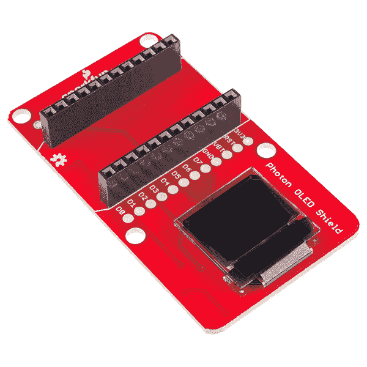
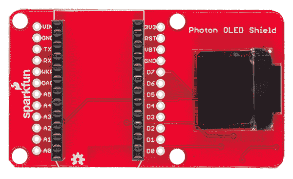
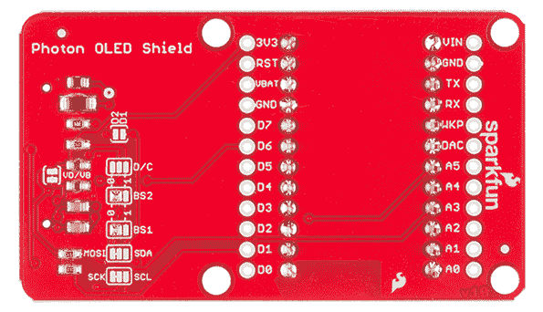
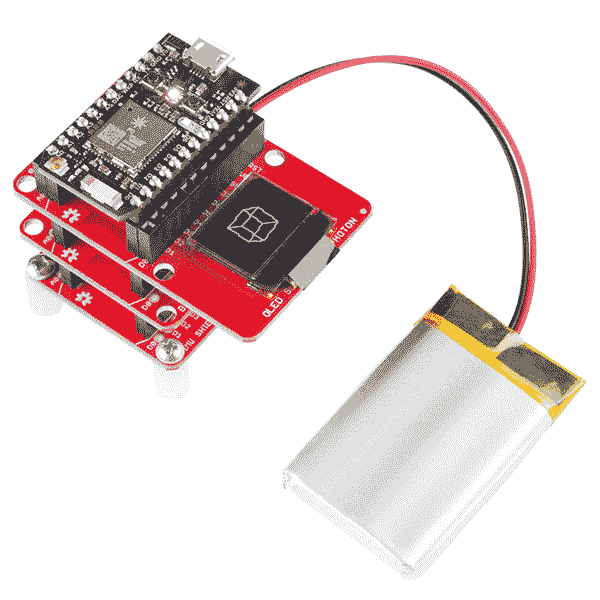

# 光子有机发光二极管屏蔽连接指南

> 原文：<https://learn.sparkfun.com/tutorials/photon-oled-shield-hookup-guide>

## 介绍

想让你的[光子](https://www.sparkfun.com/products/13774)项目显示传感器读数、玩乒乓球或画小涂鸦吗？[光子有机发光二极管护盾](https://www.sparkfun.com/products/13628?_ga=1.130787398.890988720.1429644996)可能是最合适的，我们将向你展示如何使用它。

[](https://cdn.sparkfun.com/assets/learn_tutorials/3/9/6/13628-01a.jpg)

如果上图中的有机发光二极管屏幕看起来很熟悉，那可能是因为我们在我们的[微视](https://www.sparkfun.com/products/12923)和[微有机发光二极管分线](https://www.sparkfun.com/products/13003)产品中使用了相同的组件，以及用于爱迪生的[有机发光二极管块。我们喜欢它，因为它的尺寸小，但图形惊人地清晰——屏幕本身宽 0.66 英寸，显示区域宽 64 像素，高 48 像素。](https://www.sparkfun.com/products/13035)

**Please Note:** All SparkFun shields for the Photon are also compatible with the [Core](https://store.particle.io/?product=spark-core) from Particle. The WKP, DAC and VBT pins on the Photon will be labeled A7, A6 and 3V3*, respectively, on the Core, but will not alter the functionality of any of the Shields.

### 本教程涵盖的内容

本教程将涵盖有机发光二极管盾的功能，如何在您的项目中将其连接起来，以及如何使用 SparkFun 微有机发光二极管库对其进行编程。

### 所需材料

所有你需要开始使用光子有机发光二极管盾是一个光子，一个微型 USB 电缆，和有机发光二极管盾。你还需要在 [particle.io](http://particle.io) 上注册一个账户，并注册你的光子。关于如何做到这一点的说明可以在 [docs.particle.io](http://docs.particle.io/photon/) 找到。

[](https://www.sparkfun.com/products/13628) 

将**添加到您的[购物车](https://www.sparkfun.com/cart)中！**

### [SparkFun 光子微有机发光二极管盾](https://www.sparkfun.com/products/13628)

[Only 11 left!](https://learn.sparkfun.com/static/bubbles/ "only 11 left!") DEV-13628

SparkFun 光子微有机发光二极管盾打破了一个小的单色，蓝黑有机发光二极管使用你的光子模块。它'…

$18.95 $7.5811[Favorited Favorite](# "Add to favorites") 12[Wish List](# "Add to wish list")****[](https://www.sparkfun.com/products/13774) 

将**添加到您的[购物车](https://www.sparkfun.com/cart)中！**

### [【粒子光子】](https://www.sparkfun.com/products/13774)

[Out of stock](https://learn.sparkfun.com/static/bubbles/ "out of stock") WRL-13774

Particle 的 IoT(物联网)硬件开发板 Photon 提供了构建互联网络所需的一切…

$19.0032[Favorited Favorite](# "Add to favorites") 51[Wish List](# "Add to wish list")**** ****### 推荐阅读

*   [串行外设接口(SPI)](https://learn.sparkfun.com/tutorials/serial-peripheral-interface-spi) - SPI 是与显示器通信的首选方法。
*   I ² C -或者，I ² C 可用于控制显示。它使用较少的电线，但速度相当慢。

## 有机发光二极管盾概述

### 引脚描述

由于屏蔽为你做了所有的工作，实际上没有必要布线这些连接——但如果你在看数据手册，或微视图或有机发光二极管分线点的代码，这个表会给你一个关于屏蔽在做什么的线索。一如既往，您可以查看原理图了解更多信息。

[](https://cdn.sparkfun.com/assets/learn_tutorials/3/9/6/Screen_Shot_2015-06-30_at_1.51.24_PM.png)

| 有机发光二极管屏蔽销 | 光子针 | SPI 功能 | I ² C 功能 | 笔记 |
| GND | GND | 地面 | 地面 | 0V |
| 3V3 (VDD) | 3V3 | 力量 | 力量 | 应为稳压 3.3V 电源。 |
| D1 (SDI/MOSI) | A5 号 | MOSI | 国家药品监督管理局 | 串行数据输入 |
| D0 (SCK) | A3 号 | 血清肌酸激酶 | SCL | SPI 和 I ² C 时钟 |
| D2 (SDO) | 军事情报部门组织(Military Intelligence Service Organization) | — | 在 SPI 模式下不可用。I ² C 无功能。 | — |
| 信用证 | D6 | 数据/命令 | I ² C 地址选择 | 输入字节是命令还是屏幕数据时发出信号的数字引脚。 |
| 英特尔的快速储存技术 | D7 | 重置 | 重置 | 低屏复位。 |
| 特许测量员 | 主动脉第二声 | — | SPI 芯片选择(低电平有效) | — |

### 设置跳线

把板子翻过来，你会发现有六个跳线。这些跳线的大部分用于在 SPI 和 I ² C 模式之间**切换。当电路板发货时，这些跳线被设置为在 **SPI 模式**下配置显示器。**

[](https://cdn.sparkfun.com/assets/learn_tutorials/3/9/6/Screen_Shot_2015-06-30_at_1.51.40_PM.png)

以下是每种跳线的概述，在上图中从左到右、从上到下排列:

*   **VD/VB** -该跳线将数字电源(VDD)与电池电源(VBAT)短路。由于这两个电源都可以采用 3.3V 电源供电，因此简单的单电源解决方案是将它们短接在一起，为它们提供单电源。如果需要以更低的电压为数字电源供电，如 1.8V，可能需要切断此跳线，提供两个电源。
*   **D1/D2** -这个跳线可以用来**短接 D1 到 D2** 。如果要使用 SPI，请保持此跳线开路。如果你使用 I ² C，短接跳线。默认情况下，此跳线是打开的。
*   **直流** -该跳线可用于将直流短接到 3.3V (1)或 0V (0)。在 I ² C 模式下，D/C 引脚设置显示器的 7 位地址。在 SPI 模式下，此跳线应保持开路，因为需要切换 D/C 引脚来确定输入的字节是数据还是命令。
*   **BS2** 和 **BS1** -有机发光二极管上的这些引脚决定你使用哪个接口来控制有机发光二极管。有了这两个信号，就有四种可能的组合:

    | BS2 | BS1 | 连接 |
    | 零 | 零 | 精力 |
    | 零 | 一 | 一^二三 |
    | 一 | 零 | 八位并行 |
    | (6800)一个 | 一个 | 8 位并行(8080) |

    默认情况下，这两个跳线都设置为 0，从而将显示器置于 SPI 模式。如果要将其更改为 I ² C 模式，清除 BS1 跳线并将其设置为 1。

* * *

这个简短的概述应该涵盖 99%的用例。如果您对跳线或引脚有任何疑问，请查阅原理图和其中的注释。

## 使用有机发光二极管盾

当把你的光子附加到有机发光二极管盾的顶部时，确保光子的斜面端(靠近 A0 和 D0)与有机发光二极管盾顶部的斜面线(带有开源硬件标志的一端)匹配。光子上的针标签也应该与有机发光二极管盾上的相匹配。你可以把我们的许多光子护盾堆叠在一起，这就是为什么有机发光二极管屏幕突出到一边的原因。所以，你最终会得到这样的结果:

[](https://cdn.sparkfun.com/assets/learn_tutorials/3/9/6/13345-07.jpg)

## 使用粒子有机发光二极管库

很好，现在我们了解了硬件设置，让我们在这个东西上放一些代码，看看它能做什么。使用我们编写的粒子库，你将能够书写文本，绘制线条和形状，并且通常显示任何适合屏幕的内容。

### 获取粒子有机发光二极管库

在这一页，我们将使用[在线粒子环境](https://build.particle.io)。如果你使用的是粒子开发环境，你可以从 [GitHub 库](https://github.com/sparkfun/SparkFun_Micro_OLED_Particle_Library)获得库和代码示例。

[Download the Particle OLED Library](https://github.com/sparkfun/SparkFun_Micro_OLED_Particle_Library/archive/master.zip)

### 加载演示示例

如果你还没有创建一个粒子用户帐户，并要求你的董事会，你现在需要这样做。如果你有困难，从这里开始是个好主意。

一旦你登录到 build.particle.io 并选择了一个设备(所有这些都包含在上面的链接中)，你会想要点击侧边栏中的`create new app`按钮——它是蓝色的大按钮，你不会错过的。把你的应用程序叫做“有机发光二极管测试”。

接下来——这是重要的部分——我们包括了`SparkFunMicroOLED`库。为此:

*   点击看起来像书签的图标(它在黑色窄边栏的最左边，从底部数第四个)
*   在“社区图书馆”下的文本框中，搜索“有机发光二极管”，你会看到“SparkFunMicroOLED”出现(尽管它可能会被剪掉一点，别担心)。

它应该是这样的:

[](https://cdn.sparkfun.com/assets/learn_tutorials/3/9/6/Screen_Shot_2015-06-29_at_2.04.53_PM.png)

*   点击库名，会弹出一堆东西，包括所有的库文件以及一些如何处理库的选项。
*   在这种情况下，我们只想在我们的应用程序中使用该库，因此单击“包含在应用程序中”按钮。
*   这将引导你列出你所有的应用程序——点击你刚刚创建的应用程序的名称，你应该在你的应用程序顶部看到类似`#include "SparkFunMicroOLED/SparkFunMicroOLED.h"`的声明。
*   最后一件事是将数学库添加到我们的草图中——在第一个`#include`语句下面的行中，键入:`#include "math.h"`

现在我们已经在应用中包含了这个库，让我们给它一些代码——只需复制下面的演示代码并**粘贴到你的应用中，在 include 语句**下面。

```
language:cpp
/*
Micro-OLED-Shield-Example.ino
SparkFun Micro OLED Library Hello World Example
Jim Lindblom @ SparkFun Electronics
Original Creation Date: June 22, 2015

This sketch prints a friendly, recognizable logo on the OLED Shield, then
  goes on to demo the Micro OLED library's functionality drawing pixels,
  lines, shapes, and text.

  Hardware Connections:
  This sketch was written specifically for the Photon Micro OLED Shield, which does all the wiring for you. If you have a Micro OLED breakout, use the following hardware setup:

    MicroOLED ------------- Photon
      GND ------------------- GND
      VDD ------------------- 3.3V (VCC)
    D1/MOSI ----------------- A5 (don't change)
    D0/SCK ------------------ A3 (don't change)
      D2
      D/C ------------------- D6 (can be any digital pin)
      RST ------------------- D7 (can be any digital pin)
      CS  ------------------- A2 (can be any digital pin)

  Development environment specifics:
    IDE: Particle Build
    Hardware Platform: Particle Photon
                       SparkFun Photon Micro OLED Shield

  This code is beerware; if you see me (or any other SparkFun
  employee) at the local, and you've found our code helpful,
  please buy us a round!

  Distributed as-is; no warranty is given.
*/

//////////////////////////////////
// MicroOLED Object Declaration //
//////////////////////////////////
// Declare a MicroOLED object. If no parameters are supplied, default pins are
// used, which will work for the Photon Micro OLED Shield (RST=D7, DC=D6, CS=A2)

MicroOLED oled;

void setup()
{
  oled.begin();    // Initialize the OLED
  oled.clear(ALL); // Clear the display's internal memory
  oled.display();  // Display what's in the buffer (splashscreen)
  delay(1000);     // Delay 1000 ms
  oled.clear(PAGE); // Clear the buffer.

  randomSeed(analogRead(A0) + analogRead(A1));
}

void loop()
{
  pixelExample();  // Run the pixel example function
  lineExample();   // Then the line example function
  shapeExample();  // Then the shape example
  textExamples();  // Finally the text example
}

void pixelExample()
{
  printTitle("Pixels", 1);

  for (int i=0; i<512; i++)
  {
    oled.pixel(random(oled.getLCDWidth()), random(oled.getLCDHeight()));
    oled.display();
  }
}

void lineExample()
{
  int middleX = oled.getLCDWidth() / 2;
  int middleY = oled.getLCDHeight() / 2;
  int xEnd, yEnd;
  int lineWidth = min(middleX, middleY);

  printTitle("Lines!", 1);

  for (int i=0; i<3; i++)
  {
    for (int deg=0; deg<360; deg+=15)
    {
      xEnd = lineWidth * cos(deg * M_PI / 180.0);
      yEnd = lineWidth * sin(deg * M_PI / 180.0);

      oled.line(middleX, middleY, middleX + xEnd, middleY + yEnd);
      oled.display();
      delay(10);
    }
    for (int deg=0; deg<360; deg+=15)
    {
      xEnd = lineWidth * cos(deg * M_PI / 180.0);
      yEnd = lineWidth * sin(deg * M_PI / 180.0);

      oled.line(middleX, middleY, middleX + xEnd, middleY + yEnd, BLACK, NORM);
      oled.display();
      delay(10);
    }
  }
}

void shapeExample()
{
  printTitle("Shapes!", 0);

  // Silly pong demo. It takes a lot of work to fake pong...
  int paddleW = 3;  // Paddle width
  int paddleH = 15;  // Paddle height
  // Paddle 0 (left) position coordinates
  int paddle0_Y = (oled.getLCDHeight() / 2) - (paddleH / 2);
  int paddle0_X = 2;
  // Paddle 1 (right) position coordinates
  int paddle1_Y = (oled.getLCDHeight() / 2) - (paddleH / 2);
  int paddle1_X = oled.getLCDWidth() - 3 - paddleW;
  int ball_rad = 2;  // Ball radius
  // Ball position coordinates
  int ball_X = paddle0_X + paddleW + ball_rad;
  int ball_Y = random(1 + ball_rad, oled.getLCDHeight() - ball_rad);//paddle0_Y + ball_rad;
  int ballVelocityX = 1;  // Ball left/right velocity
  int ballVelocityY = 1;  // Ball up/down velocity
  int paddle0Velocity = -1;  // Paddle 0 velocity
  int paddle1Velocity = 1;  // Paddle 1 velocity

  //while(ball_X >= paddle0_X + paddleW - 1)
  while ((ball_X - ball_rad > 1) && 
         (ball_X + ball_rad < oled.getLCDWidth() - 2))
  {
    // Increment ball's position
    ball_X+=ballVelocityX;
    ball_Y+=ballVelocityY;
    // Check if the ball is colliding with the left paddle
    if (ball_X - ball_rad < paddle0_X + paddleW)
    {
      // Check if ball is within paddle's height
      if ((ball_Y > paddle0_Y) && (ball_Y < paddle0_Y + paddleH))
      {
        ball_X++;  // Move ball over one to the right
        ballVelocityX = -ballVelocityX; // Change velocity
      }
    }
    // Check if the ball hit the right paddle
    if (ball_X + ball_rad > paddle1_X)
    {
      // Check if ball is within paddle's height
      if ((ball_Y > paddle1_Y) && (ball_Y < paddle1_Y + paddleH))
      {
        ball_X--;  // Move ball over one to the left
        ballVelocityX = -ballVelocityX; // change velocity
      }
    }
    // Check if the ball hit the top or bottom
    if ((ball_Y <= ball_rad) || (ball_Y >= (oled.getLCDHeight() - ball_rad - 1)))
    {
      // Change up/down velocity direction
      ballVelocityY = -ballVelocityY;
    }
    // Move the paddles up and down
    paddle0_Y += paddle0Velocity;
    paddle1_Y += paddle1Velocity;
    // Change paddle 0's direction if it hit top/bottom
    if ((paddle0_Y <= 1) || (paddle0_Y > oled.getLCDHeight() - 2 - paddleH))
    {
      paddle0Velocity = -paddle0Velocity;
    }
    // Change paddle 1's direction if it hit top/bottom
    if ((paddle1_Y <= 1) || (paddle1_Y > oled.getLCDHeight() - 2 - paddleH))
    {
      paddle1Velocity = -paddle1Velocity;
    }

    // Draw the Pong Field
    oled.clear(PAGE);  // Clear the page
    // Draw an outline of the screen:
    oled.rect(0, 0, oled.getLCDWidth() - 1, oled.getLCDHeight());
    // Draw the center line
    oled.rectFill(oled.getLCDWidth()/2 - 1, 0, 2, oled.getLCDHeight());
    // Draw the Paddles:
    oled.rectFill(paddle0_X, paddle0_Y, paddleW, paddleH);
    oled.rectFill(paddle1_X, paddle1_Y, paddleW, paddleH);
    // Draw the ball:
    oled.circle(ball_X, ball_Y, ball_rad);
    // Actually draw everything on the screen:
    oled.display();
    delay(25);  // Delay for visibility
  }
  delay(1000);
}

void textExamples()
{
  printTitle("Text!", 1);

  // Demonstrate font 0\. 5x8 font
  oled.clear(PAGE);     // Clear the screen
  oled.setFontType(0);  // Set font to type 0
  oled.setCursor(0, 0); // Set cursor to top-left
  // There are 255 possible characters in the font 0 type.
  // Lets run through all of them and print them out!
  for (int i=0; i<=255; i++)
  {
    // You can write byte values and they'll be mapped to
    // their ASCII equivalent character.
    oled.write(i);  // Write a byte out as a character
    oled.display(); // Draw on the screen
    delay(10);      // Wait 10ms
    // We can only display 60 font 0 characters at a time.
    // Every 60 characters, pause for a moment. Then clear
    // the page and start over.
    if ((i%60 == 0) && (i != 0))
    {
      delay(500);           // Delay 500 ms
      oled.clear(PAGE);     // Clear the page
      oled.setCursor(0, 0); // Set cursor to top-left
    }
  }
  delay(500);  // Wait 500ms before next example

  // Demonstrate font 1\. 8x16\. Let's use the print function
  // to display every character defined in this font.
  oled.setFontType(1);  // Set font to type 1
  oled.clear(PAGE);     // Clear the page
  oled.setCursor(0, 0); // Set cursor to top-left
  // Print can be used to print a string to the screen:
  oled.print(" !\"#$%&'()*+,-./01234");
  oled.display();       // Refresh the display
  delay(1000);          // Delay a second and repeat
  oled.clear(PAGE);
  oled.setCursor(0, 0);
  oled.print("56789:;<=>?@ABCDEFGHI");
  oled.display();
  delay(1000);
  oled.clear(PAGE);
  oled.setCursor(0, 0);
  oled.print("JKLMNOPQRSTUVWXYZ[\\]^");
  oled.display();
  delay(1000);
  oled.clear(PAGE);
  oled.setCursor(0, 0);
  oled.print("_`abcdefghijklmnopqrs");
  oled.display();
  delay(1000);
  oled.clear(PAGE);
  oled.setCursor(0, 0);
  oled.print("tuvwxyz{|}~");
  oled.display();
  delay(1000);

  // Demonstrate font 2\. 10x16\. Only numbers and '.' are defined. 
  // This font looks like 7-segment displays.
  // Lets use this big-ish font to display readings from the
  // analog pins.
  for (int i=0; i<25; i++)
  {
    oled.clear(PAGE);            // Clear the display
    oled.setCursor(0, 0);        // Set cursor to top-left
    oled.setFontType(0);         // Smallest font
    oled.print("A0:");          // Print "A0"
    oled.setFontType(2);         // 7-segment font
    oled.print(analogRead(A0));  // Print a0 reading
    oled.setCursor(0, 16);       // Set cursor to top-middle-left
    oled.setFontType(0);         // Repeat
    oled.print("A1:");
    oled.setFontType(2);
    oled.print(analogRead(A1));
    oled.setCursor(0, 32);
    oled.setFontType(0);
    oled.print("A7:");
    oled.setFontType(2);
    oled.print(analogRead(A7));
    oled.display();
    delay(100);
  }

  // Demonstrate font 3\. 12x48\. Stopwatch demo.
  oled.setFontType(3);  // Use the biggest font
  int ms = 0;
  int s = 0;
  while (s <= 50)
  {
    oled.clear(PAGE);     // Clear the display
    oled.setCursor(0, 0); // Set cursor to top-left
    if (s < 10)
      oled.print("00");   // Print "00" if s is 1 digit
    else if (s < 100)     
      oled.print("0");    // Print "0" if s is 2 digits
    oled.print(s);        // Print s's value
    oled.print(":");      // Print ":"
    oled.print(ms);       // Print ms value
    oled.display();       // Draw on the screen
    ms++;         // Increment ms
    if (ms >= 10) // If ms is >= 10
    {
      ms = 0;     // Set ms back to 0
      s++;        // and increment s
    }
    delay(1);
  }
}

// Center and print a small title
// This function is quick and dirty. Only works for titles one
// line long.
void printTitle(String title, int font)
{
  int middleX = oled.getLCDWidth() / 2;
  int middleY = oled.getLCDHeight() / 2;

  oled.clear(PAGE);
  oled.setFontType(font);
  // Try to set the cursor in the middle of the screen
  oled.setCursor(middleX - (oled.getFontWidth() * (title.length()/2)),
                 middleY - (oled.getFontWidth() / 2));
  // Print the title:
  oled.print(title);
  oled.display();
  delay(1500);
  oled.clear(PAGE);
} 
```

现在，点击“闪光”按钮(看起来像闪电的那个)，等待魔法开始！

## 资源和更进一步

这里有几个链接，应该有助于你进一步了解光子有机发光二极管盾:

*   [光子有机发光二极管盾 Github](https://github.com/sparkfun/Photon_OLED_Shield) -用于原理图和电路板设计文件
*   SparkFun 有机发光二极管粒子库 -这是固件库和示例代码的地方
*   粒子文档页面 -到这里来设置和配置你的光子(或其他粒子设备)
*   粒子社区论坛(Particle Community Forum)-任何你在文档中找不到的东西都可以在社区论坛中找到。如果你有困难，首先搜索这个论坛，因为许多答案已经在那里了。

### 更进一步

现在你已经熟悉了光子有机发光二极管盾和它的粒子库，你打算用它做什么呢？需要一些灵感，查看这些相关教程:

[](https://learn.sparkfun.com/tutorials/serial-graphic-lcd-hookup) [### 串行图形 LCD 连接](https://learn.sparkfun.com/tutorials/serial-graphic-lcd-hookup) Learn how to use the Serial Graphic LCD.[Favorited Favorite](# "Add to favorites") 11[](https://learn.sparkfun.com/tutorials/rgb-panel-hookup-guide) [### RGB 面板连接指南](https://learn.sparkfun.com/tutorials/rgb-panel-hookup-guide) Make bright, colorful displays using the 32x16, 32x32, and 32x64 RGB LED matrix panels. This hookup guide shows how to hook up these panels and control them with an Arduino.[Favorited Favorite](# "Add to favorites") 11[](https://learn.sparkfun.com/tutorials/reaction-timer) [### 反应速度测量器](https://learn.sparkfun.com/tutorials/reaction-timer) Demonstrate mental chronometry with this simple reaction timer 11

有机发光二极管护盾和我们其他的[光子护盾](https://www.sparkfun.com/categories/278)配合得非常好；查看我们的屏蔽连接指南:

[](https://learn.sparkfun.com/tutorials/photon-battery-shield-hookup-guide) [### 光子电池屏蔽连接指南](https://learn.sparkfun.com/tutorials/photon-battery-shield-hookup-guide) The Photon Battery Shield has everything your Photon needs to run off, charge, and monitor a LiPo battery. Read through this hookup guide to get started using it.[Favorited Favorite](# "Add to favorites") 11[](https://learn.sparkfun.com/tutorials/photon-imu-shield-hookup-guide) [### 光子 IMU 屏蔽连接指南](https://learn.sparkfun.com/tutorials/photon-imu-shield-hookup-guide) Learn how to use the SparkFun Photon IMU Shield for your Photon device which houses an on-board LSM9DS1 system-in-a-chip that houses a 3-axis accelerometer, 3-axis gyroscope, and 3-axis magnetometer.[Favorited Favorite](# "Add to favorites") 5****