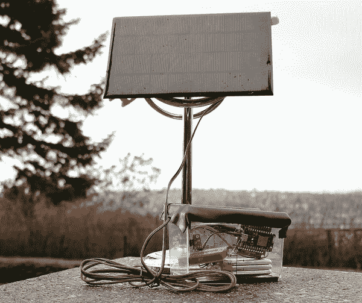

# 光子远程温度传感器

> 原文：<https://learn.sparkfun.com/tutorials/photon-remote-temperature-sensor>

## 介绍

### Phant 不再运行了

Unfortunately Phant, our data-streaming service, is no longer in service. The system has reached capacity and, like a less-adventurous Cassini, has plunged conclusively into a fiery and permanent retirement. There are several other maker-friendly, data-streaming services and/or IoT platforms available as alternatives. The three we recommend are Blynk, ThingSpeak, and Cayenne. You can read our [blog post on the topic](https://www.sparkfun.com/news/2413) for an overview and helpful links for each platform. The code in this tutorial will need to be adjusted to work with the other data streams.

科学方法使我们能够研究宇宙及其自然现象。通过收集和分析数据，我们发现历史趋势，并对未来事件做出预测。其中一个对我们的日常生活和长期生活有很大影响的现象就是温度。本教程向您展示如何构建您自己的远程温度传感器，自动将数据上传到[data.sparkfun.com](http://data.sparkfun.com)web 服务。这是一个完美的实践项目，用于教授或学习每日温度波动和平均温度随时间的变化之间的差异，这是讨论气候变化时一个特别重要的区别。

这个系统使用[粒子光子](https://www.sparkfun.com/products/13774)作为控制设备，这是一个方便的 lil '微控制器，可以轻松连接到 WiFi。光子从 [SparkFun TMP102 数字温度传感器](https://www.sparkfun.com/products/11931)读取温度数据，然后将数据上传到网络服务器进行远程数据采集，如果需要，还可以进行后续分析和绘图。

对于所有视觉学习者，请查看下面的项目视频:

[https://www.youtube.com/embed/Y9CIfijBi9Y/?autohide=1&border=0&wmode=opaque&enablejsapi=1](https://www.youtube.com/embed/Y9CIfijBi9Y/?autohide=1&border=0&wmode=opaque&enablejsapi=1)

### 材料

要在家里跟进这个项目，你需要以下物品:

#### 电子学

*   [粒子光子微控制器](https://www.sparkfun.com/products/13345)
*   [SparkFun 光子电池护罩](https://www.sparkfun.com/products/13626)
*   [TMP102 数字温度传感器](https://www.sparkfun.com/products/11931)
*   [2.5 W 太阳能电池板](https://www.sparkfun.com/products/7840)
*   [聚合物锂离子电池- 6 Ah](https://www.sparkfun.com/products/8484)
    *   请注意，电池保护罩旨在为单节脂肪电池充电。使用三芯 6Ah 电池可以延长电池寿命，但要注意每个电池的充电速度可能不同。
    *   如果你生活在比西雅图更阳光的气候中，你可以使用低容量的电池(例如 [2000 mAh 电池](https://www.sparkfun.com/products/8483))。
    *   小心 JST 连接器，避免拉扯电线，尤其是在移除它们的时候。查看本教程，找到一个简单的方法来移除它们。
*   [六(6)个接头销](https://www.sparkfun.com/products/553)
*   [表面贴装 DC 筒式千斤顶](https://www.sparkfun.com/products/12748)
*   四(4)根公母试验板跳线(或使用 22 号绝缘线)
*   [试验板](https://www.sparkfun.com/products/12002)(和/或 [PCB 板](https://www.sparkfun.com/products/12070)

这里有一个愿望清单，上面提到的大部分零件，为您提供方便。