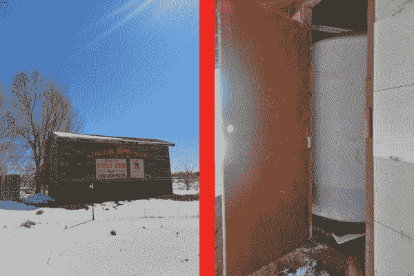
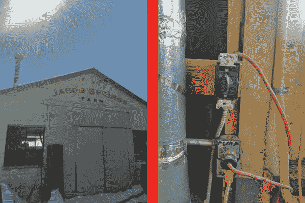
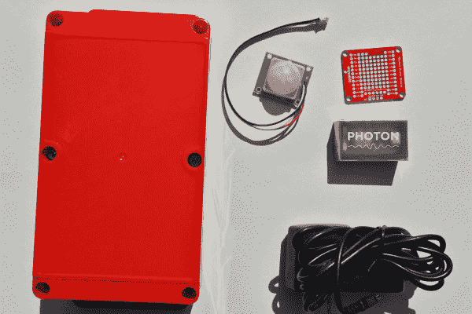
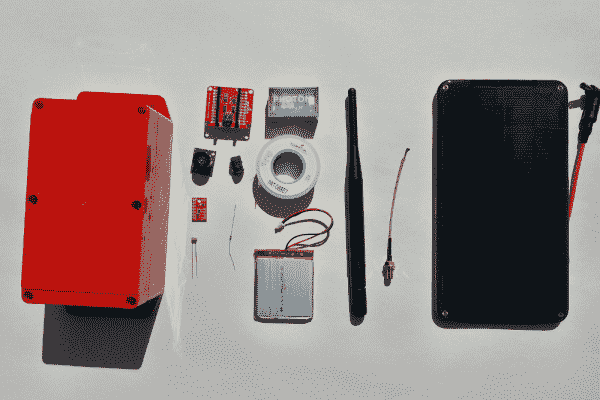

# 光子远程水位传感器

> 原文：<https://learn.sparkfun.com/tutorials/photon-remote-water-level-sensor>

## 介绍

随着廉价微控制器(MCU)的出现，特别是最近的 WiFi-MCU，许多单调任务和[遥测](https://en.wikipedia.org/wiki/Telemetry)(远程数据收集)的定制 DIY 自动化现在很容易成为可能。

在本教程中，我们将基于对水箱的远程测量来自动控制水泵，并基于大气压力读数发送天气警告，以及收集一系列其他数据。这种相同类型的系统可以很容易地适用于自动化农场/花园浇水或其他需要在满足某些条件时打开和关闭的事情(如仓库/温室在特定时间的灯光)，通过远程遥测进行测量。

### 问题是

我的朋友安德烈在博尔德拥有一个 CSA 农场，叫做 T2 雅各布温泉农场。他们制作一些美味的肉、牛奶和鸡蛋，所以，如果你是本地人，去看看吧。

*The farm sign on 75th and Arapahoe in Boulder, CO and the water tank behind it. You can see the water level is nearly empty, as is typical without any automation/telemetry system in place.*

法律上不允许他们经营城市供水线路，所以他们使用水井和自己的储水箱。使用旋转定时器(实际上仅额定为泵的当前负载的 50%)手动打开或关闭用于井的泵，并且通常他们不知道水箱中有多少水(除非它们是空的)。我听说过令人捧腹的悲惨故事，冬天人们在淋浴时，水却用光了。他们不得不跑到谷仓，全身涂满肥皂，裹着毛巾，打开水，等待热水器注满水加热，这样他们就可以洗完澡了。其他时候，当准备晚餐或洗碗时，水用完了，低水压导致进展缓慢。

*The barn with the pump control, and the existing pump control timer.*

水箱在房子的一个角落(最高的高度)，远离任何电源插座，水井的水泵在另一端。为了管理农场的供水系统，我开发了这个系统，它用超声波传感器测量水的高度，并根据数据控制水泵。我在做的时候，加了一些额外的环境传感器。

### 所需材料

这个项目是双重的:远程遥测(测量)结合自动天气警报，以及远程控制/自动化一个巨大的(2 马力)泵。要完成本教程，您需要以下产品和工具:

#### 泵远程控制箱

为了实现泵的自动化，您需要:

*   1 个用于开启/关闭泵的接触器，额定用于泵负载(在这种情况下为 3hp，2200W，但是[根据您的应用选择具有适当马力额定值的接触器](https://www.usbreaker.com/miva/merchant.mvc?Screen=SRCH&Store_Code=UBI&Search=%22Chint%20NC1(Contactor)%20Family%22)，或者如果负载足够轻，选择继电器
*   10A [继电器](https://www.sparkfun.com/products/13815)控制接触器
*   [粒子光子 WiFi MCU](https://www.sparkfun.com/products/13774) 控制继电器
*   [光子原盾](https://www.sparkfun.com/products/13598?_ga=1.96621276.273388466.1418147030)
*   母接头
*   公-公跳线
*   光子的 5 V 电源
*   装光子和继电器的盒子
*   [PIR 传感器](https://www.sparkfun.com/products/13285?_ga=1.59381230.273388466.1418147030)检查控制箱/接触器附近是否有人
*   用于 PIR 的 10 k 电阻
*   几个安装螺丝(5)，我用的是 [#8 1-1/4”干墙螺丝](http://www.homedepot.com/p/Grip-Rite-8-x-1-1-4-in-Philips-Bugle-Head-Coarse-Thread-Sharp-Point-Drywall-Screws-5-lb-Pack-114CDWS5/100120906)，一个 [DIN 导轨](https://en.wikipedia.org/wiki/DIN_rail)比较专业
*   为您的负载选择合适的接线(检查[此处](http://www.powerstream.com/Wire_Size.htm)为不同线规的最大安培数)-我使用了大约 2 英尺 18 AWG 用于控制接触器，大约 5 英尺 10 AWG 用于连接泵的接线

*Some of the supplies used for the pump control box. Not shown here: 10 k resistor, jumper wires, headers, screws, relay, contactor.*

#### 远程遥测盒(水位等)

该项目的另一半是远程数据收集。为此，您需要:

*   [粒子光子 WiFi MCU](https://www.sparkfun.com/products/13774)
*   [SMA 至 u.FL 电缆](https://www.sparkfun.com/products/9145)(如果您可以在没有天线的情况下接收 wifi 信号，则可能不需要)
*   [鸭形天线](https://www.sparkfun.com/products/558?_ga=1.63593068.273388466.1418147030)(如果没有天线也能获得 wifi 接收，则可能没有必要)，您也可以使用 [cantenna](http://www.turnpoint.net/wireless/cantennahowto.html) 或[八木天线](https://www.google.com/search?q=yagi+antenna&oq=yagi+antenna&aqs=chrome..69i57j0j69i65l2j0l2.1308j1j7&sourceid=chrome&ie=UTF-8#safe=off&tbm=shop&q=wifi+yagi+antenna)进行更远距离的接收
*   [光子电池护罩](https://www.sparkfun.com/products/13626?_ga=1.63593068.273388466.1418147030)
*   脂电池(我用的是 2000 毫安时的电池，但是你可以根据预算和你想要测量的频率选择更高或更低的电池容量(T2)
*   太阳能电池(我用的是 3.5 W 的 T1，但这太夸张了，为了安全起见——如果想省钱，你可以用 T2 的 2 W 的 T3)
*   CdS 光电池
*   与光电管一起使用的 1 k 电阻器
*   [BME280 压力/湿度/温度传感器](https://www.sparkfun.com/products/13676)
*   [MaxSonar EZ3 超声波测距仪](https://www.sparkfun.com/products/8501)(测量水的高度)，虽然我推荐[防水 HRXL 的坚固性](https://www.sparkfun.com/products/11724)
*   盒子来装这一切
*   连接线(22 AWG)
*   几个安装螺丝(2)，我用了 [#8 1-1/4”干墙螺丝](http://www.homedepot.com/p/Grip-Rite-8-x-1-1-4-in-Philips-Bugle-Head-Coarse-Thread-Sharp-Point-Drywall-Screws-5-lb-Pack-114CDWS5/100120906)
*   一些细绳或电线压住太阳能电池板

*Most all of the supplies used for the telemetry box.*

这里有一个愿望清单，包含了该项目中使用的所有 SparkFun 零件: