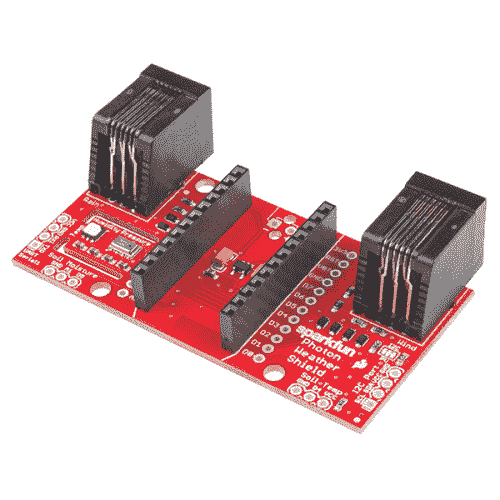

# 光子天气防护罩连接指南 V11

> 原文：<https://learn.sparkfun.com/tutorials/photon-weather-shield-hookup-guide-v11>

## 介绍

**Note:** This tutorial is for the Photon Weather Shield v11, which utilizes the Si7021 for humidity and temperature sensing as opposed to the HTU21D. If you are using the previous version, please refer to the older [Photon Weather Shield Hookup Guide](https://learn.sparkfun.com/tutorials/photon-weather-shield-hookup-guide).

你有没有想过拥有自己的气象站？或者你自己的恒温器能通过网络控制你的家庭气候吗？使用来自粒子的[光子和来自 SparkFun](https://www.sparkfun.com/products/13774) 的[光子天气防护罩，你现在可以将你的天气相关项目连接到物联网！](https://www.sparkfun.com/products/13674)

 

### [SparkFun 光子天气防护罩](https://www.sparkfun.com/products/retired/13674)

[Retired](https://learn.sparkfun.com/static/bubbles/ "Retired") DEV-13674

SparkFun 光子天气防护罩是一个易于使用的附加板，允许您访问气压，相对湿度…

1 **Retired**[Favorited Favorite](# "Add to favorites") 16[Wish List](# "Add to wish list")

[https://www.youtube.com/embed/PEWcWMFeZXk/?autohide=1&border=0&wmode=opaque&enablejsapi=1](https://www.youtube.com/embed/PEWcWMFeZXk/?autohide=1&border=0&wmode=opaque&enablejsapi=1)

**Note:** All [SparkFun shields for the Photon](https://www.sparkfun.com/categories/278) are also compatible with the (now retired) Core from Particle. The WKP, DAC and VBT pins on the Photon will be labeled A7, A6 and 3V3*, respectively, on the Core, but will not alter the functionality of any of the Shields.

### 所需材料

如果您只想测量**温度**、**湿度**和/或**气压**，您可以将 Photon Weather Shield 集成到您的项目中，开箱即用！无需焊接！

防护罩还有许多可选的**端口，可以连接其他传感器。这些可选设备将在本教程中简要讨论，但演示如何使用这些外设的示例将包含在另一个教程中，链接在本教程的末尾。**

要跟随本教程，您需要以下内容。