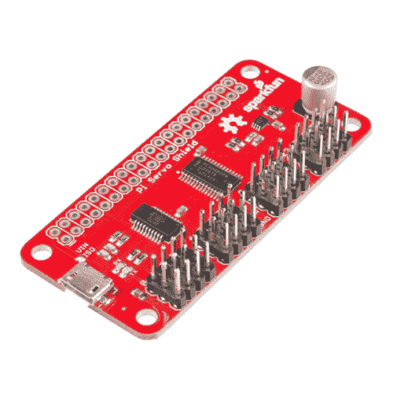
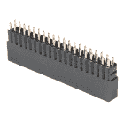
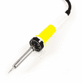
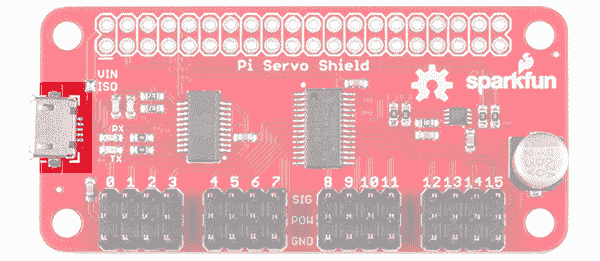
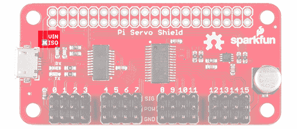
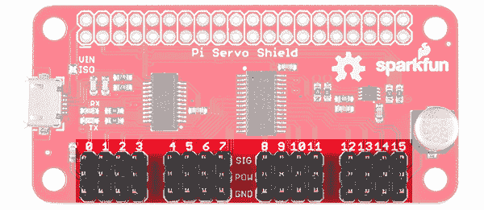
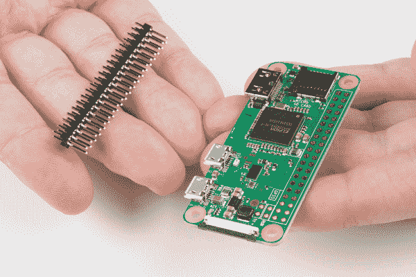
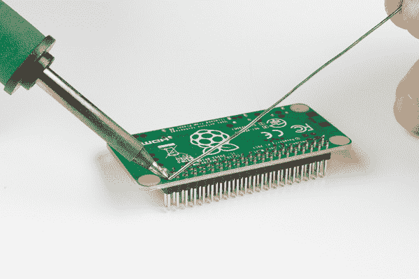
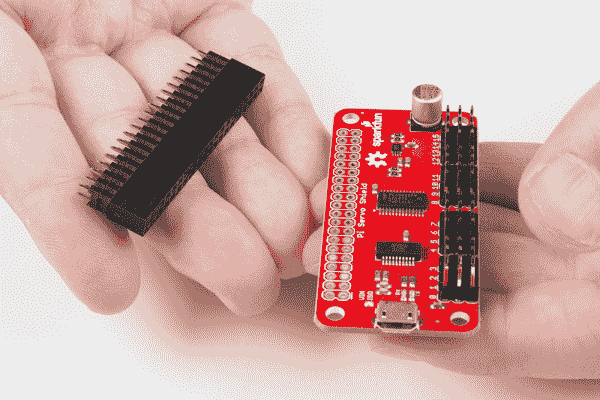

# Pi 伺服帽连接指南

> 原文：<https://learn.sparkfun.com/tutorials/pi-servo-hat-hookup-guide>

## 介绍

SparkFun Pi 伺服帽允许你的树莓 Pi 通过 I2C 连接控制多达 16 个伺服电机。这可以节省 GPIO，并让您将板载 GPIO 用于其他用途。此外，Pi Servo Shield 增加了一个串行终端连接，这将允许您调出一个 Raspberry Pi，而不必将其连接到显示器和键盘。

[](https://www.sparkfun.com/products/retired/14328) 

### [SparkFun Pi 伺服帽](https://www.sparkfun.com/products/retired/14328)

[Retired](https://learn.sparkfun.com/static/bubbles/ "Retired") DEV-14328

SparkFun Pi 伺服帽允许您的树莓 Pi 以简单明了的方式控制多达 16 个伺服电机

1 **Retired**[Favorited Favorite](# "Add to favorites") 9[Wish List](# "Add to wish list")

[https://www.youtube.com/embed/bOFVDu5zxvA/?autohide=1&border=0&wmode=opaque&enablejsapi=1](https://www.youtube.com/embed/bOFVDu5zxvA/?autohide=1&border=0&wmode=opaque&enablejsapi=1)

### 所需材料

这是你需要遵循的教程。我们建议购买空白 microSD 卡，而不是 NOOBS ready 卡，因为 NOOBS ready 卡可能没有足够新的操作系统来支持 Pi Zero W

[](https://www.sparkfun.com/products/116) 

将**添加到您的[购物车](https://www.sparkfun.com/cart)中！**

### [破开头球——直击](https://www.sparkfun.com/products/116)

[In stock](https://learn.sparkfun.com/static/bubbles/ "in stock") PRT-00116

一排标题-打破适应。40 个引脚，可切割成任何尺寸。用于定制 PCB 或通用定制接头。

$1.7520[Favorited Favorite](# "Add to favorites") 133[Wish List](# "Add to wish list")****[](https://www.sparkfun.com/products/13831) 

将**添加到您的[购物车](https://www.sparkfun.com/cart)中！**

### [壁式适配器电源- 5.1V DC 2.5A (USB Micro-B)](https://www.sparkfun.com/products/13831)

[In stock](https://learn.sparkfun.com/static/bubbles/ "in stock") TOL-13831

这是一个高品质的开关“壁式”交流到 DC 5.1V 2500ma USB 微型 B 壁式电源，专为…

$8.9521[Favorited Favorite](# "Add to favorites") 47[Wish List](# "Add to wish list")****[](https://www.sparkfun.com/products/14017) 

将**添加到您的[购物车](https://www.sparkfun.com/cart)中！**

### [树莓 Pi GPIO 高头球- 2x20](https://www.sparkfun.com/products/14017)

[In stock](https://learn.sparkfun.com/static/bubbles/ "in stock") PRT-14017

这种 2x20“高”的接头具有与 Raspberry Pi 相同的引脚数量和间距，使您的主板能够…

$2.75[Favorited Favorite](# "Add to favorites") 19[Wish List](# "Add to wish list")****[](https://www.sparkfun.com/products/retired/13833) 

### [带适配器的 microSD 卡——16GB(10 类)](https://www.sparkfun.com/products/retired/13833)

[Retired](https://learn.sparkfun.com/static/bubbles/ "Retired") COM-13833

这是一个 10 级 16GB microSD 存储卡，非常适合容纳单板计算机和多种…

6 **Retired**[Favorited Favorite](# "Add to favorites") 8[Wish List](# "Add to wish list")[](https://www.sparkfun.com/products/14277) 

### [树莓派零 W](https://www.sparkfun.com/products/14277)

[Out of stock](https://learn.sparkfun.com/static/bubbles/ "out of stock") DEV-14277

Raspberry Pi Zero W 仍然是你所知道和喜爱的 Pi，但尺寸大大缩小，只有 65 毫米长，30 毫米宽，而且…

44[Favorited Favorite](# "Add to favorites") 111[Wish List](# "Add to wish list")[](https://www.sparkfun.com/products/retired/14328) 

### [SparkFun Pi 伺服帽](https://www.sparkfun.com/products/retired/14328)

[Retired](https://learn.sparkfun.com/static/bubbles/ "Retired") DEV-14328

SparkFun Pi 伺服帽允许您的树莓 Pi 以简单明了的方式控制多达 16 个伺服电机

1 **Retired**[Favorited Favorite](# "Add to favorites") 9[Wish List](# "Add to wish list")****** ******此外，你会希望[某种伺服电机](https://www.sparkfun.com/categories/245)来测试设置。先用[通用亚微伺服](https://www.sparkfun.com/products/9065)测试本教程后面提供的例子。

[](https://www.sparkfun.com/products/9065) 

将**添加到您的[购物车](https://www.sparkfun.com/cart)中！**

### [【伺服-通用(亚微米尺寸)](https://www.sparkfun.com/products/9065)

[In stock](https://learn.sparkfun.com/static/bubbles/ "in stock") ROB-09065

这是一款简单、低成本、高质量的伺服系统，可以满足您所有的机电需求。这个伺服是非常相似的大小和规格…

$9.9512[Favorited Favorite](# "Add to favorites") 41[Wish List](# "Add to wish list")** **### 所需工具

该产品组装不需要特殊工具。你需要一个烙铁、焊料和一般的焊接附件。

[](https://www.sparkfun.com/products/9163) 

将**添加到您的[购物车](https://www.sparkfun.com/cart)中！**

### [无铅焊料- 15 克管](https://www.sparkfun.com/products/9163)

[In stock](https://learn.sparkfun.com/static/bubbles/ "in stock") TOL-09163

这是你的无铅焊料的基本管，带有不干净的水溶性树脂芯。0.031 英寸规格，15 克

$3.954[Favorited Favorite](# "Add to favorites") 14[Wish List](# "Add to wish list")****[](https://www.sparkfun.com/products/9507) 

将**添加到您的[购物车](https://www.sparkfun.com/cart)中！**

### [烙铁- 30W(美国，110V)](https://www.sparkfun.com/products/9507)

[33 available](https://learn.sparkfun.com/static/bubbles/ "33 available") TOL-09507

这是一个非常简单的固定温度，快速加热，30W 110/120 VAC 烙铁。我们真的很喜欢使用更贵的 iro…

$10.957[Favorited Favorite](# "Add to favorites") 21[Wish List](# "Add to wish list")**** ****### 推荐阅读

在开始本教程之前，您可能想先回顾一下这些教程。

[](https://learn.sparkfun.com/tutorials/how-to-solder-through-hole-soldering) [### 如何焊接:通孔焊接](https://learn.sparkfun.com/tutorials/how-to-solder-through-hole-soldering) This tutorial covers everything you need to know about through-hole soldering.[Favorited Favorite](# "Add to favorites") 70[](https://learn.sparkfun.com/tutorials/raspberry-pi-spi-and-i2c-tutorial) [### 树莓派 SPI 和 I2C 教程](https://learn.sparkfun.com/tutorials/raspberry-pi-spi-and-i2c-tutorial) Learn how to use serial I2C and SPI buses on your Raspberry Pi using the wiringPi I/O library for C/C++ and spidev/smbus for Python.[Favorited Favorite](# "Add to favorites") 24[](https://learn.sparkfun.com/tutorials/hobby-servo-tutorial) [### 爱好伺服教程](https://learn.sparkfun.com/tutorials/hobby-servo-tutorial) Servos are motors that allow you to accurately control the rotation of the output shaft, opening up all kinds of possibilities for robotics and other projects.[Favorited Favorite](# "Add to favorites") 24[](https://learn.sparkfun.com/tutorials/getting-started-with-the-raspberry-pi-zero-wireless) [### Raspberry Pi Zero Wireless 入门](https://learn.sparkfun.com/tutorials/getting-started-with-the-raspberry-pi-zero-wireless) Learn how to setup, configure and use the smallest Raspberry Pi yet, the Raspberry Pi Zero - Wireless.[Favorited Favorite](# "Add to favorites") 17

## 硬件概述

棋盘上只有几个有趣的项目，因为这是一顶使用难度极低的帽子。

**USB Micro B 连接器** -该连接器只能用于给伺服电机供电，或者给伺服电机以及连接到帽子的 Pi 供电。它还可以用于通过串行端口连接到 Pi，以避免必须使用显示器和键盘来设置 Pi。

[](https://cdn.sparkfun.com/assets/learn_tutorials/6/7/3/usb_connector.png)

**电源隔离跳线** -该跳线可以清零(默认为闭合)以将伺服电源轨与 Pi 5V 电源轨隔离。你为什么要这么做？如果有几个伺服系统或负载较重的大型伺服系统，伺服电机在供电轨上产生的噪声可能会导致 Pi 出现不良操作，直至完全复位或关断。请注意，只要 Pi 通电，串行接口仍将工作，不管该跳线的状态如何。

[](https://cdn.sparkfun.com/assets/learn_tutorials/6/7/3/jumper.png)

**伺服电机引脚接头** -这些接头间隔开，以便更容易将伺服电机连接到其上。对于大多数爱好型伺服电机连接器来说，它们是按照正确的顺序排列的。

[](https://cdn.sparkfun.com/assets/learn_tutorials/6/7/3/headers.png)

## 硬件装配

我们建议[将](https://learn.sparkfun.com/tutorials/how-to-solder-through-hole-soldering)公接头焊接到 Pi Zero W 上。

[](https://cdn.sparkfun.com/assets/learn_tutorials/6/5/8/Pi_Servo_Cam_Guide-25.jpg)

对于这种情况，我最喜欢的技巧是焊接一个引脚，然后用右手拿着熨斗熔化引脚上的焊料，用左手调整接头，直到它平放，如下图所示。确保焊接时接头的较短侧和较长的引脚在元件侧。在钉住一个引脚后，将所有引脚焊接到 Pi Zero W。

[](https://cdn.sparkfun.com/assets/learn_tutorials/6/5/8/Pi_Servo_Cam_Guide-26.jpg)

对母接头和 Pi 伺服帽重复上述步骤。

[](https://cdn.sparkfun.com/assets/learn_tutorials/6/5/8/Pi_Servo_Cam_Guide-27.jpg)

确保从电路板底部插入短引脚，并将焊料添加到元件侧，以便 Pi 伺服帽堆叠在 Pi Zero W 的插头引脚之上。您还需要确保在焊接所有引脚之前，接头保持水平。

[](https://cdn.sparkfun.com/assets/learn_tutorials/6/5/8/Pi_Servo_Cam_Guide-28.jpg)

一旦头部已经焊接，堆栈 Pi 伺服帽的 Pi 零 w。然后连接一个爱好伺服到一个通道" 0 "的基础上，伺服你正在使用。试着看看爱好伺服的数据表或参考本教程中列出的一些[标准伺服连接器引脚。使用足够的 5V 墙壁适配器，我们可以为 Pi Zero W 供电。将墙壁适配器插入墙壁电源插座，并连接 Pi Zero W 上标有“PWR IN”端口的 micro-B 连接器。](https://learn.sparkfun.com/tutorials/hobby-servo-tutorial#servo-motor-background)

## 软件- Python

我们将在这里详细介绍如何在 Python 中访问和使用 pi 伺服帽。完整的示例代码可以在[产品 GitHub 库](https://github.com/sparkfun/Pi_Servo_Hat/tree/v10)中找到。

[GitHub Repo: Pi Servo Hat](https://github.com/sparkfun/Pi_Servo_Hat/tree/v10)**Note:** This tutorial was written to control servo motors with **200Hz** PWM. If you hear a "loud" buzzing noise or have difficulty controlling the servo motor, you may want to bring the frequency down. Try checking out the example set for **50Hz**:

*   [伺服 hat_50Hz.py](https://github.com/sparkfun/Pi_Servo_Hat/tree/v10/Examples/servohat_50Hz.py)
*   [servohat_50Hz_tuned.py](https://github.com/sparkfun/Pi_Servo_Hat/tree/v10/Examples/servohat_50Hz_tuned.py)

### 设置对 SMBus 资源的访问

第一点:在大多数 OS 级交互中，I ² C 总线被称为 SMBus。这样我们得到了第一行代码。这将导入 smbus 模块，创建一个类型为`SMBus`的对象，并将其附加到 Pi 的各种 smbus 的总线“1”上。

```
language:python
import smbus
bus = smbus.SMBus(1) 
```

我们必须告诉程序零件的地址。默认情况下，它是 **0x40** ，所以设置一个变量供以后使用。

```
language:python
addr = 0x40 
```

接下来，我们希望启用 PWM 芯片，并告诉它在写入后自动递增地址(这让我们可以进行单次操作多字节写入)。

```
language:python
bus.write_byte_data(addr, 0, 0x20)
bus.write_byte_data(addr, 0xfe, 0x1e) 
```

### 将值写入 PWM 寄存器

这就是需要完成的所有设置。从现在开始，我们可以将数据写入 PWM 芯片，并期望它做出响应。这里有一个例子。

```
language:python
bus.write_word_data(addr, 0x06, 0)
bus.write_word_data(addr, 0x08, 1250) 
```

第一次写入是针对通道 0 的“起始时间”寄存器。默认情况下，芯片的 PWM 频率为 **200Hz** ，即每 5ms 一个脉冲。起始时间寄存器决定脉冲在 5ms 周期内何时变为高电平。所有通道都与该周期同步。一般这个要写到`0`。

第二次写入“停止时间”寄存器，它控制脉冲何时变为低电平。该值范围是从`0`到`4095`，且每个计数器代表 5ms 周期的一个片段(5ms/4095)，或者大约 1.2us。因此，上面写的值 1250 代表每 5ms 周期大约 1.5ms 的高时间。

伺服电机从该脉冲宽度获得控制信号。一般来说，1.5 毫秒的脉冲宽度产生一个“中间”位置，在电机范围的两个极端之间。1.0 毫秒产生大约 90 度的偏心，2.0 毫秒产生-90 度的偏心。实际上，这些值可以略大于或小于 90 度，并且马达能够在任一方向上运动略大于或小于 90 度。

要寻址其它通道，只需将上述两个寄存器的地址增加 4。因此，通道 1 的起始时间为 0x0A，通道 2 为 0x0E，通道 3 为 0x12，依此类推。通道 1 的停止时间地址为 0x0C，通道 2 为 0x10，通道 3 为 0x14，依此类推。见下表。

| 频道# | 起始地址 | 停止地址 |
| Ch 0 | 0x06 | 0x08 |
| 第一频道 | 0x0A | 0x0C |
| 甲烷 2 | 0x0E | 0x10 |
| Ch 3 | 0x12 | 0x14 |
| 甲烷 4 | 0x16 | 0x18 |
| 第五频道 | 0x1A | 0x1C |
| Ch 6 | 0x1E | 0x20 |
| 第七频道 | 0x22 | 0x24 |
| 第八频道 | 0x26 | 0x28 |
| 第九章 | 0x2A | 0x2C |
| 第十章 | 0x2E | 0x30 |
| 第 11 章 | 0x32 | 0x34 |
| 第 12 章 | 0x36 | 0x38 |
| 第十三章 | 0x3A | 0x3C |
| 第 14 章 | 0x3E | 0x40 |
| 第 15 章 | 0x42 | 0x44 |

如果向起始地址写入 0，则相对于 90 度的每一度偏移都需要向停止地址写入 4.6 个计数。换句话说，用 4.6 乘以你希望达到的从中立位置偏移的度数，然后根据你希望的运动方向，从 1250 加上或减去这个结果。例如，从中心偏移 45 度将是 207 (45x4.6)个计数，这取决于您希望运动的方向。

## 软件- C++

我们将在这里详细介绍如何在 C++中访问和使用 pi 伺服帽。注意，这比用 Python 难多了，所以也许现在是学习 Python 的时候了？完整的示例代码可以在[产品 GitHub 库](https://github.com/sparkfun/Pi_Servo_Hat/tree/v10)中找到。

[GitHub Repo: Pi Servo Hat](https://github.com/sparkfun/Pi_Servo_Hat/tree/v10)**Note:** This tutorial was written to control servo motors with **200Hz PWM**. If you hear a "loud" buzzing noise or have difficulty controlling the servo motor, you may want to bring the frequency down to **50 Hz**. Try checking out the [Python example set for 50Hz](https://github.com/sparkfun/Pi_Servo_Hat/tree/v10/Examples) and the [PCA9685's datasheet](http://www.nxp.com/docs/en/data-sheet/PCA9685.pdf) for the I2C registers and settings needed to configure the Pi Servo Hat's PWM signals if you are adjusting the code for 50Hz in C++.

### 包括必要的文件

我们将从检查必须包括的文件开始。

```
language:cpp
#include <unistd.h> // required for I2C device access
#include <fcntl.h>  // required for I2C device configuration
#include <sys/ioctl.h> // required for I2C device usage
#include <linux/i2c-dev.h> // required for constant definitions
#include <stdio.h>  // required for printf statements 
```

### 打开 I2C 设备文件

首先打开`/dev`中的`i2c-1`文件进行读写。

```
language:cpp
char *filename = (char*)"/dev/i2c-1"; // Define the filename
int file_i2c = open(filename, O_RDWR); // open file for R/W 
```

您可能希望检查由`open()`函数返回的值，以确保文件被成功打开。成功打开文件会产生一个正整数。否则，结果将是负面的。

```
language:cpp
if (file_i2c < 0)
{
  printf("Failed to open file!");
  return -1;
} 
```

### 设置写操作的从机地址

与 Python(和 Arduino)不同，从地址是基于每个事务设置的，我们将设置一个“直到进一步通知”的地址。为此，我们使用`ioctl()`函数:

```
language:cpp
int addr = 0x40;    // PCA9685 address
ioctl(file_i2c, I2C_SLAVE, addr); // Set the I2C address for upcoming
                                  //  transactions 
```

`ioctl()`是一项通用功能，不仅限于与 I2C 合作。

### 配置 PCA9685 芯片以便正常工作

PCA9685 芯片的默认设置不太适合我们的目的。我们需要对芯片上的几个寄存器进行写操作来纠正错误。

首先，我们必须使能芯片，打开 PWM 输出。这可以通过将值 0x20 写入寄存器 0 来实现。

```
language:cpp
buffer[0] = 0;    // target register
buffer[1] = 0x20; // desired value
length = 2;       // number of bytes, including address
write(file_i2c, buffer, length); // initiate write 
```

接下来，我们必须启用多字节写入，因为稍后设置 PWM 值时，我们将一次写入两个字节。这次我们不需要设置`length`变量，因为它已经被正确配置了。

```
language:cpp
buffer[0] = 0xfe;
buffer[1] = 0x1e;
write(file_i2c, buffer, length); 
```

### 将值写入 PWM 寄存器

这就是需要完成的所有设置。从现在开始，我们可以将数据写入 PWM 芯片，并期望它做出响应。这里有一个例子。

```
language:cpp
buffer[0] = 0x06;  // "start time" reg for channel 0
buffer[1] = 0;     // We want the pulse to start at time t=0
buffer[2] = 0;
length = 3;        // 3 bytes total written
write(file_i2c, buffer, length); // initiate the write

buffer[0] = 0x08;   // "stop time" reg for channel 0
buffer[1] = 1250 & 0xff; // The "low" byte comes first...
buffer[2] = (1250>>8) & 0xff; // followed by the high byte.
write(file_i2c, buffer, length); // Initiate the write. 
```

第一次写入是针对通道 0 的“起始时间”寄存器。默认情况下，芯片的 PWM 频率为 **200Hz** ，即每 5ms 一个脉冲。起始时间寄存器决定脉冲在 5ms 周期内何时变为高电平。所有通道都与该周期同步。一般情况下，这应该写入 0。

第二次写入“停止时间”寄存器，它控制脉冲何时变为低电平。该值范围是从`0`到`4095`，且每个计数器代表 5ms 周期的一个片段(5ms/4095)，或者大约 1.2us。因此，上面写的值 1250 代表每 5ms 周期大约 1.5ms 的高时间。

伺服电机从该脉冲宽度获得控制信号。一般来说，1.5 毫秒的脉冲宽度产生一个“中间”位置，在电机范围的两个极端之间。1.0 毫秒产生大约 90 度的偏心，2.0 毫秒产生-90 度的偏心。实际上，这些值可以略大于或小于 90 度，并且马达能够在任一方向上运动略大于或小于 90 度。

要寻址其它通道，只需将上述两个寄存器的地址增加 4。因此，通道 1 的起始时间为 0x0A，通道 2 为 0x0E，通道 3 为 0x12，依此类推。通道 1 的停止时间地址为 0x0C，通道 2 为 0x10，通道 3 为 0x14，依此类推。见下表。

| 频道# | 起始地址 | 停止地址 |
| Ch 0 | 0x06 | 0x08 |
| 第一频道 | 0x0A | 0x0C |
| 甲烷 2 | 0x0E | 0x10 |
| Ch 3 | 0x12 | 0x14 |
| 甲烷 4 | 0x16 | 0x18 |
| 第五频道 | 0x1A | 0x1C |
| Ch 6 | 0x1E | 0x20 |
| 第七频道 | 0x22 | 0x24 |
| 第八频道 | 0x26 | 0x28 |
| 第九章 | 0x2A | 0x2C |
| 第十章 | 0x2E | 0x30 |
| 第 11 章 | 0x32 | 0x34 |
| 第 12 章 | 0x36 | 0x38 |
| 第十三章 | 0x3A | 0x3C |
| 第 14 章 | 0x3E | 0x40 |
| 第 15 章 | 0x42 | 0x44 |

如果向起始地址写入 0，则相对于 90 度的每一度偏移都需要向停止地址写入 4.6 个计数。换句话说，用 4.6 乘以你希望达到的从中立位置偏移的度数，然后根据你希望的运动方向，从 1250 加上或减去这个结果。例如，从中心偏移 45 度将是 207 (45x4.6)个计数，这取决于您希望运动的方向。

## 资源和更进一步

现在你已经成功地让你的 SparkFun Pi 伺服帽运行起来了，是时候把它合并到你自己的项目中了！

有关更多信息，请查看以下资源:

*   [SparkFun Pi 伺服帽示意图(PDF)](https://cdn.sparkfun.com/assets/1/a/1/6/3/PI_Servo_Shield_v10.pdf)
*   [SparkFun Pi 伺服帽鹰文件(ZIP)](https://cdn.sparkfun.com/assets/5/9/9/4/3/PI_Servo_Shield_v10_1.zip)
*   [PCA9685 数据手册(PDF)](http://www.nxp.com/docs/en/data-sheet/PCA9685.pdf) -更好地了解 PCA9685 的工作原理及其提供的额外功能。
*   [SparkFun Pi 伺服帽 GitHub 资源库](https://github.com/sparkfun/Pi_Servo_Hat/tree/v10)
*   [设置 Pi Zero 无线云台摄像机教程](https://learn.sparkfun.com/tutorials/setting-up-the-pi-zero-wireless-pan-tilt-camera) -在云台摄像机设置中使用 Pi 伺服帽的套件。

有关使用 PCA9685 的其他软件示例，您可以参考 Edison PWM 模块的[连接指南，该模块使用相同的硬件，概念上非常相似。或者查看使用 Pi 伺服帽](https://learn.sparkfun.com/tutorials/sparkfun-blocks-for-intel-edison---pwm)的云台摄像机的[示例。](https://learn.sparkfun.com/tutorials/setting-up-the-pi-zero-wireless-pan-tilt-camera)

[](https://learn.sparkfun.com/tutorials/sparkfun-blocks-for-intel-edison---pwm) [### 英特尔 Edison - PWM 火花模块](https://learn.sparkfun.com/tutorials/sparkfun-blocks-for-intel-edison---pwm) A quick overview of the features of the PWM Block.[Favorited Favorite](# "Add to favorites") 2[](https://learn.sparkfun.com/tutorials/setting-up-the-pi-zero-wireless-pan-tilt-camera) [### 设置 Pi Zero 无线云台摄像机](https://learn.sparkfun.com/tutorials/setting-up-the-pi-zero-wireless-pan-tilt-camera) This tutorial will show you how to assemble, program, and access the Raspberry Pi Zero as a headless wireless pan-tilt camera.[Favorited Favorite](# "Add to favorites") 12

你的下一个项目需要一些灵感吗？查看一些相关教程:

[](https://learn.sparkfun.com/tutorials/piretrocade-assembly-guide-) [### PiRetrocade 装配指南](https://learn.sparkfun.com/tutorials/piretrocade-assembly-guide-) Build your very own retro gaming controller with a Raspberry Pi using the SparkFun PiRetrocade Kit 9[](https://learn.sparkfun.com/tutorials/basic-autonomous-kit-for-sphero-rvr-assembly-guide) [### Sphero RVR 装配指南的基本自主套件](https://learn.sparkfun.com/tutorials/basic-autonomous-kit-for-sphero-rvr-assembly-guide) Get your Basic Autonomous Kit for Sphero RVR all hooked up with this guide 1[](https://learn.sparkfun.com/tutorials/sparkfun-qwiic-quad-solid-state-relay-kit-hookup-guide) [### SparkFun Qwiic 四路固态继电器套件连接指南](https://learn.sparkfun.com/tutorials/sparkfun-qwiic-quad-solid-state-relay-kit-hookup-guide) A Hookup Guide to get you started with the SparkFun Qwiic Quad Solid State Relay Kit (say that five times fast!).[Favorited Favorite](# "Add to favorites") 1[](https://learn.sparkfun.com/tutorials/air-quality-sensor---sgp40-qwiic-hookup-guide) [### 空气质量传感器- SGP40 (Qwiic)连接指南](https://learn.sparkfun.com/tutorials/air-quality-sensor---sgp40-qwiic-hookup-guide) Get started measuring indoor air quality with the SparkFun Air Quality Sensor - SGP40 (Qwiic) Hookup Guide.[Favorited Favorite](# "Add to favorites") 0************