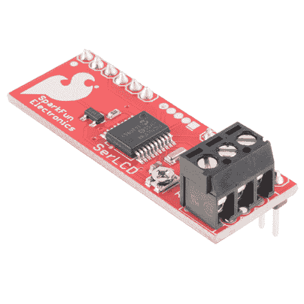

# 基于 PIC 的串行字符 LCD 连接指南

> 原文：<https://learn.sparkfun.com/tutorials/pic-based-serial-enabled-character-lcd-hookup-guide>

## 介绍

基于 PIC 的串行字符液晶显示器(又名 SerLCD)背包是一种基于 HD44780 控制器的简单且经济高效的字符液晶显示器(LCD)接口解决方案。背包简化了所需的电线数量，并允许您的项目显示各种文本和数字。

 

### [SparkFun 连环启用液晶背包](https://www.sparkfun.com/products/retired/258)

[Retired](https://learn.sparkfun.com/static/bubbles/ "Retired") LCD-00258

SparkFun Serial Enabled LCD 背包允许您通过单线串行接口控制基于并行的 LCD。的…

4 **Retired**[Favorited Favorite](# "Add to favorites") 12[Wish List](# "Add to wish list")

SerLCD 背包也可以在各种具有不同配色方案、尺寸和输入电压的串行字符 LCD 上找到。在本教程中，我们将连接到一个支持串行的 LCD，并使用 Arduino 微控制器向显示器发送 ASCII 字符。

### 所需材料

要完成本教程，您至少需要以下材料。根据你所拥有的，你可能不需要清单上的所有东西。将它添加到您的购物车，通读指南，并根据需要调整购物车。