# PicoBuck 连接指南 v12

> 原文：<https://learn.sparkfun.com/tutorials/picobuck-hookup-guide-v12>

## 介绍

Please note that this tutorial is for the newest version of the PicoBuck, V12\. If you have an older version of the PicoBuck, please refer to [this tutorial](https://learn.sparkfun.com/tutorials/picobuck-hookup-guide).

* * *

与 protofusion 的 [Ethan Zonca 合作开发的](http://protofusion.org/wordpress/) [PicoBuck](https://www.sparkfun.com/products/13705) 是一款小尺寸、三路输出、恒流 LED 驱动器。默认情况下，每个通道以 330mA 驱动；可以通过向电路板提供模拟电压或 PWM 信号来降低该电流。该板的版本 12 增加了一个可焊接跳线，可闭合该跳线以将最大电流提高至 660mA。它还提高了评估板上各种元件的额定电压，使评估板可以在 AL8860 器件的最高 36V 额定电压下使用。

必须注意的是，PicoBuck 设计用于点亮单个 led 或串联 led。大多数 LED 灯条设计为由恒定电压供电，不应与 PicoBuck 一起使用。

[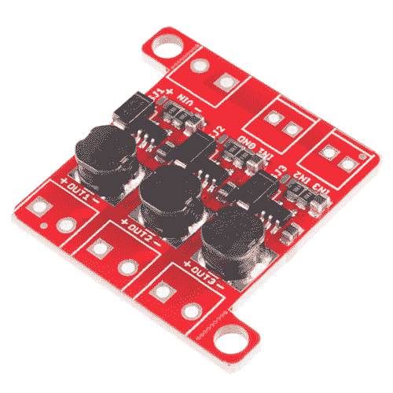](https://www.sparkfun.com/products/13705) 

将**添加到您的[购物车](https://www.sparkfun.com/cart)中！**

### [PicoBuck LED 驱动](https://www.sparkfun.com/products/13705)

[In stock](https://learn.sparkfun.com/static/bubbles/ "in stock") COM-13705

PicoBuck LED 驱动器是一款经济且易于使用的驱动器，允许您控制和混合三种不同的 LED…

$17.5011[Favorited Favorite](# "Add to favorites") 21[Wish List](# "Add to wish list")** **[https://www.youtube.com/embed/HVArbGBlvgo?t=1m7s/?autohide=1&border=0&wmode=opaque&enablejsapi=1](https://www.youtube.com/embed/HVArbGBlvgo?t=1m7s/?autohide=1&border=0&wmode=opaque&enablejsapi=1)

### 推荐阅读

使用 PicoBuck 之前，您应该了解以下一些主题。如果您需要更多信息，请查看。

[](https://learn.sparkfun.com/tutorials/voltage-current-resistance-and-ohms-law) [### 电压、电流、电阻和欧姆定律](https://learn.sparkfun.com/tutorials/voltage-current-resistance-and-ohms-law) Learn about Ohm's Law, one of the most fundamental equations in all electrical engineering.[Favorited Favorite](# "Add to favorites") 132[](https://learn.sparkfun.com/tutorials/pulse-width-modulation) [### 脉宽灯](https://learn.sparkfun.com/tutorials/pulse-width-modulation) An introduction to the concept of Pulse Width Modulation.[Favorited Favorite](# "Add to favorites") 46[](https://learn.sparkfun.com/tutorials/resistors) [### 电阻](https://learn.sparkfun.com/tutorials/resistors) A tutorial on all things resistors. What is a resistor, how do they behave in parallel/series, decoding the resistor color codes, and resistor applications.[Favorited Favorite](# "Add to favorites") 57[](https://learn.sparkfun.com/tutorials/light-emitting-diodes-leds) [### 发光二极管](https://learn.sparkfun.com/tutorials/light-emitting-diodes-leds) Learn the basics about LEDs as well as some more advanced topics to help you calculate requirements for projects containing many LEDs.[Favorited Favorite](# "Add to favorites") 67[](https://learn.sparkfun.com/tutorials/electric-power) [### 电力](https://learn.sparkfun.com/tutorials/electric-power) An overview of electric power, the rate of energy transfer. We'll talk definition of power, watts, equations, and power ratings. 1.21 gigawatts of tutorial fun 54

## 微微降压概述

由于 PicoBuck 是一个恒流驱动器，从电源汲取的电流会随着电源电压的升高而下降。在 12V 电压下，PicoBuck 以每个 LED 350ma 的功率驱动我们的 [Luxeon Rebel 三重播放板](https://www.sparkfun.com/products/9738)上的三个 LED，而从电源中消耗的总功率不到 350ma**。您还可以使用该板来驱动任何高功率 LED，如下所示。PicoBuck 非常适合与三路输出高功率 RGB LED 配合使用，或者驱动几个串联的高功率 LED。**

**[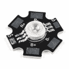](https://www.sparkfun.com/products/15200) 

将**添加到您的[购物车](https://www.sparkfun.com/cart)中！**

### [三路输出大功率 RGB LED](https://www.sparkfun.com/products/15200)

[In stock](https://learn.sparkfun.com/static/bubbles/ "in stock") COM-15200

这款每通道 3W、三路输出的高功率 RGB LED 肯定能为您添加的任何项目提供大量照明。

$5.50[Favorited Favorite](# "Add to favorites") 12[Wish List](# "Add to wish list")****[](https://www.sparkfun.com/products/13104) 

将**添加到您的[购物车](https://www.sparkfun.com/cart)中！**

### [【LED-3W 铝 PCB (5 个装，暖白色)](https://www.sparkfun.com/products/13104)

[In stock](https://learn.sparkfun.com/static/bubbles/ "in stock") COM-13104

如此小的封装却有如此大的功率和亮度。这 5 包“温暖的”白色 3 瓦铝背印刷电路板肯定会脱落…

$8.957[Favorited Favorite](# "Add to favorites") 21[Wish List](# "Add to wish list")****[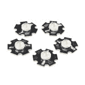](https://www.sparkfun.com/products/13105) 

将**添加到您的[购物车](https://www.sparkfun.com/cart)中！**

### [【LED-3W 铝 PCB (5 个装，冷白色)](https://www.sparkfun.com/products/13105)

[In stock](https://learn.sparkfun.com/static/bubbles/ "in stock") COM-13105

如此小的封装却有如此大的功率和亮度。这 5 包“酷”白色 3 瓦铝背印刷电路板肯定会脱落…

$8.954[Favorited Favorite](# "Add to favorites") 15[Wish List](# "Add to wish list")****[](https://www.sparkfun.com/products/retired/13106) 

### [【LED-3W 铝 PCB (5 个装，红色)](https://www.sparkfun.com/products/retired/13106)

[Retired](https://learn.sparkfun.com/static/bubbles/ "Retired") COM-13106

如此小的封装却有如此大的功率和亮度。这 5 包红色 3 瓦铝背印刷电路板肯定会脱落很多李…

3 **Retired**[Favorited Favorite](# "Add to favorites") 7[Wish List](# "Add to wish list")[](https://www.sparkfun.com/products/retired/13107) 

### [【LED-3W 铝 PCB (5 个装，蓝色)](https://www.sparkfun.com/products/retired/13107)

[Retired](https://learn.sparkfun.com/static/bubbles/ "Retired") COM-13107

如此小的封装却有如此大的功率和亮度。这 5 包蓝色 3 瓦铝背印刷电路板肯定会脱落很多 l…

**Retired**[Favorited Favorite](# "Add to favorites") 3[Wish List](# "Add to wish list")[](https://www.sparkfun.com/products/retired/13185) 

### [【LED-3W 铝制 PCB (5 个装，绿色)](https://www.sparkfun.com/products/retired/13185)

[Retired](https://learn.sparkfun.com/static/bubbles/ "Retired") COM-13185

如此小的封装却有如此大的功率和亮度。这 5 包绿色 3 瓦铝背印刷电路板肯定会脱落很多…

**Retired**[Favorited Favorite](# "Add to favorites") 2[Wish List](# "Add to wish list")****** ******### 控制引脚

三路信号输入用于调光控制。您可以使用来自 Arduino 或您最喜欢的微控制器的 PWM 信号来单独调光每个通道，或者您可以将它们全部连接到同一个 PWM 来同时调光。提供一个单独的接地引脚(标有 GND ),作为控制模块的精确基准。两对引脚的引脚间距为 0.1”，但两对引脚之间的间距为 0.2”，以允许使用[2.54 毫米螺距螺钉端子对](https://www.sparkfun.com/products/10571)，或移除中间引脚的五位置标准 0.1”接头。

[](https://www.sparkfun.com/products/116) 

将**添加到您的[购物车](https://www.sparkfun.com/cart)中！**

### [破开头球——直击](https://www.sparkfun.com/products/116)

[In stock](https://learn.sparkfun.com/static/bubbles/ "in stock") PRT-00116

一排标题-打破适应。40 个引脚，可切割成任何尺寸。用于定制 PCB 或通用定制接头。

$1.7520[Favorited Favorite](# "Add to favorites") 133[Wish List](# "Add to wish list")****[](https://www.sparkfun.com/products/10158) 

将**添加到您的[购物车](https://www.sparkfun.com/cart)中！**

### [断后头——龙](https://www.sparkfun.com/products/10158)

[In stock](https://learn.sparkfun.com/static/bubbles/ "in stock") PRT-10158

这些是我们【标准】的加长版(http://www . spark fun . com/commerce/product _ info . PHP？products_id=116)挣脱他…

$3.253[Favorited Favorite](# "Add to favorites") 14[Wish List](# "Add to wish list")****[](https://www.sparkfun.com/products/10571) 

将**添加到您的[购物车](https://www.sparkfun.com/cart)中！**

### [【螺丝端子 2.54mm 螺距(2 针)](https://www.sparkfun.com/products/10571)

[In stock](https://learn.sparkfun.com/static/bubbles/ "in stock") PRT-10571

这些是带有 2.54 毫米间距引脚的简单双位螺丝端子。额定高达 150 伏@ 6A，这个终端可以接受 30 至 18A…

$0.953[Favorited Favorite](# "Add to favorites") 18[Wish List](# "Add to wish list")****** ******调光可以通过模拟电压(通过在 0.0V-2.5V 范围内改变电压，最大电流的 20%-100%)或 PWM(只要 PWM 最小电压小于 0.4V，最大电压大于 2.4V 但不超过 5V)在整个 0-100%范围内完成。避免 5V 以上的模拟电压，因为这可能会损坏器件。

[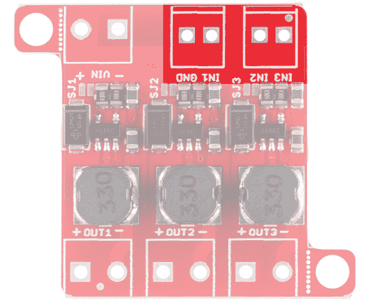](https://cdn.sparkfun.com/assets/learn_tutorials/4/4/3/Pico_02.png)*Signal Inputs*

### 输入电压(VIN)

与输出焊盘一样，电源焊盘的尺寸适用于 3.5 毫米螺丝端子。

[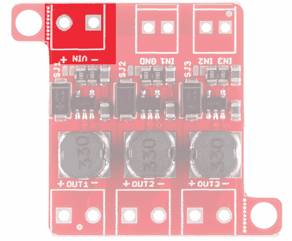](https://cdn.sparkfun.com/assets/learn_tutorials/4/4/3/Pico_01.png)*Power Input*

[3.5 毫米螺丝端子](https://www.sparkfun.com/products/8084)或[连接线](https://www.sparkfun.com/products/11367)可根据您的个人喜好用于连接引脚。

[](https://www.sparkfun.com/products/11367) 

将**添加到您的[购物车](https://www.sparkfun.com/cart)中！**

### [](https://www.sparkfun.com/products/11367)

[In stock](https://learn.sparkfun.com/static/bubbles/ "in stock") PRT-11367

各种颜色的电线:你知道这是一个美丽的东西。六种不同颜色的硬纸板实芯焊丝…

$21.5037[Favorited Favorite](# "Add to favorites") 86[Wish List](# "Add to wish list")****[](https://www.sparkfun.com/products/11375) 

将**添加到您的[购物车](https://www.sparkfun.com/cart)中！**

### [](https://www.sparkfun.com/products/11375)

[In stock](https://learn.sparkfun.com/static/bubbles/ "in stock") PRT-11375

各种颜色的电线:你知道这是一个美丽的东西。六种不同颜色的绞线装在一个纸板盒里…

$22.5019[Favorited Favorite](# "Add to favorites") 46[Wish List](# "Add to wish list")****[](https://www.sparkfun.com/products/8084) 

将**添加到您的[购物车](https://www.sparkfun.com/cart)中！**

### [](https://www.sparkfun.com/products/8084)螺距 3.5mm 的螺丝端子(2 针)

[In stock](https://learn.sparkfun.com/static/bubbles/ "in stock") PRT-08084

将端子 3.5 毫米节距销与滑动锁紧装置拧在一起，形成您需要的任何尺寸。额定高达 125V @ 6A，并可接受…

$1.05[Favorited Favorite](# "Add to favorites") 23[Wish List](# "Add to wish list")****** ******### 通道输出

输出焊盘也适用于 3.5 毫米螺丝端子。每个输出都独立于其他两个输出。

[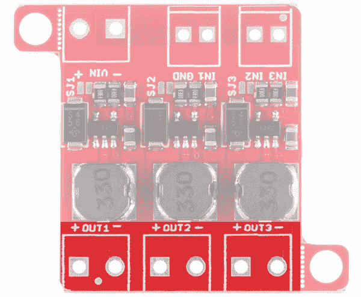](https://cdn.sparkfun.com/assets/learn_tutorials/4/4/3/Pico_05.png)*Output Pads***Note:** The PicoBuck **cannot** be used to drive a common anode or common cathode LED or LED string, and the individual channel +/- pads **must not** be connected to one another.

#### 每个通道的默认电流输出

每个通道都有一个小跳线，允许您将驱动强度从 330mA 增加到 660mA。关于这一点的更多信息可以在下面找到。

[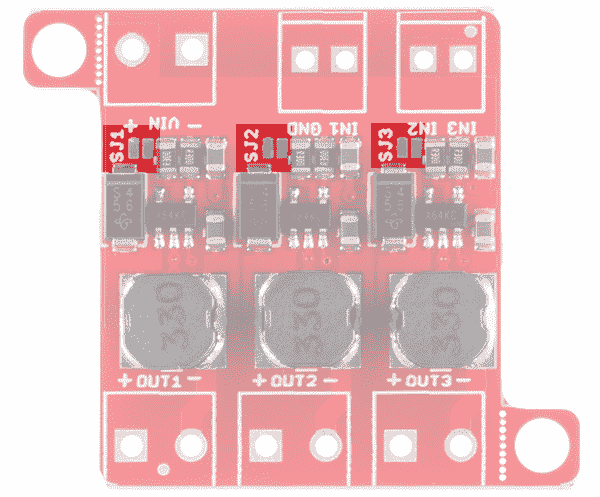](https://cdn.sparkfun.com/assets/learn_tutorials/4/4/3/Pico_03.png)*Solder Jumpers*

#### 交流输出

可以将 PicoBuck 板的最大电流提高到每通道 1A；为此，用较小的值替换三个电流检测电阻。要计算新电阻值，请使用以下公式:

**I[LED] = 0.1 / R[set]**

因此，对于 1A 电流，需要一个 0.1ω的电阻。别忘了警惕当前的收视率。在 1A，感应电阻将消耗 1/10W，所以你可能需要一个至少 1/8W 额定值的电阻。封装是标准的 0805。

[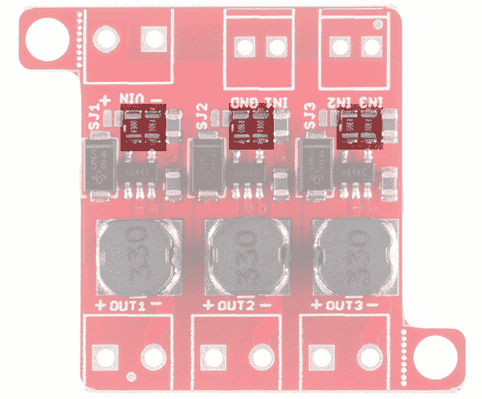](https://cdn.sparkfun.com/assets/learn_tutorials/4/4/3/Pico_04.png)*Current Set Resistors*

#### 关闭电流设置跳线

[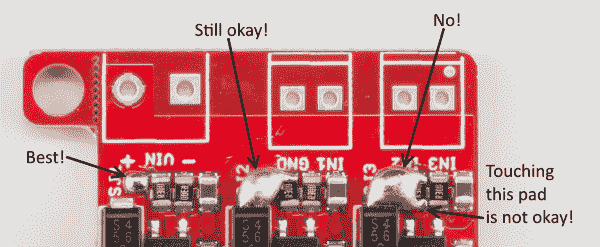](https://cdn.sparkfun.com/assets/learn_tutorials/4/4/3/picobuck_jumpers.png)

从上图可以看出，跳线不需要特别整齐地闭合。无论如何，它附近的所有焊盘都与它相连，所以如果你多上一点焊料，没什么大不了的。注意不要让电阻短路，就像最右边的电路一样！

### 安装孔

电路板的每一侧都有两个用于 4-40 或 M3 螺丝的安装孔。它们是穿孔的，因此如果需要更小的尺寸，可以用一把钳子很容易地将其折断。

[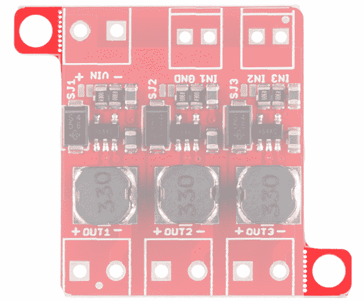](https://cdn.sparkfun.com/assets/learn_tutorials/4/4/3/Pico_06.png)*Mounting Holes*

## 用微控制器调光

如前所述，PicoBuck 的三个通道可以通过在 0-2.5V 范围内改变通道的输入电压或使用 PWM 信号来单独调光。您可以使用电容触摸电位计等预编程微控制器，或者使用任何带 PWM 输出的微控制器自定义控制每个通道。

### 预编程电容式触摸电位计

如果您正在寻找具有电容触摸功能的预编程微控制器，请查看[触摸电位计](https://learn.sparkfun.com/tutorials/touch-potentiometer-hookup-guide#example-1-pwm-lighting-controller)。还有其他软件可用于微调电容式触摸电位计的设置。

| [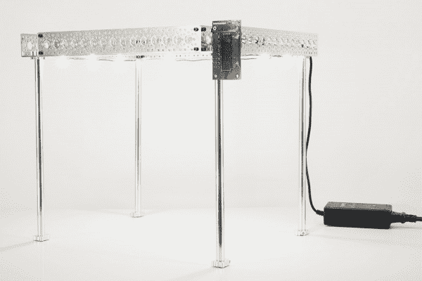](https://learn.sparkfun.com/tutorials/touch-potentiometer-hookup-guide#example-1-pwm-lighting-controller) |
| *触摸电位器用于 [PWM 照明控制器](https://learn.sparkfun.com/tutorials/touch-potentiometer-hookup-guide#example-1-pwm-lighting-controller)* |

### 阿尔杜伊诺

否则，来自 Arduino 板的 PWM 信号也非常适合这种情况。

#### 每个通道连接一个 LED

下图显示了如何将 PicoBuck 连接到 Arduino。

[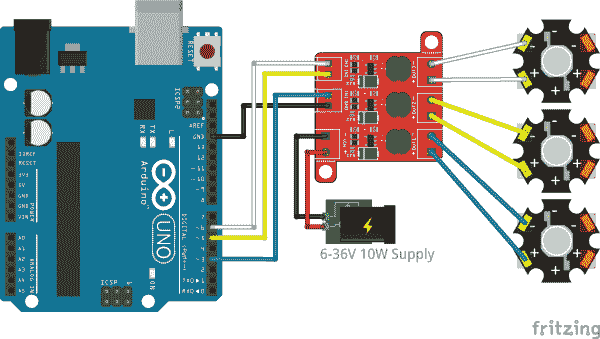](https://cdn.sparkfun.com/assets/learn_tutorials/4/4/3/picobuck_1led.png)

请注意，每个通道必须独立连接到它要驱动的 LED 的+和-连接！**不要**将任何两个通道的+或-连接在一起。

**Note:** When using an external supply for the PicoBuck, the grounds of the two boards must be connected! If the power supply is 12V or less, the Arduino can be powered from it as well, but do not attempt to power the PicoBuck from the Arduino if you are using anything higher! Below are a few power options and accessories that can be used with the PicoBuck

[](https://www.sparkfun.com/products/10288) 

将**添加到您的[购物车](https://www.sparkfun.com/cart)中！**

### [DC 筒式千斤顶适配器——母](https://www.sparkfun.com/products/10288)

[In stock](https://learn.sparkfun.com/static/bubbles/ "in stock") PRT-10288

此适配器允许您将筒式插孔连接器连接到裸线。一端有螺丝端子，另一端有一个 5.5…

$3.501[Favorited Favorite](# "Add to favorites") 24[Wish List](# "Add to wish list")****[](https://www.sparkfun.com/products/15701) 

将**添加到您的[购物车](https://www.sparkfun.com/cart)中！**

### [【spark fun ATX 电源连接器转接套件- 12V/5V (4 针)](https://www.sparkfun.com/products/15701)

[Only 11 left!](https://learn.sparkfun.com/static/bubbles/ "only 11 left!") KIT-15701

ATX 电源连接器从一个墙壁适配器上为您的 12V 和 5V 设备断开标准的 4 针计算机外围设备端口…

$19.504[Favorited Favorite](# "Add to favorites") 16[Wish List](# "Add to wish list")****[](https://www.sparkfun.com/products/14338) 

将**添加到您的[购物车](https://www.sparkfun.com/cart)中！**

### [全局电源- 15V 4.34A](https://www.sparkfun.com/products/14338)

[In stock](https://learn.sparkfun.com/static/bubbles/ "in stock") PRT-14338

这不是你的普通电源。全局电源是一个 15V，4.34A 的电源设备，专门设计用于…

$34.95[Favorited Favorite](# "Add to favorites") 0[Wish List](# "Add to wish list")****[](https://www.sparkfun.com/products/retired/298) 

### [墙壁适配器电源- 9VDC 650mA](https://www.sparkfun.com/products/retired/298)

[Retired](https://learn.sparkfun.com/static/bubbles/ "Retired") TOL-00298

专为 Spark Fun Electronics 制造的高质量开关“壁式电源”AC 到 DC 9V 650mA 壁式电源。T…

12 **Retired**[Favorited Favorite](# "Add to favorites") 23[Wish List](# "Add to wish list")[](https://www.sparkfun.com/products/retired/13758) 

### [电源- 24V (5A)](https://www.sparkfun.com/products/retired/13758)

[Retired](https://learn.sparkfun.com/static/bubbles/ "Retired") TOL-13758

该 5A 电源输出 24v 直流电压，端接一个中心正极 5.5 x 2.1mm 毫米筒形连接器。

**Retired**[Favorited Favorite](# "Add to favorites") 4[Wish List](# "Add to wish list")****** ******#### 每个通道不止一个 LED

如图所示，多个 led 可以串联连接，并且电源电压应该比 led 的正向电压之和至少高 2-3V。

[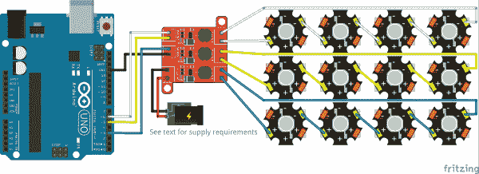](https://cdn.sparkfun.com/assets/learn_tutorials/4/4/3/picobuck_4led.png)

每个通道可以连接多个发光二极管；如上所示，它们应该串联连接，电源电压必须比 led 正向电压之和至少高 1-2V。

例如，我们的[蓝色 3W led](https://www.sparkfun.com/products/13107)具有 3.2V 至 3.8V 的正向电压。为了安全起见，请使用该范围内的最高电压。如果您想要连接其中的四个，您需要大约 17V 或更高的电源(3.8V+3.8V+3.8V+3.8V = 15.2v；加 2V 的“头部空间”)。

由于 17V 高于 Arduino 可以承受的输入电压，我们还必须为 Arduino 提供外部电源。这可以是标准的 5V USB 电源。

只要所有的 led 能够处理电流(330mA 或 660mA，取决于跳线设置)，在通道之间或在一个通道上混合颜色是完全可以接受的。只要确保电源电压足够高，能够处理最高电压串的总电压。也不要求三串发光二极管具有相同的发光二极管正向电压；通道 1 上可以有一个白色 LED，通道 2 上有两个红色 LED，通道 3 上有四个绿色 LED。

#### Arduino 代码示例

**注意:**此示例假设您在桌面上使用的是最新版本的 Arduino IDE。如果这是你第一次使用 Arduino，请回顾我们关于[安装 Arduino IDE 的教程。](https://learn.sparkfun.com/tutorials/installing-arduino-ide)

控制这个设备的代码很简单；只需使用`analogWrite()`功能通过 PWM 调节亮度。

```
language:c
/**
 * PicoBuck Breakout Example
 * Mike Hord @ SparkFun Electronics
 * Nov 5 2015
 * 
 * A simple example showing how to control a PicoBuck with an Arduino.
 * 
 * License: http://opensource.org/licenses/MIT
 * 
 * THE SOFTWARE IS PROVIDED "AS IS", WITHOUT WARRANTY OF ANY KIND, EXPRESS OR
 * IMPLIED, INCLUDING BUT NOT LIMITED TO THE WARRANTIES OF MERCHANTABILITY,
 * FITNESS FOR A PARTICULAR PURPOSE AND NONINFRINGEMENT. IN NO EVENT SHALL THE
 * AUTHORS OR COPYRIGHT HOLDERS BE LIABLE FOR ANY CLAIM, DAMAGES OR OTHER
 * LIABILITY, WHETHER IN AN ACTION OF CONTRACT, TORT OR OTHERWISE, ARISING FROM,
 * OUT OF OR IN CONNECTION WITH THE SOFTWARE OR THE USE OR OTHER DEALINGS IN
 * THE SOFTWARE.
 */

const int CHL_1 = 3;
const int CHL_2 = 5;
const int CHL_3 = 6;

void setup()
{
    pinMode(CHL_1, OUTPUT);
    pinMode(CHL_2, OUTPUT);
    pinMode(CHL_3, OUTPUT);
}

void loop()
{
    // Let's just step through a couple of values, so we can see how they look.
    //  Remember, LEDs are non-linear, so doubling the PWM output value won't
    //  necessarily double the apparent brightness.
    analogWrite(CHL_1, 0);
    analogWrite(CHL_2, 0);
    analogWrite(CHL_3, 0);
    delay(1000);

    analogWrite(CHL_1, 64);
    analogWrite(CHL_2, 64);
    analogWrite(CHL_3, 64);
    delay(1000);

    analogWrite(CHL_1, 255);
    analogWrite(CHL_2, 255);
    analogWrite(CHL_3, 255);
    delay(1000);
} 
```

**Tip:** Looking for more inspiration for mixing colors individually? Try using [Arduino.cc's Color Cross Fader example](https://www.arduino.cc/en/Tutorial/ColorCrossfader) to mix the colors like a rainbow if you are using the high power RGB LED.

[](https://cdn.sparkfun.com/assets/learn_tutorials/7/1/0/TertiaryColorWheel_Chart.png)
Try checking the example that was used in the [LilyPad ProtoSnap Plus Activity Guide for custom color mixing with tertiary colors](https://learn.sparkfun.com/tutorials/lilypad-protosnap-plus-activity-guide/3-custom-color-mixing). Just make sure to update the pin definitions.

[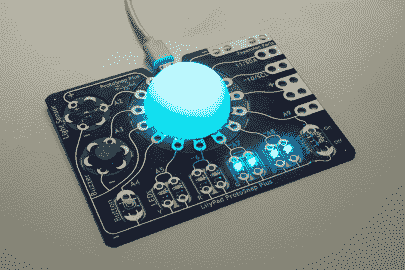](https://learn.sparkfun.com/tutorials/lilypad-protosnap-plus-activity-guide/3-custom-color-mixing)

*RGB LED Lighting Up from [Experiment 3: Custom Color Mixing](https://learn.sparkfun.com/tutorials/lilypad-protosnap-plus-activity-guide/3-custom-color-mixing)*
Or try using the code from the [Non-Addressable RGB LED Strip Hookup Guide](https://learn.sparkfun.com/tutorials/non-addressable-rgb-led-strip-hookup-guide). While the code was written for RGB strips with transistors, the code functions the same with the the PickBuck.

[](https://learn.sparkfun.com/tutorials/non-addressable-rgb-led-strip-hookup-guide) [### 不可寻址的 RGB LED 灯条连接指南

#### 2020 年 2 月 19 日](https://learn.sparkfun.com/tutorials/non-addressable-rgb-led-strip-hookup-guide) Add color to your projects with non-addressable LED strips! These are perfect if you want to control and power the entire strip with one color for your props, car, fish tank, room, wall, or perhaps under cabinet lighting in your home.[Favorited Favorite](# "Add to favorites") 2

* * *

## 资源和更进一步

感谢阅读。下面是你需要了解更多关于 PicoBuck 的文档和链接。

*   [微微降压原理图](https://cdn.sparkfun.com/assets/learn_tutorials/4/4/3/picoBuckv12.pdf)
*   [PicoBuck GitHub 知识库](https://github.com/sparkfun/PicoBuck)
*   [AL8860 数据手册](https://cdn.sparkfun.com/assets/learn_tutorials/4/4/3/AL8860.pdf)
*   [原融合页面](http://protofusion.org/wordpress/2013/03/picobuck-rgb-led-driver/)
*   [SparkFun 产品展示区](https://youtu.be/HVArbGBlvgo?t=1m7s)

要获得更多 LED 乐趣，请查看其他 SparkFun 教程:

[](https://learn.sparkfun.com/tutorials/touch-potentiometer-hookup-guide) [### 触摸电位计连接指南](https://learn.sparkfun.com/tutorials/touch-potentiometer-hookup-guide) Learn how to use the SparkFun Touch Potentiometer to control lighting, volume or other inputs in your daily life.[Favorited Favorite](# "Add to favorites") 7[](https://learn.sparkfun.com/tutorials/how-leds-are-made) [### 发光二极管是如何制造的](https://learn.sparkfun.com/tutorials/how-leds-are-made) We take a tour of a LED manufacturer and learn how PTH 5mm LEDs are made for SparkFun.[Favorited Favorite](# "Add to favorites") 18[](https://learn.sparkfun.com/tutorials/femtobuck-constant-current-led-driver-hookup-guide-v13) [### FemtoBuck 恒流 LED 驱动器连接指南 v13](https://learn.sparkfun.com/tutorials/femtobuck-constant-current-led-driver-hookup-guide-v13) The FemtoBuck board is a high-efficiency, single-channel constant-current LED driver.[Favorited Favorite](# "Add to favorites") 1[](https://learn.sparkfun.com/tutorials/button-pad-hookup-guide) [### 按钮垫连接指南](https://learn.sparkfun.com/tutorials/button-pad-hookup-guide) An introduction to matrix scanning, using the SparkFun 4x4 Button Pad.[Favorited Favorite](# "Add to favorites") 15****************************