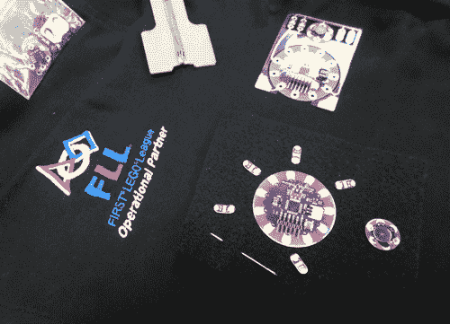

# 规划可穿戴电子项目

> 原文：<https://learn.sparkfun.com/tutorials/planning-a-wearable-electronics-project>

## 介绍

对于初学者来说，可穿戴电子产品可能是最迷人但又最令人沮丧的活动之一。除了电路设计和编码，我们还必须考虑到缝纫所涉及的施工时间，以及电路可能附着的不同织物或材料的利弊。这里有一个使用 LilyPad 或其他可穿戴产品规划成功项目的指南。

## 推荐阅读

*   [用导电线缝制](https://learn.sparkfun.com/tutorials/sewing-with-conductive-thread)
*   [电子纺织基础知识](https://learn.sparkfun.com/tutorials/e-textile-basics)
*   [短路](https://learn.sparkfun.com/tutorials/what-is-a-circuit/short-and-open-circuits)

## 头脑风暴

让我们从我们的项目看起来像什么和它做什么的粗略轮廓开始。使用适合您的方法，例如:

*   创建一个灵感板或学院
*   在笔记本上画草图
*   为项目功能或设计写一份功能或想法的清单
*   做网上研究，收集灵感项目
*   列出你想要使用的硬件的愿望清单
*   旧货购物或者在你的衣橱里寻找可以建造的物品

**Knowing Your Limits**

It's very easy to dream up a fantastically complex project beyond your personal capabilities, especially when starting out with a new technology. Planning and sketching out your ideas will help give a sense of scale and time needed to complete your project. If you are brand new to wearables, why not try adapting an existing project from one of our [tutorials](https://learn.sparkfun.com/tutorials/tags/e-textiles), or starting with a smaller project that may take a few hours versus a few weeks to complete?

#### 其他头脑风暴技巧:

*   把你可能要用的部件和原材料，如布料或特殊物品，连同你的头脑风暴草图一起列出来。
*   如果从一个现有的服装/面料项目开始:拍摄照片，绘制草图，或者在纸上描绘关键细节，以帮助规划电路布局。
*   如果从头开始设计一件衣服:在你的图案制作过程中做出慎重的决定，包括组件可能连接的地方或者线路(导电线)可能运行的地方。
*   在施工前确定任何问题区域——项目中是否有难以缝合或接近的地方？

*This student used printed LilyPad images to plan exact placement of a patch that would later be sewn behind the logo of a t shirt.*

## 项目规划清单

以下是规划项目细节时需要考虑的问题清单:

#### 基材/面料是什么？

它是精致的，有弹性的，薄的吗？你可能需要加固材料，如衬布，这样组件就不会松脱或在织物上移动。

#### 项目需要有多持久？

是一次性的展示品还是会得到大量的使用(比如需要多次演出才能存活下来的剧场项目)？有时，将组件焊接在一起可能比缝纫更耐用。如果你决定将元件焊接在一起，硅胶线是一个很好的选择。[带状电缆](https://www.sparkfun.com/products/10648)也可能是多线程项目的一个好选择，例如 LilyPad 像素板所需的三到四个连接。

加强或覆盖高弯曲或磨损区域的组件也是延长项目寿命的一个考虑因素。

#### 我到底想不想看赛道？

将元件隐藏在层或衬里下将保持电路的“神奇”品质，而在服装上建造可以将电路板作为装饰元素。尝试用珠子、亮片或纽扣等装饰性物品，有策略地隐藏组件，使它们融为一体。如果使用带有金属饰面的装饰物品，涂上透明指甲油，以避免线或部件意外短路。

#### 是否容易接触到任何开关、电池或传感器？

考虑这些输入将如何使用——对于穿戴者来说，哪里是接触这些组件的最明智的地方？例如，将开关藏在衣服后面会使穿着者无法使用(除非它们超级灵活)。更好的位置可能是沿着腰围或袖子。

一些可穿戴技术，如 [EL Wire](https://www.sparkfun.com/products/11421) ，需要更大的逆变器和电池包，这可能不太适合一些服装设计。其他的，如[聚合物锂离子电池](https://www.sparkfun.com/products/13112)，可能很脆弱，需要一个特殊的袋子或放置在远离尖锐物体或潜在挤压的地方。关于为你的项目提供动力的更多信息，请看我们的[教程](https://learn.sparkfun.com/tutorials/how-to-power-a-project)。

#### 电路将如何绝缘？

大多数服装或可穿戴项目将在身体上移动，容易短路。对于相互靠近的导电线迹，我们建议对项目进行绝缘，以防止意外短路。查看我们的[电子纺织品绝缘技术](https://learn.sparkfun.com/tutorials/insulation-techniques-for-e-textiles)教程，了解一些想法。这应该是你的项目的最后一步，一旦它被测试(在一个平的，非金属表面上)并且在它被磨损之前**。**

## 样机研究

收集了头脑风暴期间计划的材料和元件后，就该制作电路原型了。为了避免将东西缝合在一起却发现它们没有按您计划的方式工作的挫败感，我们建议使用鳄鱼夹来临时连接 LilyPad 组件，然后测试电路和/或代码。

如果使用 Protosnap 形式的产品，如 [ProtoSnap LilyTwinkle](https://www.sparkfun.com/products/11590) 、 [ProtoSnap LilyPad 开发板 Simple](https://www.sparkfun.com/products/11201) 或 [ProtoSnap LilyPad 开发板](https://www.sparkfun.com/products/11262)，您可以跳过鳄鱼夹，因为这些板有连接它们的迹线。如果在 Protosnap 板上添加额外的传感器或元件，请使用鳄鱼夹。

*An example of prototyping with alligator clips from our [LilyTiny Plush Monster Tutorial](https://learn.sparkfun.com/tutorials/lilytiny-plush-monster).*

如果您正在使用微控制器，现在是时候开始编写一些代码(或改编一些示例代码)了。在构建之前完成的项目行为或交互的基本框架将有助于过程中后期的任何故障排除。请记住，只要您在设计中留下容易访问的连接点(如果使用 LilyPad Arduino，则为 FTDI 头),您就可以随时返回并细化或编辑您的代码。

## 优化您的设计

完成元件的一些基本原型制作后，花些时间做一个更精细的电路布局草图或图表。这是一个捕捉设计中任何问题的机会(交叉导电线路径，缺少组件空间等)。)在你开始建造过程之前。如果组件在构建过程中被放错位置或移动，这个最终草图也可以作为指导。

*An example of a design layout created in a graphics program - note the inclusion of a diagram of the garment as well as detailed labeling of the hook ups for the boards.**This project uses a handout created by [Creativity Labs](http://creativitylabs.com/) to finalize the circuit layout.*

#### 烧结图解

Fritzing 是一个伟大的开源工具，它允许你设计原理图和接线图。该程序允许你在一个窗口中拖放组件，并在它们之间拖动电线，以进行头脑风暴或记录连接。如果你更喜欢计算机生成的电路图而不是手绘，Fritzing 是一个很好的选择，它还预装了许多 LilyPad 组件。

*An example of a LilyPad Arduino project diagram created with Fritzing.*

完成最终草图后，是时候连接电子设备了。根据您的设计，您也可以将裁剪好的片段放在项目上，以帮助规划最终的放置。

Make sure to unplug any power source or battery while moving the pieces to avoid short circuits caused by accidental disconnection of alligator clips or components touching each other during movement.

## 构建时间

既然我们已经完成了所有讨厌的计划，是时候建立一个项目了！

**施工提示:**

*   将工作分成几个部分或几个阶段，比如先缝制一个 LilyPad Arduino，然后批量制作 led 或传感器。
*   如果可能，在完成连接时制作原型并进行测试。这将在项目完成之前发现任何问题，并在您进行过程中留出更多时间来修复或更改。
*   永远不要在通电的项目上工作！请记住，导电线本质上是不绝缘的电线。如果您正在测试项目的一部分，请确保在再次开始构建之前拔掉电源或关闭电源。

## 资源和更进一步

**硬件连接指南和可穿戴技术资源:**

*   [光子可佩戴防护罩连接指南](https://learn.sparkfun.com/tutorials/photon-wearable-shield-hookup-guide)
*   [lily pad MP3 播放器入门](https://learn.sparkfun.com/tutorials/getting-started-with-the-lilypad-mp3-player)
*   [LilyPad 简易电源连接指南](https://learn.sparkfun.com/tutorials/lilypad-simple-power-hookup-guide)
*   [电子纺织品的绝缘技术](https://learn.sparkfun.com/tutorials/insulation-techniques-for-e-textiles)

**项目创意:**

*   [可穿戴设备的声音和运动反应](https://learn.sparkfun.com/tutorials/hackers-in-residence---sound-and-motion-reactivity-for-wearables)
*   [龙与地下城骰子战书](https://learn.sparkfun.com/tutorials/dungeons-and-dragons-dice-gauntlet)
*   [魔术师马里奥的神奇翻领花](https://learn.sparkfun.com/tutorials/mario-the-magicians-magical-lapel-flower)