# 预先组装的 40 引脚 Pi 楔形连接指南

> 原文：<https://learn.sparkfun.com/tutorials/preassembled-40-pin-pi-wedge-hookup-guide>

## 介绍

[预先组装的 40 针 Pi 楔](https://www.sparkfun.com/products/13717)是我们 Pi 楔系列的最新成员。这是一个很好的方法，让那些讨厌的圆周率引脚打破了试验板，使他们可以很容易地使用。

[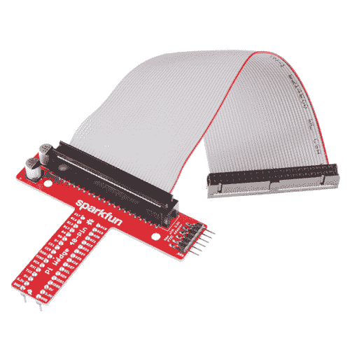](https://www.sparkfun.com/products/13717) 

将**添加到您的[购物车](https://www.sparkfun.com/cart)中！**

### [spark funπ楔](https://www.sparkfun.com/products/13717)

[Out of stock](https://learn.sparkfun.com/static/bubbles/ "out of stock") BOB-13717

这是 SparkFun Pi Wedge，一个连接到 Raspberry Pi 上的 40 针 GPIO 连接器并断开 Pi 的小电路板…

$12.9512[Favorited Favorite](# "Add to favorites") 46[Wish List](# "Add to wish list")** **[https://www.youtube.com/embed/0f5KykDQn6I?t=167/?autohide=1&border=0&wmode=opaque&enablejsapi=1](https://www.youtube.com/embed/0f5KykDQn6I?t=167/?autohide=1&border=0&wmode=opaque&enablejsapi=1)

*Check out the Pi Wedge in the product showcase at [2:47](https://youtu.be/0f5KykDQn6I?t=167)!*

这种 Pi 楔与带有 40 针 GPIO 接头的 Pi 系列兼容，包括

*   树莓 Pi 型号 A+
*   [树莓 Pi 型号 B+](https://www.sparkfun.com/products/12995)
*   [树莓 Pi 2 型](https://www.sparkfun.com/products/13297)

它将最新 Pis 上的 40 针 GPIO 连接器适配为试验板友好的外形，并通过类似的功能重新排列引脚。此外，GPIO 引脚按升序排列。

这个版本也完全组装-没有焊接是必需的！

*The Pi Wedge, shown with a Pi B+.*

### 本教程涵盖的内容

*   [背景](https://learn.sparkfun.com/tutorials/preassembled-40-pin-pi-wedgehookup-guide#background) -圆周率楔形体是如何形成的
*   [组装](https://learn.sparkfun.com/tutorials/preassembled-40-pin-pi-wedgehookup-guide#assembly) -如何连接 FTDI、带状电缆和试验板
*   [引脚映射](https://learn.sparkfun.com/tutorials/preassembled-40-pin-pi-wedgehookup-guide#pin-mapping) -楔形上的丝印代表什么
*   [逻辑电平和功率](https://learn.sparkfun.com/tutorials/preassembled-40-pin-pi-wedgehookup-guide#logic-levels-and-power) -关于连接到 Pi 的电气信息
*   [一些附加资源](https://learn.sparkfun.com/tutorials/preassembled-40-pin-pi-wedgehookup-guide#resources--going-further)

但在开始之前，请查看这些链接，重温一下您可能不熟悉的主题:

### 推荐阅读

*   [如何使用试验板](https://learn.sparkfun.com/tutorials/how-to-use-a-breadboard)
*   [设置启动卡](http://elinux.org/RPi_Easy_SD_Card_Setup)
*   [串行通信](https://learn.sparkfun.com/tutorials/serial-communication)

### 建议观看

*   树莓派入门
    *   [第一部分](https://www.youtube.com/watch?v=b6h95jNWg1g)
    *   [第二部分](https://www.youtube.com/watch?v=6HeRyrr4i9k)
    *   [第三部分](https://www.youtube.com/watch?v=1tEMRCtXALM)

## 背景

在围绕 Raspberry Pi 开发诸如 [Twitter Monitor](https://learn.sparkfun.com/tutorials/raspberry-pi-twitter-monitor) 和 [Great American Tweet Race](https://twitter.com/Gr8AmTweetRace) 等项目的过程中，我们发现在试图将 Pi 扩展为包含外部硬件的原型时，我们经历了一些成长的烦恼。

[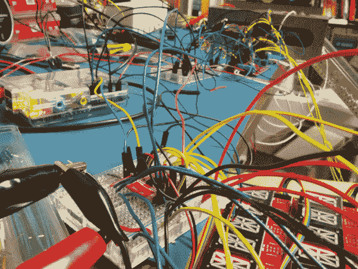](https://cdn.sparkfun.com/assets/learn_tutorials/2/3/6/IMG_20131101_145337.jpg)*There's a Pi somewhere in this ratsnest*

Raspberry Pi 型号 B+有一个 40 引脚连接器，可以访问多个通信接口，以及 GPIO 和电源。但连接器没有详细的标签，原生引脚排列有些杂乱无章。用于类似功能的引脚并不总是组合在一起，电源和接地引脚没有明显的模式。

引脚也不容易转换成无焊试验板。我们的第一个项目使用了一堆刚刚插入接头的 F-M 跳线。当东西停止工作时，他们会做很多“最激烈的摇晃”。

#### 拔靴带

除了使用 I/O 连接器的物理问题之外，开始使用全新的 Raspberry Pi B+似乎总是涉及鸡和蛋的问题。我们只想 SSH 到它，所以我们可以使用命令行。但是为了 SSH 到它，我们需要知道它的 IP 地址...当然，通过在命令行上运行`ifconfig`最容易了解 IP 地址。

### 解决方案

[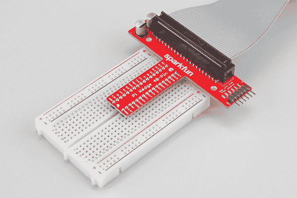](https://cdn.sparkfun.com/assets/learn_tutorials/4/3/2/wedge_breadboard.jpg)*Meet the 40-Pin Pi Wedge*

Pi 楔形 B+连接到 40 针 GPIO 连接器，并以试验板友好的排列和间距将引脚分开。它在电源线上添加了一对去耦电容，并使初始上电过程更容易——您可以将一个 [FTDI 基本](https://www.sparkfun.com/products/9873)模块插入串行端口。

## 装配

### 内容

预装配的 Pi 楔形板带有楔形 PCB 和一根 40 针带状电缆。

### 关系

40 针带状电缆用于将楔形物连接到 Pi。此电缆是极化的，请注意引脚 1 标记非常细微。在 Pi 楔形 PCB 端，电缆上的齿将与屏蔽接头上的凹口相接。将 IDC 电缆插入 Pi 楔的极化连接器，使电缆远离试验板连接。

[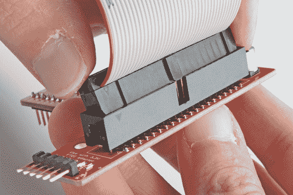](https://cdn.sparkfun.com/assets/learn_tutorials/4/3/2/ribbon-on-wedge.jpg)*Inserting the ribbon cable*

将楔子插入试验板的中心，使每个引脚都有自己的一排。

Wedge inserted in breadboard.

Pi 上的头部本身没有任何东西来帮助保证对齐。你需要注意把它连接好。Pi 上的引脚 1 在丝网印刷的矩形上标有折角。带状电缆连接器上有一个(几乎看不见的)小三角形，用于标记插针 1。第一个 pin 也编码在电线上，例如下面照片中的红色标记(尽管它也可能是另一种颜色，例如黑色或深蓝色)。将 IDC 电缆插入 Pi，使电缆远离 Pi。

[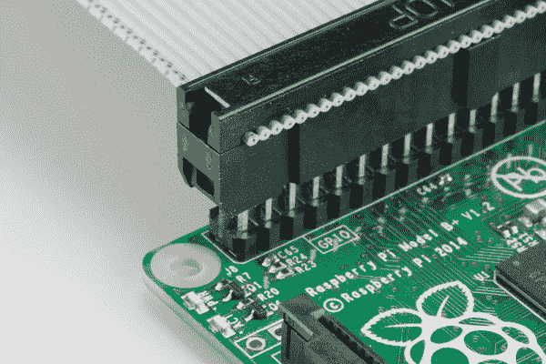](https://cdn.sparkfun.com/assets/learn_tutorials/4/3/2/ribbon-on-pi.jpg)*Proper pin-1 orientation*[**Note:**](#enclosure_limitations) If you are using an enclosure (like the Pi 4 heat sink case, you may want to consider using an extension header to properly connect the Pi Wedge's IDC cable to the Raspberry Pi's GPIO pins.

[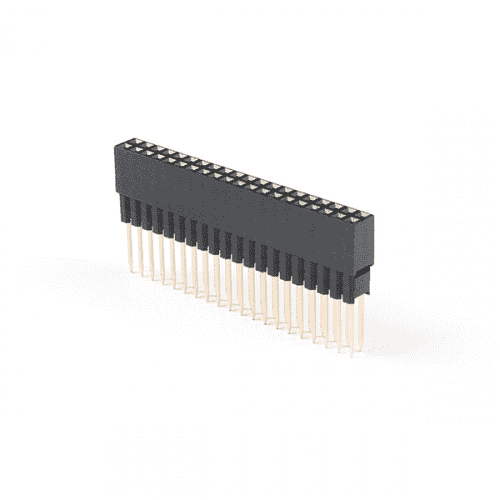](https://www.sparkfun.com/products/16764) 

将**添加到您的[购物车](https://www.sparkfun.com/cart)中！**

### [扩展 GPIO 母头- 2x20 引脚(13.5 毫米/9.80 毫米)](https://www.sparkfun.com/products/16764)

[In stock](https://learn.sparkfun.com/static/bubbles/ "in stock") PRT-16764

这种 2x20 引脚母接头旨在允许您扩展任何具有标准 2x20 GPIO 引脚尺寸的电路板。

$2.25[Favorited Favorite](# "Add to favorites") 7[Wish List](# "Add to wish list")**** 

将**添加到您的[购物车](https://www.sparkfun.com/cart)中！**

### 扩展 GPIO 母接头- 2x20 引脚(16mm/7.30mm)

[In stock](https://learn.sparkfun.com/static/bubbles/ "in stock") PRT-16763

这种 2x20 引脚母接头旨在允许您扩展任何具有标准 2x20 GPIO 引脚尺寸的电路板。

$2.25[Favorited Favorite](# "Add to favorites") 8[Wish List](# "Add to wish list")********Extension headers are also useful when stacking HAT's with other single board computers that utilize the Pi's standard 2x20 GPIO header like the Google Coral and NVIDIA Jetson.

The [extension header with 9.80mm pin length [ PRT-16764 ]](https://www.sparkfun.com/products/16764) is useful when sandwiching a PCB between a Pi and HAT. The header can also be used to sandwich a board betwen the Pi and Pi Wedge's IDC cable. The [extension header with 7.30mm pin length [ PRT-16763 ]](https://www.sparkfun.com/products/16763) uses three plastic spacers which cover the pins more when using a HAT or the Pi Wedge's IDC cable.

| [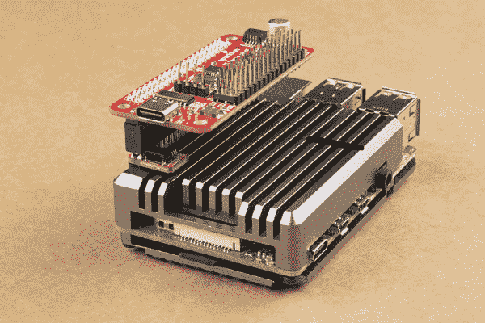](https://cdn.sparkfun.com/assets/learn_tutorials/1/1/3/1/Raspberry_Pi_2x20_Header_Stackable_Header_PCB_Sandwiched.jpg) |  |
| *具有 9.80 毫米销长的延伸接头用于帮助将 Qwiic 垫片和 Pi 伺服帽堆叠在带散热器的 Pi 4 上* | *引脚长度为 7.30 毫米的扩展接头用于将 Pi 楔的 IDC 电缆连接到带散热器的 Pi 4* |

The height of the enclosure and PCB varies depending on the design. The image below shows a Pi 3 in the enclosure. The overall height of the enclosure is lower than the Pi 4's heat sink enclosure, so one 2x20 extension header was needed when stacking the Qwiic pHAT v2.0 on the Pi. You may need to stack additional extension headers so that the boards have enough clearance when using other enclosures and PCBs sandwiched between the Pi and IDC cable.

[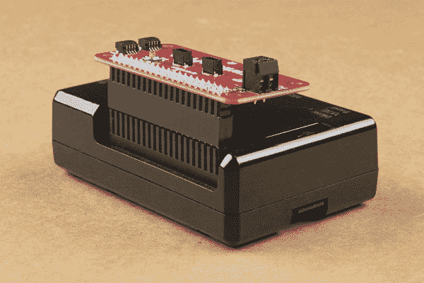](https://cdn.sparkfun.com/assets/learn_tutorials/1/1/3/1/Raspberry_Pi_2x20_Header_Stackable_Header_Varying_Enclosure_Height.jpg)**** ****如果您决定使用串行连接到 Pi，您可以将 3.3V FTDI 插入到 Pi 楔中。FTDI 连接器需要正确对齐。确保两块板上的“GRN”和“BLK”标记一致。

[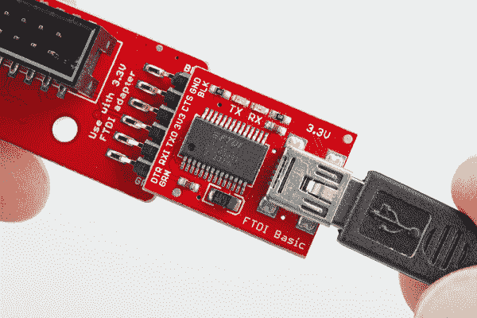](https://cdn.sparkfun.com/assets/learn_tutorials/4/3/2/ftdi-plugged.jpg)*Proper 3.3V FTDI-Basic orientation*

您的设置将类似于下图。在这种情况下，我们在外壳中使用了 Pi 3。

在下一节中，我们将探讨来自 Pi 的信号如何映射到楔形区。

## 引脚映射

### 随 b+变化

当 Raspberry Pi 基金会推出 B+时，他们将 GPIO 头从 26 个扩展到 40 个引脚。这些变化在 A+和 Pi 2 Model B 中得以延续。连接器增加了 9 个 GPIO 引脚以及 ID_SC 和 ID_SD 引脚来识别外设，您可以在我们的 [SPI 和 I2C 教程](https://learn.sparkfun.com/tutorials/raspberry-pi-spi-and-i2c-tutorial#i2c-0-on-40-pin-pi-boards)中了解更多信息。

### 信号位置

Pi 楔形重组 Pi 上的 I/O 引脚，将相似的功能放在相邻的引脚上。SPI、I2C 和 UART 信号都靠近彼此分组。

[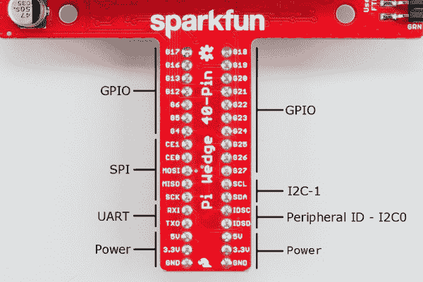](https://cdn.sparkfun.com/assets/learn_tutorials/4/3/2/PIN-LABELS.png)*Functional Groupings*

虽然标签很短，但引脚上有标签，以适应 PCB 上的可用空间。UART、SPI 和 I2C 引脚标有其通信总线功能，但在该模式下配置时，它们也可用作 GPIO 引脚。

下表显示了 Pi 楔上的信号分配，包括适当的外设和备用 GPIO 分配。

| **楔形丝** | **Python (BCM)** | **WiringPi GPIO** | **名称** | **名称** | **WiringPi GPIO** | **Python (BCM)** | **楔形丝** |
| G17 | Seventeen | Zero | GPIO17 (GPIO_GEN0) | GPIO18 (GPIO_GEN1) | one | Eighteen | G18 |
| G16 | Sixteen | Twenty-seven | GPIO16 | GPIO19 | Twenty-four | Nineteen | G19 |
| G13 | Thirteen | Twenty-three | GPIO13 | GPIO20 | Twenty-eight | Twenty | 二十国集团 |
| G12 | Twelve | Twenty-six | GPIO12 | GPIO21 | Twenty-nine | Twenty-one | G21 |
| G6 | six | Twenty-two | GPIO06 | GPIO22 (GPIO_GEN3) | three | Twenty-two | G22 |
| G5 | five | Twenty-one | GPIO05 | GPIO23 (GPIO_GEN4) | four | Twenty-three | G23 |
| G4 | four | seven | GPIO04 (GPIO_GCLK) | GPIO24 (GPIO_GEN5) | five | Twenty-four | G24 |
| 这一个 |  | Eleven | GPIO7 (SPI_CE1_N) | GPIO25 (GPIO_GEN6) | six | Twenty-five | G25 |
| 这是 0 |  | Ten | GPIO8 (SPI_CE0_N) | GPIO26 | Twenty-five | Twenty-six | G26 |
| MOSI |  | Twelve | GPIO10 (SPI_MOSI) | GPIO27 (GPIO_GEN2) | Two | Twenty-seven | G27 |
| 军事情报部门组织(Military Intelligence Service Organization) |  | Thirteen | GPIO09 (SPI_MISO) | GPIO03 (SCL1，I2C) | nine |  | SCL |
| 血清肌酸激酶 |  | (无工作 y 14) | GPIO11 (SPI_CLK) | GPIO02 (SDA1、I2C) | eight |  | 国家药品监督管理局 |
| RXI |  | Sixteen | GPIO15 (UART_RXD0) | GPIO0，ID_SC (I2C ID SC EEPROM) | Thirty-one |  | IDSC |
| TXO |  | Fifteen | GPIO14 (UART_TXDO) | GPIO1，ID_SD (I2C ID 标清 EEPROM) | Thirty |  | ids 不能登录 |
|  |  |  | 5V | 5V |  |  |  |
|  |  |  | 3.3V | 3.3V |  |  |  |
|  |  |  | 地面 | 地面 |  |  |  |

*Pi Wedge B+ Pin-Function mapping***Heads up!** The pinout is with respect to the Pi Wedge. If you are looking for the pinout with respect to the Pi's header, check out the table in the Raspberry gPIo tutorial.

[Raspberry gPIo: GPIO Pinout](https://learn.sparkfun.com/tutorials/raspberry-gpio#gpio-pinout)

## 逻辑电平和功率

### 逻辑电平

Pi 使用 3.3V 逻辑电平，不支持 5V。许多外围设备能够在 3.3V 下运行，但如果您需要与 5V 设备接口，请使用电平转换器，如 [TXB0104 分线点](https://www.sparkfun.com/products/11771)。

### 通信

6 针 FTDI 接头上的信号也被限制为 3.3V 逻辑电平。确保使用的是 [3.3V FTDI 模块](https://www.sparkfun.com/products/9873)，而不是 5V 模块。

### 力量

了解 Pi 的电源对于成功使用它至关重要，尤其是将其构建到更大的系统中时。

Raspberry Pi B+比它的前辈更高效，因为它用开关调节器取代了以前的线性功率调节器链。

最近公布的原理图是针对 [Raspberry Pi B+](http://www.raspberrypi.org/documentation/hardware/raspberrypi/schematics/README.md) 的，我们假设 Pi2 型号 B 和 A+是类似的。查看这些原理图，我们看到 5V 电压通过连接器 J1 进入电路板，这是一个微型 USB 连接器，但只有电源和接地引脚相连。来自该连接器的 5V 电压通过一个保险丝和一个晶体管电路，该电路可以防止电源极性错误，然后继续在电路板上传输，无需任何进一步的调节。Pi 楔上的 5V 连接直接来自这条线。

在 B+上，5V 电压进入双开关调节器，进一步降低到 3.3V 和 1.8V。调节后的 3.3V 电压出现在 I/O 连接器上。

[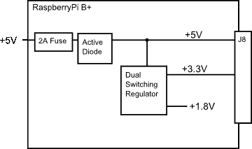](https://cdn.sparkfun.com/assets/learn_tutorials/3/2/5/Power-regulators.png)

根据总体需求和可用性，在 Pi 部署中可以应用多种电源策略。

#### 通过 GPIO 连接器供电

为小型外部电路供电最明显的策略是直接从 GPIO 连接器获得电源。要为试验板上的小电路供电，可以从 5V 或 3.3V 跳线，并将楔形件上的引脚接地，连接到试验板上的供电轨。

[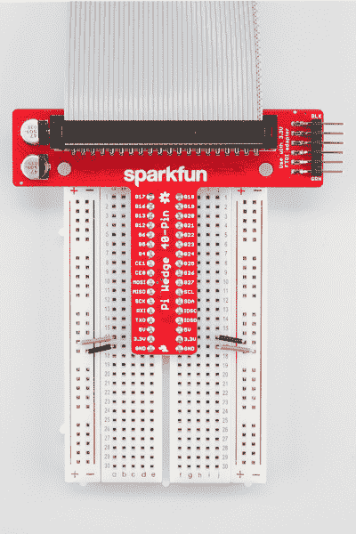](https://cdn.sparkfun.com/assets/learn_tutorials/4/3/2/power-rail-ties.jpg)*Jumpering power to the breadboard rails*

虽然这是获取电力的最直接方式，但它仅适用于小型电路。B+本身仅限于 5V 线路的 2A 总量，其中大部分是 B+本身所需的。3.3V 引脚的[规定限值为 50 毫安](http://elinux.org/RPi_Low-level_peripherals#Power_pins)。

如果您正在开发外部电路，并且在测试时 Pi 重置，您可能会超出电流限制。当我们添加 SPI 控制的 7 段 led 显示屏时，我们看到了这种情况——如果我们点亮太多段，系统就会崩溃。对于功耗更高的电路，我们需要探索一些替代方案。

#### 菊花链

下一个电源选项是将电路的每个部分直接连接到电源。这意味着外设不受 Pi 本身的保险丝和调节器的电流限制。

[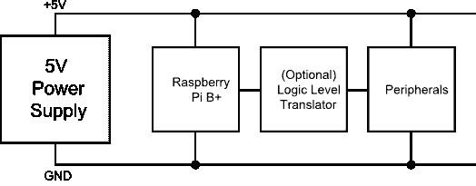](https://cdn.sparkfun.com/assets/learn_tutorials/3/2/5/daisyBplus.png)*The peripherals are powered directly by the supply directly*

对于使用 5V 逻辑的外设，它们还应包括 [3.3V/5V 逻辑电平转换](https://learn.sparkfun.com/tutorials/logic-levels)。

#### 通过 J8 反向供电

如上所述，简单的部署可以通过 J8 的 5V 和 3.3V 引脚为外设供电，但也可以通过这些线路为 Pi 供电。Pi 基金会称之为“反向供电”，并对其实施提出了一些建议。

[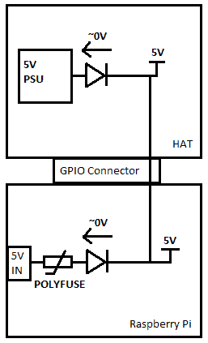](https://cdn.sparkfun.com/assets/learn_tutorials/3/2/5/backpowering-diagram.png)

第一个建议是复制 Pi 上看到的保险丝和 MOSFET + BJT 电源保护电路。该电路是“理想二极管”电路的变体。

[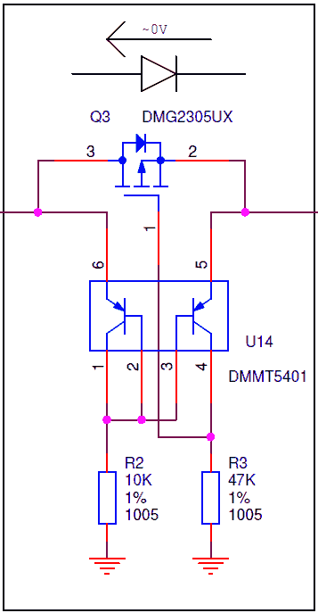](https://cdn.sparkfun.com/assets/learn_tutorials/3/2/5/zvd-circuit.png)

它有几个用途:

*   在正常情况下，电源通过 micro-USB 插头进入，MOSFET 完全偏置，因此只有极小的压降，而典型的肖特基或硅二极管会下降 0.3V 或更多。
*   其次，如果微型 USB 插头的电源极性不正确，它会阻止电源流动。
*   第三，如果电路板通过 J8 供电，它可以防止从 J1 获取电源，以防止两个电源同时存在时发生争用。

另一个建议是，帽子需要能够提供 5V，+/- 5%，至少 1.3 A 可用于 Pi。

## 资源和更进一步

如果你想更详细地了解楔形体及其界面，请查阅以下资料:

*   为了更深入地了解用 Python 和 C 语言为 Pi 上的 I/O 编程，请看一下我们的 [Raspberry gPIo](https://learn.sparkfun.com/tutorials/raspberry-gpio) 教程。
*   如果你想使用楔断的同步串行接口，可以了解更多 in out [I2C & SPI 教程](https://learn.sparkfun.com/tutorials/raspberry-pi-spi-and-i2c-tutorial)
*   PCB 的设计文件和一些 WiringPi 软件示例可以在 [40 引脚 Pi Wedge](https://github.com/sparkfun/Pi_Wedge_40-Pin_PreAssembled) GitHib 库中找到。

 [### 树莓 gPIo](https://learn.sparkfun.com/tutorials/raspberry-gpio) How to use either Python or C++ to drive the I/O lines on a Raspberry Pi.[Favorited Favorite](# "Add to favorites") 17 [### 树莓派 SPI 和 I2C 教程](https://learn.sparkfun.com/tutorials/raspberry-pi-spi-and-i2c-tutorial) Learn how to use serial I2C and SPI buses on your Raspberry Pi using the wiringPi I/O library for C/C++ and spidev/smbus for Python.[Favorited Favorite](# "Add to favorites") 24 [### Python 编程教程:Raspberry Pi 入门](https://learn.sparkfun.com/tutorials/python-programming-tutorial-getting-started-with-the-raspberry-pi) This guide will show you how to write programs on your Raspberry Pi using Python to control hardware.[Favorited Favorite](# "Add to favorites") 27 [### Python GUI 指南:Tkinter 简介](https://learn.sparkfun.com/tutorials/python-gui-guide-introduction-to-tkinter) Tkinter is the standard graphical user interface package that comes with Python. This tutorial will show you how to create basic windowed applications as well as complete full-screen dashboard examples complete with live graph updates from matplotlib.[Favorited Favorite](# "Add to favorites") 24

寻找更多灵感？查看其他 Rasperry Pi 教程:

 [### Python 编程教程:Raspberry Pi 入门](https://learn.sparkfun.com/tutorials/python-programming-tutorial-getting-started-with-the-raspberry-pi) This guide will show you how to write programs on your Raspberry Pi using Python to control hardware.[Favorited Favorite](# "Add to favorites") 27 [### Pi AVR 程序员帽连接指南](https://learn.sparkfun.com/tutorials/pi-avr-programmer-hat-hookup-guide) In this tutorial, we will use a Raspberry Pi 3 and the Pi AVR Programmer HAT to program an ATMega328P target. We are going to first program the Arduino bootloader over SPI, and then upload an Arduino sketch over a USB serial COM port.[Favorited Favorite](# "Add to favorites") 3 [### SparkFun Qwiic 三轴加速度计(ADXL313)连接指南](https://learn.sparkfun.com/tutorials/sparkfun-qwiic-3-axis-accelerometer-adxl313-hookup-guide) Let's get moving with the SparkFun Triple Axis Digital Accelerometer Breakout - ADXL313 (Qwiic), a low cost, low power, up to 13-bit resolution, 3-axis accelerometer with a 32-level FIFO stack capable of measuring up to ±4g. This hookup guide will get users started reading measurements from the ADXL313, by Analog Devices, with an Arduino microcontroller, Jetson Nano, or Raspberry Pi.[Favorited Favorite](# "Add to favorites") 3 [### 用于 Raspberry Pi 连接指南的 Qwiic 垫片套件](https://learn.sparkfun.com/tutorials/qwiic-shim-kit-for-raspberry-pi-hookup-guide) Get started with the Serial LCD with RGB backlight and 9DoF IMU (ICM-20948) via I2C using the Qwiic system and Python on a Raspberry Pi! Take sensor readings and display them in the serial terminal or SerLCD.[Favorited Favorite](# "Add to favorites") 0

有关 Raspberry Pi B+和这里描述的软件的更多信息，请访问他们的网站。

*   [树莓派基金会](http://raspberrypi.org)
*   Pi 基金会的 [B+插件](http://www.raspberrypi.org/forums/viewforum.php?f=100)论坛。
*   Pi Foundation 的 GitHub 知识库中的 [Raspberry Pi B+ HATs](https://github.com/raspberrypi/hats) 。
*   eLinux.org[树莓派外设](http://elinux.org/RPi_Peripherals)指南
*   [电线皮](http://wiringpi.com/)
*   [RPi。GPIO 模块](http://sourceforge.net/projects/raspberry-gpio-python/)
*   关于增加来自 [B+ USB 端口](https://projects.drogon.net/testing-setting-the-usb-current-limiter-on-the-raspberry-pi-b/)的可用电流的一些说明。

* * *

如果您有任何问题，我们的技术支持部门可以提供帮助。请不要犹豫与我们联系。我们也喜欢听你的项目！******