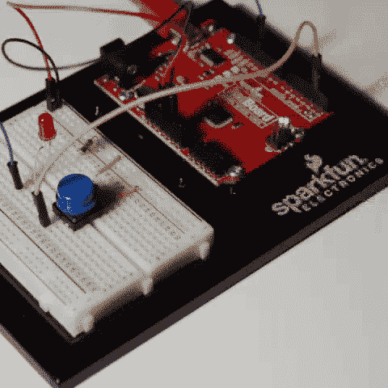
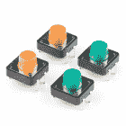
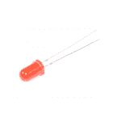
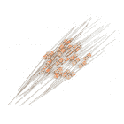
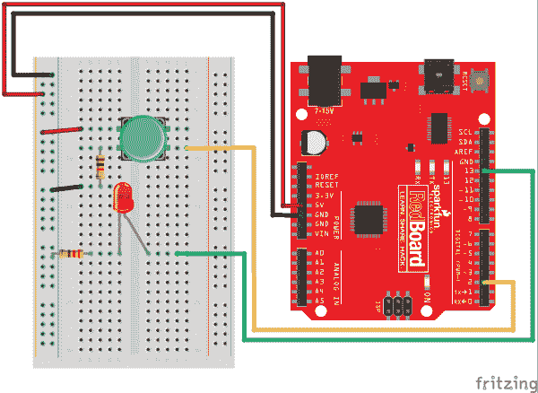
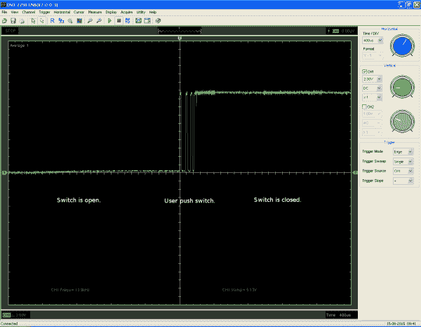
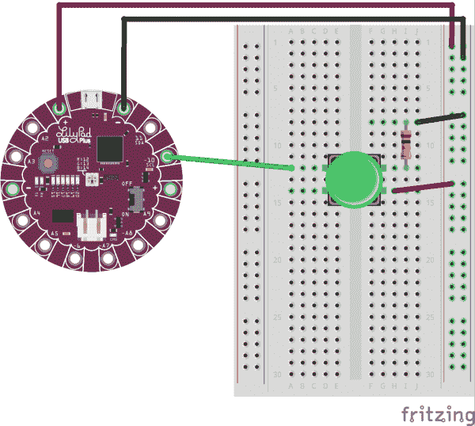
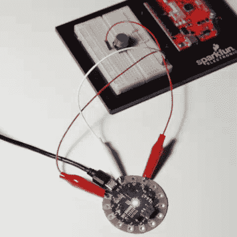

# Arduino 处理器中断

> 原文：<https://learn.sparkfun.com/tutorials/processor-interrupts-with-arduino>

## 介绍

**中断**——它们是什么？他们是间歇地阻止你做当前工作的人。哈！也许吧...但我们真正想知道的是它们在嵌入式电子和微处理器环境中是什么。

让我们再问一次，什么是中断？简而言之，有一种方法可以让处理器在执行正常程序的同时持续监控某种事件或中断。有两种类型的中断:

*   **硬件中断** -这些中断是对外部事件的响应，比如引脚变高或变低。

*   **软件中断** -这些中断是对软件指令的响应。

一般来说，大多数 8 位 AVR 微控制器(即 Arduinos)天生不具备软件中断能力，因此出于本教程的目的，我们将专注于硬件中断。

[](https://cdn.sparkfun.com/assets/learn_tutorials/3/1/6/LED_Demo_1.gif)

### 推荐阅读

如果您不熟悉以下概念，我们建议您在继续之前查看这些教程。

[](https://learn.sparkfun.com/tutorials/what-is-an-arduino) [### 什么是 Arduino？](https://learn.sparkfun.com/tutorials/what-is-an-arduino) What is this 'Arduino' thing anyway? This tutorials dives into what an Arduino is and along with Arduino projects and widgets.[Favorited Favorite](# "Add to favorites") 50[](https://learn.sparkfun.com/tutorials/installing-arduino-ide) [### 安装 Arduino IDE](https://learn.sparkfun.com/tutorials/installing-arduino-ide) A step-by-step guide to installing and testing the Arduino software on Windows, Mac, and Linux.[Favorited Favorite](# "Add to favorites") 16[](https://learn.sparkfun.com/tutorials/how-to-install-ftdi-drivers) [### 如何安装 FTDI 驱动程序](https://learn.sparkfun.com/tutorials/how-to-install-ftdi-drivers) How to install drivers for the FTDI Basic on Windows, Mac OS X, and Linux.[Favorited Favorite](# "Add to favorites") 12

## 它是如何工作的？

当事件或中断发生时，处理器立即注意到，保存其执行状态，运行一小块代码(通常称为**中断处理程序**或**中断服务程序**)，然后返回到之前的状态。

程序员定义当程序本身发生特定中断时要执行的代码。在 Arduino 中，我们使用一个名为`attachInterrupt()`的函数来做这件事，推荐的语法看起来类似于下面的输出。

```
language:c
attachInterrupt(digitalPinToInterrupt(pin), ISR, mode) 
```

这个函数有三个参数:

*   **第一个参数(即`digitalPinToInterrupt(pin)` )** -中断的管脚号，告诉微处理器要监控哪个管脚。引脚取决于所用的微控制器。

*   **第二个参数(即`ISR`)**——如果这个中断被触发，我们要执行的代码的位置。

*   **第三个参数(即`mode` )** -告诉它寻找什么类型的触发:逻辑高、逻辑低或两者之间的转换。

要了解更多关于哪些引脚是为中断保留的以及一些示例代码，请查看 Arduino 的 [attachInterrupt()页面](https://www.arduino.cc/reference/en/language/functions/external-interrupts/attachinterrupt/)。

[Arduino.cc: attachInterrupt()](https://www.arduino.cc/reference/en/language/functions/external-interrupts/attachinterrupt/)**Note:** If you need to use a pin as an interrupt that is not listed in the default pins for your AVR microcontroller, you may want to try using the [PinChangeInt Arduino library](https://github.com/GreyGnome/PinChangeInt). The library provides an alternative to add pin change interrupts on any of the AVR-based Arduino pins.

[Arduino.cc: PinChangeInt Library](https://playground.arduino.cc/Main/PinChangeInt/)

## 硬件连接

在接下来的章节中，我们将通过一个简单的例子来理解中断以及它们是如何工作的。如果你想跟随，拿一个[火花红板](https://www.sparkfun.com/products/13975)，一个 [LED](https://www.sparkfun.com/products/9590) ，一个[按钮](https://www.sparkfun.com/products/14460)， [330 &欧姆；电阻器](https://www.sparkfun.com/products/14490)、[跳线](https://www.sparkfun.com/products/8431)和一根[电缆](https://www.sparkfun.com/products/13243)为其供电。

[](https://www.sparkfun.com/products/13975) 

将**添加到您的[购物车](https://www.sparkfun.com/cart)中！**

### [spark fun red board——用 Arduino 编程 T3](https://www.sparkfun.com/products/13975)

[In stock](https://learn.sparkfun.com/static/bubbles/ "in stock") DEV-13975

SparkFun RedBoard 结合了 UNO 的 Optiboot 引导程序的简单性、FTDI 的稳定性和 shield com…

$21.5049[Favorited Favorite](# "Add to favorites") 89[Wish List](# "Add to wish list")****[](https://www.sparkfun.com/products/14460) 

将**添加到您的[购物车](https://www.sparkfun.com/cart)中！**

### [多色纽扣 4 片装](https://www.sparkfun.com/products/14460)

[In stock](https://learn.sparkfun.com/static/bubbles/ "in stock") PRT-14460

这是一个简单的 4 包瞬间多色按钮，非常适合各种项目！与 mult 的先前迭代不同…

$1.75[Favorited Favorite](# "Add to favorites") 19[Wish List](# "Add to wish list")****[](https://www.sparkfun.com/products/8431) 

将**添加到您的[购物车](https://www.sparkfun.com/cart)中！**

### [跳线高级 6 "米/米装 10 根](https://www.sparkfun.com/products/8431)

[In stock](https://learn.sparkfun.com/static/bubbles/ "in stock") PRT-08431

这是一个 SparkFun 独家！这些是 155 毫米长、26 AWG 跳线，两端都有公接头。用这些来跳离…

$4.502[Favorited Favorite](# "Add to favorites") 11[Wish List](# "Add to wish list")****[](https://www.sparkfun.com/products/9590) 

将**添加到您的[购物车](https://www.sparkfun.com/cart)中！**

### [LED -基本红色 5mm](https://www.sparkfun.com/products/9590)

[In stock](https://learn.sparkfun.com/static/bubbles/ "in stock") COM-09590

发光二极管-那些闪闪发光的东西。电源指示、引脚状态、光电传感器和有趣的闪烁显示器的必备组件。…

$0.45[Favorited Favorite](# "Add to favorites") 11[Wish List](# "Add to wish list")****[](https://www.sparkfun.com/products/14490) 

将**添加到您的[购物车](https://www.sparkfun.com/cart)中！**

### [电阻器 330 欧姆 1/4 瓦 PTH - 20 包(粗引线)](https://www.sparkfun.com/products/14490)

[In stock](https://learn.sparkfun.com/static/bubbles/ "in stock") PRT-14490

这些是普通的 1/4 瓦、+/- 5%容差 PTH 电阻。通常用于试验板和其他原型制作…

$1.05[Favorited Favorite](# "Add to favorites") 10[Wish List](# "Add to wish list")****[](https://www.sparkfun.com/products/13243) 

将**添加到您的[购物车](https://www.sparkfun.com/cart)中！**

### [USB 迷你 B 线-6”](https://www.sparkfun.com/products/13243)

[In stock](https://learn.sparkfun.com/static/bubbles/ "in stock") CAB-13243

这是一条 USB 2.0 型到 Mini-B 型 5 针黑色电缆。你知道，通常带有 USB 集线器、摄像头的迷你 B 连接器…

$2.104[Favorited Favorite](# "Add to favorites") 8[Wish List](# "Add to wish list")************ ************将 LED 连接到引脚 13，将按钮连接到引脚 2，如下图所示:

[](https://cdn.sparkfun.com/assets/learn_tutorials/3/1/6/ProcessorInterruptsFritzing_updated.png)

如果你仔细看看你刚刚连接的东西，你会发现 LED 实际上是多余的。我们*可以*只使用引脚 13 上的内置 LED，但出于视觉目的，我们添加了外部 LED。

## 示例:简单中断

**Note:** This example assumes you are using the latest version of the Arduino IDE on your desktop. If this is your first time using Arduino, please review our tutorial on [installing the Arduino IDE.](https://learn.sparkfun.com/tutorials/installing-arduino-ide)

现在我们已经连接好了硬件，让我们来看一个简单的例子，它不断地向 LED 发送“关闭”信号。我们将在引脚 2 上附加一个中断；此引脚将监控一个按钮，当按下该按钮时，将向 LED 发送“on”信号，并递增计数器。

大多数 Arduinos 内置了两个外部中断:**中断 0** (在数字引脚 2 上)和**中断 1** (在数字引脚 3 上)。有些主板支持更多功能(如 Arduino Mega 2560)，请参考用户手册或数据表，了解具体主板支持的更多信息。Arduino 在他们的 [attachInterrupt()页面](https://www.arduino.cc/reference/en/language/functions/external-interrupts/attachinterrupt/)上也有更多关于一些主板的细节。由于我们在这里使用的是 RedBoard，因此本例使用引脚 2 来监控中断。

### 简单中断示例 1

为 RedBoard 选择板和 COM 端口。然后上传以下。

```
 /*     
    Simple Interrupt Example 1
    by: Jordan McConnell
    SparkFun Electronics
    created on 10/29/11
    */

    int ledPin = 13;  // LED is attached to digital pin 13
    int x = 0;  // variable to be updated by the interrupt

    void setup() {                
      //enable interrupt 0 (pin 2) which is connected to a button
      //jump to the increment function on falling edge
      pinMode(ledPin, OUTPUT);
      attachInterrupt(0, increment, RISING);
      Serial.begin(9600);  //turn on serial communication
    }

    void loop() {
      digitalWrite(ledPin, LOW);
      delay(3000); //pretend to be doing something useful
      Serial.println(x, DEC); //print x to serial monitor
    }

    // Interrupt service routine for interrupt 0
    void increment() {
        x++;
        digitalWrite(ledPin, HIGH);
    }
```

该程序的主循环每 3 秒钟向 LED 发送一次“关闭”信号。同时，该程序观察数字引脚 2(对应于中断 0)的上升沿。换句话说，它寻找从逻辑低( **0V** )到逻辑高( **5V** )的电压变化，这在按钮被按下时发生。当这种情况发生时，函数`increment`被调用。执行该函数中的代码，变量 x 递增，LED 打开。然后程序返回到主循环中的任何地方。

如果你摆弄它，你会注意到 LED 灯看似随机地亮了一段时间，但不会超过 3 秒。LED 保持亮起的时间取决于您在主循环中中断代码的位置。例如，如果中断正好在延迟功能的中间被触发，则在您点击按钮后，LED 将保持点亮约 1.5 秒。

[](https://cdn.sparkfun.com/assets/learn_tutorials/3/1/6/LED_Demo_1.gif)

### 管理反弹

中断的一个常见问题是，它们通常会为一个事件触发多次。当您查看示例 1 中代码的[串行输出](https://learn.sparkfun.com/tutorials/terminal-basics)时，您会注意到，即使您只按下按钮一次，x 也会增加很多次。为了探究为什么会发生这种情况，我们必须看一看信号本身。如果我们在按下按钮时用示波器监控引脚的电压，结果会是这样:

[](https://cdn.sparkfun.com/assets/learn_tutorials/3/1/6/switchbounce_allaboutcircuits.png)*Image courtesy of [AllAboutCircuits](https://www.allaboutcircuits.com/technical-articles/switch-bounce-how-to-deal-with-it/)*

虽然引脚的主要转换是从低电平到高电平，但在此过程中，有几个尖峰会导致多个中断。这被称为*噪音*或*反弹*。按下一个按钮可能看起来像是一个单独的步骤，但实际上，按钮内的机械部件在进入特定状态之前会接触多次。有几种方法可以解决这个问题。通常，您可以通过添加适当的 RC 滤波器来平滑过渡，从而解决硬件的反弹问题。另一种方法是在第一个中断触发后的一小段时间内，暂时忽略其他中断，从而在软件中解决这个问题。回到我们的老例子，让我们添加一个修正，允许变量 x 只增加一次按钮按下，而不是多次。

### 简单中断示例 2

如果尚未选择，请为红板选择板和 COM 端口。然后上传以下。

```
 /*     
    Simple Interrupt example 2
    by: Jordan McConnell
    SparkFun Electronics
    created on 10/29/11
    */

    int ledPin = 13; // LED is attached to digital pin 13
    int x = 0; // variable to be updated by the interrupt

    //variables to keep track of the timing of recent interrupts
    unsigned long button_time = 0;  
    unsigned long last_button_time = 0; 

    void setup() {                
      //enable interrupt 0 which uses pin 2
      //jump to the increment function on falling edge
      pinMode(ledPin, OUTPUT);
      attachInterrupt(0, increment, RISING);
      Serial.begin(9600);  //turn on serial communication
    }

    void loop() {
      digitalWrite(ledPin, LOW);
      delay(3000); //pretend to be doing something useful
      Serial.println(x, DEC); //print x to serial monitor
    }

    // Interrupt service routine for interrupt 0
    void increment() {
      button_time = millis();
      //check to see if increment() was called in the last 250 milliseconds
      if (button_time - last_button_time > 250)
      {
        x++;
        digitalWrite(ledPin, HIGH);
        last_button_time = button_time;
      }
    }
```

当您按下按钮时，让我们再次查看串行输出。打开设置在 **9600** 波特的串行监视器。注意，每按一次按钮，increment 只被调用一次。这个修复之所以有效，是因为每次执行中断处理程序时，它都会将由`millis()`函数获取的当前时间与上次调用处理程序的时间进行比较。如果它在某个定义的时间窗口内，在这种情况下是四分之一秒，处理器会立即返回到它正在做的事情。如果没有，它执行`if`语句中的代码，更新变量`x`，打开 LED 并更新`last_button_time`变量，这样函数就有了一个新值，可以与将来被触发时进行比较。

### 中断优先级

两个中断同时发生会怎么样？大多数 AVR 不支持我们所说的*中断优先级*。如果两个中断同时发生，或者队列中有两个或更多的中断在等待，优先级由它们的向量地址的顺序决定。首先服务较低的向量地址，*复位*将优先于所有中断请求。同样，您的数据手册将提供更多关于特定电路板的信息。

## 示例:中断 LED 序列

当处理长序列的事情时，中断也可以派上用场。让我们来看另一个简单的 LED 例子——假设我们将使用 [LilyPad USB Plus](https://www.sparkfun.com/products/14631) 上的内置 RGB LED 来循环显示一系列颜色，使每种颜色渐亮渐暗。每种颜色的退色周期是 10 秒，我们在舞台上把许多这样的木板缝进服装里。如果其中一套服装不同步会发生什么？

我们可以在引脚 10 上添加一个中断(这是 LilyPad USB Plus 板上的中断 0)，而不必等待周期结束并尝试将板复位到与其它板同步。当按钮被按下时，中断被触发，我们移动到下一个颜色。这让我们可以更快地同步令人不快的服装，节目也可以继续。

让我们为自己实现这一切。如果你想跟随，拿一个 [LilyPad USB Plus](https://www.sparkfun.com/products/14631) 。你需要之前实验中的按钮、跳线和电源。你还需要一些[鳄鱼夹到引线](https://www.sparkfun.com/products/14303)来连接到 LilyPad 缝纫标签。

如您所见，将它们连接起来:

[](https://cdn.sparkfun.com/assets/learn_tutorials/3/1/6/ProcessorInterruptsLilyPadFritzing_updated.png)**Heads up!** Make sure that you [install the LilyPad board definition](https://learn.sparkfun.com/tutorials/lilypad-usb-plus-hookup-guide#setting-up-arduino) when using the LilyPad USB Plus. Otherwise, you could use the RedBoard, a common cathode LED ([diffused](https://www.sparkfun.com/products/9264) or [clear](https://www.sparkfun.com/products/105)), and current limiting resistors. Just make sure to redefine the pins and [adjust the connections as necessary](https://learn.sparkfun.com/tutorials/sik-experiment-guide-for-arduino---v33/experiment-3-driving-an-rgb-led).

为 **LilyPad USB Plus** 选择电路板和 COM 端口。然后上传下面的代码。

```
/*
Example: Interrupting an LED sequence
SparkFun Electronics

Follow the tutorial at: 
https://learn.sparkfun.com/tutorials/processor-interrupts-with-arduino#example-interrupting-an-led-sequence

This code is released under the MIT License (http://opensource.org/licenses/MIT)

******************************************************************************/

// Cycling through a series of colors using the built-in LED on the LilyPad USBPlus. Using an interrupt to switch quickly between colors

// The built-in LED:

int RGB_red = 12;
int RGB_green = 13;
int RGB_blue = 14;

int x = 0;  // variable to be updated by the interrupt

//Fade variables
int ledMode = 0; //color mode to control LEDs
int colorSwitch = 0; //compare to current_FadeVal to know whether or not to switch colors yet
int prev_FadeVal = 0;
int current_FadeVal = 0;
boolean increasing = true;

//variables to keep track of the timing of recent interrupts
unsigned long button_time = 0;  
unsigned long last_button_time = 0; 

void setup() {

// Make all of our LED pins outputs:

  pinMode(RGB_red, OUTPUT);
  pinMode(RGB_green, OUTPUT);
  pinMode(RGB_blue, OUTPUT);
  attachInterrupt(0, increment, CHANGE);
  Serial.begin(9600);  //turn on serial communication

}

void loop()
{
  // In this code we'll step through seven rainbow colors (primary, secondary, tertiary).

  // Unlike digitalWrite, which can be only HIGH (on) or LOW (off),
  // analogWrite lets you smoothly change the brightness from 0 (off) to 255 (fully on).
  // When analogWrite is used with the RGB LED, you can create millions of colors!

  FadeColor();
}

// Interrupt service routine for interrupt 0
void increment() {

  button_time = millis();

  //check to see if increment() was called in the last 250 milliseconds
  if (button_time - last_button_time > 250)
  {
    //increment counter
    x++;

    //turn led off
    analogWrite(RGB_red,0);
    analogWrite(RGB_green,0); 
    analogWrite(RGB_blue,0);

    Serial.println(x, DEC); //print x to serial monitor
    delay(10000);

    //set the last button time to the current button time
    last_button_time = button_time;

    //Switch colors    
    if (ledMode < 7){
      ledMode++;
    }
    else {
      //start over with Red
      ledMode = 1;
    }

    //reset fade values
    prev_FadeVal = 0;
    current_FadeVal = 0;

  }
}

void FadeColor() {
  switch (ledMode) {
    case 1://FADE RED
      analogWrite(RGB_green, 0);
      analogWrite(RGB_blue, 0);
      analogWrite(RGB_red, prev_FadeVal);
      break;
    case 2://FADE YELLOW
      analogWrite(RGB_red, prev_FadeVal);
      analogWrite(RGB_green, prev_FadeVal);
      analogWrite(RGB_blue, 0);
      break;
    case 3://FADE GREEN
      analogWrite(RGB_red, 0);
      analogWrite(RGB_green, prev_FadeVal);
      analogWrite(RGB_blue, 0);
      break;
    case 4://FADE CLEAR BLUE
      analogWrite(RGB_red, 0);
      analogWrite(RGB_green, prev_FadeVal);
      analogWrite(RGB_blue, prev_FadeVal);
      break;
    case 5://FADE BLUE
      analogWrite(RGB_red, 0);
      analogWrite(RGB_green, 0);
      analogWrite(RGB_blue, prev_FadeVal);
      break;
    case 6://FADE MAGENTA
      analogWrite(RGB_red, prev_FadeVal);
      analogWrite(RGB_green, 0);
      analogWrite(RGB_blue, prev_FadeVal);
      break;

    default:
      analogWrite(RGB_red, prev_FadeVal);
      analogWrite(RGB_green, prev_FadeVal);
      analogWrite(RGB_blue, prev_FadeVal);
      break;
  }
  delay(100);

  if (increasing == true) {
    current_FadeVal += 5;
  }
  else { //decreasing
    current_FadeVal -= 5;
  }

  if (current_FadeVal > 255) {
    increasing = false;
    prev_FadeVal -= 5;//undo addition
    current_FadeVal = prev_FadeVal;

  }
  else if (current_FadeVal < 0) {
    increasing = true;
    prev_FadeVal += 5;//unto subtraction
    current_FadeVal = prev_FadeVal;
  }

  prev_FadeVal = current_FadeVal;

  if(current_FadeVal == colorSwitch)
  {
    if (ledMode < 7){
      ledMode++;
    }
    else {
      //start over with Red
      ledMode = 1;
    }
  }
} 
```

请注意，每次按下按钮时，都会切换到下一种颜色。也许这不是最常见的用例，但从视觉上更明显地说明了中断是如何满足即时需求的。

[](https://cdn.sparkfun.com/assets/learn_tutorials/3/1/6/LED_Demo_2.gif)

## 有什么优势？

这时你可能会想，“为什么要使用中断呢？为什么不偶尔使用引脚 2 上的`digitalRead()`来检查其状态呢？那不也是这样吗？”

答案视情况而定。如果您只关心代码或时间框架中某个点的状态，那么一个`digitalRead()`可能就足够了。如果您想持续监控引脚，可以使用`digitalRead()`频繁轮询引脚。但是，您很容易在两次读取之间丢失数据。这种丢失的信息在许多实时系统中可能是至关重要的。更不用说，您轮询数据的次数越多，浪费在轮询数据上的处理器时间就越多，而不是执行有用的代码。

让我们来看一个监控汽车防抱死制动的系统，作为一个关键的定时例子。如果传感器检测到汽车开始失去牵引力，你真的不关心程序的哪一部分正在执行，因为需要立即采取措施来确保汽车保持牵引力，并有希望避免事故或更糟的情况。如果您只是在这种情况下轮询传感器，传感器可能轮询得太晚，事件可能会完全错过。中断的美妙之处在于，在必要的时候，它们可以立即提示执行。

## 资源和更进一步

现在我们对中断是如何工作的有了更好的了解，你能在你的下一个项目中使用它们吗？或者，如果您想要或需要有关中断的更多信息，您可以查看下面的一些链接:

*   [GitHub 示例链接](https://github.com/sparkfun/processor_interrupt_examples)——本教程中使用的示例代码。
*   Arduino.cc
    *   [attachInterrupt()](https://www.arduino.cc/reference/en/language/functions/external-interrupts/attachinterrupt/) -关于哪些管脚被保留用于中断的信息和一些示例代码。
    *   [PinChangeInt 库](https://playground.arduino.cc/Main/PinChangeInt/) -提供了在任何基于 AVR 的 Arduino 引脚上添加引脚更改中断的替代方法。
        *   [GitHub 库回购](https://github.com/GreyGnome/PinChangeInt)

Shawn Hymel 也有一些关于中断的有趣且内容丰富的视频教程。看看他们！

[https://www.youtube.com/embed/J61_PKyWjxU/?autohide=1&border=0&wmode=opaque&enablejsapi=1](https://www.youtube.com/embed/J61_PKyWjxU/?autohide=1&border=0&wmode=opaque&enablejsapi=1)

[https://www.youtube.com/embed/2kr5A350H7E/?autohide=1&border=0&wmode=opaque&enablejsapi=1](https://www.youtube.com/embed/2kr5A350H7E/?autohide=1&border=0&wmode=opaque&enablejsapi=1)

更多处理器中断的例子，请看这些教程。

[](https://learn.sparkfun.com/tutorials/sound-detector-hookup-guide) [### 声音检测器连接指南](https://learn.sparkfun.com/tutorials/sound-detector-hookup-guide) The Sound Detector is a microphone with a binary output. This guide explains how it works and how you can use it in your projects.[Favorited Favorite](# "Add to favorites") 10[](https://learn.sparkfun.com/tutorials/apds-9960-rgb-and-gesture-sensor-hookup-guide) [### APDS-9960 RGB 和手势传感器连接指南](https://learn.sparkfun.com/tutorials/apds-9960-rgb-and-gesture-sensor-hookup-guide) Getting started guide for the Avago APDS-9960 color, proximity, and gesture sensor.[Favorited Favorite](# "Add to favorites") 6[](https://learn.sparkfun.com/tutorials/adxl345-hookup-guide) [### ADXL345 连接指南](https://learn.sparkfun.com/tutorials/adxl345-hookup-guide) Get started with the ADXL345 Accelerometer.[Favorited Favorite](# "Add to favorites") 3[](https://learn.sparkfun.com/tutorials/getting-started-with-micropython-and-the-sparkfun-inventors-kit-for-microbit) [### 开始使用 MicroPython 和用于 micro:bit 的 SparkFun Inventor 工具包](https://learn.sparkfun.com/tutorials/getting-started-with-micropython-and-the-sparkfun-inventors-kit-for-microbit) Learn MicroPython with the micro:bit.[Favorited Favorite](# "Add to favorites") 4

或者看看这篇相关的博文。

[](https://www.sparkfun.com/news/748 "November 15, 2011: Check out this awesome project from a SparkFun customer!") [### 制作一个滑动钟

November 15, 2011](https://www.sparkfun.com/news/748 "November 15, 2011: Check out this awesome project from a SparkFun customer!")[Favorited Favorite](# "Add to favorites") 0[](https://www.sparkfun.com/news/1940 "October 8, 2015: An approach to timing Arduino sketches.") [### Enginursday:消除延迟()；

October 8, 2015](https://www.sparkfun.com/news/1940 "October 8, 2015: An approach to timing Arduino sketches.")[Favorited Favorite](# "Add to favorites") 6[](https://www.sparkfun.com/news/2577 "January 10, 2018: In order to use more advanced features or optimize our code for space and speed, we need to understand how to work with registers directly in microcontrollers.") [### 科学冒险:用寄存器升级你的 Arduino 代码

January 10, 2018](https://www.sparkfun.com/news/2577 "January 10, 2018: In order to use more advanced features or optimize our code for space and speed, we need to understand how to work with registers directly in microcontrollers.")[Favorited Favorite](# "Add to favorites") 4[](https://www.sparkfun.com/news/2613 "February 19, 2018: Yay! More interrupts. Let's see how to set up timer interrupts in an Arduino.") [### 科学冒险:用定时器中断升级你的 Arduino 代码

February 19, 2018](https://www.sparkfun.com/news/2613 "February 19, 2018: Yay! More interrupts. Let's see how to set up timer interrupts in an Arduino.")[Favorited Favorite](# "Add to favorites") 4************