# 用 Arduino 编程 SparkFun Edge

> 原文：<https://learn.sparkfun.com/tutorials/programming-the-sparkfun-edge-with-arduino>

## 介绍

当我们发布由 TensorFlow 驱动的 [SparkFun Edge 开发板](https://www.sparkfun.com/products/15170)时，我们知道我们是在承诺的软件浪潮之前发布的。人们提到的一个缺点是，他们必须学习一个他们完全不熟悉的新 SDK。

[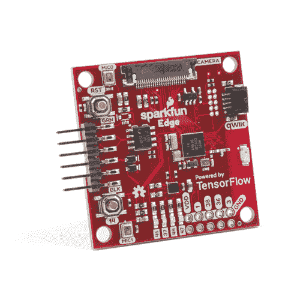](https://www.sparkfun.com/products/15170) 

将**添加到您的[购物车](https://www.sparkfun.com/cart)中！**

### [SparkFun Edge 开发板-阿波罗 3 蓝](https://www.sparkfun.com/products/15170)

[In stock](https://learn.sparkfun.com/static/bubbles/ "in stock") DEV-15170

由 TensorFlow 驱动的 SparkFun Edge 开发板非常适合开始使用语音识别，而不依赖于服务器

$16.5020[Favorited Favorite](# "Add to favorites") 45[Wish List](# "Add to wish list")** **凭借其承诺，在一个配有 ARM-Cortex-M4F、摄像头连接器、双 MEMS 麦克风、Qwiic 连接器、蓝牙天线等的主板上提供人工智能和机器学习，用户急于开始试验，但并不急于学习新的开发环境。因此，在我们工程部门的不懈努力下，在谷歌 TensorFlow Lite 和 Tiny ML 首席工程师 Pete Warden 的帮助下，现在可以通过熟悉的 Arduino IDE，在 SparkFun Edge 板上使用人工智能和机器学习开始编写几个实验。

## 为成功做准备

### 所需材料

要跟随本教程，您将需要以下材料。

[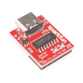](https://www.sparkfun.com/products/15096) 

将**添加到您的[购物车](https://www.sparkfun.com/cart)中！**

### [SparkFun 系列基本突破- CH340C 和 USB-C](https://www.sparkfun.com/products/15096)

[In stock](https://learn.sparkfun.com/static/bubbles/ "in stock") DEV-15096

这款 SparkFun Serial Basic Breakout 是一款基于 CH340G 的易于使用的 USB 转串行适配器，利用了 ha…

$9.957[Favorited Favorite](# "Add to favorites") 30[Wish List](# "Add to wish list")**** 

将**添加到您的[购物车](https://www.sparkfun.com/cart)中！**

### [SparkFun Edge 开发板-阿波罗 3 蓝](https://www.sparkfun.com/products/15170)

[In stock](https://learn.sparkfun.com/static/bubbles/ "in stock") DEV-15170

由 TensorFlow 驱动的 SparkFun Edge 开发板非常适合开始使用语音识别，而不依赖于服务器

$16.5020[Favorited Favorite](# "Add to favorites") 45[Wish List](# "Add to wish list")**** 

将**添加到您的[购物车](https://www.sparkfun.com/cart)中！**

### [可逆 USB A 转 C 线- 2m](https://www.sparkfun.com/products/15424)

[18 available](https://learn.sparkfun.com/static/bubbles/ "18 available") CAB-15424

这些 2 米长的电缆稍加修改后，就可以插入其端口，而不用考虑其在 U…

$8.951[Favorited Favorite](# "Add to favorites") 4[Wish List](# "Add to wish list")****[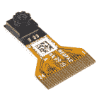](https://www.sparkfun.com/products/15570) 

将**添加到您的[购物车](https://www.sparkfun.com/cart)中！**

### [Himax CMOS 成像相机- HM01B0](https://www.sparkfun.com/products/15570)

[In stock](https://learn.sparkfun.com/static/bubbles/ "in stock") SEN-15570

一个超低功耗的 CMOS 图像传感器，使集成的“永远在线”的计算机视觉应用相机…

$10.952[Favorited Favorite](# "Add to favorites") 14[Wish List](# "Add to wish list")******** ********注意:你也可以使用 [USB-micro 版本的串行基本分线](https://www.sparkfun.com/products/14050)和一根 micro-USB 线，以及 [FTDI 版本](https://www.sparkfun.com/products/9873)(与列出的 CH310 版本相反)，这在 macOS 上可能是更好的选择。

在继续之前，您需要确保您已经阅读了原始的 [SparkFun Edge 连接指南](https://learn.sparkfun.com/tutorials/sparkfun-edge-hookup-guide)。对于本教程来说，设置 Ambiq Apollo3 SDK 不是必需的，但是，您可能希望卷起袖子深入研究一下，以便充分利用该板的潜力。

在这一点上，假设你已经在你的机器上安装了 Arduino IDE，但是如果没有，或者如果你需要升级到最新的版本，你可以从 Arduino 的网站上获得。

### 安装库

这些示例使用 TensorFlowLite Arduino 库，该库是使用 Arduino 库管理器安装的，人员检测示例也使用 Himax HM01B0 摄像机库。

要安装该库，请执行以下步骤:

*   在 Arduino 中，选择“管理资料库…”菜单项。工具>管理库...
*   在库管理器界面中，搜索 tensorflow
*   选择由 TensorFlow 作者创建的库 Arduino_TensorFlowLite
*   选择库的非预编译版本
*   选择“安装”按钮安装库

[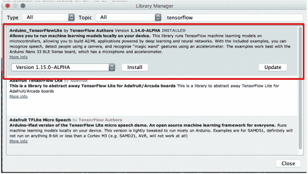](https://cdn.sparkfun.com/assets/learn_tutorials/1/1/0/3/LibraryTensorFlow.JPG)

**注意**:您必须安装 ***非预编译*** 版本的库。安装预编译库只会导致失败和悲伤。

要安装 Himax HM01B0 相机库:

*   仍然在库管理器界面中，搜索 Himax
*   选择 SparkFun Himax HM01B0 相机库
*   选择“安装”按钮安装库
*   关闭对话窗口

### 安装 SparkFun 板包

要安装必要的板包，请执行以下步骤:

*   在 Arduino 中，打开“偏好设置”菜单项。文件>偏好设置，(macOS) Arduino >偏好设置
*   将以下路径添加到附加 Boards Manager URLs:首选项中的路径。

`https://raw.githubusercontent.com/sparkfun/Arduino_Boards/master/IDE_Board_Manager/package_sparkfun_index.json`

*   选择确定按钮保存首选项。

[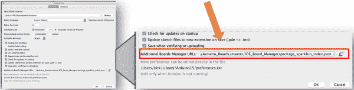](https://cdn.sparkfun.com/assets/learn_tutorials/1/1/0/3/AdditionalBoardsURL.JPG)

在首选项中设置了 SparkFun 电路板包的位置后，必须安装 SparkFun Apollo3 电路板的电路板定义包。要安装软件包，请使用以下步骤:

*   在 Arduino 中，打开纸板管理器。工具>电路板"...">管理董事会...
*   搜索阿波罗 3 号
*   选择**SparkFun Apollo3 板”套装
*   选择“安装”按钮安装库
*   关闭对话窗口

[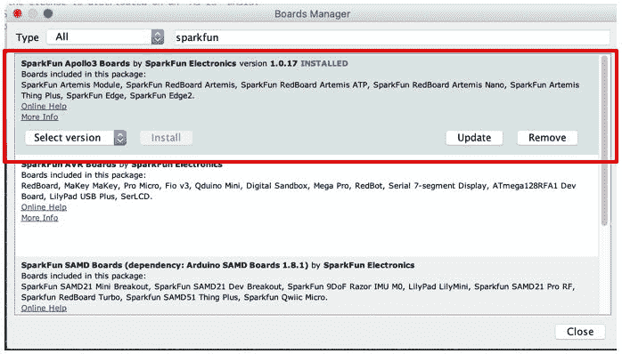](https://cdn.sparkfun.com/assets/learn_tutorials/1/1/0/3/BoardsManager.JPG)

## 运行示例

### 获取代码

我们有三个使用 TensorFlow Lite 为 Edge 板编写的示例，并使用 Arduino 编程。可以从这里克隆或下载并解压缩它们:

`https://github.com/sparkfun/Tensorflow_AIOT2019`

将 Edge 板连接到计算机(通过串行分线点)，转到工具>板"..."，然后选择 SparkFun Edge。接下来，您需要选择您的板所连接的端口。可以在工具>端口>下找到。根据您的操作系统，它看起来会略有不同。

*   windows-“COM 端口”
*   macOS - "/dev/cu.usbserial* "(注意:您可能需要检查权限)
*   Linux - "/dev/ttyUSB*"

现在，您已经准备好打开您的第一个示例。转到下载 examples 文件夹的文件夹(如有必要，将其解压缩)。

### 微言语

从 TensorFlow_AIOT2019-master 文件夹中的 micro_speech 文件夹中，打开文件 micro_speech.ino。完整披露-这是你的 SparkFun Edge 板上预加载的草图，所以你应该已经看到蓝色 LED 在闪烁。如果你打开你的 Arduino IDE 的串行监视器，说“Yes”将返回类似“Heard yes (203) @4032ms”的信息，伴随着黄色的板载 LED 闪烁一次；说“否”将返回类似“听到否(209) @7936ms”的语句，同时红色机载 LED 闪烁。麦克风拾取的任何其他单词或语句都将返回“head unknown(212)@ 50304 ms”我注意到，一个更强烈的“是”似乎能被更好地识别，而一个稍微慢一点、更拖长的“不”往往能被模型更好地识别。本例中使用的模型是从 void:setup()中调用的，这里是:

[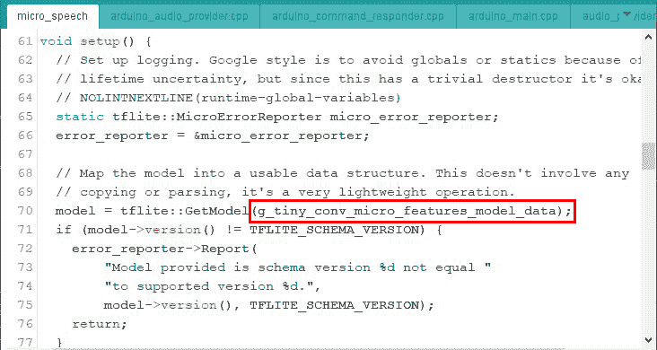](https://cdn.sparkfun.com/assets/learn_tutorials/1/1/0/3/SpeechModel.JPG)**Support Tip:** When opening the Serial Monitor, be sure to check the port you are selecting for the board (*see previous section*) and make sure you are using select **9600 baud** from the drop down menu of the Serial Monitor (*bottom of window*).

### 上传序列

默认情况下，当您启动 SparkFun Edge 板时，它会立即进入运行模式，并运行上传到它上面的任何文件。为了上传新的东西，我们需要把它设置为引导模式。这是通过按特定顺序使用边缘板上的两个按钮来完成的。当您准备好上传代码时，请采取以下步骤:

*   按住复位按钮
*   在仍然按住复位按钮的同时，按住 14 按钮
*   松开复位按钮
*   释放 14 按钮
*   点击 Arduino IDE 中的上传(或使用键盘快捷键)

编译和上传这些文件将比你的标准 Arduino 草图花费更多的时间，所以请耐心等待。如果你想知道在这段时间里发生了什么，你可以随时返回到你的 Arduino 首选项，并勾选详细输出的复选框。

[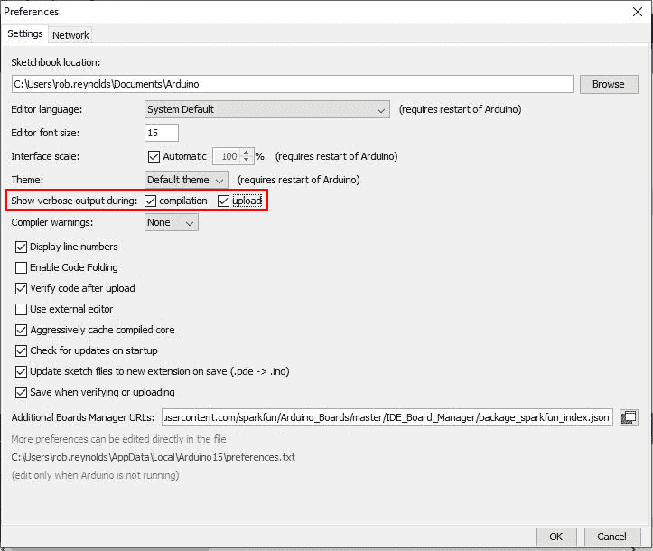](https://cdn.sparkfun.com/assets/learn_tutorials/1/1/0/3/ArduinoPrefsVerbose.jpg)

Arduino IDE 将尝试三次将草图上传到您的主板。理想情况下，当它完成时，您应该看到“上传完成！”在输出窗格中。然而，我们已经注意到这个过程有时会有点挑剔。您可能会收到一条消息，内容为“尝试次数= 3；上传失败！”您可以随时重置并重试，或将 SVL 波特率降至 460800。我们还没有确定这个问题的具体原因——风向，花粉数量，仍然不完全确定——但是一点耐心应该可以让你开始运行。

### 人物检测

这个例子使用照相机捕获的图像用于分类过程。该模型被训练以识别何时有人在场。当模型分析图像时，串行监视器将显示“检测到人类”和“没有检测到人类”的分数请记住，这不是运动检测，也不是逐帧读取像素差异。这里的模型正在根据它的训练模型寻找它所感知的人形。

[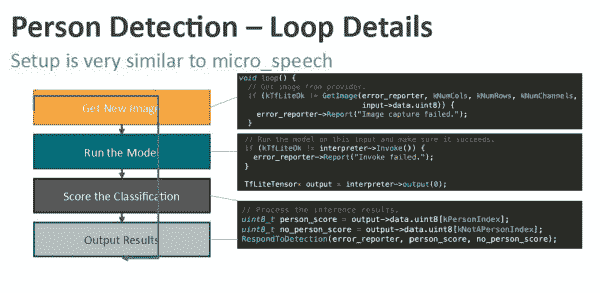](https://cdn.sparkfun.com/assets/learn_tutorials/1/1/0/3/ArduinoPersonDetectLoop.JPG)

上传协议与第一个例子相同。唯一的区别是你需要连接相机模块。将它安装到边缘板上时，请确保镜头朝向边缘板的背面或电池侧，如下图所示。

[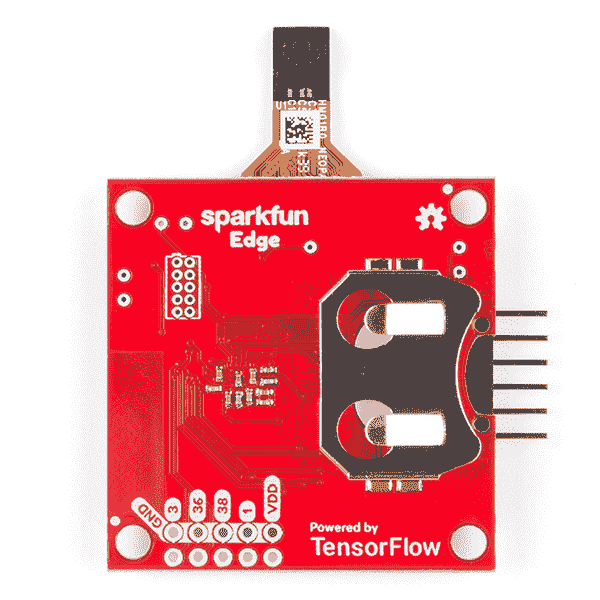](https://cdn.sparkfun.com/assets/learn_tutorials/1/1/0/3/15570-Himax_CMOS_Imaging_Camera_-_HM01B0-05.jpg)

这是迄今为止三个包中最大的一个，因此上传的时间也最长。它在 140 个帧中发送 284776 个字节，每个帧 2048 个字节(最后一个帧除外，它只包含 104 个字节)。偶尔它会在上传到一半的时候卡住。我们发现，尤其是在 MAC 上，将 SVL 波特率(在“工具>”下)下调到 460800 可能会达到目的，或者有时它只需要以相同的速度重试一次。一旦上传完毕，重新设置你的主板，看看效果如何。

[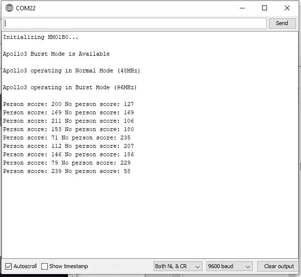](https://cdn.sparkfun.com/assets/learn_tutorials/1/1/0/3/ArduinoPersonDetection.JPG)

在这里你可以看到它是如何对待我的——从来没有真正 100%确定我是一个人，尽管一旦我给自己一点光(最后的分数)，它就非常确定我实际上是人类。

### 魔杖

是时候穿上你的哈利波特了！最后一个例子，打开 magic_wand 草图。这个例子使用一个 20KB 的神经网络和 TensorFlowLite 来识别手势。它从 Edge 板的板载加速度计读取数据，识别的手势输出到串行监视器和板载 led。这张草图识别了三种不同的姿态，我们称之为翅膀、环和斜坡。

[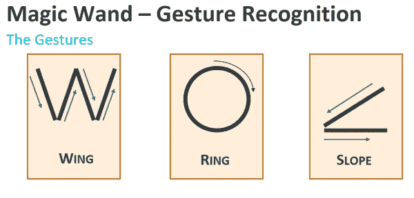](https://cdn.sparkfun.com/assets/learn_tutorials/1/1/0/3/WandGestures.JPG)

注意每个手势的方向，因为它确实很重要。例如，逆时针环运动将不起作用。继续上传草图，方式和其他两张一样。完成后，您需要将串行连接器放在左侧，相机端口远离您。为了让板子正确地阅读手势，如果你保持手腕僵硬，并从肘部移动手臂，你会有最好的运气。Ambiq Micro(Edge 板上的 Apollo3 芯片的制造商)的技术和合作伙伴支持总监 Arpit Shah 帮助我们在 ARM AIoT Dev Summit 上主持研讨会，他发现他最幸运的是将电路板用胶带或橡胶带绑在鼓槌的末端。(显然他没有独角兽毛和/或山茱萸了)。保持棋盘不动，让它自己定位，然后做一个手势，在末端也保持一秒钟。这可能需要一点练习才能保持一致，但所有的魔术不都是这样吗？

### 请再来点魔法！

如果你准备深入挖掘，并想开始添加额外的手势到你的魔法剧目中，你可以在 TensorFlow 的 GitHub 资源库中找到一个很好的起点。查看 README.md 中的说明，链接到训练您自己的模型。

[Magic Wand: Train Your Own Model](https://github.com/tensorflow/tensorflow/tree/master/tensorflow/lite/micro/examples/magic_wand#train-your-own-model)

这不仅仅是运行一个简单的 Arduino 草图，所以准备好做一些繁重的脑力劳动吧。

## 解决纷争

**Need help?**

If your product is not working as you expected or you need technical assistance or information, head on over to the [SparkFun Technical Assistance](https://www.sparkfun.com/technical_assistance) page for some initial troubleshooting.

If you don't find what you need there, the [SparkFun Forums](https://forum.sparkfun.com/index.php) are a great place to find and ask for help. If this is your first visit, you'll need to [create a Forum Account](https://forum.sparkfun.com/ucp.php?mode=register) to search product forums and post questions.

[SparkFun Edge Board Forum](https://forum.sparkfun.com/viewforum.php?f=153)

## 资源和更进一步

现在您已经熟悉了硬件和设置，您应该能够开始将 Edge 板集成到您的项目中。如果您想了解更多关于 Ambiq Apollo3 或 SparkFun Edge 板的信息，请查看以下链接:

SparkFun Edge:

*   [示意图(PDF)](https://cdn.sparkfun.com/assets/2/b/7/4/d/SparkFun_Edge_Schematic.pdf)
*   [老鹰文件(ZIP)](https://cdn.sparkfun.com/assets/b/1/8/d/e/SparkFun_Edge_EagleFiles.zip)
*   [GitHub 硬件回购](https://github.com/sparkfun/SparkFun_Edge/tree/v2LP)
*   [边缘板尺寸](https://cdn.sparkfun.com/assets/learn_tutorials/8/7/8/EdgeDimensions_Updated.png)
*   [SFE 产品展示区](https://www.youtube.com/watch?v=13dmVkuk7i4)

与阿波罗 3 号一起工作:

*   [Ambiq Apollo3 数据表](https://cdn.sparkfun.com/assets/d/a/7/c/d/Apollo3_Blue_MCU_Data_Sheet_v0_9_1.pdf)
*   [SDK 安装指南](https://learn.sparkfun.com/tutorials/using-sparkfun-edge-board-with-ambiq-apollo3-sdk)
*   [在带 SparkFun Edge 的微控制器上进行机器学习](https://codelabs.developers.google.com/codelabs/sparkfun-tensorflow/#0)
*   [在微控制器上使用 tensor flow](https://www.tensorflow.org/lite/guide/microcontroller)
*   [TensorFlow Lite](https://www.tensorflow.org/lite)

你的下一个项目需要一些灵感吗？看看这些物联网教程吧！

 [### 将 Raspberry Pi 3 设置为接入点](https://learn.sparkfun.com/tutorials/setting-up-a-raspberry-pi-3-as-an-access-point) This guide will show you how to configure a Raspberry Pi as an access point and connect it to your local Ethernet network to share Internet to other WiFi devices.[Favorited Favorite](# "Add to favorites") 8 [### HX1 APRS 变送器连接指南](https://learn.sparkfun.com/tutorials/hx1-aprs-transmitter-hookup-guide) The HX1 is a low-power amateur radio transmitter that can be used to send data to the Automatic Packet Reporting System (APRS) network.[Favorited Favorite](# "Add to favorites") 5 [### LoRaWAN 与 ProRF 和物联网](https://learn.sparkfun.com/tutorials/lorawan-with-prorf-and-the-things-network) Learn how to make a LoRaWAN node for your next long range IoT project and connect it to the internet with The Things Network 11 [### nRF52840 使用 nRF5 SDK 进行高级开发](https://learn.sparkfun.com/tutorials/nrf52840-advanced-development-with-the-nrf5-sdk) Take your nRF52840 development to the next level -- build your applications with the nRF5 C SDK. This tutorial explains how to set up a development environment based around the GNU Arm Embedded Toolchain.[Favorited Favorite](# "Add to favorites") 6

或者看看这篇博客文章。

 [### 边缘计算的新工具

March 6, 2019](https://www.sparkfun.com/news/2886 "March 6, 2019: SparkFun is pleased to announce a new line of development tools to help implement edge computing, including voice and image recognition.")[Favorited Favorite](# "Add to favorites") 4 [### 火花边缘:第一天

April 2, 2019](https://www.sparkfun.com/news/2902 "April 2, 2019: A look into the capabilities the SparkFun Edge possesses from TensorFlow Lite on release.")[Favorited Favorite](# "Add to favorites") 1 [### 机器学习概述

July 2, 2019](https://www.sparkfun.com/news/2954 "July 2, 2019: What is machine learning? How does it differentiate from artificial intelligence? How easy is it to learn and implement? These are all valuable questions we hope to answer as edge computing becomes more popular!")[Favorited Favorite](# "Add to favorites") 4**********