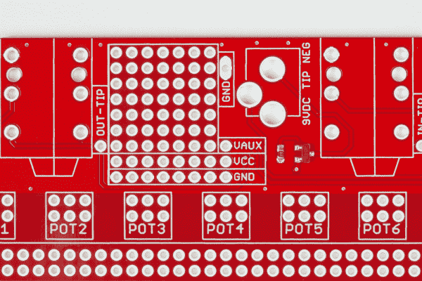

# 原型踏板组件和理论指南

> 原文：<https://learn.sparkfun.com/tutorials/proto-pedal-assembly-and-theory-guide>

## 介绍

SparkFun [原型踏板](https://www.sparkfun.com/products/13124)是一个 PCB，它使得制作吉他效果踏板更加容易。

 

### [SparkFun 原型踏板](https://www.sparkfun.com/products/retired/13124)

[Retired](https://learn.sparkfun.com/static/bubbles/ "Retired") PRT-13124

SparkFun Proto 踏板是一个易于组装的套件，使构建吉他效果踏板更容易。让我们面对现实吧，大多数人…

1 **Retired**[Favorited Favorite](# "Add to favorites") 38[Wish List](# "Add to wish list")

[https://www.youtube.com/embed/f2dl8F0xoJc/?autohide=1&border=0&wmode=opaque&enablejsapi=1](https://www.youtube.com/embed/f2dl8F0xoJc/?autohide=1&border=0&wmode=opaque&enablejsapi=1)

让我们面对它，大多数吉他踏板开始与类似的电路-你需要输入和输出插孔，旁路开关(希望有一个状态 LED)，和一个电源输入桶插孔。在某些电路中，插孔和开关中涉及的布线可能与效果本身一样多。

该 PCB 处理所有必要的插孔和开关相关的布线。它提供:

*   利用重型三极双掷(3PDT)踏脚开关实现真正的旁路和 LED 开关。
*   相当于标准[无焊试验板](https://www.sparkfun.com/products/12002)的原型制作区域。
*   一些额外的原型面积用于功率调节或参考电压。
*   六个位置有助于组织电位计布线。

为了保护 PCB 免受舞台和工作室的危害，我们还提供了可选的匹配预钻孔[压铸外壳](https://www.sparkfun.com/products/13967)。

*Proto Pedal Chassis and PCB*

本指南将向您展示如何组装 PCB，然后解释 I/O、电源和开关电路。如果你是制作吉他踏板的新手，这个指南应该可以帮助你开始。如果你对电子产品有经验，但对吉他踏板不熟悉，你可能想看看[原型](https://learn.sparkfun.com/tutorials/proto-pedal-assembly-and-theory-guide/prototyping-with-the-proto-pedal)和[理论](https://learn.sparkfun.com/tutorials/proto-pedal-assembly-and-theory-guide/theory-of-operations)部分，因为吉他踏板采用了一些聪明和独特的电路惯例。

Before we even get into discussing the basics of the proto pedal, we need to mention that the barrel jack is wired according to the convention for guitar pedals -- the sleeve of the jack is positive 9V, and the tip is ground. ***This is the opposite of the wall warts that SparkFun sells!**

The upside is that it's compatible with nearly any pedal power supply, such as the [Boss PSA Adapter](http://www.bossus.com/products/psa_series/), or the [Voodoo Labs Pedal Power](http://www.voodoolab.com/pedalpower_2.htm) supply.*

### 推荐阅读

*   了解各种可用的[开关](https://learn.sparkfun.com/tutorials/switch-basics)。
*   使用[无焊试验板](https://learn.sparkfun.com/tutorials/how-to-use-a-breadboard)以及[印刷电路板](https://learn.sparkfun.com/tutorials/pcb-basics)的一些背景。
*   有许多网站讨论吉他效果的设计和构造。作者最喜欢的几个是 [Geofex](http://www.geofex.com/effxfaq/fxfaq.htm) 和 [AMZ](http://www.muzique.com/) 。

## 组装说明

### 部件

在[原型踏板](https://www.sparkfun.com/products/13124)框中，您会发现以下部件。

*Proto Pedal Components*

从左上方顺时针看，你会看到:

*   一个重型 9 伏电池单元。
*   一个 3PDT 脚踏开关。
*   两杯 TRS 杰克酒。
*   4-40 螺母、机器螺钉和星形垫圈接地片各一个。
*   一个 2.1 毫米桶形千斤顶
*   一个完成 SMT 工作的 PCB

此外，我们强烈推荐[预钻孔底盘](http://sfe.io/13967)。这是一个标准尺寸的铸铝盒，它作为装配夹具有双重功能，有助于正确对齐插孔和开关。

你还需要一小段绞合的连接线。

### 工具

为了组装原型踏板，我们推荐以下工具和材料:

*   [烙铁](https://www.sparkfun.com/products/11704)
*   [含铅](https://www.sparkfun.com/products/9161)或[无铅](https://www.sparkfun.com/products/9325)焊料
*   [对角](https://www.sparkfun.com/products/8794)或[平齐](https://www.sparkfun.com/products/11952)刀具
*   [小十字螺丝刀](https://www.sparkfun.com/products/9146)

### 装配

组装的第一步是决定你是否使用预先钻孔的底盘。有几个组装步骤由底盘决定。

*   首先，如果你用底盘建造，它可以作为一些组件的装配夹具。机箱的墙壁略微倾斜，因此当 TRS 插孔与墙壁适当接触时，它们不会与主板完全齐平。
*   其次，当封装在机箱中时，板载表面贴装 led 是隐藏的。有一个可选的 5 毫米 PTH LED 的位置。欢迎您挑选自己喜欢的颜色，并为 LED 选择 1/4W PTH 偏置电阻。对于本指南，我们使用一个[5 毫米红色 LED](https://www.sparkfun.com/products/9590) 和一个 [1K &欧姆；电阻器](https://www.sparkfun.com/products/13760)。

如果您不使用机箱，您可以将插孔齐平安装在板上，SMT led 将足以进行基准测试。

#### 插孔和开关

如果你用底盘组装踏板，第一步是把开关和插孔安装到盒子上。

*Jacks and switch mounted to box.*

每个插孔都有一个塑料螺母和一个垫圈，它们都应该从盒子的外面穿上。

开关有两个螺母、一个光滑垫圈和一个锁紧垫圈。拆下一个螺母和两个垫圈，然后将剩下的螺母放在距离交换机主体大约 0.125 英寸(3 毫米)的位置，如下所示。

*Notice the location of the nut, a couple of threads above the body.*

将锁紧垫圈放在开关上，然后将开关穿过底盘。在开关的外侧，装上光滑的垫圈，最后装上另一个螺母。

拧紧插孔和开关上的螺母，使它们保持在原位，但仍然可以在孔中旋转。在它们之间留一点间隙有助于 PCB 正确对齐。

将印刷电路板滑到插座和开关的腿上。

*Setting the PCB on jacks.*

注意保持 TRS 插孔靠近长方形孔的顶部，拧紧插孔上的螺母，用手指开关。由于外壳侧面倾斜，靠近电路板中心的插孔腿会比靠近边缘的插孔腿伸出得更远。

将插孔和开关焊接到 PCB 上。

*PCB resting on jacks and switch.*

从机箱中取出 PCB，并进行最后几次触摸。

要从机箱上拆下 PCB，松开插孔和开关上的螺母。然后，按下开关，整个组件将弹出。

*Press the button to pop the board free.*

#### 电源输入插孔

下一步是焊接筒状插孔，它位于 TRS 插孔之间。

*Soldering in the barrel jack.*

#### 5 毫米 LED。

如果您正在添加一个通孔 LED，它会靠近踏脚开关，偏置电阻会靠近它，位于标有`BRT`的电阻位置。为了穿过机箱中的孔，LED 需要与 PCB 保持一定距离。与开关和插孔一样，您可以使用机箱作为模板，使其正确对齐。

LED 被极化，需要正确安装。LED 的阴极由 LED 环上的平点和较短的腿来标记，其应该面向开关。

*LED assembly closeup.*

LED 和电阻焊接到位后，将引脚修整至与 PCB 底部齐平。

您也可以移除偏置电阻附近 SJ1 上的焊料滴，以禁用内部 LED。

#### 底盘接地片

接下来，添加接地片。

你需要一小段绞合的连接线。剥去电线的两端并涂上锡。将一端焊接到筒式插孔附近的接地焊盘，另一端焊接到星形垫圈。

*Chassis ground pigtail.*

星形垫圈通过桶形千斤顶附近的小孔安装在底盘上。

*Firmly connected chassis ground.*

#### 9V 电池单元

最后，焊接 9V 电池扣。PCB 有一些额外的孔来减轻电池导线的压力-通过孔向上馈送导线，然后通过焊盘返回。注意将红色和黑色的电线与板上的图例相匹配。

*Battery snap detail.*

电池扣是可选的-如果你严格使用外部电源，你可能更喜欢让它关闭，这样就不会有一个松散的连接器在盒子里游荡。

## 用原型踏板制作原型

当你开发你的电路时，你可以在电路板的中心放置一个[无焊试验板](https://www.sparkfun.com/products/12002)。

*Solderless breadboard in place.*

当你准备好完成设计时，你可以将电路转录到原型踏板 PCB 上。PCB 这一区域的连接与无焊板上的连接相同。

不过，试验板和原型踏板布局之间有一个区别。沿着原型区域的中心有两条额外的横向轨迹。

*Connections to lateral power traces.*

这些走线没有分配给任何特定信号，但可以使用电路板左边缘的焊盘轻松连接到`VCC`、`GND`或`VAUX`。我们将很快讨论`VAUX`。

### 耦合帽

吉他踏板电路的输入和输出几乎总是在输入和输出端使用[耦合电容](https://en.wikipedia.org/wiki/Capacitive_coupling#Use_in_analog_circuits)。PCB 下边缘附近有这些电容的封装。

*Input and output coupling capacitors.*

并非每个电路都使用相同的电容值、尺寸或成分。因此，这些封装设计用于适应各种引脚间距。如上所示，这些位置适合 2mm 和 5mm 的瓶盖。

如果您使用极化耦合电容，则+引线通常面向电路输入/输出焊盘，如 PCB 上所示。

### 你的电路在这里

耦合帽就位后，电路核心的输入和输出是耦合帽之间的通孔焊盘，标记为`IN`和`OUT`。

*Input and output pads.*

### 添加旋钮

PCB 还有六个位置用于添加电位计。

*Potentiometer footprints.*

这些位置的目的是让您可以将短导线从原型区域布设到下排焊盘，然后将长导线从顶部焊盘布设到用螺栓固定在机箱上的 pots。这有助于保持原型区域的整洁。

*Pot on flying wires.*

将电线留得稍微长一点的概念被称为“服务环路”——可以拆卸系统，并且可以访问 PCB，而不必将 pots 从前面板上取下或断开任何电线。

### 供电区域

在 TRS 插孔之间有一个额外的每孔焊盘原型区域。该区域旨在允许您添加额外的电路，如[电压调节器](https://www.sparkfun.com/products/527)或[轨道分离器](http://www.ti.com/product/TLE2426)。如果你真的雄心勃勃，你可以在这个领域建立一个电荷泵电路，以产生双极性电源轨。

*Power prototyping area.*

如果您要获得一个新的电压轨，则从该区域到原型区域还有一条未提交的走线，标记为`VAUX`，表示“辅助电压”。

该区域左下方的三个连接(`VAUX`、`VCC`、`GND`)连接到原型制作区域右侧的同名焊盘组。

### 原型区域

板的中心与[中型无焊试验板](https://www.sparkfun.com/products/12002)相同。

该区域的顶部和底部是左右延伸的电源走线。标记为`+`的迹线连接到 VCC，标记为`-`的迹线连接到地。电源走线之间是成对的五焊盘垂直分组，排列成 30 列。通常，双列直插式(DIP) IC 封装跨越电路板中心的间隙。

*IC in place, spanning center of board.*

然后，IC 的每个引脚与该组中的其余四个孔电连接。短导线可以用作跳线，将焊盘连接到电源轨，电容和电阻等无源元件可以插入各行之间进行连接。

#### 额外横向痕迹

在普通的 DIP-IC 原型板上，原型区域中心下方的空间(两组焊盘之间)是空的。原型踏板在这个区域有一对额外的轨迹。

*Standard protoboard pattern versus Proto Pedal.*

这些轨迹简单地从左到右延伸——您可以决定如何在您的设计中使用它们。为方便起见，VCC、地和 VAUX 可以在这些走线右端附近的焊盘上找到，并可以跳线至中间走线。

*Connection to center rails.*

我们将展示一个在[均衡器踏板](https://learn.sparkfun.com/tutorials/547)项目中使用这些轨迹的例子。

### 接地片和测试点

PCB 上有许多额外的通孔焊盘。有几对接地焊盘，可以用小线环填充，以便可以将万用表或示波器探针接地到它们。

*Ground connection.*

还有测试点，提供对输入和输出的尖端和环的访问，靠近它们各自的插孔。输入插孔的环可以在电路板右上角的接地连接附近找到——如果你需要在输入插孔被拔掉时给踏板供电，你可以在它们之间放一根电线。只是不要忘记在部署踏板之前将其移除，否则您的电池寿命将受到影响！

*Input power switch disabled.*

### 它从右向左读

当从用户的角度看时，原型踏板在他们脚附近的地板上，踏脚开关面向他们，插孔背向他们。

在另一个令人困惑但长期存在的外汇踏板惯例中，从这个角度来看，输入插孔在右边，输出在左边。对此，一个合理的解释是线缆通常从吉他的右边出来，所以它不需要穿过回到左边来插入。

这与我们通常思考电路和绘制原理图的方式相反(信号从左向右流动)。这只是将原理图转化为实际电路时需要记住的一个细节！

## 操作理论

吉他踏板是他们自己专门的工程学科。多年来，许多设计惯例已经演变成现在常见的形式。原型踏板结合了其中一些惯例。

### 旁路开关

许多踏板上的矮胖脚踏开关是老式汽车远光灯开关的衍生物。

*Three-pole, double-throw switch.*

在开关内部，实际上有三个独立的开关，当按钮被按下时，它们一起启动。这个开关其实是专门为吉他踏板设计的。

多年来，已经使用了各种各样的[旁路开关电路](http://www.geofex.com/article_folders/bypass/bypass.htm)，其中许多使用双极开关。最有用的双极开关配置使用开关的两个部分，以“真正旁路”配置引导电路周围的信号。当旁路时，即使电路没有通电，Proto 踏板也会传递信号。

*Typical true bypass switching.*

protopedal 使用一种真正的旁路开关。当该效应被旁路时，该效应的输入连接到地，这防止一些高增益电路行为不良。

*Proto Pedal bypass switching*

### 指示灯 LED

在讨论旁路开关时，我们只使用了开关上三个极点中的两个。第三部分用于开关 LED，显示踏板的状态。

LED 指示灯有两种选择。默认情况下，PCB 上有一个表面贴装红色 LED，因此您可以在工作台上判断旁路状态。如果你想击败这个 LED，删除 SJ1 上的焊料滴。

*SJ1 is just above the switch, noted with arrow in the silkscreen.*

第二个 LED 选项允许脚踏开关附近有一个 5 毫米的通孔 LED，它与机箱中的孔对齐。隔壁有一个通孔偏置电阻，标有`BRT`，可以配置 LED 的亮度。

### 交流耦合

#### 添加偏移

吉他信号通常在 0V 左右摆动，幅度约为 1 伏，峰峰值(尽管这随拾音器、弦乐材料和演奏风格的不同而有很大差异)。

*Fender Telecaster, bridge pickup, loudly strumming open E major.*

踏板电路通常由一个 9V DC 电池供电，这将信号摆幅限制在该范围内。信号的负峰值低于地电位，位于电路工作区域之外。

为了帮助解决这种情况，信号中增加了一个偏移。这被称为“DC 偏差”

*Same guitar, with 4.5VDC bias added.*

当您分析踏板示意图时，您将学会识别产生偏移的位置。它通常是一对等值电阻，作为 9V 和地之间的分压器，有时有一个电容与较低的电阻并联。让我们看一个实际原理图，确定失调电压。

*AMZ Super Buffer
(Schematic courtesy [Jack Orman](http://www.muzique.com), used with permission)*

失调电压由`R8`和`R9`组成的分压器产生。它们相遇的节点将是 V+的一半(如果由 9V 电池供电，则为 4.5V)。

在更复杂的数学中，半轨电压可能在电路中的多个地方使用，并且可能有多个分压器。

#### 耦合电容器

电路内部需要 DC 偏置电压，但需要防止它到达外界。如果 DC 偏压到达旁路开关，当开关启动时，将会产生爆裂声或重击声。类似地，吉他、放大器和其他踏板期望信号以 0 V 为中心，通过在效果输入和输出上使用电容器来消除偏差。

在上面的超级缓冲器原理图中，输入耦合电容为`C1`，输出耦合电容为`C2`和`C3`的并联组合。

原型踏板预计电路将需要这些盖子，在靠近电池的边缘为它们提供足迹。

原型踏板在耦合帽的外侧也有 1 米的&ohm;下拉电阻，类似于缓冲器原理图中的 2.2 米&ohm; `R5`和`R7`。某些类型的电容器会泄漏偏置电压，缓慢地对电容的外侧充电。下拉电阻将电容的外侧保持在地电位，防止开关启动时发出爆音。

As a side note, if you're experiencing popping when your effect is switched in or out, check that the "external" side of each coupling cap is indeed staying at ground potential.

### 等等，没有电源开关？

在上面对踏脚开关的讨论中，您会注意到开关用于控制信号通过效果，以及打开和关闭 LED。它实际上并不是打开和关闭电路。

如果你熟悉吉他的声音，你会明白输入插孔需要连接，踏板才会出现。输入插孔的功能相当于电源开关！

让我们通过查看有问题的组件来更深入地了解这是如何工作的。

*From top to bottom: TRS jack, TRS socket and TS (guitar) jack.*

这里，从上到下是

*   一个尖头环形套筒(TRS) 1/4 英寸千斤顶。
*   1/4 英寸 TRS 插座。
*   标准吉他线缆，带 1/4 英寸插孔。

TS 和 TRS 插孔之间的区别在于，TRS 插孔在尖端和套管之间有第三个导体(环)。或者，从相反的角度看，TS 插孔是环和套管短接在一起的 TRS 插孔。

效果踏板上的输入实际上是一个塞尖-塞环-塞套插座，有三个导体。当 TS 电缆插入其中时，它将环桥接到套管上。踏板使用该连接作为低端电源开关，将电池的负极端子连接到踏板接地。

如果你使用过 9V 电池的踏板，你很快就会知道，如果你不想电池耗尽，当你不使用它们时，你必须拔掉它们。

### 电源输入选择

原型踏板有两个电源:桶插孔和 9 伏电池单元。这些连接是这样安排的，当枪管插入时，电池就脱离了电路。

这依赖于筒状插孔结构中的一个有点模糊的细节:它有一个额外的弹簧加载触点。

*Barrel jack with nothing plugged in.*

当没有插入任何东西时，弹簧将第二和第三触点保持在一起。当枪管插入时，插孔将触点推开，断开电池。

*Barrel jack -- plugging in disconnects battery.*

在踏板设计的复杂世界中，完全省略电池是很常见的，踏板由 DC 电源供电。

最后，正如我们在[简介](https://learn.sparkfun.com/tutorials/proto-pedal-assembly-and-theory-guide/introduction)中提到的，吉他踏板使用了一种与其他学科相反的桶形插孔极性。为了防止错误的 DC 适配器进入画面，电源连接使用 P 沟道 MOSFET 进行保护，该 MOSFET 仅在正向偏置时导通。反极性适配器(或摸索一个 9V 电池)不会造成任何损害-它根本不会工作。

### 关于“吸音”的几点注记

多年来，一些吉他踏板因在输入信号中引入不想要的变化而臭名昭著。也许他们使声音更安静，更黑暗，低音消失，或者只是变得有些模糊-有时甚至踏板被绕过！

与一些难以证明的发烧友概念不同，“吸音”是一个真实的现象，稍加工程分析就可以很容易解释。

电吉他拾音器是一种高阻抗电感源。如果该源上的负载过高，它会形成一个频率相关的分压器，高端消失。在踏板时代的早期，这一事实没有被完全认识到，一些电路具有异常低的输入阻抗。

为防止过度加载，负载阻抗应为源阻抗的 10 倍。

用整数表示，吉他拾音器的源阻抗通常在 10K &ohm;到 25K &ohm;范围内。为了让两个信号源都能很好地工作，吉他输入的阻抗应该是那个阻抗的十倍，或者 250k——甚至更高，比如 1 M &ohm;更好。典型的高保真和专业音频输入在 10K &ohm;到 47K &ohm;附近。如果吉他被直接插入它们，它可能会失去一些魔力。

阻抗负载问题有两种解决方案。第一是设计具有适当高输入阻抗的电路。第二种方法是在低 Z 输入端之前增加一个缓冲级。缓冲器可以简单到配置为[源极跟随器](https://en.wikipedia.org/wiki/Common_drain)的 JFET 或 MOSFET，甚至是插在吉他和低阻抗输入之间的另一个踏板。

旧踏板中的旁路电路有时也会偷工减料。有一些开关策略使用单极开关来简单地在输入信号或效果输出之间进行选择，因此效果总是加载拾音器，即使被旁路。

*Bad switching with single-pole switch.*

使用双极踏脚开关，开关可以完全控制效果电路周围的信号，完全消除负载。

最后，一些踏板中的耦合电容太小，导致低端损耗。

Proto 踏板包含了许多可以防止这些问题的功能。

*   旁路开关配置为真正的旁路配置。
*   PCB 的输入阻抗为 1 M &ohm; -足够高，不会对大多数吉他形成过度的负载。
*   输入和输出端的耦合电容可供用户选择，因此可以选择这些电容来防止低端损耗。

## 资源和更进一步

本指南是 Proto Pdeal 的第一份指南。接下来去哪里取决于你的兴趣和背景。

*   如果你对模拟电路感兴趣，请查看[模拟均衡器踏板示例](https://learn.sparkfun.com/tutorials/proto-pedal-example-analog-equalizer-project)项目。
*   如果你更熟悉编写软件，并想通过编写程序来设计效果，请查看[可编程数字踏板](https://learn.sparkfun.com/tutorials/proto-pedal-example-programmable-digital-pedal)示例。

### 资源

*   桶形插孔极性保护电路常见于汽车电子设备中。一个适用的参考是本 [TI 申请报告](http://www.ti.com.cn/cn/lit/an/slva139/slva139.pdf)
*   我们有许多不同颜色的 5 毫米发光二极管。
    *   [红色](https://www.sparkfun.com/products/9590)
    *   [绿色](https://www.sparkfun.com/products/9592)
    *   [蓝色](https://www.sparkfun.com/products/11372)
    *   [白色](https://www.sparkfun.com/products/531)
*   我们提供 [10K 音频锥盆](https://www.sparkfun.com/products/9940)和 [10K 线性锥盆](https://www.sparkfun.com/products/9939)
*   我们还有几种旋钮
    *   [花键轴盆的灰色铝](https://www.sparkfun.com/products/10001)。
    *   [黑铝](https://www.sparkfun.com/products/10002)用于花键轴盆。
    *   [黑色炉型](https://www.sparkfun.com/products/9998)带有用于 1/4”直径轴的固定螺钉。
    *   [黑色鸡头](https://www.sparkfun.com/products/10000)带有用于 1/4”直径轴的固定螺钉。
*   [电阻器分类](https://www.sparkfun.com/products/10969)
*   [电容器分类](https://www.sparkfun.com/products/13698)
*   [分立半导体分类](https://www.sparkfun.com/products/13682)
*   [绞合](https://www.sparkfun.com/products/11375)和[实心](https://www.sparkfun.com/products/11367)连接导线。

### 更进一步

*   尼克·科林斯的《手工电子音乐》一书包含了许多可以制作有用踏板的电路片段。
*   克雷格安德顿的[音乐家电子项目](https://www.amazon.com/Electronic-Projects-Musicians-Craig-Anderton/dp/0825695023)书是学习踏板和音乐电子的一个很好的起点。
*   周围有很多踏板建设网站，包括 [Geofex](http:/www.geofex.com) 、 [AMZ](http://www.musique.com) 、阿伦尼尔森 [DIY 踏脚转盘](http://www.diystompboxes.com/wpress/)。