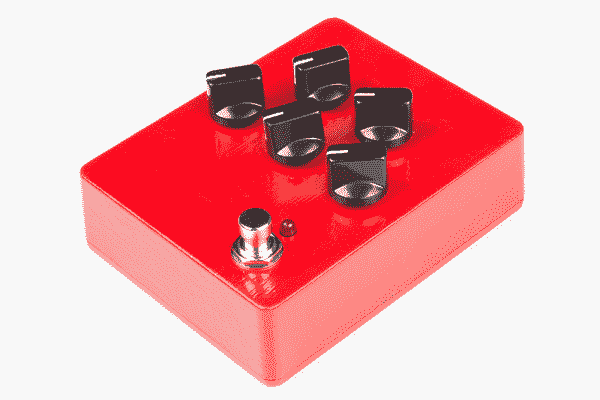
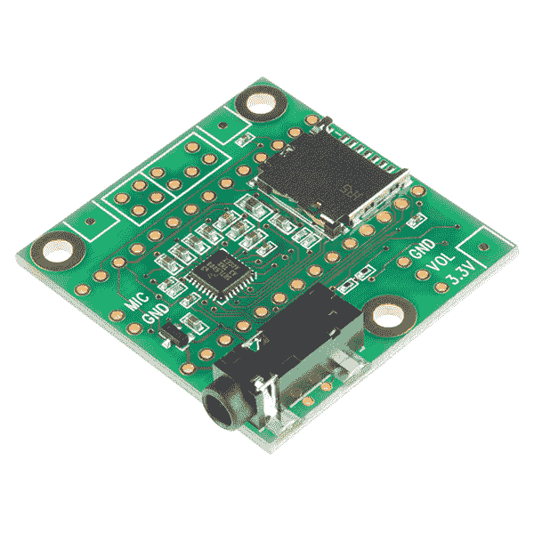
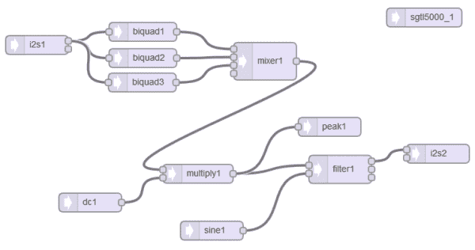
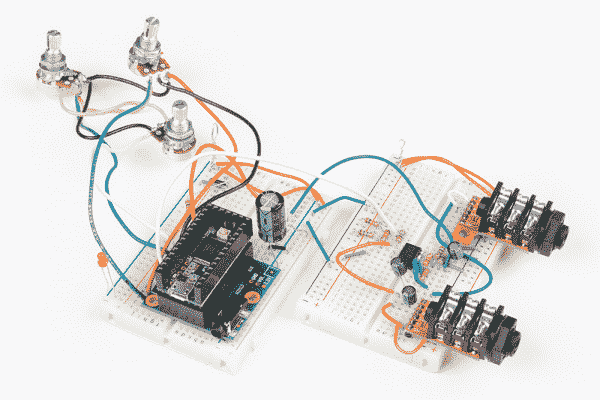
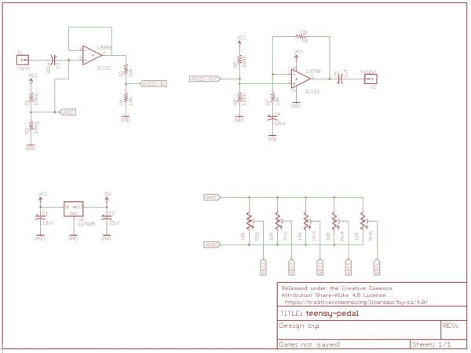
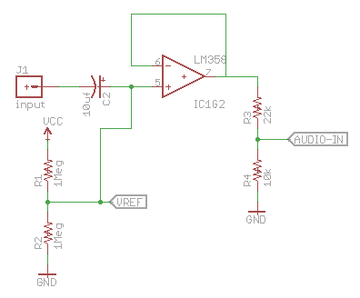
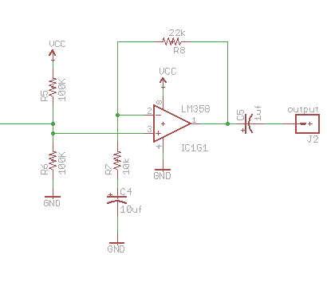
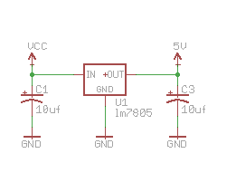

# 原型踏板示例:可编程数字踏板

> 原文：<https://learn.sparkfun.com/tutorials/proto-pedal-example-programmable-digital-pedal>

## 介绍

在[原型踏板组装指南](https://learn.sparkfun.com/tutorials/proto-pedal-assembly-and-theory-guide)中组装好原型踏板后，我们将继续在板上实际构建一个效果电路。这一次，我们将在踏板上放一个 Teensy 3.2 和音频适配器。Teensy 音频库包含一系列构建模块，您可以使用它们来创建自定的数字信号处理踏板。你可以重新编程创造新的音效，而不是单一的效果。

*Reprogrammable digital pedal.*

### 推荐阅读

*   如果你在这里，我们会假设你熟悉[原型踏板装配和理论指南](https://learn.sparkfun.com/tutorials/proto-pedal-assembly-and-theory-guide)。
*   这个项目还假设你熟悉[少年音频库](https://www.pjrc.com/teensy/td_libs_Audio.html)。
*   在阅读本指南的同时，您可能也会对一些关于[准备原型踏板底盘](https://learn.sparkfun.com/tutorials/proto-pedal-chassis-hookup-guide)的信息感兴趣。

## 背景

Teensy 3.2 是一款小型主板，基于功能强大的微控制器飞思卡尔 [Kinetis K20](https://cdn.sparkfun.com/datasheets/Dev/Arduino/Boards/K20P64M72SF1.pdf) 。它可以超频到 96 MHz，具有 Cortex M4 指令集，适合信号处理任务。

*Teensy 3.2.*

Teensy 与 Arduino 兼容，可通过 USB 连接进行编程。如果你使用过任何基于 Arduino 的主板，你已经成功了一部分。

为了帮助利用信号处理指令集，[音频板](https://www.sparkfun.com/products/12767)增加了一个 16 位立体声音频 ADC 和 DAC。

*Teensy Audio Board.*

最重要的是，你不需要成为信号处理专家就可以开始使用音频板。取而代之的是一个基于网络的编辑器，它可以让你在一个拖放的、可拼接的图形用户界面中开始构建信号处理。首先，在 GUI 中组装所需的处理模块，然后将一段代码剪切并粘贴到 Arduino 草图中。

*Sample DSP patch.*

我们假设读者熟悉 Teensy 和音频框架。如果你需要一些额外的背景知识，这里有一个[入门指南。PJRC 还准备了一份](https://www.pjrc.com/teensy/first_use.html)[关于青少年音频环境的详细教程](http://www.pjrc.com/teensy/td_libs_Audio.html)。

### 以踏板形式

我们在这个项目中要做的是将 Teensy 音频与原型踏板配对，从而产生一个可重新编程的数字吉他踏板。

*Prototype Teensy-based pedal.*

### 在开始之前

这是一个复杂的电路！它涉及许多不同类型的布线-模拟、数字和电源电路都包括在内。如果你是制作吉他踏板的新手，这可能不是最好的起点。

其次，电路的噪底性能还有待提高。有相当多的数字外壳是作者一直在努力去除的。*如果你是混合信号系统的降噪大师，我们希望你能仔细看看！*如果您发现我们在匆忙中遗漏了什么，请使用右侧菜单中的[评论链接](https://learn.sparkfun.com/tutorials/proto-pedal-example-programmable-digital-pedal/discuss)通知我们，我们会更新本指南。

最后，如果你喜欢这个项目的想法，但想要现成的硬件，你可能会看到你是否能找到旧的 [Line 6 ToneCore 开发套件](http://line6.com/tcddk/)。

## 该电路

*Teensy-Pedal Schematic (click to enlarge).*

最重要的组件在原理图的中间:耳机和音频适配器。我们用一个简化的符号来表示它们，它只显示我们正在使用的连接。

### 操作理论

我们将快速描述电路各部分的功能。

#### 输入缓冲器

电路的第一部分是输入缓冲器。

它由一级 LM358 运算放大器组成，配置为电压跟随器。它的输入通过一对 1M 的&ohm;电阻偏置到 4.5 VDC，输入信号通过 10 uf 电容耦合到这些电阻。缓冲器的输出与输入信号相匹配——缓冲器增加了输入阻抗，但不会放大或衰减信号。

它提供 500K &ohm;的合理高阻抗，由并联的 1M 电阻定义。1M &ohm;是 SparkFun 电阻器套件中最高值的电阻器——如果你有更高值的电阻器(如 2.2 M &ohm;，它们应该提供更好的性能。

*Input buffer circuit.*

缓冲放大器的输出馈入 R3 和 R4 的分频器，该分频器将信号衰减 10K/(10K + 22K)或 10/32，约为输入值的三分之一。

由于该放大器级直接由 9 VDC 电源供电，因此其峰峰值总裕量约为 9 V [。将输出除以 1/3 可将其限制在 3 Vpp 左右，这与它所馈入的极小线路输入的输入裕量更加匹配。]

#### 输出放大器

Teensy 的输出也有大约 3 Vpp 裕量，我们使用增益为 3 的放大器将其放大回 9 Vpp 范围。

*Output amplifier circuit.*

该同相级的增益由公式`1 + (Rfeedback/Rshunt)`决定，即 32/10，即输入放大器衰减的倒数。这对电路实现了所谓的*单位增益*，组合的结果是乘以 1。进去的和出来的是一样的。

#### 稳压器

Proto 踏板可以在 9 伏电池和墙上适配器的环境下工作，而 Teensy 可以在最大 6 伏直流电下工作。为了帮助弥合这一差距，我们使用一个简单的 LM7805 线性稳压器。

*Voltage regulator.*

它将 9 V 电压变为 5 V 电压，Teensy 的功耗约为 60 mA，调节器将电压降低 4 V，因此该调节器必须消耗约 1/4 瓦的热量。它变得比室温稍热，但不会明显变热。

Teensy 还内置调节器，将 5 V 电压降至 3.3 V。

#### 模拟控制

最后，有五个电位计，连接在 Teensy 3.3V 和 AGND 之间作为分压器。

*Parametric controls.*

这些电位计的游标连接到 Teensy ADC 输入 A1、A2、A3、A6 和 A7。这些控制可以被分配来影响固件中的参数，而不是硬连线到特定的参数。

## 材料

为了制造这个踏板，除了[踏板 PCB](https://www.sparkfun.com/products/13124?_ga=1.7876018.1048173588.1462206339) 和[底盘](https://www.sparkfun.com/products/13967?_ga=1.7876018.1048173588.1462206339)之外，你还需要以下材料。